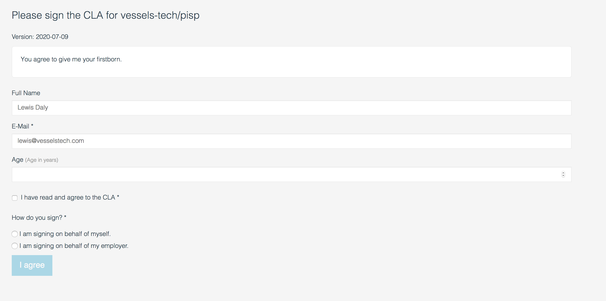

# Signing the CLA

> Note: This document is a work in progress, and is at the moment waiting for the finalized CLA and exact workflow for signing and administering it

Mojaloop has a Contributor Licence Agreement (CLA) which ensures [todo: finish]

To ensure every developer has signed the CLA, or their company has signed it on their behalf, we use [CLA Assistant](https://cla-assistant.io/), a well maintained, open source tool which checks to make sure that a contributor has signed the CLA before allowing a pull request to be merged.

## Signing the CLA - Individuals

1. Open a pull request to any Mojaloop repository
2. When the pull request performs the standard checks, you will see the `license/cla` check has run, and requests users to sign the CLA:


3. Click 'Details', and you will be directed to the CLA Assistant tool, where you can read the CLA, and sign it.


4. Once you have clicked "I agree", navigate back to the Pull request, and see that the CLA Assistant check has passed.


## Signing the CLA - Companies

> Our original plan here was to maintain a separate list and upload it manually to the CLA tool as a `.csv` file. However, we might be able to get away with the "I am signing on behalf of my employer." box in the CLA itself

## Administering the CLA tool

The CLA Tool is very easy to install, any GitHub admin can link it with the Mojaloop organization.

1. Create a new GitHub Gist and enter in the text of the CLA in a new file.
2. Go to [CLA Assistant](https://cla-assistant.io/) and click "Sign in with GitHub"


3. You can add a CLA to either a Repo or Organization. Select "Mojaloop", and then select the gist you just created


4. Hit "Link" and that's it!


### Requesting Additional Information:

> Reference: [request-more-information-from-the-cla-signer](https://github.com/cla-assistant/cla-assistant#request-more-information-from-the-cla-signer)

You can also add a `metadata` file to the CLA gist, to build a custom form for the CLA tool:

```json
{
    "name": {
        "title": "Full Name",
        "type": "string",
        "githubKey": "name"
    },
    "email": {
        "title": "E-Mail",
        "type": "string",
        "githubKey": "email",
        "required": true
    },
    "age": {
        "title": "Age",
        "description": "Age in years",
        "type": "number",
        "minimum": 18,
        "maximum": 99
    },
    "agreement": {
        "title": "I have read and agree to the CLA",
        "type": "boolean",
        "required": true
    },
    "category": {
        "title": "How do you sign?",
        "type": {
            "enum": [
                "I am signing on behalf of myself.",
                "I am signing on behalf of my employer."
            ]
        },
        "required": true
    }
}
```

Produces the following form:


