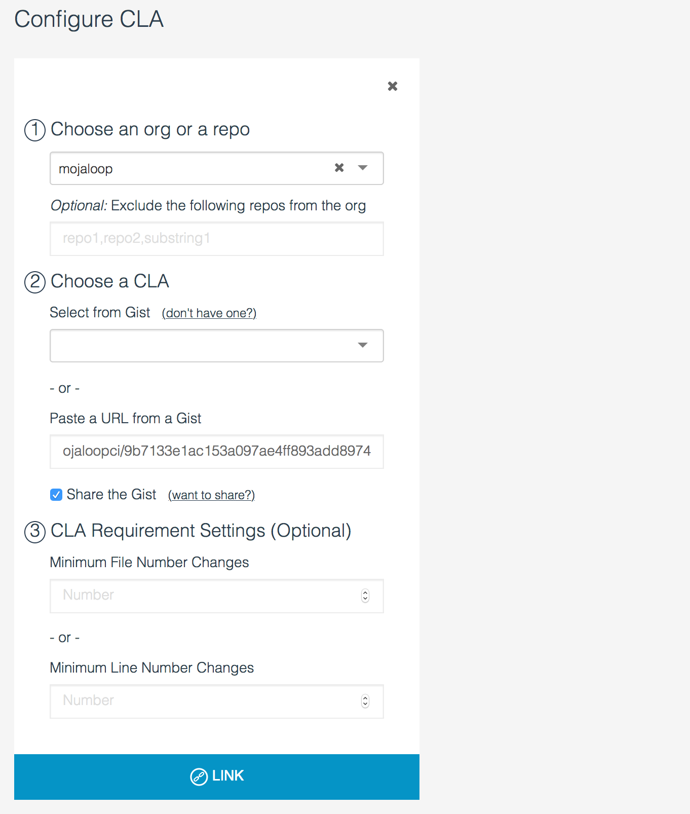

# Signing the CLA

Mojaloop has a [Contributor Licence Agreement (CLA)](https://github.com/mojaloop/mojaloop/blob/master/CONTRIBUTOR_LICENSE_AGREEMENT.md) which clarifies the intelletual property for contributions from individuals or entities.

To ensure every developer has signed the CLA, or their company has signed it on their behalf, we use [CLA Assistant](https://cla-assistant.io/), a well maintained, open source tool which checks to make sure that a contributor has signed the CLA before allowing a pull request to be merged.

## How to sign the CLA

1. Open a pull request to any Mojaloop repository
2. When the pull request performs the standard checks, you will see the `license/cla` check has run, and requests users to sign the CLA:


3. Click 'Details', and you will be directed to the CLA Assistant tool, where you can read the CLA, fill out some personal details, and sign it.


4. Once you have clicked "I agree", navigate back to the Pull request, and see that the CLA Assistant check has passed.


### Signing For A Company

Section 3 of the [Mojaloop CLA](https://github.com/mojaloop/mojaloop/blob/master/CONTRIBUTOR_LICENSE_AGREEMENT.md) covers contributions both from individuals and contributions made by individuals on behalf of their employer. If you are contributing to the Mojaloop Community on behalf of your employer, please type in your employer's name in the "Company or Organization" field. If not, feel free to write "OSS Contributor" and leave the "role" field blank.


## Administering the CLA tool

The CLA Tool is easy to install, any GitHub admin can link it with the Mojaloop organization.

1. Create a new GitHub Gist and enter in the text of the CLA in a new file.
> Since Github doesn't allow Gists to be owned my organizations, [our gist](https://gist.github.com/mojaloopci/9b7133e1ac153a097ae4ff893add8974) is owned by the 'mojaloopci' user.

2. Go to [CLA Assistant](https://cla-assistant.io/) and click "Sign in with GitHub"


3. You can add a CLA to either a Repo or Organization. Select "Mojaloop", and then select the gist you just created


4. Hit "Link" and that's it!


### Requesting Additional Information:

> Reference: [request-more-information-from-the-cla-signer](https://github.com/cla-assistant/cla-assistant#request-more-information-from-the-cla-signer)

You can also add a `metadata` file to the CLA gist, to build a custom form for the CLA tool:

```json
{
    "name": {
        "title": "Full Name",
        "type": "string",
        "githubKey": "name"
    },
    "email": {
        "title": "E-Mail",
        "type": "string",
        "githubKey": "email",
        "required": true
    },
    "country": {
        "title": "Country you are based in",
        "type": "string",
        "required": true
    },
    "company": {
        "title": "Company or Organization",
        "description": "If you're not affiliated with any, please write 'OSS Contributor'",
        "type": "string",
        "required": true
    },
    "role": {
        "title": "Your Role",
        "description": "What is your role in your company/organization? Skip this if you're not affiliated with any",
        "type": "string",
        "required": false
    },
    "agreement": {
        "title": "I have read and agree to the CLA",
        "type": "boolean",
        "required": true
    }
}
```

Produces the following form:


