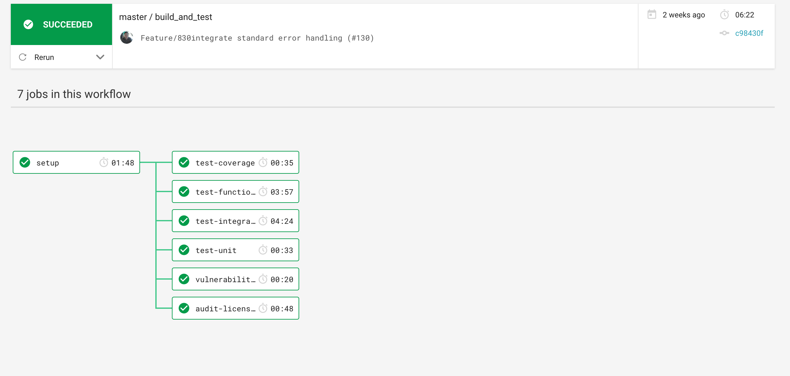
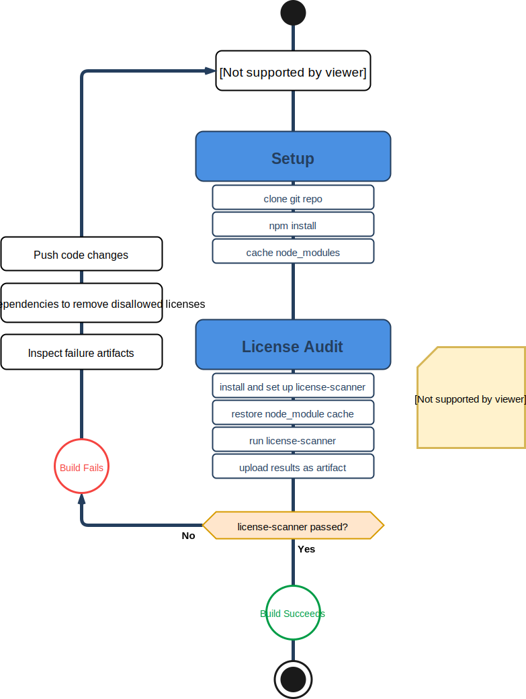
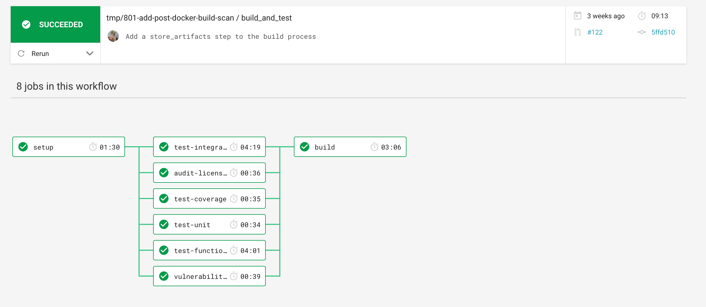
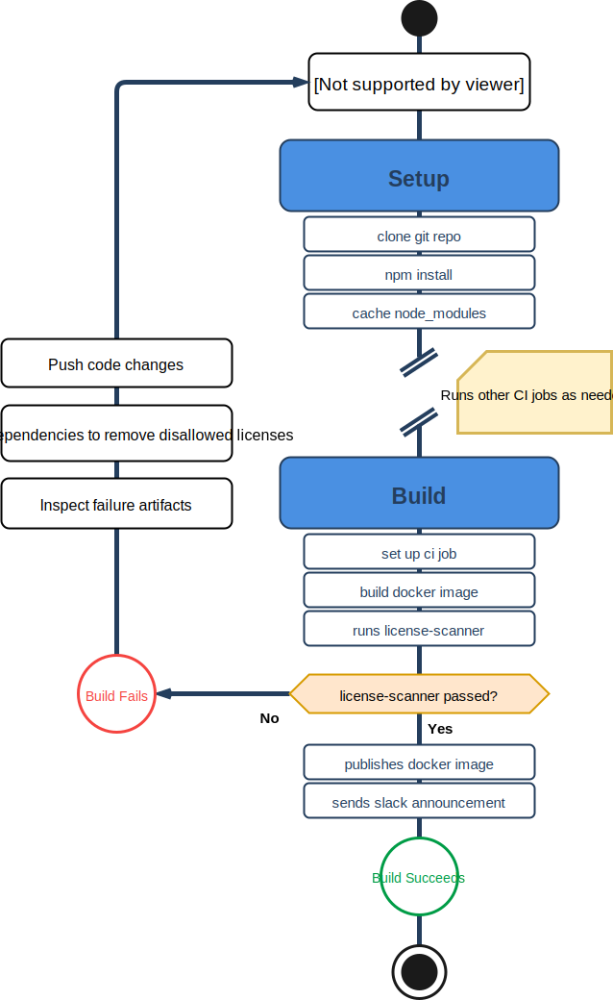

# Automated License Scanning

For Mojaloop to maintain its open source nature and compatibility with the [Mojaloop License](https://github.com/mojaloop/mojaloop/blob/master/contribute/License.md) (Apache 2.0) it needs to be ensured that the project is free from so called 'viral' or 'copyleft' licenses.

## Mojaloop License Scanner

We have a suite of tools bundled under the [license-scanner](https://github.com/mojaloop/license-scanner) project on the Mojaloop Github account. The license-scanner allows us to:
- Perform a license scan across one to many Mojaloop github repositories 
- Integrate with FossaCLI to run mass license audits across the entire codebase
- Run inside of a CI process
- Run a license scan against a pre-built docker image


For more information, refer to the [readme](https://github.com/mojaloop/license-scanner) in the license-scanner repository.


## Blocking and Allowing Licenses

The license-scanner works by blocklisting unwanted licenses, and allowlisting packages which have been manually audited, and we are comfortable with using. 

In the [`config.toml`](https://github.com/mojaloop/license-scanner/blob/master/config.toml) file, we configure two arrays of strings.

__Adding a new License identifier to the blocklist:__

Edit `config.tml`, and add the license string into the `failList` array:
```toml
failList = [
  "UNKNOWN",
  "GPL-1.0",
  "GPL-2.0",
  "GPL-3.0",
  #add your license here
]
```

The license-scanner will pick out licenses that it finds in the `node_modules` folder, and if the license string is in the `failList` (using a fuzzy string search), the license-scanner will fail, unless the package is found in the allowlist.

__Adding a new package to the allowlist:__

In addition to maintaining a blocklist of licenses, we allowlist packages that we have manually audited and are happy to include.
The most common case for this is packages that don't have a license entry in the `package.json` file, which the npm license scan tool lists as `UNKNOWN`.

To add a package to the allowlist, simply add an entry to the `excludeList` in `config.toml`. For example:
```toml
excludeList = [
  "taffydb@2.6.2",
  "buffercursor@0.0.12", # has no license on github or npm
  "cycle@1.0.3",
  "spdx-exceptions@2.2.0",
  #add your package here
]
```

>___FAQ:__ Why keep a allowlist?_
>
>The license-scanner is not perfect, and sometimes there are packages that have been incorrectly identified, or contain no license entry in the `package.json` file, but do contain a valid license in the package's git repository.
>
>By maintaining a allowlist of packages we have manually audited, we can get around incorrectly labelled packages.


## Running Inside CI/CD

### PR Flow

When a new Pull Request is opened for a Mojaloop project, the license scanner runs as a part of the CI/CD workflow. The step in CircleCI is called 'audit-licenses'
</br>


The license-scanner does the following:
1. Sets up the circle ci environment
  * 1. Clones the git repository of the project
  * 2. runs `npm install`
  * 3. caches the `node_modules` folder for later use
2. Runs the audit-licenses step:
  * 1. Clones the license scanner repository to `/tmp` and sets up the scanner
  * 2. Restores the node_module cache
  * 3. Runs the license scanner
  * 4. Uploads the results as a `.csv` artifact


Should the license scanner pass (i.e. find no licenses that are blocklisted), the build will succeed.




### Build Flow

>Note: This step applies only to Mojaloop projects which output docker images on release.

When a new build is initiated (for example, through a new release) the license-scanner also runs as part of the CI build step, after a docker image has been built.

The build flow differs a little from the PR flow, in that it runs against a prebuilt docker image.

>___FAQ:__ Why check the licenses after the build process, when we have already run the license scanner in the PR flow?_  
>
>This step acts a sanity check and a final audit so that we know _(for sure)_ that the resulting docker images don't contain unwanted licenses.
>
>There is a chance, however slim, that the packages that end up in our resulting docker image differ from the packages that we originally ran the license scanner against. This could happen if somebody forgets to copy a `package-lock.json` file in the Dockerfile, or if a dependency hasn't been correctly locked down to a specific version. 





1. Runs through the entire build process as above
2. Runs necessary tests and audit-license steps
3. Runs the Build step
  * 1. Checks out the code and sets up the ci job
  * 2. Builds the docker image
  * 3. Sets up & runs the license scanner
    * 1. Creates a new docker container from the built docker image, and copies across the `node_modules` directory
    * 2. Runs the license scanner tool against the copy of the `node_modules` directory
  * 4. Publishes the docker image
  * 5. Sends a Slack announcement about the new release



