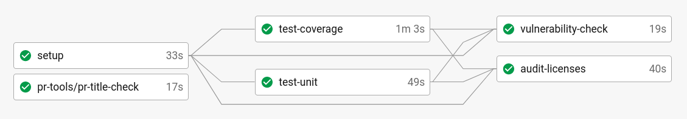
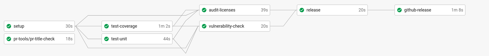
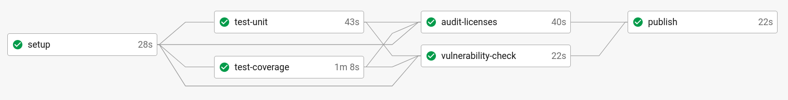
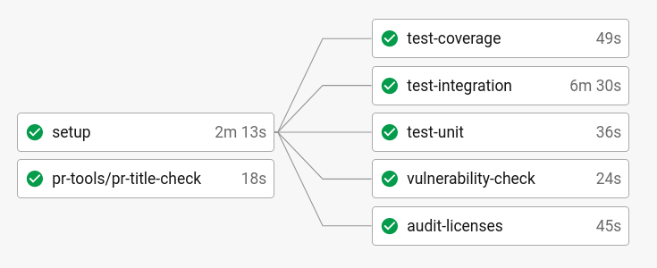
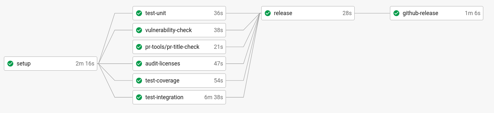
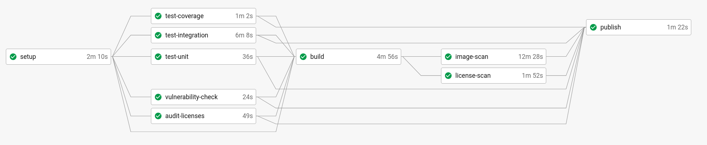

# CI/CD Pipelines

The Mojaloop Community uses [CircleCI](https://circleci.com/) to automatically build, test and deploy our 
software. This document describes how we use CI/CD in Mojaloop, the different checks we perform on the 
software, and how we distribute the software.

Broadly speaking, there are 2 types of workflow we use, depending on the type of project:
- Library: build node project -> test -> publish to [npm](https://www.npmjs.com/search?q=%40mojaloop)
- Service: build docker image -> test -> publish to [Docker Hub](https://hub.docker.com/u/mojaloop)

Additionally, we also maintain a set of [Mojaloop Helm Charts](http://docs.mojaloop.io/helm/), which are 
built from the [mojaloop/helm](https://github.com/mojaloop/helm)

## Libraries

> For a good example of this CI/CD pattern see [central-services-shared](https://github.com/mojaloop/central-services-shared/blob/master/.circleci/config.yml)

### Pull Request (PR) Flow:

The PR flow runs on pull requests, and during the PR review process, these checks must be satisfied
for the code to be merged in.

| Step | Description | More Info |
| ---  | ----------- | --------- |
| pr-title-check  | Checks that the PR title conforms to the conventional commits specification | Defined in a CircleCI orb here: [mojaloop/ci-config](https://github.com/mojaloop/ci-config) |
| test-coverage   | Runs the unit-tests and checks that code coverage is above the specified limit. | Typically this is 90% |
| test-unit       | Runs the unit-tests. Fails if any unit test fails. | |
| vulnerability-check | Runs the `npm audit` tool to search for any vulnerabilities in dependencies | `npm audit` is full of false positives, or security issues that don't apply to our codebase. We use `npm-audit-resolver` to give us flexibility over vulnerabilities that may be ignored, e.g `devDependencies` |
| audit-licenses | Runs the mojaloop `license-scanner-tool` and fails if any license found doesn't match an allowlist specified in the `license-scanner-tool` | [license-scanner-tool repo](https://github.com/mojaloop/license-scanner-tool) |

### Master and Release Flow:

This CI/CD pipeline runs on the master/main branch:

| Step | Description | More Info |
| ---  | ----------- | --------- |
| pr-title-check  | See above | |
| test-coverage   | See above | |
| test-unit       | See above | |
| vulnerability-check | See above | |
| audit-licenses | See above | |
| release | Runs a release which creates a git tag and pushes the git tag | |
| github-release | Adds the release metadata (e.g. changelog) to github, sends a slack alert to #announcements | |

### Tag Flow:

Once a git tag is pushed to the repository, it triggers a workflow that ends 
in publishing to `npm`. Importantly, the checks are all run again, to ensure
nothing has changed (e.g. dependencies) inbetween the main/master and the actual
artefact that is published to `npm`.

| Step | Description | More Info |
| ---  | ----------- | --------- |
| pr-title-check  | See above | |
| test-coverage   | See above | |
| test-unit       | See above | |
| vulnerability-check | See above | |
| audit-licenses | See above | |
| publish | Publishes the latest version of the library based on the git tag | |

## Services

> For a good example of this CI/CD pattern see [central-ledger](https://github.com/mojaloop/central-ledger/blob/master/.circleci/config.yml)

### Pull Request (PR) Flow:

The PR flow runs on pull requests, and during the PR review process, these checks must be satisfied
for the code to be merged in.

| Step | Description | More Info |
| ---  | ----------- | --------- |
| pr-title-check      | Checks that the PR title conforms to the conventional commits specification | Defined in a CircleCI orb here: [mojaloop/ci-config](https://github.com/mojaloop/ci-config) |
| test-coverage       | Runs the unit-tests and checks that code coverage is above the specified limit. | Typically this is 90% |
| test-unit           | Runs the unit-tests. Fails if any unit test fails. | |
| test-integration    | Runs the integration-tests. Typically by building a docker image locally | |
| vulnerability-check | Runs the `npm audit` tool to search for any vulnerabilities in dependencies | `npm audit` is full of false positives, or security issues that don't apply to our codebase. We use `npm-audit-resolver` to give us flexibility over vulnerabilities that may be ignored, e.g `devDependencies` |
| audit-licenses | Runs the mojaloop `license-scanner-tool` and fails if any license found doesn't match an allowlist specified in the `license-scanner-tool` | [license-scanner-tool repo](https://github.com/mojaloop/license-scanner-tool) |

### Master and Release Flow:

This CI/CD pipeline runs on the master/main branch:

| Step | Description | More Info |
| ---  | ----------- | --------- |
| pr-title-check  | See above | |
| test-coverage   | See above | |
| test-unit       | See above | |
| test-integration | See above | |
| vulnerability-check | See above | |
| audit-licenses | See above | |
| release | Runs a release which creates a git tag and pushes the git tag | |
| github-release | Adds the release metadata (e.g. changelog) to github, sends a slack alert to #announcements | |

### Tag Flow:

Once a git tag is pushed to the repository, it triggers a workflow that ends 
in publishing a docker image to Docker Hub. Importantly, the checks are all run again,
and further scans are made on the docker image before the image is pushed.

| Step | Description | More Info |
| ---  | ----------- | --------- |
| pr-title-check      | See above | |
| test-coverage       | See above | |
| test-unit           | See above | |
| vulnerability-check | See above | |
| audit-licenses      | See above | |
| build               | Builds the docker image | |
| image-scan          | Runs `anchore/analyze_local_image` to scan the image | See [anchore-engine](https://circleci.com/developer/orbs/orb/anchore/anchore-engine) CircleCI Orb for more information. |
| license-scan        | Runs the mojaloop `license-scanner-tool` on the licenses contained in the docker image | |
| publish | Publishes the latest version of the library based on the git tag | |
