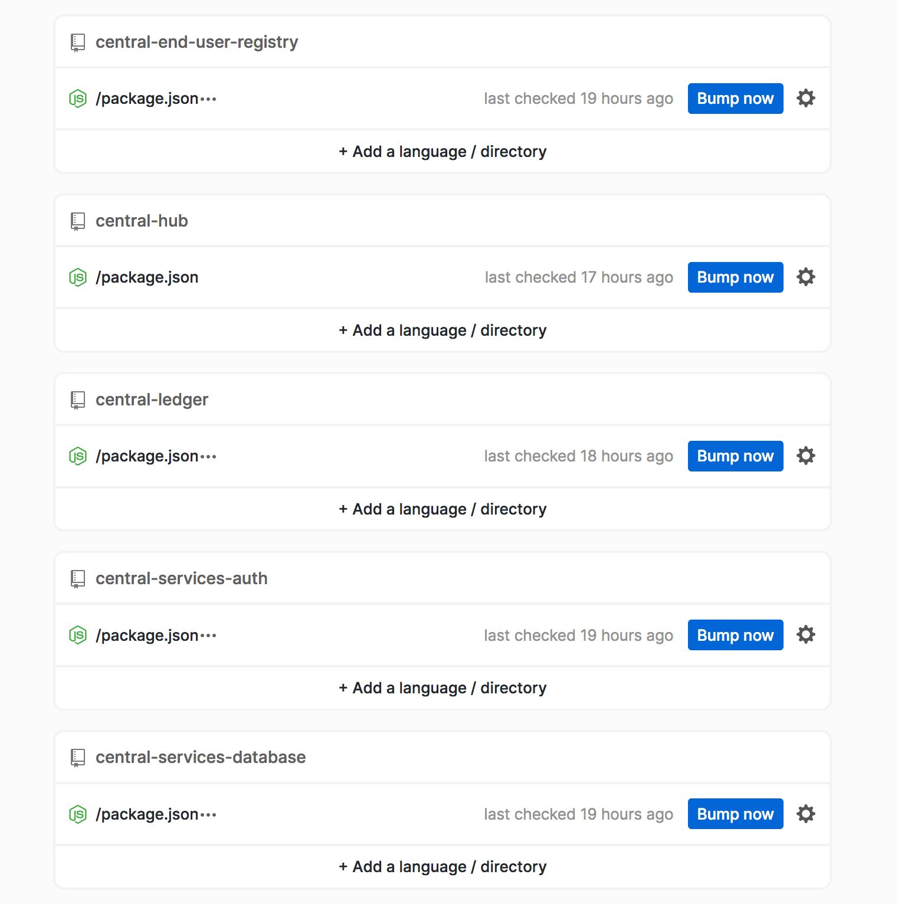
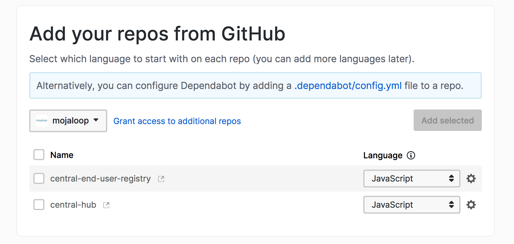
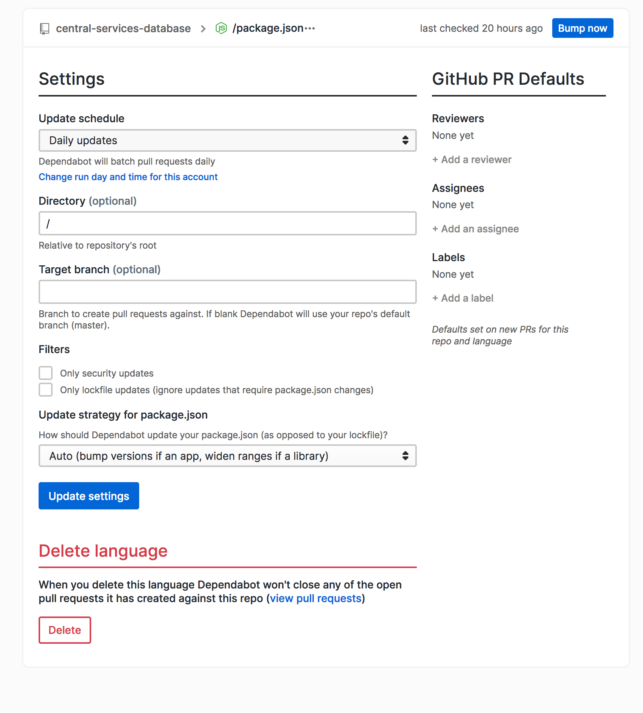

# Dependabot

>_Note: This guide is for maintainers of Mojaloop projects with admin access to the github repositories_

We use [Dependabot](https://dependabot.com) to help manage updates to our NodeJS dependencies in the `package.json` files of each project.

Dependabot scans each repository, and creates new pull requests to bump package versions automatically.

Follow this guide to help manage the settings for Dependabot on each repository.

## Signing In to Dependabot

You can sign in to Dependabot using your own Github account.

1. Go to [dependabot.com](https://dependabot.com) and sign in with your github account
2. Add an account for your Mojaloop.
3. Navigate to Mojaloop, and you will see all the repository listed.

## Adding a Repository

If you have created a new repository and want to add it to Dependabot:

1. Click the "Add Repos" button in the top left corner

2. If your new repository is in the list, simply tick the box and click "Add Selected"
3. If your new repository is not in the list you may need to click "Grant Access to Additional Repos". This will take you to Github, where you can give access to Dependabot by selecting new repositories.

## Removing a Repository

If you want to change the Dependabot settings for a given repository, or remove it completely from Dependabot:

1. From the list of Dependabot repositories, click the gear icon in the top right corner
2. Here you can modify different settings, such as the frequency of new pull requests, default reviewers etc.

3. Scroll to "Delete Language" and click "Delete". Follow the steps to remove the repository. 

>_Note: This won't close any existing Pull Requests that Dependabot has opened, so make sure you manually close them_