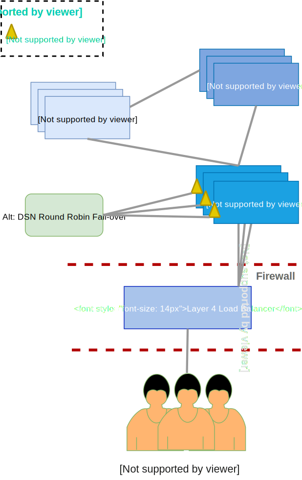

# Mojaloop Deployment

The document is intended for an audience with a stable technical knowledge that would like to setup an environment for development, testing and contributing to the Mojaloop project.

## Deployment and Setup

- [Mojaloop Deployment](#mojaloop-deployment)
  - [Deployment and Setup](#deployment-and-setup)
    - [1. Pre-requisites](#1-pre-requisites)
    - [2. Deployment Recommendations](#2-deployment-recommendations)
    - [3. Kubernetes](#3-kubernetes)
      - [3.1. Kubernetes Ingress Controller](#31-kubernetes-ingress-controller)
      - [3.2. Kubernetes Admin Interfaces](#32-kubernetes-admin-interfaces)
    - [4. Helm](#4-helm)
      - [4.1. Helm configuration](#41-helm-configuration)
    - [5. Mojaloop](#5-mojaloop)
      - [5.1. Mojaloop Helm Deployment](#51-mojaloop-helm-deployment)
      - [5.2. Verifying Ingress Rules](#52-verifying-ingress-rules)
      - [5.3. Testing Mojaloop](#53-testing-mojaloop)
      - [5.4. Testing Mojaloop with Postman](#54-testing-mojaloop-with-postman)
    - [6. Overlay Services (3PPI) Support](#overlay-services)
      - [6.1 Configuring a deployment for Third Party API support](#configuring-a-deployment)
      - [6.2 Validating and Testing the Third Party API](#validating-and-testing)
### 1. Pre-requisites

Versions numbers below are hard requirements, not just recommendations (more recent versions are known not to work).

A list of the pre-requisite tool set required for the deployment of Mojaloop:

- **Kubernetes** An open-source system for automating deployment, scaling, and management of containerized applications. Find out more about [Kubernetes](https://kubernetes.io).
  - Recommended Versions:
   <br>&nbsp;&nbsp;&nbsp;&nbsp;**Mojaloop Helm Chart release v13.x** supports **Kubernetes v1.13 - v1.20**.
   <br>&nbsp;&nbsp;&nbsp;&nbsp;**Mojaloop Helm Chart release v12.x** supports **Kubernetes v1.13 - v1.20**.
   <br>&nbsp;&nbsp;&nbsp;&nbsp;**Mojaloop Helm Chart release v11.x** supports **Kubernetes v1.13 - v1.17**.
   <br>&nbsp;&nbsp;&nbsp;&nbsp;**Mojaloop Helm Chart release v10.x** supports **Kubernetes v1.13 - v1.15**, it will fail on Kubernetes v1.16+ onwards due deprecated APIs ([ref: Helm Issue #219](https://github.com/mojaloop/helm/issues/219)).
  - kubectl - Kubernetes CLI for Kubernetes Management is required. Find out more about [kubectl](https://kubernetes.io/docs/reference/kubectl/overview/):
    - [Install-kubectl](https://kubernetes.io/docs/tasks/tools/install-kubectl/),
  - microk8s - MicroK8s installs a barebones upstream Kubernetes for a single node deployment generally used for local development. We recommend this installation on Linux (ubuntu) OS. Find out more about [microk8s](https://microk8s.io/) and [microk8s documents](https://microk8s.io/docs/):
    - [Install-microk8s](https://microk8s.io/docs/),
  - kubectx - Not required but useful. Find out more about [kubectx](https://github.com/ahmetb/kubectx),
  - kubetail - Not required but useful. Bash script that enables you to aggregate (tail/follow) logs from multiple pods into one stream. Find out more about [kubetail](https://github.com/johanhaleby/kubetail),
- **Docker** Provides containerized environment to host the application. Find out more about [Docker](https://docker.com),
- **Helm** A package manager for Kubernetes. Find out more about [Helm](https://helm.sh),
   <br>_Recommended Versions:_
   <br>&nbsp;&nbsp;&nbsp;&nbsp;_**Helm v3.x** ([ref: Design Auth Issue #52](https://github.com/mojaloop/design-authority/issues/52))._
- **Postman** Postman is a Google Chrome application for the interacting with HTTP API's. It presents you with a friendly GUI for the construction requests and reading responces. <https://www.getpostman.com/apps>. Find out more about [Postman](https://postman.com).

For **local guides** on how to setup the pre-requisites on your laptop or desktop, refer to the appropriate link document below;

- [Local Setup for Mac](local-setup-mac.md)
- [Local Setup for Linux](local-setup-linux.md)
- [Local Setup for Windows](local-setup-windows.md)

### 2. Deployment Recommendations

This provides environment resource recommendations with a view of the infrastructure architecture.

**Resources Requirements:**

- Control Plane (i.e. Master Node)
  
  [https://kubernetes.io/docs/setup/cluster-large/#size-of-master-and-master-components](https://kubernetes.io/docs/setup/cluster-large/#size-of-master-and-master-components)

  - 3x Master Nodes for future node scaling and HA (High Availability)

- ETCd Plane:

  [https://etcd.io/docs/v3.3.12/op-guide/hardware](https://etcd.io/docs/v3.3.12/op-guide/hardware)

  - 3x ETCd nodes for HA (High Availability)

- Compute Plane (i.e. Worker Node):

  TBC once load testing has been concluded. However the current general recommended size:

  - 3x Worker nodes, each being:
    - 4x vCPUs, 16GB of RAM, and 40gb storage

  **Note** that this would also depend on your underlying infrastructure, and it does NOT include requirements for persistent volumes/storage.



### 3. Kubernetes

This section will guide the reader through the deployment process to setup Kubernetes.

If you are new to Kubernetes it is strongly recommended to familiarize yourself with Kubernetes. [Kubernetes Concepts](https://kubernetes.io/docs/concepts/overview/) is a good place to start and will provide an overview.

The following are Kubernetes concepts used within the project. An understanding of these concepts is imperative before attempting the deployment;

- Deployment
- Pod
- ReplicaSets
- Service
- Ingress
- StatefulSet
- DaemonSet
- Ingress Controller
- ConfigMap
- Secret

Insure **kubectl** is installed. A complete set of installation instruction are available [here](https://kubernetes.io/docs/tasks/tools/install-kubectl/).

#### 3.1. Kubernetes Ingress Controller

Install your preferred Ingress Controller for load-balancing and external access.

Refer to the following documentation to install the Nginx-Ingress Controller used for this guide: <https://kubernetes.github.io/ingress-nginx/deploy/#using-helm>. It is recommended that you install **v0.47.0** of the Nginx-Ingress Controller due to recent changes being made to support Kubernetes v1.22.

If you are using helm, this can be done as follows:

```bash
$ helm install ingress-nginx ingress-nginx/ingress-nginx --version="3.33.0"
```

> **NOTE: If you are installing Mojaloop v12.x with an Nginx-Ingress controller version newer than v0.22.0, ensure you create a custom [Mojaloop values config](https://github.com/mojaloop/helm/blob/v12.0.0/mojaloop/values.yaml) with the following changes prior to install:**
>
> ```YAML
> ## **LOOK FOR THIS LINE IN mojaloop/values.yaml CONFIG FILE**
> mojaloop-simulator:
>   ingress:
>    ## nginx ingress controller >= v0.22.0 <-- **COMMENT THE FOLLOWING THREE LINES BELOW:**
>    # annotations: <-- COMMENTED
>    #  nginx.ingress.kubernetes.io/rewrite-target: '/$2' <-- COMMENTED
>    # ingressPathRewriteRegex: (/|$)(.*) <-- COMMENTED
>
>    ## nginx ingress controller < v0.22.0 <-- **UNCOMMENT THE FOLLOWING THREE LINES BELOW:**
>    annotations:
>      nginx.ingress.kubernetes.io/rewrite-target: '/'
>    ingressPathRewriteRegex: "/"
> ```
>
> **This is NOT necessary if you are installing Mojaloop v13.x or newer.**

List of alternative Ingress Controllers: <https://kubernetes.io/docs/concepts/services-networking/ingress-controllers/>.

#### 3.2. Kubernetes Admin Interfaces

1. Kubernetes Dashboards

   The official Kubernetes Web UI Admin interface.

   Visit the following link for installation instructions (not needed if **MicroK8s** is installed): [Web UI (Dashboard) Installation Instructions](https://kubernetes.io/docs/tasks/access-application-cluster/web-ui-dashboard/).

   **IMPORTANT:** Ensure (not needed if **MicroK8s** is installed) you configure RBAC roles and create an associated service account, refer to the following example on how to create a sample user for testing purposes only: [Creating sample user](https://github.com/kubernetes/dashboard/blob/master/docs/user/access-control/creating-sample-user.md).

   If you have installed MicroK8s, **enable the MicroK8s** dashboard:

   ```bash
   microk8s.enable dashboard
   ```

   Refer to the following link for more information: [Add-on: dashboard](https://microk8s.io/docs/addon-dashboard).

   **Remember** to prefix all **kubectl** commands with **microk8s** if you opted not to create an alias.

2. k8sLens

   A local desktop GUI based kubectl alternative which is easy to install and setup.

   Visit the following link for more information: <https://k8slens.dev/>.

### 4. Helm

Please review [Mojaloop Helm Chart](../repositories/helm.md) to understand the relationships between the deployed Mojaloop helm charts.

Refer to the official documentation on how to install the latest version of Helm: <https://helm.sh/docs/intro/install/>.

Refer to the following document if are using Helm v2: [Deployment with (Deprecated) Helm v2](./helm-legacy-deployment.md).

Refer to the [Helm v2 to v3 Migration Guide](./helm-legacy-migration.md) if you wish to migrate an existing Helm v2 deployment to v3.

#### 4.1. Helm configuration

1. Add mojaloop repo to your Helm config:

   ```bash
   helm repo add mojaloop   https://mojaloop.io/helm/repo/
   ```

   If the repo already exists, substitute 'add' with 'apply' in the above command.

2. Update helm repositories:

   ```bash
   helm repo update
   ```

### 5. Mojaloop

#### 5.1. Mojaloop Helm Deployment

1. Install Mojaloop:

   1.1. Installing latest version:

   ```bash
   helm --namespace demo install moja mojaloop/mojaloop --create-namespace 
   ```

   Or if you require a customized configuration:

   ```bash
   helm --namespace demo install moja mojaloop/mojaloop --create-namespace -f {custom-values.yaml}
   ```

   _Note: Download and customize the [values.yaml](https://github.com/mojaloop/helm/blob/master/mojaloop/values.yaml). Also ensure that you are using the value.yaml from the correct version which can be found via [Helm Releases](https://github.com/mojaloop/helm/releases). You can confirm the installed version by using the following command: `helm --namespace demo list`. Under the **CHART** column, you should see something similar to 'mojaloop-**{version}**' with **{version}** being the deployed version._

   ```bash
    $ helm -n demo list
    NAME            NAMESPACE       REVISION        UPDATED                                 STATUS          CHART
    moja            demo            1               2021-06-11 15:06:04.533094 +0200 SAST   deployed        mojaloop-{version}
   ```

   _Note: The `--create-namespace` flag is only necessary if the `demo` namespace does not exist. You can alternatively create it using the following command: `kubectl create namespace demo`._

   1.2. Version specific installation:

   ```bash
   helm --namespace demo install moja mojaloop/mojaloop --create-namespace --version {version}
   ```

   1.3. List of Mojaloop releases:

   ```bash
    $ helm search repo mojaloop/mojaloop -l
    NAME                            CHART VERSION   APP VERSION                 DESCRIPTION                                      
    mojaloop/mojaloop               {version}       {list of app-versions}      Mojaloop Helm chart for Kubernetes
    ...                             ...             ...                         ...
   ```

#### 5.2. Verifying Ingress Rules

1. Update your /etc/hosts for local deployment:

   _Note: This is only applicable for local deployments, and is not needed if custom DNS or ingress rules are configured in a customized [values.yaml](https://github.com/mojaloop/helm/blob/master/mojaloop/values.yaml)_.

   ```bash
   vi /etc/hosts
   ```

   _Windows the file can be updated in notepad - need to open with Administrative privileges. File location `C:\Windows\System32\drivers\etc\hosts`_.

   Include the following lines (_or alternatively combine them_) to the host config.

   The below required config is applicable to Helm release >= versions 6.2.2 for Mojaloop API Services;

   ```text
    # Mojaloop Demo
    127.0.0.1   ml-api-adapter.local central-ledger.local account-lookup-service.local account-lookup-service-admin.local quoting-service.local central-settlement-service.local transaction-request-service.local central-settlement.local bulk-api-adapter.local moja-simulator.local sim-payerfsp.local sim-payeefsp.local sim-testfsp1.local sim-testfsp2.local sim-testfsp3.local sim-testfsp4.local mojaloop-simulators.local finance-portal.local operator-settlement.local settlement-management.local testing-toolkit.local testing-toolkit-specapi.local
   ```

2. Test system health in your browser after installation. This will only work if you have an active helm chart deployment running.

   _Note: The examples below are only applicable to a local deployment. The entries should match the DNS values or ingress rules as configured in the [values.yaml](https://github.com/mojaloop/helm/blob/master/mojaloop/values.yaml) or otherwise matching any custom ingress rules configured_.

   **ml-api-adapter** health test: <http://ml-api-adapter.local/health>

   **central-ledger** health test: <http://central-ledger.local/health>

#### 5.3. Testing Mojaloop

The [Mojaloop Testing Toolkit](../../documentation/mojaloop-technical-overview/ml-testing-toolkit/README.md) (**TTK**) is used for testing deployments, and has been integrated into Helm utilizing its CLI to easily test any Mojaloop deployment.

1. Validating Mojaloop using Helm

   ```bash
   helm -n demo test moja
   ```

   Or with logs printed to console

   ```bash
   helm -n demo test moja --logs
   ```

   This will automatically execute the following [test cases](https://github.com/mojaloop/testing-toolkit-test-cases) using the [Mojaloop Testing Toolkit](../../documentation/mojaloop-technical-overview/ml-testing-toolkit/README.md) (**TTK**) CLI:

   - [TTK Hub setup and Simulator Provisioning Collection](https://github.com/mojaloop/testing-toolkit-test-cases/tree/master/collections/hub/provisioning).

   Use the following command to view the provisioning Collection logs:

   ```bash
   kubectl -n demo logs pod/moja-ml-ttk-test-setup
   ```

   - [TTK Golden Path Test Collection](https://github.com/mojaloop/testing-toolkit-test-cases/tree/master/collections/hub/golden_path).

   Use the following command to view the Golden Path Collection logs:

   ```bash
    kubectl -n demo logs pod/moja-ml-ttk-test-validation
   ```

   Example of the finally summary being displayed from the Golden Path test collection log output:

   ```text
    Test Suite:GP Tests
    Environment:Development
    ┌───────────────────────────────────────────────────┐
    │                      SUMMARY                      │
    ├───────────────────┬───────────────────────────────┤
    │ Total assertions  │ 1557                          │
    ├───────────────────┼───────────────────────────────┤
    │ Passed assertions │ 1557                          │
    ├───────────────────┼───────────────────────────────┤
    │ Failed assertions │ 0                             │
    ├───────────────────┼───────────────────────────────┤
    │ Total requests    │ 297                           │
    ├───────────────────┼───────────────────────────────┤
    │ Total test cases  │ 61                            │
    ├───────────────────┼───────────────────────────────┤
    │ Passed percentage │ 100.00%                       │
    ├───────────────────┼───────────────────────────────┤
    │ Started time      │ Fri, 11 Jun 2021 15:45:53 GMT │
    ├───────────────────┼───────────────────────────────┤
    │ Completed time    │ Fri, 11 Jun 2021 15:47:25 GMT │
    ├───────────────────┼───────────────────────────────┤
    │ Runtime duration  │ 91934 ms                      │
    └───────────────────┴───────────────────────────────┘
    TTK-Assertion-Report-multi-2021-06-11T15:47:25.656Z.html was generated
   ```

2. Accessing the Mojaloop Testing Toolkit UI

   Open the following link in a browser: <http://testing-toolkit.local>.

   One is able to manually load and execute the Testing Toolkit Collections using the UI which allows one to visually inspect the requests, responses and assertions in more detail. This is a great way to learn more about Mojaloop.

   Refer to the [Mojaloop Testing Toolkit Documentation](../../documentation/mojaloop-technical-overview/ml-testing-toolkit/README.md) for more information and guides.

#### 5.4. Testing Mojaloop with Postman

[Postman](https://www.postman.com/downloads) can be used as an alternative to the [Mojaloop Testing Toolkit](../../documentation/mojaloop-technical-overview/ml-testing-toolkit/README.md). Refer to the [Automated Testing Guide](../contributors-guide/tools-and-technologies/automated-testing.md) for more information.

The available [Mojaloop Postman Collections](https://github.com/mojaloop/postman) are similar to the [Mojaloop Testing Toolkit's Test Cases](https://github.com/mojaloop/testing-toolkit-test-cases)'s as follows:

| Postman Collection | Mojaloop Testing Toolkit | Description |
|---------|----------|---------|
| [MojaloopHub_Setup Postman Collection](https://github.com/mojaloop/postman/blob/master/MojaloopHub_Setup.postman_collection.json) and [MojaloopSims_Onboarding](https://github.com/mojaloop/postman/blob/master/MojaloopSims_Onboarding.postman_collection.json) | [TTK Hub setup and Simulator Provisioning Collection](https://github.com/mojaloop/testing-toolkit-test-cases/tree/master/collections/hub/provisioning) | Hub Setup and Simulator Provisioning |
| [Golden_Path_Mojaloop](https://github.com/mojaloop/postman/blob/master/Golden_Path_Mojaloop.postman_collection.json) | [TTK Golden Path Test Collection](https://github.com/mojaloop/testing-toolkit-test-cases/tree/master/collections/hub/golden_path) | Golden Path Tests |

Pre-requisites:

- The following postman environment file should be imported or customized as required when running the above listed Postman collections: [Mojaloop-Local-MojaSims.postman_environment.json](https://github.com/mojaloop/postman/blob/master/environments/Mojaloop-Local-MojaSims.postman_environment.json).
- Ensure you download the **latest patch release version** from the [Mojaloop Postman Git Repository Releases](https://github.com/mojaloop/postman/releases). For example if you install Mojaloop v12.0.**X**, ensure that you have the latest Postman collection patch version v12.0.**Y**.


### <a id='overlay-services'></a>6. Overlay Services/3PPI

As of release v13.1.0 of [mojaloop/helm](https://github.com/mojaloop/helm), Mojaloop supports the Third Party API,
which allows Third Party Payment Initiators (3PPIs) the ability to request an account link from a DFSP and initiate
payments on behalf of users.

Learn more about 3PPI:
- Mojaloop's [Third Party API](https://github.com/mojaloop/mojaloop-specification/tree/master/thirdparty-api)
- 3rd Party Use Cases: 
  - [3rd Party Account Linking](https://sandbox.mojaloop.io/usecases/3ppi-account-linking.html)
  - [3rd Party Initiated Payments](https://sandbox.mojaloop.io/usecases/3ppi-transfer.html)


#### <a id='configuring-a-deployment'></a>6.1 Configuring a deployment for Third Party API support

Third Party API support is **off** by default on the Mojaloop deployment. You can enable it by editing your `values.yaml`
file with the following settings:

```yaml
...
account-lookup-service:
  account-lookup-service:
    config:
      featureEnableExtendedPartyIdType: true # allows the ALS to support newer THIRD_PARTY_LINK PartyIdType

  account-lookup-service-admin:
    config:
      featureEnableExtendedPartyIdType: true # allows the ALS to support newer THIRD_PARTY_LINK PartyIdType

...

thirdparty:
  enabled: true
...
```

In addition, the Third Party API has a number of dependencies that must be deployed manually for the thirdparty services
to run. [mojaloop/helm/thirdparty](https://github.com/mojaloop/helm/tree/master/thirdparty) contains details of these
dependencies, and also provides example k8s config files that install these dependencies for you.


```bash
# install redis and mysql for the auth-service
kubectl apply --namespace demo -f https://raw.githubusercontent.com/mojaloop/helm/master/thirdparty/chart-auth-svc/example_dependencies.yaml
# install mysql for the consent oracle
kubectl apply --namespace demo -f https://raw.githubusercontent.com/mojaloop/helm/master/thirdparty/chart-consent-oracle/example_dependencies.yaml

# apply the above changes to your values.yaml file, and update your mojaloop installation to deploy thirdparty services:
helm upgrade --install --namespace demo moja mojaloop/mojaloop -f values.yaml
```

Once the helm upgrade has completed, you can verify that the third party services are up and running:


```bash
kubectl get po | grep tp-api 
# tp-api-svc-b9bf78564-4g59d                                        1/1     Running   0          7m17s

kubectl get po | grep auth-svc
#auth-svc-b75c954d4-9vq7w                                          1/1     Running   0          8m5s

kubectl get po | grep consent-oracle
# consent-oracle-849cb69769-vq4rk                                   1/1     Running   0          8m31s


# and also make sure the ingress is exposed correctly
curl -H "Host: tp-api-svc.local" <ingress ip address>/health
# {"status":"OK","uptime":3545.77290063,"startTime":"2021-11-04T05:41:32.861Z","versionNumber":"11.21.0","services":[]}

curl -H "Host: auth-service.local" <ingress ip address>/health

# {"status":"OK","uptime":3682.48869561,"startTime":"2021-11-04T05:43:19.056Z","versionNumber":"11.10.1","services":[]}

curl -H "Host: consent-oracle.local" <ingress ip address>/health
# {"status":"OK","uptime":3721.520096665,"startTime":"2021-11-04T05:43:48.382Z","versionNumber":"0.0.8","services":[]}
```

> You can also add the following entries to your `/etc/hosts` file to make it easy to talk to the thirdparty services
> ```
> <ingress ip address> tp-api-svc.local auth-service.local consent-oracle.local
> ```

#### <a id='validating-and-testing'></a>6.2 Validating and Testing the Third Party API

Once you have deployed the Third Party services, you need to deploy some simulators that are capable of simulating
the Third Party scenarios.


##### 6.2.1 Deploying the Simulators

Once again, you can do this by modifying your `values.yaml` file, this time under the `mojaloop-simulator` entry:

```yaml
...

mojaloop-simulator:
  simulators:
  ...
    pisp:
      config:
        thirdpartysdk:
          enabled: true
    dfspa:
      config:
        thirdpartysdk:
          enabled: true
    dfspb: {}
...
```

The above entry will create 3 new sets of mojaloop simulators:

1. `pisp` - a PISP
2. `dfspa` - a DFSP that supports the Third Party API
3. `dfspb` - a normal DFSP simulator that doesn't support the Third Party API, but can receive payments


##### 6.2.2 Provisioning the Environment

Once the above simulators have been deployed and are up and running, it's time to configure the Mojaloop Hub
and simulators so we can test the Third Party API.

Use the [Third Party Provisioning Collection](https://github.com/mojaloop/testing-toolkit-test-cases#third-party-provisioning-collection)
from the mojaloop/testing-toolkit-test cases to provision the Third Party environment and the simulators
you set up in the last step.

##### 6.2.3 Run the Third Party API Test Collection

Once the provisioning steps are completed, you can run the [Third Party Test Collection](https://github.com/mojaloop/testing-toolkit-test-cases#third-party-test-collection)
to test that the Third Party services are deployed and configured correctly.