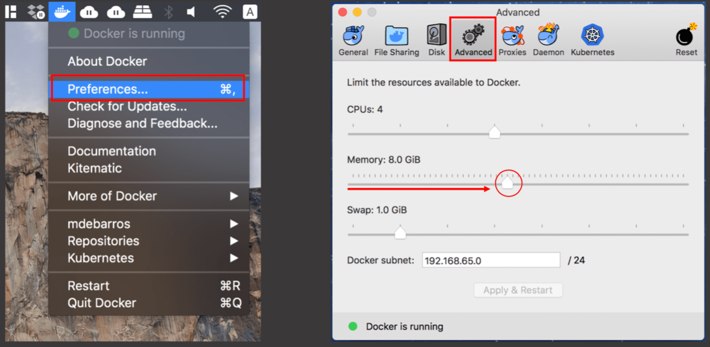
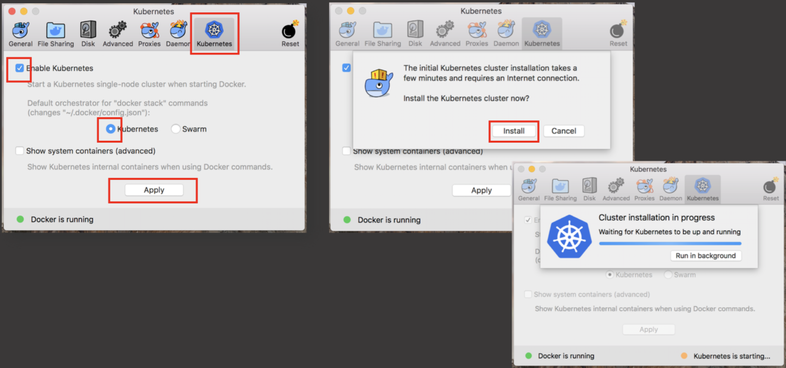

# Mojaloop local environment setup for Mac

Local setup on a Laptop or Desktop to run the Mojaloop project.

## Setup Introduction

This document will provide guidelines to a technical capable resources to setup, deploy and configure the Mojaloop applications on a local environment, utilizing Docker, Kubernetes and HELM charts.

At this point the reader/implementer should be familiar with [Mojaloop's deployment guide](./README.md). Imported information is contained in that document and as such a prerequisite to this document.

* [Local Deployment](local-setup-mac.md#local-deployment)
  * [Kubernetes](local-setup-mac.md#1-kubernetes)
    * [Kubernetes Installation with Docker](local-setup-mac.md#11-kubernetes-installation-with-docker)
    * [Kubernetes environment setup](local-setup-mac.md#12-kubernetes-environment-setup)


## 1. Kubernetes

This section will guide the reader through the deployment process to setup Kubernetes within Docker.

If you are new to Kubernetes it is strongly recommended to familiarize yourself with Kubernetes. [Kubernetes Concepts](https://kubernetes.io/docs/concepts/overview/) is a good place to start and will provide an overview.

The following are Kubernetes concepts used within the project. An understanding of these concepts is imperative before attempting the deployment;

* Deployment
* Pod
* ReplicaSets
* Service
* Ingress
* StatefulSet
* DaemonSet
* Ingress Controller
* ConfigMap
* Secret

### 1.1. Kubernetes Installation with Docker

* **kubectl** Complete set of installation instruction are available [here](https://kubernetes.io/docs/tasks/tools/install-kubectl/) 

  ```bash
  brew install kubernetes-cli
  ```
  To verify if the installation was successful, check the version;

  ```bash
  kubectl version
  ```

To install Kubernetes with Docker, follow the steps below;

* Click on the Docker icon on the status barr
  * Select **Preferences**
  * Go to **Advanced**
    * Increase the CPU allocation to at least 4
    * Increase the Memory allocation to at least 8.0 GiB



* Go to **Kubernetes**
  * Select **Enable Kubernetes** tick box
  * Make sure **Kubernetes** is selected
  * Click **Apply**
  * Click **Install** on the confirmation tab. 
  * The option is available to wait for completion or run as a background task.



### 1.2. Kubernetes environment setup:

1. List the current Kubernetes context;
   ```bash
   kubectl config get-contexts
   ```
   
   **or**
   ```bash
   kubectx
   ```
2. Change your Contexts;
   ```bash
   kubectl config use-context docker-for-desktop
   ```

   **or**
   ```bash
   kubectx docker-for-desktop
   ```

3. Continue setup and configuration from the Kubernetes Dashboard section in the [Mojaloop's deployment guide](./README.md#31-kubernetes-dashboard) document.