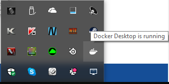
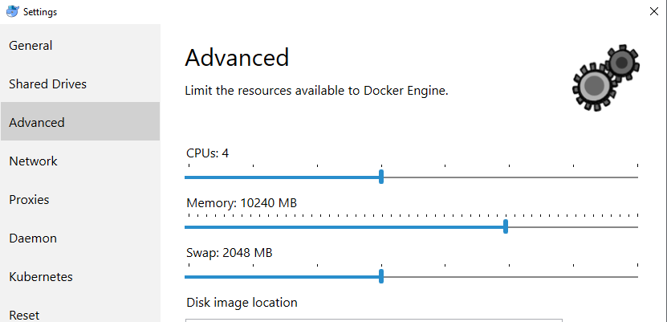
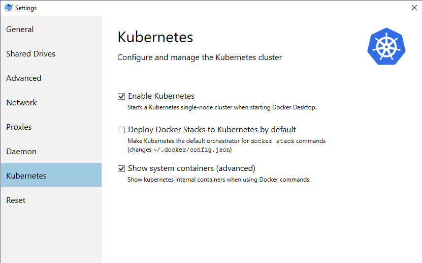
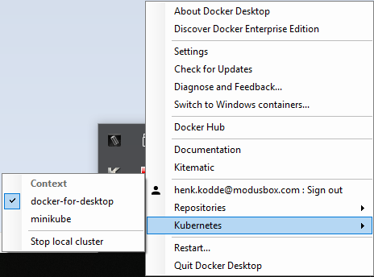

# Mojaloop local environment setup for Windows

Local setup on a Laptop or Desktop to run the Mojaloop project.

## Setup Introduction

This document will provide guidelines to a technical capable resources to setup, deploy and configure the Mojaloop applications on a local environment, utilizing Docker, Kubernetes and HELM charts.

At this point the reader/implementer should be familiar with [Mojaloop's deployment guide](./README.md). Imported information is contained in that document and as such a prerequisite to this document.

* [Kubernetes](#1-kubernetes)
  * [Kubernetes Installation with Docker](#11-kubernetes-installation-with-docker)
  * [Kubernetes environment setup](#12-kubernetes-environment-setup)


## 1. Kubernetes

This section will guide the reader through the deployment process to setup Kubernetes within Docker.

If you are new to Kubernetes it is strongly recommended to familiarize yourself with Kubernetes. [Kubernetes Concepts](https://kubernetes.io/docs/concepts/overview/) is a good place to start and will provide an overview.

The following are Kubernetes concepts used within the project. An understanding of these concepts is imperative before attempting the deployment;

* Deployment
* Pod
* ReplicaSets
* Service
* Ingress
* StatefulSet
* DaemonSet
* Ingress Controller
* ConfigMap
* Secret

### 1.1 Kubernetes Installation with Docker

* **kubectl** is part of the installation package when installing Docker Desktop for Windows.

   Please note the minimum system and operation requirements;
     * Docker Desktop for Windows require Microsoft Hyper-V to run. Hyper-V will be enable as part of the installation process,
     * Windows 10 64bit: Pro, Enterprise, Education (1607 Anneversary Update, Build 14393 or later),
     * CPU SLAT-capable feature,
     * At least 4GB of RAM. (At least 16GB will be required to run the Mojaloop project).
    
1. Installing Docker for Windows:

   You will require Docker Desktop for Windows 18.02 Edge (win50) and higher, or 18.06 Stable (win 70) and higher. Kubernetes on Docker Desktop for Windows is available on these versions and higher. They are downloadable from:
   ```
   https://docs.docker.com/docker-for-windows/install/
   ``` 
  
   Once download is completed, the downloaded file can normally be found in your Download folder. Installation is as per normal installations for windows. A restart will be required after this step.
  
2. Enable visualization:  

   Docker Desktop for Windows requires Microsoft Hyper-V to run. The Docker Desktop installer enables Hyper-V for you.
   
   If Hyper-V is not enabled, A pop-up messages will request if you would like to turn this on. Read the messages and select 'Ok' if appropriate.
  
   You need to insure that **VT-X/AMD-v** is enabled from `cmd.exe`:
   ```bash
   systeminfo
   ```  
  
   If not, from `cmd.exe` run as Administrator and execute:
   ```bash
   bcdedit /set hypervisorlaunchtype auto
   ```  

   A reboot would be required again for the updates to take effect.

3. Start Docker Desktop for Windows:
  
   Docker does not start automatically after installation. To start it, select **Docker Desktop** and click on it (or hit Enter).
  
   When the _whale_ in the status bar stays steady, **Docker Desktop** is up-and-running, and accessible from any terminal window. Note - if the _whale_ is not on the status bar, it will be in the **hidden icon** notifications area, click the up arrow on the taskbar to show it.

     

### 1.2 Kubernetes environment setup

1. Setting up the Kubernetes runtime environment within Docker Desktop:

   * Open the Docker Desktop for Windows menu by right-clicking the Docker icon. 
     * Select **Settings** to open the settings dialog. 
     * Under the **General** tab you can configure when to start and update Docker. 
  
   * Go to **Advanced** tab
     * Increase the CPU allocation to at least 4
     * Increase the Memory allocation to at least 8.0 GiB

   (If your system resource allow, more can be allocated as indicated below.)

     

   Kubernetes on Docker Desktop for Windows is available in 18.02 Edge (win50) and higher, and in 18.06 Stable (win 70) and higher.
  
   * go to **Kubernetes** tab
     * Select **Enable Kubernetes**
     * Select **Show system container (advanced)**

     

2. Set the context to be used.

   As mentioned, the Kubernetes client command, `kubectl` is included and configured to connect to the local Kubernetes server. If you have `kubectl` already installed, be sure to change context to point to **docker-for-desktop**;
  
   Through `cmd.exe`:
   ```bash
   kubectl config get-contexts
   kubectl config use-context docker-for-desktop
   ```

   Or through the Docker Desktop for Windows menu:
  
   * right-clicking the Docker icon
     * Select **Kubernetes**
     * Select **docker-for-desktop**

       

3. Continue setup and configuration from the Kubernetes Dashboard section in the [Mojaloop's deployment guide](./README.md#31-kubernetes-dashboard) document.
