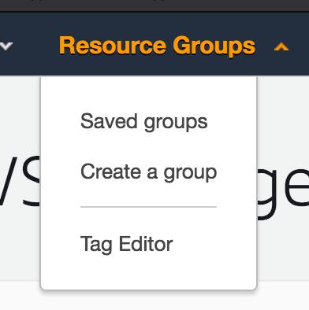
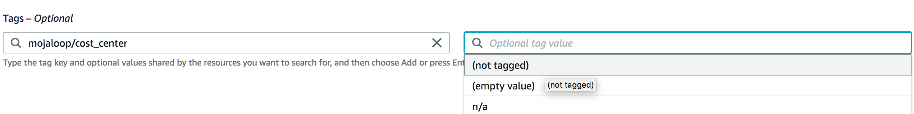
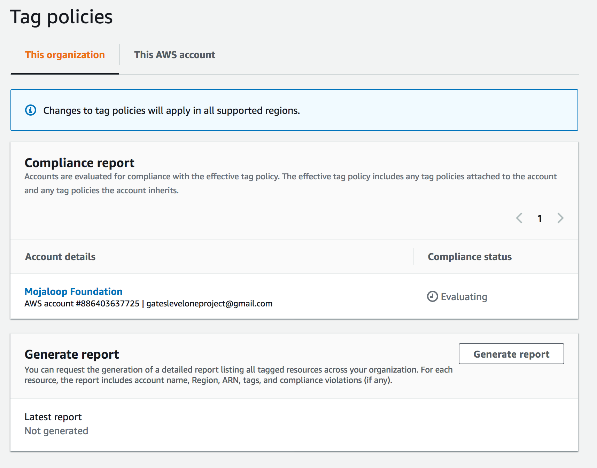
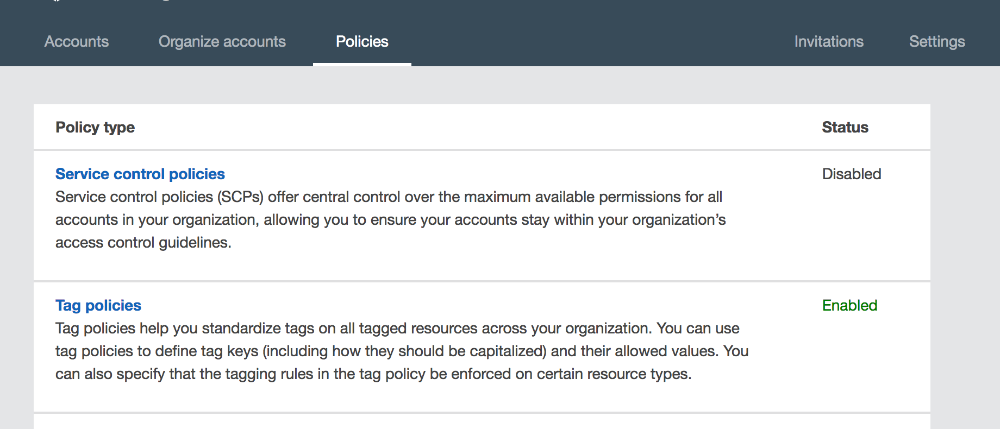
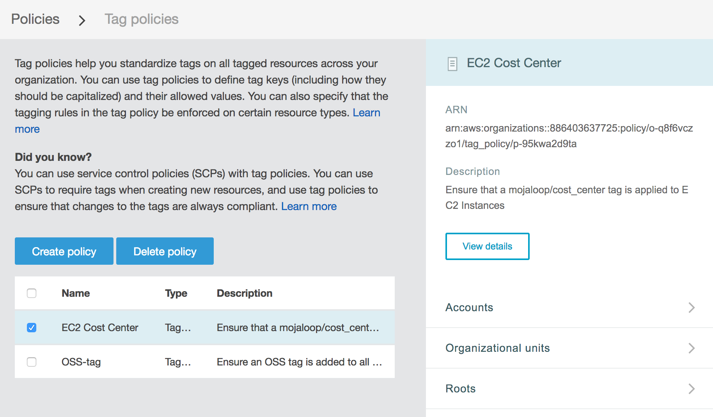
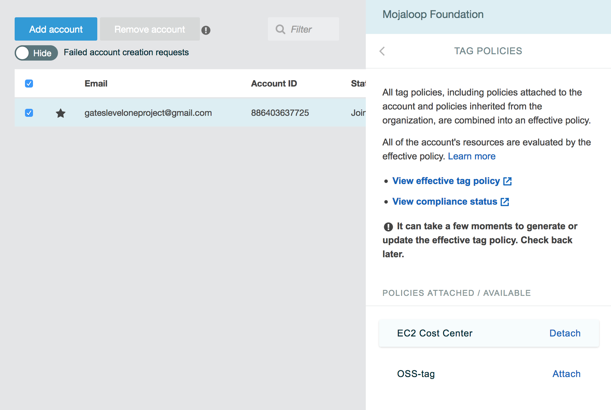

# AWS Tagging Guidelines + Policies

To better manage and understand our AWS usage and spending, we are implementing the following tagging guidelines.

## Contents
- [Proposed tags and their meanings](#proposed-tags-and-their-meanings)
    - [mojaloop/cost_center](#mojaloopcost_center)
    - [mojaloop/owner](#mojaloopowner)
- [Manual Tagging](#manual-tagging)
- [Automated Tagging](#automated-tagging)
- [AWS Tagging Policies](#aws-tagging-policies)
    - [Viewing Tag Reports + Compliance](#viewing-tag-reports--compliance)
    - [Editing Tag Policies](#editing-tag-policies)
    - [Attaching/Detaching Tag Policies](#attachingdetaching-tag-policies)

## Proposed tags and their meanings

We propose the following 2 tag _keys_:

- `mojaloop/cost_center`
- `mojaloop/owner`

### `mojaloop/cost_center`

`mojaloop/cost_center` is a breakdown of different resources in AWS by the workstream or project that is incurring the associated costs.

It loosely follows the format of `<account>-<purpose>[-subpurpose]`, where account is something like `oss`, `tips`, or `woccu`.
> Note: It's likely that most of the resources will be under the `oss` "account", but I managed to find some older resources that fall under the `tips` and `woccu` categories. We also want to plan for future types of resources that might be launched in the future.

Some potential values for `mojaloop/cost_center` are:

- `oss-qa`: Open source QA work, such as the existing dev1 and dev2 environments
- `oss-perf`: Open source performance work, such as the ongoing performance workstream
- `oss-perf-poc`: Performance/Architecture POC

We also reserve some special values:
- `unknown`: This resource was evaluated (perhaps manually, or perhaps by an automated tool), and no appropriate `cost_center` could be determined.
  - This will allow us to easily filter for the `mojaloop/cost_center:unknown` tags and produce a report
- `n/a`: This resource incurrs no cost, so we're not really worried about assigning a `cost_center` to it
  - This can be useful for mass tagging resources that are hard to figure out where the belong, such as EC2 Security Groups

### `mojaloop/owner`

`mojaloop/owner` is a person who is responsible for the managing and shutdown of a given resource.

The goal of this tag is to prevent long running resources that everybody else thinks _someone else_ knows about, but we no longer need. By applying this tag, we will be able to have a list of _who to go to_ in order to ask questions about the resource.

The value can simply be a person's name, all lowercase:
- `lewis`
- `miguel`
- etc.

Once again, we will reserve the following values:
- `unknown`: This resource was evaluated (perhaps manually, or perhaps by an automated tool), and no appropriate `cost_center` could be determined.
  - This will allow us to easily filter for the `mojaloop/owner:unknown` tags and see what resources are 'orphaned'

## Manual Tagging

We can use the "Tag Editor" in the AWS console to search for untagged resources.

>TODO: insert instructions

1. Log into the AWS Console
2. Under Resource Groups, select "Tag Editor"

3. From the tag editor, select a Region (I typically use "All regions"), and Resource Type (I also typically use "All resource types")
4. Now select "Search Resources", and wait for the resources to appear

You can also search by tags, or the absense of tags to see what resources have not been tagged yet.

5. Once you have a list of the resources, you can select and edit tags for many resources at once!
6. You can also export a `.csv` file of resources found in your search

## Automated Tagging

We currently automate tagging on the following

As we have a firmer grasp of our tagging guidelines, we need to introduce them into our tooling so that all of the grunt work of manual tagging.

At the moment, this will look like introducing tags into:
1. Rancher - which currently manages our Kubernetes clusters for both QA and Performance purposes
2. IAC - The upcoming IAC code that will eventually be running our dev environments

## AWS Tagging Policies

As of August 3, 2020, we have started introducing [AWS Tagging Policies](https://docs.aws.amazon.com/organizations/latest/userguide/orgs_manage_policies_tag-policies.html) to better enforce tags and monitor our resources (especially with respect to costs).

### Viewing Tag Reports + Compliance

1. Log in to the AWS Console
2. "Resource Groups" > "Tag Editor"
3. On the left sidebar, select "Tag Policies"

From here you can see the tag policies "compliance report"

### Editing Tag Policies

> Note: This may require special admin priviledges to access these pages

1. Log in to the AWS Console
2. Select "username@mojaloop" in the top right > "My Organization"
3. Select "Policies" > "Tag Policies"

4. From here, you can view the current tag policies

5. In the sidebar, you can click "View details" > "Edit policy" to edit the policy

### Attaching/Detaching Tag Policies

1. Go to the "My Organization" page
2. Select the relevant account > "Tag policies" in the sidebar
3. From here you can Attach + Detach tag policies

