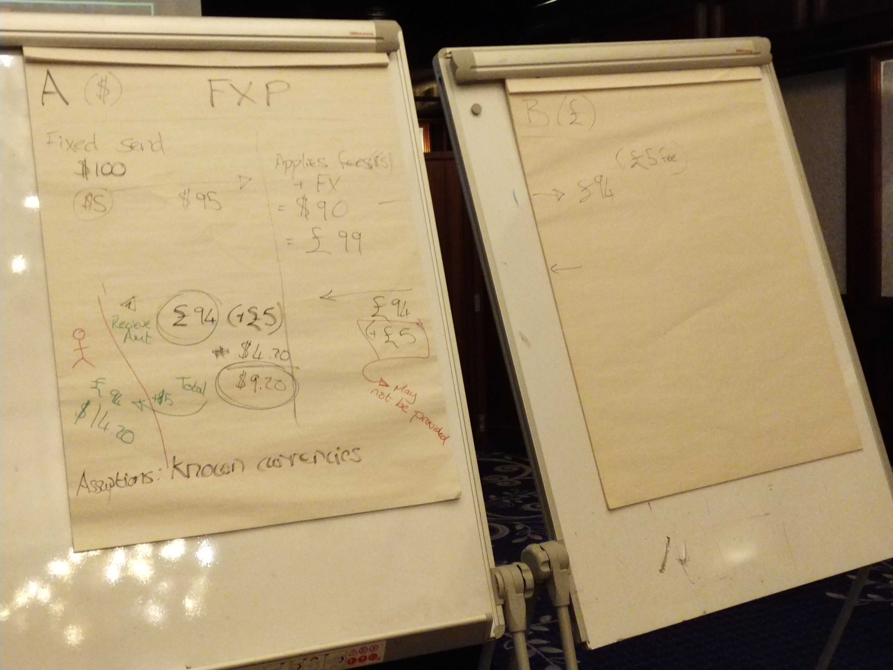
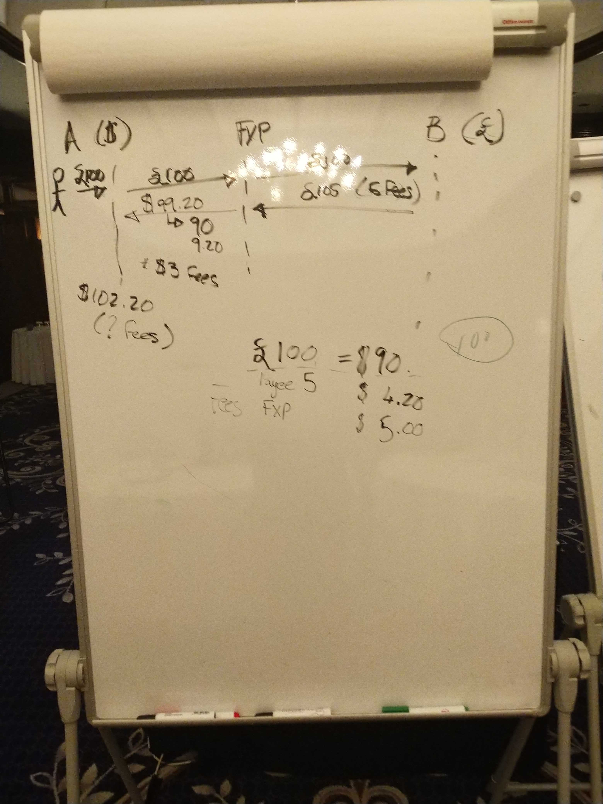

# Cross Border Discussion Day 1

## Attendees:

In person
- Lewis, Crosslake
- Adrian, Coil
- Nico, MB
- Sam, MB
- Miguel, MB
- Carol Benson, Glenbrook
- Michael Richards, MB
- Henrik Karlsson, Ericsson
- Rob Reeve, MB
- Vanburn, Terra Pay
- Razin, Terra Pay
- Ram, Terra Pay
- JJ, Google
- Matt Bohman, Gates
- David Power, EY
- James Bush, MB
- Warren, MB
- Judit, MB
- Bart-Jan and Bruno from GSMA  - Day #2

Phone
- Kim Walters, Crosslake
- Istvan Molnar, DPC
- Innocent Ephraim, MB

## Session 1

**Goal: Update the API definitions**

- Privacy:
  - Can I send USD? _yes/no_
  - What can I send? _list of currencies_

Business agreements: there are  a few ways this can happen
- Global scheme, made up of scheme to scheme agreements
- bilateral scheme agreements
- scheme to scheme
- region

Definitions:
- Gateway FSP: An FSP that 'bridges' across 2 networks
e.g. Mowali
  - 2 logical networks (USD,XOF?)
  - a single mojaloop network

- Cross Network Provider (CNP)
  - FXP, same thing?

Michael:
- there is a reason for that assumption
- other legal implications here...

- single entity, legally in 2 different jurisdictions
  - a close analogy of a scheme without jurisdiction

- participant: 
  - has a tx account that can be debited or credited
  - bank, fxp etc.

>Q: Can we have a participant that doesn't settle? Or would this be covered by CNP that is a party
>e.g. Visa, doesn't always settle in a given market, but holds an account

- Resident vs. Non-resident
  - reporting requirements are different

- what are the technical requirements for reporters?

- settlement
  - not too worried about it at this stage (our focus is on the API changes)
  - we assume that settlement is possible, but need to narrow scope witht the api first

- Not only mojaloop
  - need to allow for non-mojaloop -> mojaloop transfers and vice versa (both inbound and outbound)
  - must still be interoperable

- who provides routing?
  - switch?
  - ALS?
  - CNP?

>*Follow Up:* Need a formal definition of FXP and CNP roles, along with requirements and responsibilities

At a scheme level
  - should the sceheme maintain a list of other schemes it allows its FSPs to connect with?
  - or should the CNP take care of this?

- not scheme -> scheme, but part of the onboarding CNP process
- but the scheme can/should still maintain rules

- how will quoting work? Should an FSP send multiple quotes, one addressed to each CNP? Or should the switch have some rules engine that helps it determine who to send quotes to?

James: We want to be flexible. Can see instances where we would want both to happen, so we shouldn't assume too much at this stage.

Simplest option: The switch talks to the ALS, determines a transfer is not in our network, and then finds a list of CNPs

CNP + FXP -> essentially the same thing
- they are *Roles*, and a DFSP can assume more than 1 role
- fxps can also exist in more than 1 zone (e.g. Mowali case)
  - single network fxp is just an fxp,
  - multi-network fxp is likely also a CNP

## Session 2 

- debate about single or multiple lookups
  - we should never return "empty result"

- are wallets addressable by MSISDN?
  - only 1 account at the moment
  - but this is internal to the switch
  - the oracle's job is to convert MSIDN -> Mojaloop Address

- in the future: MSISDN + accounts will be less related
  - this topic is adjacently related to addressing

- 'going outisde' mojaloop with addressing will be a little tricky
- Standardize addressing?
  - not something we want to do

Ram: There are existing tools (no need to reinvent the wheel), outside the mojaloop scheme

- sending to unknown currency
  - currently: 1 routing table answer
  - future: multiple answers

- privacy:
  - no real need for hard rules at the moment (at least not at the API level, rules come along with schemes)
  - we do need a method for mediating information that one switch requires from another (and rejecting quotes should these prerequesites not be met)

---
- Domestic vs. Cross border: USer has/needs different information
  - e.g. do we only want to support discovery in domestic case?
---

Adrian: A lot of this stuff is business rule and scheme specific
- maintains competitive space
- How much information is in the:
  - lookup?
  - Quote?

---
- Proposal: Address lookup -> Returns multiple responses?
- MSISDN -> ID, not an address. Someone, not an account

- there should be only 1 response from the ALS
- Michael disagrees

- need to separate out *addressing* from *routing*

- we need to think about the downstream affects this will have on testing
  - need to find a clear way to test these lookups

For example, airtel UPI issue (where existing MSIDSNs were replaced when they grandfathered in their mobile customers to become mobile money customers)
  - we need to avoid a situation like that

---

Bring it back to first (L1P) principles 
- transfers should clear immediately
- no such thing as a future

- For domestic: we can guarantee delivery, but cross-border is much harder
- need to maintain transparency requirement on CNPs
  - this comes down to business rules

- Reversible tx's or rules abour downstream issues
  - ILP takes care of *most* of this for us

- in TIPS case: 1 ID maps to 1 account
- as always, there needs to be a compromise between privacy and features (and that's ok!)

---

At the end of a quote:
- ValueDate
- how much will be received
- what are the fees? (broken down, by step and currency)

---

How do we support protocols that don't support quotes (this is a question for moja to non-moja systems)

Risk: CNP: they hold the risk in this type of transaction

CNP as a participant?
 - holds an account with a participant
 - direct vs indirect approach
 - this doesn't affect the technical requirements (so out of scope for this discussion)

---

- fixed send and receive:
  - What direction does data need to be appended to the quote? It depends on if it is fixed receive vs fixed send

- Either: `A send 20 USD to B` OR `B receives 1000 PHP`

- translating fees back for user: FXP __must__ apply the same rate for fees as the principal transfer

- From L1P Perspective: __the goal is transparency__

- how about quotes outside of Mojaloop?
  - CNP should take care of this - it is the last bastion of Mojaloopyness

---

- Participant Object
  - Attached to the Quotes, one entry per hop?
  - So multi-hop quotes hold _n_ participant objects, where _n_ = number of hops + 1

As part of this we need:
- interoperable bits of data (common defs)
- scheme for encryption
- a place to put the data (in the quotes object)

Should we worry about encryption for now?
- perhaps not, but still should allow for it in the API

Encryption adds extra integration challenge
- what is the need to get data in the clear?
  - from a techincal perspective: just use a blank encryption key

Do we need to encrypt to ensure the switch(es) can't see the data?
  - perhaps not at this stage

>### Decision:
>- No encryption for now
>- in outbound quote request: have a list of data requirements
>- for inbound quote request: participants fill out those requirements
>- if requirements are not met: abort the quote
>- Don't hardcode the data requirements, we should use existing standards

- we need to specify whether or not fields _have_ been verified
  - ties in with tiered KYC processes

- need a common dictionary of data that can/should be requested

## Boards:

_board 1: Fixed send flows_

_board 2: Fixed receive flows_

