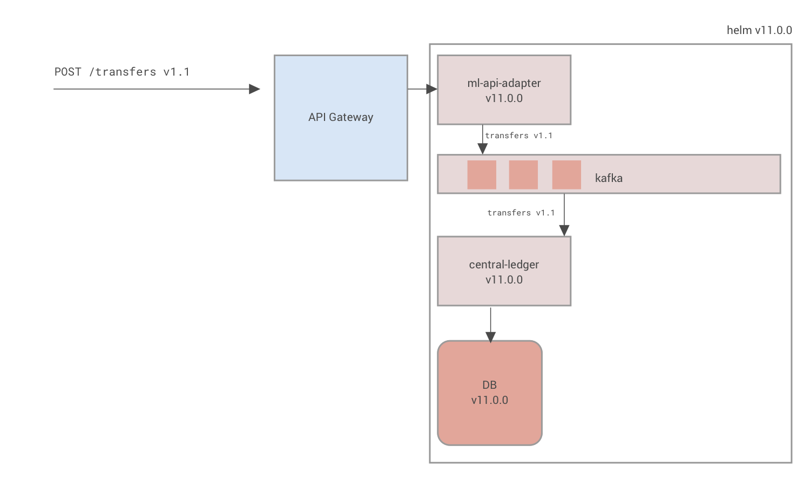
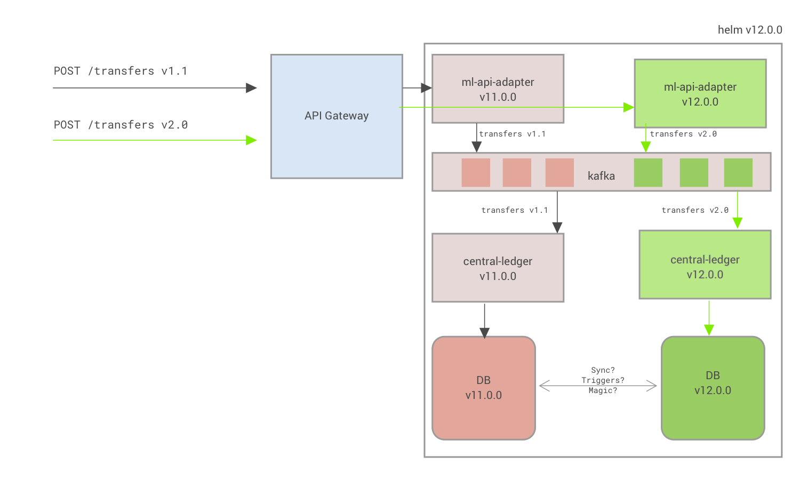
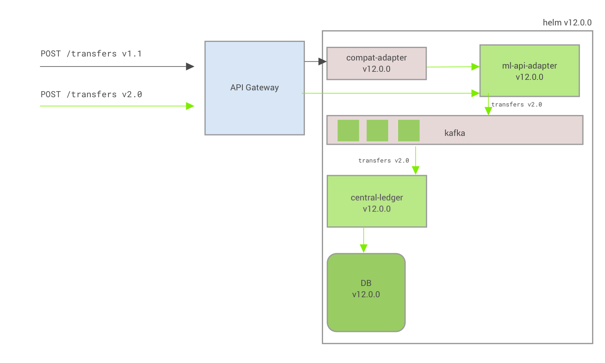
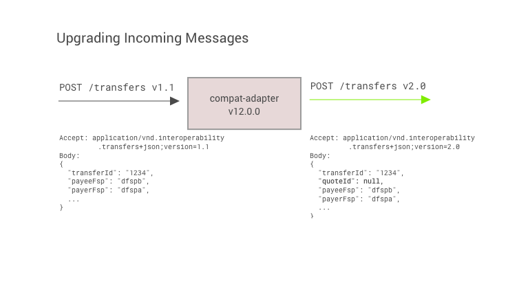
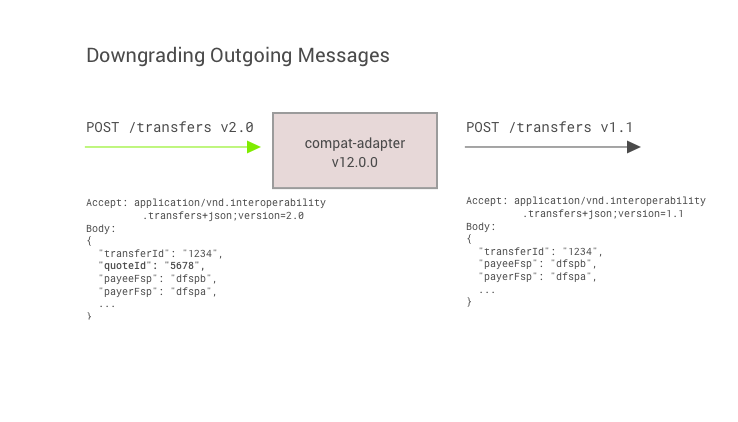

# Versioning Example

A discussion on how we might implement the new Mojaloop version outlined in the [draft proposal](./versioning_draft_proposal.md)


## The Breaking Change

For the sake of this discussion, let's take an arbitrary breaking change to the Mojaloop Specification, and list through a number of strategies we can use to deal with such a change.

For example, a current proposal is to include the `quoteId` in the `POST /transfers` request from DFSPA to the Switch:

```
POST /transfers HTTP/1.1
Accept: application/vnd.interoperability.transfers+json;version=2
Date: Tue, 15 Nov 2020 08:12:31 GMT
... other headers...
Body:
{
  "transferId": "1234",
  "quoteId": "9876", <--- This is a new required field
  "payeeFsp": "dfspb",
  "payerFsp": "dfspa",
  "amount": "100.00",
  "ilpPacket": "XXXXX",
  "condition": "XXXXX",
  "expiration": "2020-05-24T08:38:08.699-04:00"
}
```

### API Implications

Well apart from what's already obvious, we will likely want to allow `POST /transfers` at version 2 which contain the `quoteId`, and `POST /transfers` at version 1 which does not contain a `quoteId`.

This change is touching the `FSPIOP API` only, so we wouldn't need to increment the `MAJOR` version of the other APIs.

### Messaging Schema

Since we're adding new fields to the API, this will also impact the internal messages of the switch (kafka), and will (potentially?) make it backwards incompatible. Thus, we will make a new message schema version (2.0):


### Database Schema

As with the messaging formats, we will be adding a new field to our database schema, specifically the `transfer` table in the `central-ledger` database:

```
+----------------+---------------+------+-----+-------------------+
| Field          | Type          | Null | Key | Default           |
+----------------+---------------+------+-----+-------------------+
| transferId     | varchar(36)   | NO   | PRI | NULL              |
| quoteId        | varchar(36)   | NO   |     | NULL              | <---- new column here!
| amount         | decimal(18,4) | NO   |     | NULL              |
| currencyId     | varchar(3)    | NO   | MUL | NULL              |
| ilpCondition   | varchar(256)  | NO   |     | NULL              |
| expirationDate | datetime      | NO   |     | NULL              |
| createdDate    | datetime      | NO   |     | CURRENT_TIMESTAMP |
+----------------+---------------+------+-----+-------------------+
```

Since we're adding a field, this isn't necessarily a breaking change.

### Helm Deployments

Whether or not we increment the Helm MAJOR version depends mostly on whether or not the API breaking change is considered a breaking change in the implementation. I think not, and I think that we can and should be able to increment API versions independently of Helm


### Mojaloop Version Changes:

The existing Mojaloop Version:
> some version values are made up for demonstration purposes
| **Mojaloop**            | v1.0     |
|---|---|
|                         | Version  |
| **APIs**                |          |
| - FSPIOP API            | *1.1*    |
| - Settlement API        | *1.1*    |
| - Admin/Operations API  | *1.0*    |
| Helm                    | *11.0.0* |
| **Internal Schemas**    |          |
| - DB Schema             | *11.0*   |
| - Internal Messaging    | *11.0*   |


Thus, by introducing this breaking API change, we can summarize the new version as follows:

| **Mojaloop**            | v2.0     |
|---|---|
|                         | Version  |
| **APIs**                |          |
| - FSPIOP API            | *2.0*    |
| - Settlement API        | *1.1*    |
| - Admin/Operations API  | *1.0*    |
| Helm                    | *12.0.0* |
| **Internal Schemas**    |          |
| - DB Schema             | *12.0*   |
| - Internal Messaging    | *12.0*   |


## Implementation:

We will now summarize a few different methods for implementing such a change.
1. "Stop the World"
2. "Worry about it in the infrastructure"
3. "Worry about it in the code"

### 1. Stop The World

| Item | Quantifier |
|---|---|
| Development Effort          | LOW          |
| Customer Impact             | VERY HIGH    |
| Different DFSP API Versions | NO           |
| Allows for hotfixes and security patches | NO           |
| Technical Debt (supporting many versions) | NONE          |


In "Stop The World", the approach is to simply take down the entire Mojaloop deployment, apply the changes, and start it back up again.

This is not a desirable case, although it is the case that we have by default today. I want to expand on it here so we can benchmark our other implementation approaches against it.

#### Steps:
1. At the API Gateway level, stop any incoming quote requests, and wait until the pending transfers are complete or timed out. This is essentially draining the messages inside of the kafka streams
1. Once again at the API Gateway, kill all traffic to the switch
1. Assuming database persistence, update the helm charts from `v11.0.0` to `v12.0.0`
1. Behind the scenes, when the new helm containers start up, the above migration to the database will be run
1. Once all services are healthy, reenable all traffic and we are good to go.
    - Note that since we did nothing around supporting multiple FSPIOP API versions, _by default_ the upgraded switch will _only_ support `POST /transfers` requests at version 2. 


### 2. Worry about it in the infrastructure

| Item | Quantifier |
|---|---|
| Development Effort          | MEDIUM       |
| Customer Impact             | LOW          |
| Different DFSP API Versions | YES          |
| Allows for hotfixes and security patches | YES           |
| Technical Debt (supporting many versions) | YES          |


In "Worry about it in the infrastructure", we use kubernetes and helm to help us manage and run multiple 'internal' versions of our microservices simultaneously. In this approach, you will see how we can partition kafka based on message _versions_ to ensure the right microservices pick up the right messages.

The following diagram shows a simplified message flow of `POST /transfers v1.1` through the system:



Before we dive into the steps, we must first introduce more mojaloop internals: the `central-ledger` microservice, which handles the transfer requests.

For example take the following:
- `central-ledger:v11.0.0`, which can understand `POST /transfer` requests of `v1.1`, that is, without the additional `quoteId` field. (this is a simplification, but bear with me).
- `central-ledger:v12.0.0`, which can understand `POST /transfer` requests of `v2.0`, _with_ the additional `quoteId` field.

Inside of a _single_ helm deployment, we can run both 2 versions of `central-ledger`, `v11.0.0` and `v12.0.0` at the same time. Assuming some routing magic that can send the right version of requests to the right service, this gives us the ability to understand `POST /transfer` requests of both versions.

This is what our infrastructure would look like with such a change:



However... what about the database? And this is the tricky part. We have (at least) 2 failure conditions here:

1. `central-ledger:v11.0.0` sees an additional field, `quoteId` in the database and doesn't know what to do with it.
2. `central-ledger:v12.0.0` sees either no `quoteId`, or `quoteId` is null, when it is expecting it to be some value.

For this, we would likely rely on database views and versioning at the database schema, so each respective `central-ledger` `v11.0.0` and `v12.0.0` has a strong guarantee about what it can read and write to the database.


#### Steps:
1. Author a new Helm version `v12.0.0`, which:
    - spins up a new database alongside the existing database, instead of replacing it [or multiple database _views_?]
    - adds new services (e.g. `central-ledger:v12.0.0`), instead of replacing them
1. While still not allowing v2 requests at the API Gateway, `helm upgrade` to spin up new infrastructure alongside the existing infrastructure
1. Execute database schema migration and setting up versioned views etc.
1. Once all services are healthy, open up traffic to `v2.0`, and we are good to go


#### Other Thoughts:
- This method supports multiple API versions at the same time, but 
  - Requires a lot of infrastructure heavy lifting for such a small change. (What about the next change? Do we need to run another copy of almost all the services?)
  - Does not allow DFSPs at different `MAJOR` versions to interoperate (which it may not need to).
  - It could impact Kafka performance by partitioning topics per message version


### 3. Worry about it in the code

| Item | Quantifier |
|---|---|
| Development Effort          | HIGH       |
| Customer Impact             | LOW          |
| Different DFSP API Versions | YES          |
| Allows for hotfixes and security patches | YES           |
| Technical Debt (supporting many versions) | LESS          |

For "Worry about it in the code", we (as the title implies), worry about such changes in the code. We don't rely upon helm and kubernetes to run multiple versions of a given service at the same time; our services _always talk the latest API_, and in order to talk the older versions of the API, we _adapt the messages_ forwards and backwards.

The advantage with this approach is that we can always run and maintain the _latest_ version of our services, and minimize the need to touch legacy code.

Once again, let's take a look at our simplified transfer request flow:


For this approach, we define a new service called `compat-adapter`, which is responsible for upgrading incoming messages and downgrading outgoing messages to the correct API versions. 



By default, once we deploy `helm v12.0.0`, the mojaloop switch talks `transfers v2.0`. In order to understand and responsd to `transfers v1.1` messages, the `compat-adapter` does the work in upgrading the incoming messages, and downgrading the outgoing messages to the relevant API versions.

For example:


</br>



#### Steps
1. Author a new Helm `v11.1.0`, which:
    - Applies any necessary database and message schema changes for upcoming version `v12.0.0`
1. Deploy Helm `v11.1.0` with `helm upgrade`. Database migrations will be applied live
1. Update internal services to be able to handle the new `transfer.quoteId`, as an optional field, and implement business logic for handling cases without it
1. Bundle these internal service changes in Helm `v11.2.0`
1. Deploy Helm `v11.2.0` with `helm upgrade`. Internal services will now be able to handle the `transfer.quoteId` field, but since all messages are still `v1.1`, nothing has changed.
1. Build/update `compat-adapter` service to handle upgrading and downgrading requests and responses to and from `v1.1` and `v2.0`
1. Bundle the `compat-adapter` in with Helm `v12.0.0`
1. Deploy helm `v12.0.0`, which will start the `compat-adapter` service
1. Once all services are healthy, open up traffic to `v2.0` requests at the API Gateway, and we are good to go


Caveats:
- all services now need to know how to deal with null values for `transfer.quoteId`, so there is additional heavy lifting required in the code.
- 

