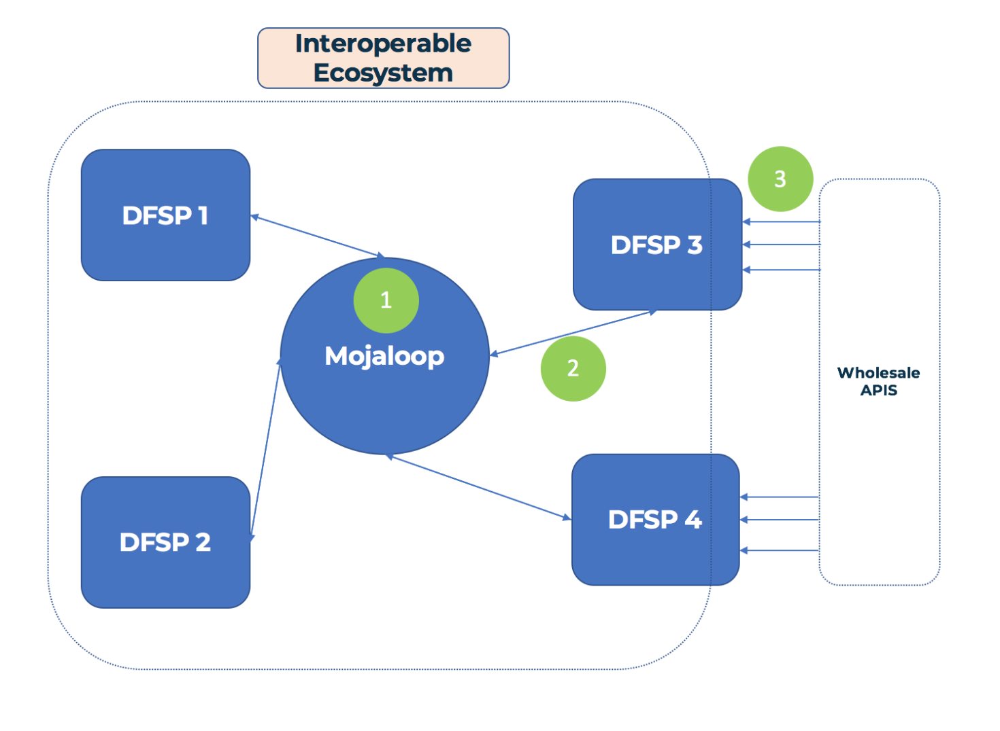

# Mojaloop Lab/Workbench Discussion

___Goal:__ This discussion document aims to lay out the case and align the community around the development of an educational Mojaloop Lab environment._

## 1. Goals for the PI8 Convening:

1. Define terms and outline assumptions
2. Outline existing efforts and how the OSS Community aligns with them (GSMA, MIFOS, ModusBox)
3. Define users and usecases, and exclude the users we won't worry about
4. Recommendations for a few different solutions to the "Lab Problem"
	- Documentation around business cases and personas Dan developed
  - Simple Mojaloop-over-spreadsheets demo, to get people using mojaloop without Postman
	- Basic implementation of Lab Configurer, help people build labs with different features
5. Basic implementation and demo
6. Pose important questions and discuss next steps

## 2. Nomenclature

**1. Tools:**
- 1.1 A device used to carry out a function
- 1.2 Different tools for different functions: You wouldn't use a screwdriver to drive a nail.
- 1.3 In a Mojaloop context, one example of a tool is the Bank Oracle
  - The Bank Oracle is a tool that plugs into the Account Lookup Service, can be used to allow Mojaloop to connect to existing bank accounts with an IBAN

**2. Workbench:**
- 2.1 Combines different tools together in one place
- 2.2 For example, a hand plane, table saw and chisel can make up a woodworking workbench, while a hacksaw, file and angle grinder can make up a metalworking workbench
- 2.3 In the mojaloop parlance, tools to test my DFSP's JWS keys are in a different workbench than tools that demonstrate to a fintech how wholesale api's can work on top of Mojaloop

**3. Lab:**
- 3.1 A lab is a place you go to run experiments
- 3.2 We run experiments in order to learn, and test our assumptions
  - For example, a DFSP can set up and run an _experiment_ where they send and receive Quotes using an in-development API
- 3.3 A single lab combines multiple workbenches together in one place

**4. Simulator:**
- 4.1 A tool that simplifies or abstracts away some function so you can test one thing at a time
- 4.2 Pilots train with simulators _before_ flying a real life, dangerous and expensive plane.
- 4.3 Within Mojaloop: a simulator can simulate interacting with some component of the system
  - Replace an entire switch to test a DFSP implementation
  - Simulate 2 DFSPs to test a switch deployment
  - A simulator also reduces the need for someone to be with the person testing. So a DFSP can send and receive via the switch, without interaction with the Hub Operator.

## 3. Assumptions

>_Some of these may go without saying, but it's noting them here anyway._

1. The Gates Foundation wants to encourage adoption for Mojaloop at all levels (not just switches)
2. We don't need a lab environment to serve the needs of a Switch deployment or implementing DFSP - these needs will be met elsewhere
3. The Mojaloop OSS Community wants to make itself attractive 
  - This doesn't mean removing all barriers to entry; but assessing which barriers we should be removing
<!-- - [todo: more>] -->

## 4. Users

We divide users in 2 camps: Primary users and Secondary users.

### 4.1 Primary Users
1. DFSPs needing to integrate with Mojaloop: (shorthand: Implementing DFSP)
2. Organisations/Individuals wishing to learn about Mojaloop and wanting to build and test functionality or use cases as a DFSP (shorthand: Evaluating DFSP)
3. Organisations/Individuals wishing to learn about Mojaloop and wanting to build and test functionality or use cases as a Hub Operator (shorthand: Evaluating Hub Operators)
4. Regulators, Organisations or Individuals wishing to understand and evaluate Mojaloop and how it might impact their existing service (shorthand: General Evaluators)

### 4.2 Secondary Users
5. Systems Integrators wishing to offer Mojaloop as a Service or pieces of Mojaloop integration as a Service (Systems integrator)
6. Individual Contributors (including bug bounty hunters?) (Individual Contributor)
7. Fintechs operating on top of or who will operate on top of a mojaloop-enabled switch (Mojaloop-powered fintech)
8. 3rd Party App Provider interacting with wholesale mobile money APIs, selling integrations to fintechs and the like (3rd party app provider)
9. Financial Advocates, who are interested in promoting Mojaloop and other technologies that help drive financial inclusion (Financial Inclusion Advocates)

In addition to thinking of each of the above users, it's important to understand at what level these users exist at in relationship to a mojaloop deployment. For that we will borrow from Dan Kleinbaum's [_Fintech primer on Mojaloop_](https://medium.com/dfs-lab/what-the-fintech-a-primer-on-mojaloop-50ae1c0ccafb)_

>_The 3 levels of Mojaloopyness, https://medium.com/dfs-lab/what-the-fintech-a-primer-on-mojaloop-50ae1c0ccafb by Dan Kleinbaum_

**Level 1:** Running a Mojaloop switch (e.g. Hub Operators)  
**Level 2:** Interacting with a Mojaloop Switch directly (e.g. DFSPs, Systems Integrators)  
**Level 3:** Interacting with a DFSP over a Mojaloop Switch (e.g. Fintechs)  

## 5. Use Cases

__a.__ Test a Mojaloop compatible DFSP implementation  
__b.__ Validate assumptions about Mojaloop  
__c.__ View and use a reference implementation  
__d.__ Learn about Mojaloop internals  
__e.__ Learn about Mojaloop-enabled switches and associated use cases (technology)
__f.__ Assess how Mojaloop will change fintech business landscape  
__g.__ Be able to demonstrate a value proposition for DFSPs/Fintechs/etc. to use mojaloop (instead of technology _x_)

## 6. User/Use Case Matrix:

We can plot the users and use cases in a matrix:

|  __Usecase:__                    | a. Test DFSP Impl | b. Validate Assumptions | c. Reference Impl | d. Learn Internals | e. Learn about Tech | f. Evaluate Business Cases  | g. Demonstrate ML Value |
| :----------------------------------- | :---: | :---: | :---: | :---: | :---: | :---: | :---: |
| __User:__                            |       |       |       |       |       |       |       |
| __1. Implementing DFSP__             |   X   |       |   X   |       |       |       |       | 
| __2. Evalutating DFSP__              |       |   X   |   X   |       |   X   |   X   |       |
| __3. Evaluating Hub Operator__       |       |       |   X   |       |   X   |   X   |       |
| __4. General Evaluator__             |       |       |       |       |   X   |   X   |       |
| __5. Systems Integrator__            |   X   |   X   |   X   |   X   |       |       |   X   |
| __6. Individual Contributor__        |       |   X   |   X   |   X   |       |       |       |
| __7. Mojaloop-powered fintech__      |       |   X   |       |       |   X   |   X   |   X   |
| __8. 3rd Party App Provider__        |       |       |       |   X   |       |       |   X   |
| __9. Financial Inclusion Advocates__ |       |   X   |       |       |       |   X   |   X   |

## 7. Usecase Inputs and outputs:

>_Pick 2 or 3 different users/usecases and drill down into the inputs and outputs for what meeting their needs may look like_
>>_Note: As with anything of this nature, a lot of the users/usecases and associated conclusions are somewhat squishy, and can likely be put into different or altogether new boxes. Nonetheless, we will try to define these as well as possible._

### 7.1 Evaluating Hub Operator + Implementing DFSP
As stated in our above assumptions, we aren't going to worry about Hub operators and Implementing DFSPs here.

### 7.2 Evaluating DFSP

>_We think of an evaluating DFSP as one who is not necessarily part of a current switch implementation, but a party who is mojaloop-curious, and a potential candidate to evangelize mojaloop to - without the tangible goal of a switch implementation in sight._

**7.2.1 Use cases:**
- 1. Validate assumptions about Mojaloop (how it works, what it does, what it _doesn't_ do)
- 2. View and play with a reference implementation
- 3. Learn about mojaloop-enabled hubs and associated use cases (technology perspective)
- 4. Assess how Mojaloop will affect their business in the future

**7.2.2 Examples from our user personas:**
- 1. Carbon - Enable cash-outs and OTC remittances over their agent network
- 2. Ssnapp - Enable multi payer/payee payments and rewards points over mojaloop
- 3. Oneload - Simplify onboarding for other DFSPs to utilize OneLoad's agent network
- 4. Juvo - Plug in to a Mojaloop switch for a credit scoring and lending marketplace

**7.2.3 Outputs: (How can the Mojaloop OSS Community better serve these players?)**
- 1. help to onboard to the mojaloop ecosystem
- 2. help to understand the technology, where it works well, and the potential pitfalls/drawbacks
- 3. minimize investment in getting things working so they can focus on building out use case prototypes
- 4. take them from little to no understanding of Mojaloop -> demonstrating real prototypes

**7.2.4 Inputs: (what are the things that we need to do to meet these goals)**
- 1. Improved mojaloop documentation specific for this role.
  - 1.1 Think about and design the documentation and onboarding flow specifically for *Evaluating DFSPs*
  - 1.2 Documentation should be approachable by product manager etc. with little technical knowledge
- 2. Technical deep dive on the technology behind mojaloop, why, how it works (perhaps we can repurpose the js demonstrator in an interactive walkthrough an end to end transaction)
- 3. Improved guides for up and running on 2-3 major kubernetes providers, self service and install scripts 
- 4. Helm charts for 1-2 simulators/labs that can be spun up alongside a switch, with opinionated pre-configured settings

### 7.3 Mojaloop Powered Fintech

>_A Mojaloop Powered fintech is a fintech operating or wishing to operate on top of a mojaloop switch. There will definitely be crossover between Fintechs and DFSPs in this classification, but we will focus here on fintechs who are at the third level on the above "Mojaloop Spokes"_

**7.3.1 Use cases:**
- 1. Validate assumptions about Mojaloop (how it works, what it does, what it _doesn't_ do)
- 2. Learn how mojaloop is aligned with wholesale APIs, and what it would take to get a DFSP using these APIs over a Mojaloop switch
- 3. Learn about mojaloop-enabled hubs and associated use cases (technology perspective)
- 4. Assess how Mojaloop will affect their business in the future

**7.3.2 Examples from our user personas:**
- 1. EastPay - compare and shop around for banks/payment providers based on Mojaloop's open fee structure
- 2. Jumo - Open up transparent and fairer lending markets on top of a Mojaloop enabled switch?

**7.3.3 Outputs: (How can the Mojaloop OSS Community better serve these players?)**
- 1. Understand how Mojaloop and Wholesale APIs fit together (or don't)
- 2. Enable fintechs to interact with Mojaloop over 1 or 2 wholesale banking APIs (e.g. GSMA MM api)
- 3. take them from little to no understanding of Mojaloop -> demonstrating real prototypes

**7.3.4 Inputs: (what are the things that we need to do to meet these goals)**
- 1. Improved mojaloop documentation specific for this role.
- 2. Documentation or working document on how Mojaloop will work with wholesale apis
- 3. Self-deployed lab environment with DFSP that expose some wholesale apis with basic functionality for fintechs to test against

## 8. OSS Lab/Workbench efforts alongside others

There are others in the community working on some of these needs we outlined above. How can we align ourselves together to: (1) Not duplicate efforts (nor step on each other's toes) and (2) Provide the most impact for end users and the Mojaloop community as a whole

In general, we reached a consensus around the following:
- any OSS Lab effort should be focused with a specific end user in mind
- Our focus should be further out on the mojaloop spokes (DFSPs, Fintechs, 3rd Party app providers)

### 8.1 MIFOS
- 1. Already extensive work done here with Fineract system, which provides out-of-the-box solution for Mojaloop enabled DFSPs
- 2. working on open api implementations
- 3. Working on lowering the barriers to entry for DFSPs and Fintechs
- 4. Mifos Innovation Lab: "The Locomotion on top of Mojaloop's Rails"
  - 4.1 Demonstrate end to end Mojaloop systems with DFSP integration
  - 4.2 Build and contribute OS tools
- 5. Working on real world deployments already 
- 6. See a need for a "Single Point of Entry to the Mojaloop Ecosystem"
- 7. Have an existing Lab deployment with Mojaloop that is currently being upgraded to work with the latest Helm chart deployments

### 8.2 GSMA
- 1. Have mobile money api, would like to see end to end solution with fintechs/DFSPs talking over a mojaloop switch
- 2. The GSMA Lab has a very wide scope, Mojaloop is just one piece of this
- 3. One main goal is the mobile money API- pushing for default standard for 3rd party integration into mobile money
- 4. where does Mojaloop sit?
	- 4.1 Is one of the branches that the GSMA Lab will be working on
	- 4.2 Where can GSMA add the most value to Mojaloop?
		- 4.2.1 Serve a need from the market to get the most impact
    - 4.2.2 See a end-to-end prototype of the MM API talking over a Mojaloop switch

### 8.3 ModusBox
- 1. More on the systems integrator perspective. Building a bunch of tools already to ease the development and onboarding process for switches and DFSPs
- 2. Have open sourced the Mojaloop JS SDK
- 3. Interested in showing 'how the engine works' to build confidence in business parters/customers
- 4. Also interested (especially in WOCCU case) as a Mojaloop lab as a place for Fintechs to learn and test concepts on top of Mojaloop Switches
  - 4.1 Once this is connected, the interesting use cases will start to develop beyond tranfers from A to B
  - 4.2 MFIs (especially small-medium) don't have much capacity for experimentation or developing new business cases, but these cases can be driven from fintechs first
- 5. How can we assist orgs. who have little-to-no technical capability to become confident with Mojaloop?
  - 5.1 A technical lab environment won't do much in this case
  - 5.2 Can we demonstrate Mojaloop over a spreadsheet? Everyone can understand spreadsheets.

## 9. Questions

- 1. So much of this comes back to The Gates Foundation's proposed sales cycle for growing mojaloop adoption
  - 1.1 Looking at the technical briefs from the hackathon alone, there are some __big__ players (Famoco, Ethiopay, GrameenPhone) that could really take mojaloop and run with it
  - 1.2 How can the initial hurdle be overcome to drive adoption and help these orgs adopt mojaloop and contribute back to the ecosystem?
  - 1.3 What does the entrypoint to the industry look like for Hub operators?

- 2. For evaluating DFSPs, what is their resource/risk allocation like?
  - 2.1 If they think Mojaloop is a viable option for a future product, what type of time and resource investment will they put into it?
  - 2.2 What are their alternatives? (This will be a case-by-case thing)

- 3. Is a certain amount of technical gatekeeping a good or bad thing? (This is a more philisophical question)
  - 3.1 If we don't make it too easy to get up and running, we make sure that only interested and determined parties are using mojaloop, which self-selects for a better community (kinda)
  - 3.2 But this locks out a lot of people who aren't up to scratch with kubernetes, docker etc. but may still have a good deal of experience with financial services etc.

4. Chicken and egg problem(?) between DFSPs and Hub operators. Does it go DFSPs -> Hub Operators or the other way around?

## 10. Recommendations

- 1. Find a target user that we can build a lab for/with
  - 1.1 perhaps one of the more serious hackathon teams?
- 2. Address and improve documentation gaps: driving from a role-specific (i.e. DFSP, fintech, hub operator) perspective
- 3. Mojaloop over Spreadsheet demo
- 4. Build a self-service lab prototype
  - 4.1 Opinionated set of helm charts that can be deployed alongside general switch
  - 4.2 Gather feedback from the community, and see where and how people are using it