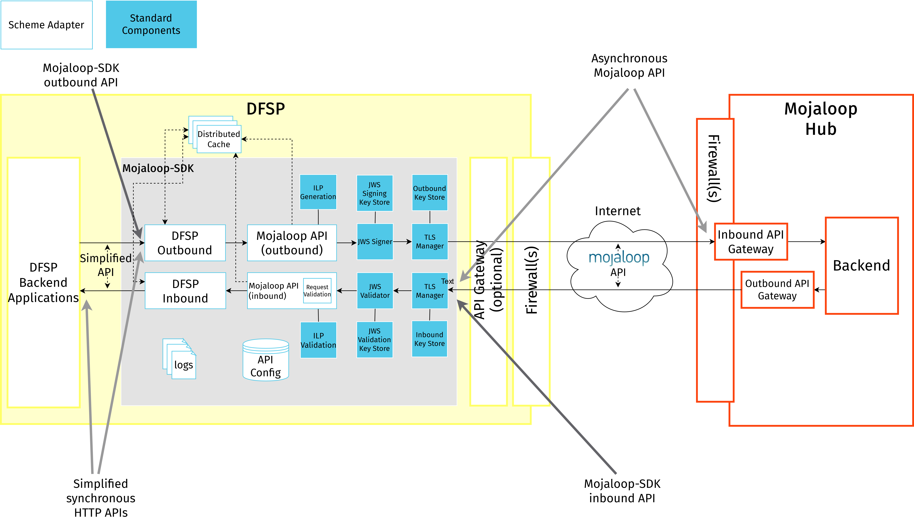
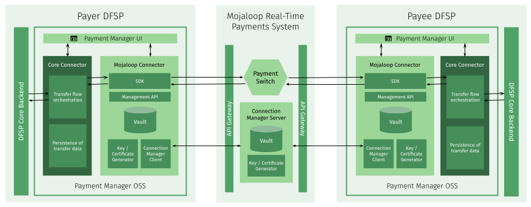
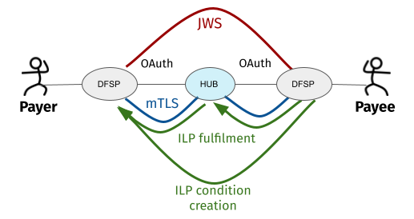
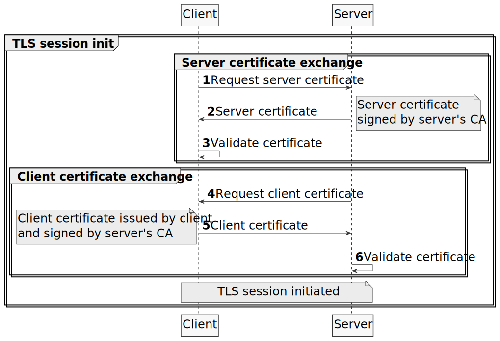

# Technical onboarding of DFSPs

At a high level, onboarding to a Mojaloop Hub requires a DFSP to focus their efforts around the following major milestones:

* [Integration](#api-integration) of their core backend with the Mojaloop Hub on the API level (this involves both coding and testing).
* [Connecting](#connecting-to-mojaloop-environments) to pre-production and production environments following rigorous Mojaloop security requirements.

In addition to the steps that require DFSP involvement, the Hub Operator must also perform some onboarding activities in their [backend](#onboarding-in-the-hub-backend) independent from DFSPs.

This section provides a high-level overview of all of these milestones.

## API integration

Within the context of the Mojaloop Financial Service Provider Interoperability (FSPIOP) API, a transfer happens in three main steps:

1. Identifying the Payee (party lookup or discovery phase)
1. Agreeing the transfer (quote or agreement phase)
1. Executing the transfer (transfer phase)

For further details on each of these phases, see **Module 2 - Static demo: An end-to-end example** of [Mojaloop training course](https://learn.mojaloop.io/) **MOJA-102**.

These three phases correspond to the key resources of the Mojaloop FSPIOP API:

* **Party lookup service**: Identifying the DFSP serving the Payee and the Payee itself (= the recipient of funds in a transaction) based on a Payee identifier (typically a MSISDN, that is, a mobile number).
* **Quotes service**: Requesting a quote and exchanging cryptographic proof to prepare and secure the transfer. A quote is a contract between a Payer DFSP and Payee DFSP for a particular financial transaction before the transaction is performed. It guarantees the agreement set by the Payer and Payee DFSPs about the Payer, the Payee, and transfer amount, and is valid during the lifetime of a quote and transfer of a specified financial transaction.
* **Transfers service**: Executing the transaction as per the agreed details and cryptographic proof.

DFSPs can choose to:

* connect directly to the Mojaloop Hub and implement the asynchronous Mojaloop version of these API services, or 
* leverage an open-source integration component (the [Mojaloop-SDK](#mojaloop-sdk) or [Payment Manager OSS](#payment-manager-oss)) and implement a simplified, synchronous version of Mojaloop FSPIOP API services

DFSPs with an in-house development team and experience with RESTful APIs will likely be able to manage the process internally and develop a direct connection to Mojaloop. However, it is recommended that DFSPs use one of the open-source integration components, as a direct connection requires additional code development and maintenance. Using the Mojaloop-SDK or Payment Manager OSS reduces the time it takes to integrate with the Mojaloop Hub and makes troubleshooting easier for the Hub Operator, thus reducing the overall cost of the system.

While the DFSP is carrying out offline development work, the Hub Operator's role consists in answering ad-hoc questions around the specifics of the API, or - depending on the open-source tool chosen and the agreed deployment model - can even extend to doing some of the development too.

### Open-source tools to facilitate API integration

#### Mojaloop-SDK

The [Mojaloop-SDK](https://github.com/mojaloop/sdk-scheme-adapter) presents a simplified, synchronous version of the Mojaloop FSPIOP API to a DFSP's backend system, allowing DFSPs to implement a simple API internally to interface with the Mojaloop Hub, while still being compliant with the Mojaloop FSPIOP API specification for interoperable external communications. 

The asynchronous pattern of the Mojaloop FSPIOP API (while it has many advantages) may not be suitable for client applications that operate in a synchronous request-response mode. The Mojaloop-SDK helps bridge this gap by offering a simplified request-response API, abstracting away the complexities of multiple request composition and asynchronous API details from end clients.

The Mojaloop-SDK must be downloaded from [GitHub](https://github.com/mojaloop/sdk-scheme-adapter) to the DFSP environment and integrated to the DFSP backend. It is provided as a Docker container image, and may be hosted on the same infrastructure as the core banking application or a virtual machine provisioned specifically for it. Ongoing maintenance may require some specialized support from a System Integrator trained in the software.

Other than a simplified API, the Mojaloop-SDK also provides the security protocols required by Mojaloop "out of the box", by giving a simplified configuration interface to its users. This feature of the Mojaloop-SDK helps with the [connection step](#connecting-to-mojaloop-environments) of onboarding.

#### Payment Manager OSS

[Payment Manager OSS](https://pm4ml.github.io/documents/payment_manager_oss/latest/core_connector_rest/introduction.html) presents a use-case oriented, simplified, synchronous version of the Mojaloop FSPIOP API to a DFSP's backend system. The key integration component of Payment Manager is called Core Connector, it acts as a translator between a DFSP's core backend (CBS) and a component of Payment Manager (called Mojaloop Connector, which leverages the Mojaloop-SDK) that talks directly to the Mojaloop Hub. 

Core Connector is built in Apache Camel, a declarative Java-based language for integration engineers that does not require writing code from scratch. There is a ready-made Core Connector template available to simplify the development effort. The template provides a placeholder codebase for the API endpoints that need to be developed, and it must be customized to be aligned with the appropriate CBS technology. The flexibility provided by the template allows for Core Connector to be made to fit a DFSP's backend, rather than the other way around. 

The effort to customize a Core Connector template will differ depending on the chosen deployment option. When deploying Payment Manager, two options are available:

* **Managed and hosted by System Integrator**: A System Integrator deploys Payment Manager in the cloud, and syncs up the Core Connector template with the DFSP's core backend implementation.
* **Self-hosted by DFSP**: The DFSP deploys Payment Manager on premise or in the cloud, and the customization of the Core Connector template can be done by a number of actors (depending on the outcome of an initial assessment of DFSP capabilities):
    * the System Integrator
    * the System Integrator and the vendor of the DFSP's core backend solution
    * the DFSP and the vendor of the DFSP's core backend solution

Payment Manager is provided as a set of Linux container images (Docker) and may be hosted on-premise using commodity server infrastructure or in appropriate cloud infrastructure where available.

If the Hub Operator so chooses, it can assume a System Integrator role.

Given that Payment Manager incorporates Mojaloop-SDK functionality, it also implements the security layer required by Mojaloop. This feature of Payment Manager helps with the [connection step](#connecting-to-mojaloop-environments) of onboarding.

## Connecting to Mojaloop environments

Once the DFSP has completed coding, they test their integration against a lab instance in a test environment provided by the Hub. This is where the connection phase of the technical onboarding journey begins, with a new set of responsibilities for the Hub Operator. 

The requirements around connecting are dictated by the multiple security protocols that any Mojaloop Hub and participating DFSPs must implement:

* Two-way TLS with mutual X.509 authentication
* OAuth 2.0 authentication for sessions over the Hub API gateway
* IP-address-based whitelisting in firewall rules and API gateways
* JSON Web Signature (JWS) signing of messages
* Interledger Protocol (ILP) packet signing and validation

If you are interested in more details, see [Security in Mojaloop](#security-in-mojaloop).

Putting the above security measures into practice requires extensive information sharing and technical configuration from different teams at both the DFSP and the Mojaloop Hub. There are open-source tools available for the community to facilitate this process, both for DFSPs and the Hub Operator. 

### Open-source tools to facilitate connecting to Mojaloop environments

#### Mojaloop-SDK

The Mojaloop-SDK implements standard components that establish a uniform way of connecting DFSP systems to a Mojaloop Hub. It implements the following Mojaloop-compliant security functionality:

* Two-way TLS with mutual X.509 authentication
* JSON Web Signature (JWS) signing of messages
* Generation of the Interledger Protocol (ILP) packet with signing and validation

The Mojaloop-SDK can be downloaded from [GitHub](https://github.com/mojaloop/sdk-standard-components) hosted on the same infrastructure as the DFSP's core banking application or a virtual machine provisioned specifically for it. Following the generation, signing, and exchange of TLS and JWS certificates, DFSPs are required to configure TLS- and JWS-related environment variables in the Mojaloop-SDK. Finally, installing the certificates in the DFSP's firewalls and API gateway completes the certificate configuration part of the process.

Obtaining the Hub API gateway credentials required for collecting OAuth 2.0 tokens and configuring them in the Mojaloop-SDK via environment variables must be done manually.

Exchanging endpoint details with the Hub and configuring them in the Mojaloop-SDK via environment variables, as well as in firewall/gateway whitelists are manual steps too.

#### Payment Manager OSS

Payment Manager OSS provides all the security features that the Mojaloop-SDK provides, and more. Payment Manager comes with a Mojaloop Connection Manager (MCM) Client, which simplifies and automates certificate creation, signing and exchange, as well as the configuration of the connections required to different environments. How much of these processes is automated will differ depending on the chosen deployment option. Two options are available:

* **Managed and hosted by System Integrator**: A System Integrator deploys Payment Manager in the cloud. 
* **Self-hosted by DFSP**: The DFSP deploys Payment Manager on premise or in the cloud.

When a DFSP opts for the **managed-hosted option**, the System Integrator (this role can be filled by the Hub Operator) can employ Infrastructure-as-Code and onboarding scripts to handle the following elements of the process in an automated way:

* generation, signing, configuration, and installation of TLS certificates
* IP address whitelisting in firewalls and API gateways
* generation and configuration of client secret/key required to obtain OAuth 2.0 tokens

Steps related to JWS certificates are carried out via the [Connection Wizard portal](https://pm4ml.github.io/documents/payment_manager_oss/latest/connection_wizard/index.html), an easy-to-use portal that Payment Manager provides for managing certificate and endpoint related processes in a guided way. DFSPs and the Hub Operator are required to generate JWS certificates using any tool of their preference and then share their public keys via the Connection Wizard portal. Configuring JWS certificates in Payment Manager is done via the Connection Wizard portal, while installing them in gateways is a manual step.

When a DFSP opts for the **self-hosted option**, they use the [Connection Wizard portal](https://pm4ml.github.io/documents/payment_manager_oss/latest/connection_wizard/index.html) to manage certificate and endpoint related steps in a semi-automated way:

* DFSPs enter their endpoint details and obtain the Hub's endpoints from the portal. They then configure this information in Payment Manager via environment variables as well as in firewall/gateway whitelists manually.
* DFSPs generate, sign, and configure TLS certificates at the click of a button via the Connection Wizard portal.
* DFSPs generate JWS certificates using a tool of their choice and share and configure them in Payment Manager at the click of a button in the Connection Wizard portal.

Obtaining the Hub API gateway credentials required for collecting OAuth 2.0 tokens and configuring them in Payment Manager via environment variables must be done manually.

#### MCM

The Mojaloop Connection Manager (MCM) product is instrumental in simplifying and automating much of the information sharing and configuration around endpoints and certificates. MCM has an MCM Client and an MCM Server component, which talk to each other when exchanging endpoint details and certificates, and when signing Certificate Signing Requests. 

The MCM Client is incorporated into Payment Manager, whereas the MCM Server is within the boundaries of the Hub. MCM provides a portal for the Hub Operator to submit Hub endpoint information and Hub certificates, and to retrieve DFSP endpoint and certificate details submitted by the DFSP via Payment Manager.

### Security in Mojaloop

To understand what connecting a DFSP to a Mojaloop environment entails in detail, it is important to take a closer look at the security requirements of Mojaloop.

Mojaloop requires the following security measures to be implemented in order to protect the data exchanged between DFSPs:

* **Transport Layer Security** is a secure mechanism for exchanging a shared symmetric key over a network between two anonymous peers, with identity verification (that is, trusted certificates). It provides confidentiality (no one has read the content) and integrity (no one has changed the content). Mojaloop requires two-way TLS mutual authentication using X.509 certificates for securing bi-directional connections. DFSPs and the Mojaloop Hub authenticate each other to ensure that both parties involved in the communication are trusted. Both parties share their public certificates with each other and then verification/validation is performed based on that. 
* Another security measure that is offered for authentication is the **OAuth tokens** that DFSPs are required to use when making an API call request. OAuth 2 is used to provide role-based access to Mojaloop Hub endpoints (API authorization).
* **IP address whitelisting** reduces the attack surface of the Mojaloop Hub.
* To protect the application level, Mojaloop implements **JSON Web Signature (JWS)** as defined in [RFC 7515 (JSON Web Signature (JWS))](https://tools.ietf.org/html/rfc7515), the standard for integrity and non-repudiation. Signing messages ensures the Payer DFSP and the Payee DFSP can trust that messages shared between each other have not been modified by a third party. 
* The Mojaloop FSPIOP API implements support for the **Interledger Protocol (ILP)**. ILP is built on the concept of conditional transfers, in which ledgers involved in a financial transaction from the Payer to the Payee can first reserve funds out of a Payer account and later commit them to the Payee account. The transfer from the Payer to the Payee account is conditional on the presentation of a fulfilment that satisfies the condition attached to the original transfer request. 

The next sections provide background information about the steps involved in connecting to a Mojaloop environment. The information provided is written in a way so that DFSPs and the Hub can rely on PKI best practices and any proprietary tools and technologies that they prefer or have access to.

::: tip
As mentioned above, using Payment Manager OSS, Mojaloop Connection Manager (MCM), and the Infrastructre-as-Code (IaC) that deploys the components making up the Mojaloop ecosystem, many of the steps in the processes described below can be done in an automated way.
:::

#### Creating and sharing certificates

##### TLS certificates

Two-way or mutual TLS authentication (mTLS) relies on both parties (client and server) sharing their public certificates with each other and performing verification/validation based on that.

The following high-level steps describe how connection is established and data is transferred between a client and server in the case of mTLS:

1. The client requests a protected resource over the HTTPS protocol and the SSL/TLS handshake process begins.
1. The server returns its public certificate to the client along with a server hello. 
1. The client validates/verifies the received certificate. The client verifies the certificate through the Certificate Authority (CA) for CA-signed certificates.
1. If the server certificate was validated successfully, the server requests the client certificate.
1. The client provides its public certificate to the server.
1. The server validates/verifies the received certificate. The server verifies the certificate through the Certificate Authority for CA-signed certificates.

After completion of the handshake process, the client and server communicate and transfer data with each other, encrypted with the secret keys shared between the two during the handshake. 

The above process requires that before connecting to any environment (pre-production or production), the DFSP and the Mojaloop Hub each complete the following steps.

1. Create a server certificate signed by your CA.
1. Share your server certificate and CA chain with the other party.
1. Install the other party's CA chain in your outbound firewall (validation/verification will happen against these installed certificates).
1. Generate a Certificate Signing Request (CSR) for your TLS client certificate and share with the other party.
1. Sign the other party's CSR using your CA.
1. Share the signed client certificate as well as your CA's root certificate with the other party.
1. Install your own client certificate signed by the other party's CA in your outbound API gateway.
1. Install the root certificate of the other party's CA in your outbound API gateway.

##### JWS certificates

Whenever an API client sends an API message to a counterparty, the API client should sign the message using its JWS private key. After the counterparty receives the API message, it must validate the signature with the sending party's public JWS key. JWS is used by the receiving party to validate that the message came from the expected sender, and that it has not been modified in transit.

The above process requires that all DFSPs and the Mojaloop Hub itself have a JWS certificate and that before connecting to any environment (pre-production or production), the DFSP and the Mojaloop Hub each complete the following steps.

1. Create a keystore (to hold your certificate and private key), an asymmetric key pair (a public key and a private key), and an associated certificate that identifies you.
1. Share your JWS public key.
1. Install the other parties' (the Hub and all other DFSPs) JWS public key in your inbound gateway.
1. Install your JWS private key in your outbound gateway.

#### Sharing endpoint information

The Mojaloop Hub and the DFSPs share endpoint information to:

* whitelist the other party's public IP addresses in firewall rules in order to allow traffic
* configure the other party's callback URLs in API gateways

Typically, access to any incoming and outgoing traffic for a DFSP will be controlled by the relevant Security team. The DFSP's firewall needs to be appropriately configured:

* to access the Mojaloop Hub in any environment where the DFSP and the Hub interact, and 
* for the Mojaloop Hub to make callbacks to the DFSP 

Apart from access to and from the Hub deployed in an environment, all other public access should be blocked to prevent any unauthorized/unwarranted access.

Accordingly, access to the Mojaloop Hub is also regulated. DFSPs have to share their IP/IP range from which calls will be made to the Hub so that the firewall on the Hub can be configured appropriately. The Security team within the DFSP should be able to provide that information.

#### Obtaining an OAuth token

The Mojaloop Hub employs WSO2 technologies for integration between the Hub and DFSPs, and to provide a gateway to DFSPs. To connect to the various Hub environments, DFSPs must obtain access to WSO2. WSO2 offers an API Store portal where DFSPs can create API gateway accounts for application-level access, subscribe to APIs, and obtain OAuth tokens for use when interacting with the Mojaloop Hub.

## Onboarding in the Hub backend

Onboarding comprises certain steps that do not require any actions from DFSPs and are the sole responsibility of the Hub Operator. These steps are as follows:

1. Configure the Hub API gateways that handle incoming and outgoing data flows from/to DFSPs. Mojaloop employs WSO2 technologies for gateway access, as well as DFSP authorization and authentication for message pass-through via the gateways. The WSO2 product stack can be deployed from code using a continuous integration and deployment (CI/CD) solution, provisioning can be done through automation scripts.
1. Create users and accounts, configure role-based access control.
1. Set up the Hub for managing the use cases supported by the Scheme:
    - Configure Hub ledgers.
    - Configure Hub notification emails.
    - Configure settlement model.
    - Onboard oracles. \
    Mojaloop provides a [provisioning script](https://github.com/mojaloop/testing-toolkit-test-cases/tree/master/collections/hub/provisioning/MojaloopHub_Setup) to perform all of the above steps in an automated way using the [Mojaloop Testing Toolkit (TTK)](https://github.com/mojaloop/ml-testing-toolkit).
1. Set up simulator DFSPs for initial validation activities. \
   Mojaloop provides [provisioning scripts](https://github.com/mojaloop/testing-toolkit-test-cases/tree/master/collections/hub/provisioning/MojaloopSims_Onboarding) to perform this step in an automated way using the Mojaloop Testing Toolkit (TTK). 
1. Set up DFSPs in the Hub backend. For each DFSP:
    - Add DFSP and create a currency for it.
    - Add callback URLs for all API services.
    - Add a Net Debit Cap and set initial Position to 0.
    - Configure DFSP notification emails. \
    Similar to previous steps, the configuration of DFSP details can also be done via a provisioning script.

## Testing and validation

As DFSPs moves forward in their onboarding journey, they are required to perform tests in each environment. Business validation and technical requirements both need to be met when testing. Details of business validation are defined in the Scheme Rules.

Here are some examples of the testing activities that DFSPs are expected to perform in the various pre-production environments:

* end-to-end integration and application layer validation against simulators
* end-to-end integration and application layer validation against real, friendly DFSPs
* settlement process validation
* security setup validation
* validation of response time Service Level Agreements (SLAs)
* performance testing
