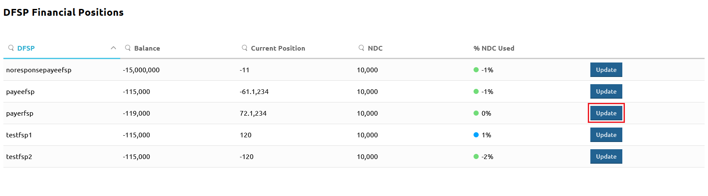
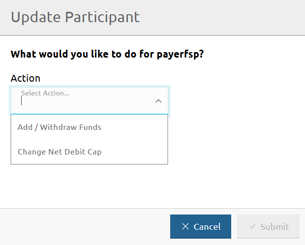
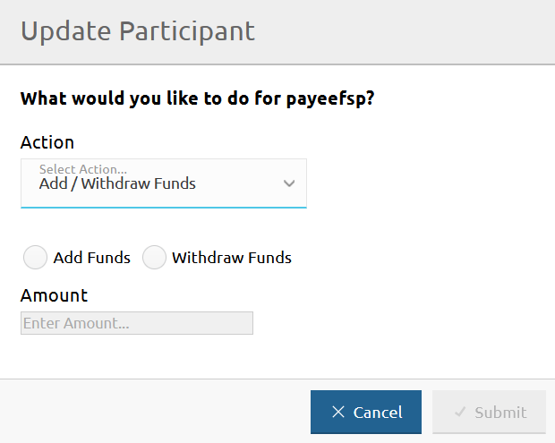
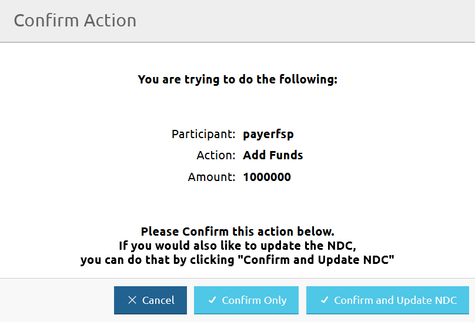
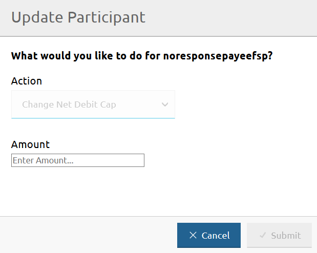

# Recording funds in or funds out for a DFSP

The **DFSP Financial Positions** page allows you to record funds in or funds out in the Hub's ledgers in the case of movement of funds initiated by the DFSP: a DFSP deposits funds in their liquidity account or withdraws funds from their liquidity account.

To access the **DFSP Financial Positions** page, go to **Participants** > **DFSP Financial Positions**.

To record funds in or funds out for a DFSP, complete the following steps:

1. Click the **Update** button next to the DFSP for which you want to record funds in/out. \
 \
The **Update Participant** window pops up.
1. Select **Add / Withdraw Funds** from the **Action** drop-down menu. \

1. Select the **Add Funds** or **Withdraw Funds** option depending on the action you want to take. \
To record a deposit, use **Add Funds**. \
To record a withdrawal, use **Withdraw Funds**. \

1. Enter the amount added or withdrawn by the DFSP in the **Amount** field. \
Do not specify a plus or a minus sign when entering the amount. Instead, ensure you have selected the right action in the previous step.
1. Click **Submit**.
1. On clicking **Submit**, a confirmation window pops up asking you to confirm the action, or confirm and also update the Net Debit Cap of the DFSP. \

1. Click **Confirm Only** or **Confirm and Update NDC**. \
\
On clicking **Confirm Only**, the **Balance** value on the **DFSP Financial Positions** page gets updated and the Hub adjusts the ledgers. \
\
On clicking **Confirm and Update NDC**, the **Update Participant** window changes and allows you to update the Net Debit Cap (NDC). \

