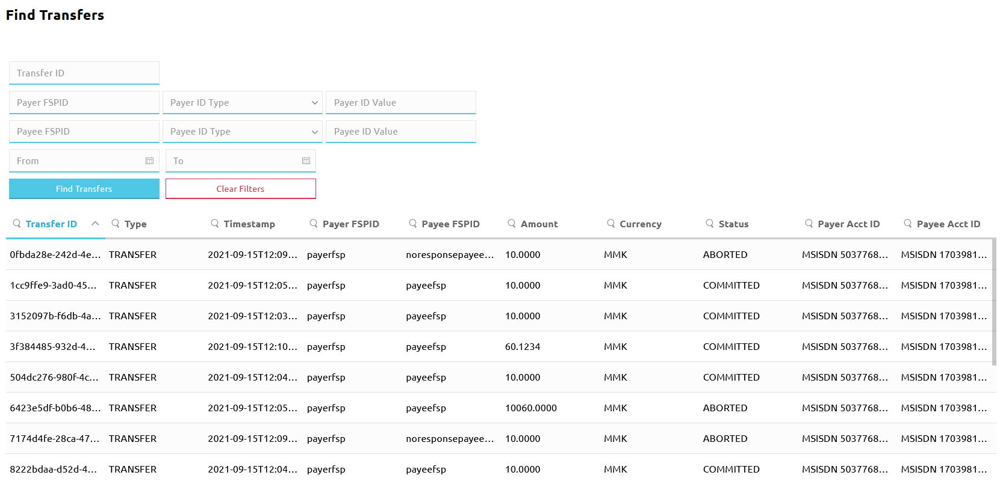

# Searching for transfer data

The Finance Portal provides a transfer search page, which allows you to find transfer data based on DFSP identifiers, end user identifiers, or transfer identifiers. This is useful when resolving issues.

::: tip NOTE
The values displayed on the **Find Transfers** page are pulled from the Hub's central-ledger database.
:::

## Finding transfers

To find transfers, complete the following steps:

1. Go to **Transfers** > **Find Transfers**. The **Find Transfers** page is displayed. \

1. Use the search filters to specify what you are looking for. You can fill in any number of search fields, in any combination.
    * **Transfer ID**: Enter a full `transferId` or a fragment of a `transferId`.
    * **Payer FSP ID**: Enter the full `fspId` or a fragment of the `fspId` of the Payer DFSP.
    * **Payer ID Type**: Using the drop-down list, select the type of identifier used to identify the Payer (for example, **MSISDN** or **ACCOUNT_ID**). 
    * **Payer ID Value**: Enter the full identifier or a fragment of the identifier used to identify the Payer (for example, a phone number or a bank account number).
    * **Payee FSPID**: Enter the full `fspId` or a fragment of the `fspId` of the Payee DFSP.
    * **Payee ID Type**: Using the drop-down list, select the type of identifier used to identify the Payee. 
    * **Payee ID Value**: Enter the full identifier or a fragment of the identifier used to identify the Payee.
    * **From** and **To**: Enter the start time and end time of the time range when the transfer(s) you are looking for happened.
1. Once you have set your search filters, click **Find Transfers**. The list of search results that meet the search criteria are displayed.

Use the page navigation buttons at the bottom of the screen to navigate between pages of search results.

You can remove all the filters you applied and start your search from scratch by clicking **Clear Filters**.

Search results are displayed in columns. All columns are sortable:

* Click a column header to change the sort order of the values displayed in the column.
* Click the magnifying-glass icon in the column header and enter a value that you are looking for.

::: tip
The total number of transfers that get returned are limited to a thousand (1000) (this is to keep the load off the backend). If you are not able to find the transfer that you are looking for within the first thousand results, then start narrowing your search, using the search filters. \
 \
If your search returns more than five hundred (500) results, the page will display an information message so you know that you do not necessarily see all results that meet your original search criteria and you should drill down more.
:::

The following details are displayed for a transfer:

::: tip NOTE
Transfers without quotes (that is "add/withdraw funds" transfers and settlement transfers) will display details for the following fields only: **Transfer ID**, **Timestamp**, **Amount**, **Currency**, **Status**.
:::

* **Transfer ID**: The unique identifier of the transfer (corresponds to `transferId`).
* **Type**: The type of the transfer (corresponds to `transactionType` in Payment Manager and `transactionScenario` in the Mojaloop FSPIOP API). 
* **Timestamp**: The date and time when the transfer request was created, as an [ISO-8601](https://www.iso.org/iso-8601-date-and-time-format.html) formatted timestamp.
* **Payer FSPID**: The `fspId` of the Payer DFSP.
* **Payee FSPID**: The `fspId` of the Payee DFSP.
* **Amount**: The transfer amount.
* **Currency**: The currency of the transfer.
* **Status**: The state of the transfer (corresponds to `transferState` in Payment Manager and the Mojaloop FSPIOP API).
* **Payer Acct ID**: The identifier type and identifier value of the Payer's account.
* **Payee Acct ID**: The identifier type and identifier value of the Payee's account.

## Transfer details

To find out more details about a particular search result, click its entry in the search result list. A **Transfer Details** window pops up. This section provides information about the details that are displayed for a transfer.

### Quote Requests

The **Quote Requests** tab displays the `quoteId` and further information on sub-tabs.

#### Quote Request sub-tab

The **Quote Request** sub-tab displays the following details about the quote request:

* **quoteId**: The unique identifier of the quote, decided by the Payer DFSP.
* **transactionReferenceId**: Corresponds to the `transactionId` specified in the quote request.
* **transactionRequestId**: Optional. Common ID between the DFSPs for the transaction request object, decided by the Payee DFSP.
* **note**: An optional memo attached to the transfer.
* **expirationDate**: An optional quote request expiration date, as an [ISO-8601](https://www.iso.org/iso-8601-date-and-time-format.html) formatted timestamp.
* **amount**: The amount that the quote is being requested for.
* **createdDate**: The date and time when the quote request was created, as an [ISO-8601](https://www.iso.org/iso-8601-date-and-time-format.html) formatted timestamp.
* **transactionInitiator**: Specifies if the initiator of the transfer is the **PAYER** or the **PAYEE**.
* **transactionInitiatorType**: Specifies the type of the initiator:
    * **CONSUMER**: Consumer is the initiator of the transaction. For example: peer-to-peer transfer or loan repayment from wallet.
    * **AGENT**: Agent is the initiator of the transaction. For example: loan repayment via an agent. 
    * **BUSINESS**: Business is the initiator of the transaction. For example: loan disbursement. 
    * **DEVICE**: Device is the initiator of the transaction. For example: merchant-initiated merchant payment authorized on POS.
* **transactionScenario**: Specifies the transaction scenario (corresponds to `transactionType` in Payment Manager).
* **transactionSubScenario**: Specifies the transaction sub-scenario defined by the scheme.
* **balanceOfPaymentsType**: The BoP code as defined in [the IMF's Balance of Payments Coding System](https://www.imf.org/external/np/sta/bopcode/).
* **amountType**: **SEND** for send amount, **RECEIVE** for receive amount.
* **currency**: The currency of the amount that the quote is being requested for. A three-letter alphabetic code conforming to [ISO 4217](https://www.iso.org/iso-4217-currency-codes.html).

#### Quote Parties sub-tab

The **Quote Parties** sub-tab displays the following details about the Payer DFSP and Payee DFSP:

* **quoteId**: The unique identifier of the quote, decided by the Payer DFSP.
* **partyIdentifierType**: The type of identifier used to identify the party (for example, **MSISDN** or **ACCOUNT_ID**).
* **partyIdentifierValue**: The value of the identifier used to identify the party (for example, a phone number or a bank account number).
* **fspId**: The unique identifier of the DFSP registered in the Hub (corresponds to `fspId`) - as provided in the quote.
* **merchantClassificationCode**: Used when the Payee is a merchant accepting merchant payments.
* **partyName**: The display name of the party.
* **transferParticipantRoleType**: The role that the DFSP is playing in the transfer.
* **ledgerEntryType**: The type of financial entry this party is presenting — principal value (that is, the amount of money that the Payer wants the Payee to receive) or interchange fee.
* **amount**: The amount that the quote is being requested for.
* **currency**: The currency of the amount that the quote is being requested for. A three-letter alphabetic code conforming to [ISO 4217](https://www.iso.org/iso-4217-currency-codes.html).
* **createdDate**: The date and time when the quote request was created, as an [ISO-8601](https://www.iso.org/iso-8601-date-and-time-format.html) formatted timestamp.
* **partySubIdOrTypeId**: A sub-identifier or sub-type for the party.
* **participant**: Reference to the resolved `fspId` (if supplied/known).

#### Quote Errors sub-tab

The **Quote Errors** sub-tab only displays information if there was an error in the quotes stage.

### Quote Responses

The **Quote Responses** tab displays details about the quote response:

* **quoteId**: The unique identifier of the quote, decided by the Payer DFSP.
* **transactionReferenceId**: Corresponds to the `transactionId` specified in the quote request.
* **quoteResponseId**: The unique identifier of the quote response.
* **transferAmountCurrencyId**: The currency of the transfer amount. A three-letter alphabetic code conforming to [ISO 4217](https://www.iso.org/iso-4217-currency-codes.html).
* **transferAmount**: The amount that the Payer DFSP should transfer to the Payee DFSP.
* **payeeReceiveAmountCurrencyId**: The currency of the amount that the Payee should receive in the end-to-end transaction.
* **payeeReceiveAmount**: The amount that the Payee should receive in the end-to-end transaction.
* **payeeFspFeeCurrencyId**: The currency of the Payee DFSP's part of the transaction fee (if any). A three-letter alphabetic code conforming to [ISO 4217](https://www.iso.org/iso-4217-currency-codes.html).
* **payeeFspFeeAmount**: The Payee DFSP's part of the transaction fee (if any).
* **payeeFspCommissionCurrencyId**: The currency of the transaction commission from the Payee DFSP (if any). A three-letter alphabetic code conforming to [ISO 4217](https://www.iso.org/iso-4217-currency-codes.html).
* **payeeFspCommissionAmount**: The transaction commission from the Payee DFSP (if any).
* **ilpCondition**: The ILP condition that must be attached to the transfer by the Payer side.
* **responseExpirationDate**: The quote's expiration date as an [ISO-8601](https://www.iso.org/iso-8601-date-and-time-format.html) formatted timestamp.
* **isValid**: An indicator whether or not the quote response has passed request validation and duplicate checks.
* **createdDate**: The date and time when the quote request was created, as an [ISO-8601](https://www.iso.org/iso-8601-date-and-time-format.html) formatted timestamp.
* **ilpPacket**: The ILP packet returned from Payee side in response to the quote request.

### Transfer Prepares

The **Transfer Prepares** tab displays details about the transfer request:

* **transferId**: The unique identifier of the transfer.
* **amount**: The amount that the Payer DFSP should transfer to the Payee DFSP.
* **currencyId**: The currency of the transfer amount. A three-letter alphabetic code conforming to [ISO 4217](https://www.iso.org/iso-4217-currency-codes.html).
* **ilpCondition**: The ILP condition that must be fulfilled to commit the transfer.
* **expirationDate**: The transfer's expiration date as an [ISO-8601](https://www.iso.org/iso-8601-date-and-time-format.html) formatted timestamp.
* **createdDate**: The date and time when the transfer request was created, as an [ISO-8601](https://www.iso.org/iso-8601-date-and-time-format.html) formatted timestamp.

### Transfer Participants

The **Transfer Participants** tab displays the following details about the participants of the transfer:

* **transferParticipantId**: The internal identifier of the scheme participant (DFSP) for whom the report is requested, corresponds to `participantId` as recorded in the Hub.
* **transferId**: The unique identifier of the transfer.
* **participantCurrencyId**: The currency that the participant (DFSP) transacts in. A three-letter alphabetic code conforming to [ISO 4217](https://www.iso.org/iso-4217-currency-codes.html).
* **transferParticipantRoleType**: The role that the DFSP is playing in the transfer.
* **ledgerEntryType**: The type of financial entry this party is presenting — principal value (that is, the amount of money that the Payer wants the Payee to receive) or interchange fee.
* **amount**: The transfer amount.
* **createdDate**: The date and time when the transfer request was created, as an [ISO-8601](https://www.iso.org/iso-8601-date-and-time-format.html) formatted timestamp.

### Transfer Fulfilments

The **Transfer Fulfilments** tab displays the following details about the transfer response:

* **transferId**: The unique identifier of the transfer.
* **ilpFulfilment**: The fulfilment of the ILP condition specified within the transfer request.
* **completedDate**: The date and time when the transfer was completed, as an [ISO-8601](https://www.iso.org/iso-8601-date-and-time-format.html) formatted timestamp.
* **isValid**: An indicator whether or not the transfer fulfilment is valid.
* **settlementWindowId**: The identifier of the settlement window to which this transfer has been assigned.
* **createdDate**: The date and time when the transfer response was created, as an [ISO-8601](https://www.iso.org/iso-8601-date-and-time-format.html) formatted timestamp.

### Transfer State Changes

The **Transfer State Changes** tab displays the following details about the states that a transfer goes through:

* **transferStateChangeId**: The unique identifier of the transfer state.
* **transferId**: The unique identifier of the transfer.
* **enumeration**: The state of the transfer (corresponds to `transferState` in Payment Manager and the Mojaloop FSPIOP API).
* **description**: The description of what the state means.
* **reason**: The reason why the transfer moved into a particular state.
* **createdDate**: The date and time when the transfer reached a particular state, as an [ISO-8601](https://www.iso.org/iso-8601-date-and-time-format.html) formatted timestamp.