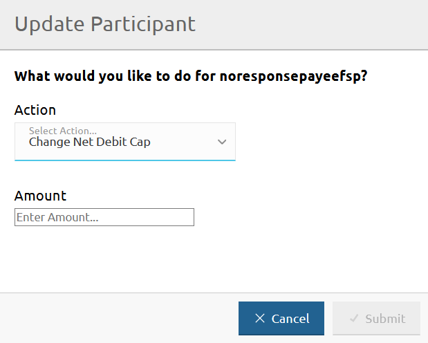
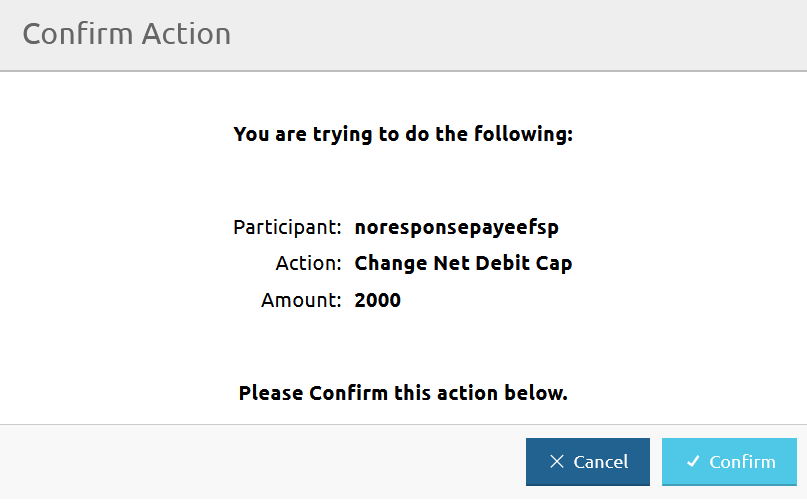

# Updating the Net Debit Cap of a DFSP

The **DFSP Financial Positions** page allows you to update the Net Debit Cap (NDC) of a DFSP.

To access the **DFSP Financial Positions** page, go to **Participants** > **DFSP Financial Positions**.

To update the Net Debit Cap of a DFSP, complete the following steps:

1. Click the **Update** button next to the DFSP for which you want to update the NDC. \

The **Update Participant** window pops up.
1. Select **Change Net Debit Cap** from the **Action** drop-down menu. \

1. Enter the new NDC amount in the **Amount** field. \

1. Click **Submit**.
1. On clicking **Submit**, a confirmation window pops up asking you to confirm the action. \

1. Click **Confirm**. \
On clicking **Confirm**, the **NDC** value on the **DFSP Financial Positions** page gets updated and displays the new NDC amount.