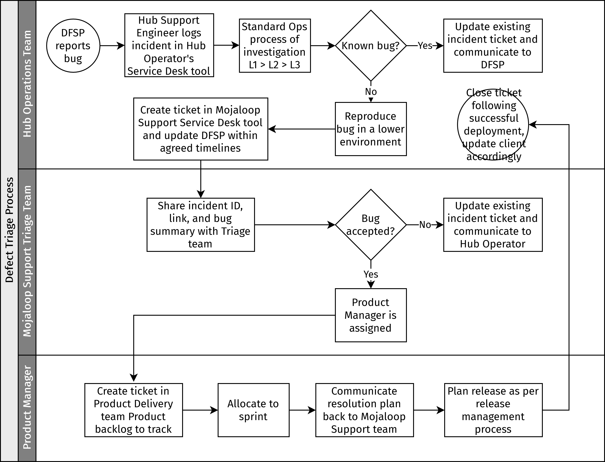

# Defect triage

The purpose of the defect triage process is to ensure that all the bugs identified in the Hub Operator's Production environment are captured, evaluated, and submitted to a Mojaloop Support team, a team dedicated to running Support services for the technical operations of a Mojaloop Hub. This team can be insourced or outsourced (or even part insourced and part outsourced), depending on the level of expertise or capacity within the scheme's hosting organization. If it is decided to outsource this function, there are organizations within the Mojaloop community that do provide different levels of support as a service. (For more information and referrals, contact the Mojaloop Foundation.)

::: tip NOTE 
The processes described in this section represent best practices and act as recommendations for organizations fulfilling a Hub Operator role. 
:::

::: tip NOTE
The process proposed here applies to bugs identified in the Hub Operator's Production environment, and new features or enhancements are outside its scope. However, to facilitate business conversations, Hub Operators can submit requests for new features or enhancements and those will be passed on to the Product teams in the community.
:::

There needs to be a specific team that is responsible for the evaluation and resolution planning of each bug raised in the various environments (Production, Staging, QA, Dev, and so on). It can be a Support team or a QA/Development team. Within the remainder of this section, this team is referred to as the "Mojaloop Support Triage team".

The Triage team has the following members: 

* Mojaloop Product Manager (core Mojaloop)
* Product Manager of extensions or other components implemented in the Hub - Payment Manager, PortX, and so on
* Hub Technical Subject Matter Expert (Product Delivery, that is Development and QA)
* Operations representative (Technical Operations and Infrastructure)

## Bugs identified in a Hub Operator Production environment

*Hub Operator steps:*

1. An incident ticket is raised in the Hub Operator's [Service Desk](key-terms-kpis.md#key-terms) tool by a Hub L1 Support Engineer, as per the [incident management process](incident-management.md).
1. The ticket is escalated to the Hub L2/L3 team for in-depth investigation and analysis, as required.
1. The Hub L2/L3 team evaluates if the behavior is a new bug or a known issue, and whether a bug ticket/record already exists. If it is a known bug and a Mojaloop Support ticket already exists, then the L1 engineer must update the existing ticket with new details and information, and the priority and impact/severity (level of impact on the Hub or to its users) may be adjusted accordingly. The L1 engineer must communicate this back to the reporter/client DFSP (as referred to, in point 6). New bugs will follow the rest of the process below.
1. The Hub L2/L3 team confirms that the Production issue can be reproduced in lower environments running the same version as the Production (PRD) environment. That is, the bug is not a user error or an environmental issue.
1. The Hub L3 team may escalate to the Hub Technical Operations Manager, and report the bug via the Mojaloop Support Service Desk tool, adding all details of their analysis (including clear steps to reproduce the bug, the expected behavior, the actual behavior and any log files and details from the L2/L3 investigations), in addition to the identifier of the incident ticket created in Step 1 for easy tracking.
1. Response/acknowledgement/communication is sent back to the client DFSP within the agreed timelines.

*Mojaloop Support team steps:*

1. The Mojaloop Support team reviews, allocates a team member as owner, and acknowledges receipt of the bug.
1. Following an initial review of the issue raised, the Mojaloop Support team member forwards the issue to the Triage team for further evaluation. \
The review of the ticket is conducted to a) establish good understanding of the issue raised, including the severity level and priority set by the Hub Operator; b) confirm completeness of the information provided, including log files, clear description, steps to reproduce, screenshots, and so on.
1. The Triage team evaluates the bug: enhancements/new feature requests are passed on to the community Product teams. Operational impact, severity, and priority are reviewed and the bug resolution is assigned to the relevant Product Manager. For details on prioritization, see [Prioritization of bugs](#prioritization-of-bugs).
1. The Product Manager clones the bug into their Product Delivery team's product backlog, which links both issues for reference and progress tracking. The Product Manager also reviews and sets priority against other items in their product backlog.
1. The Mojaloop Support Engineer assigned to the Mojaloop Support bug ticket monitors the cloned ticket and handles all communication between the Product Manager and the Hub Operator on the progress of the bugs, including sharing any remediation steps (for example, workarounds or alternative ways of using the affected functionality). Each subsequent update from the Product Delivery team should also be shared in the Product Manager bug ticket for visibility to the Hub Operator. The Product Manager assignee must remain the owner of the Product Manager bug ticket until the bug is resolved.
1. The Product Manager communicates the resolution plan and timelines back to the Support team via the original Product Manager bug ticket. The resolution plan is then communicated to the Hub Operator. \
\
For details on what happens if the Hub Operator does not agree with the proposed prioritization and resolution plan, see [Escalation process](#escalation-process). 
1. The bug is resolved following the standard development process of the allocated Product Delivery team and is included in a release, which will be made available to the Hub Operator or can be offered as an ad-hoc (patch) release, if required.
1. The Mojaloop Support ticket is closed once the bug fix release is deployed and validated in the Hub Operator's environment.

## Bugs identified during deployment/change window in Hub environment

Deployments into Hub environments are the responsibility of the Hub Operator's team, and bugs identified during the deployment should be raised via the standard process (that is, a ticket is raised as per the Hub’s incident management process and then escalated to the Mojaloop Support team if required). In addition: 

* The Hub team will evaluate if the behavior is a known issue or a new defect. For known issues, the release should proceed and be completed as planned with the known bug reported as part of the post-deployment report.
* For new defects identified, the release/change can be rolled back depending on severity. This can be decided by the deployment team. In the case of a roll-back, regression tests must be executed to confirm that the previous working version is stable on the environment and the bug reported as part of the post-deployment report.
* The bug is captured via the Mojaloop Support Service Desk tool and will be handled via the process described above.

## Escalation process

If there is any discrepancy between the priority assigned or the client's (Hub Operator's) expectations and the resolution plan provided by the Mojaloop Support team, the [incident management escalation matrix](incident-management-escalation-matrix.md) governs what happens next. Accordingly, the incident will be set as priority P1 or any other lower priority type and stakeholders will be informed.

The Mojaloop Support Team Lead and the Hub Operator Program Manager must be informed immediately. The Hub Operator Program Manager is a manager at the Hub organization who is responsible for translating the Scheme's business needs into technical operations directives.

## Ownership and responsibility

The creator of the Service Desk ticket (the Hub Operator's Support Engineer) remains the owner until the ticket is resolved.

Priority and severity must be aligned, discussed, and negotiated between the Mojaloop Support Triage team and the Hub Operator's Operations team.

Information from triage discussions and from the Product Delivery team must be shared in the Service Desk ticket by the Mojaloop Support Engineer. 

The Product Manager who is assigned the bug, must ensure that cross-referencing and tracking is in place to ensure the flow of information required or produced by the Product Delivery team's evaluation. 

The Product Manager who is assigned the bug, must determine and communicate the resolution plan back to the Mojaloop Support team/engineer, via the ticket only.

### Prioritization of bugs

The prioritization of bugs is the responsibility of Subject Matter Experts (SMEs) in the Mojaloop Support Triage team. 

All bugs are evaluated based on the expected behavior of the system and the actual behavior observed (and reproduced). The operational impact and the urgency of the bug must be captured by the Hub Operator's Operations team in order for this to be considered by the Triage team in the prioritization.

Every bug is evaluated against the Product roadmap and backlog.

New features or enhancement requests are channelled to the Product team and not handled by this process. This is communicated back to the requester via the Operations team.

::: tip
Priority is the order in which the bug will be fixed. The higher the priority, the sooner the bug will be resolved. \
\
Severity is the level of impact on the Hub or to its users. \
\
These two factors work hand in hand. For example, a cosmetic bug like a typo on a webpage will likely be ranked as low severity but could be a quick and easy fix and ranked high priority. Hence, it is important to set these values with due consideration.
:::

## Process flowchart

