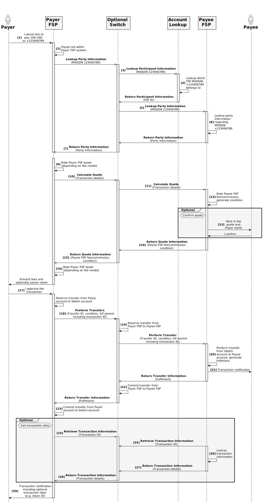
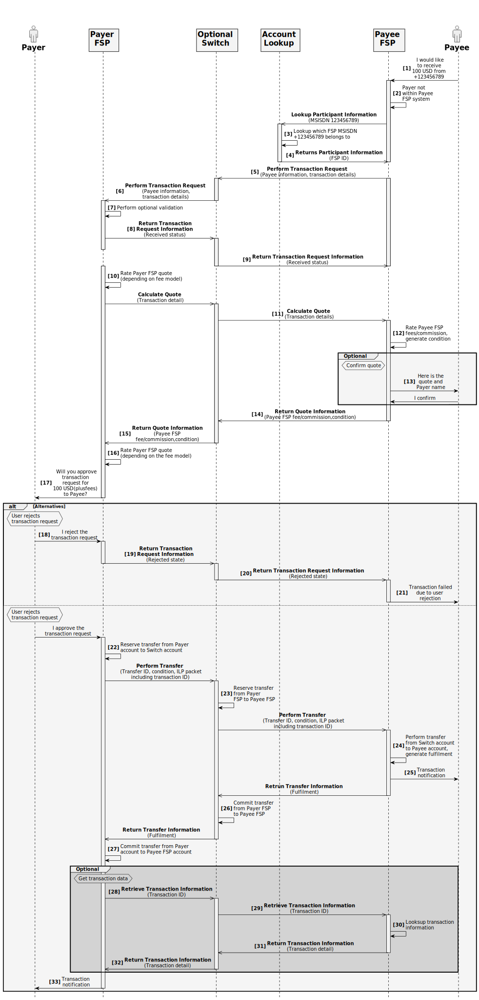
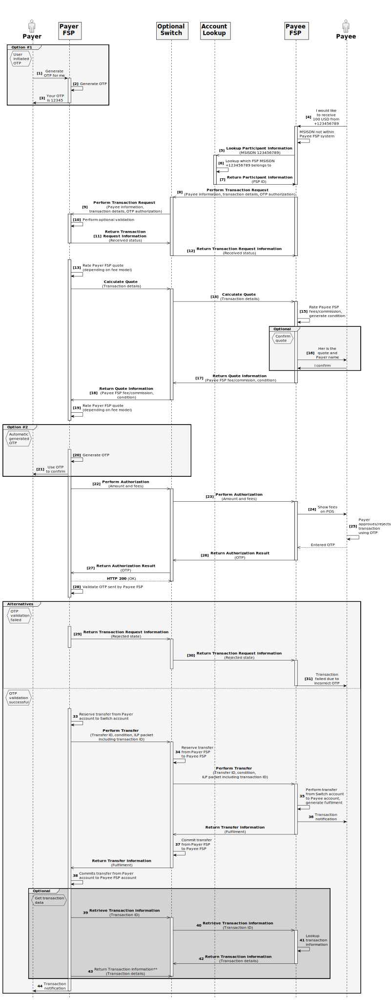
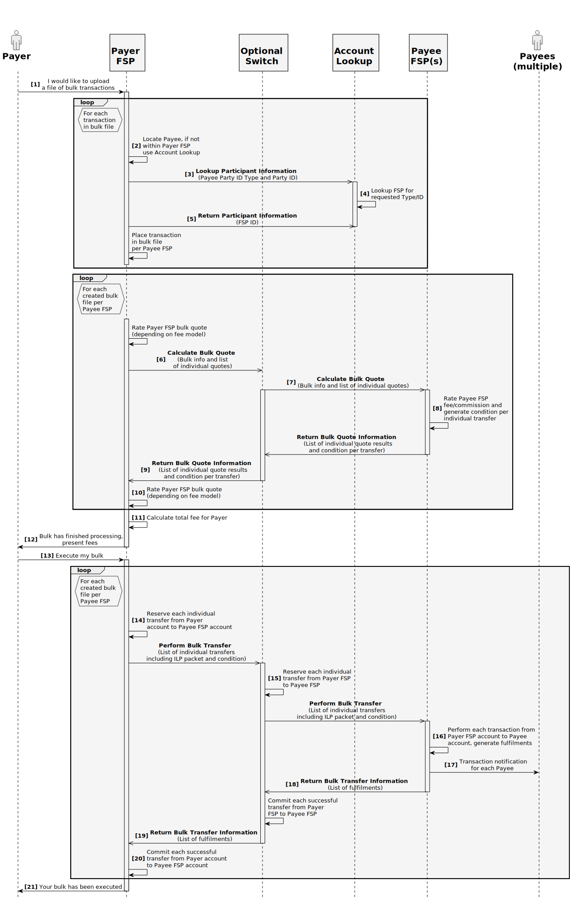

# Generic Transaction Patterns

## Preface

This section contains information about how to use this document.

### Conventions Used in This Document 

The following conventions are used in this document to identify the specified types of information

|Type of Information|Convention|Example|
|---|---|---|
|**Elements of the API, such as resources**|Boldface|**/authorization**|
|**Variables**|Italics within curly brackets|_{ID}_|
|**Glossary terms**|Italics on first occurrence; defined in _Glossary_|The purpose of the API is to enable interoperable financial transactions between a _Payer_ (a payer of electronic funds in a payment transaction) located in one _FSP_ (an entity that provides a digital financial service to an end user) and a _Payee_ (a recipient of electronic funds in a payment transaction) located in another FSP.|
|**Library documents**|Italics|User information should, in general, not be used by API deployments; the security measures detailed in _API Signature_ and _API Encryption_ should be used instead.|

### Document Version Information

|Version|Date|Change Description|
|---|---|---|
|**1.0**|2018-03-13|Initial version|

 

## Introduction

This document introduces the four generic transaction patterns that are supported in a logical version of the Interoperability API. Additionally, all logical services that are part of the API are presented on a high-level.

### Open API for FSP Interoperability Specification

The Open API for FSP Interoperability Specification includes the following documents.

#### Logical Documents

- [Logical Data Model](#)

- [Generic Transaction Patterns](./generic-transaction-patterns)

- [Use Cases](./use-cases)

#### Asynchronous REST Binding Documents

- [API Definition](./api-definition)

- [JSON Binding Rules](./json-binding-rules)

- [Scheme Rules](./scheme-rules)

#### Data Integrity, Confidentiality, and Non-Repudiation

- [PKI Best Practices](./pki-best-practices)

- [Signature](./v1.1/signature)

- [Encryption](./v1.1/encryption)

#### General Documents

- [Glossary](./glossary)

 

## Logical API Services

The Interoperability API consists of a number of logical API resources. Each resource defines one or more services that clients can use to connect to a server that has implemented the API. This section introduces these services.

**Note:** API services identified in this section may not be relevant to (and therefore may not appear in) the generic transaction patterns identified in [Generic Transaction Patterns](#generic-transaction-patterns). 

For example, some services are used for provisioning of information, are part of error cases, or are for retrieving information that is not necessary in a generic transaction pattern.

 

### Common Functionality

This section introduces functionality that is used by more than one logical API resource or service.

#### Party Addressing

A Party is an entity such as an individual, a business, an organization that has a financial account in one of the FSPs. A party is addressed by a combination of an _ID type_ and an _ID_, and possibly also a _subtype_ or _sub ID_. Some examples of _ID type_ and _ID_ combinations are:

- _ID type_: **MSISDN**, _ID_: **+123456789**

- _ID type_: **Email**, _ID_: **john@doe.com**

#### Interledger

The API includes basic support for the Interledger Protocol (ILP) by defining a concrete implementation of the Interledger Payment Request protocol[1](https://interledger.org/rfcs/0011-interledger-payment-request)(ILP) in the logical API resources **Quotes** and **Transfers**. More details of the ILP protocol can be found on the Interledger project website[2](https://interledger.org), in the Interledger Whitepaper[3](https://interledger.org/interledger.pdf), and in the Interledger architecture specification[4](https://interledger.org/rfcs/0001-interledger-architecture).

 

### API Resource Participants

In the API, a _Participant_ is the same as an FSP that is participating in an Interoperability Scheme. The primary purpose of the logical API resource **Participants** is for FSPs to find out in which other FSP a counterparty in an interoperable financial transaction is located. There are also services defined for the FSPs to provision information to a common system.

#### Requests

This section identifies the logical API service requests that can be sent from a client to a server.

##### Lookup Participant Information

The logical API service request `Lookup Participant Information` is used from an FSP to request from another system, which could be another FSP or a common system, information regarding in which FSP a counterparty in an interoperable financial transaction is located.

- Successful response: [Return Participant Information](#return-participant-information)

- Error response: [Return Participant Information Error](#return-participant-information-error)

##### Create Participant Information

The logical API service request `Create Participant Information` is used to provision information regarding in which FSP a party is located.

- Successful response: [Return Participant Information](#return-participant-information)

- Error response: [Return Participant Information Error](#return-participant-information-error)

##### Create Bulk Participant Information

The logical API service request `Create Bulk Participant Information` is used to provision information regarding in which FSP one or more parties are located.

- Successful response: [Return Bulk Participant Information](#return-bulk-participant-information)

- Error response: [Return Bulk Participant Information Error](#return-bulk-participant-information-error)

##### Delete Participant Information

The logical API service request `Delete Participant Information` is used to remove information regarding in which FSP a party is located.

- Successful response: [Return Participant Information](#return-participant-information)

- Error response: [Return Participant Information Error](#return-participant-information-error)

 

#### Responses

This section identifies the logical API service responses that can be sent back to a client from a server.

##### Return Participant Information

The logical API service response `Return Participant Information` is used to return information from the requests [Lookup Participant Information](#lookup-participant-information), [Create Participant Information](#create-participant-information) and [Delete Participant Information](#delete-participant-information).

##### Return Bulk Participant Information

The logical API service response `Return Bulk Participant Information` is used to return information from the request [Create Bulk Participant Information](#create-bulk-participant-information).

 

#### Error Responses

This section identifies the logical API service error responses that can be sent back to a client from a server.

##### Return Participant Information Error

The logical API service error response `Return Participant Information Error` is used to return error information regarding the requests [Lookup Participant Information](#lookup-participant-information), [Create Participant Information](#create-participant-information) and [Delete Participant Information](#delete-participant-information).

##### Return Bulk Participant Information Error

The logical API service error response `Return Bulk Participant Information Error` is used to return information from the request [Create Bulk Participant Information](#create-bulk-participant-information).

 

### API Resource Parties

In the API, a _Party_ is an individual, a business, an organization, or a similar entity, that has a financial account in one of the FSPs. The primary purpose of the logical API resource **Parties** is for FSPs to ascertain information regarding a counterparty in an interoperable financial transaction, such as name and birth date of the Party.

#### Requests

This section identifies the logical API service requests that can be sent from a client to a server.

##### Lookup Party Information

The logical API service request `Lookup Party Information` is used by an FSP to request from another FSP information regarding a counterparty in an interoperable financial transaction.

- Successful response: [Return Party Information](#return-party-information).

- Error response: [Return Party Information Error](#return-party-information-error).

 

#### Responses

This section identifies the logical API service responses that can be sent back to a client from a server.

##### Return Party Information

The logical API service response `Return Party Information` is used to return information from the request [Lookup Party Information](#lookup-party-information).

 

#### Error Responses

This section identifies the logical API service error responses that can be sent back to a client from a server.

##### Return Party Information Error

The logical API service error response `Return Party Information Error` is used to return error information regarding the request [Lookup Party Information](#lookup-party-information).

 

### API Resource Transaction Requests

In the API, a _Transaction Request_ is a request from a Payee to a Payer to transfer electronic funds to the Payee, which the Payer can accept or reject. The primary purpose of the logical API resource **Transaction Requests** is for a Payee FSP to send the request to transfer to the Payer FSP.

#### Requests

This section identifies the logical API service requests that can be sent from a client to a server.

##### Perform Transaction Request

The logical API service request `Perform Transaction Request` is used to send a Transaction Request from a Payee FSP to the Payer FSP; that is, to ask if a Payer will accept or reject a transaction from the Payer to the Payee.

- Successful response: [Return Transaction Request Information](#return-transaction-request-information)

- Error response: [Return Transaction Request Information Error](#return-transaction-request-information-error)

##### Retrieve Transaction Request Information

The logical API service request `Retrieve Transaction Request Information` is used from a Payee FSP to a Payer FSP to request information regarding a previously-sent Transaction Request.

- Successful response: [Return Transaction Request Information](#return-transaction-request-information)

- Error response: [Return Transaction Request Information Error](#return-transaction-request-information-error)

 

#### Responses

This section identifies the logical API service responses that can be sent back to a client from a server.

##### Return Transaction Request Information

The logical API service response `Return Transaction Request Information` is used to return information from the requests [Perform Transaction Request](#perform-transaction-request) or [Retrieve Transaction Request Information](#retrieve-transaction-request-information).

 

#### Error Responses

This section identifies the logical API service error responses that can be sent back to a client from a server.

##### Return Transaction Request Information Error

The logical API service error response `Return Transaction Request Information Error` is used to return error information regarding the requests [Perform Transaction Request](#perform-transaction-request) or [Retrieve Transaction Request Information](#retrieve-transaction-request-information).

 

### API Resource Quotes

In the API, a _Quote_ is the price for performing an interoperable financial transaction from the Payer FSP to the Payee FSP. The primary purpose of the logical API resource **Quotes** is for a Payer FSP to request a Payee FSP to calculate the Payee FSP's part of the quote.

#### Requests

This section identifies the logical API service requests that can be sent from a client to a server.

##### Calculate Quote

The logical API service request `Calculate Quote` is used from a Payer FSP to ask a Payee FSP to calculate the Payee FSP's part of the quote to perform an interoperable financial transaction. The Payee FSP should also create the ILP Packet and the condition (see [Interledger](#interledger) section for links to more information) when receiving the request.

- Successful response: [Return Quote Information](#return-quote-information)

- Error response: [Return Quote Information Error](#return-quote-information-error)

 

##### Retrieve Quote Information

The logical API service request `Retrieve Quote Information` is used by a Payer FSP to request that a Payee FSP ask for information regarding a previously-sent [Calculate Quote](#calculate-quote) request.

- Successful response: [Return Quote Information](#return-quote-information)

- Error response: [Return Quote Information Error](#return-quote-information-error)

 

#### Responses

This section identifies the logical API service responses that can be sent back to a client from a server.

##### Return Quote Information

The logical API service response `Return Quote Information` is used to return information from the requests [Calculate Quote](#calculate-quote) or [Retrieve Quote Information](#retrieve-quote-information).

 

#### Error Responses

This section identifies the logical API service error responses that can be sent back to a client from a server.

##### Return Quote Information Error

The logical API service error response `Return Quote Information Error` is used to return error information regarding the requests [Calculate Quote](#calculate-quote) or [Retrieve Quote Information](#retrieve-quote-information).

 

### API Resource Authorizations

In the API, an _Authorization_ is an approval from a Payer to perform an interoperable financial transaction by entering the applicable credentials in a Payee FSP system. An example where this kind of approval is used, is when a Payer is using an ATM that is managed by another FSP. The primary purpose of the logical API resource **Authorizations** is for a Payer FSP to request a Payee FSP to ask the Payer to enter the credentials.

#### Requests

This section identifies the logical API service requests that can be sent from a client to a server.

##### Perform Authorization

The logical API service request `Perform Authorization` is used from a Payer FSP to ask a Payee FSP to enter the applicable credentials to approve an interoperable financial transaction.

- Successful response: [Return Authorization Result](#return-authorization-result)

- Error response: [Return Authorization Error](#return-authorization-error)

 

#### Responses

This section identifies the logical API service responses that can be sent back to a client from a server.

##### Return Authorization Result

The logical API service response `Return Authorization Result` is used to return information from the request [Perform Authorization](#perform-authorization).

 

#### Error Responses

This section identifies the logical API service error responses that can be sent back to a client from a server.

##### Return Authorization Error

The logical API service error response `Return Authorization Error` is used to return error information regarding the request [Perform Authorization](#perform-authorization).

 

### API Resource Transfers

In the API, a _Transfer_ is hop-to-hop ILP (see [Interledger](#interledger) section for links to more information) transfer of funds. 

The transfer also contains information regarding the end-to-end interoperable financial transaction. The primary purpose of the logical API resource **Transfers** is for an FSP or Switch to request that the next entity in the chain of the ILP Payment perform the transfer involved in the interoperable financial transaction.

#### Requests

This section identifies the logical API service requests that can be sent from a client to a server.

##### Perform Transfer

The logical API service request `Perform Transfer` is used by an FSP or Switch to request the next entity in the chain of the ILP Payment to reserve the transfer involved in an interoperable financial transaction.

- Successful response: [Return Transfer Information](#return-transfer-information)

- Error response: [Return Transfer Information Error](#return-transfer-information-error)

##### Retrieve Transfer Information

The logical API service request `Retrieve Transfer Information` is used by an FSP or Switch to request the next entity in the chain of the ILP Payment for information regarding the transfer involved in an interoperable financial transaction.

- Successful response: [Return Transfer Information](#return-transfer-information)

- Error response: [Return Transfer Information Error](#return-transfer-information-error)

 

#### Responses

This section identifies the logical API service responses that can be sent back to a client from a server.

##### Return Transfer Information

The logical API service response `Return Transfer Information` is used to return information from the requests [Perform Transfer](#perform-transfer) or [Retrieve Transfer Information](#retrieve-transfer-information). On receiving the [Return Transfer Information](#return-transfer-information) response, the FSP or Switch should validate the fulfilment (see [Interledger](#interledger) section for links to more information) and commit the reserved transfer if the validation is successful.

 

#### Error Responses

This section identifies the logical API service error responses that can be sent back to a client from a server.

##### Return Transfer Information Error

The logical API service error response `Return Transfer Information Error` is used to return error information regarding the requests [Perform Transfer](#perform-transfer) or [Retrieve Transfer Information](#retrieve-transfer-information).

 

### API Resource Transactions

In the API, a _Transaction_ is an end-to-end interoperable financial transaction between the Payer FSP and Payee FSP. The primary purpose of the logical API resource **Transactions** is for a Payer FSP to request end-to-end information from the Payee FSP regarding an interoperable financial transaction; for example, in order to get a token or code that the Payer can use to redeem a service or product.

### Requests

This section identifies the logical API service requests that can be sent from a client to a server.

##### Retrieve Transaction Information

The logical API service request `Retrieve Transaction Information` is used by a Payer FSP to request that a Payee FSP get information regarding a previously-performed interoperable financial transaction (by using the logical API resource **Transfers**, see [API Resource Tarnsfers](#api-resource-transfers) section).

- Successful response: [Return Transfer Information](#return-transfer-information)

- Error response: [Return Transfer Information Error](#return-transfer-information-error)

 

#### Responses

This section identifies the logical API service responses that can be sent back to a client from a server.

##### Return Transaction Information

The logical API service response`*Return Transaction Information` is used to return information from the request [Retrieve Transfer Information](#retrieve-transfer-information).

 

#### Error Responses

This section identifies the logical API service error responses that can be sent back to a client from a server.

##### Return Transaction Information Error

The logical API service error response `Return Transaction Information Error` is used to return error information regarding the request [Retrieve Transfer Information](#retrieve-transfer-information).

 

### API Resource Bulk Quotes

In the API, a _Bulk Quote_ is a collection of individual quotes (see [API Resource Quotes](#api-resource-quotes) section for information regarding a single quote) for performing more than one interoperable financial transaction from the Payer FSP to the Payee FSP. 

The primary purpose of the logical API resource **Bulk Quotes** is for a Payer FSP to request a Payee FSP to calculate the Payee FSP's part of the bulk quote.

#### Requests

This section identifies the logical API service requests that can be sent from a client to a server.

##### Calculate Bulk Quote

The logical API service request `Calculate Bulk Quote` is used by a Payer FSP to request that a Payee FSP calculate the Payee FSP's part of the quotes to perform more than one interoperable financial transaction. 

The Payee FSP should also create the ILP Packet and the condition (see [Interledger](#interledger) section for links to more information) per quote when receiving the request.

- Successful response: [Return Bulk Quote Information](#return-bulk-quote-information)

- Error response: [Return Bulk Quote Information Error](#return-bulk-quote-information-error)

##### Retrieve Bulk Quote Information

The logical API service request `Retrieve Bulk Quote Information` is used by a Payer FSP to request that a Payee FSP ask for information regarding a previously-sent [Calculate Bulk Quote](#calculate-bulk-quote) request.

- Successful response: [Return Bulk Quote Information](#return-bulk-quote-information)

- Error response: [Return Bulk Quote Information Error](#return-bulk-quote-information-error)

 

#### Responses

This section identifies the logical API service responses that can be sent back to a client from a server.

##### Return Bulk Quote Information

The logical API service response `Return Bulk Quote Information` is used to return information from the requests [Calculate Bulk Quote](#calculate-bulk-quote) or [Retrieve Bulk Quote Information](#retrieve-bulk-quote-information).

 

#### Error Responses

This section identifies the logical API service error responses that can be sent back to a client from a server.

##### Return Bulk Quote Information Error

The logical API service error response `Return Bulk Quote Information Error` is used to return error information regarding the requests [Calculate Bulk Quote](#calculate-bulk-quote) or [Retrieve Bulk Quote Information](#retrieve-bulk-quote-information).

 

### API Resource Bulk Transfers

In the API, a _Bulk Transfer_ is a collection of hop-to-hop ILP (see [Interledger.](#interledger)section for links to more information) transfers of funds. The transfers also contain information regarding the end-to-end interoperable financial transactions. 

The primary purpose of the logical API resource **Bulk Transfers** is to enable an FSP or Switch to request that the next entity in the chain of the ILP Payment perform the transfers involved in the interoperable financial transactions.

#### Requests

This section identifies the logical API service requests that can be sent from a client to a server.

##### Perform Bulk Transfer

The logical API service request `Perform Bulk Transfer` is used by an FSP or Switch to request that the next entity in the chain of the ILP Payment reserve the transfer involved in an interoperable financial transaction.

- Successful response: [Return Bulk Transfer Information](#return-bulk-transfer-information)

- Error response: [Return Bulk Transfer Information Error](#return-bulk-transfer-information-error)

##### Retrieve Bulk Transfer Information

The logical API service request `Retrieve Bulk Transfer Information` is used from an FSP or Switch to request that the next entity in the chain of the ILP Payment for information regarding the transfer involved in an interoperable financial transaction.

- Successful response: [Return Bulk Transfer Information](#return-bulk-transfer-information)

- Error response: [Return Bulk Transfer Information Error](#return-bulk-transfer-information-error)

 

#### Responses

This section identifies the logical API service responses that can be sent back to a client from a server.

##### Return Bulk Transfer Information

The logical API service response `Return Bulk Transfer Information` is used to return information from the requests [Perform Bulk Transfer](#perform-bulk-transfer) or [Retrieve Bulk Transfer Information](#retrieve-bulk-transfer-information).

On receiving the response **Return Bulk Transfer Information**, the FSP or Switch should validate the fulfilments (see [Interledger](#interledger) section for links to more information) and commit the reserved transfers if the validations are successful.

 

#### Error Responses

This section identifies the logical API service error responses that can be sent back to a client from a server.

##### Return Bulk Transfer Information Error

The logical API service error response `Return Bulk Transfer Information Error` is used to return error information regarding the requests [Perform Bulk Transfer](#perform-bulk-transfer) or [Retrieve Bulk Transfer Information](#retrieve-bulk-transfer-information).

 

## Generic Transaction Patterns

This section provides information about the three primary transaction patterns defined in the Interoperability API:

- [Payer-Initiated Transaction](#payer-initiated-transaction)

- [Payee-Initiated Transaction](#payee-initiated-transaction)

- [Bulk Transaction](#bulk-transaction)

Each transaction pattern defines how funds can be transferred from a Payer located in one Financial Service Provider (FSP) to a Payee located in another FSP.

Both the [Payer-Initiated Transaction](#payer-initiated-transaction) and the [Payee-Initiated Transaction](#payee-initiated-transaction) patterns are intended for a single transfer of funds from one Payer to one Payee. The significant difference between the two patterns is in which of the participants in the transaction is responsible for the initiation of the transaction.

The [Bulk Transaction](#bulk-transaction) pattern should be used when a single Payer would like to transfer funds to multiple Payees, possibly in different FSPs, in a single transaction.

This section also provides information about _Payee-Initiated Transaction using OTP_. which is an alternative to the [Payee-Initiated Transaction](#payee-initiated-transaction).

Additionally, the section provides high-level information about all logical services that are part of the API.

 

### Payer-Initiated Transaction

In a _Payer-Initiated Transaction_, the `Payer` initiates the transaction.

#### Business Process Pattern Description

The _Payer-Initiated Transaction_ pattern should be used whenever a `Payer` would like to transfer funds to another party whose account is not located in the same FSP.

In most implementations, `Payee` involvement is limited to receiving a notification in the event of a successful transaction. Exceptions in which the Payee is more involved are:

- In countries that require the `Payee` to confirm receipt of funds.

- Cases in which the `Payee` should accept the terms of the transaction (for example, Agent-Initiated Cash-In).

#### Participants and Roles

The actors in a _Payer-Initiated Transaction_ are:

- **Payer** -- The payer of funds in a financial transaction.

- **Payee** -- The recipient of funds in a financial transaction.

The intermediary objects used in a _Payer-Initiated Transaction_ to perform the transaction are:

- **Payer FSP** -- The FSP in which the Payer's account is located.

- **Switch (optional)** -- An optional entity used for routing of requests between different FSPs. This object can be removed if requests should be routed directly between a Payer and Payee FSP.

- **Account Lookup System** -- An entity used for retrieving information regarding accounts or participants. Could be hosted in a separate server, in the Switch, or in the different FSPs.

- **Payee FSP** -- The FSP in which the Payee's account is located.

#### Business Process Sequence Diagram

Figure 1 shows the UML sequence diagram for a _Payer-Initiated Transaction_.

**Figure 1 -- Payer-Initiated Transaction**

#### Internal Processing Steps

This section provides descriptions of and assumptions made for all steps in the sequence shown in [Figure 1](#business-process-sequence-diagram).

##### Lookup Counterparty

1. **Description**

    The `Payer` initiates the transaction by requesting to send funds to a `Payee`, using the `Payer FSP`'s front-end API (outside the scope of this API).

    **Assumptions**

    None.

2. **Description**

    The `Payer FSP` tries to find the `Payee` within the FSP system. Because the `Payee` cannot be found in the `Payer FSP` system, the request [Lookup Party Information](#lookup-party-information) is sent by the `Payer FSP` to the optional `Switch` to get information regarding the `Payee`, including in which FSP the `Payee` is located.

    **Assumptions**

    The Payee is assumed to be in a different FSP than the `Payer`. Also, a `Switch` is assumed to be placed between the `Payer FSP` and the `Payee FSP` to route the messages between FSPs. The `Switch` is optional in the process, as the request [Lookup Party Information](#lookup-party-information) could also be sent directly to the `Payee FSP` if there is no `Switch` in-between. As the `Payer FSP` should not know in which FSP the `Payee` is located if there is no `Switch` present, the request might need to be sent to more than one FSP.

3. **Description**

    The `Switch` receives the request [Lookup Party Information](#lookup-party-information). The `Switch` then tries to find in which FSP the `Payee` is located by sending the request [Lookup Participant Information](#lookup-participant-information) to the `Account Lookup System`.

    **Assumptions**

    An `Account Lookup System` is assumed to exist in a different server than the `Switch`. It is possible that the `Account Lookup System` is in the same system as the `Switch`.

4. **Description**

    The `Account Lookup System` receives the request [Lookup Participant Information](#lookup-participant-information). It then performs an internal lookup to find in which FSP the `Payee` is located. When the lookup is completed, the response [Return Participant Information](#return-participant-information) is sent to inform the Switch about which FSP the `Payee` is located in.

   **Assumptions**

    The `Payee` can be found by the `Account Lookup System`.

5. **Description**

    The `Switch` receives the response [Return Participant Information](#return-participant-information). As the `Switch` now knows in which FSP the `Payee` is located, the `Switch` sends the request  [Lookup Participant Information](#lookup-participant-information) to the `Payee FSP` to get more information about the `Payee`.

    **Assumptions**

    None.

6. **Description**

    The `Payee FSP` receives the request [Lookup Participant Information](#lookup-participant-information). The `Payee FSP` then does an internal lookup to find more information regarding the `Payee` and sends the response [Return Participant Information](#return-participant-information) to the `Switch`. 

    **Assumptions**

    None.

7. **Description**

    The `Switch` receives the response [Return Party Information](#return-party-information). The `Switch` then routes the [Return Party Information](#return-party-information) response to the `Payer FSP` to send the information about the `Payee`.

    **Assumptions**

    None.

8. **Description**

    The `Payer FSP` receives the response [Return Party Information](#return-party-information) containing information about the `Payee`. 

    **Assumptions**

    None.

 

##### Calculate Quote

9. **Description**

    Depending on the fee model used, the `Payer FSP` rates the transaction internally and includes the quote information in the request [Calculate Quote](#calculate-quote) to a `Switch` to retrieve the full quote for performing the interoperable financial transaction from the `Payer FSP` to the `Payee FSP`. The transaction details are sent in the parameters of the request to allow for the `Payee FSP` to correctly calculate the quote.

    **Assumptions**

    In this sequence, a `Switch` is placed between the `Payer FSP` and the `Payee FSP` to route the messages. The `Switch` is optional in the process, as the request[Calculate Quote](#calculate-quote) could also be sent directly to the `Payee FSP` if there is no `Switch` in-between.

10. **Description**

    The `Switch` receives the [Calculate Quote](#calculate-quote) request. The `Switch` then routes the request to the `Payee FSP`, using the same parameters.

    **Assumptions**

    None.

11. **Description**

    The `Payee FSP` receives the [Calculate Quote](#calculate-quote) request. The `Payee FSP` then internally calculates the fees or FSP commission for performing the transaction. It then constructs the ILP Packet containing the ILP Address of the `Payee`, the amount that the `Payee` will receive, and the transaction details. The fulfilment and the condition are then generated out of the ILP Packet combined with a local secret.

    **Assumptions**

    None.

    **Optional procedure: Quote Confirmation by Payee**
    
    a. **Description**

    Depending on the use case and the fee model used, the `Payee` might be informed of the quote in order to confirm the proposed financial transaction. The quote is in that case sent to the `Payee` using a front-end API (outside the scope of this API). The `Payee` receives the quote including information regarding the transaction including fees and optionally `Payer` name. The `Payee` then confirms the quote using a front-end API (outside the scope of this API), and the `Payee FSP` receives the confirmation from the `Payee`. 
   
    **Assumptions** 
   
    The `Payee` is assumed to accept and confirm the quote. If the `Payee` would reject the quote, an error response would be sent from the `Payee` FSP to the `Payer FSP` via the `Switch` to inform about the rejected quote.

    **End of Optional procedure**

12. **Description**

    The `Payee FSP` uses the response [Return Quote Information](#return-quote-information) to the `Switch` to return information to the `Payer FSP` about the quote, the ILP Packet, and the condition. The quote has an expiration time, to inform the `Payer FSP` until which point in time the quote is valid.

    **Assumptions**

    None.

13. **Description**

    The `Switch` receives the response [Return Quote Information](#return-quote-information). The `Switch` will then route the response to the `Payer FSP`.

    **Assumptions**

    None.

14. **Description**

    The `Payer FSP` receives the response[Return Quote Information](#return-quote-information) from the `Switch`. The `Payer FSP` then informs the `Payer` using a front-end API (outside the scope of this API) about the total fees to perform the transaction, along with the `Payee` name.

    **Assumptions**

    The total quote can be calculated by the `Payer FSP`. Also, the `Payee` name was allowed to be sent during the counterparty lookup (depending on regulation on privacy laws).

15. **Description**

    The `Payer` receives the transaction information including fees, taxes and optionally `Payee` name. If the `Payer` rejects the transaction, the sequence ends here. 
   
    **Assumptions** 
   
    The `Payer` is assumed to approve the transaction in this sequence. If the `Payer` would reject the transaction at this stage, no response regarding the rejection is sent to the `Payee FSP`. The created quote at the `Payee FSP` should have an expiry time, at which time it is automatically deleted.

 

##### Perform Transfer

16. **Description**

    The `Payer FSP` receives an approval of the interoperable financial transaction using a front-end API (out of scope of this API). The `Payer FSP` then performs all applicable internal transaction validations (for example, limit checks, blacklist check, and so on). If the validations are successful, a transfer of funds is reserved from the `Payer`'s account to either a combined `Switch` account or a `Payee FSP` account, depending on setup. After the transfer has been successfully reserved, the request [Perform Transfer](#perform-transfer) is sent to the `Switch` to request the `Switch` to transfer the funds from the `Payer FSP` account in the Switch to the `Payee FSP` account. The request [Perform Transfer](#perform-transfer) includes a reference to the earlier quote, an expiry of the transfer, the ILP Packet, and the condition that was received from the `Payee FSP`. The interoperable financial transaction is now irrevocable from the `Payer FSP`.

    **Assumptions**

    Internal validations and reservation are assumed to be successful. In this sequence, a `Switch` is placed between the `Payer FSP` and the `Payee FSP` to route the messages. The `Switch` is optional in the process, as the request [Perform Transfer](#perform-transfer) could also be sent directly to the `Payee FSP` if there is no `Switch` in-between.

17. **Description**

    The `Switch` receives the request [Perform Transfer](#perform-transfer). The `Switch` then performs all its applicable internal transfer validations (for example, limit checks blacklist check and so on). If the validations are successful, a transfer is reserved from a `Payer FSP` account to a `Payee FSP` account. After the transfer has been successfully reserved, the request [Perform Transfer](#perform-transfer) is sent to the `Payee FSP`, including the same ILP Packet and condition as was received from the `Payer FSP`. The expiry time should be decreased by the `Switch` so that the `Payee FSP` should answer before the `Switch` answers to the `Payer FSP`. The transfer is now irrevocable from the `Switch`. 
   
    **Assumptions**

    Internal validations and reservation are successful.

18. **Description**

    The `Payee FSP` receives the request [Perform Transfer](#perform-transfer). The `Payee FSP` then performs all applicable internal transaction validations (for example, limit checks, blacklist check, and so on). It also verifies that the amount and ILP Address in the ILP Packet are correct and match the amount and `Payee` in the transaction details stored in the ILP Packet. If all the validations are successful, a transfer of funds is performed from either a combined `Switch` account or a `Payer FSP` account to the `Payee`'s account and the fulfilment of the condition is regenerated, using the same secret as in Step 11. After the interoperable financial transaction has been successfully performed, a transaction notification is sent to the `Payee` using a front-end API (out of scope of this API) and the response **Return Transfer Information** is sent to the `Switch`, including the regenerated fulfilment. The transfer is now irrevocable from the `Payee FSP`.

    **Assumptions**

    Internal validations and transfer of funds are successful.

19. **Description**

    The `Payee` receives a transaction notification containing information about the successfully performed transaction. 
   
    **Assumptions**

    None.

20. **Description**

    The `Switch` receives the response [Return Transfer Information](#return-transfer-information). The `Switch` then validates the fulfilment and commits the earlier reserved transfer. The `Switch` then uses the response [Return Transfer Information](#return-transfer-information) to the `Payer FSP`, using the same parameters.

    **Assumptions**

    The fulfilment is assumed to be correctly validated.

21. **Description**

    The `Payer FSP` receives the response [Return Transfer Information](#return-transfer-information). The `Payer FSP` then validates the fulfilment and commits the earlier reserved transaction.

    **Assumptions**

    The fulfilment is assumed to be correctly validated.

**Optional fragment: Get Transaction Details**

22. **Description**

    In case the interoperable financial transaction contains additional information that is useful for the `Payer` or the `Payer FSP`, such as a code or a voucher token, the `Payer FSP` can use the request [Return Transfer Information](#return-transfer-information) to get the additional transaction information. The request [Retrieve Transaction Information](#retrieve-transaction-information) is sent to the `Switch`.

    **Assumptions**

    None.

23. **Description**

    The `Switch` receives the request [Retrieve Transaction Information](#retrieve-transaction-information). The `Switch` then routes the [Retrieve Transaction Information](#retrieve-transaction-information) request to the `Payee FSP`.

    **Assumptions**

    None.

24. **Description**

    The `Payee FSP` receives the request [Retrieve Transaction Information](#retrieve-transaction-information). The `Payee FSP` then collects the requested information and sends the response [Return Transaction Information](#return-transaction-information) to the `Switch`.

    **Assumptions**

    The transaction with the provided ID can be found in the `Payee FSP`.

25. **Description**

    The `Switch` receives the response [Return Transaction Information](#return-transaction-information). The Switch then routes the [Return Transaction Information](#return-transaction-information) response to the `Payer FSP`.

    **Assumptions**

    None.

26. **Description**

    The `Payer FSP` receives the response [Return Transaction Information](#return-transaction-information).

    **Assumptions**

    None.

    **End of Optional fragment**

28. **Description**

    The `Payer FSP` sends a transaction notification to the `Payee` using a front-end API (out of scope of this API), optionally including transaction details retrieved from the `Payee FSP`.

    **Assumptions**

    None.

29. **Description**

    The `Payer` receives a transaction notification containing information about the successfully performed transaction. 
    
    **Assumptions**

    None.

 

### Payee-Initiated Transaction

In a _Payee-Initiated Transaction_, the `Payee` (that is, the recipient of electronic funds) initiates the transaction.

#### Business Process Pattern Description

The pattern should be used whenever a `Payee` would like to receive funds from another party whose account is not located in the same FSP.

In all alternatives to this pattern, the `Payer` must in some way confirm the request of funds. Some possible alternatives for confirming the request are:

- **Manual approval** -- A transaction request is routed from the Payee to the Payer, the Payer can then either approve or reject the transaction.

- **Pre-approval of Payee** -- A Payer can pre-approve a specific Payee to request funds, used for automatic approval of, for example, school fees or electric bills.

Another alternative for approval is to use the business pattern [Payee-Initiated Transaction using OTP](#payee-initiated-transaction-using-otp).

#### Participants and Roles

The actors in a _Payee-Initiated Transaction_ are:

- **Payer** -- The payer of funds in a financial transaction.

- **Payee** -- The recipient of funds in a financial transaction.

The intermediary objects used in a _Payee-Initiated Transaction_ to perform the transaction are:

- **Payer FSP** -- The FSP in which the Payer's account is located.

- **Switch (optional)** -- An optional entity used for routing of requests between different FSPs. This object can be removed if requests should be routed directly between a Payer and Payee FSP.

- **Account Lookup System** -- An entity used for retrieving information regarding accounts or participants. Could be hosted in a separate server, in the Switch, or in the different FSPs.

- **Payee FSP** -- The FSP in which the Payee's account is located.

#### Business Process Sequence Diagram

Figure 2 shows the UML sequence diagram for a _Payee-Initiated Transaction_.

**Figure 2 -- Payee-Initiated Transaction**

#### Internal Processing Steps

This section provides descriptions of and assumptions made for all steps in the sequence shown in Figure 2 above.

##### Lookup Counterparty

1. **Description**

    The `Payee` initiates the transaction by requesting to receive funds from a `Payer`, using the `Payee FSP`'s front-end API (outside the scope of this API).

    **Assumptions**

    None.

2. **Description**

    The `Payee FSP` tries to find the Payer within the FSP system. Because the `Payer` cannot be found in the `Payee FSP` system, the `Payee FSP` sends the request to the optional `Account Lookup System` to get information regarding in which FSP the `Payer` is located.

    **Assumptions**

    The `Payer` is assumed to be located in a different FSP than the `Payee`. Also, an `Account Lookup System` is assumed to exist. 
    
    The `Account Lookup System` is optional in the process, as the request [Lookup Participant Information](#lookup-participant-information) could also be sent directly to the` Payer FSP` if there is no `Account Lookup System`. As the `Payee FSP` should not know in which FSP the Payer is located if there is no `Account Lookup System` present, the request might need to be sent to more than one FSP. It is also possible that the `Payee FSP` would like more information about the `Payer` before a transaction request is sent; in that case the request [Lookup Participant Information](#lookup-participant-information), either to the Switch or directly to the `Payer FSP`, should be sent instead of [Lookup Participant Information](#lookup-participant-information) to the `Account Lookup System`.

3. **Description**

    The `Account Lookup System` receives the [Lookup Participant Information](#lookup-participant-information). It then performs an internal lookup to find in which FSP the `Payer` is located. When the lookup is completed, the response [Return Participant Information](#return-participant-information) is sent to inform the `Payee FSP` about which FSP the `Payer` is located.

    **Assumptions**

    The `Payer` can be found by the `Account Lookup System`.

4. **Description**

    The `Payee FSP` receives the response [Return Participant Information](#return-participant-information).

    **Assumptions**

    None.

    **Transaction Request**

5. **Description**

    The `Payee FSP` sends the request [Perform Transaction Request](#perform-transaction-request) to the `Switch`. The request contains the transaction details including the amount that the Payee would like to receive.

    **Assumptions**

    In this sequence, a `Switch` is placed between the `Payee FSP` and the `Payer FSP` to route the messages. The `Switch` is optional in the process, as the request [Perform Transaction Request](#perform-transaction-request) could also be sent directly to the `Payer FSP` if there is no Switch in-between.

6. **Description**

    The `Switch` receives the [Perform Transaction Request](#perform-transaction-request). The `Switch` then routes the request to the `Payer FSP`, using the same parameters.

    **Assumptions**

    None.

7. **Description**

    The `Payer FSP` receives the request [Perform Transaction Request](#perform-transaction-request). The `Payer FSP` then optionally validates the transaction request (for example, whether the `Payer` exists) and uses the response [Return Transaction Request Information](#return-transaction-request-information) to inform the `Payee FSP` via the `Switch` that the transaction request has been received. 

    **Assumptions** 

    The optional validation succeeds.

8. **Description**

    The `Switch` receives the response [Return Transaction Request Information](#return-transaction-request-information). The `Switch` then sends the same response [Return Transaction Request Information](#return-transaction-request-information) to inform the `Payee FSP` about the successfully delivered transaction request to the `Payer FSP`.

    **Assumptions** 

    None. 

9. **Description**

    The `Payee FSP` receives the response [Return Transaction Request Information](#return-transaction-request-information) from the `Switch`. 

    **Assumptions** 

    None.

 

##### Calculate Quote

10. **Description**

    The `Payer FSP` rates the transaction internally based on the fee model used and includes the quote information in the request[Calculate Quote](#calculate-quote) to a `Switch` to retrieve the full quote for performing the interoperable financial transaction from the `Payer FSP` to the `Payee FSP`. The transaction details, including a reference to the earlier sent transaction request, are sent in the parameters of the request to allow for the `Payee FSP` to correctly calculate the quote. 

    **Assumptions** 

    In this sequence, a `Switch` is placed between the `Payer FSP` and the `Payee FSP` to route the messages. The `Switch` is optional in the process, as the request [Calculate Quote](#calculate-quote) could also be sent directly to the `Payee FSP` if there is no `Switch` in-between. 

11. **Description**

    The `Switch` receives the [Calculate Quote](#calculate-quote) request. The `Switch` then routes the request to the `Payee FSP`. 

    **Assumptions**

    None.

12. **Description**

    The `Payee FSP` receives the [Calculate Quote](#calculate-quote) request. The `Payee FSP` then internally calculates the fees or FSP commission for performing the transaction. It then constructs the ILP Packet containing the ILP Address of the `Payee`, the amount that the `Payee` will receive, and the transaction details. The fulfilment and the condition are then generated out of the ILP Packet combined with a local secret.

    **Assumptions**

    None

13. **Description**

    Depending on use case and the fee model used, the `Payee` might be informed of the quote so that the `Payee` can confirm the proposed financial transaction. The quote is in that case sent to the `Payee` using a front-end API (outside the scope of this API). The `Payee` receives the quote including information regarding the transaction including fees and optionally Payer name. The `Payee` then confirms the quote using a front-end API (outside the scope of this API). The `Payee FSP` receives the confirmation from the `Payee`.

    **Assumptions**

    The quote is assumed to be sent to the `Payer` for confirmation, and the `Payee` is assumed to accept and confirm the quote. If the `Payee` would reject the quote, an error response would be sent from the `Payee FSP` to the `Payer FSP` via the `Switch` to inform about the rejected quote.

    **End of Optional fragment**

14. **Description**

    The `Payee FSP` uses the response [Return Quote Information](#return-quote-information) to the `Switch` to return information to the `Payer FSP` about the quote, the ILP Packet, and the condition. The quote has an expiration time, to inform the `Payer FSP` until which point in time the quote is valid.

    **Assumptions**

    None.

15. **Description**

    The `Switch` receives the response [Return Quote Information](#return-quote-information). The `Switch` then routes the response to the `Payer FSP`.

    **Assumptions**

    None.

16. **Description**

    The `Payer FSP` receives the response [Return Quote Information](#return-quote-information) from the `Switch`. The `Payer FSP` then informs the `Payer` using a front-end API (outside the scope of this API) about the transaction request from the `Payee`, including the amount and the total fees required to perform the transaction, along with the `Payee` name. 

    **Assumptions**

    The total quote can be calculated by the `Payer FSP`. Also, the `Payee` name was allowed to be sent during the counterparty lookup (depending on regulation on privacy laws).

17. **Description**

    The `Payer` receives the transaction request information including fees, taxes and optionally `Payee` name. 

    **Assumptions**

    If the `Payer` rejects the transaction request, the sequence proceeds to Step 18. If the `Payer` approves the transaction request, the sequence proceeds to Step 22.

    **Alternative: Transaction Rejection**

18. **Description**

    The `Payer FSP` receives the rejection of the transaction request using a front-end API (out of scope of this API). The `Payer FSP` then uses the response [Return Transaction Request Information](#return-transaction-request-information) with a rejected status to inform the `Switch` that the transaction was rejected.

    **Assumptions**

    The `Payer` is assumed to reject the transaction request in Step 17.

19. **Description**

    The `Switch` receives the response [Return Transaction Request Information](#return-transaction-request-information) from the `Payer FSP`. The `Switch` then routes the response [Return Transaction Request Information](#return-transaction-request-information) to the `Payee FSP`.

    **Assumptions**

    None.

20. **Description**

    The `Payee FSP` receives the response *[Return Transaction Request Information](#return-transaction-request-information) with a rejected status from the `Switch`. The `Payee FSP` then informs the Payee using a front-end API (outside the scope of this API) about the rejected transaction request.

    **Assumptions**

    None.

21. **Description**

    The `Payee` receives the notification that the transaction was rejected. The process ends here as the transaction request was rejected and the `Payee` has been informed of the decision.

    **Assumptions**

    None.

    **Alternative: Perform Transfer**

22. **Description**

    The `Payer FSP` receives an approval of the interoperable financial transaction using a front-end API (out of scope of this API). The `Payer FSP` then performs all applicable internal transaction validations (for example, limit checks, blacklist check, and so on). If the validations are successful, a transfer of funds is reserved from the `Payer`'s account to either a combined `Switch` account or a `Payee FSP` account, depending on setup. After the transfer has been successfully reserved, the request [Perform Transfer](#perform-transfer) is sent to the `Switch` to request the `Switch` to transfer the funds from the `Payer FSP` account in the `Switch` to the `Payee FSP` account. The request [Perform Transfer](#perform-transfer) includes a reference to the earlier quote, an expiry of the transfer, the ILP Packet, and the condition that was received from the `Payee FSP`. The interoperable financial transaction is now irrevocable from the `Payer FSP`.

    **Assumptions**

    The `Payer` is assumed to approve the transaction request in Step 17. Internal validations and reservation are assumed to be successful. In this sequence, a `Switch` is placed between the `Payer FSP` and the `Payee FSP` to route the messages. The Switch is optional in the process, as the request [Perform Transfer](#perform-transfer) could also be sent directly to the `Payee FSP` if there is no `Switch` in-between.

23. **Description**

    The `Switch` receives the request [Perform Transfer](#perform-transfer). The `Switch` then performs all its applicable internal transfer validations (for example, limit checks, blacklist check, and so on). If the validations are successful, a transfer is reserved from a `Payer FSP` account to a `Payee FSP` account. After the transfer has been successfully reserved, the request [Perform Transfer](#perform-transfer) is sent to the `Payee FSP`, including the same ILP Packet and condition as was received from the Payer FSP. The expiry time should be decreased by the `Switch`, so that the `Payee FSP` should answer before the `Switch` should answer to the `Payer FSP`. The transfer is now irrevocable from the `Switch`. 

    **Assumptions**

    Internal validations and reservation are successful.

24. **Description**

    The `Payee FSP` receives the request [Perform Transfer](#perform-transfer). The `Payee FSP` then performs all applicable internal transaction validations (for example, limit checks, blacklist check, and so on). It also verifies that the amount and ILP Address in the ILP Packet are correct and match the amount and `Payee` in the transaction details stored in the ILP Packet. If all the validations are successful, a transfer of funds is performed from either a combined `Switch` account or a `Payer FSP` account to the `Payee`'s account and the fulfilment of the condition is regenerated, using the same secret as in Step 11. After the interoperable financial transaction has been successfully performed, a transaction notification is sent to the Payee using a front-end API (out of scope of this API) and the response [Return Transfer Information](#return-transfer-information) is sent to the `Switch`, including the regenerated fulfilment. The transfer is now irrevocable from the `Payee FSP`.

    **Assumptions**

    Internal validations and transfer of funds are successful.

25. **Description**

    The `Payee` receives a transaction notification containing information about the successfully performed transaction. 

    **Assumptions**

    None.

26. **Description**

    The `Switch` receives the response [Return Transfer Information](#return-transfer-information). The `Switch` then validates the fulfilment and commits the earlier reserved transfer. The `Switch` then uses the response [Return Transfer Information](#return-transfer-information) to the `Payer FSP`, using the same parameters.

    **Assumptions**

    The fulfilment is assumed to be correctly validated.

27. **Description**

    The `Payer FSP` receives the response [Return Transfer Information](#return-transfer-information). The `Payer FSP` then validates the fulfilment and commits the earlier reserved transaction.

    **Assumptions**

    The fulfilment is assumed to be correctly validated.

    **Optional fragment: Get Transaction Details**

28. **Description**

    In case the interoperable financial transaction contains additional information that is useful for the `Payer` or the `Payer FSP`; for example, a code or a voucher token, the `Payer FSP` can use the request [Retrieve Transaction Information](#retrieve-transaction-information) to get the additional information. The request  [Retrieve Transaction Information](#retrieve-transaction-information) is sent to the `Switch`.

    **Assumptions**

    None.

29. **Description**

    The `Switch` receives the request  [Retrieve Transaction Information](#retrieve-transaction-information). The `Switch` then routes the request  [Retrieve Transaction Information](#retrieve-transaction-information) to the `Payee FSP`.

    **Assumptions**

    None.

30. **Description**

    The `Payee FSP` receives the request  [Retrieve Transaction Information](#retrieve-transaction-information). The `Payee FSP` then collects the requested information and uses the response [Retrieve Transaction Information](#retrieve-transaction-information) to the `Switch`. 

    **Assumptions**

    The transaction with the provided ID can be found in the Payee FSP.

31. **Description**

    The `Switch` receives the response  [Retrieve Transaction Information](#retrieve-transaction-information). The `Switch` then routes the  [Retrieve Transaction Information](#retrieve-transaction-information) response to the `Payer FSP`.

    **Assumptions**

    None.

32. **Description**

    The `Payer FSP` receives the response  [Retrieve Transaction Information](#retrieve-transaction-information) from the `Switch`.

    **Assumptions**

    None.

    **End of Optional fragment**

33. **Description**

    The `Payer FSP` sends a transaction notification to the `Payee` using a front-end API (out of scope of this API), optionally including transaction details retrieved from the `Payee FSP`.

    **Assumptions**

    None.

34. **Description**

    The `Payer` receives a transaction notification containing information about the successfully performed transaction. 

    **Assumptions**

    None.

 

### Payee-Initiated Transaction using OTP

A _Payee-Initiated Transaction using OTP_ is very similar to a [Payee-Initiated Transaction](#payee-initiated-transaction), but the transaction information (including fees and taxes) and approval for the `Payer` is shown/entered on a `Payee` device instead.

#### Business Process Pattern Description

The pattern should be used when a `Payee` would like to receive funds from another party whose account is not located in the same FSP, and both the transaction information (including fees and taxes) and approval is shown/entered on a `Payee` device instead.

- **Approval using OTP** -- A `Payer` can approve a transaction by first creating an OTP in his/her FSP. An alternative to user- initiated creation of OTP is that the OTP is automatically generated and sent by the `Payer FSP`. The same OTP is then entered by the `Payer` in a `Payee` device, usually a POS device or an ATM. The OTP in the transaction request is automatically matched by the `Payer FSP` to either approve or reject the transaction. The OTP does not need to be encrypted as it should only be valid once during a short time period.

#### Participants and Roles

The actors in a _Payee-Initiated Transaction using OTP_ are:

- **Payer** -- The payer of funds in a financial transaction.

- **Payee** -- The recipient of funds in a financial transaction.

The intermediary objects used in a _Payee-Initiated Transaction using OTP_ to perform the transaction are:

- **Payer FSP** -- The FSP in which the Payer's account is located.

- **Switch (optional)** -- An optional entity used for routing of requests between different FSPs. This object can be removed if requests should be routed directly between a Payer and Payee FSP.

- **Account Lookup System** -- An entity used for retrieving information regarding accounts or participants. Could be hosted in a separate server, in the Switch, or in the different FSPs.

- **Payee FSP** -- The FSP in which the Payee's account is located.

#### Business Process Sequence Diagram

Figure 3 shows the UML sequence diagram for a _Payee-Initiated Transaction using OTP_.

**Figure 3 -- Payee-Initiated Transaction using OTP**

#### Internal Processing Steps

This section provides descriptions of and assumptions made for all steps in the sequence shown in Figure 3 above.

##### Optional fragment: Manual OTP request

1. **Description**

    The `Payer` requests that an OTP be generated, using the `Payer FSP`'s front-end API (outside the scope of this API).

    **Assumptions**

    There are two alternatives for generating an OTP; either it is generated upon request by the `Payer` (this option), or it is automatically generated in Step 19.

2. **Description**

    The `Payer FSP` receives the request to generate an OTP and returns a generated OTP to the `Payer`, using the `Payer FSP`'s front-end API (outside the scope of this API).

    **Assumptions**

    None.

3. **Description**

    `Payer` receives the generated OTP. The OTP can then be used by the `Payer` in Step 25 for automatic approval. 

    **Assumptions**

    None.

    **End of Optional fragment**

###### Lookup Counterparty

4. **Description**

    The `Payee` initiates the transaction by requesting to receive funds from a `Payer`, using the `Payee FSP`'s front-end API (outside the scope of this API). 
    
    **Assumptions** 
    
    None.

5. **Description**

    The `Payee FSP` tries to find the `Payer` within the FSP system. Because the `Payer` cannot be found in the `Payee FSP` system, the request **Lookup Participant Information** is sent by the `Payee FSP` to the optional Account Lookup System to get information regarding in which FSP the Payer is located. 

    **Assumptions** 

    The `Payer` is assumed to be in a different FSP than the `Payee`. Also, an `Account Lookup System` is assumed to exist. The `Account Lookup System` is optional in the process, as the request [Lookup Participant Information](#lookup-participant-information) could also be sent directly to the `Payer FSP` if there is no `Account Lookup System`. As the `Payee FSP` should not know in which FSP the `Payer` is located if there is no `Account Lookup System` present, the request might need to be sent to more than one FSP. It is also possible that the `Payee FSP` would like more information about the Payer before a transaction request is sent; in that case the request [Lookup Party Information](#lookup-party-information), either to the `Switch` or directly to the `Payer FSP`, should be sent instead of [Lookup Participant Information](#lookup-participant-information) to the `Account Lookup System`.

6. **Description**

    The `Account Lookup System` receives the [Lookup Participant Information](#lookup-participant-information). It then performs an internal lookup to find in which FSP the `Payer` is located. When the lookup is completed, the response [Return Participant Information](#return-participant-information) is sent to inform the `Payee FSP` about which FSP the `Payer` is located in. 

    **Assumptions** 

    The `Payer` can be found by the `Account Lookup System`.

7. **Description**

    The `Payee FSP` receives the response [Return Participant Information](#return-participant-information). 

    **Assumptions** 

    None.

##### Transaction Request

8. **Description**

    The Payee FSP sends the request [Perform Transaction Request](#perform-transaction-request) to the `Switch`. The request contains the transaction details including the amount that the `Payee` would like to receive, and that the request should be validated using an OTP (possibly a QR code containing a OTP).

    **Assumptions** 

    In this sequence, a `Switch` is placed between the `Payee FSP` and the `Payer FSP` to route the messages. The `Switch` is optional in the process, as the request [Perform Transaction Request](#perform-transaction-request) could also be sent directly to the `Payer FSP` if there is no `Switch` in-between.

9. **Description**

    The `Switch` receives the request [Perform Transaction Request](#perform-transaction-request). The `Switch` then routes the request to the `Payer FSP`, using the same parameters. 

    **Assumptions** 

    None.

10. **Description**

    The `Payer FSP` receives the request [Perform Transaction Request](#perform-transaction-request). The `Payer FSP` then optionally validates the transaction request (for example, whether the `Payer` exists or not) and sends the response [Return Transaction Request Information](#return-transaction-request-information) to inform the `Payee FSP` via the `Switch` that the transaction request has been received.

    **Assumptions** 

    The optional validation succeeds.

11. **Description**

    The `Switch` receives the response [Return Transaction Request Information](#return-transaction-request-information). The `Switch` then uses the same response [Return Transaction Request Information](#return-transaction-request-information) to inform the `Payee FSP` about the successfully delivered transaction request to the `Payer FSP`.

    **Assumptions:** 

    None.

12. **Description**

    The `Payee FSP` receives the response [Return Transaction Request Information](#return-transaction-request-information) from the `Switch`. 

    **Assumptions** 

    None.

    **Calculate Quote**

13. **Description**

    The `Payer FSP` rates the transaction internally based on the fee model used and includes the quote information in the request [Calculate Quote](#calculate-quote) to a `Switch` to retrieve the full quote for performing the interoperable financial transaction from the `Payer FSP` to the `Payee FSP`. The transaction details, including a reference to the transaction request, are sent in the parameters of the request to allow for the `Payee FSP` to correctly calculate the quote. 

    **Assumptions** 

    In this sequence, a `Switch` is placed between the `Payer FSP` and the `Payee FSP` to route the messages. The `Switch` is optional in the process, as the request [Calculate Quote](#calculate-quote) could also be sent directly to the `Payee FSP` if there is no `Switch` in-between.

14. **Description**

    The `Switch` receives the [Calculate Quote](#calculate-quote) request. The `Switch` then routes the request to the `Payee FSP`, using the same parameters.

    **Assumptions** 

    None.

15. **Description**

    The `Payee FSP` receives the [Calculate Quote](#calculate-quote) request. The `Payee FSP` then internally calculates the fees or FSP commission for performing the transaction. It then constructs the ILP Packet containing the ILP Address of the `Payee`, the amount that the `Payee` will receive, and the transaction details. The fulfilment and the condition is then generated out of the ILP Packet combined with a local secret. 

    **Assumptions**

    None.

    **Optional fragment: Quote Confirmation by Payee**

16. **Description**

    Depending on the fee model used and which use case it is, the `Payee` might be informed of the quote to be able to confirm the proposed financial transaction. The quote is in that case sent to the `Payee` using a front- end API (outside the scope of this API. The `Payee` receives the quote including information regarding the transaction including fees and optionally `Payer` name. The `Payee` then confirms the quote using a front-end API (outside the scope of this API). The `Payee FSP` receives the confirmation from the `Payee`. 

    **Assumptions** 

    The quote is assumed to be sent to the Payer for confirmation, and the `Payee` is assumed to accept and confirm the quote. If the `Payee` would reject the quote, an error response would be sent from the `Payee FSP` to the `Payer FSP` via the `Switch` to inform about the rejected quote.

    **End of Optional fragment**

17. **Description**

    The `Payee FSP` uses the response [Return Quote Information](#return-quote-information) to the `Switch` to return information to the `Payer FSP` about the quote, the ILP Packet, and the condition. The quote has an expiration time, to inform the `Payer FSP` until which point in time the quote is valid.

    **Assumptions**

    None.

18. **Description**

    The `Switch` receives the response [Return Quote Information](#return-quote-information). The `Switch` will then route the request to the `Payer FSP`. 

    **Assumptions**

    None.

19. **Description**

    The `Payer FSP` receives the response [Return Quote Information](#return-quote-information) from the Switch. 

    **Assumptions** 

    The total quote can be calculated by the `Payer FSP`.

    **Optional fragment: Automatic OTP generation**

20. **Description**

    The `Payer FSP` automatically generates an OTP and sends it to the `Payer`, using the `Payer FSP`'s front-end API (outside the scope of this API).

    **Assumptions** 

    There are two alternatives for generating the OTP. Either it is generated upon request by the `Payer` (Step 1), or it is automatically generated (this option).

21. **Description**

    The `Payer` receives the automatically-generated OTP. 

    **Assumptions**

    None.

    **End of Optional fragment**

22. **Description**

    The `Payer FSP` sends the request [Perform Authorization](#perform-authorization) to the `Switch`, to get an authorization to perform the transaction from the Payer via a POS, ATM, or similar payment device, in the `Payee FSP`. The request includes the amount to be withdrawn from the `Payer`'s account, and how many retries are left for the `Payer` to retry the OTP. 

    **Assumptions** 

    None.

23. **Description**

    The `Switch` receives the request [Perform Authorization](#perform-authorization) from the `Payer FSP`. The `Switch` then routes the [Perform Authorization](#perform-authorization) to the `Payee FSP`. 

    **Assumptions** 

    None.

24. **Description**

    The `Payee FSP` receives the request [Perform Authorization](#perform-authorization) from the `Switch`. The `Payee FSP` sends the authorization request to the `Payee` device (POS, ATM, or similar payment device) using the `Payee FSP`'s front-end API (outside the scope of this API). 

    **Assumptions** 

    None.

25. **Description**

    The `Payee` device receives the authorization request, and the `Payer` can see the amount that will be withdrawn from his or her account. The `Payer` then uses the OTP received in Step 3 or Step 21, depending on whether the OTP was manually requested or automatically generated. The entered or scanned OTP is then sent to the `Payee FSP` using the `Payee FSP`'s front-end API (outside the scope of this API). 

    **Assumptions** 

    The `Payer` has received the OTP in Step 3 or Step 21.

26. **Description**

    The `Payee FSP` receives the OTP from the `Payee` device. The `Payee FSP` then sends the response [Return Authorization Result](#return-authorization-result) to the Switch containing the OTP from the Payer. 

    **Assumptions** 

    None.

27. **Description**

    The `Switch` receives the request [Return Authorization Result](#return-authorization-result) from the `Payee FSP`. The `Switch` then routes the [Return Authorization Result](#return-authorization-result) to the `Payer FSP`. 

    **Assumptions** 

    None.

28. **Description**

    The `Payer FSP` receives the request [Return Authorization Result](#return-authorization-result) to the `Switch`. The `Payer FSP` then validates the OTP received from the OTP generated in Step 2 or Step 20. If the `Payer FSP` is unable to validate the OTP (for example, because the OTP is incorrect) and this was the last remaining retry for the Payer, the sequence continues with Step 29. If the `Payer FSP` correctly validates the OTP, the sequence continues with Step 33. 

    **Assumptions** 

    None.

    **Alternative: OTP validation failed**

29. **Description**

    The validation in Step 28 fails and this was the final retry for the Payer. The `Payer FSP` then uses the response [Return Transaction Request Information](#return-transation-request-information) with a rejected state to inform the `Switch` that the transaction was rejected. 

    **Assumptions** 

    The OTP validation in Step 28 is assumed to fail and no more retries remains for the Payer.

30. **Description**

    The `Switch` receives the response [Return Transaction Request Information](#return-transation-request-information) from the Payer FSP. The `Switch` then routes the [Return Transaction Request Information](#return-transation-request-information) response to the `Payee FSP`.

    **Assumptions** 

    None.

31. **Description**

    The `Payee FSP` receives the response [Return Transaction Request Information](#return-transation-request-information) with a rejected status from the `Switch`. The `Payee FSP` then informs the `Payee` using a front-end API (outside the scope of this API) about the rejected transaction request. 

    **Assumptions** 

    None.

32. **Description**

    The `Payee` receives the notification that the transaction was rejected. The process ends here as the transaction request was rejected and the `Payee` has been informed of the decision. The `Payer` is also assumed to receive the notification via the `Payee` device. 

    **Assumptions** 

    None.

    **Alternative: OTP validation succeed**

33. **Description**

    The validation in Step 28 is successful. The `Payer FSP` then performs all applicable internal transaction validations (for example, limit checks, blacklist check, and so on). If the validations are successful, a transfer of funds is reserved from the `Payer`'s account to either a combined Switch account or a `Payee FSP` account, depending on setup. After the transfer has been successfully reserved, the request [Perform Transfer](#perform-transfer) is sent to the `Switch` to request the `Switch` to transfer the funds from the `Payer FSP` account in the `Switch` to the `Payee FSP` account. The request [Perform Transfer](#perform-transfer) includes a reference to the earlier quote, an expiry of the transfer, the ILP Packet, and the condition that was received from the `Payee FSP`. The interoperable financial transaction is now irrevocable from the `Payer FSP`. 

    **Assumptions** 

    The OTP validation in Step 28 is assumed to be successful. Internal validations and reservation are assumed to be successful. In this sequence, a Switch is placed between the `Payer FSP` and the `Payee FSP` to route the messages. The Switch is optional in the process, as the request [Perform Transfer](#perform-transfer) could also be sent directly to the `Payee FSP` if there is no Switch in-between.

    34. **Description**

    The `Switch` receives the request [Perform Transfer](#perform-transfer). The `Switch` then performs all its applicable internal transfer validations (for example, limit checks, blacklist check, and so on). If the validations are successful, a transfer is reserved from a `Payer FSP` account to a `Payee FSP` account. After the transfer has been successfully reserved, the request [Perform Transfer](#perform-transfer) is sent to the Payee FSP, including the same ILP Packet and condition as was received from the Payer FSP. The expiry time should be decreased by the Switch so that the `Payee FSP` should answer before the Switch should answer to the `Payer FSP`. The transfer is now irrevocable from the `Switch`. 

    **Assumptions** 

    Internal validations and reservation are successful.

35. **Description**

    The `Payee FSP` receives the [Perform Transfer](#perform-transfer). The `Payee FSP` then performs all applicable internal transaction validations (for example, limit checks, blacklist check, and so on). It also verifies that the amount and ILP Address in the ILP Packet are correct, and match the amount and `Payee` in the transaction details stored in the ILP Packet. If all the validations are successful, a transfer of funds is performed from either a combined `Switch` account or a Payer FSP account to the `Payee`'s account and the fulfilment of the condition is regenerated, using the same secret as in Step 11. After the interoperable financial transaction has been successfully performed, a transaction notification is sent to the `Payee` using a front-end API (out of scope of this API) and the response [Return Transfer Information](#return-transfer-information) is sent to the `Switch`, including the regenerated fulfilment. The transfer is now irrevocable from the `Payee FSP`. 

    **Assumptions** 

    Internal validations and transfer of funds are successful.

36. **Description**

    The `Payee` receives a transaction notification containing information about the successfully performed transaction. 

    **Assumptions** 

    None.

37. **Description**

    The `Switch` receives the response [Return Transfer Information](#return-transfer-information). The `Switch` then validates the fulfilment and commits the earlier reserved transfer. The `Switch` will then use the response [Return Transfer Information](#return-transfer-information)  to the `Payer FSP`, using the same parameters.

    **Assumptions** 

    The fulfilment is assumed to be correctly validated.

38. **Description**

    The `Payer FSP` receives the response [Return Transfer Information](#return-transfer-information). The` Payer FSP` then validates the fulfilment and commits the earlier reserved transaction. 

    **Assumptions**

    The fulfilment is assumed to be correctly validated.

    **Optional fragment: Get Transaction Details**

39. **Description**

    In case the interoperable financial transaction contains additional information that is useful for the `Payer` or the `Payer FSP`, such as a code or a voucher token, the `Payer FSP` can use the request [Retrieve Transaction Information](#retrieve-transaction-information) to get the additional information. The request [Retrieve Transaction Information](#retrieve-transaction-information) is sent to the Switch.

    **Assumptions** 

    None.

40. **Description**

    The `Switch` receives the request [Retrieve Transaction Information](#retrieve-transaction-information). The `Switch` then routes the request[Retrieve Transaction Information](#retrieve-transaction-information) to the `Payee FSP`. 

    **Assumptions** 

    None.

41. **Description**

    The `Payee FSP` receives the request *[Retrieve Transaction Information](#retrieve-transaction-information). The `Payee FSP` then collects the requested information and uses the response [Return Transaction Information](#return-transaction-information) to the `Switch`. 

    **Assumptions** 

    The transaction with the provided ID can be found in the `Payee FSP`.

42. **Description**

    The `Switch` receives the response [Return Transaction Information](#return-transaction-information). The `Switch` then routes the [Return Transaction Information](#return-transaction-information) response to the `Payer FSP`. 

    **Assumptions** 

    None.

43. **Description**

    The `Payer FSP` receives the response [Return Transaction Information](#return-transaction-information) from the `Switch`. 

    **Assumptions** 

    None.

    **End of Optional fragment**

44. **Description**

    The `Payer FSP` sends a transaction notification to the `Payee` using a front-end API (out of scope of this API), optionally including transaction details retrieved from the `Payee FSP`. 

    **Assumptions** 

    None.

45. **Description**

    The `Payer` receives a transaction notification containing information about the successfully performed transaction. 

    **Assumptions** 

    None.

 

### Bulk Transactions

In a _Bulk Transaction_, the `Payer` (that is, the sender of funds) initiates multiple transactions to multiple Payees, potentially located in different FSPs.

#### Business Process Pattern Description

The pattern should be used whenever a `Payer` would like to transfer funds to multiple Payees in the same transaction. The Payees can potentially be located in different FSPs.

#### Participants and Roles

The actors in a _Bulk Transaction_ are:

- **Payer** -- The sender of funds.

- **Payees** -- The recipients of funds. There should be multiple Payees in a _Bulk Transaction_.

The intermediary objects used in a _Bulk Transaction_ to perform the transaction are:

- **Payer FSP** -- The FSP in which the Payer's account is located.

- **Switch (optional)** -- An optional entity used for routing of transactions between different FSPs. This object can be removed if transactions should be routed directly between a Payer and `Payee FSP`.

- **Account Lookup System** -- An entity used for retrieving information regarding accounts or participants. Could be hosted in a separate server, in the Switch, or in the different FSPs.

- **Payee FSP** -- The FSP in which a Payee's account is located. There may be multiple Payee FSPs in a _Bulk Transaction_.

#### Business Process Sequence Diagram

Figure 4 below shows the UML sequence diagram for a _Bulk Transaction_.

**Figure 4 -- Bulk Transaction**

#### Internal Processing Steps

This section provides descriptions of and assumptions made for all steps in the sequence shown in Figure 4.

##### Lookup Counterparties

1. **Description**

    The `Payer` initiates the bulk transaction process by uploading a bulk file to the `Payer FSP`, using the `Payer FSP`'s front-end API (outside the scope of this API). 

    **Assumptions** 

    None.

    **Loop for each Transaction in bulk file**

2. **Description**

    `Payer FSP` tries to find the Payee within the `Payer FSP` system.

    **Assumptions** 

    The `Payee` is assumed to be located in a different FSP than the `Payer`. If the `Payee` is within the `Payer FSP`, the transaction can be handled internally in the `Payer FSP` (outside the scope of this API).

3. **Description**

    The `Payer FSP` sends the request [Lookup Participant Information](#lookup-participant-information) to the optional `Account Lookup System` to get information regarding in which FSP the `Payer` is present in. 

    **Assumptions** 

    The `Payee` is assumed to in a different FSP than the `Payer`. Also, an `Account Lookup System` is assumed to exist. The `Account Lookup System` is optional in the process, as the request  [Lookup Participant Information](#lookup-participant-information) could also be sent directly to the `Payee FSP`s if there is no `Account Lookup System`. As the `Payer FSP `should not know in which FSP the `Payee` is located in if there is no `Account Lookup System` present, the request might need to be sent to more than one FSP. It is also possible that the `Payer FSP` would like more information about the `Payee` before a bulk transaction is executed; for example, for additional verification purposes of the `Payee` name. In that case, the request [Lookup Party Information](#lookup-party-information), either to the `Switch` or directly to the `Payee FSP`, should be sent instead of the request [Lookup Participant Information](#lookup-participant-information) to the `Account Lookup System`.

4. **Description**

    The `Account Lookup System` receives the request [Lookup Participant Information](#lookup-participant-information) It then performs an internal lookup to find in which FSP the `Payee` is located. When the lookup is completed, the response [Return Participant Information](#return-participant-information) is sent to inform the Payer FSP about which FSP the `Payee` is located in. 

    **Assumptions** 

    The `Payee` can be found by the `Account Lookup System`.

5. **Description**

    The `Payer FSP` receives the response [Return Participant Information](#return-participant-information). The `Payee` and the related transaction is then placed in a new bulk file separated per `Payee FSP`. 

    **Assumptions** 

    None.

    **End of loop for each Transaction**

##### Calculate Bulk Quote

    **Loop for each `Payee FSP` to Calculate Bulk Quote**

6. **Description**

    The `Payer FSP` uses the request [Calculate Bulk Quote](#calculate-bulk-quote) on a `Switch` to retrieve a quote for performing the bulk transaction from the `Payer FSP` to the `Payee FSP`. The request contains details for each individual transaction in the bulk transaction. 

    **Assumptions** 

    In this sequence, a `Switch` is placed between the `Payer FSP` and the `Payee FSP` to route the messages. The Switch is optional in the process, as the request [Calculate Bulk Quote](#calculate-bulk-quote) could also be sent directly to the `Payee FSP` if there is no `Switch` in-between.

7. **Description**

    The `Switch` receives the [Calculate Bulk Quote](#calculate-bulk-quote) request. The `Switch` then routes the request to the `Payee FSP`, using the same parameters.

    **Assumptions** 

    None.

8. **Description**

    The `Payee FSP` receives the [Calculate Bulk Quote](#calculate-bulk-quote) request. The `Payee FSP` then internally calculates the fees or FSP commission for performing each individual transaction in the bulk transaction. For each individual transaction, the `Payee FSP` then constructs an ILP Packet containing the ILP Address of the `Payee`, the amount that the `Payee` will receive, and the transaction details. The fulfilment and the condition is then generated out of the ILP Packet combined with a local secret. It then uses the response [Return Bulk Quote Information](#return-bulk-quote-information) to the `Switch` to inform the `Payer FSP` about the fees involved in performing the bulk transaction and the ILP Packet and condition. The bulk quote has an expiration date and time, to inform the `Payer FSP` until which time the bulk quote is valid. 

    **Assumptions** 

    The bulk quote can be calculated by the `Payee FSP`.

9. **Description**

    The Switch receives the response [Return Bulk Quote Information](#return-bulk-quote-information). The `Switch` then routes the response to the Payer FSP. 

    **Assumptions** 

    None.

10. **Description**

    The `Payer FSP` receives the response [Return Bulk Quote Information](#return-bulk-quote-information) from the `Switch`. 

    **Assumptions** 

    None.

    **End of loop for each `Payee FSP`**

11. **Description**

    The `Payer FSP` calculates any internal bulk fees and taxes, and informs the `Payer` using a front-end API (outside the scope of this API) about the total fees and taxes to perform the bulk transaction.

    **Assumptions**

    None.

12. **Description**

    The `Payer` receives the notification about the completed processing of the bulk transaction and the fees and taxes to perform the bulk transaction. The `Payer` then decides to execute the bulk transaction.

    **Assumptions** 

    The `Payer` is assumed to execute the bulk transaction. If the `Payer` would reject the bulk transaction at this stage, no response is sent to the `Payee FSP`. The created bulk quote at the `Payee FSP`s should have an expiry date; that is, at which time it's automatically deleted.

##### Perform Bulk Transfer**

13. **Description**

    The `Payer FSP` receives the request to execute the bulk transaction from the `Payer`. 

    **Assumptions** 

    None.

    **Loop for each `Payee FSP` to perform Bulk Transfer**

14. **Description**

    The `Payer FSP` performs all applicable internal transaction validations (for example, limit checks, blacklist check, and so on) for the bulk transaction to the `Payee FSP`. If the validations are successful, a transfer of funds is reserved from the Payer's account to either a combined `Switch` account or a `Payee FSP` account, depending on setup. After the transfer has been successfully reserved, the request [Perform Bulk Transfer](#perform-bulk-transfer) is sent to the `Switch`. The request [Perform Bulk Transfer](#perform-bulk-transfer) includes a reference to the earlier bulk quote, an expiry of the bulk transfer, and the ILP Packets and condition per transfer that was received from the `Payee FSP`. The interoperable financial transaction is now irrevocable from the Payer FSP. The interoperable bulk transaction is now irrevocable from the Payer FSP. 

    **Assumptions** 

    In this sequence, a Switch is placed between the `Payer FSP `and the `Payee FSP` to route the messages. The `Switch` is optional in the process, as the request *[Perform Bulk Transfer](#perform-bulk-transfer) could also be sent directly to the `Payee FSP` if there is no Switch in-between.

15. **Description**

    The Switch receives the request [Perform Bulk Transfer](#perform-bulk-transfer). The Switch then performs all applicable internal transfer validations (such as limit checks, blacklist check, and so on). If the validations are successful, a transfer is reserved from a Payer FSP account to a `Payee FSP` account. After the transfer has been successfully reserved, the request [Perform Bulk Transfer](#perform-bulk-transfer) is sent to the `Payee FSP`, including the same ILP Packets and conditions for each transfer that were received from the `Payer FSP`. The expiry time should be decreased by the Switch so that the `Payee FSP` should answer before the Switch should answer to the `Payer FSP`. The bulk transfer is now irrevocable from the `Switch`. 

    **Assumptions** 

    Internal validations and reservation are successful.

16. **Description**

    The `Payee FSP` receives the request [Perform Bulk Transfer](#perform-bulk-transfer). The `Payee FSP` then performs all applicable internal transaction validations (such as limit checks, and blacklist checks) for each individual transaction in the bulk transaction. If the validations are successful, a transfer of funds is performed from either a combined Switch account or a `Payer FSP` account, depending on setup, to each of the Payees' accounts and the fulfilment of each condition is regenerated, using the same secret as in Step 8. After each transfer to a `Payee` has been successfully performed, a transaction notification is sent to the `Payee` using a front-end API (out of scope of this API). After each of the individual transactions in the bulk transaction has been completed, the response [Return Bulk Transfer Information](#return-bulk-transfer-information)  is sent to the Switch to inform the Switch and the Payer FSP of the result including each fulfilment. The transactions in the bulk transaction are now irrevocable from the `Payee FSP`.

    **Assumptions** 

    Internal validations and transfers of funds are successful.

17. **Description**

    Each `Payee` receives a transaction notification containing information about the successfully performed transaction. 

    **Assumptions** 

    None.

18. **Description**

    The `Switch` receives the response [Return Bulk Transfer Information](#return-bulk-transfer-information). The `Switch` then validates the fulfilments and commits the earlier reserved transfers. The `Switch` then uses the response [Return Bulk Transfer Information](#return-bulk-transfer-information) to the `Payer FSP`, using the same parameters.

    **Assumptions** 

    Each individual transaction in the bulk transaction is assumed to be successful in the `Payee FSP`, and the validation of the fulfilments is also assumed to be correct. If one or more of the transactions in the bulk transaction were unsuccessful, the earlier reserved, now unsuccessful, transfer or transfers in the `Switch` would need to be cancelled.

19. **Description**

    The `Payer FSP` receives the response [Return Bulk Transfer Information](#return-bulk-transfer-information). The `Payer FSP` then commits the earlier reserved transfers. After the bulk transaction has been successfully committed, a transaction notification is sent to the `Payer` using a front-end API (out of scope of this API). 

    **Assumptions** 

    Each individual transaction in the bulk transaction is assumed to be successful in the `Payee FSP`, and the validation of the fulfilments is also assumed to be correct. If one or more of the transactions in the bulk transaction were unsuccessful, the earlier reserved transfer in the `Payer FSP` would need to be updated with the total amount of all successful transactions before being committed.

    **End of loop for each `Payee FSP`**

20. **Description**

    After each of the `Payee FSP`s has executed their part of the bulk transaction, a response is sent to the Payer using a front- end API (out of scope for this API). 

    **Assumptions** 

    None.

21. **Description**

    The `Payer` receives a bulk transaction notification containing information about the successfully performed bulk transaction.

    **Assumptions** 

    None.

## References

1 [https://interledger.org/rfcs/0011-interledger-payment-request/ - Interledger Payment Request (IPR)](https://interledger.org/rfcs/0011-interledger-payment-request)

2 [https://interledger.org/ - Interledger](https://interledger.org)

3 [https://interledger.org/interledger.pdf - A Protocol for Interledger Payments](https://interledger.org/interledger.pdf)

4 [https://interledger.org/rfcs/0001-interledger-architecture/ - Interledger Architecture](https://interledger.org/rfcs/0001-interledger-architecture)

**List of Figures**

[Figure 1 -- Payer-Initiated Transaction](#443-business-process-sequence-diagram)

[Figure 2 -- Payee-Initiated Transaction](#423-business-process-sequence-diagram)

[Figure 3 -- Payee-Initiated Transaction using OTP](#433-business-process-sequence-diagram)

[Figure 4 -- Bulk Transaction](#443-business-process-sequence-diagram)
