## Preface

This section contains information about how to use this document.

### Conventions Used in This Document

The following conventions are used in this document to identify the
specified types of information.

|Type of Information|Convention|Example|
|---|---|---|
|**Elements of the API, such as resources**|Boldface|**/authorization**|
|**Variables**|Italics with in angle brackets|_{ID}_|
|**Glossary terms**|Italics on first occurrence; defined in _Glossary_|The purpose of the API is to enable interoperable financial transactions between a _Payer_ (a payer of electronic funds in a payment transaction) located in one _FSP_ (an entity that provides a digital financial service to an end user) and a _Payee_ (a recipient of electronic funds in a payment transaction) located in another FSP.|
|**Library documents**|Italics|User information should, in general, not be used by API deployments; the security measures detailed in _API Signature and API Encryption_ should be used instead.|

### Document Version Information

|Version|Date|Change Description|
|---|---|---|
|**1.0**|2018-03-13|Initial version|
|**1.1**|2020-05-19|1. This version contains a new option for a Payee FSP to request a commit notification from the Switch. The Switch should then send out the commit notification using the new request **PATCH /transfers/**_{ID}_. The option to use commit notification replaces the previous option of using the ”Optional Additional Clearing Check”. The section describing this has been replaced with the new section ”Commit Notification”. As the **transfers** resource has been updated with the new **PATCH** request, this resource has been updated to version 1.1. As part of adding the possibility to use a commit notification, the following changes has been made: <br>  a. PATCH has been added as an allowed HTTP Method in Section 3.2.2. b. The call flow for **PATCH** is described in Section 3.2.3.5. <br>c. Table 6 in Section 6.1.1 has been updated to include **PATCH** as a possible HTTP Method. <br>d. Section 6.7.1 contains the new version of the **transfers** resource. <br>e. Section 6.7.2.6 contains the process for using commit notifications <br>f. Section 6.7.3.3 describes the new **PATCH /transfers**/_{ID}_ request. <br><br>2. In addition to the changes mentioned above regarding the commit notification, the following non-API affecting changes has been made: <br>a. Updated Figure 6 as it contained a copy-paste error. <br>b. Added Section 6.1.2 to describe a comprehensive view of the current version for each resource. <br>c. Added a section for each resource to be able to see the resource version history. <br>d. Minor editorial fixes. <br><br>3. The descriptions for two of the HTTP Header fields in Table 1 have been updated to add more specificity and context<br>a. The description for the **FSPIOP-Destination** header field has been updated to indicate that it should be left empty if the destination is not known to the original sender, but in all other cases should be added by the original sender of a request. <br>b. The description for the **FSPIOP-URI** header field has been updated to be more specific. <br><br>4. The examples used in this document have been updated to use the correct interpretation of the Complex type ExtensionList which is defined in Table 84. This doesn’t imply any change as such. <br>a. Listing 5 has been updated in this regard. <br><br>5. The data model is updated to add an optional ExtensionList element to the **PartyIdInfo** complex type based on the Change Request: https://github.com/mojaloop/mojaloop-specification/issues/30. Following this, the data model as specified in Table 103 has been updated. For consistency, the data model for the **POST /participants/**_{Type}/{ID}_ and **POST /participants/**_{Type}/{ID}/{SubId}_ calls in Table 10 has been updated to include the optional ExtensionList element as well. <br><br>6. A new Section 6.5.2.2 is added to describe the process involved in the rejection of a quote. <br><br>7. A note is added to Section 6.7.4.1 to clarify the usage of ABORTED state in **PUT /transfers/**_{ID}_ callbacks.|
|**1.1.1**|2021-09-22|This document version only adds information about optional HTTP headers regarding tracing support in [Table 2](#table-2), see _Distributed Tracing Support for OpenAPI Interoperability_ for more information. There are no changes in any resources as part of this version.|

## Introduction

This document introduces and describes the _Open API_ (Application Programming Interface) _for FSP_ (Financial Service Provider) _Interoperability_ (hereafter cited as "the API"). The purpose of the API is to enable interoperable financial transactions between a _Payer_ (a payer of electronic funds in a payment transaction) located in one _FSP_ (an entity that provides a digital financial service to an end user) and a _Payee_ (a recipient of electronic funds in a payment transaction) located in another FSP. The API does not specify any front-end services between a Payer or Payee and its own FSP; all services defined in the API are between FSPs. FSPs are connected either (a) directly to each other or (b) by a _Switch_ placed between the FSPs to route financial transactions to the correct FSP.

The transfer of funds from a Payer to a Payee should be performed in near real-time. As soon as a financial transaction has been agreed to by both parties, it is deemed irrevocable. This means that a completed transaction cannot be reversed in the API. To reverse a transaction, a new negated refund transaction should be created from the Payee of the original transaction.

The API is designed to be sufficiently generic to support both a wide number of use cases and extensibility of those use cases. However, it should contain sufficient detail to enable implementation in an unambiguous fashion.

Version 1.0 of the API is designed to be used within a country or region, international remittance that requires foreign exchange is not supported. This version also contains basic support for the [Interledger Protocol](#4-interledger-protocol), which will in future versions of the API be used for supporting foreign exchange and multi-hop financial transactions.

This document:

- Defines an asynchronous REST binding of the logical API introduced in _Generic Transaction Patterns_.
- Adds to and builds on the information provided in [Open API for FSP Interoperability Specification](#open-api-for-fsp-interoperability-specification).

### Open API for FSP Interoperability Specification

The Open API for FSP Interoperability Specification includes the following documents.

#### Logical Documents

- [Logical Data Model](../logical-data-model)

- [Generic Transaction Patterns](../generic-transaction-patterns)

- [Use Cases](../use-cases)

#### Asynchronous REST Binding Documents

- [API Definition](../definitions)

- [JSON Binding Rules](../json-binding-rules)

- [Scheme Rules](../scheme-rules)

#### Data Integrity, Confidentiality, and Non-Repudiation

- [PKI Best Practices](../pki-best-practices)

- [Signature](../v1.1/signature)

- [Encryption](../v1.1/encryption)

#### General Documents

- [Glossary](../glossary)

<br />

## API Definition

This section introduces the technology used by the API, including:

- [General Characteristics](#general-characteristics)
- [HTTP Details](#http-details)
- [API Versioning](#api-versioning)

### General Characteristics

This section describes the general characteristics of the API.

#### Architectural Style

The API is based on the REST (REpresentational State Transfer<sup>1</sup>) architectural style. There are, however, some differences between a typical REST implementation and this one. These differences include:

- **Fully asynchronous API** -- To be able to handle numerous concurrent long-running processes and to have a single mechanism for handling requests, all API services are asynchronous. Examples of long-running processes are:
  - Financial transactions done in bulk
  - A financial transaction in which user interaction is needed

- **Decentralized** -- Services are decentralized, there is no central authority which drives a transaction.

- **Service-oriented** -- The resources provided by the API are relatively service-oriented compared to a typical implementation of a REST-based API.

- **Not fully stateless** -- Some state information must be kept in both client and server during the process of performing a financial transaction.

- **Client decides common ID** -- In a typical REST implementation, in which there is a clear distinction between client and server, it is the server that generates the ID of an object when the object is created on the server. In this API, a quote or a financial transaction resides both in the Payer and Payee FSP as the services are decentralized. Therefore, there is a need for a common ID of the object. The reason for having the client decide the common ID is two-fold:
   - The common ID is used in the URI of the asynchronous callback to the client. The client therefore knows which URI to listen to for a callback regarding the request.
   - The client can use the common ID in an HTTP **GET** request directly if it does not receive a callback from the server (see [HTTP Details](#http-details) section for more information).

  To keep the common IDs unique, each common ID is defined as a UUID (Universally Unique IDentifier<sup>2</sup> (UUID). To further guarantee uniqueness, it is recommended that a server should separate each client FSP's IDs by mapping the FSP ID and the object ID together. If a server still receives a non-unique common ID during an HTTP **POST** request (see [HTTP Details](#http-details) section for more details). The request should be handled as detailed in [Idempotent Services in server](#idempotent-services-in-server) section.

#### Application-Level Protocol

HTTP, as defined in RFC 7230<sup>3</sup>, is used as the application-level protocol in the API. All communication in production environments should be secured using HTTPS (HTTP over TLS<sup>4</sup>). For more details about the use of HTTP in the API, see [HTTP Details](#http-details).

#### URI Syntax

The syntax of URIs follows RFC 3986<sup>5</sup> to identify resources and services provided by the API. This section introduces and notes implementation subjects specific to each syntax part.

A generic URI has the form shown in [Listing 1](#listing-1), where the part \[_user:password@_\]_host_\[_:port_\] is the `Authority` part described in [Authority](#authority) section.
_{resource}_.

###### Listing 1

```
scheme:[//[user:password@]host[:port]][/]path[?query][#fragment]
```

**Listing 1 -- Generic URI format**

##### Scheme

In accordance with the [Application Level Protocol](#aplication-level-protocol) section, the _scheme_ (that is, the set of rules, practices and standards necessary for the functioning of payment services) will always be either **http** or **https**.

##### Authority

The authority part consists of an optional authentication (`User Information`) part, a mandatory host part, followed by an optional port number.

###### User Information

User information should in general not be used by API deployments; the security measures detailed in *API Signature* and _API_ _Encryption_ should be used instead.

###### Host

The host is the server's address. It can be either an IP address or a hostname. The host will (usually) differ for each deployment.

###### Port

The port number is optional; by default, the HTTP port is **80** and HTTPS is **443**, but other ports could also be used. Which port to use might differ from deployment to deployment.

##### Path

The path points to an actual API resource or service. The resources in the API are:

- **participants**
- **parties**
- **quotes**
- **transactionRequests**
- **authorizations**
- **transfers**
- **transactions**
- **bulkQuotes**
- **bulkTransfers**

All resources found above are also organized further in a hierarchical form, separated by one or more forward slashes (**'/'**). Resources support different services depending on the HTTP method used. All supported API resources and services, tabulated with URI and HTTP method, appear in [Table 6](#table-6).

##### Query

The query is an optional part of a URI; it is currently only used and supported by a few services in the API. See the API resources in [API Services](#api-services) section for more details about which services support query strings. All other services should ignore the query string part of the URI, as query strings may be added in future minor versions of the API (see [HTTP Methods](#http-methods)).

If more than one key-value pair is used in the query string, the pairs should be separated by an ampersand symbol (**'&'**).

[Listing 2](#listing-2) shows a URI example from the API resource **/authorization**, in which four different key-value pairs are present in the query string, separated by an ampersand symbol.

###### Listing 2

```
/authorization/3d492671-b7af-4f3f-88de-76169b1bdf88?authenticationType=OTP&retriesLeft=2&amount=102&currency=USD
```

**Listing 2 -- Example URI containing several key-value pairs in the query string**

##### Fragment

The fragment is an optional part of a URI. It is not supported for use by any service in the API and therefore should be ignored if received.

#### URI Normalization and Comparison

As specified in RFC 7230<sup>6</sup>, the [scheme](#scheme)) and [host](#host)) part of the URI should be considered case-insensitive. All other parts of the URI should be processed in a case-sensitive manner.

#### Character Set

The character set should always be assumed to be UTF-8, defined in 3629<sup>7</sup>; therefore, it does not need to be sent in any of the HTTP header fields (see [HTTP Header Fields](#http-header-fields)). No character set other than UTF-8 is supported by the API.

#### Data Exchange Format

The API uses JSON (JavaScript Object Notation), defined in RFC 7159<sup>8</sup>, as its data exchange format. JSON is an open, lightweight, human-readable and platform-independent format, well-suited for interchanging data between systems.

<br />

### HTTP Details

This section contains detailed information regarding the use of the application-level protocol HTTP in the API.

#### HTTP Header Fields

HTTP Headers are generally described in RFC 72309. The following two sections describes the HTTP header fields that should be expected and implemented in the API.

The API supports a maximum size of 65536 bytes (64 Kilobytes) in the HTTP header.

#### HTTP Request Header Fields

[Table 1](#table-1) contains the HTTP request header fields that must be supported by implementers of the API. An implementation should also expect other standard and non-standard HTTP request header fields not listed here.

###### Table 1

|Field|Example Values|Cardinality|Description|
|---|---|---|---|
|**Accept**|**application/vnd.interoperability.resource+json**|0..1<br>Mandatory in a request from a client. Not used in a callback from the server.</br>The **Accept**<sup>10</sup> header field indicates the version of the API the client would like the server to use. See [HTTP Accept Header](#http-accept-header) for more information on requesting a specific version of the API.|
|**Content-Length**|**3495**|0..1|The **Content-Length**<sup>11</sup> header field indicates the anticipated size of the payload body. Only sent if there is a body.<br>**Note**: The API supports a maximum size of 5242880 bytes (5 Megabytes).<br>|
|**Content-Type**|**application/vnd.interoperability.resource+json;version=1.0**|1|The **Content-Type**<sup>12</sup> header indicates the specific version of the API used to send the payload body. See [Acceptable Version Requested by Client](#acceptable-version-requested-by-client) for more information.|
|**Date**|**Tue, 15 Nov 1994 08:12:31 GMT**|1|The **Date**<sup>13</sup> header field indicates the date when the request was sent.|
|**X- Forwarded- For**|**X-Forwarded-For: 192.168.0.4, 136.225.27.13**|1..0|The **X-Forwarded-For**<sup>14</sup> header field is an unofficially accepted standard used to indicate the originating client IP address for informational purposes, as a request might pass multiple proxies, firewalls, and so on. Multiple **X-Forwarded-For** values as in the example shown here should be expected and supported by implementers of the API.<br>**Note**: An alternative to **X-Forwarded-For** is defined in RFC 723915. However, as of 2018, RFC 7239 is less-used and supported than **X-Forwarded-For**.</br>|
|**FSPIOP- Source**|**FSP321**|1|The **FSPIOP-Source** header field is a non- HTTP standard field used by the API for identifying the sender of the HTTP request. The field should be set by the original sender of the request. Required for routing (see [Call Flow Routing](#call-flow-routing-using-fspiop-destination-and-fspiop-source) section) and signature verification (see header field **FSPIOP-Signature**).|
|**FSPIOP- Destination**|**FSP123**|0..1|The **FSPIOP-Destination** header field is a non-HTTP standard field used by the API for HTTP header-based routing of requests and responses to the destination. The field must be set by the original sender of the request if the destination is known (valid for all services except GET /parties) so that any entities between the client and the server do not need to parse the payload for routing purposes (see [Call Flow Routing](#3236-call-flow-routing-using-fspiop-destination-and-fspiop-source) section for more information regarding routing). If the destination is not known (valid for service GET /parties), the field should be left empty.|
|**FSPIOP- Encryption**||0..1|The **FSPIOP-Encryption** header field is a non-HTTP standard field used by the API for applying end-to-end encryption of the request.<br>For more information, see API Encryption.</br>|
|**FSPIOP- Signature**||0..1|The **FSPIOP-Signature** header field is a non-HTTP standard field used by the API for applying an end-to-end request signature.<br>For more information, see API Signature.</br>|
|**FSPIOP-URI**|**/parties/msisdn/123456789**|0..1|The **FSPIOP-URI** header field is a non- HTTP standard field used by the API for signature verification, should contain the service URI. Required if signature verification is used, for more information see _API Signature_. <br> In the context of the Mojaloop FSPIOP API, the value for FSPIOP-URI starts with the **_service_** in the URI value. For example, if a URL is http://stg-simulator.moja.live/payerfsp/participants/MSISDN/123456789, then the FSPIOP-URI value is “/participants/MSISDN/123456789”.|
|**FSPIOP- HTTP- Method**|**GET**|0..1|The **FSPIOP-HTTP-Method** header field is a non-HTTP standard field used by the API for signature verification, should contain the service HTTP method. Required if signature verification is used, for more information see API Signature.|

**Table 1 -- HTTP request header fields that must be supported**

[Table 2](#table-2) contains the HTTP request header fields that are optional to support by implementers of the API.

###### Table 2

|Field|Example Values|Cardinality|Description|
|---|---|---|---|
|**traceparent**|**00-91e502e28cd723686e9940bd3f378f85-b0f903d000944947-01**|0..1|The traceparent header represents the incoming request in a tracing system in a common format. See _Distributed Tracing Support for OpenAPI Interoperability_ for more information.|
|**tracestate**|**banknrone=b0f903d0009449475**|0..1|Provides optional vendor-specific trace information, and support for multiple distributed traces. See _Distributed Tracing Support for OpenAPI Interoperability_ for more information.|

**Table 2 -- HTTP request header fields that are optional to support**

##### HTTP Response Header Fields

[Table 3](#table-3) contains the HTTP response header fields that must be supported by implementers of the API. An implementation should also expect other standard and non-standard HTTP response header fields that are not listed here.

###### Table 3

|Field|Example Values|Cardinality|Description|
|---|---|---|---|
|**Content-Length**|**3495**|0..1|The **Content-Length**<sup>16</sup> header field indicates the anticipated size of the payload body. Only sent if there is a body.|
|**Content-Type**|**application/vnd.interoperability.resource+json;version=1.0**|1|The **Content-Type**<sup>17</sup> header field indicates the specific version of the API used to send the payload body. See [Section 3.3.4.2](#3342-acceptable-version-requested-by-client) for more information.|

**Table 3 -- HTTP response header fields**

#### HTTP Methods

The following HTTP methods, as defined in RFC 7231<sup>18</sup>, are supported by the API:

- **GET** -- The HTTP **GET** method is used from a client to request information about a previously-created object on a server. As all services in the API are asynchronous, the response to the **GET** method will not contain the requested object. The requested object will instead come as part of a callback using the HTTP **PUT** method.

- **PUT** -- The HTTP **PUT** method is used as a callback to a previously sent HTTP **GET**, HTTP **POST** or HTTP **DELETE** method, sent from a server to its client. The callback will contain either:

  - Object information concerning a previously created object (HTTP **POST**) or sent information request (HTTP **GET**).
  - Acknowledgement that whether an object was deleted (HTTP **DELETE**).
  - Error information in case the HTTP **POST** or HTTP **GET** request failed to be processed on the server.

- **POST** -- The HTTP **POST** method is used from a client to request an object to be created on the server. As all services in the API are asynchronous, the response to the **POST** method will not contain the created object. The created object will instead come as part of a callback using the HTTP **PUT** method.

- **DELETE** -- The HTTP **DELETE** method is used from a client to request an object to be deleted on the server. The HTTP **DELETE** method should only be supported in a common Account Lookup System (ALS) for deleting information regarding a previously added Party (an account holder in an FSP), no other object types can be deleted. As all services in the API are asynchronous, the response to the HTTP **DELETE** method will not contain the final acknowledgement that the object was deleted or not; the final acknowledgement will come as a callback using the HTTP **PUT** method.

- **PATCH** -- The HTTP **PATCH** method is used from a client to send a notification regarding an update of an existing object. As all services in the API are asynchronous, the response to the **POST** method will not contain the created object. This HTTP method does not result in a callback, as the **PATCH** request is used as a notification.

<br />

#### HTTP Sequence Flow

All the sequences and related services use an asynchronous call flow. No service supports a synchronous call flow.

##### HTTP POST Call Flow

[Figure 1](#figure-1) shows the normal API call flow for a request to create an object in a Peer FSP using HTTP **POST**. The service **_/service_** in the flow should be renamed to any of the services in [Table 6](#table-6) that support the HTTP **POST** method.

###### Figure 1

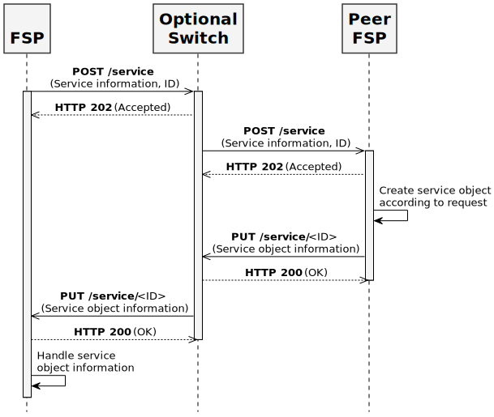

**Figure 1 -- HTTP POST call flow**

##### HTTP GET Call Flow

[Figure 2](#figure-2) shows the normal API call flow for a request to get information about an object in a Peer FSP using HTTP **GET**. The service **/service/**_{ID}_ in the flow should be renamed to any of the services in [Table 6](#table-6) that supports the HTTP **GET** method.

###### Figure 2

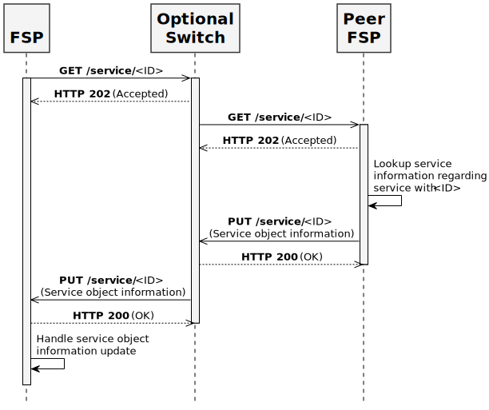


**Figure 2 -- HTTP GET call flow**

##### HTTP DELETE Call Flow

[Figure 3](#figure-3) contains the normal API call flow to delete FSP information about a Party in an ALS using HTTP **DELETE**. The service **/service/**_{ID}_ in the flow should be renamed to any of the services in [Table 6](#table-6) that supports the HTTP DELETE method. HTTP DELETE is only supported in a common ALS, which is why the figure shows the ALS entity as a server only.

###### Figure 3

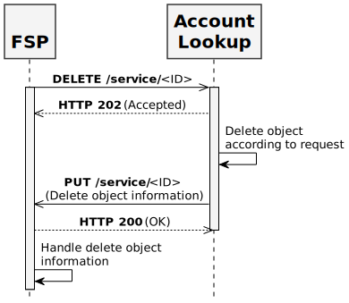


**Figure 3 -- HTTP DELETE call flow**

**Note:** It is also possible that requests to the ALS be routed through a Switch, or that the ALS and the Switch are the same server.

##### HTTP PUT Call Flow**

The HTTP **PUT** is always used as a callback to either a **POST** service request, a **GET** service request, or a **DELETE** service request.

The call flow of a **PUT** request and response can be seen in [Figure 1](#figure-1), [Figure 2](#figure-2), and [Figure 3](#figure-3).

##### HTTP PATCH Call Flow

[Figure 4](#figure-4) shows an example call flow for a HTTP **PATCH**, which is used for sending a notification. First, an object is created using a **POST** service request from the Switch. The object is created in the FSP in a non-finalized state. The FSP then requests to get a notification regarding the finalized state from the Switch by sending the non-finalized state in the **PUT** callback. The Switch handles the callback and sends the notification regarding the finalized state in a **PATCH** service request. The only resource that supports updated object notification using HTTP **PATCH** is /transfers.

###### Figure 4

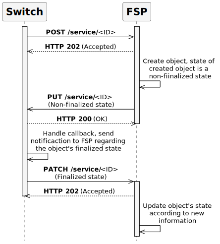


**Figure 4 -- HTTP PATCH call flow**

**Note:** It is also possible that requests to the ALS be routed through a Switch, or that the ALS and the Switch are the same server.

##### Call Flow Routing using FSPIOP-Destination and FSPIOP-Source

The non-standard HTTP header fields **FSPIOP-Destination** and **FSPIOP-Source** are used for routing and message signature verification purposes (see _API Signature_ for more information regarding signature verification). [Figure 5](#figure-5) shows how the header fields are used for routing in an abstract **POST /service** call flow, where the destination (Peer) FSP is known.

###### Figure 5

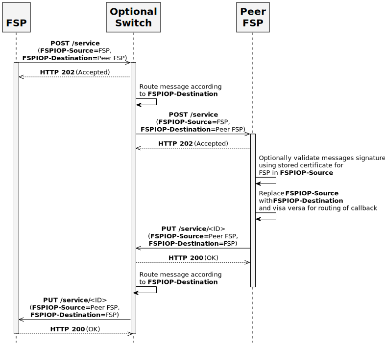


**Figure 5 -- Using the customized HTTP header fields FSPIOP-Destination and FSPIOP-Source**

For some services when a Switch is used, the destination FSP might be unknown. An example of this scenario is when an FSP sends a **GET /parties** to the Switch without knowing which Peer FSP that owns the Party (see [Section 6.3.2](#632-service-details) describing the scenario). **FSPIOP-Destination** will in that case be empty (or set to the Switch's ID) from the FSP, but will subsequently be set by the Switch to the correct Peer FSP. See [Figure 6](#figure-6) for an example describing the usage of **FSPIOP-Destination** and **FSPIOP-Source**.

###### Figure 6

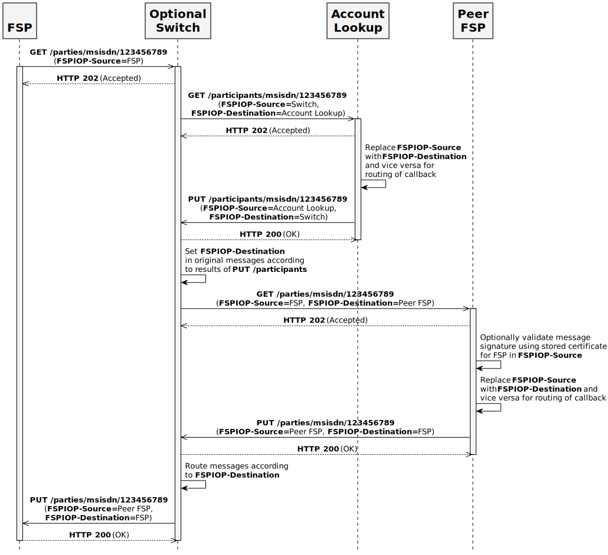


**Figure 6 -- Example scenario where FSPIOP-Destination is unknown to FSP**

<br />

#### HTTP Response Status Codes

The API supports the HTTP response status codes<sup>19</sup> in [Table 4](#table-4) below:

###### Table 4

|Status Code|Reason|Description|
|---|---|---|
|**200**|`OK`|Standard response for a successful request. Used in the API by the client as a response on a callback to mark the completion of an asynchronous service.|
|**202**|`Accepted`|The request has been accepted for future processing at the server, but the server cannot guarantee that the outcome of the request will be successful. Used in the API to acknowledge that the server has received an asynchronous request.|
|**400**| `Bad Request`|The application cannot process the request; for example, due to malformed syntax or the payload exceeded size restrictions.|
|**401**|`Unauthorized`|The request requires authentication in order to be processed.|
|**403**|`Forbidden`|The request was denied and will be denied in the future.|
|**404**|`Not Found`|The resource specified in the URI was not found.|
|**405**|`Method Not Allowed`|An unsupported HTTP method for the request was used; see Table 6 for information on which HTTP methods are allowed in which services.|
|**406**|`Not acceptable`|The server is not capable of generating content according to the Accept headers sent in the request. Used in the API to indicate that the server does not support the version that the client is requesting.|
|**501**|`Not Implemented`|The server does not support the requested service. The client should not retry.|
|**503**|`Service Unavailable`|The server is currently unavailable to accept any new service requests. This should be a temporary state, and the client should retry within a reasonable time frame.|

 **Table 4 -- HTTP response status codes supported in the API**

Any HTTP status codes 3*xx*<sup>20</sup> returned by the server should not be retried and require manual investigation.

An implementation of the API should also be capable of handling other errors not defined above as the request could potentially be routed through proxy servers.

As all requests in the API are asynchronous, additional HTTP error codes for server errors (error codes starting with 5*xx*21 that are *not* defined in [Table 4](#table-4)) are not used by the API itself. Any error on the server during actual processing of a request will be sent as part of an error callback to the client (see [Section 9.2](#92-error-in-server-during-processing-of-request)).

<br />

##### Error Information in HTTP Response

In addition to the HTTP response code, all HTTP error responses (4*xx* and 5*xx* status codes) can optionally contain an **ErrorInformation** element, defined in the section on [ErrorInformation](#errorinformation). This element should be used to give more detailed information to the client if possible.

<br />

##### Idempotent Services in Server

All services that support HTTP **GET** must be _idempotent_; that is, the same request can be sent from a client any number of times without changing the object on the server. The server is allowed to change the state of the object; for example, a transaction state can be changed, but the FSP sending the **GET** request cannot change the state.

All services that support HTTP **POST** must be idempotent in case the client is sending the same service ID again; that is, the server must not create a new service object if a client sends the same **POST** request again. The reason behind this is to simplify the handling of resends during error-handling in a client; however, this creates some extra requirements of the server that receives the request. An example in which the same **POST** request is sent several times can be seen [here](#client-missing-response-from-server---using-resend-of-request).

##### Duplicate Analysis in Server on Receiving a HTTP POST Request

When a server receives a request from a client, the server should check to determine if there is an already-existing service object with the same ID; for example, if a client has previously sent the request **POST /transfers** with the identical **transferId**. If the object already exists, the server must check to determine if the parameters of the already-created object match the parameters from the new request.

- If the previously-created object matches the parameter from the new request, the request should be assumed to be a resend from the client.

  - If the server has not finished processing the old request and therefore has not yet sent the callback to the client, this new request can be ignored, because a callback is about to be sent to the client.
  - If the server has finished processing the old request and a callback has already been sent, a new callback should be sent to the client, similar to if a HTTP **GET** request had been sent.

- If the previously-created object does not match the parameters from the new request, an error callback should be sent to the client explaining that an object with the provided ID already exists with conflicting parameters.

To simplify duplicate analysis, it is recommended to create and store a hash value of all incoming **POST** requests on the server, so that it is easy to compare the hash value against later incoming **POST** requests.

<br />

### API Versioning

The strategy of the development of the API is to maintain backwards compatibility between the API and its resources and services to the maximum extent possible; however, changes to the API should be expected by implementing parties. Versioning of the API is specific to the API resource (for example, **/participants**, **/quotes**, **/transfers**).

There are two types of API resource versions: _Minor_ versions, which are backwards-compatible, and _major_ versions, which are backwards-incompatible.

- Whenever a change in this document defining the characteristics of the API is updated that in some way affects an API service, the affected resource will be updated to a new major or minor version (depending on whether the changes are backwards-compatible or not).

- Whenever a change is made to a specific service in the API, a new version of the corresponding resource will be released.

The format of the resource version is _x_._y_ where _x_ is the major version and _y_ is the minor version. Both major and minor versions are sequentially numbered. When a new major version of a service is released, the minor version is reset to **0**. The initial version of each resource in the API is **1.0**.

#### Changes not Affecting the API Resource Version

Some changes will not affect the API resource version; for example, if the order of parameters within a request or callback were to be changed.

#### Minor API Resource Version

The following list describes the changes that are considered backwards compatible if the change affects any API service connected to a resource. API implementers should implement their client/server in such a way that the API services automatically support these changes without breaking any functionality.

- Optional input parameters such as query strings added in a request
- Optional parameters added in a request or a callback
- Error codes added

These types of changes affect the minor API service version.

#### Major API Resource Versions

The following list describes the changes that are considered backwards-incompatible if the change affects any API service connected to a resource. API implementers do _not_ need to implement their client/server in such a way that it automatically supports these changes.

- Mandatory parameters removed or added to a request or callback
- Optional parameters changed to mandatory in a request or callback
- Parameters renamed
- Data types changed
- Business logic of API resource or connected services changed
- API resource/service URIs changed

These types of changes affect the major API service version. Please note that the list is not comprehensive; there might be other changes as well that could affect the major API service version.

#### Version Negotiation between Client and Server

The API supports basic version negotiation by using HTTP content negotiation between the server and the client. A client should send the API resource version that it would like to use in the **Accept** header to the server (see [HTTP Accept Header](#http-accept-header)). If the server supports that version, it should use that version in the callback (see [Acceptable Version Requested by Client](#acceptable-version-requested-by-client)). If the server does not support the requested version, the server should reply with HTTP status 406<sup>22</sup> including a list of supported versions (see [Non-Acceptable Version Requested by Client](#non-acceptable-version-requested-by-client)).

#### HTTP Accept Header

See below for an example of a simplified HTTP request which only includes an **Accept** header<sup>23</sup>. The **Accept** header should be used from a client requesting a service from a server specifying a major version of the API service. The example in [Listing 3](#listing-3) should be interpreted as "I would like to use major version 1 of the API resource, but if that version is not supported by the server then give me the latest supported version".

###### Listing 3

```
POST /service HTTP/1.1
Accept: application/vnd.interoperability.{resource}+json;version=1,
application/vnd.interoperability.{resource}+json

{
    ...
}
```

**Listing 3 -- HTTP Accept header example, requesting version 1 or the latest supported version**

Regarding the example in [Listing 3](#listing-3):

- The **_POST /service_** should be changed to any HTTP method and related service or resource that is supported by the API (see [Table 6](#table-6)).
- The **Accept** header field is used to indicate the API resource version the client would like to use. If several versions are supported by the client, more than one version can be requested separated by a comma (**,**) as in the example above.
  - The application type is always **application/vnd.interoperability.**_{resource}_, where _{resource}_ is the actual resource (for example, **participants** or **quotes**).
  - The only data exchange format currently supported is **json**.
  - If a client can use any minor version of a major version, only the major version should be sent; for example, **version=1** or **version=2**.
  - If a client would like to use a specific minor version, this should be indicated by using the specific _major.minor_ version; for example, **version=1.2** or **version=2.8**. The use of a specific _major.minor_ version in the request should generally be avoided, as minor versions should be backwards-compatible.

#### Acceptable Version Requested by Client

If the server supports the API resource version requested by the client in the Accept Headers, it should use that version in the subsequent callback. The used _major.minor_ version should always be indicated in the **Content-Type** header by the server, even if the client only requested a major version of the API. See the example in [Listing 4](#listing-4), which indicates that version 1.0 is used by the server:

###### Listing 4

```
Content-Type: application/vnd.interoperability.resource+json;version=1.0
```

**Listing 4 -- Content-Type HTTP header field example**

#### Non-Acceptable Version Requested by Client

If the server does not support the version requested by the client in the **Accept** header, the server should reply with HTTP status 406, which indicates that the requested version is not supported.

**Note:** There is also a possibility that the information might be sent as part of an error callback to a client instead of directly in the response; for example, when the request is routed through a Switch which does support the requested version, but the destination FSP does not support the requested version.

Along with HTTP status 406, the supported versions should be listed as part of the error message in the extensions list, using the major version number as _key_ and minor version number as _value_. Please see error information in the example in [Listing 5](#listing-5), describing the server's supported versions. The example should be interpreted as "I do not support the resource version that you requested, but I do support versions 1.0, 2.1, and 4.2".

###### Listing 5

```json
{
    "errorInformation": {
        "errorCode": "3001",
        "errorDescription": "The Client requested an unsupported version, see extension list for supported version(s).",
        "extensionList": {
            "extension":
            [
                { "key": "1", "value": "0"},
                { "key": "2", "value": "1"},
                { "key": "4", "value": "2"}
            ]
        }
    }
}
```

**Listing 5 -- Example error message when server does not support the requested version**


<br />

## Interledger Protocol

The current version of the API includes basic support for the Interledger Protocol (ILP), by defining a concrete implementation of the Interledger Payment Request protocol<sup>24</sup> in API Resource [/quotes](#api-resource-quotes), and API Resource, [**/transfers**](#api-resource-transfers).

### More Information

This document contains ILP information that is relevant to the API. For more information about the ILP protocol, see the Interledger project website<sup>25</sup>, the Interledger Whitepaper<sup>26</sup>, and the Interledger architecture specification<sup>27</sup>.

### Introduction to Interledger

ILP is a standard for internetworking payment networks. In the same way that the Internet Protocol (IP) establishes a set of basic standards for the transmission and addressing of data packets between different data networks, ILP establishes a set of basic standards for the addressing of financial transactions and transfer of value between accounts on different payment networks.

ILP is not a scheme. It is a set of standards that, if implemented by multiple payment schemes, will allow those schemes to be interoperable. Therefore, implementing ILP involves adapting an existing scheme to conform to those standards. Conformance means ensuring that transfers between accounts within the scheme are done in two phases (_reserve_ and _commit_) and defining a mapping between the accounts in the scheme and the global ILP Addressing scheme. This can be done by modifying the scheme itself, or by the entities that provide ILP-conformant access to the scheme using scheme adaptors.

The basic prerequisites for an ILP payment are the Payee ILP address (see [ILP addressing](#ilp-addressing)) and the condition (see [Conditional Transfers](#conditional-transfers)). In the current version of the API, both these prerequisites should be returned by the Payee FSP during quoting API Resource [**/quotes**](#api-resource-quotes)) of the financial transaction.

### ILP Addressing

A key component of the ILP standard is the ILP addressing<sup>28</sup> scheme. It is a hierarchical scheme that defines one or more addresses for every account on a ledger.

[Table 5](#table-5) shows some examples of ILP addresses that could be used in different scenarios, for different accounts. Note that while the structure of addresses is standardized, the content is not, except for the first segment (up to the first period (**.**)).

###### Table 5

|ILP Address|Description|
|---|---|
|**g.tz.fsp1.msisdn.1234567890**|A mobile money account at **FSP1** for the user with **MSISDN 1234567890**.|
|**g.pk.fsp2.ac03396c-4dba-4743**|A mobile money account at **FSP2** identified by an opaque account id.|
|**g.us.bank1.bob**|A bank account at **Bank1** for the user **bob**.|

**Table 5 -- ILP address examples**

The primary purpose of an ILP addresses is to identify an account in order to route a financial transaction to that account.

**Note:** An ILP address should not be used for identifying a counterparty in the Interoperability API. See section on [Refund](#refund) regarding how to address a Party in the API.

It is useful to think of ILP addresses as analogous to IP addresses. They are seldom, if ever, be seen by end users but are used by the systems involved in a financial transaction to identify an account and route the ILP payment. The design of the addressing scheme means that a single account will often have many ILP addresses. The system on which the account is maintained may track these or, if they are all derived from a common prefix, may track a subset only.

### Conditional Transfers

ILP depends on the concept of _conditional transfers_, in which all ledgers involved in a financial transaction from the Payer to the Payee can first reserve funds out of a Payer account and then later commit them to the Payee account. The transfer from the Payer to the Payee account is conditional on the presentation of a fulfilment that satisfies the condition attached to the original transfer request.

To support conditional transfers for ILP, a ledger must support a transfer API that attaches a condition and an expiry to the transfer. The ledger must prepare the transfer by reserving the funds from the Payer account, and then wait for one of the following events to occur:

- The fulfilment of the condition is submitted to the ledger and the funds are committed to the Payee account.

- The expiry timeout is reached, or the financial transaction is rejected by the Payee or Payee FSP. The transfer is then aborted and the funds that were reserved from the Payer account are returned.

When the fulfilment of a transfer is submitted to a ledger, the ledger must ensure that the fulfilment is valid for the condition that was attached to the original transfer request. If it is valid, the transfer is committed, otherwise it is rejected, and the transfer remains in a pending state until a valid fulfilment is submitted or the transfer expires.

ILP supports a variety of conditions for performing a conditional payment, but implementers of the API should use the SHA-256 hash of a 32-byte pre-image. The condition attached to the transfer is the SHA-256 hash and the fulfilment of that condition is the pre-image. Therefore, if the condition attached to a transfer is a SHA-256 hash, then when a fulfilment is submitted for that transaction, the ledger will validate it by calculating the SHA-256 hash of the fulfilment and ensuring that the hash is equal to the condition.

See [Interledger Payment Request](#interledger-payment-request) for concrete information on how to generate the fulfilment and the condition.

### ILP Packet

The ILP Packet is the mechanism used to package end-to-end data that can be passed in a hop-by-hop service. It is included as a field in hop-by-hop service calls and should not be modified by any intermediaries. The integrity of the ILP Packet is tightly bound to the integrity of the funds transfer, as the commit trigger (the fulfilment) is generated using a hash of the ILP Packet.

The packet has a strictly defined binary format, because it may be passed through systems that are designed for high performance and volume. These intermediary systems must read the ILP Address and the amount from the packet headers, but do not need to interpret the **data** field in the ILP Packet (see [Listing 6](#listing-6)). Since the intermediary systems should not need to interpret the **data** field, the format of the field is not strictly defined in the ILP Packet definition. It is simply defined as a variable length octet string. [Interledger Payment Request](#interledger-payment-request) contains concrete information on how the ILP Packet is populated in the API.

The ILP Packet is the common thread that connects all the individual ledger transfers that make up an end-to-end ILP payment. The packet is parsed by the Payee of the first transfer and used to determine where to make the next transfer, and for how much. It is attached to that transfer and parsed by the Payee of the next transfer, who again determines where to make the next transfer, and for how much. This process is repeated until the Payee of the transfer is the Payee in the end-to-end financial transaction, who fulfils the condition, and the transfers are committed in sequence starting with the last and ending with the first.

The ILP Packet format is defined in ASN.1<sup>29</sup> (Abstract Syntax Notation One), shown in [Listing 6](#listing-6). The packet is encoded using the canonical Octet Encoding Rules.

###### Listing 6

```
InterledgerProtocolPaymentMessage ::= SEQUENCE {
    -- Amount which must be received at the destination amount UInt64,
    -- Destination ILP Address account Address,
    -- Information for recipient (transport layer information) data OCTET STRING (SIZE (0..32767)),
    -- Enable ASN.1 Extensibility
    extensions SEQUENCE {
        ...
    }
}
```

**Listing 6 -- The ILP Packet format in ASN.1 format**

**Note:** The only mandatory data elements in the ILP Packet are the amount to be transferred to the account of the Payee and the ILP Address of the Payee.

<br />

## Common API Functionality

This section describes the common functionality used by the API, including:

- [Quoting](#quoting)
- [Party Addressing](#party-addressing)
- [Mapping of Use Cases to Transaction Types](#mapping-of-use-cases-to-transaction-types)

### Quoting

Quoting is the process that determines any fees and any commission required to perform a financial transaction between two FSPs. It is always initiated by the Payer FSP to the Payee FSP, which means that the quote flows in the same way as a financial transaction.

Two different modes for quoting between FSPs are supported in the API: _Non-disclosing of fees_ and _Disclosing of fees_.

- _Non-Disclosing of fees_ should be used when either the Payer FSP does not want to show the Payee FSP its fee structure, or when the Payer FSP would like to have more control of the fees paid by the Payer after quoting has been performed (the latter is only applicable for _Receive amount_; see next bullet list).

- _Disclosing of fees_ can be used for use cases in which the Payee FSP wants to subsidize the transaction in some use cases; for  example, Cash-In at another FSP's agent.

The _Non-Disclosing of fees_ mode should be the standard supported way of quoting in most schemes. _Disclosing of fees_ might be used in some schemes; for example, a scheme in which a dynamic fee structure is used and an FSP wants the ability to subsidize the Cash-In use case based on the dynamic cost.

In addition, the Payer can decide if the amount should be _Receive amount_ or _Send amount_.

- _Send amount_ should be interpreted as the actual amount that should be deducted from the Payer's account, including any fees.

- _Receive amount_ should be interpreted as the amount that should be added to the Payee's account, regardless of any interoperable transaction fees. The amount excludes possible internal Payee fees added by the Payee FSP.

The Payee FSP can choose if the actual receive amount for the Payee should be sent or not in the callback to the Payer FSP. The actual Payee receive amount should include any Payee FSP internal fees on the Payee.

All taxes are assumed to be FSP-internal, which means that taxes are not sent as part of the API. See [Tax Information](#tax-information) for more information regarding taxes.

**Note:** Dynamic fees implemented using a Switch, or any other intermediary, are not supported in this version of the API.


#### Non-Disclosing of Fees

The fees and commission payments related to an interoperable transaction when fees are not disclosed are shown in [Figure 7](#figure-7). The fees and commission that are directly part of the API are identified by green text. The FSP internal fees, commission, and bonus payments are identified by red text. These are not part of the transaction between a Payer FSP and a Payee FSP, but the amount that the Payee will receive after any FSP internal fees can be sent for information by the Payee FSP.

For send amount (see [Non-Disclosing Send Amount](#non-disclosing-send-amount) for more information), internal Payer FSP fees on the Payer will affect the amount that is sent from the Payer FSP. For example, if the Payer FSP has a fee of 1 USD for a 100 USD interoperable financial transaction, 99 USD is sent from the Payer FSP. For receive amount (see [Non-Disclosing Receive Amount](#non-disclosing-receive-amount) for more information), internal Payer FSP fees on the Payer will not affect the amount that is sent from the Payer FSP. Internal Payer FSP bonus or commission on the Payer should be hidden regardless of send or receive amount.

###### Figure 7


**Figure 7 -- Fees and commission related to interoperability when fees are not disclosed**

See [Fee Types](#fee-types) for more information on the fee types sent in the Interoperability API.

#### Non-Disclosing Receive Amount

[Figure 8](#figure-8) shows an example of non-disclosing receive amount, in which the Payer would like the Payee to receive exactly 100 USD. For non-disclosing receive amount, the Payer FSP need not set the internal rating of the transaction until after the quote has been received because the Payee FSP knows what amount it will receive.

In this example, the Payee FSP decides to give commission to the Payer FSP since funds are flowing to the Payee FSP, which will later be spent in some way; this results in a future fee income for the Payee FSP. The Payer FSP can then decide how much in fees should be taken from the Payer for cost-plus pricing. In this example, the Payer FSP would like to have 1 USD from the Payer, which means that the Payer FSP will earn 2 USD in total, as the Payer FSP will also receive 1 USD in FSP commission from the Payee FSP.

###### Figure 8

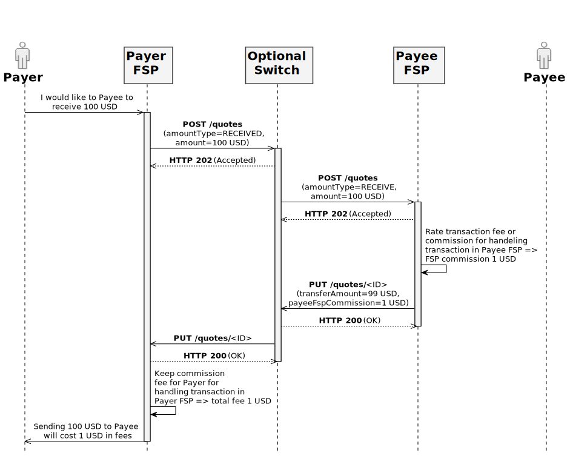


**Figure 8 -- Example of non-disclosing receive amount**

###### Figure 9


**Figure 9 -- Simplified view of money movement for non-disclosing receive amount example**

To calculate the element **transferAmount** in the Payee FSP for a non-disclosing receive amount quote, the equation in [Listing 9](#listing-9) should be used, where _Transfer Amount_ is **transferAmount** in [Table 24](#table-24), _Quote_ _Amount_ is **amount** in [Table 23](#table-23), _Payee_ _FSP fee_ is **payeeFspFee** in [Table 24](#table-24), and Payee FSP commission is payeeFspCommission in [Table 24](#table-24).

###### Listing 7

```
Transfer amount = Quote Amount + Payee FSP Fee -- Payee FSP Commission
```

**Listing 7 -- Relation between transfer amount and quote amount for non-disclosing receive amount**

#### Non-Disclosing Send Amount

[Figure 10](#figure-10) shows an example of non-disclosing send amount, where the Payer would like to send 100 USD from the Payer's account. For non-disclosing send amount, the Payer FSP must rate (determine the internal transaction fees, commission, or both) the transaction before the quote is sent to the Payee FSP so that the Payee FSP knows how much in funds it will receive in the transaction. The actual amount withdrawn from the Payer's account is not disclosed, nor are the fees.

In the example, the Payer FSP and the Payee FSP would like to have 1 USD each in fees so that the amount that will be received by the Payee is 98 USD. The actual amount that will be received by the Payee is in this example (not mandatory) returned in the callback to the Payer FSP, in the element **payeeReceiveAmount**.

###### Figure 10

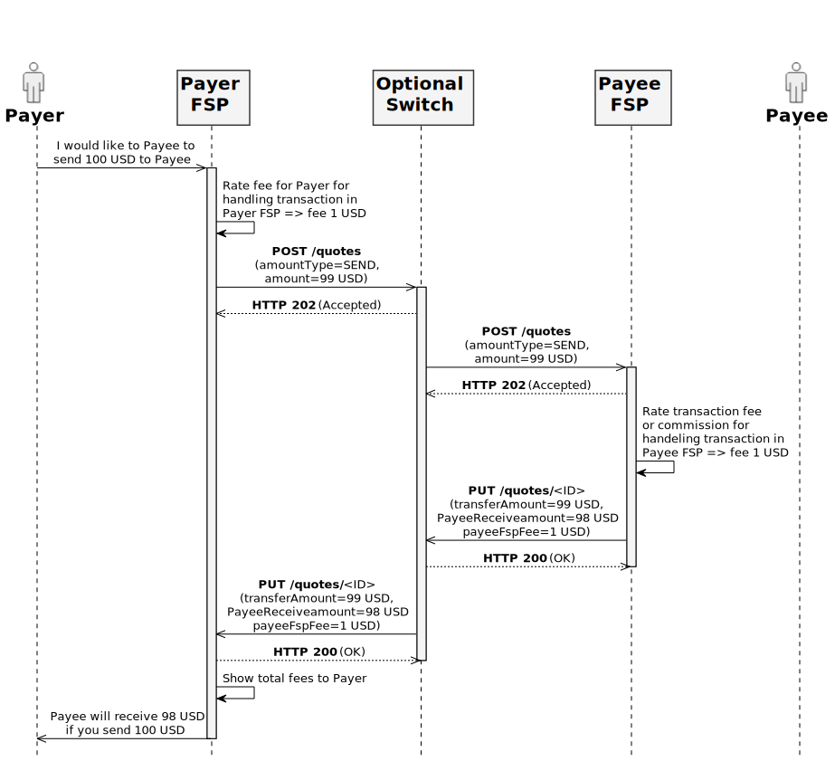


**Figure 10 -- Example of non-disclosing send amount**

###### Figure 11

[Figure 11](#figure-11) shows a simplified view of the movement of money for the non-disclosing send amount example.


**Figure 11 -- Simplified view of money movement for non-disclosing send amount example**

To calculate the element **transferAmount** in the Payee FSP for a non-disclosing send amount quote, the equation in [Listing 8](#listing-8) should be used, where _Transfer Amount_ is **transferAmount** in [Table 24](#table-24), _Quote_ _Amount_ is **amount** in [Table 24](#table-24), and Payee FSP commission is **payeeFspCommission** in [Table 24](#table-24).

###### Listing 8

```
Transfer amount = Quote Amount -- Payee FSP Commission
```

**Listing 8 -- Relation between transfer amount and quote amount for non-disclosing send amount**

The reason for a Payee FSP fee to be absent in the equation is that the Payer would like to send a certain amount from their account. The Payee will receive less funds instead of a fee being added on top of the amount.

#### Disclosing of Fees

The fees and commission payments related to an interoperable transaction when fees are disclosed can be seen in [Figure 11](#figure-11). The fees and commission that are directly related to the API are marked with green text. Internal Payee fees, bonus, and commission are marked with red text, these will have an implication on the amount that is sent by the Payer and received by the Payee. They are not part of the interoperable transaction between a Payer FSP and a Payee FSP, but the actual amount to be received by the Payee after internal Payee FSP fees have been deducted can be sent for information by the Payee FSP.

When disclosing of fees are used, the FSP commission that the Payee FSP sends should subsidize the transaction cost for the Payer. This means that any FSP commission sent from the Payee FSP will effectively pay either a part or all of the fees that the Payer FSP has added to the transaction. If the FSP commission amount from the Payee FSP is higher than the actual transaction fees for the Payer, the excess amount should be handled as a fee paid by Payee FSP to Payer FSP. An example of excess FSP commission can be found [here](#excess-fsp-commission-example).

###### Figure 12


**Figure 12 -- Fees and commission related to interoperability when fees
are disclosed**

See [Fee Types](#fee-types) for more information on the fee types sent in the Interoperability API.

#### Disclosing Receive Amount

[Figure 13](#figure-13) shows an example of disclosing receive amount where the Payer would like the Payee to receive exactly 100 USD. For disclosing receive amount, the Payer FSP must internally rate the transaction before the quote request is sent to the Payee FSP, because the fees are disclosed. In this example, the Payer FSP would like to have 1 USD in fees from the Payer. The Payee FSP decides to give 1 USD in commission to subsidize the transaction, so that the transaction is free for the Payer.

###### Figure 13

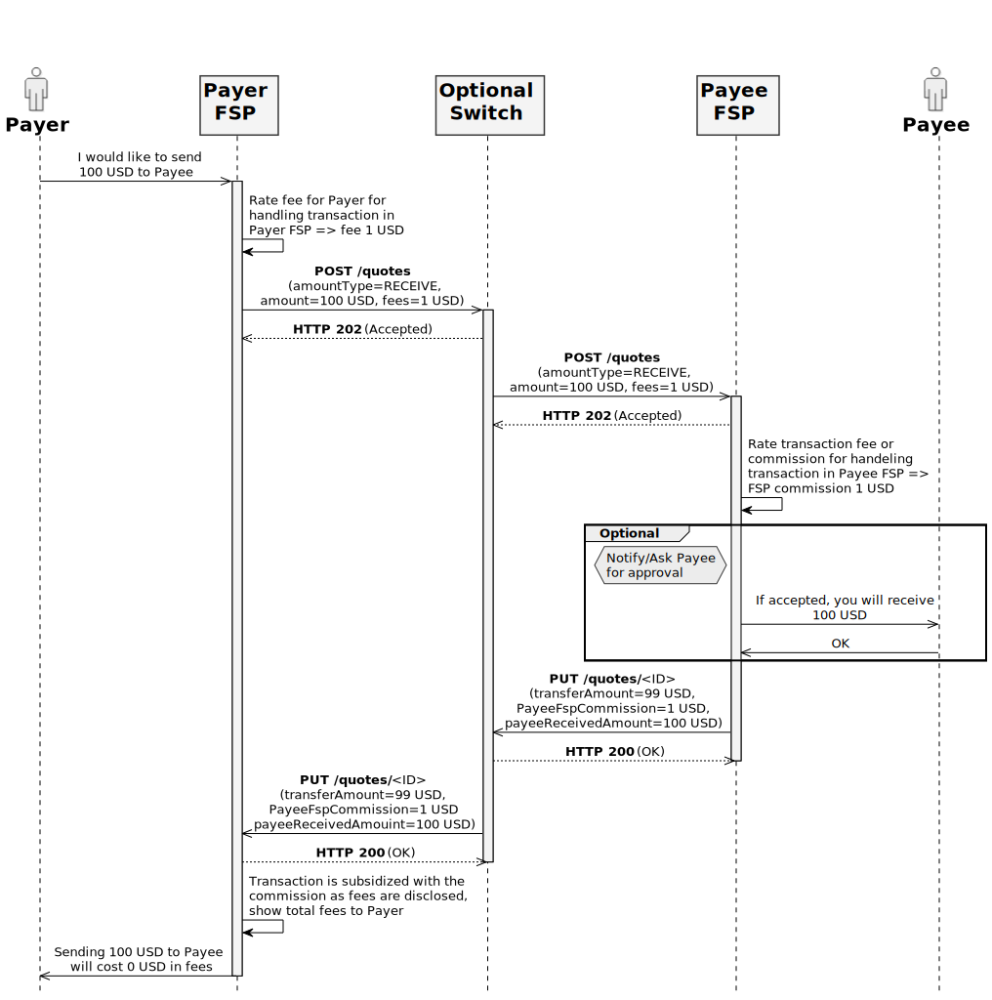


**Figure 13 -- Example of disclosing receive amount**

[Figure 14](#figure-14) shows a simplified view of the movement of money for the disclosing receive amount example.

###### Figure 14


**Figure 14 -- Simplified view of money movement for disclosing receive amount example**

To calculate the element **transferAmount** in the Payee FSP for a disclosing receive amount quote, the equation in [Listing 9](#listing-9) should be used, where _Transfer Amount_ is **transferAmount** in [Table 24](#table-24), _Quote_ _Amount_ is **amount** in [Table 24](#table-24), _Payee_ _FSP fee_ is **payeeFspFee** in [Table 24](#table-24), and Payee FSP commission is **payeeFspCommission** in [Table 24](#table-24).

###### Listing 9

```
Transfer amount = Quote Amount + Payee FSP Fee -- Payee FSP Commission
```

**Listing 9 -- Relation between transfer amount and quote amount for disclosing receive amount**

#### Disclosing Send Amount

[Figure 15](#figure-15) shows an example of disclosing send amount, where the Payer would like to send 100 USD from the Payer's account to the Payee. For disclosing send amount, the Payer FSP must rate the transaction before the quote request is sent to the Payee FSP, because the fees are disclosed. In this example, the Payer FSP and the Payee FSP would like to have 1 USD each in fees from the Payer.

###### Figure 15

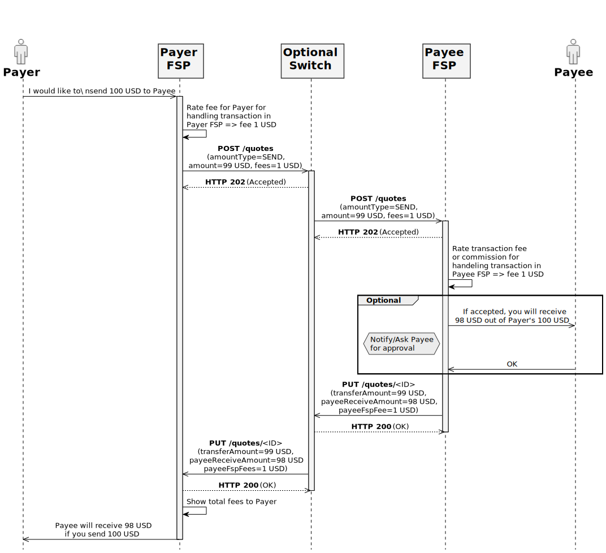


**Figure 15 -- Example of disclosing send amount**

###### Figure 16

[Figure 16](#figure-16) shows a simplified view of the movement of money for the disclosing send amount example.


**Figure 16 -- Simplified view of money movement for disclosing send amount example**

To calculate the element **transferAmount** in the Payee FSP for a disclosing send amount quote, the equation in [Listing 10](#listing-10) should be used, where _Transfer Amount_ is **transferAmount** in [Table 24](#table-24), _Quote_ _Amount_ is **amount** in [Table 24](#table-24), _Payer_ _Fee_ is **fees** in [Table 24](#table-24), and Payee FSP commission is **payeeFspCommission** in [Table 24](#table-24).

###### Listing 10

```
If (Payer Fee <= Payee FSP Commission)
    Transfer amount = Quote Amount
Else
    Transfer amount = Quote Amount -- (Payer Fee - Payee FSP Commission)
```

**Listing 10 -- Relation between transfer amount and quote amount for disclosing send amount**

The reason for a Payee FSP fee to be absent in the equation, is that the Payer would like to send a certain amount from their account. The Payee will receive less funds instead of a fee being added on top of the amount.

#### Excess FSP Commission Example

[Figure 17](#figure-17) shows an example of excess FSP commission using disclosing send amount, where the Payer would like to send 100 USD from the Payer's account to the Payee. For disclosing send amount, the Payer FSP must rate the transaction before the quote request is sent to the Payee FSP, because the fees are disclosed. In this excess commission example, the Payer FSP would like to have 1 USD in fees from the Payer, and the Payee FSP gives 3 USD in FSP commission. Out of the 3 USD in FSP commission, 1 USD should cover the Payer fees, and 2 USD is for the Payer FSP to keep.

###### Figure 17

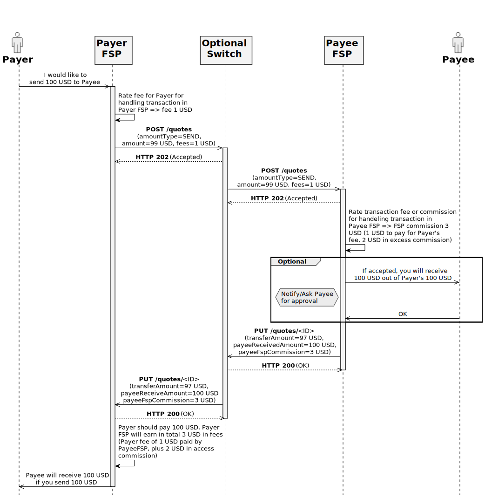


**Figure 17 -- Example of disclosing send amount**

###### Figure 18

[Figure 18](#figure-18) shows a simplified view of the movement of money for the excess commission using disclosing send amount example.


**Figure 18 -- Simplified view of money movement for excess commission using disclosing send amount example**

#### Fee Types

As can be seen in [Figure 7](#figure-7) and [Figure 12](#figure-12), there are two different fee and commission types in the Quote object between the

FSPs:

1. **Payee FSP fee** -- A transaction fee that the Payee FSP would like to have for the handling of the transaction.

2. **Payee FSP commission** -- A commission that the Payee FSP would like to give to the Payer FSP (non-disclosing of fees) or subsidize the transaction by paying some or all fees from the Payer FSP (disclosing of fees). In case of excess FSP commission, the excess commission should be handled as the Payee FSP pays a fee to the Payer FSP, see [here](#excess-fsp-commission-example) for an example.

<br />

#### Quote Equations

This section contains useful equations for quoting that have not already been mentioned.

####  Payee Receive Amount Relation to Transfer Amount

The amount that the Payee should receive, excluding any internal Payee FSP fees, bonus, or commission, can be calculated by the Payer FSP using the equation in [Listing 11](#listing-11), where _Transfer Amount_ is **transferAmount** in [Table 24](#table-24), _Payee_ _FSP fee_ is **payeeFspFee** in [Table 24](#table-24), and Payee FSP commission is payeeFspCommission in [Table 24](#table-24).

###### Listing 11

```
Payee Receive Amount = Transfer Amount - Payee FSP Fee + Payee FSP Commission
```

**Listing 11 -- Relation between transfer amount and Payee receive amount**

The Payee receive amount including any internal Payee FSP fees can optionally be sent by the Payee FSP to the Payer FSP in the Quote callback, see element **payeeReceiveAmount** in [Table 24](#table-24).
<br />

#### Tax Information

Tax information is not sent in the API, as all taxes are assumed to be FSP-internal. The following sections contain details pertaining to common tax types related to the API.

##### Tax on Agent Commission

Tax on Agent Commission is tax for an _Agent_ as a result of the Agent receiving commission as a kind of income. Either the Agent or its FSP has a relation with the tax authority, depending on how the FSP deployment is set up. As all Agent commissions are FSP-internal, no information is sent through the Interoperability API regarding Tax on Agent Commission.

##### Tax on FSP Internal Fee

FSPs could be taxed on FSP internal fees that they receive from the transactions; for example, Payer fees to Payer FSP or Payee fees to Payee FSP. This tax should be handled internally within the FSP and collected by the FSPs because they receive a fee.

##### Tax on Amount (Consumption tax)

Examples of tax on amount are VAT (Value Added Tax) and Sales Tax. These types of taxes are typically paid by a Consumer to the Merchant as part of the price of goods, services, or both. It is the Merchant who has a relationship with the tax authority, and forwards the collected taxes to the tax authority. If any VAT or Sales Tax is applicable, a Merchant should include these taxes in the requested amount from the Consumer. The received amount in the Payee FSP should then be taxed accordingly.

##### Tax on FSP Fee

In the API, there is a possibility for a Payee FSP to add a fee that the Payer or Payer FSP should pay to the Payee FSP. The Payee FSP should handle the tax internally as normal when receiving a fee (if local taxes apply). This means that the Payee FSP should consider the tax on the fee while rating the financial transaction as part of the quote. The tax is not sent as part of the API.

##### Tax on FSP Commission

In the API, there is a possibility for a Payee FSP to add a commission to either subsidize the transaction (if disclosing of fees) or incentivize the Payer FSP (if non-disclosing of fees).

###### Non-Disclosing of Fees

For non-disclosing of fees, all FSP commission from the Payee FSP should be understood as the Payer FSP receiving a fee from the Payee FSP. The tax on the received fee should be handled internally within the Payer FSP, similar to the way it is handled in [Tax on FSP Internal Fee](#tax-on-fsp-internal-fee).

###### Disclosing of Fees

If the Payee FSP commission amount is less than or equal to the amount of transaction fees originating from the Payer FSP, then the Payee FSP commission should always be understood as being used for covering fees that the Payer would otherwise need to pay.

If the Payee FSP commission amount is higher than the fees from the Payer FSP, the excess FSP commission should be handled similarly as [Non-Disclosing of Fees](#non-disclosing-of-fees).

<br />

#### Examples for each Use Case

This section contains one or more examples for each use case.

#### P2P Transfer

A P2P Transfer is typically a receive amount, where the Payer FSP is not disclosing any fees to the Payee FSP. See [Figure 19](#figure-19) for an example. In this example, the Payer would like the Payee to receive 100 USD. The Payee FSP decides to give FSP commission to the Payer FSP, because the Payee FSP will receive funds into the system. The Payer FSP would also like to have 1 USD in fee from the Payer, so the total fee that the Payer FSP will earn is 2 USD. 99 USD is transferred from the Payer FSP to the Payee FSP after deducting the FSP commission amount of 1 USD.

###### Figure 19

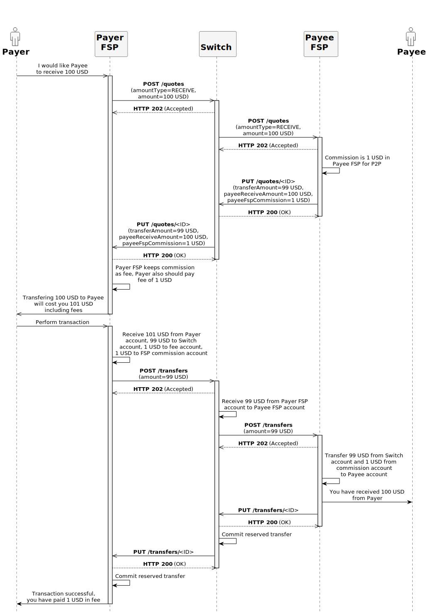


**Figure 19 -- P2P Transfer example with receive amount**

###### Simplified View of Money Movement

###### Figure 20

See [Figure 20](#figure-20) for a highly simplified view of the movement of money for the P2P Transfer example.


**Figure 20 -- Simplified view of the movement of money for the P2P Transfer example**

#####Agent-Initiated Cash-In (Send amount)

[Figure 21](#figure-21) shows an example of an Agent-Initiated Cash-In where send amount is used. The fees are disclosed because the Payee (the customer) would like to know the fees in advance of accepting the Cash-In. In the example, the Payee would like to Cash-In a 100 USD bill using an Agent (the Payer) in the Payer FSP system. The Payer FSP would like to have 2 USD in fees to cover the agent commission. The Payee FSP decides to subsidize the transaction by 2 USD by giving 2 USD in FSP commission to cover the Payer FSP fees. 98 USD is transferred from the Payer FSP to the Payee FSP after deducting the FSP commission amount of 2 USD.

###### Figure 21

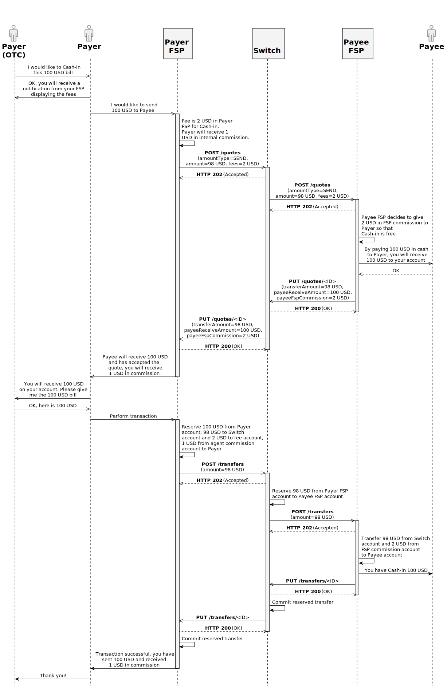


**Figure 21 -- Agent-Initiated Cash-In example with send amount**

###### Simplified View of Money Movement

See [Figure 22](#figure-22) for a highly simplified view of the movement of money for the Agent-initiated Cash-In example with send amount.

###### Figure 22


**Figure 22 -- Simplified view of the movement of money for the Agent-initiated Cash-In with send amount example**

##### Agent-Initiated Cash-In (Receive amount)

[Figure 23](#figure-23) shows an example of Agent-Initiated Cash-In where receive amount is used. The fees are disclosed as the Payee (the Consumer) would like to know the fees in advance of accepting the Cash-In. In the example, the Payee would like to Cash-In so that they receive 100 USD using an Agent (the Payer) in the Payer FSP system. The Payer FSP would like to have 2 USD in fees to cover the agent commission; the Payee FSP decides to subsidize the transaction by 1 USD by giving 1 USD in FSP commission to cover 50% of the Payer FSP fees. 99 USD is transferred from the Payer FSP to the Payee FSP after deducting the FSP commission amount of 1 USD.

###### Figure 23

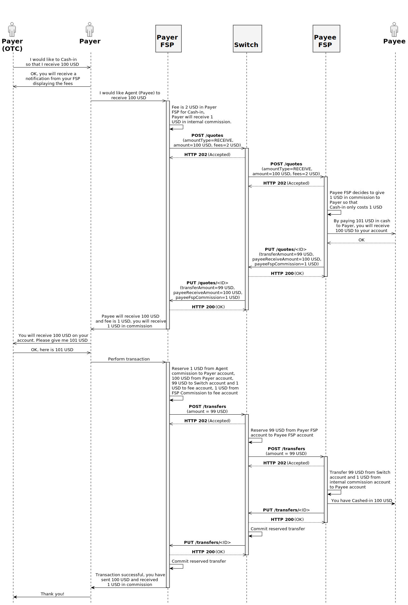


**Figure 23 -- Agent-initiated Cash-In example with receive amount**

##### Simplified View of Money Movement

###### Figure 24

See [Figure 24](#figure-24) for a highly simplified view of the movement of money for the Agent-initiated Cash-In example with receive amount.


**Figure 24 -- Simplified view of the movement of money for the Agent-initiated Cash-In with receive amount example**

##### Customer-Initiated Merchant Payment

A Customer-Initiated Merchant Payment is typically a receive amount, where the Payer FSP is not disclosing any fees to the Payee FSP. See [Figure 25](#figure-25) for an example. In the example, the Payer would like to buy goods or services worth 100 USD from a Merchant (the Payee) in the Payee FSP system. The Payee FSP would not like to charge any fees from the Payer, but 1 USD in an internal hidden fee from the Merchant. The Payer FSP wants 1 USD in fees from the Payer. 100 USD is transferred from the Payer FSP to the Payee FSP.

###### Figure 25

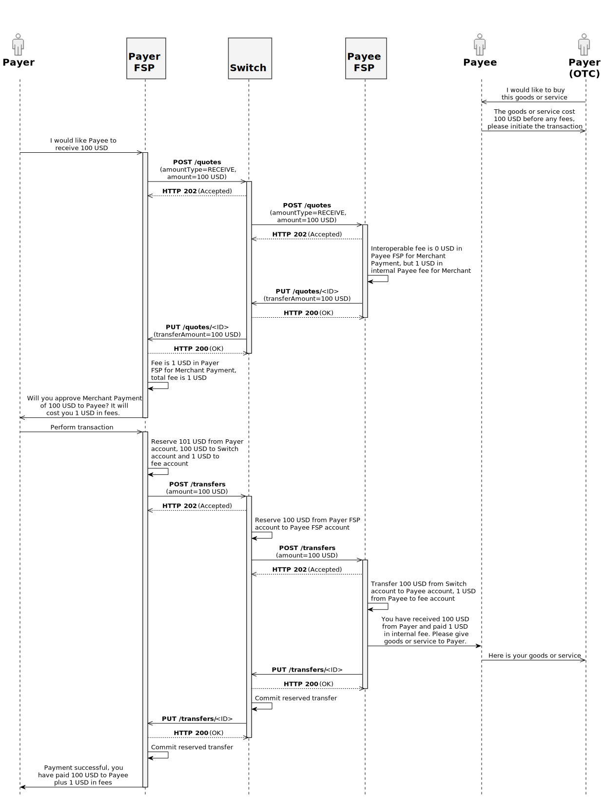


**Figure 25 -- Customer-Initiated Merchant Payment example**

###### Simplified View of Money Movement

See [Figure 26](#figure-26) for a highly simplified view of the movement of money for the Customer-Initiated Merchant Payment example.

###### Figure 26


**Figure 26 -- Simplified view of the movement of money for the Customer-Initiated Merchant Payment example**

##### Customer-Initiated Cash-Out (Receive amount)

A Customer-Initiated Cash-Out is typically a receive amount, where the Payer FSP is not disclosing any fees to the Payee FSP. See [Figure 27](#figure-27) for an example. In the example, the Payer would like to Cash-Out so that they will receive 100 USD in cash. The Payee FSP would like to have 2 USD in fees to cover the agent commission and the Payer FSP would like to have 1 USD in fee. 102 USD is transferred from the Payer FSP to the Payee FSP.

###### Figure 27

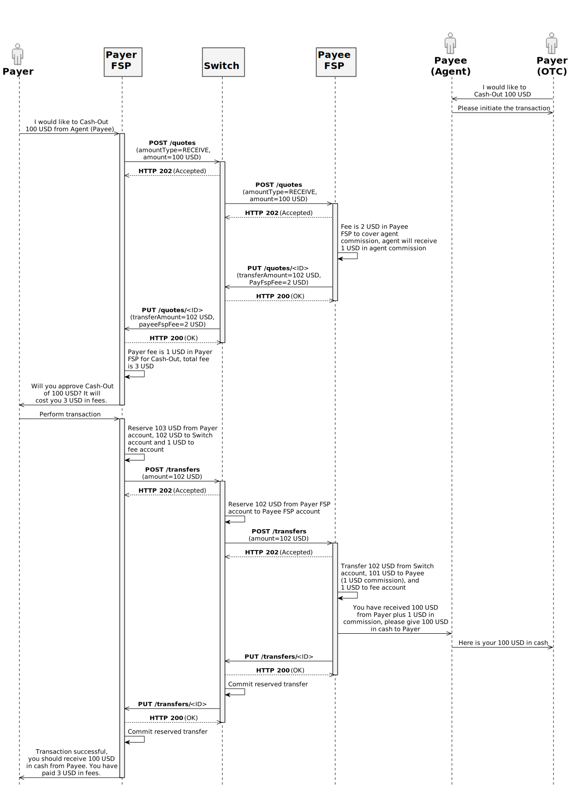


**Figure 27 -- Customer-Initiated Cash-Out example (receive amount)**

###### Simplified View of Money Movement

See [Figure 28](#figure-28) for a highly simplified view of the movement of money for the Customer-Initiated Cash-Out with receive amount example.

###### Figure 28


**Figure 28 -- Simplified view of the movement of money for the Customer-Initiated Cash-Out with receive amount example**

##### Customer-Initiated Cash-Out (Send amount)

A Customer-Initiated Cash-Out is typically a receive amount, this
example is shown in [Customer-Initiated Cash-Out](#customer-initiated-cash-out). This section shows an example where send amount is used instead; see [Figure 29](#figure-29) for an example. In the example, the Payer would like to Cash-Out 100 USD from their account. The Payee FSP would like to have 2 USD in fees to cover the agent commission and the Payer FSP would like to have 1 USD in fee. 99 USD is transferred from the Payer FSP to the Payee FSP.

###### Figure 29

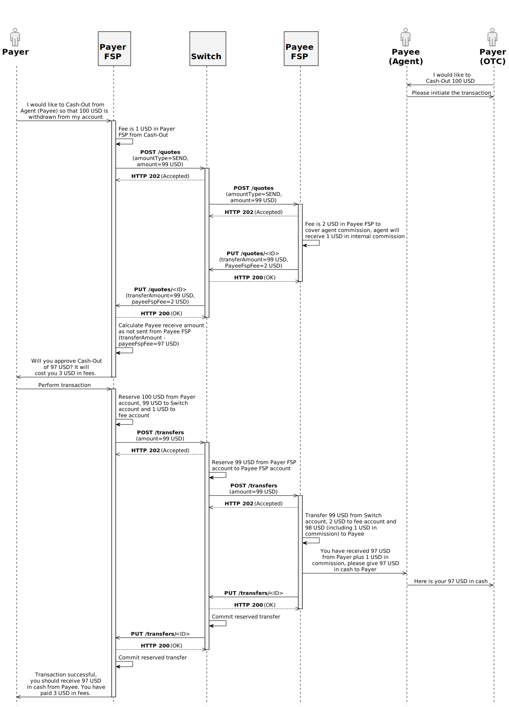


**Figure 29 -- Customer-Initiated Cash-Out example (send amount)**

###### Simplified View of Money Movement

See [Figure 30](#figure-30) for a highly simplified view of the movement of money for the Customer-Initiated Cash-Out with send amount example.

###### Figure 30


**Figure 30 -- Simplified view of the movement of money for the Customer-Initiated Cash-Out with send amount example**

#### Agent-Initiated Cash-Out

An Agent-Initiated Cash-Out is typically a receive amount, in which the Payer FSP does not disclose any fees to the Payee FSP. See [Figure 31](#Figure-31) for an example. In the example, the Payer would like to Cash-Out so that they will receive 100 USD in cash. The Payee FSP would like to have 2 USD in fees to cover the agent commission and the Payer FSP would like to have 1 USD in fee. 102 USD is transferred from the Payer FSP to the Payee FSP.

###### Figure 31

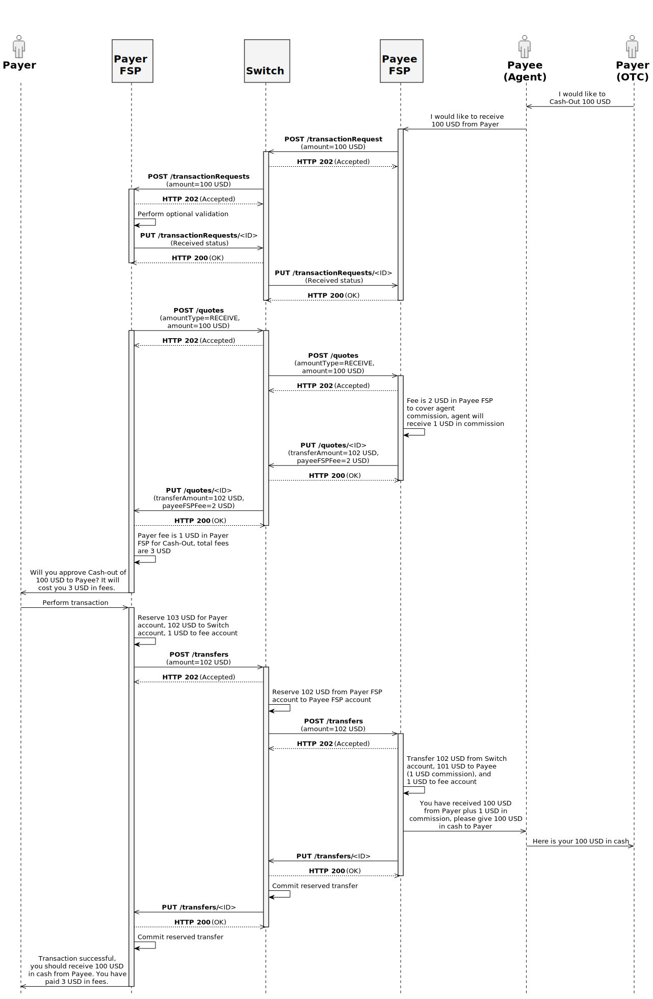


**Figure 31 -- Agent-Initiated Cash-Out example**

######1 Simplified View of Money Movement

See [Figure 32](#figure-32) for a highly simplified view of the movement of money for the Agent-Initiated Cash-Out example.

###### Figure 32


**Figure 32 -- Simplified view of the movement of money for the Agent-Initiated Cash-Out example**

##### Merchant-Initiated Merchant Payment

A Merchant-Initiated Merchant Payment is typically a receive amount, where the Payer FSP is not disclosing any fees to the Payee FSP. See [Figure 33](#figure-33) for an example. In the example, the Payer would like to buy goods or services worth 100 USD from a Merchant (the Payee) in the Payee FSP system. The Payee FSP does not want any fees and the Payer FSP would like to have 1 USD in fee. 100 USD is transferred from the Payer FSP to the Payee FSP.

###### Figure 33

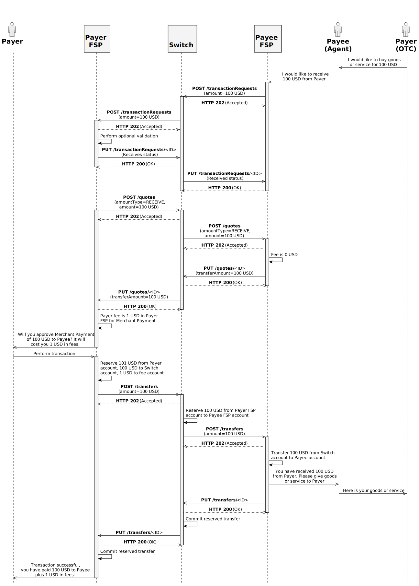


**Figure 33 -- Merchant-Initiated Merchant Payment example**

###### Simplified View of Money Movement

See [Figure 34](#figure-34) for a highly simplified view of the movement of money for the Merchant-Initiated Merchant Payment example.

###### Figure 34


**Figure 34 -- Simplified view of the movement of money for the Merchant-Initiated Merchant Payment example**

##### ATM-Initiated Cash-Out

An ATM-Initiated Cash-Out is typically a receive amount, in which the Payer FSP is not disclosing any fees to the Payee FSP. See [Figure 35](#figure-35) for an example. In the example, the Payer would like to Cash-Out so that they will receive 100 USD in cash. The Payee FSP would like to have 1 USD in fees to cover any ATM fees and the Payer FSP would like to have 1 USD in fees. 101 USD is transferred from the Payer FSP to the Payee FSP.

###### Figure 35

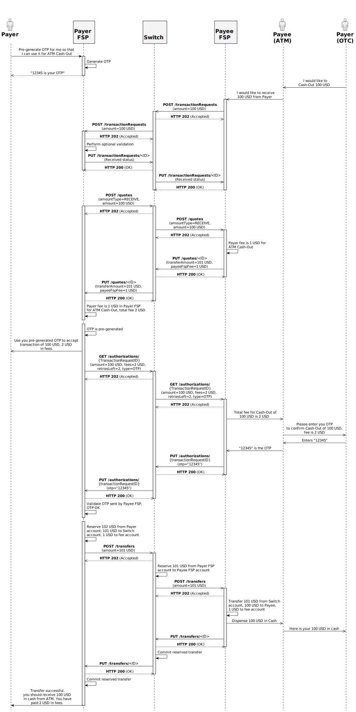


**Figure 35 -- ATM-Initiated Cash-Out example**

###### Simplified View of Money Movement

See [Figure 36](#figure-36) for a highly simplified view of the movement of money for the ATM-Initiated Cash-Out example.

###### Figure 36


**Figure 36 -- Simplified view of the movement of money for the ATM-Initiated Cash-Out example**

##### Merchant-Initiated Merchant Payment authorized on POS

A Merchant-Initiated Merchant Payment authorized on a POS device is typically a receive amount, in which the Payer FSP does not disclose any fees to the Payee FSP. See [Figure 37](#figure-37) for an example. In the example, the Payer would like to buy goods or services worth 100 USD from a Merchant (the Payee) in the Payee FSP system. The Payee FSP decides to give 1 USD in FSP commission, and the Payer FSP decides to use the FSP commission as the transaction fee. 100 USD is transferred from the Payer FSP to the Payee FSP.

###### Figure 37

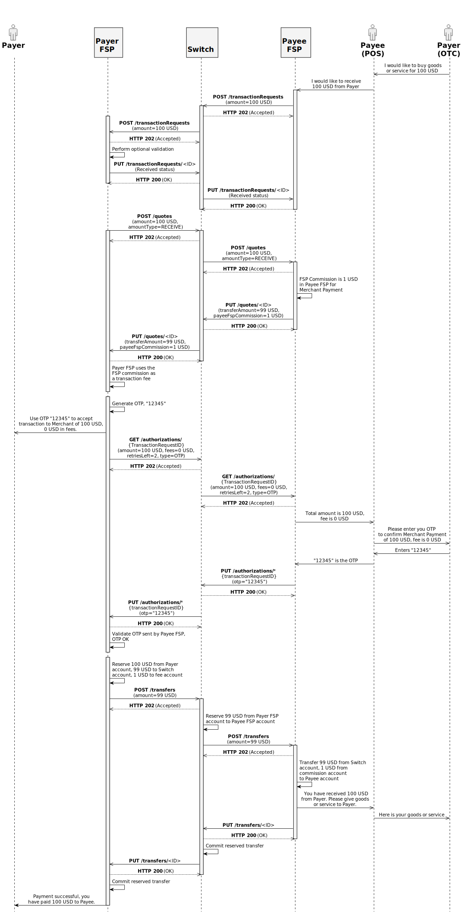


**Figure 37 -- Merchant-Initiated Merchant Payment authorized on POS example**

###### Simplified View of Money Movement

See [Figure 38](#figure-38) for a highly simplified view of the movement of money for the Merchant-Initiated Merchant Payment authorized on POS example.

###### Figure 38


**Figure 38 -- Simplified view of the movement of money for the
Merchant-Initiated Merchant Payment authorized on POS example**

##### Refund

[Figure 39](#figure-39) shows an example of a Refund transaction of the entire amount of the [Agent-Initiated Cash-In (Receive amount)](#agent-initiated-cash-in-receive-amount) example.

###### Figure 39

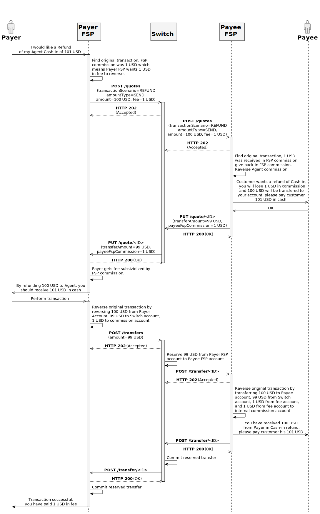


**Figure 39 -- Refund example**

#### 5.1.6.11.1 Simplified View of Money Movement

See [Figure 40](#figure-40) for a highly simplified view of the movement of money for the Refund example.

###### Figure 40


**Figure 40 -- Simplified view of the movement of money for the Refund example**

<br />

### Party Addressing

Both Parties in a financial transaction, (that is, the `Payer` and the `Payee`) are addressed in the API by a _Party ID Type_ (element [**PartyIdType**](#partyidtype-element)), a _Party ID_ ([**PartyIdentifier**](#partyidentifier-element)), and an optional _Party Sub ID or Type_ ([PartySubIdOrType](#partysubidortype-element)). Some Sub-Types are pre-defined in the API for personal identifiers ([PersonalIdentifierType](#personalidentifiertype-enum)); for example, for passport number or driver's license number.

The following are basic examples of how the elements _Party ID Type_ and _Party ID_ can be used:
- To use mobile phone number **+123456789** as the counterparty in a financial transaction, set *Party ID Type* to **MSISDN** and _Party ID_ to **+123456789**.
   - Example service to get FSP information:
        
     **GET /participants/MSISDN/+123456789**

- To use the email **john\@doe.com** as the counterparty in a financial transaction, set _Party ID Type_ to **EMAIL**, and _Party_ _ID_ to **john\@doe.com**.

  - Example service to get FSP information:

    **GET /participants/EMAIL/john\@doe.com**

- To use the IBAN account number **SE45 5000 0000 0583 9825 7466** as counterparty in a financial transaction, set _Party_ _ID Type_ to **IBAN**, and _Party ID_ to **SE4550000000058398257466** (should be entered without any whitespace).

  - Example service to get FSP information:

    **GET /participants/IBAN/SE4550000000058398257466**

The following are more advanced examples of how the elements _Party ID
Type_, _Party ID_, and _Party Sub ID or Type_ can be used:

- To use the person who has passport number **12345678** as counterparty in a financial transaction, set _Party ID Type_ to **PERSONAL\_ID**, _Party ID_ to **12345678**, and _Party Sub ID or Type_ to **PASSPORT**.

   - Example service to get FSP information:

     **GET /participants/PERSONAL\_ID/123456789/PASSPORT**

- To use **employeeId1** working in the company **Shoe-company** as counterparty in a financial transaction, set _Party ID_ _Type_ to **BUSINESS**, _Party ID_ to **Shoe-company**, and _Party Sub ID or Type_ to **employeeId1**.

   - Example service to get FSP information:

     **GET /participants/BUSINESS/Shoe-company/employeeId1**

**5.2.1 Restricted Characters in Party ID and Party Sub ID or Type**

Because the _Party ID_ and the _Party Sub ID or Type_ are used as part of the URI (see [URI Syntax](#uri-syntax)), some restrictions exist on the ID:

- Forward slash (**/**) is not allowed in the ID, as it is used by the [Path](#path), to indicate a separation of the Path.

- Question mark (**?**) is not allowed in the ID, as it is used to indicate the [Query](#query)) part of the URI.

<br />

### Mapping of Use Cases to Transaction Types

This section contains information about how to map the currently supported non-bulk use cases in the API to the complex type [**TransactionType**](#transactiontype)), using the elements [TransactionScenario](#transactionscenario)), and [TransactionInitiator](#transactioninitiator)).

For more information regarding these use cases, see _API Use Cases_.

#### P2P Transfer

To perform a P2P Transfer, set elements as follows:

- [**TransactionScenario**](#transactionscenario) to **TRANSFER**
- [**TransactionInitiator**](#transactioninitiator) to **PAYER**
- [**TransactionInitiatorType**](#transactioninitiatortype) to **CONSUMER**.

#### Agent-Initiated Cash In

To perform an Agent-Initiated Cash In, set elements as follows:

- [**TransactionScenario**](#transactionscenario) to **DEPOSIT**
- [**TransactionInitiator**](#transactioninitiator) to **PAYER**
- [**TransactionInitiatorType**](#transactioninitiatortype) to **AGENT**.

#### Agent-Initiated Cash Out

To perform an Agent-Initiated Cash Out, set elements as follows:

- [**TransactionScenario**](#transactionscenario) to **WITHDRAWAL**
- [**TransactionInitiator**](#transactioninitiator) to **PAYEE**
- [**TransactionInitiatorType**](#transactioninitiatortype) to **AGENT**

#### Agent-Initiated Cash Out Authorized on POS

To perform an Agent-Initiated Cash Out on POS, set elements as follows:

- [**TransactionScenario**](#transactionscenario) to **WITHDRAWAL**
- [**TransactionInitiator**](#transactioninitiator) to **PAYEE**
- [**TransactionInitiatorType**](#transactioninitiatortype) to **AGENT**


#### Customer-Initiated Cash Out

To perform a Customer-Initiated Cash Out, set elements as follows:

- [**TransactionScenario**](#transactionscenario) to **WITHDRAWAL**
- [**TransactionInitiator**](#transactioninitiator) to **PAYER**
- [**TransactionInitiatorType**](#transactioninitiatortype) to **CONSUMER**

#### Customer-Initiated Merchant Payment

To perform a Customer-Initiated Merchant Payment, set elements as
follows:

- [**TransactionScenario**](#transactionscenario) to **PAYMENT**
- [**TransactionInitiator**](#transactioninitiator) to **PAYER**
- [**TransactionInitiatorType**](#transactioninitiatortype) to **CONSUMER**.

#### Merchant-Initiated Merchant Payment

To perform a Merchant-Initiated Merchant Payment, set elements as
follows:

- [**TransactionScenario**](#transactionscenario) to **PAYMENT**
- [**TransactionInitiator**](#transactioninitiator) to **PAYEE**
- [**TransactionInitiatorType**](#transactioninitiatortype) to **BUSINESS**

#### Merchant-Initiated Merchant Payment Authorized on POS

To perform a Merchant-Initiated Merchant Payment, set elements as
follows:

- [**TransactionScenario**](#transactionscenario) to **PAYMENT**
- [**TransactionInitiator**](#transactioninitiator) to **PAYEE**
- [**TransactionInitiatorType**](#transactioninitiatortype) to **DEVICE**

#### ATM-Initiated Cash Out

To perform an ATM-Initiated Cash Out, set elements as follows:

- [**TransactionScenario**](#transactionscenario) to **WITHDRAWAL**
- [**TransactionInitiator**](#transactioninitiator) to **PAYEE**
- [**TransactionInitiatorType**](#transactioninitiatortype) to **DEVICE**

####  Refund

To perform a Refund, set elements as follows:

- [**TransactionScenario**](#transactionscenario) to **REFUND**
- [**TransactionInitiator**](#transactioninitiator) to **PAYER**
- [**TransactionInitiatorType**](#transactioninitiatortype) depends on the initiator of the Refund.

Additionally, the [Refund](#refund) complex type must be populated with the transaction ID of the original transaction that is to be refunded.

<br />

## API Services

This section introduces and details all services that the API supports for each resource and HTTP method. Each API resource and service is also mapped to a logical API resource and service described in [Generic Transaction Patterns](../generic-transaction-patterns).


### High Level API Services

On a high level, the API can be used to perform the following actions:

- **Lookup Participant Information** -- Find out in which FSP the counterparty in a financial transaction is located.

   - Use the services provided by the API resource **/participants**.

- **Lookup Party Information** -- Get information about the counterparty in a financial transaction.

   - Use the services provided by the API resource **/parties**.

- **Perform Transaction Request** -- Request that a Payer transfer electronic funds to the Payee, at the request of the Payee. The Payer can approve or reject the request from the Payee. An approval of the request will initiate the actual financial transaction.

   - Use the services provided by the API resource **/transactionRequests**.

- **Calculate Quote** -- Calculate all parts of a transaction that will influence the transaction amount; that is, fees and FSP commission.

   - Use the services provided by the API resource **/quotes** for a single transaction quote; that is, one Payer to one Payee.
   - Use the services provided by the API resource **/bulkQuotes** for a bulk transaction quote; that is, one Payer to multiple Payees.

- **Perform Authorization** -- Request the Payer to enter the applicable credentials when they have initiated the transaction from a POS, ATM, or similar device in the Payee FSP system.

   - Use the services provided by the API resource **/authorizations**.

- **Perform Transfer** -- Perform the actual financial transaction by transferring the electronic funds from the Payer to the Payee, possibly through intermediary ledgers.

   - Use the services provided by the API resource **/transfers** for single transaction; that is, one Payer to one Payee.
   - Use the services provided by the API resource **/bulkTransfers** for bulk transaction; that is, one Payer to multiple Payees.

- **Retrieve Transaction Information** -- Get information related to the financial transaction; for example, a possible created token on successful financial transaction.

   - Use the services provided by the API resource **/transactions**.


#### Supported API services

[Table 6](#table-6) includes high-level descriptions of the services that the API provides. For more detailed information, see the sections that follow.

###### Table 6

|URI|HTTP method GET|HTTP method PUT|HTTP method POST|HTTP method DELETE|HTTP method PATCH|
|---|---|---|---|---|---|
|**/participants**|Not supported|Not supported|Request that an ALS create FSP information regarding the parties provided in the body or, if the information already exists, request that the ALS update it|Not supported|Not Supported|
|**/participants/**_{ID}_|Not supported|Callback to inform a Peer FSP about a previously-created list of parties.|Not supported|Not Supported|Not Supported|
|**/participants/**_{Type}_/_{ID}_ Alternative: **/participants/**_{Type}_/_{ID}_/_{SubId}_|Get FSP information regarding a Party from either a Peer FSP or an ALS.|Callback to inform a Peer FSP about the requested or created FSP information.|Request an ALS to create FSP information regarding a Party or, if the information already exists, request that the ALS update it|Request that an ALS delete FSP information regarding a Party.|Not Supported|
|**/parties/**_{Type}_/_{ID}_ Alternative: **/parties/**_{Type}_/_{ID}_/_{SubId}_|Get information regarding a Party from a Peer FSP.|Callback to inform a Peer FSP about the requested information about the Party.|Not supported|Not support|Not Supported|
|**/transactionRequests**|Not supported|Not supported|Request a Peer FSP to ask a Payer for approval to transfer funds to a Payee. The Payer can either reject or approve the request.|Not supported|Not Supported|
|**/transactionRequests/**_{ID}_|Get information about a previously-sent transaction request.|Callback to inform a Peer FSP about a previously-sent transaction request.|Not supported|Not supported|Not Supported|
|**/quotes**|Not supported|Not supported|Request that a Peer FSP create a new quote for performing a transaction.|Not supported|Not Supported|
|**/quotes/**_{ID}_|Get information about a previously-requested quote.|Callback to inform a Peer FSP about a previously- requested quote.|Not supported|Not supported|Not Supported|
|**/authorizations/**_{ID}_|Get authorization for a transaction from the Payer whom is interacting with the Payee FSP system.|Callback to inform Payer FSP regarding authorization information.|Not supported|Not supported|Not Supported|
|**/transfers**|Not supported|Not supported|Request a Peer FSP to perform the transfer of funds related to a transaction.|Not supported|Not Supported|
|**/transfers/**_{ID}_|Get information about a previously-performed transfer.|Callback to inform a Peer FSP about a previously-performed transfer.|Not supported|Not supported|Commit notification to Payee FSP|
|**/transactions/**_{ID}_|Get information about a previously-performed transaction.|Callback to inform a Peer FSP about a previously-performed transaction.|Not supported|Not supported|Not Supported|
|**/bulkQuotes**|Not supported|Not supported|Request that a Peer FSP create a new quote for performing a bulk transaction.|Not supported|Not Supported|
|**/bulkQuotes/**_{ID}_|Get information about a previously-requested bulk transaction quote.|Callback to inform a Peer FSP about a previously-requested bulk transaction quote.|Not supported|Not supported|Not Supported|
|**/bulkTransfers**|Not supported|Not supported|Request that a Peer FSP create a bulk transfer.|Not supported|Not Supported|
|**/bulkTransfers/**_{ID}_|Get information about a previously-sent bulk transfer.|Callback to inform a Peer FSP about a previously-sent bulk transfer.|Not supported|Not supported|Not supported|

**Table 6 – API-supported services**

#### Current Resource Versions

[Table 7](#table-7) contains the version for each resource that this document version describes.

###### Table 7

|Resource|Current Version|Last Updated|
|---|---|---|
|/participants|1.1|The data model is updated to add an optional ExtensionList element to the PartyIdInfo complex type based on the Change Request: https://github.com/mojaloop/mojaloop-specification/issues/30. Following this, the data model as specified in Table 93 has been updated.|
|/parties|1.1|The data model is updated to add an optional ExtensionList element to the PartyIdInfo complex type based on the Change Request: https://github.com/mojaloop/mojaloop-specification/issues/30. Following this, the data model as specified in Table 93 has been updated.|
|/transactionRequests|1.1|The data model is updated to add an optional ExtensionList element to the PartyIdInfo complex type based on the Change Request: https://github.com/mojaloop/mojaloop-specification/issues/30. Following this, the data model as specified in Table 93 has been updated.|
|/quotes|1.1|The data model is updated to add an optional ExtensionList element to the PartyIdInfo complex type based on the Change Request: https://github.com/mojaloop/mojaloop-specification/issues/30. Following this, the data model as specified in Table 93 has been updated.|
|/authorizations|1.0|The data model is updated to add an optional ExtensionList element to the PartyIdInfo complex type based on the Change Request: https://github.com/mojaloop/mojaloop-specification/issues/30. Following this, the data model as specified in Table 93 has been updated.|
|/transfers|1.1|Added possible commit notification using PATCH /transfers/`<ID>`. The process of using commit notifications is described in Section 6.7.2.6. The data model is updated to add an optional ExtensionList element to the PartyIdInfo complex type based on the Change Request: https://github.com/mojaloop/mojaloop-specification/issues/30. Following this, the data model as specified in Table 93 has been updated.|
|/transactions|1.0|The data model is updated to add an optional ExtensionList element to the PartyIdInfo complex type based on the Change Request: https://github.com/mojaloop/mojaloop-specification/issues/30. Following this, the data model as specified in Table 93 has been updated.|
|/bulkQuotes|1.1|The data model is updated to add an optional ExtensionList element to the PartyIdInfo complex type based on the Change Request: https://github.com/mojaloop/mojaloop-specification/issues/30. Following this, the data model as specified in Table 93 has been updated.|
|/bulkTransfers|1.1|The data model is updated to add an optional ExtensionList element to the PartyIdInfo complex type based on the Change Request: https://github.com/mojaloop/mojaloop-specification/issues/30. Following this, the data model as specified in Table 93 has been updated.|

**Table 7 – Current resource versions**

<br />

### API Resource /participants

This section defines the logical API resource **Participants**, described in [Generic Transaction Patterns](../generic-transaction-patterns#api-resource-participants).

The services provided by the resource **/participants** are primarily used for determining in which FSP a counterparty in a financial transaction is located. Depending on the scheme, the services should be supported, at a minimum, by either the individual FSPs or a common service.

If a common service (for example, an ALS) is supported in the scheme, the services provided by the resource **/participants** can also be used by the FSPs for adding and deleting information in that system.

#### Resource Version History

[Table 8](#table-8) contains a description of each different version of the **/participants** resource.

###### Table 8

|Version|Date|Description|
|---|---|---|
|1.0|2018-03-13|Initial version|
|1.1|2020-05-19|The data model is updated to add an optional ExtensionList element to the PartyIdInfo complex type based on the Change Request: https://github.com/mojaloop/mojaloop-specification/issues/30. Following this, the data model as specified in Table 93 has been updated.
For consistency, the data model for the **POST /participants/**_{Type}/{ID}_ and **POST /participants/**_{Type}/{ID}/{SubId}_ calls in Table 10 has been updated to include the optional ExtensionList element as well.|

**Table 8 – Version history for resource /participants**

#### Service Details

Different models are used for account lookup, depending on whether an ALS exists. The following sections describe each model in turn.

#### No Common Account Lookup System

[Figure 41](#figure-41) shows how an account lookup can be performed if there is no common ALS in a scheme. The process is to ask the other FSPs (in sequence) if they "own" the Party with the provided identity and type pair until the Party can be found.

If this model is used, all FSPs should support being both client and server of the different HTTP **GET** services under the **/participants** resource. The HTTP **POST** or HTTP **DELETE** services under the **/participants** resource should not be used, as the FSPs are directly used for retrieving the information (instead of a common ALS).

###### Figure 41

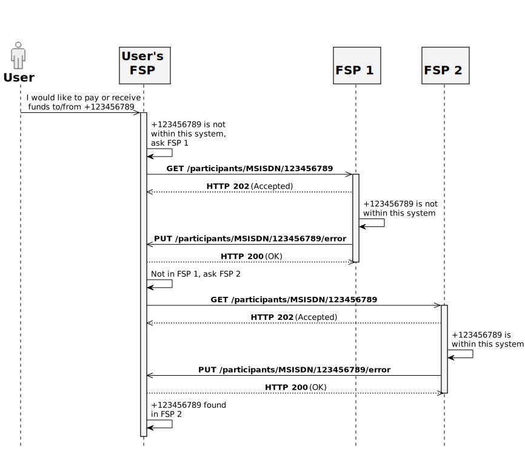


**Figure 41 -- How to use the services provided by /participants if there is no common Account Lookup System**

#### Common Account Lookup System

[Figure 42](#figure-42) shows how an account lookup can be performed if there is a common ALS in a scheme. The process is to ask the common Account Lookup service which FSP owns the Party with the provided identity. The common service is depicted as "Account Lookup" in the flows; this service could either be implemented by the switch or as a separate service, depending on the setup in the market.

The FSPs do not need to support the server side of the different HTTP **GET** services under the **/participants** resource; the server side of the service should be handled by the ALS. Instead, the FSPs (clients) should provide FSP information regarding its accounts and account holders (parties) to the ALS (server) using the HTTP **POST** (to create or update FSP information, see [POST /participants](#post-participants) and [POST /participants/_{Type}_/_{ID}_](#post-participants-type-id)) and HTTP **DELETE** (to delete existing FSP information, see [DELETE /participants/_{Type}_/_{ID}_](#delete-participantstypeid)) methods.

###### Figure 42

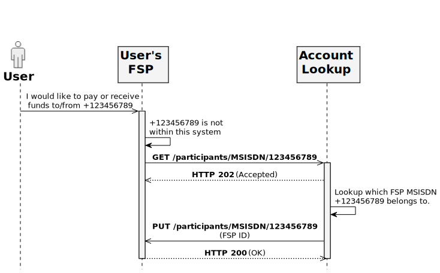


**Figure 42 -- How to use the services provided by /participants if there is a common Account Lookup System**

#### Requests

This section describes the services that can be requested by a client on the resource **/participants**.

##### GET /participants/_{Type}_/_{ID}_

Alternative URI: **GET /participants/**_{Type}_**/**_{ID}_**/**_{SubId}_

Logical API service: [Lookup Participant Information](../generic-transaction-patterns#lookup-participant-information)

The HTTP request **GET /participants/**_{Type}_**/**_{ID}_ (or **GET /participants/**_{Type}_**/**_{ID}_**/**_{SubId}_) is used to find out in which FSP the requested Party, defined by _{Type}_, _{ID}_ and optionally _{SubId}_, is located (for example, **GET** **/participants/MSISDN/123456789**, or **GET /participants/BUSINESS/shoecompany/employee1**). See [Refund](#refund) for more information regarding addressing of a Party.

This HTTP request should support a query string (see [URI Syntax](#uri-syntax) for more information regarding URI syntax) for filtering of currency. To use filtering of currency, the HTTP request **GET /participants/**_{Type}_**/**_{ID}_**?currency=**_XYZ_ should be used, where _XYZ_ is the requested currency.

Callback and data model information for **GET /participants/**_{Type}_**/**_{ID}_ (alternative **GET /participants/**_{Type}_**/**_{ID}_**/**_{SubId}_):

- Callback - [**PUT /participants/**_{Type}_/_{ID}_](#put-participants-type-id)
- Error Callback - [**PUT /participants/**_{Type}_/_{ID}_**/error**](#put-participants-type-iderror)
- Data Model -- Empty body

##### POST /participants

Alternative URI: N/A

Logical API service: [Create Bulk Participant Information](../generic-transaction-patterns#create-bulk-participant-information)

The HTTP request **POST /participants** is used to create information on the server regarding the provided list of identities. This request should be used for bulk creation of FSP information for more than one Party. The optional currency parameter should indicate that each provided Party supports the currency.

Callback and data model information for **POST /participants**:

- Callback -- [**PUT /participants/**_{ID}_](#put-participants-type-id)
- Error Callback -- [**PUT /participants/**_{ID}_ **/error**](#put-participants-type-iderror)
- Data Model -- See [Table 9](#table-9)

###### Table 9

|Name|Cardinality|Type|Description|
|---|---|---|---|
|**requestId**|1|CorrelationId|The ID of the request, decided by the client. Used for identification of the callback from the server.|
|**partyList**|1..10000|PartyIdInfo|List of PartyIdInfo elements that the client would like to update or create FSP information about.|
|**currency**|0..1|Currency|Indicate that the provided Currency is supported by each PartyIdInfo in the list.|

**Table 9 - POST /participants data model**

##### POST /participants/_{Type}_/_{ID}_

Alternative URI: **POST /participants/**_{Type}_/_{ID}_/_{SubId}_

Logical API service: [Create Participant Information](../generic-transaction-patterns#create-participant-information)

The HTTP request **POST /participants/**_{Type}_**/**_{ID}_ (or **POST /participants/**_{Type}_**/**_{ID}_**/**_{SubId}_) is used to create information on the server regarding the provided identity, defined by _{Type}_, _{ID}_, and optionally _{SubId}_ (for example, **POST** **/participants/MSISDN/123456789** or **POST /participants/BUSINESS/shoecompany/employee1**). See [Refund](#refund) for more information regarding addressing of a Party.

Callback and data model information for **POST /participants**/_{Type}_**/**_{ID}_ (alternative **POST** **/participants/**_{Type}_**/**_{ID}_**/**_{SubId}_):

- Callback -- [**PUT /participants/**_{Type}_**/**_{ID}_](#put-participants-type-id)
- Error Callback -- [**PUT /participants/**_{Type}_**/**_{ID}_**/error**](#put-participants-type-iderror)
- Data Model -- See [Table 10](#table-10)

###### Table 10

|Name|Cardinality|Type|Description|
|---|---|---|---|
|**fspId**|1|FspId|FSP Identifier that the Party belongs to.|
|**currency**|0..1|Currency|Indicate that the provided Currency is supported by the Party.|
|**extensionList**| 0..1 | ExtensionList | Optional extension, specific to deployment. |

**Table 10 -- POST /participants/_{Type}_/_{ID}_ (alternative POST /participants/_{Type}_/_{ID}_/_{SubId}_) data model**

##### DELETE /participants/_{Type}_/_{ID}_

Alternative URI: **DELETE /participants/**_{Type}_**/**_{ID}_**/**_{SubId}_

Logical API service: [Delete Participant Information](../generic-transaction-patterns#delete-participant-information)

The HTTP request **DELETE /participants/**_{Type}_**/**_{ID}_ (or **DELETE /participants/**_{Type}_**/**_{ID}_**/**_{SubId}_) is used to delete information on the server regarding the provided identity, defined by _{Type}_ and _{ID}_) (for example, **DELETE** **/participants/MSISDN/123456789**), and optionally _{SubId}_. See [Refund](#refund) for more information regarding addressing of a Party.

This HTTP request should support a query string (see [URI Syntax](#uri-syntax) for more information regarding URI syntax) to delete FSP information regarding a specific currency only. To delete a specific currency only, the HTTP request **DELETE** **/participants/**_{Type}_**/**_{ID}_**?currency**_=XYZ_ should be used, where _XYZ_ is the requested currency.

**Note:** The ALS should verify that it is the Party's current FSP that is deleting the FSP information.

Callback and data model information for **DELETE /participants/**_{Type}_**/**_{ID}_ (alternative **GET** **/participants/**_{Type}_**/**_{ID}_**/**_{SubId}_):

- Callback -- [**PUT /participants/**_{Type}_**/**_{ID}_](#put-participants-type-id)

- Error Callback -- [**PUT /participants/**_{Type}_**/**_{ID}_**/error**](#put-participants-type-iderror)

- Data Model -- Empty body

<br />

#### Callbacks

This section describes the callbacks used by the server for services provided by the resource **/participants**.

##### PUT /participants/_{Type}_/_{ID}_

Alternative URI: **PUT /participants/**_{Type}_**/**_{ID}_**/**_{SubId}_

Logical API service: [Return Participant Information](../generic-transaction-patterns#return-participant-information)

The callback **PUT /participants/**_{Type}_**/**_{ID}_ (or **PUT /participants/**_{Type}_**/**_{ID}_**/**_{SubId}_) is used to inform the client of a successful result of the lookup, creation, or deletion of the FSP information related to the Party. If the FSP information is deleted, the **fspId** element should be empty; otherwise the element should include the FSP information for the Party.

See [Table 11](#table-11) for data model.

###### Table 11

|Name|Cardinality|Type|Description|
|---|---|---|---|
|**fspId**|0..1|FspId|FSP Identifier that the Party belongs to.|

**Table 11 -- PUT /participants/_{Type}_/_{ID}_ (alternative PUT /participants/_{Type}_/_{ID}_/_{SubId}_) data model**

##### PUT /participants/_{ID}_

Alternative URI: N/A

Logical API service: [Return Bulk Participant Information](../generic-transaction-patterns#return-bulk-participant-information)

The callback **PUT /participants/**_{ID}_ is used to inform the client of the result of the creation of the provided list of identities.

See [Table 12](#table-12) for data model.

###### Table 12

|Name|Cardinality|Type|Description|
|---|---|---|---|
|**partyList**|1..10000|PartyResults|List of PartyResult elements that were either created or failed to be created.|
|**currency**|0..1|Currency|Indicate that the provided Currency was set to be supported by each successfully added PartyIdInfo.|

**Table 12 -- PUT /participants/_{ID}_ data model**

####Error Callbacks

This section describes the error callbacks that are used by the server under the resource **/participants**.

##### PUT /participants/_{Type}_/_{ID}_/error

Alternative URI: **PUT /participants/**_{Type}_**/**_{ID}_**/**_{SubId}_**/error**

Logical API service: [Return Participant Information Error](../generic-transaction-patterns#return-participant-information-error)

If the server is unable to find, create or delete the associated FSP of the provided identity, or another processing error occurred, the error callback **PUT /participants/**_{Type}_**/**_{ID}_**/error** (or **PUT /participants/**_{Type}_**/**_{ID}_**/**_{SubId}_**/error**) is used. See [Table 13](#table-13) for data model.

###### Table 13

|Name|Cardinality|Type|Description|
|---|---|---|---|
|**errorInformation**|1|ErrorInformation|Error code, category description.|

**Table 13 -- PUT /participants/_{Type}_/_{ID}_/error (alternative PUT /participants/_{Type}_/_{ID}_/_{SubId}_/error) data model**

##### PUT /participants/_{ID}_/error

Alternative URI: N/A

Logical API service: [Return Bulk Participant Information Error](../generic-transaction-patterns#return-bulk-participant-information-error)

If there is an error during FSP information creation on the server, the error callback **PUT /participants/**_{ID}_**/error** is used. The _{ID}_ in the URI should contain the **requestId** (see [Table 9](#table-9)) that was used for the creation of the participant information. See [Table 14](#table-14) for data model.

###### Table 14

| **Name** | **Cardinality** | **Type** | **Description** |
| --- | --- | --- | --- |
| **error Information** | 1 | ErrorInformation | Error code, category description. |

**Table 14 -- PUT /participants/_{ID}_/error data model**

#### States

There are no states defined for the **/participants** resource; either the server has FSP information regarding the requested identity or it does not.

<br />

### API Resource /parties

This section defines the logical API resource **Parties,** described in [Generic Transaction Patterns](../generic-transaction-patterns#api-resource-parties).

The services provided by the resource **/parties** is used for finding out information regarding a Party in a Peer FSP.

#### Resource Version History

[Table 15](#table-15) contains a description of each different version of the **/parties** resource.

###### Table 15

|Version|Date|Description|
|---|---|---|
|1.0|2018-03-13|Initial version|
|1.1|2020-05-19|The data model is updated to add an optional ExtensioinList element to the PartyIdInfo complex type based on the Change Request: https://github.com/mojaloop/mojaloop-specification/issues/30. Following this, the data model as specified in Table 93 has been updated.|

**Table 15 – Version history for resource /parties**

#### Service Details

[Figure 43](#figure-43) contains an example process for the [**/parties**](../generic-transaction-patterns#api-resource-parties) resource. Alternative deployments could also exist; for example, a deployment in which the Switch and the ALS are in the same server, or one in which the User's FSP asks FSP 1 directly for information regarding the Party.

###### Figure 43

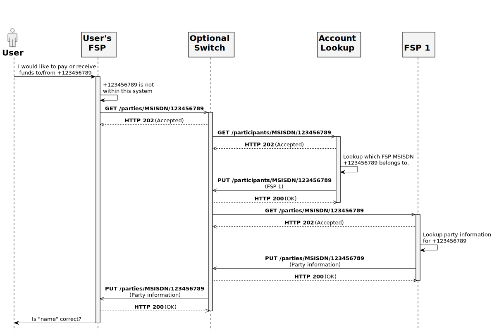


**Figure 43 -- Example process for /parties resource**

<br />

#### Requests

This section describes the services that can be requested by a client in the API on the resource **/parties**.

##### GET /parties/_{Type}_/_{ID}_

Alternative URI: **GET /parties/**_{Type}_**/**_{ID}_**/**_{SubId}_

Logical API service: [Lookup Party Information](../generic-transaction-patterns#lookup-party-information)

The HTTP request **GET /parties/**_{Type}_**/**_{ID}_ (or **GET /parties/**_{Type}_**/**_{ID}_**/**_{SubId}_) is used to lookup information regarding the requested Party, defined by _{Type}_, _{ID}_ and optionally _{SubId}_ (for example, **GET /parties/MSISDN/123456789**, or **GET** **/parties/BUSINESS/shoecompany/employee1**). See [Refund](#refund) for more information regarding addressing of a Party.

Callback and data model information for **GET /parties/**_{Type}_**/**_{ID}_ (alternative **GET /parties/**_{Type}_**/**_{ID}_**/**_{SubId}_):

- Callback - [**PUT /parties/**_{Type}_**/**_{ID}_](#put-partiestypeid)
- Error Callback - [**PUT /parties/**_{Type}_**/**_{ID}_**/error**](#put-partiestypeiderror)
- Data Model -- Empty body

<br />

#### Callbacks

This section describes the callbacks that are used by the server for services provided by the resource **/parties**.

##### PUT /parties/_{Type}_/_{ID}_

Alternative URI: **PUT /parties/**_{Type}_**/**_{ID}_**/**_{SubId}_

Logical API service: [Return Party Information](../generic-transaction-patterns#return-party-information)

The callback **PUT /parties/**_{Type}_**/**_{ID}_ (or **PUT /parties/**_{Type}_**/**_{ID}_**/**_{SubId}_) is used to inform the client of a successful result of the Party information lookup. See [Table 16](#table-16) for data model.

###### Table 16

| **Name** | **Cardinal** | **Type** | **Description** |
| --- | --- | --- | --- |
| **party** | 1 | Party | Information regarding the requested Party. |

**Table 16 -- PUT /parties/_{Type}_/_{ID}_ (alternative PUT /parties/_{Type}_/_{ID}_/_{SubId}_) data model**

#### Error Callbacks

This section describes the error callbacks that are used by the server under the resource **/parties**.

#### PUT /parties/_{Type}_/_{ID}_/error

Alternative URI: **PUT /parties/**_{Type}_**/**_{ID}_**/**_{SubId}_**/error**

Logical API service: [Return Party Information Error](../generic-transaction-patterns#return-party-information-error)

If the server is unable to find Party information of the provided identity, or another processing error occurred, the error callback **PUT /parties/**_{Type}_**/**_{ID}_**/error** (or **PUT /parties/**_{Type}_**/**_{ID}_**/**_{SubId}_**/error**) is used. See [Table 17](#table-17) for data model.

###### Table 17

| **Name** | **Cardinality** | **Type** | **Description** |
|---|---|---|---|
| **errorInformation** | 1 | ErrorInformation | Error code, category description. |

**Table 17 -- PUT /parties/_{Type}_/_{ID}_/error (alternative PUT /parties/_{Type}_/_{ID}_/_{SubId}_/error) data model**

#### States

There are no states defined for the **/parties** resource; either an FSP has information regarding the requested identity or it does not.

<br />

### API Resource /transactionRequests

This section defines the logical API resource **Transaction Requests**, described in [Generic Transaction Patterns](../generic-transaction-patterns#api-resource-transaction-requests).

The primary service that the API resource **/transactionRequests** enables is for a Payee to request a Payer to transfer electronic funds to the Payee. The Payer can either approve or reject the request from the Payee. The decision by the Payer could be made programmatically if:

- The Payee is trusted (that is, the Payer has pre-approved the Payee in the Payer FSP), or

- An authorization value - that is, a _one-time password_ (_OTP_) is correctly validated using the API Resource **/authorizations**, see [Section 6.6](#66-api-resource-authorizations).

Alternatively, the Payer could make the decision manually.

####  Resource Version History

[Table 18](#table-18) contains a description of each different version of the **/transactionRequests** resource.

###### Table 18

|Version|Date|Description|
|---|---|---|
|1.0|2018-03-13|Initial version|
|1.1|2020-05-19|The data model is updated to add an optional ExtensioinList element to the PartyIdInfo complex type based on the Change Request: https://github.com/mojaloop/mojaloop-specification/issues/30. Following this, the data model as specified in Table 93 has been updated.|

**Table 18 – Version history for resource /transactionRequests**

#### Service Details

[Figure 44](#figure-44) shows how the request transaction process works, using the **/transactionRequests** resource. The approval or rejection is not shown in the figure. A rejection is a callback **PUT /transactionRequests/**_{ID}_ with a **REJECTED** state, similar to the callback in the figure with the **RECEIVED** state, as described in [Section 6.4.2.1](#6421-payer-rejected-transaction-request). An approval by the Payer is not sent as a callback; instead a quote and transfer are sent containing a reference to the transaction request.

###### Figure 44

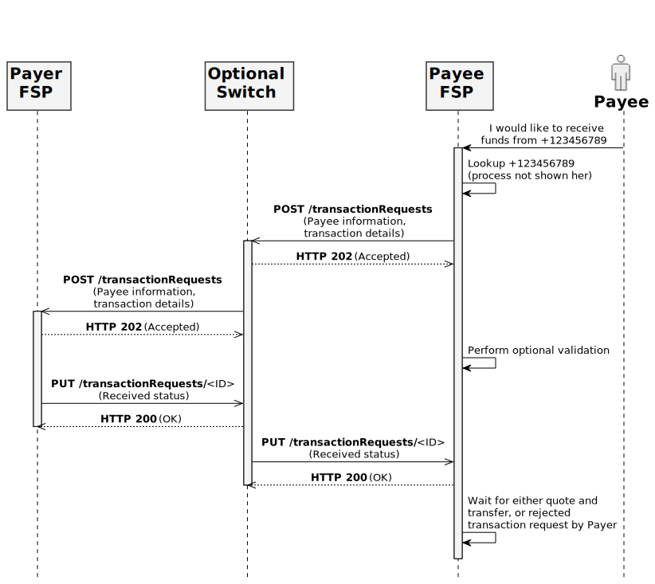

**Figure 44 -- How to use the /transactionRequests service**

##### Payer Rejected Transaction Request

[Figure 45](#figure-45) shows the process by which a transaction request is rejected. Possible reasons for rejection include:

- The Payer rejected the request manually.
- An automatic limit was exceeded.
- The Payer entered an OTP incorrectly more than the allowed number of times.

###### Figure 45

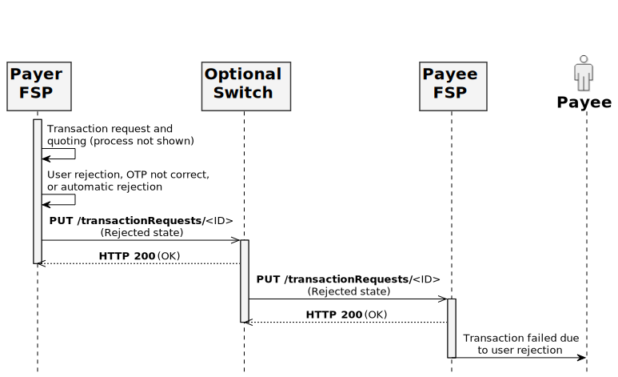

**Figure 45 -- Example process in which a transaction request is rejected**

#### Requests

This section describes the services that a client can request on the resource **/transactionRequests**.

##### GET /transactionRequests/_{ID}_

Alternative URI: N/A

Logical API service: [Retrieve Transaction Request Information](../generic-transaction-patterns#retrieve-transaction-request-information)

The HTTP request **GET /transactionRequests/**_{ID}_ is used to get information regarding a previously-created or requested transaction request. The _{ID}_ in the URI should contain the **transactionRequestId** (see [Table 15](#table-15)) that was used for the creation of the transaction request.

Callback and data model information for **GET /transactionRequests/**_{ID}_:

- Callback - [**PUT /transactionRequests/**_{ID}_](#put-transactionrequestsid)
- Error Callback - [**PUT /transactionRequests/**_{ID}_**/error**](#put-transactionrequestsiderror)
- Data Model -- Empty body

##### POST /transactionRequests

Alternative URI: N/A

Logical API service: [Perform Transaction Request](../generic-transaction-patterns#perform-transaction-request)

The HTTP request **POST /transactionRequests** is used to request the creation of a transaction request for the provided financial transaction on the server.

Callback and data model information for **POST /transactionRequests**:

- Callback - [**PUT /transactionRequests/**_{ID}_](#put-transactionrequestsid)
- Error Callback - [**PUT /transactionRequests/**_{ID}_**/error**](#put-transactionrequestsiderror)
- Data Model -- See [Table 19](#table-19)

###### Table 19

| **Name** | **Cardinality** | **Type** | **Description** |
| --- | --- | --- | --- |
| **transactionRequestId** | 1 | CorrelationId | Common ID between the FSPs for the transaction request object, decided by the Payee FSP. The ID should be reused for resends of the same transaction request. A new ID should be generated for each new transaction request. |
| **payee** | 1 | Party | Information about the Payee in the proposed financial transaction. |
| **payer** | 1 | PartyInfo | Information about the Payer type, id, sub-type/id, FSP Id in the proposed financial transaction. |
| **amount** | 1 | Money | Requested amount to be transferred from the Payer to Payee. |
| **transactionType** | 1 | TransactionType | Type of transaction. |
| **note** | 0..1 | Note | Reason for the transaction request, intended to the Payer. |
| **geoCode** | 0..1 | GeoCode | Longitude and Latitude of the initiating Party. Can be used to detect fraud. |
| **authenticationType** | 0.11 | AuthenticationType | OTP or QR Code, otherwise empty. |
| **expiration** | 0..1 | DateTime | Can be set to get a quick failure in case the peer FSP takes too long to respond. Also, it may be beneficial for Consumer, Agent, Merchant to know that their request has a time limit. |
| **extensionList** | 0..1 | ExtensionList | Optional extension, specific to deployment. |

**Table 19 -- POST /transactionRequests data model**

####Callbacks

This section describes the callbacks that are used by the server under the resource **/transactionRequests**.

##### PUT /transactionRequests/_{ID}_

Alternative URI: N/A

Logical API service: **Return Transaction Request Information**

The callback **PUT /transactionRequests/**_{ID}_ is used to inform the client of a requested or created transaction request. The _{ID}_ in the URI should contain the **transactionRequestId** (see [Table 19](#table-19)) that was used for the creation of the transaction request, or the _{ID}_ that was used in the [**GET /transactionRequests/**_{ID}_](#get-transactionrequestsid). See [Table 20](#table-20) for data model.

###### Table 20

| **Name** | **Cardinality** | **Type** | **Description** |
| --- | --- | --- | --- |
| **transactionId** | 0..1 | CorrelationId | Identifies a related transaction (if a transaction has been created). |
| **transactionRequestState** | 1 | TransactionRequestState | State of the transaction request. |
| **extensionList** | 0..1 | ExtensionList | Optional extension, specific to deployment. |

**Table 20 -- PUT /transactionRequests/_{ID}_ data model**

#### Error Callbacks

This section describes the error callbacks that are used by the server under the resource **/transactionRequests**.

##### PUT /transactionRequests/_{ID}_/error

Alternative URI: N/A

Logical API service: [Return Transaction Request Information Error](../generic-transaction-patterns#return-transaction-request-information-error)

If the server is unable to find or create a transaction request, or another processing error occurs, the error callback **PUT** **/transactionRequests/**_{ID}_**/error** is used. The _{ID}_ in the URI should contain the **transactionRequestId** (see [Table 19](#table-19)) that was used for the creation of the transaction request, or the _{ID}_ that was used in the [**GET /transactionRequests/**_{ID}_](#get-transactionrequestsid). See [Table 21](#table-21) for data model.

###### Table 21

| **Name** | **Cardinality** | **Type** | **Description** |
| --- | --- | ---| --- |
| **errorInformation** | 1 | ErrorInformation | Error code, category description. |

**Table 21 -- PUT /transactionRequests/_{ID}_/error data model**

#### 6.4.6 States

The possible states of a transaction request can be seen in [Figure 46](#figure-46).

**Note:** A server does not need to keep transaction request objects that have been rejected in their database. This means that a client should expect that an error callback could be received for a rejected transaction request.

###### Figure 46


**Figure 46 -- Possible states of a transaction request**

<br />

### API Resource /quotes

This section defines the logical API resource **Quotes**, described in [Generic Transaction Patterns](../generic-transaction-patterns#api-resource-quotes).

The main service provided by the API resource **/quotes** is calculation of possible fees and FSP commission involved in performing an interoperable financial transaction. Both the Payer and Payee FSP should calculate their part of the quote to be able to get a total view of all the fees and FSP commission involved in the transaction.

A quote is irrevocable; it cannot be changed after it has been created. However, it can expire (all quotes are valid only until they reach expiration).

**Note:** A quote is not a guarantee that the financial transaction will succeed. The transaction can still fail later in the process. A quote only guarantees that the fees and FSP commission involved in performing the specified financial transaction are applicable until the quote expires.

For more information see [Quoting](#quoting).

#### Resource Version History

[Table 22](#table-22) contains a description of each different version of the **/quotes** resource.

###### Table 22

|Version|Date|Description|
|---|---|---|
|1.0|2018-03-13|Initial version|
|1.1|2020-05-19|The data model is updated to add an optional ExtensioinList element to the PartyIdInfo complex type based on the Change Request: https://github.com/mojaloop/mojaloop-specification/issues/30. Following this, the data model as specified in Table 93 has been updated.|

**Table 22 – Version history for resource /quotes**

#### Service Details

[Figure 47](#figure-47) contains an example process for the API resource **/quotes**. The example shows a Payer Initiated Transaction, but it could also be initiated by the Payee, using the API Resource [**/transactionRequests**](#api-resource-transactionrequests). The lookup process is in that case performed by the Payee FSP instead.

###### Figure 47

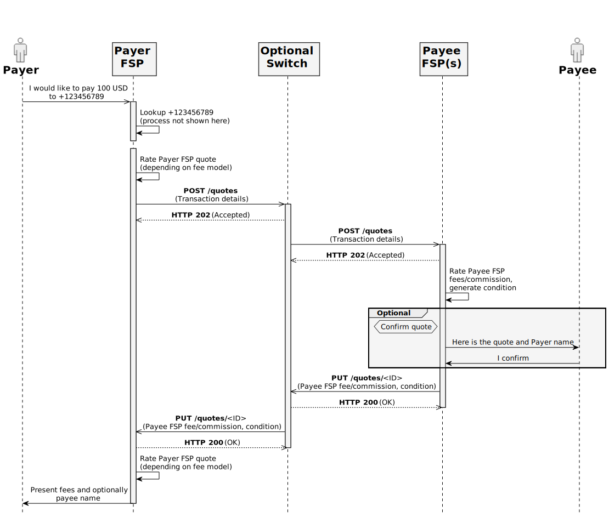


**Figure 47 -- Example process for resource /quotes**

#### Quote Expiry Details

The quote request from the Payer FSP can contain an expiry of the quote, if the Payer FSP would like to indicate when it is no longer useful for the Payee FSP to return a quote. For example, the transaction itself might otherwise time out, or if its quote might time out.

The Payee FSP should set an expiry of the quote in the callback to indicate when the quote is no longer valid for use by the Payer FSP.

#### Rejection of Quote

The Payee FSP can reject a quote request from the Payer FSP by sending the error callback **PUT /quotes/**_{ID}_/**error** instead of the callback **PUT /quotes/**_{ID}_.
Depending on which generic transaction pattern (see Section 8 for more information) that is used, the Payer FSP can reject a quote using one of the following processes:

- If the transaction is initiated by the Payer (see Section 8.1), the Payer FSP should not inform the Payee FSP regarding the rejection. The created quote at the Payee FSP should have an expiry time, at which time it is automatically deleted.
- If the transaction is initiated by the Payee (see Section 8.2 and 8.3), the Payer FSP should inform the Payee FSP regarding the rejection using the callback **PUT /transactionRequests/**_{ID}_ with a rejected state. The process is described in more detail in Section 6.4.2.1.

#### Interledger Payment Request

As part of supporting Interledger and the concrete implementation of the Interledger Payment Request (see [Interledgeer Protocol](#interledger-protocol)), the Payee FSP must:

- Determine the ILP Address (see [ILP Addressing](#ILP-addressing) for more information) of the Payee and the amount that the Payee will receive. Note that since the **amount** element in the ILP Packet is defined as an UInt64, which is an Integer value, the amount should be multiplied with the currency's exponent (for example, USD's exponent is 2, which means the amount should be multiplied by 10<sup>2</sup>, and JPY's exponent is 0, which means the amount should be multiplied by 10<sup>0</sup>). Both the ILP Address and the amount should be populated in the ILP Packet (see [ILP Packet](#ilp-packet) for more information).

- Populate the **data** element in the ILP Packet by the [Transaction](#transaction) data model.
- Generate the fulfilment and the condition (see [Conditional Transfers](#conditional-transfers) for more information). Populate the **condition** element in the [PUT /quotes/**_{ID}_](#put-quotes-id)). [Table 19](#table-19) shows data model with the generated condition.

The fulfilment is a temporary secret that is generated for each financial transaction by the Payee FSP and used as the trigger to commit the transfers that make up an ILP payment.

The Payee FSP uses a local secret to generate a SHA-256 HMAC of the ILP Packet. The same secret may be used for all financial transactions or the Payee FSP may store a different secret per Payee or based on another segmentation.

The choice and cardinality of the local secret is an implementation decision that may be driven by scheme rules. The only requirement is that the Payee FSP can determine which secret that was used when the ILP Packet is received back later as part of an incoming transfer (see [API Resource Transfers](#api-resource-transfers)).

The fulfilment and condition are generated in accordance with the algorithm defined in [Listing 12](#listing-12). Once the Payee FSP has derived the condition, the fulfilment can be discarded as it can be regenerated later.

###### Listing 12

Generation of the fulfilment and condition

**Inputs:**

- Local secret (32-byte binary string)
- ILP Packet

**Algorithm:**

1. Let the fulfilment be the result of executing the HMAC SHA-256 algorithm on the ILP Packet using the local secret as the key.

2. Let the condition be the result of executing the SHA-256 hash algorithm on the fulfilment.

**Outputs:**

- Fulfilment (32-byte binary string)
- Condition (32-byte binary string)

**Listing 12 -- Algorithm to generate the fulfilment and the condition**

#### Requests

This section describes the services that can be requested by a client in the API on the resource **/quotes**.

##### GET /quotes/_{ID}_

Alternative URI: N/A

Logical API service: [Retrieve Quote Information](../generic-transaction-patterns#retrieve-quote-information)

The HTTP request **GET /quotes/**_{ID}_ is used to get information regarding a previously-created or requested quote. The _{ID}_ in the URI should contain the **quoteId** (see [Table 23](#table-23)) that was used for the creation of the quote.

Callback and data model information for **GET /quotes/**_{ID}_:

- Callback -- [**PUT /quotes/**_{ID}_](#put-quotes-id)
- Error Callback -- [**PUT /quotes/**_{ID}_**/_error_**](#put-quotes-iderror)
- Data Model -- Empty body

##### POST /quotes

Alternative URI: N/A

Logical API service: [Calculate Quote Information](../generic-transaction-patterns#calculate-quote-information)

The HTTP request **POST /quotes** is used to request the creation of a quote for the provided financial transaction on the server.

Callback and data model information for **POST /quotes**:

- Callback -- [**PUT /quotes/**_{ID}_](#put-quotes-id)
- Error Callback -- [**PUT /quotes/**_{ID}_**/error**](#put-quotes-iderror)
- Data Model -- See [Table 23](#table-23)

###### Table 23

| **Name** | **Cardinality** | **Type** | **Description** |
| --- | --- | --- | --- |
| **quoteId** | 1 | CorrelationId | Common ID between the FSPs for the quote object, decided by the Payer FSP. The ID should be reused for resends of the same quote for a transaction. A new ID should be generated for each new quote for a transaction. |
| **transactionId** | 1 | CorrelationId | Common ID (decided by the Payer FSP) between the FSPs for the future transaction object. The actual transaction will be created as part of a successful transfer process.  The ID should be reused for resends of the same quote for a transaction. A new ID should be generated for each new quote for a transaction. |
| **transactionRequestId** | 0..1 | CorrelationId | Identifies an optional previously-sent transaction request. |
| **payee** | 1 | Party | Information about the Payee in the proposed financial transaction. |
| **payer** | 1 | Party | Information about the Payer in the proposed financial transaction. |
| **amountType** | 1 | AmountType |**SEND** for send amount, **RECEIVE** for receive amount. |
| **amount** | 1 | Money | Depending on **amountType**:<br>If **SEND**: The amount the Payer would like to send; that is, the amount that should be withdrawn from the Payer account including any fees. The amount is updated by each participating entity in the transaction.<br>If **RECEIVE**: The amount the Payee should receive; that is, the amount that should be sent to the receiver exclusive any fees. The amount is not updated by any of the participating entities.</br> |
| **fees** | 0..1 | Money | Fees in the transaction. <li>The fees element should be empty if fees should be non-disclosed.</li><li>The fees element should be non-empty if fee should be disclosed.</li> |
| **transactionType** | 1 | TransactionType | Type of transaction for which the quote is requested. |
| **geoCode** | 0..1 | GeoCode | Longitude and Latitude of the initiating Party. Can be used to detect fraud. |
| **note** | 0..1 | Note | A memo that will be attached to the transaction. |
| **expiration** | 0..1 | DateTime | Expiration is optional. It can be set to get a quick failure in case the peer FSP takes too long to respond. Also, it may be beneficial for Consumer, Agent, and Merchant to know that their request has a time limit. |
| **extensionList** | 0..1 | ExtensionList | Optional extension, specific to deployment. |

**Table 23 -- POST /quotes data model**

#### Callbacks

This section describes the callbacks that are used by the server under the resource **/quotes**.

#### PUT /quotes/_{ID}_

Alternative URI: N/A

Logical API service: [Return Quote Information](../generic-transaction-patterns#return-quote-information)

The callback **PUT /quotes/**_{ID}_ is used to inform the client of a requested or created quote. The _{ID}_ in the URI should contain the **quoteId** (see [Table 23](#table-23)) that was used for the creation of the quote, or the _{ID}_ that was used in the [**GET /quotes/**_{ID}_](#get-quotesid). See [Table 24](#table-24) for data model.

###### Table 24

| **Name** | **Cardinality** | **Type** | **Description** |
| --- | --- | --- | --- |
| **transferAmount** | 1 | Money | The amount of Money that the Payer FSP should transfer to the Payee FSP. |
| **payeeReceiveAmount** | 0..1 | Money | The amount of Money that the Payee should receive in the end-to-end transaction. Optional as the Payee FSP might not want to disclose any optional Payee fees. |
| **payeeFspFee** | 0..1 | Money | Payee FSP’s part of the transaction fee. |
| **payeeFspCommission** | 0..1 | Money | Transaction commission from the Payee FSP. |
| **expiration** | 1 | DateTime | Date and time until when the quotation is valid and can be honored when used in the subsequent transaction. |
| **geoCode** | 0..1 | GeoCode | Longitude and Latitude of the Payee. Can be used to detect fraud. |
| **ilpPacket** | 1 | IlpPacket | The ILP Packet that must be attached to the transfer by the Payer. |
| **condition** | 1 | IlpCondition | The condition that must be attached to the transfer by the Payer. |
| **extensionList** | 0..1 | ExtensionList | Optional extension, specific to deployment |

**Table 24 -- PUT /quotes/_{ID}_ data model**

#### Error Callbacks

This section describes the error callbacks that are used by the server
under the resource **/quotes**.

##### PUT /quotes/_{ID}_/error

Alternative URI: N/A

Logical API service: [Return Quote Information Error](../generic-transaction-patterns#return-quote-information-error)

If the server is unable to find or create a quote, or some other processing error occurs, the error callback **PUT** **/quotes/**_{ID}_**/error** is used. The _{ID}_ in the URI should contain the **quoteId** (see [Table 23](#table-23)) that was used for the creation of the quote, or the _{ID}_ that was used in the [**GET /quotes/**_{ID}_](#get-quotesid). See [Table 25](#table-25) for data model.

###### Table 25

| **Name** | **Cardinality** | **Type** | **Description** |
| --- | --- | --- | --- |
| **errorInformation** | 1 | ErrorInformation | Error code, category description.|

**Table 25 -- PUT /quotes/_{ID}_/error data model**

#### States

###### Figure 48

[Figure 48](#figure-48) contains the UML (Unified Modeling Language) state machine for the possible states of a quote object.

**Note:** A server does not need to keep quote objects that have been either rejected or expired in their database. This means that a client should expect that an error callback could be received for an expired or rejected quote.


**Figure 48 -- Possible states of a quote**

<br />

### API Resource /authorizations

This section defines the logical API resource **Authorizations**, described in [Generic Transaction Patterns](../gerneric-transaction-patterns#api-resource-authorizations).

The API resource **/authorizations** is used to request the Payer to enter the applicable credentials in the Payee FSP system for approving the financial transaction, when the Payer has initiated the transaction from a POS, ATM, or similar, in the Payee FSP system and would like to authorize by an OTP.

#### Resource Version History

[Table 26](#table-26) contains a description of each different version of the **/authorizations** resource.

###### Table 26

|Version|Date|Description|
|---|---|---|
|1.0|2018-03-13|Initial version|

**Table 26 – Version history for resource /authorizations**

#### Service Details

[Figure 49](#figure-49) contains an example process for the API resource **/authorizations.** The Payee FSP first sends a [transaction request](#api-resource-transactionrequests)) that is authorized using OTP. The Payer FSP then performs the quoting process (see [API Resource Quotes](#api-resource-quotes)) before an authorization request is sent to the Payee FSP system for the Payer to approve by entering the OTP. If the OTP is correct, the transfer process should be initiated (see [API Resource Transfers](#api-resource-transfers)).

###### Figure 49

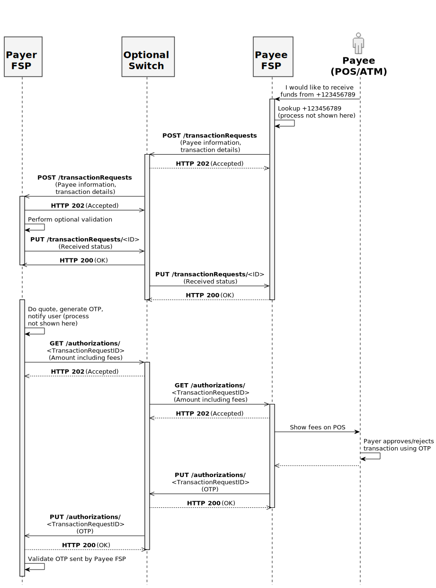


**Figure 49 -- Example process for resource /authorizations**

#### Resend Authorization Value

If the notification containing the authorization value fails to reach the Payer, the Payer can choose to request a resend of the authorization value if the POS, ATM, or similar device supports such a request. See [Figure 50](#figure-50) for an example of a process where the Payer requests that the OTP be resent.

###### Figure 50

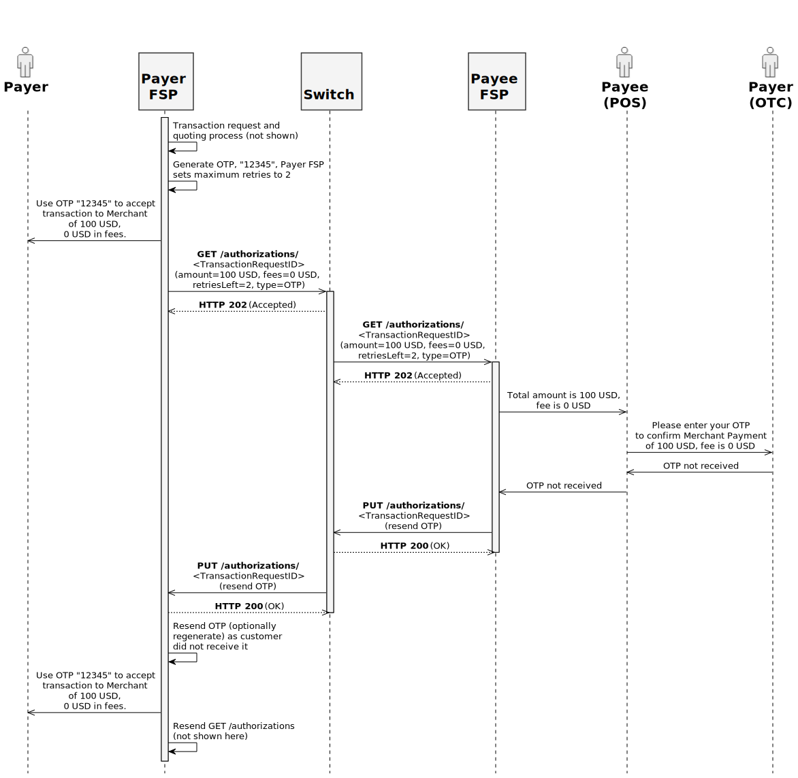


**Figure 50 -- Payer requests resend of authorization value (OTP)**

##### Retry Authorization Value

The Payer FSP must decide the number of times a Payer can retry the authorization value in the POS, ATM, or similar device. This will be set in the **retriesLeft** query string (see [URI Syntax](#uri-syntax) for more information regarding URI syntax) of the [**GET** **/authorizations/**_{ID}_](#get-authorizationsid) service for more information. If the Payer FSP sends retriesLeft=1, this means that it is the Payer's last try of the authorization value. See [Figure 51](#figure-51) for an example process where the Payer enters the incorrect OTP, and the **retriesLeft** value is subsequently decreased.

###### Figure 51


**Figure 51 -- Payer enters incorrect authorization value (OTP)**

##### Failed OTP authorization

If the user fails to enter the correct OTP within the number of allowed retries, the process described in [Payer Rejected Transaction Request](#payer-rejected-transaction-request) is performed.

#### Requests

This section describes the services that can be requested by a client in the API on the resource **/authorizations**.

##### GET /authorizations/_{ID}_

Alternative URI: N/A

Logical API service: [Perform Authorization](../generic-transaction-patterns#perform-authorization)

The HTTP request **GET /authorizations/**_{ID}_ is used to request the Payer to enter the applicable credentials in the Payee FSP system. The _{ID}_ in the URI should contain the **transactionRequestID** (see [Table 15](#table-15)), received from the [**POST** **/transactionRequests**](#post-transactionrequests)) service earlier in the process.

This request requires a query string (see [URI Syntax](#uri-syntax) for more information regarding URI syntax) to be included in the URI, with the following key-value pairs:

- **authenticationType=**_{Type}_, where _{Type}_ value is a valid authentication type from the enumeration [AuthenticationType](#authenticationtype).
- **retriesLeft=**_{NrOfRetries}_, where _{NrOfRetries}_ is the number of retries left before the financial transaction is rejected. _{NrOfRetries}_ must be expressed in the form of the data type [Integer](#integer)). **retriesLeft=1** means that this is the last retry before the financial transaction is rejected.
- **amount=**_{Amount}_, where _{Amount}_ is the transaction amount that will be withdrawn from the Payer's account. _{Amount}_ must be expressed in the form of the data type [Amount](#amount).
- **currency=**_{Currency}_, where _{Currency}_ is the transaction currency for the amount that will be withdrawn from the Payer's account. The _{Currency}_ value must be expressed in the form of the enumeration [CurrencyCode](#currencycode)).

An example URI containing all the required key-value pairs in the query string is the following:

**GET /authorization/3d492671-b7af-4f3f-88de-76169b1bdf88?authenticationType=OTP&retriesLeft=2&amount=102&currency=USD**

Callback and data model information for **GET /authorization/**_{ID}_:

- Callback - [**PUT /authorizations/**_{ID}_](#6641-put-authorizationsid)
- Error Callback - [**PUT /authorizations/**_{ID}_**/error**](#6651-put-authorizationsiderror)
- Data Model -- Empty body

#### 6.6.4 Callbacks

This section describes the callbacks that are used by the server under the resource **/authorizations**.

#### 6.6.4.1 PUT /authorizations/_{ID}_

Alternative URI: N/A

Logical API service: [Return Authorization Result](../generic-transaction-patterns#return-authorization-result)

The callback **PUT /authorizations/** _{ID}_ is used to inform the client of the result of a previously-requested authorization. The _{ID}_ in the URI should contain the _{ID}_ that was used in the [**GET /authorizations/**_{ID}_](#get-authorizationsid). **See** [Table 27](#table-27) **for** data model.

###### Table 27

| **Name** | **Cardinality** | **Type** | **Description** |
| --- | --- | --- | --- |
| **authenticationInfo** | 0..1 | AuthenticationInfo | OTP or QR Code if entered, otherwise empty. |
| **responseType** | 1 | AuthorizationResponse | Enum containing response information; if the customer entered the authentication value, rejected the transaction, or requested a resend of the authentication value. |

**Table 27 – PUT /authorizations/{ID} data model**

#### Error Callbacks

This section describes the error callbacks that are used by the server under the resource **/authorizations**.

#### PUT /authorizations/_{ID}_/error

Alternative URI: N/A

Logical API service: [Return Authorization Error](../generic-transaction-patterns#return-authorization-error)

If the server is unable to find the transaction request, or another processing error occurs, the error callback **PUT** **/authorizations/**_{ID}_ **/error** is used. The _{ID}_ in the URI should contain the _{ID}_ that was used in the [**GET /authorizations/**_{ID}_](#get-authorizationsid). **See** [Table 28](#table-28) **for** data model.

###### Table 28

| **Name** | **Cardinality** | **Type** | **Description** |
| --- | --- | --- | --- |
| **errorInformation** | 1 | ErrorInformation | Error code, category description |

**Table 28 -- PUT /authorizations/_{ID}_/error data model**

#### States

There are no states defined for the **/authorizations** resource.

<br />

### API Resource /transfers

This section defines the logical API resource **Transfers**, described in [Generic Transaction Patterns](../generic-transation-patterns#api-resource-transfers).

The services provided by the API resource **/transfers** are used for performing the hop-by-hop ILP transfer or transfers, and to perform the end-to-end financial transaction by sending the transaction details from the Payer FSP to the Payee FSP. The transaction details are sent as part of the transfer data model in the ILP Packet.

The Interledger protocol assumes that the setup of a financial transaction is achieved using an end-to-end protocol, but that an ILP transfer is implemented on the back of hop-by-hop protocols between FSPs connected to a common ledger. In the current version of the API, the API Resource **/quotes** performs the setup of the financial transaction. Before a transfer can be performed, the quote must be performed to setup the financial transaction. See [API Resource Quotes](#api-resource-quotes) for more information.

An ILP transfer is exchanged between two account holders on either side of a common ledger. It is usually expressed in the form of a request to execute a transfer on the common ledger and a notification to the recipient of the transfer that the transfer has been reserved in their favor, including a condition that must be fulfilled to commit the transfer.

When the Payee FSP presents the fulfilment to the common ledger, the transfer is committed in the common ledger. At the same time, the Payer FSP is notified that the transfer has been committed along with the fulfilment.

#### Resource Version History

Table 29 contains a description of each different version of the **/transfers** resource.

| Version | Date | Description|
| ---- | ---- | ---- |
| **1.0** | 2018-03-13 | Initial version |
| **1.1** | 2020-05-19 | The resource is updated to support commit notifications using HTTP Method **PATCH**. The new request **PATCH /transfers/{ID}** is described in Section 6.7.3.3. The process of using commit notifications is described in Section 6.7.2.6. <br><br> The data model is updated to add an optional ExtensionList element to the PartyIdInfo complex type based on the Change Request: [https://github.com/mojaloop/mojaloop-specification/issues/30](https://github.com/mojaloop/mojaloop-specification/issues/30). Following this, the data model as specified in Table 93 has been updated.|

**Table 29 –- Version history for resource /transfers**

#### Service Details

This section provides details regarding hop-by-hop transfers and end-to-end financial transactions.

#### Process

[Figure 52](#figure-52) shows how the transaction process works using the **POST /transfers** service.

###### Figure 52

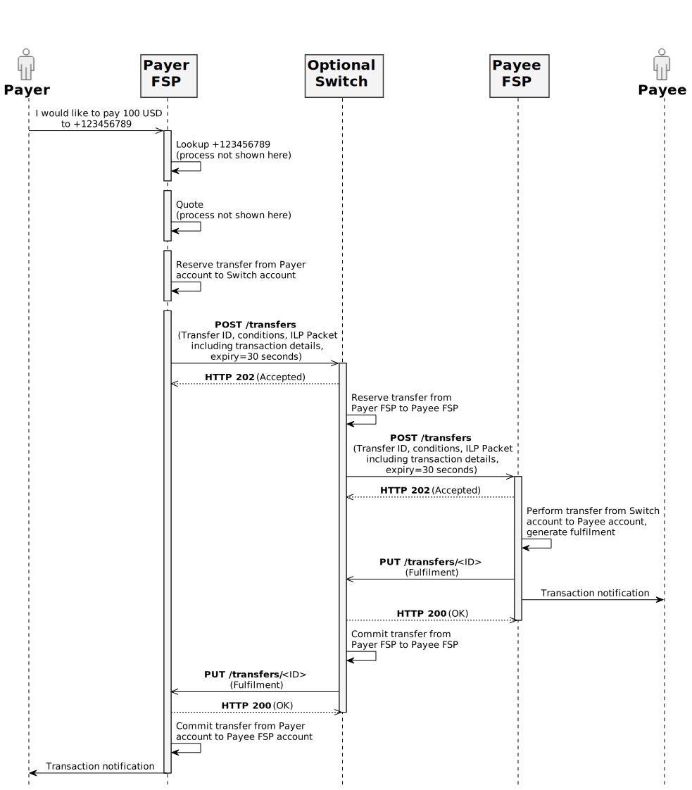


**Figure 52 -- How to use the POST /transfers service**

#### Transaction Irrevocability

The API is designed to support irrevocable financial transactions only; this means that a financial transaction cannot be changed, cancelled, or reversed after it has been created. This is to simplify and reduce costs for FSPs using the API. A large percentage of the operating costs of a typical financial system is due to reversals of transactions.

As soon as a Payer FSP sends a financial transaction to a Payee FSP (that is, using **POST /transfers** including the end-to-end financial transaction), the transaction is irrevocable from the perspective of the Payer FSP. The transaction could still be rejected in the Payee FSP, but the Payer FSP can no longer reject or change the transaction. An exception to this would be if the transfer's expiry time is exceeded before the Payee FSP responds (see [Expired Quote](#expired-quote) and [Client Receiving Expired Transfer](#client-receiving-expired-transfer) for more information). As soon as the financial transaction has been accepted by the Payee FSP, the transaction is irrevocable for all parties.

#### Expired Quote

If a server receives a transaction that is using an expired quote, the server should reject the transfer or transaction.

#### Timeout and Expiry

The Payer FSP must always set a transfer expiry time to allow for use cases in which a swift completion or failure is needed. If the use case does not require a swift completion, a longer expiry time can be set. If the Payee FSP fails to respond before the expiry time, the transaction is cancelled in the Payer FSP. The Payer FSP should still expect a callback from the Payee FSP.

Short expiry times are often required in retail scenarios, in which a customer may be standing in front of a merchant; both parties need to know if the transaction was successful before the goods or services are given to the customer.

In [Figure 52](#figure-52), an expiry has been set to 30 seconds from the current time in the request from the Payer FSP, and to 20 seconds from the same time in the request from the Switch to the Payee FSP. This strategy of using shorter timeouts for each entity in the chain from Payer FSP to Payee FSP should always be used to allow for extra communication time.

**Note:** It is possible that a successful callback might be received in the Payer FSP after the expiry time; for example, due to congestion in the network. The Payer FSP should allow for some extra time after the actual expiry time before cancelling the financial transaction in the system. If a successful callback is received after the financial transaction has been cancelled, the transaction should be marked for reconciliation and handled separately in a reconciliation process.

#### Client Receiving Expired Transfer

[Figure 53](#figure-53) shows an example of a possible error scenario connected to expiry and timeouts. For some reason, the callback from the Payee FSP takes longer time to send than the expiry time in the optional Switch. This leads to the Switch cancelling the reserved transfer, and an error callback for the transfer is sent to the Payer FSP. Now the Payer FSP and the Payee FSP have two different views of the result of the financial transaction; the transaction should be marked for reconciliation.

###### Figure 53

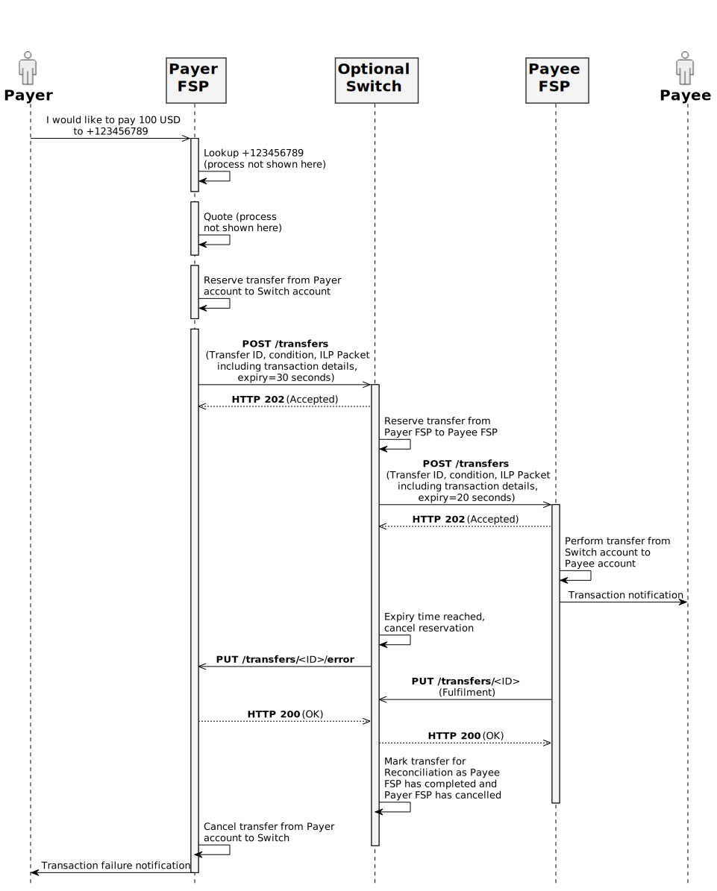


**Figure 53 -- Client receiving an expired transfer**

To limit these kinds of error scenarios, the clients (Payer FSP and optional Switch in [Figure 52](#figure-52)) participating in the ILP transfer should allow some extra time after actual expiry time during which the callback from the server can be received. The client(s) should also query the server after expiry, but before the end of the extra time, if any callback from the server has been lost due to communication failure. Reconciliation could still be necessary though, even with extra time allowed and querying the server for the transaction.

#### Commit Notification

As an alternative option to avoid the error scenario described in [Client Receiving Expired Transfer](#client-receiving-expired-transfer) for use cases where it is complicated to perform a refund, a Payee FSP can (if the scheme allows it) reserve the transfer and then wait for a subsequent commit notification from the Switch. To request a commit notification instead of committing directly is a business decision made by the Payee FSP (if the scheme allows it), based on the context of the transaction. For example, a Cash Out or a Merchant Payment transaction can be understood as a higher-risk transaction, because it is not possible to reverse a transaction if the customer is no longer present; a P2P Transfer can be understood as lower risk because it is easier to reverse by refunding the transaction to the customer.
To request a commit notification from the Switch, the Payee FSP must mark the transfer state (see Section 6.7.6) as reserved instead of committed in the **PUT /transfers/**_{ID}_ callback. Based on the transfer state, the Switch should then perform the following:

- If the transfer is committed, the Switch should not send a commit notification as the Payee FSP has already accepted the risk that the transfer in some rare cases might fail. This is the default way of committing, shown in [Process](#process).
- If the transfer is reserved, the Switch must send a commit notification to the Payee FSP when the transfer is completed (committed or aborted).

The commit notification is sent in the request **PATCH /transfers/**_{ID}_ from the Switch to the Payee FSP. If the Payee FSP does not get a commit notification from the Switch within a reasonable time, the Payee FSP should resend the **PUT /transfers/**_{ID}_ callback to the Switch. The Payee FSP needs to receive the commit notification from the Switch before committing the transfer, or accept the risk that the transfer in the Switch might have failed. The Payee FSP is not allowed to rollback the transfer without receiving an aborted state (see Section 6.7.6) from the Switch, as the Payee FSP has sent the fulfilment (which is the commit trigger) to the Switch.
[Figure 54](#figure-54) shows an example where a commit notification is requested by the Payee FSP. In this example the commit was successful in the Switch.

###### Figure 54

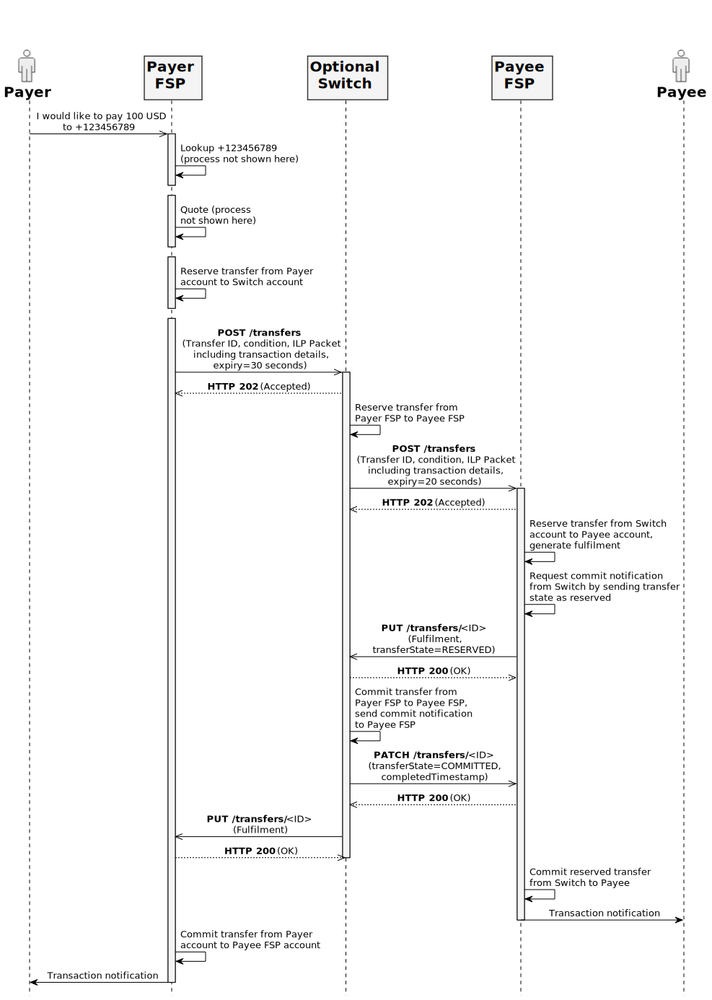


**Figure 54 -- Commit notification where commit of transfer was successful in Switch**

[Figure 55](#figure-55) shows an example in which the commit in the Switch failed due to some reason, for example the expiry time had expired in the Switch due to network issues. This is the same example as in [Figure 53](#figure-53), but where no reconciliation is needed as the Payee FSP receives a commit notification before performing the actual transfer to the Payee.

###### Figure 55

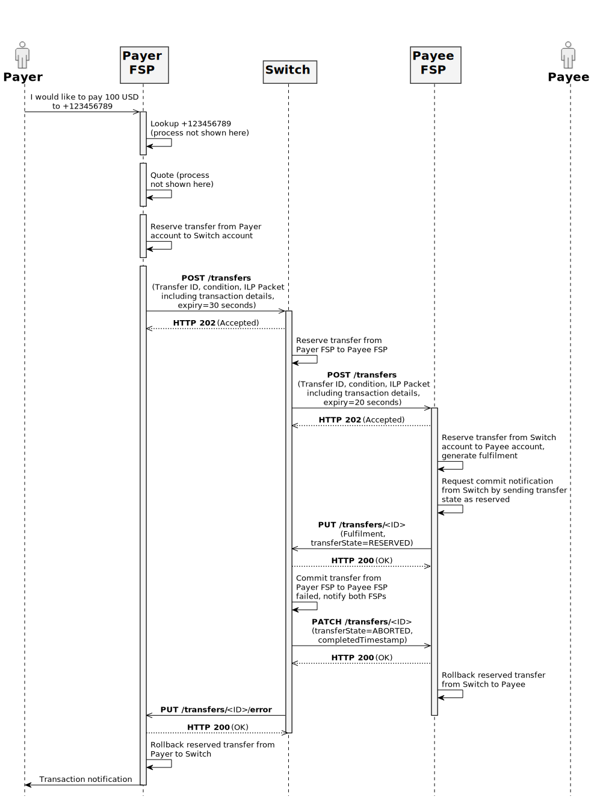


**Figure 55 -- Commit notification where commit of transfer in Switch failed**

#### Refunds

Instead of supporting reversals, the API supports refunds. To refund a transaction using the API, a new transaction should be created by the Payee of the original transaction. The new transaction should revers the original transaction (either the full amount or a partial amount); for example, if customer X sent 100 USD to merchant Y in the original transaction, a new transaction where merchant Y sends 100 USD to customer X should be created. There is a specific transaction type to indicate a refund transaction; for example, if the quote of the transaction should be handled differently than any other type of transaction. The original transaction ID should be sent as part of the new transaction for informational and reconciliation purposes.

#### Interledger Payment Request

As part of supporting Interledger and the concrete implementation of the Interledger Payment Request (see [Interledger Protocol](#interledger-protocol)), the Payer FSP must attach the ILP Packet, the condition, and an expiry to the transfer. The condition and the ILP Packet are the same as those sent by the Payee FSP in the callback of the quote; see [Interledger Payment Request](#interledger-payment-request) section for more information.

The end-to-end ILP payment is a chain of one or more conditional transfers that all depend on the same condition. The condition is provided by the Payer FSP when it initiates the transfer to the next ledger.

The receiver of that transfer parses the ILP Packet to get the Payee ILP Address and routes the ILP payment by performing another transfer on the next ledger, attaching the same ILP Packet and condition and a new expiry that is less than the expiry of the incoming transfer.

When the Payee FSP receives the final incoming transfer to the Payee account, it extracts the ILP Packet and performs the following steps:

1. Validates that the Payee ILP Address in the ILP Packet corresponds to the Payee account that is the destination of the transfer.
2. Validates that the amount in the ILP Packet is the same as the amount of the transfer and directs the local ledger to perform a reservation of the final transfer to the Payee account (less any hidden receiver fees, see [Quoting](#quoting)).
3. If the reservation is successful, the Payee FSP generates the fulfilment using the same algorithm that was used when generating the condition sent in the callback of the quote (see [Interledger Payment Request](#interledger-payment-request)).
4. The fulfilment is submitted to the Payee FSP ledger to instruct the ledger to commit the reservation in favor of the Payee. The ledger will validate that the SHA-256 hash of the fulfilment matches the condition attached to the transfer. If it does, it commits the reservation of the transfer. If not, it rejects the transfer and the Payee FSP rejects the payment and cancels the previously-performed reservation.

The fulfilment is then passed back to the Payer FSP through the same ledgers in the callback of the transfer. As funds are committed on each ledger after a successful validation of the fulfilment, the entity that initiated the transfer will be notified that the funds it reserved have been committed and the fulfilment will be shared as part of that notification message.

The final transfer to be committed is the transfer on the Payer FSP's ledger where the reservation is committed from their account. At this point the Payer FSP notifies the Payer of the successful financial transaction.

#### Requests

This section describes the services that can be requested by a client in the API on the resource **/transfers**.

##### GET /transfers/_{ID}_

Alternative URI: N/A

Logical API service: [Return Authorization Result](../generic-transaction-patterns#return-authorization-result)

The HTTP request **GET /transfers/**_{ID}_ is used to get information regarding a previously-created or requested transfer. The _{ID}_ in the URI should contain the **transferId** (see [Table 23](#table-23)) that was used for the creation of the transfer.

Callback and data model information for **GET /transfer/**_{ID}_:

- Callback -- [**PUT /transfers/**_{ID}_](#put-transfersid)
- Error Callback -- [**PUT /transfers/**_{ID}_**/error**](#put-transfersiderror)
- Data Model -- Empty body

##### POST /transfers

Alternative URI: N/A

Logical API service: [Perform Transfer](../generic-transaction-patterns#perform-transfer)

The HTTP request **POST /transfers** is used to request the creation of a transfer for the next ledger, and a financial transaction for the Payee FSP.

Callback and data model information for **POST /transfers**:

- Callback -- [**PUT /transfers/**_{ID}_](#put-transfersid)
- Error Callback -- [**PUT /transfers/**_{ID}_**/error**](#put-transfersiderror)
- Data Model -- See [Table 30](#table-30)

###### Table 30

| **Name** | **Cardinality** | **Type** | **Description** |
| --- | --- | --- | --- |
| **transferId** | 1| CorrelationId | The common ID between the FSPs and the optional Switch for the transfer object, decided by the Payer FSP. The ID should be reused for resends of the same transfer. A new ID should be generated for each new transfer. |
| **payeeFsp** | 1 | FspId | Payee FSP in the proposed financial transaction. |
| **payerFsp** | 1 | FspId | Payer FSP in the proposed financial transaction. |
| **amount** | 1 | Money | The transfer amount to be sent. |
| **ilpPacket** | 1 | IlpPacket | The ILP Packet containing the amount delivered to the Payee and the ILP Address of the Payee and any other end-to-end data. |
| **condition** | 1 | IlpCondition | The condition that must be fulfilled to commit the transfer. |
| **expiration** | 1 | DateTime | Expiration can be set to get a quick failure expiration of the transfer. The transfer should be rolled back if no fulfilment is delivered before this time. |
| **extensionList** | 0..1 | ExtensionList | Optional extension, specific to deployment. |

**Table 30 – POST /transfers data model**

##### PATCH /transfers/_{ID}_

Alternative URI: N/A

Logical API service: [Commit Notiifcation](../generic-transaction-patterns#commit-notification)

The HTTP request **PATCH /transfers/**_{ID}_ is used by a Switch to update the state of an earlier reserved transfer, if the Payee FSP has requested a commit notification when the Switch has completed processing of the transfer. The _{ID}_ in the URI should contain the transferId (see Table 30) that was used for the creation of the transfer. Please note that this request does not generate a callback. See Table 31 for data model.

###### Table 31

| **Name** | **Cardinality** | **Type** | **Description** |
| --- | --- | --- | --- |
| **completedTimestamp** | 1| DateTime | Time and date when the transaction was completed |
| **transferState** | 1 | TransferState | State of the transfer |
| **extensionList** | 0..1 | ExtensionList | Optional extension, specific to deployment. |

**Table 31 –- PATCH /transfers/_{ID}_ data model**

#### Callbacks

This section describes the callbacks that are used by the server under the resource **/transfers**.

##### PUT /transfers/_{ID}_

Alternative URI: N/A

Logical API service: [Return Transfer Information](../generic-transaction-patterns#return-transfer-information)

The callback **PUT /transfers/**_{ID}_ is used to inform the client of a requested or created transfer. The _{ID}_ in the URI should contain the **transferId** (see [Table 30](#table-30)) that was used for the creation of the transfer, or the _{ID}_ that was used in the [**GET** **/transfers/**_{ID}_](#6731-get-transfersid). **See** [Table 32](#table-32) **for** data model.

**Note**: For **PUT /transfers/**_{ID}_ callbacks, the state ABORTED is not a valid enumeration option as **transferState** in Table 32. If a transfer is to be rejected, then the FSP making the callback should use an error callback, i.e., a callback on the /error endpoint. At the same time, it should be noted that a **transferState** value ‘ABORTED’ is valid for a callback to a **GET /transfers/**_{ID}_ call.

###### Table 32

| **Name** | **Cardinality** | **Type** | **Description** |
| --- | --- | --- | --- |
| **fulfilment** | 0..1 | IlpFulfilment | Fulfilment of the condition specified with the transaction. Mandatory if transfer has completed successfully. |
| **completedTimestamp** | 0..1 | DateTime | Time and date when the transaction was completed |
| **transferState** | 1 | TransferState | State of the transfer |
| **extensionList** | 0..1 | ExtensionList | Optional extension, specific to deployment |

**Table 32 -- PUT /transfers/_{ID}_ data model**

#### Error Callbacks

This section describes the error callbacks that are used by the server under the resource **/transfers**.

##### PUT /transfers/_{ID}_/error

Alternative URI: N/A

Logical API service: [Return Transfer Information Error](../generic-transaction-patterns#return-transfer-information-error)

If the server is unable to find or create a transfer, or another processing error occurs, the error callback **PUT**

**/transfers/**_{ID}_**/error** is used. The _{ID}_ in the URI should contain the **transferId** (see [Table 30](#table-30)) that was used for the creation of the transfer, or the _{ID}_ that was used in the [**GET /transfers/**_{ID}_](#6731-get-transfersid). See [Table 33](#table-33) for data model.

###### Table 33

| **Name** | **Cardinality** | **Type** | **Description** |
| --- | --- | --- | --- |
| **errorInformation** | 1 | ErrorInformation | Error code, category description. |

**Table 33 -- PUT /transfers/_{ID}_/error data model**

**6.7.6 States**

###### Figure 56

The possible states of a transfer can be seen in [Figure 56](#figure-56).


**Figure 56 -- Possible states of a transfer**

<br />


### API Resource /transactions

This section defines the logical API resource **Transactions**, described in [Generic Transaction Patterns](../generic-transaction-patterns#api-resource-transactions).

The services provided by the API resource **/transactions** are used for getting information about the performed end-to-end financial transaction; for example, to get information about a possible token that was created as part of the transaction.

The actual financial transaction is performed using the services provided by the API Resource [**/transfers**](#67-api-resource-transfers), which includes the end-to-end financial transaction between the Payer FSP and the Payee FSP.

#### Resource Version History

[Table 34](#table-34) contains a description of each different version of the **/transactions** resource.

###### Table 34

|Version|Date|Description|
|---|---|---|
|1.0|2018-03-13|Initial version|

**Table 34 – Version history for resource /transactions**

#### Service Details

[Figure 57](#figure-57) shows an example for the transaction process. The actual transaction will be performed as part of the transfer process. The service **GET /transactions/**_{TransactionID}_ can then be used to get more information about the financial transaction that was performed as part of the transfer process.

###### Figure 57

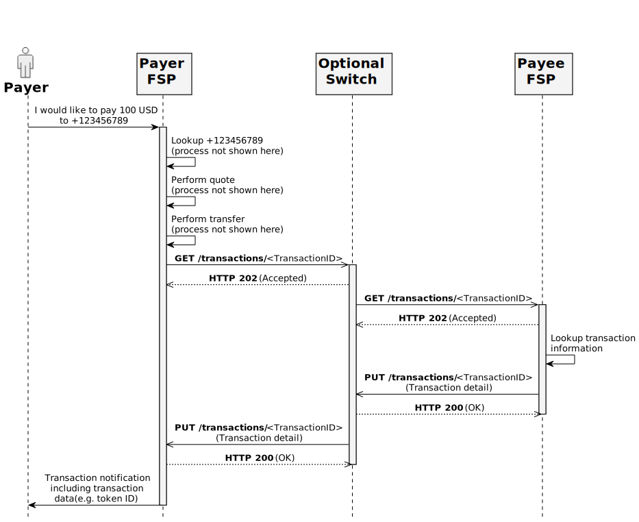


**Figure 57 -- Example transaction process**

#### Requests

This section describes the services that can be requested by a client on the resource **/transactions**.

##### GET /transactions/_{ID}_

Alternative URI: N/A

Logical API service: [Retrieve Transaction Information](../generic-transaction-patterns#retrieve-transaction-information)

The HTTP request **GET /transactions/**_{ID}_ is used to get transaction information regarding a previously-created financial transaction. The _{ID}_ in the URI should contain the **transactionId** that was used for the creation of the quote (see [Table 23](#table-23)), as the transaction is created as part of another process (the transfer process, see [API Resource Transfers](#api-resource-transfers)).

Callback and data model information for **GET /transactions/**_{ID}_:

- Callback -- [**PUT /transactions/**_{ID}_](#put-transactionsid)
- Error Callback -- [**PUT /transactions/**_{ID}_**/error**](#put-transactionsiderror)
- Data Model -- Empty body

#### Callbacks

This section describes the callbacks that are used by the server under the resource **/transactions**.

#####  PUT /transactions/_{ID}_

Alternative URI: N/A

Logical API service: [Return Transaction Information](../generic-transaction-patterns#return-transaction-information)

The callback **PUT /transactions/**_{ID}_ is used to inform the client of a requested transaction. The _{ID}_ in the URI should contain the _{ID}_ that was used in the [**GET /transactions/**_{ID}_](#get-transactionsid). See [Table 35](#table-35) for data model.

###### Table 35

| **Name** | **Cardinality** | **Type** | **Description** |
| --- | --- | --- | --- |
| **completedTimestamp** | 0..1 | DateTime | Time and date when the transaction was completed. |
| **transactionState** | 1 | TransactionState | State of the transaction. |
| **code** | 0..1 | Code | Optional redemption information provided to Payer after transaction has been completed. |
| **extensionList** | 0..1 | ExtensionList | Optional extension, specific to deployment. |

**Table 35 -- PUT /transactions/_{ID}_ data model**

#### Error Callbacks

This section describes the error callbacks that are used by the server under the resource **/transactions**.

##### PUT /transactions/_{ID}_/error

Alternative URI: N/A

Logical API service: [Return Transaction Information Error](../generic-transaction-patterns#retrieve-transaction-information-error)

If the server is unable to find or create a transaction, or another processing error occurs, the error callback **PUT** **/transactions/**_{ID}_**/error** is used. The _{ID}_ in the URI should contain the _{ID}_ that was used in the [**GET /transactions/**_{ID}_](#get-transactionsid). See [Table 36](#table-36) for data model.

###### Table 36

| **Name** | **Cardinality** | **Type** | **Description** |
| --- | --- | --- | --- |
| **errorInformation** | 1 | ErrorInformation | Error code, category description. |

**Table 36 -- PUT /transactions/_{ID}_/error data model**

#### States

###### Figure 58

The possible states of a transaction can be seen in [Figure 58](#figure-58).

**Note:** For reconciliation purposes, a server must keep transaction objects that have been rejected in its database for a scheme-agreed time period. This means that a client should expect a proper callback about a transaction (if it has been received by the server) when requesting information regarding the same.


**Figure 58 -- Possible states of a transaction**

<br />

### API Resource /bulkQuotes

This section defines the logical API resource **Bulk Quotes**, described in [Generic Transaction Patterns](../generic-transaction-patterns#api-resource-bulk-quotes).

The services provided by the API resource **/bulkQuotes** service are used for requesting the creation of a bulk quote; that is, a quote for more than one financial transaction. For more information regarding a single quote for a transaction, see API Resource [/quotes](#api-resource-quotes).

A created bulk quote object contains a quote for each individual transaction in the bulk in a Peer FSP. A bulk quote is irrevocable; it cannot be changed after it has been created However, it can expire (all bulk quotes are valid only until they reach expiration).

**Note:** A bulk quote is not a guarantee that the financial transaction will succeed. The bulk transaction can still fail later in the process. A bulk quote only guarantees that the fees and FSP commission involved in performing the specified financial transaction are applicable until the bulk quote expires.

#### Resource Version History

Table 37 contains a description of each different version of the **/bulkQuotes** resource.

| Version | Date | Description|
| ---- | ---- | ---- |
| **1.0** | 2018-03-13 | Initial version |
| **1.1** | 2020-05-19 | The data model is updated to add an optional ExtensioinList element to the PartyIdInfo complex type based on the Change Request: https://github.com/mojaloop/mojaloop-specification/issues/30. Following this, the data model as specified in Table 93 has been updated.|

**Table 37 –- Version history for resource /bulkQuotes**

#### Service Details

[Figure 59](#figure-59) shows how the bulk quotes process works, using the **POST /bulkQuotes** service. When receiving the bulk of transactions from the Payer, the Payer FSP should:

1. Lookup the FSP in which each Payee is; for example, using the API Resource [/participants](#api-resource-participants).

2. Divide the bulk based on Payee FSP. The service **POST /bulkQuotes** is then used for each Payee FSP to get the bulk quotes from each Payee FSP. Each quote result will contain the ILP Packet and condition (see [ILP Packet](#ilp-packet) and [Conditional Transfers](#conditional-transfers)) needed to perform each transfer in the bulk transfer (see API Resource [/bulkTransfers](#api-resource-bulktransfers)), which will perform the actual financial transaction from the Payer to each Payee.

###### Figure 59

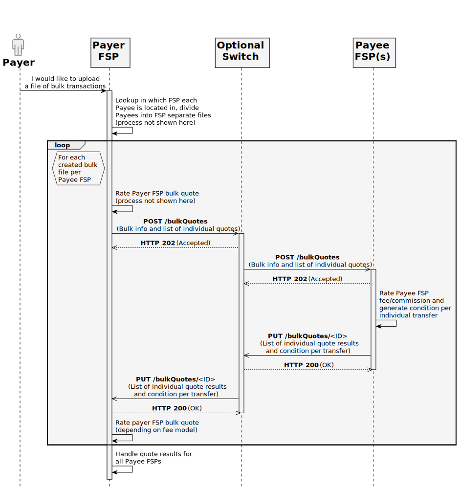


**Figure 59 -- Example bulk quote process**

#### Requests

This section describes the services that can be requested by a client in the API on the resource **/bulkQuotes**.

##### GET /bulkQuotes/_{ID}_

Alternative URI: N/A

Logical API service: [Retrieve Bulk Quote Information](../generic-transaction-patterns#retrieve-bulk-quote-information)

The HTTP request **GET /bulkQuotes/**_{ID}_ is used to get information regarding a previously-created or requested bulk quote.

The _{ID}_ in the URI should contain the **bulkQuoteId** (see [Table 38](#table-38)) that was used for the creation of the bulk quote.

Callback and data model information for **GET /bulkQuotes/**_{ID}_:

- Callback -- [PUT /bulkQuotes/**_{ID}_](#put-bulkquotesid)
- Error Callback -- [PUT /bulkQuotes/**_{ID}_**/error**](#put-bulkquotesiderror)
- Data Model -- Empty body

##### POST /bulkQuotes

Alternative URI: N/A

Logical API service: **Calculate Bulk Quote**

The HTTP request **POST /bulkQuotes** is used to request the creation of a bulk quote for the provided financial transactions on the server.

Callback and data model information for **POST /bulkQuotes**:

- Callback -- [**PUT /bulkQuotes/**_{ID}_](#6941-put-bulkquotesid)
- Error Callback -- [**PUT /bulkQuotes/**_{ID}_**/error**](#6951-put-bulkquotesiderror)
- Data Model -- See [Table 38](#table-38)

###### Table 38

| **Name** | **Cardinality** | **Type** | **Description** |
| --- | --- | --- | --- |
| **bulkQuoteId** | 1 | CorrelationId | Common ID between the FSPs for the bulk quote object, decided by the Payer FSP. The ID should be reused for resends of the same bulk quote. A new ID should be generated for each new bulk quote. |
| **payer** | 1 | Party | Information about the Payer in the proposed financial transaction. |
| **geoCode** | 0..1 | GeoCode | Longitude and Latitude of the initiating Party. Can be used to detect fraud. |
| **expiration** | 0..1 | DateTime | Expiration is optional to let the Payee FSP know when a quote no longer needs to be returned. |
| **individualQuotes** | 1..1000 | IndividualQuote | List of quotes elements. |
| **extensionList** | 0..1 | ExtensionList | Optional extension, specific to deployment. |

**Table 38 -- POST /bulkQuotes data model**

#### Callbacks

This section describes the callbacks that are used by the server under the resource **/bulkQuotes**.

##### PUT /bulkQuotes/_{ID}_

Alternative URI: N/A

Logical API service: [Return Bulk Quote Information](../generic-transaction-patterns#return-bulk-quote-information)

The callback **PUT /bulkQuotes/**_{ID}_ is used to inform the client of a requested or created bulk quote. The _{ID}_ in the URI should contain the **bulkQuoteId** (see [Table 38](#table-38)) that was used for the creation of the bulk quote, or the _{ID}_ that was used in the [**GET /bulkQuotes/**_{ID}_](#6931-get-bulkquotesid). See [Table 39](#table-39) for data model.

###### Table 39

| **Name** | **Cardinality** | **Type** | **Description** |
| --- | --- | --- | --- |
| **individualQuoteResults** | 0..1000 | IndividualQuoteResult | Fees for each individual transaction, if any of them are charged per transaction. |
| **expiration** | 1 |  DateTime | Date and time until when the quotation is valid and can be honored when used in the subsequent transaction request. |
| **extensionList** | 0..1 | ExtensionList | Optional extension, specific to deployment. |

**Table 39 -- PUT /bulkQuotes/_{ID}_ data model**

#### Error Callbacks

This section describes the error callbacks that are used by the server under the resource **/bulkQuotes**.

##### PUT /bulkQuotes/_{ID}_/error

Alternative URI: N/A

Logical API service: [Retrieve Bulk Quote Information Error](../generic-transaction-patterns#retrieve-bulk-quote-information-error)

If the server is unable to find or create a bulk quote, or another processing error occurs, the error callback **PUT** **/bulkQuotes/**_{ID}_**/error** is used. The _{ID}_ in the URI should contain the **bulkQuoteId** (see [Table 38](#table-38)) that was used for the creation of the bulk quote, or the _{ID}_ that was used in the [**GET /bulkQuotes/**_{ID}_](#6931-get-bulkquotesid). See [Table 40](#table-40) for data model.

###### Table 40

| **Name** | **Cardinality** | **Type** | **Description** |
| --- | --- | --- | --- |
| **errorInformation** | 1 | ErrorInformation | Error code, category description. |

**Table 40 -- PUT /bulkQuotes/_{ID}_/error data model**

#### States

###### Figure 60

The possible states of a bulk quote can be seen in [Figure 60](#figure-60).

**Note:** A server does not need to keep bulk quote objects that have been either rejected or expired in their database. This means that a client should expect that an error callback could be received for a rejected or expired bulk quote.


**Figure 60 -- Possible states of a bulk quote**

<br />

### API Resource /bulkTransfers

This section defines the logical API resource **Bulk Transfers**, described in [Generic Transaction Patterns](../generic-transaction-patterns#api-resource-bulk-transfers).

The services provided by the API resource **/bulkTransfers** are used for requesting the creation of a bulk transfer or for retrieving information about a previously-requested bulk transfer. For more information about a single transfer, see API Resource [/transfers](#api-resource-transfers). Before a bulk transfer can be requested, a bulk quote needs to be performed. See API Resource [/bulkQuotes](#api-resource-bulkquotes), for more information.

A bulk transfer is irrevocable; it cannot be changed, cancelled, or reversed after it has been sent from the Payer FSP.

#### Resource Version History

Table 41 contains a description of each different version of the **/bulkTransfers** resource.

| Version | Date | Description|
| ---- | ---- | ---- |
| **1.0** | 2018-03-13 | Initial version |
| **1.1** | 2020-05-19 | The data model is updated to add an optional ExtensioinList element to the PartyIdInfo complex type based on the Change Request: https://github.com/mojaloop/mojaloop-specification/issues/30. Following this, the data model as specified in Table 93 has been updated.|

**Table 41 –- Version history for resource /bulkTransfers**

#### Service Details

[Figure 61](#figure-61) shows how the bulk transfer process works, using the **POST /bulkTransfers** service. When receiving the bulk transactions from the Payer, the Payer FSP should perform the following:

1. Lookup the FSP in which each Payee is; for example, using the API Resource **/participants**, [Section 6.2](#62-api-resource-participants).
2. Perform the bulk quote process using the API Resource **/bulkQuotes**, [Section 6.9](#69-api-resource-bulkquotes). The bulk quote callback should contain the required ILP Packets and conditions needed to perform each transfer.
3. Perform bulk transfer process in [Figure 61](#figure-61) using **POST /bulkTransfers**. This performs each hop-to-hop transfer and the end-to-end financial transaction. For more information regarding hop-to-hop transfers vs end-to-end financial transactions, see [Section 6.7](#67-api-resource-transfers).

###### Figure 61

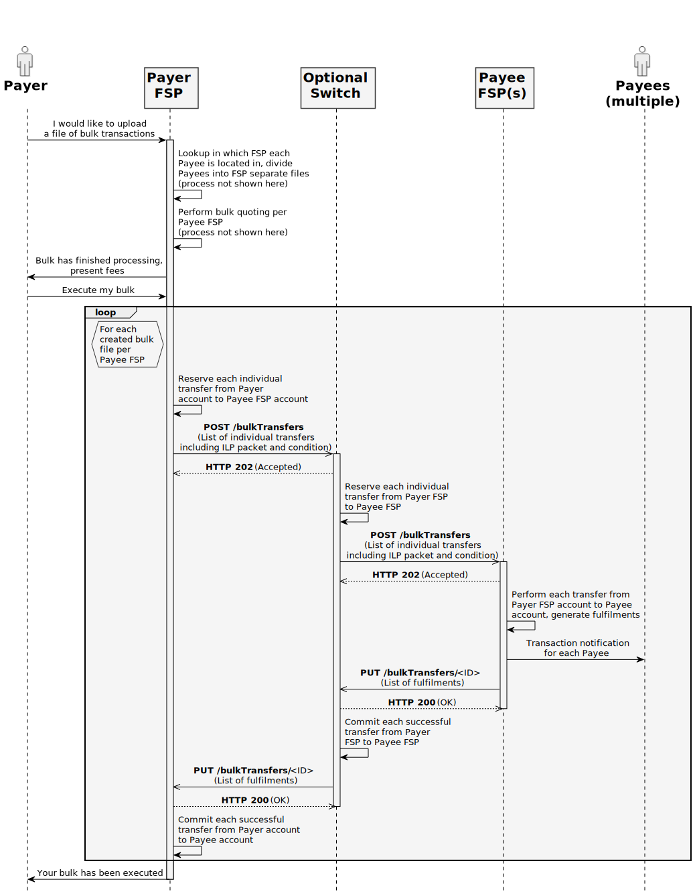


**Figure 61 -- Example bulk transfer process**

#### Requests

This section describes the services that can a client can request on the resource **/bulkTransfers**.

##### GET /bulkTransfers/_{ID}_

Alternative URI: N/A

Logical API service: [Retrieve Bulk Transfer Information](../generic-transaction-patterns#retrieve-bulk-transfer-information)

The HTTP request **GET /bulkTransfers/**_{ID}_ is used to get information regarding a previously-created or requested bulk transfer. The _{ID}_ in the URI should contain the **bulkTransferId** (see [Table 42](#table-42)) that was used for the creation of the bulk transfer.

Callback and data model information for **GET /bulkTransfers/**_{ID}_:

- Callback -- [PUT /bulkTransfers/_{ID}_](#put-bulktransfersid)
- Error Callback -- [PUT /bulkTransfers/_{ID}_/error](#put-bulktransfersiderror)
- Data Model -- Empty body

##### POST /bulkTransfers

Alternative URI: N/A

Logical API service: [Perform Bulk Transfer](../generic-transaction-patterns#perform-bulk-transfer)

The HTTP request **POST /bulkTransfers** is used to request the creation of a bulk transfer on the server.

- Callback - [PUT /bulkTransfers/_{ID}_](#put-bulktransfersid)
- Error Callback - [PUT /bulkTransfers/_{ID}_/error](#put-bulktransfersiderror)
- Data Model -- See [Table 42](#table-42)

###### Table 42

| **Name** | **Cardinality** | **Type** | **Description** |
| --- | --- | --- | --- |
| **bulkTransferId** | 1 | CorrelationId | Common ID between the FSPs and the optional Switch for the bulk transfer object, decided by the Payer FSP. The ID should be reused for resends of the same bulk transfer. A new ID should be generated for each new bulk transfer. |
| **bulkQuoteId** | 1 | CorrelationId | ID of the related bulk quote |
| **payeeFsp** | 1 | FspId | Payee FSP identifier. |
| **payerFsp** | 1 | FspId | Payer FSP identifier. |
| **individualTransfers** | 1..1000 | IndividualTransfer | List of IndividualTransfer elements. |
| **expiration** | 1 | DateTime | Expiration time of the transfers. |
| **extensionList** | 0..1 | ExtensionList | Optional extension, specific to deployment. |

**Table 42 -- POST /bulkTransfers data model**

#### Callbacks

This section describes the callbacks that are used by the server under the resource **/bulkTransfers**.

##### PUT /bulkTransfers/_{ID}_

Alternative URI: N/A

Logical API service: [Retrieve Bulk Transfer Information](../generic-transaction-patterns#retrieve-bulk-transfer-information)

The callback **PUT /bulkTransfers/**_{ID}_ is used to inform the client of a requested or created bulk transfer. The _{ID}_ in the URI should contain the **bulkTransferId** (see [Table 42](#table-42)) that was used for the creation of the bulk transfer ([POST /bulkTransfers](#post-bulktransfers)), or the _{ID}_ that was used in the [GET /bulkTransfers/_{ID}_](#get-bulktransfersid). See [Table 43](#table-43) for data model.

###### Table 43

| **Name** | **Cardinality** | **Type** | **Description** |
| --- | --- | --- | --- |
| **completedTimestamp** | 0..1 | DateTime | Time and date when the bulk transaction was completed. |
| **individualTransferResults** | 0..1000 | **Error! Reference source not found.** | List of **Error! Reference source not found.** elements. |
| **bulkTransferState** | 1 | BulkTransferState | The state of the bulk transfer. |
| **extensionList** | 0..1 | ExtensionList | Optional extension, specific to deployment. |

**Table 43 -- PUT /bulkTransfers/_{ID}_ data model**

#### Error Callbacks

This section describes the error callbacks that are used by the server under the resource **/bulkTransfers**.

##### PUT /bulkTransfers/_{ID}_/error

Alternative URI: N/A

Logical API service: [Retrieve Bulk Transfer Information Eerror](../generic-transaction-patterns#retrieve-bulk-transfer-information-error)

If the server is unable to find or create a bulk transfer, or another processing error occurs, the error callback **PUT** **/bulkTransfers/**_{ID}_**/error** is used. The _{ID}_ in the URI should contain the **bulkTransferId** (see [Table 42](#table-42)) that was used for the creation of the bulk transfer ([POST /bulkTransfers](#post-bulktransfers)), or the _{ID}_ that was used in the [GET /bulkTransfers/_{ID}_](#get-bulktransfersid). See [Table 44](#table-44) for data model.

###### Table 44

| **Name** | **Cardinality** | **Type** | **Description** |
| --- | --- | --- | --- |
| **errorInformation** | 1 | ErrorInformation | Error code, category description. |

**Table 44 -- PUT /bulkTransfers/_{ID}_/error data model**

#### States

###### Figure 62

The possible states of a bulk transfer can be seen in [Figure 62](#figure-62).

**Note:** A server must keep bulk transfer objects that have been rejected in their database during a market agreed time-period for reconciliation purposes. This means that a client should expect a proper callback about a bulk transfer (if it has been received by the server) when requesting information regarding the same.


**Figure 62 -- Possible states of a bulk transfer**

<br />

## API Supporting Data Models

This section provides information about additional supporting data models used by the API.

### Format Introduction

This section introduces formats used for element data types used by the API.

All element data types have both a minimum and maximum length. These lengths are indicated by one of the following:

- A minimum and maximum length
- An exact length
- A regular expression limiting the element such that only a specific length or lengths can be used.

#### Minimum and Maximum Length

If a minimum and maximum length is used, this will be indicated after the data type in parentheses: First the minimum value (inclusive value), followed by two period characters (..), and then the maximum value (inclusive value).

Examples:

- `String(1..32)` – A String that is minimum one character and maximum 32 characters long.
- `Integer(3..10)` - An Integerr that is minimum 3 digits, but maximum 10 digits long.

#### Exact Length

If an exact length is used, this will be indicated after the data type in parentheses containing only one exact value. Other lengths are not allowed.

Examples:

- `String(3)` – A String that is exactly three characters long.
- `Integer(4)` – An Integer that is exactly four digits long.

#### Regular Expressions

Some element data types are restricted using regular expressions. The regular expressions in this document use the standard for syntax and character classes established by the programming language Perl<sup>[30](https://perldoc.perl.org/perlre.html#Regular-Expressions)</sup>.

### Element Data Type Formats

This section defines element data types used by the API.


#### String

The API data type `String` is a normal JSON String<sup>[31](https://tools.ietf.org/html/rfc7159#section-7)</sup>, limited by a minimum and maximum number of characters.

##### Example Format I

`String(1..32)` – A String that is minimum *1* character and maximum *32* characters long.

An example of `String(1..32)` appears below:

- _This String is 28 characters_

##### Example Format II

`String(1..128)` – A String that is minimum *1* character and maximum *128* characters long.

An example of `String(32..128)` appears below:

- _This String is longer than 32 characters, but less than 128_

<br />

#### Enum

The API data type `Enum` is a restricted list of allowed JSON [String](#string)) values; an enumeration of values. Other values than the ones defined in the list are not allowed.

##### Example Format

`Enum of String(1..32)` – A String that is minimum one character and maximum 32 characters long and restricted by the allowed list of values. The description of the element contains a link to the enumeration.

<br />

#### UndefinedEnum

The API data type **UndefinedEnum** is a JSON String consisting of 1 to 32 uppercase characters including an underscore character (**\_**).

##### Regular Expression

The regular expression for restricting the **UndefinedEnum** type appears in [Listing 13](#listing-13).

###### Listing 13

```
^[A-Z_]{1,32}$
```

**Listing 13 -- Regular expression for data type UndefinedEnum**

<br />

#### Name

The API data type `Name` is a JSON String, restricted by a regular expression to avoid characters which are generally not used in a name.

##### Regular Expression

The regular expression for restricting the `Name` type appears in [Listing 14](#listing-14) below. The restriction does not allow a string consisting of whitespace only, all Unicode32 characters are allowed, as well as the period (**.**), apostrophe (**'**), dash (**-**), comma (**,**) and space characters ( ). The maximum number of characters in the **Name** is 128.

**Note:** In some programming languages, Unicode support needs to be specifically enabled. As an example, if Java is used the flag `UNICODE_CHARACTER_CLASS` needs to be enabled to allow Unicode characters.

###### Listing 14

```
^(?!\s*$)[\w .,'-]{1,128}$
```

**Listing 14 -- Regular expression for data type Name**

<br />

#### Integer

The API data type `Integer` is a JSON String consisting of digits only. Negative numbers and leading zeroes are not allowed. The data type is always limited by a number of digits.

##### 7.2.5.1 Regular Expression

The regular expression for restricting an `Integer` appears in [Listing 15](#listing-15).

###### Listing 15

```
^[1-9]\d*$
```

**Listing 15 -- Regular expression for data type Integer**


##### Example Format

`Integer(1..6)` – An `Integer` that is at minimum one digit long, maximum six digits.

An example of `Integer(1..6)` appears below:

- _123456_

<br />

#### OtpValue

The API data type `OtpValue` is a JSON String of three to 10 characters, consisting of digits only. Negative numbers are not allowed. One or more leading zeros are allowed.

##### Regular Expression

The regular expression for restricting the `OtpValue` type appears in [Listing 16](#listing-16).

###### Listing 16

```
^\d{3,10}$
```

**Listing 16 -- Regular expression for data type OtpValue**

<br />

#### BopCode

The API data type `BopCode` is a JSON String of three characters, consisting of digits only. Negative numbers are not allowed. A leading zero is not allowed.

##### Regular Expression

The regular expression for restricting the `BopCode` type appears in [Listing 17](#listing-17).

###### Listing 17

```
^[1-9]\d{2}$
```

**Listing 17 -- Regular expression for data type BopCode**

<br />

#### ErrorCode

The API data type `ErrorCode` is a JSON String of four characters, consisting of digits only. Negative numbers are not allowed. A leading zero is not allowed.

##### Regular Expression

The regular expression for restricting the `ErrorCode` type appears in [Listing 18](#listing-18).

###### Listing 18

```
^[1-9]\d{3}$
```

**Listing 18 -- Regular expression for data type ErrorCode**

<br />

#### TokenCode

The API data type `TokenCode` is a JSON String between four and 32 characters. It can consist of either digits, uppercase characters from **A** to **Z**, lowercase characters from **a** to **z**, or a combination of the three.

##### 7.2.9.1 Regular Expression

The regular expression for restricting the `TokenCode` appears in [Listing 19](#listing-19).

###### Listing 19

```
^[0-9a-zA-Z]{4,32}$
```

**Listing 19 -- Regular expression for data type TokenCode**

<br />

#### MerchantClassificationCode

The API data type `MerchantClassificationCode` is a JSON String consisting of one to four digits.

##### 7.2.10.1 Regular Expression

The regular expression for restricting the `MerchantClassificationCode` type appears in [Listing 20](#listing-20).

###### Listing 20

```
^[\d]{1,4}$
```

**Listing 20 -- Regular expression for data type MerchantClassificationCode**

<br />

#### Latitude

The API data type `Latitude` is a JSON String in a lexical format that is restricted by a regular expression for interoperability reasons.

##### 7.2.11.1 Regular Expression

The regular expression for restricting the `Latitude` type appears in [Listing 21](#listing-21).

###### Listing 21

```
^(\+|-)?(?:90(?:(?:\.0{1,6})?)|(?:[0-9]|[1-8][0-9])(?:(?:\.[0-9]{1,6})?))$
```

**Listing 21 -- Regular expression for data type Latitude**

<br />

#### Longitude

The API data type `Longitude` is a JSON String in a lexical format that is restricted by a regular expression for interoperability reasons.

##### 7.2.12.1 Regular Expression

The regular expression for restricting the `Longitude` type appears in [Listing 22](#listing-22).

###### Listing 22

```
^(\+|-)?(?:180(?:(?:\.0{1,6})?)|(?:[0-9]|[1-9][0-9]|1[0-7][0-9])(?:(?:\.[0-9]{1,6})?))$
```

**Listing 22 -- Regular expression for data type Longitude**

<br />

#### Amount

The API data type `Amount` is a JSON String in a canonical format that is restricted by a regular expression for interoperability reasons.

##### Regular Expression

The regular expression for restricting the `Amount` type appears in [Listing 23](#listing-23). This pattern does not allow any trailing zeroes at all, but allows an amount without a minor currency unit. It also only allows four digits in the minor currency unit; a negative value is not allowed. Using more than 18 digits in the major currency unit is not allowed.

###### Listing 23

```
^([0]|([1-9][0-9]{0,17}))([.][0-9]{0,3}[1-9])?$
```

**Listing 23 -- Regular expression for data type Amount**

##### Example Values

See [Table 45](#table-45) for validation results for some example **Amount** values using the [regular expression](#regular-expression-6).

###### Table 45

| **Value** | **Validation result** |
| --- | --- |
| **5** | Accepted |
| **5.0** | Rejected |
| **5.** | Rejected |
| **5.00** | Rejected |
| **5.5** | Accepted |
| **5.50** | Rejected |
| **5.5555** | Accepted |
| **5.55555** | Rejected |
| **555555555555555555** | Accepted |
| **5555555555555555555** | Rejected |
| **-5.5** | Rejected  |
| **0.5** | Accepted |
| **.5** | Rejected |
| **00.5** | Rejected |
| **0** | Accepted |

**Table 45 -- Example results for different values for Amount type**

<br />

#### DateTime

The API data type `DateTime` is a JSON String in a lexical format that is restricted by a regular expression for interoperability reasons.

##### 7.2.14.1 Regular Expression

The regular expression for restricting the `DateTime` type appears in [Listing 24](#listing-24). The format is according to ISO 860133, expressed in a combined date, time and time zone format. A more readable version of the format is

_yyyy_**-**_MM_**-**_dd_**T**_HH_**:**_mm_**:**_ss_**.**_SSS_[**-**_HH_**:**_MM_]

###### Listing 24

```
^(?:[1-9]\d{3}-(?:(?:0[1-9]|1[0-2])-(?:0[1-9]|1\d|2[0-8])|(?:0[13-9]|1[0-2])-(?:29|30)|(?:0[13578]|1[02])-31)|(?:[1-9]\d(?:0[48]|[2468][048]|[13579][26])|(?:[2468\][048]|[13579][26])00)-02-29)T(?:[01]\d|2[0-3]):[0-5]\d:[0-5]\d(?:(\.\d{3}))(?:Z|[+-][01]\d:[0-5]\d)$
```

**Listing 24 -- Regular expression for data type DateTime**

##### Examples

Two examples of the `DateTime` type appear below:

**2016-05-24T08:38:08.699-04:00**

**2016-05-24T08:38:08.699Z** (where **Z** indicates Zulu time zone, which is the same as UTC).

<br />

#### Date

The API data type `Date` is a JSON String in a lexical format that is restricted by a regular expression for interoperability reasons.

##### Regular Expression

The regular expression for restricting the **Date** type appears in [Listing 25](#listing-25). This format, as specified in ISO 8601, contains a date only. A more readable version of the format is _yyyy_**-**_MM_**-**_dd_.

###### Listing 25

```
^(?:[1-9]\d{3}-(?:(?:0[1-9]|1[0-2])-(?:0[1-9]|1\d|2[0-8])|(?:0[13-9]|1[0-2])-(?:29|30)|(?:0[13578]|1[02])-31)|(?:[1-9]\d(?:0[48]|[2468][048]|[13579][26])|(?:[2468][048]|[13579][26])00)-02-29)$
```

**Listing 25 -- Regular expression for data type Date**

##### Examples

Two examples of the `Date` type appear below:

- _1982-05-23_

- _1987-08-05_

<br />

#### UUID

The API data type `UUID` (Universally Unique Identifier) is a JSON String in canonical format, conforming to RFC 412234, that is restricted by a regular expression for interoperability reasons. A UUID is always 36 characters long, 32 hexadecimal symbols and four dashes ('**-**').

##### 7.2.16.1 Regular Expression

The regular expression for restricting the `UUID` type appears in [Listing 26](#listing-26).

###### Listing 26

```
^[0-9a-f]{8}-[0-9a-f]{4}-[1-5][0-9a-f]{3}-[89ab][0-9a-f]{3}-[0-9a-f]{12}$
```

**Listing 26 -- Regular expression for data type UUID**

##### Example

An example of a `UUID` type appears below:

- _a8323bc6-c228-4df2-ae82-e5a997baf898_

<br />

#### BinaryString

The API data type `BinaryString` is a JSON String. The string is a base64url35 encoding of a string of raw bytes, where a padding (character '**=**') is added at the end of the data if needed to ensure that the string is a multiple of four characters. The length restriction indicates the allowed number of characters.

##### Regular Expression

The regular expression for restricting the `BinaryString` type appears in [Listing 27](#listing-27).

###### Listing 27

```
^[A-Za-z0-9-_]+[=]{0,2}$
```

**Listing 27 -- Regular expression for data type BinaryString**

##### Example Format

`BinaryString(32)` –32 bytes of data base64url encoded.

An example of a `BinaryString(32..256)` appears below. Note that a padding character, `'='` has been added to ensure that the string is a multiple of four characters.

- _QmlsbCAmIE1lbGluZGEgR2F0ZXMgRm91bmRhdGlvbiE=_

<br />

#### BinaryString32

The API data type `BinaryString32` is a fixed size version of the API data type `BinaryString` defined [here](#binarystring), where the raw underlying data is always of 32 bytes. The data type **BinaryString32** should not use a padding character as the size of the underlying data is fixed.

##### Regular Expression

The regular expression for restricting the `BinaryString32` type appears in [Listing 28](#listing-28).

###### Listing 28

```
^[A-Za-z0-9-_]{43}$
```

**Listing 28 -- Regular expression for data type BinaryString32**

##### Example Format
`BinaryString(32)` – 32 bytes of data base64url encoded.

An example of a `BinaryString32` appears below. Note that this is the same binary data as the example shown in the [Example Format](#example-format-4) of the `BinaryString` type, but due to the underlying data being fixed size, the padding character `'='` is excluded.

```
QmlsbCAmIE1lbGluZGEgR2F0ZXMgRm91bmRhdGlvbiE
```

<br />

### Element Definitions

This section defines elements types used by the API.

#### AmountType element

[Table 46](#table-46) below contains the data model for the element `AmountType`.

###### Table 46

| Name | Cardinality | Type | Description |
| --- | --- | --- | --- |
| **AmountType** | 1 | [Enum](#enum) of [String(1..32)](#string) | This element contains the amount type. See [AmountType](#amounttype-enum) enumeration for more information on allowed values. |

**Table 46 – Element AmountType**

<br />

#### AuthenticationType element

[Table 47](#table-47) below contains the data model for the element `AuthenticationType`.

###### Table 47

| Name | Cardinality | Type | Description |
| --- | --- | --- | --- |
| **Authentication** | 1 | [Enum](#enum) of [String(1..32)](#string) | This element contains the authentication type. See [AuthenticationType](#authenticationtype-enum) enumeration for possible enumeration values. |

**Table 47 – Element AuthenticationType**

<br />

#### AuthenticationValue element

[Table 48](#table-48) below contains the data model for the element `AuthenticationValue`.

###### Table 48

| Name | Cardinality | Type | Description |
| --- | --- | --- | --- |
| **AuthenticationValue** | 1 | Depends on [AuthenticationType](#authenticationtype-element). <br><br> If `OTP`: type is [Integer(1..6)](#integer). For example:**123456**<br><br>OtpValue</br>If `QRCODE`: type is [String(1..64)](#string) | This element contains the authentication value. The format depends on the authentication type used in the [AuthenticationInfo](#authenticationinfo) complex type. |

**Table 48 – Element AuthenticationValue**

<br />

#### AuthorizationResponse element

[Table 49](#table-49) below contains the data model for the element `AuthorizationResponse`.

###### Table 49

| Name | Cardinality | Type | Description |
| --- | --- | --- | --- |
| **AuthorizationResponse** | 1 | [Enum](#enum) of [String(1..32)](#string) | This element contains the authorization response. See [AuthorizationResponse](#authorizationresponse-enum) enumeration for possible enumeration values. |

**Table 49 – Element AuthorizationResponse**

<br />

#### BalanceOfPayments element

[Table 50](#table-50) below contains the data model for the element `BalanceOfPayment`.

###### Table 50

| Name | Cardinality | Type | Description |
| --- | --- | --- | --- |
| **BalanceOfPayments** | 1 | [BopCode](#bopcode) | The possible values and meaning are defined in [https://www.imf.org/external/np/sta/bopcode/](https://www.imf.org/external/np/sta/bopcode/) |

**Table 50 – Element BalanceOfPayments**

<br />

#### BulkTransferState element

[Table 51](#table-51)  below contains the data model for the element `BulkTransferState`.

###### Table 51

| Name | Cardinality | Type | Description |
| --- | --- | --- | --- |
| **BulkTransferState** | 1 | [Enum](#enum) of [String(1..32)](#string) | See [BulkTransferState](#bulktransferstate-enum) enumeration for information on allowed values|

**Table 51 – Element BulkTransferState**

<br />

#### Code element

[Table 52](#table-52) below contains the data model for the element `Code`.

###### Table 52

| Name | Cardinality | Type | Description |
| --- | --- | --- | --- |
| **Code** | 1 | [TokenCode](#tokencode) | Any code/token returned by the Payee FSP. |

**Table 52 – Element Code**

<br />

#### CorrelationId element

[Table 53](#table-53) below contains the data model for the element `CorrelationId`.

###### Table 53

| Name | Cardinality | Type | Description |
| --- | --- | --- | --- |
| **CorrelationId** | 1 |[UUID](#uuid) | Identifier that correlates all messages of the same sequence. |


**Table 53 – Element CorrelationId**

<br />

#### Currency element

[Table 54](#table-54) below contains the data model for the element `Currency`.

###### Table 54

| Name | Cardinality | Type | Description |
| --- | --- | --- | --- |
| **Currency** | 1 | [Enum](#enum) of [String(3)](#string) | See [Currency](#currencycode-enum) enumeration for information on allowed values |

**Table 54 – Element Currency**

<br />

#### DateOfBirth element

[Table 55](#table-55) below contains the data model for the element `DateOfBirth`.

###### Table 55

| Name | Cardinality | Type | Description |
| --- | --- | --- | --- |
| **DateOfBirth** | 1 | Examples<p>Two examples of the [DateTime](#datetime) type appear below:</p><p><b>2016-05-24T08:38:08.699-04:00</b></p><p><b>2016-05-24T08:38:08.699Z</b> (where <b>Z</b> indicates Zulu time zone, which is the same as UTC).</p> <p>Date</p> | Date of Birth of the Party.|

**Table 55 – Element DateOfBirth**

<br />

#### ErrorCode element

[Table 56](#table-56) below contains the data model for the element `ErrorCode`.

###### Table 56

| Name | Cardinality | Type | Description |
| --- | --- | --- | --- |
| **ErrorCode** | 1 | [ErrorCode](#errorcode) | Four digit error code, see section on [Error Codes](#error-codes) for more information. |

**Table 56 – Element ErrorCode**

<br />

#### ErrorDescription element

[Table 57](#table-57] below contains the data model for the element `ErrorDescription`.

###### Table 57


| Name | Cardinality | Type | Description |
| --- | --- | --- | --- |
| **ErrorDescription** | 1 | [String(1..128)](#string) | Error description string. |

**Table 57 – Element ErrorDescription**

<br />

#### ExtensionKey element

[Table 58](#table-58) below contains the data model for the element `ExtensionKey`.

###### Table 58


| Name | Cardinality | Type | Description |
| --- | --- | --- | --- |
| **ExtensionKey** | 1 | [String(1..32)](#string) | The extension key. |

**Table 58 – Element ExtensionKey**

<br />

#### ExtensionValue element

[Table 59](#table-59) below contains the data model for the element `ExtensionValue`.

###### Table 59

| Name | Cardinality | Type | Description |
| --- | --- | --- | --- |
| **ExtensionValue** | 1 | [String(1..128)](#string) | The extension value. |

**Table 59 – Element ExtensionValue**

<br />

#### FirstName element
[Table 60](#table-60) below contains the data model for the element `FirstName`.

###### Table 60

| Name | Cardinality | Type | Description |
| --- | --- | --- | --- |
| **FirstName** | 1 | [Name](#name) | First name of the Party |

**Table 60 – Element FirstName**

<br />

#### FspId element

[Table 61](#table-61) below contains the data model for the element `FspId`.

###### Table 61

| Name | Cardinality | Type | Description |
| --- | --- | --- | --- |
| **FspId** | 1 | [String(1..32)](#string)| The FSP identifier. |

**Table 61 – Element FspId**

<br />

#### IlpCondition element

[Table 62](#table-62) below contains the data model for the element `IlpCondition`.

###### Table 62

| Name | Cardinality | Type | Description |
| --- | --- | --- | --- |
| **IlpCondition** | 1 | [BinaryString32](#binarystring32) | The condition that must be attached to the transfer by the Payer. |

**Table 62 – Element IlpCondition**

<br />

####  IlpFulfilment element

[Table 63](#table-63) below contains the data model for the element `IlpFulfilment`.

###### Table 63

| Name | Cardinality | Type | Description |
| --- | --- | --- | --- |
| **IlpFulfilment** | 1 | [BinaryString32](#binarystring32) | The fulfilment that must be attached to the transfer by the Payee. |

**Table 63 – Element IlpFulfilment**

<br />

#### IlpPacket element

[Table 64](#table-64) below cntains the data model for the element `IlpPacket`.

###### Table 64

| Name | Cardinality | Type | Description |
| --- | --- | --- | --- |
| **IlpPacket** | 1 | Example<p>An example of a [UUID](#uuid) type appears below:</p> <p><b>a8323bc6-c228-4df2-ae82-e5a997baf898</b></p><p>[BinaryString(1..32768)](#binarystring)</p> | Information for recipient (transport layer information). |

**Table 64 – Element IlpPacket**

<br />

#### LastName element

[Table 65](#table-65) below contains the data model for the element `LastName`.

###### Table 65

| Name | Cardinality | Type | Description |
| --- | --- | --- | --- |
| **LastName** | 1 | [Name](#name) | Last name of the Party (ISO 20022 definition). |

**Table 65 – Element LastName**

<br />

#### MerchantClassificationCode element

[Table 66](#table-66) below contains the data model for the element `MerchantClassificationCode`.

###### Table 66

| Name | Cardinality | Type | Description |
| --- | --- | --- | --- |
| **MerchantClassificationCode** | 1 | [MerchantClassificationCode](#merchantclassificationcode) | A limited set of pre-defined numbers. This list would be a limited set of numbers identifying a set of popular merchant types like School Fees, Pubs and Restaurants, Groceries, and so on. |

**Table 66 – Element MerchantClassificationCode**

<br />

#### MiddleName element

[Table 67](#table-67) below contains the data model for the element `MiddleName`.

###### Table 67


| Name | Cardinality | Type | Description |
| --- | --- | --- | --- |
| **MiddleName** | 1 | [Name](#name) | Middle name of the Party (ISO 20022 definition). |

**Table 67 – Element MiddleName**

<br />

#### Note element

[Table 68](#table-68) below contains the data model for the element `Note`.

###### Table 68

| Name | Cardinality | Type | Description |
| --- | --- | --- | --- |
| **Note** | 1 | [String(1..128)](#string) | Memo assigned to transaction. |

**Table 68 – Element Note**

<br />


#### PartyIdentifier element

[Table 69](#table-69) below contains the data model for the element `PartyIdentifier`.

###### Table 69

| Name | Cardinality | Type | Description |
| --- | --- | --- | --- |
| **PartyIdentifier** | 1 | [String(1..128)](#string) | Identifier of the Party.|

**Table 69 – Element PartyIdentifier**

<br />

#### PartyIdType element

[Table 70](#table-70) below contains the data model for the element `PartyIdType`.

###### Table 70

| Name | Cardinality | Type | Description |
| --- | --- | --- | --- |
| **PartyIdType** | 1 | Enum of [String(1..32)](#string) | See [PartyIdType](#partyidtype-enum) enumeration for more information on allowed values. |

**Table 70 – Element PartyIdType**

<br />

#### PartyName element

[Table 71](#table-71) below contains the data model for the element `PartyName`.

###### Table 71

| Name | Cardinality | Type | Description |
| --- | --- | --- | --- |
| **PartyName** | 1 | `Name` | Name of the Party. Could be a real name or a nickname. |

**Table 71 – Element PartyName**

<br />

#### PartySubIdOrType element

[Table 72](#table-72) below contains the data model for the element `PartySubIdOrType`.

###### Table 72

| Name | Cardinality | Type | Description |
| --- | --- | --- | --- |
| **PartySubIdOrType** | 1 | [String(1..128)](#string) | Either a sub-identifier of a [PartyIdentifier](#partyidentifier-element), or a sub-type of the [PartyIdType](#partyidtype-element), normally a `PersonalIdentifierType`. |

**Table 72 – Element PartySubIdOrType**

<br />

#### RefundReason element

[Table 73](#table-73) below contains the data model for the element `RefundReason`.

###### Table 73

| Name | Cardinality | Type | Description |
| --- | --- | --- | --- |
| **RefundReason** | 1 | [String(1..128)](#string) | Reason for the refund. |

**Table 73 – Element RefundReason**

<br />

#### TransactionInitiator element

[Table 74](#table-74) below contains the data model for the element `TransactionInitiator`.

###### Table 74

| Name | Cardinality | Type | Description |
| --- | --- | --- | --- |
| **TransactionInitiator** | 1 | [Enum](#enum) of [String(1..32)](#string) | See [TransactionInitiator](#transactioninitiator-enum) enumeration for more information on allowed values. |

**Table 74 – Element TransactionInitiator**

<br />

#### TransactionInitiatorType element

[Table 75](#table-75) below contains the data model for the element `TransactionInitiatorType`.

###### Table 75

| Name | Cardinality | Type | Description |
| --- | --- | --- | --- |
| **TransactionInitiatorType** | 1 | [Enum](#enum) of [String(1..32)](#string) | See [TransactionInitiatorType](#transactioninitiatortype-enum) enumeration for more information on allowed values. |

**Table 75 – Element TransactionInitiatorType**

<br />

#### TransactionRequestState element

[Table 76](#table-76) below contains the data model for the element `TransactionRequestState`.

###### Table 76

| Name | Cardinality | Type | Description |
| --- | --- | --- | --- |
| **TransactionRequestState** | 1 | [Enum](#enum) of [String(1..32)](#string) | See [TransactionRequestState](#transactionrequeststate-enum) enumeration for more information on allowed values. |


**Table 76 – Element TransactionRequestState**

<br />

#### TransactionScenario element

[Table 77](#table-77) below contains the data model for the element `TransactionScenario`.

###### Table 77

| Name | Cardinality | Type | Description |
| --- | --- | --- | --- |
| **TransactionScenario** | 1 | [Enum](#enum) of [String(1..32)](#string) | See [TransactionScenario](#transactionscenario-enum) enumeration for more information on allowed values. |

**Table 77 – Element TransactionScenario**

<br />

#### TransactionState element

[Table 78](#table-78) below contains the data model for the element `TransactionState`.

###### Table 78

|Name | Cardinality | Type | Description |
| --- | --- | --- | --- |
| **TransactionState** | 1 | [Enum](#enum) of [String(1..32)](#string) | See [TransactionState](#transactionstate-enum) enumeration for more information on allowed values. |

**Table 78 – Element TransactionState**

<br />


#### TransactionSubScenario element

[Table 79](#table-79) below contains the data model for the element `TransactionSubScenario`.

###### Table 79

| Name | Cardinality | Type | Description |
| --- | --- | --- | --- |
| **TransactionSubScenario** | 1 | [UndefinedEnum](#undefinedenum) | Possible sub-scenario, defined locally within the scheme.|

**Table 79 – Element TransactionSubScenario**

<br />

#### TransferState element

[Table 80](#table-80) below contains the data model for the element `TransferState`.

###### Table 80

|Name | Cardinality | Type | Description |
| --- | --- | --- | --- |
| **TransactionState** | 1 | [Enum](#enum) of [String(1..32)](#string) | See [TransferState](#transferstate-enum) enumeration for more information on allowed values. |

**Table 80 – Element TransferState**


<br />


### Complex Types

This section describes complex types used by the API.

#### AuthenticationInfo

[Table 81](#table-81) contains the data model for the complex type `AuthenticationInfo`.

###### Table 81

| **Name** | **Cardinality** | **Format** | **Description** |
| --- | --- | --- | --- |
| **authentication** | 1 | `AuthenticationType` | Type of authentication. | 
| **authenticationValue** | 1 | `AuthenticationValue` | Authentication value. | 

**Table 81 -- Complex type AuthenticationInfo**

<br >

#### ErrorInformation

[Table 82](#table-82) contains the data model for the complex type `ErrorInformation`.

###### Table 82

| **Name** | **Cardinality** | **Format** | **Description** |
| --- | --- | --- | --- |
| **errorCode** | 1 | `Errorcode` | Specific error number. |
| **errorDescription** | 1 | `ErrorDescription` | Error description string. |
| **extensionList** | 1 | `ExtensionList` | Optional list of extensions, specific to deployment. |

**Table 82 -- Complex type ErrorInformation**

<br />

####  Extension

[Table 83](#table-83) contains the data model for the complex type `Extension`.

###### Table 83

| **Name** | **Cardinality** | **Format** | **Description** |
| --- | --- | --- | --- |
| **key** | 1 | `ExtensionKey` | Extension key. |
| **value** | 1 | `ExtensionValue` | Extension value. |

**Table 83 -- Complex type Extension**

<br />

#### ExtensionList

[Table 84](#table-84) contains the data model for the complex type `ExtensionList`.

###### Table 84

| **Name** | **Cardinality** | **Format** | **Description** |
| --- | --- | --- | --- |
| **extension** | 1..16 | `Extension` | Number of Extension elements. |

**Table 84 -- Complex type ExtensionList**

<br />

#### IndividualQuote

[Table 85](#table-85) contains the data model for the complex type `IndividualQuote`.

###### Table 85

| **Name** | **Cardinality** | **Format** | **Description** |
| --- | --- | --- | --- |
| **quoteId** | 1 | `CorrelationId` | Identifies quote message. |
| **transactionId** | 1 | `CorrelationId` | Identifies transaction message. |
| **payee** | 1 | `Party` | Information about the Payee in the proposed financial transaction. |
| **amountType** | 1 | `AmountType` | **SEND** for sendAmount, **RECEIVE** for receiveAmount. |
| **amount** | 1 | `Money` | Depending on **amountType**: <br>If **SEND**: The amount the Payer would like to send; that is, the amount that should be withdrawn from the Payer account including any fees. The amount is updated by each participating entity in the transaction.<br>If **RECEIVE**: The amount the Payee should receive; that is, the amount that should be sent to the receiver exclusive any fees. The amount is not updated by any of the participating entities. |
| **fees** | 0..1 | `Money` | Fees in the transaction.<ul><li>The fees element should be empty if fees should be non-disclosed.</li><li>The fees element should be non-empty if fees should be disclosed.</li></ul>
| **transactionType** | 1 | `TransactionType` | Type of transaction that the quote is requested for. |
| **note** | 0..1 | Note | Memo that will be attached to the transaction.|
| **extensionList** | 0..1 | `ExtensionList` | Optional extension, specific to deployment. |

**Table 85 -- Complex type IndividualQuote**

<br />

#### IndividualQuoteResult

[Table 86](#table-86) contains the data model for the complex type `IndividualQuoteResult`.

###### Table 86

| **Name** | **Cardinality** | **Format** | **Description** |
| --- | --- | --- | --- |
| **quoteId** | 1 | `CorrelationId` | Identifies the quote message. |
| **payee** | 0..1 | `Party` | Information about the Payee in the proposed financial transaction. |
| **transferAmount** | 0..1 | `Money` | The amount of Money that the Payer FSP should transfer to the Payee FSP. |
| **payeeReceiveAmount** | 0..1 | `Money` | Amount that the Payee should receive in the end-to-end transaction. Optional as the Payee FSP might not want to disclose any optional Payee fees. |
| **payeeFspFee** | 0..1 | `Money` | Payee FSP’s part of the transaction fee. |
| **payeeFspCommission** | 0..1 | `Money` | Transaction commission from the Payee FSP. |
| **ilpPacket** | 0..1 | `IlpPacket` | ILP Packet that must be attached to the transfer by the Payer. |
| **condition** | 0..1 | `IlpCondition` | Condition that must be attached to the transfer by the Payer. |
| **errorInformation** | 0..1 | `ErrorInformation` | Error code, category description. <br>**Note: payee, transferAmount, payeeReceiveAmount, payeeFspFee, payeeFspCommission, ilpPacket,** and **condition** should not be set if **errorInformation** is set.</br>
| **extensionList** | 0..1 | `ExtensionList` | Optional extension, specific to deployment |

**Table 86 -- Complex type IndividualQuoteResult**

<br />

#### IndividualTransfer

[Table 87](#table-87) contains the data model for the complex type `IndividualTransfer`.

###### Table 87

| **Name** | **Cardinality** | **Format** | **Description** |
| --- | --- | --- | --- |
| **transferId** | 1 | `CorrelationId` | Identifies messages related to the same **/transfers** sequence. |
| **transferAmount** | 1 | `Money` | Transaction amount to be sent. |
| **ilpPacket** | 1 | `IlpPacket` | ILP Packet containing the amount delivered to the Payee and the ILP Address of the Payee and any other end-to-end data. |
| **condition** | 1 | `IlpCondition` | Condition that must be fulfilled to commit the transfer. |
| **extensionList** | 0..1 | `ExtensionList` | Optional extension, specific to deployment. |

**Table 87 -- Complex type IndividualTransfer**

<br />

#### IndividualTransferResult

[Table 88](#table-88) contains the data model for the complex type `IndividualTransferResult`.

###### Table 88

| **Name** | **Cardinality** | **Format** | **Description** |
| --- | --- | --- | --- |
| **transferId** | 1 | `CorrelationId` | Identifies messages related to the same /transfers sequence. |
| **fulfilment** | 0..1 | `IlpFulfilment` | Fulfilment of the condition specified with the transaction.<br>**Note:** Either **fulfilment** or **errorInformation** should be set, not both. |
| **errorInformation** | 0..1 | `ErrorInformation` | If transfer is REJECTED, error information may be provided. <br>**Note:** Either **fulfilment** or **errorInformation** should be set, not both.|
| **extensionList** | 0..1 | `ExtensionList` | Optional extension, specific to deployment.|

**Table 88 -- Complex type IndividualTransferResult**

<br />

#### GeoCode

[Table 89](#table-89) contains the data model for the complex type `GeoCode`.

###### Table 89

| **Name** | **Cardinality** | **Format** | **Description** |
| --- | --- | --- | --- |
| **latitude** | 1 | `Latitude` | Latitude of the Party. |
| **longitude** | 1 | `Longitude` | Longitude of the Party. |

**Table 89 -- Complex type GeoCode**

<br />

#### Money

[Table 90](#table-90) contains the data model for the complex type `Money`.

###### Table 90

| **Name** | **Cardinality** | **Format** | **Description** |
| --- | --- | --- | --- |
| **currency** | 1 | `Currency` | Currency of the amount. |
| **amount** | 1 | `Amount` | Amount of money. |

**Table 90 -- Complex type Money**

<br />

#### Party

[Table 91](#table-91) contains the data model for the complex type `Party`.

###### Table 91

| **Name** | **Cardinality** | **Format** | **Description** |
| --- | --- | --- | --- |
| **partyIdInfo** | 1 | `PartyIdInfo` | Party Id type, id, sub ID or type, and FSP Id. |
| **merchantClassificationCode** | 0..1 | `MerchantClassificationCode` | Used in the context of Payee Information, where the Payee happens to be a merchant accepting merchant payments. |
| **name** | 0..1 | `PartyName` | Display name of the Party, could be a real name or a nick name. |
| **personalInfo** | 0..1 | `PartyPersonalInfo` | Personal information used to verify identity of Party such as first, middle, last name and date of birth. |

**Table 91 -- Complex type Party**

<br />

#### PartyComplexName

[Table 92](#table-92) contains the data model for the complex type `PartyComplexName`.

###### Table 92

| **Name** | **Cardinality** | **Format** | **Description** |
| --- | --- | --- | --- |
| **firstName** | 0..1 | `FirstName` | Party's first name. |
| **middleName** | 0..1 | `MiddleName` | Party's middle name. |
| **lastName** | 0..1 | `LastName` | Party's last name. |

**Table 92 -- Complex type PartyComplexName**

<br />

#### PartyIdInfo

[Table 93](#table-93) contains the data model for the complex type `PartyIdInfo`.

###### Table 93

| **Name** | **Cardinality** | **Format** | **Description** |
| --- | --- | --- | --- |
| **partyIdType** | 1 | `PartyIdType` | Type of the identifier. |
| **partyIdentifier** | 1 | `PartyIdentifier` | An identifier for the Party. |
| **partySubIdOrType** | 0..1 | `PartySubIdOrType` | A sub-identifier or sub-type for the Party. |
| **fspId** | 0..1 | `FspId` | FSP ID (if know) |
| **extensionList** | 0..1 | `ExtensionList` | Optional extension, specific to deployment. |

**Table 93 -- Complex type PartyIdInfo**

<br />

#### PartyPersonalInfo

[Table 94](#table-94) contains the data model for the complex type `PartyPersonalInfo`.

###### Table 94

| **Name** | **Cardinality** | **Format** | **Description** |
| --- | --- | --- | --- |
| **complexName** | 0..1 | `PartyComplexName` | First, middle and last name for the Party. |
| **dateOfBirth** | 0..1 | `DateOfBirth` | Date of birth for the Party. |

**Table 94 -- Complex type PartyPersonalInfo**

<br />

#### PartyResult

[Table 95](#table-95) contains the data model for the complex type `PartyResult`.

###### Table 95

| **Name** | **Cardinality** | **Format** | **Description** |
| --- | --- | --- | --- |
| **partyId** | 1 | `PartyIdInfo` | Party Id type, id, sub ID or type, and FSP Id. |
| **errorInformation** | 0..1 | `ErrorInformation` | If the Party failed to be added, error information should be provided. Otherwise, this parameter should be empty to indicate success. |

**Table 95 -- Complex type PartyResult**

<br />

#### Refund

[Table 96](#table-96) contains the data model for the complex type `Refund`.

###### Table 96

| **Name** | **Cardinality** | **Format** | **Description** |
| --- | --- | --- | --- |
| **originalTransactionId** | 1 | `CorrelationId` | Reference to the original transaction ID that is requested to be refunded. |
| **refundReason** | 0..1 | `RefundReason` | Free text indicating the reason for the refund. |

**Table 96 -- Complex type Refund**

<br />

#### Transaction

[Table 97](#table-97) contains the data model for the complex type Transaction. The Transaction type is used to carry end-to-end data between the Payer FSP and the Payee FSP in the ILP Packet, see [IlpPacket](#ilp-packet). Both the **transactionId** and the **quoteId** in the data model is decided by the Payer FSP in the [POST /quotes](#post-quotes), see [Table 23](#table-23).

###### Table 97

| **Name** | **Cardinality** | **Format** | **Description** |
| --- | --- | --- | --- |
| **transactionId** | 1 | `CorrelationId` | ID of the transaction, the ID is decided by the Payer FSP during the creation of the quote. |
| **quoteId** | 1 | `CorrelationId` | ID of the quote, the ID is decided by the Payer FSP during the creation of the quote. |
| **payee** | 1 | `Party` | Information about the Payee in the proposed financial transaction. |
| **payer** | 1 | `Party` | Information about the Payer in the proposed financial transaction. |
| **amount** | 1 | `Money` | Transaction amount to be sent. |
| **transactionType** | 1 | `TransactionType` | Type of the transaction. |
| **note** | 0..1 | `Note` | Memo associated to the transaction, intended to the Payee. |
| **extensionList** | 0..1 | `ExtensionList` | Optional extension, specific to deployment. |

**Table 97 -- Complex type Transaction**

<br />

#### TransactionType

[Table 98](#table-98) contains the data model for the complex type `TransactionType`.

###### Table 98

| **Name** | **Cardinality** | **Format** | **Description** |
| --- | --- | --- | --- |
| **scenario** | 1 | `TransactionScenario` | Deposit, withdrawal, refund, ... |
| **subScenario** | 0..1 | `TransactionSubScenario` | Possible sub-scenario, defined locally within the scheme. |
| **initiator** | 1 | `TransactionInitiator` | Who is initiating the transaction: Payer or Payee |
| **initiatorType** | 1 | `TransactionInitiatorType` | Consumer, agent, business, ... |
| **refundInfo** | 0..1 | `Refund` | Extra information specific to a refund scenario. Should only be populated if scenario is REFUND. |
| **balanceOfPayments** | 0..1 | `BalanceOfPayments` | Balance of Payments code. |

**Table 98 -- Complex type TransactionType**

<br />

### Enumerations

This section contains the enumerations that are used by the API.

#### AmountType enum

[Table 99](#table-99) contains the allowed values for the enumeration `AmountType`.

###### Table 99

| **Name** | **Description** |
| --- | --- |
| **SEND** | Amount the Payer would like to send; that is, the amount that should be withdrawn from the Payer account including any fees. |
| **RECEIVE** | Amount the Payer would like the Payee to receive; that is, the amount that should be sent to the receiver exclusive fees. |

**Table 99 -- Enumeration AmountType**

<br />

#### AuthenticationType enum

[Table 100](#table-100) contains the allowed values for the enumeration `AuthenticationType`.

###### Table 100

| **Name** | **Description** |
| --- | --- |
| **OTP** | One-time password generated by the Payer FSP. |
| **QRCODE** | QR code used as One Time Password. |

**Table 100 -- Enumeration AuthenticationType**

<br />

#### AuthorizationResponse enum

[Table 101](#table-101) contains the allowed values for the enumeration `AuthorizationResponse`.

###### Table 101

| **Name** | **Description** |
| --- | --- |
| **ENTERED** | Consumer entered the authentication value. |
| **REJECTED** | Consumer rejected the transaction. |
| **RESEND** | Consumer requested to resend the authentication value. |

**Table 101 -- Enumeration AuthorizationResponse**

<br />

#### BulkTransferState enum

[Table 102](#table-102) contains the allowed values for the enumeration `BulkTransferState`.

###### Table 102

| **Name** | **Description** |
| --- | --- |
| **RECEIVED** | Payee FSP has received the bulk transfer from the Payer FSP. |
| **PENDING** | Payee FSP has validated the bulk transfer. |
| **ACCEPTED** | Payee FSP has accepted the bulk transfer for processing. |
| **PROCESSING** | Payee FSP has started to transfer fund to the Payees. |
| **COMPLETED** | Payee FSP has completed transfer of funds to the Payees. |
| **REJECTED** | Payee FSP has rejected processing the bulk transfer. |

**Table 102 -- Enumeration BulkTransferState**

<br />

#### CurrencyCode enum

The currency codes defined in ISO 421736 as three-letter alphabetic codes are used as the standard naming representation for currencies. The currency codes from ISO 4217 are not shown in this document, implementers are instead encouraged to use the information provided by the ISO 4217 standard directly.

<br />

#### PartyIdType enum

[Table 103](#Table-103) contains the allowed values for the enumeration `PartyIdType`.

###### Table 103

| **Name** | **Description** |
| --- | --- |
| **MSISDN** | An MSISDN (Mobile Station International Subscriber Directory Number; that is, a phone number) is used in reference to a Party. The MSISDN identifier should be in international format according to the ITU-T E.164<sup>37</sup> standard. Optionally, the MSISDN may be prefixed by a single plus sign, indicating the international prefix. |
| **EMAIL** | An email is used in reference to a Party. The format of the email should be according to the informational RFC 3696<sup>38</sup>. |
| **PERSONAL_ID** | A personal identifier is used in reference to a participant. Examples of personal identification are passport number, birth certificate number, and national registration number. The identifier number is added in the [PartyIdentifier](#partyidentifier-element) element. The personal identifier type is added in the [PartySubIdOrType](#partysubidortype-element) element. |
| **BUSINESS** | A specific Business (for example, an organization or a company) is used in reference to a participant. The BUSINESS identifier can be in any format. To make a transaction connected to a specific username or bill number in a Business, the [PartySubIdOrType](#partysubidortype-element) element should be used. |
| **DEVICE** | A specific device (for example, POS or ATM) ID connected to a specific business or organization is used in reference to a Party. For referencing a specific device under a specific business or organization, use the [PartySubIdOrType](#partysubidortype-element) element. |
| **ACCOUNT_ID** | A bank account number or FSP account ID should be used in reference to a participant. The ACCOUNT_ID identifier can be in any format, as formats can greatly differ depending on country and FSP.
| **IBAN** | A bank account number or FSP account ID is used in reference to a participant. The IBAN identifier can consist of up to 34 alphanumeric characters and should be entered without whitespace. |
| **ALIAS** | An alias is used in reference to a participant. The alias should be created in the FSP as an alternative reference to an account owner. Another example of an alias is a username in the FSP system. The ALIAS identifier can be in any format. It is also possible to use the [PartySubIdOrType](#partysubidortype-element) element for identifying an account under an Alias defined by the [PartyIdentifier](#partyidentifier-element). |

**Table 103 -- Enumeration PartyIdType**

<br />

#### PersonalIdentifierType enum

[Table 104](#table-104) contains the allowed values for the enumeration `PersonalIdentifierType`.

###### Table 104

| **Name** | **Description** |
| --- | --- |
| **PASSPORT** | A passport number is used in reference to a Party. |
| **NATIONAL_REGISTRATION** | A national registration number is used in reference to a Party. |
| **DRIVING_LICENSE** | A driving license is used in reference to a Party. |
| **ALIEN_REGISTRATION** | An alien registration number is used in reference to a Party. |
| **NATIONAL_ID_CARD** | A national ID card number is used in reference to a Party. |
| **EMPLOYER_ID** | A tax identification number is used in reference to a Party. |
| **TAX_ID_NUMBER** | A tax identification number is used in reference to a Party. |
| **SENIOR_CITIZENS_CARD** | A senior citizens card number is used in reference to a Party. |
| **MARRIAGE_CERTIFICATE** | A marriage certificate number is used in reference to a Party. |
| **HEALTH_CARD** | A health card number is used in reference to a Party. |
| **VOTERS_ID** | A voter’s identification number is used in reference to a Party. |
| **UNITED_NATIONS** | An UN (United Nations) number is used in reference to a Party. |
| **OTHER_ID** | Any other type of identification type number is used in reference to a Party. |

**Table 104 -- Enumeration PersonalIdentifierType**

<br />

#### TransactionInitiator

[Table 105](#table-105) describes valid values for the enumeration `TransactionInitiator`.

###### Table 105

| **Name** | **Description** |
| --- | --- |
| **PAYER** | Sender of funds is initiating the transaction. The account to send from is either owned by the Payer or is connected to the Payer in some way. |
| **PAYEE** | Recipient of the funds is initiating the transaction by sending a transaction request. The Payer must approve the transaction, either automatically by a pre-generated OTP or by pre-approval of the Payee, or manually by approving on their own Device. |

**Table 105 -- Enumeration TransactionInitiator**

<br />

#### TransactionInitiatorType

[Table 106](#table-106) contains the allowed values for the enumeration `TransactionInitiatorType`.

###### Table 106

| **Name** | **Description** |
| --- | --- |
| **CONSUMER ** | Consumer is the initiator of the transaction. |
| **AGENT** | Agent is the initiator of the transaction. |
| **BUSINESS** | Business is the initiator of the transaction. |
| **DEVICE** | Device is the initiator of the transaction. |

**Table 106 -- Enumeration TransactionInitiatorType**

<br />

#### TransactionRequestState

[Table 107](#table-107) contains the allowed values for the enumeration `TransactionRequestState`.

###### Table 107

| **Name** | **Description** |
| --- | --- |
| **RECEIVED** | Payer FSP has received the transaction from the Payee FSP. |
| **PENDING** | Payer FSP has sent the transaction request to the Payer. |
| **ACCEPTED** | Payer has approved the transaction. |
| **REJECTED** | Payer has rejected the transaction. |

**Table 107 -- Enumeration TransactionRequestState**

<br />

#### TransactionScenario

[Table 108](#table-108) contains the allowed values for the enumeration `TransactionScenario`.

###### Table 108

| **Name** | **Description** |
| --- | --- |
| **DEPOSIT** | Used for performing a Cash-In (deposit) transaction. In a normal scenario, electronic funds are transferred from a Business account to a Consumer account, and physical cash is given from the Consumer to the Business User. |
| **WITHDRAWAL** | Used for performing a Cash-Out (withdrawal) transaction. In a normal scenario, electronic funds are transferred from a Consumer’s account to a Business account, and physical cash is given from the Business User to the Consumer. |
| **TRANSFER** | Used for performing a P2P (Peer to Peer, or Consumer to Consumer) transaction. |
| **PAYMENT** | Usually used for performing a transaction from a Consumer to a Merchant or Organization, but could also be for a B2B (Business to Business) payment. The transaction could be online for a purchase in an Internet store, in a physical store where both the Consumer and Business User are present, a bill payment, a donation, and so on. |
| **REFUND** | Used for performing a refund of transaction. |

**Table 108 -- Enumeration TransactionScenario**

<br />

#### TransactionState

[Table 109](#table-109) contains the allowed values for the enumeration `TransactionState`.

###### Table 109

| **Name** | **Description** |
| --- | --- |
| **RECEIVED** | Payee FSP has received the transaction from the Payer FSP. |
| **PENDING** | Payee FSP has validated the transaction. |
| **COMPLETED** | Payee FSP has successfully performed the transaction. |
| **REJECTED** | Payee FSP has failed to perform the transaction. |

**Table 109 -- Enumeration TransactionState**

<br />

#### TransferState

[Table 110](#table-110) contains the allowed values for the enumeration `TransferState`.

###### Table 110

| **Name** | **Description** |
| --- | --- |
| **RECEIVED** | Next ledger has received the transfer. |
| **RESERVED** | Next ledger has reserved the transfer. |
| **COMMITTED** | Next ledger has successfully performed the transfer. |
| **ABORTED** | Next ledger has aborted the transfer due a rejection or failure to perform the transfer. |

**Table 110 -- Enumeration TransferState**

<br />

### Error Codes

###### Figure 63

Each error code in the API is a four-digit number, for example, **1234**, where the first number (**1** in the example) represents the high-level error category, the second number (**2** in the example) represents the low-level error category, and the last two numbers (**34** in the example) represents the specific error. [Figure 63](#figure-63) shows the structure of an error code. The following sections contain information about defined error codes for each high-level error category.


**Figure 63 -- Error code structure**

Each defined high- and low-level category combination contains a generic error (_x_**0**_xx_), which can be used if there is no specific error, or if the server would not like to return information which is considered private.

All specific errors below _xx_**40**; that is, _xx_**00** to _xx_**39**, are reserved for future use by the API. All specific errors above and including _xx_**40** can be used for scheme-specific errors. If a client receives an unknown scheme-specific error, the unknown scheme-specific error should be interpreted as a generic error for the high- and low-level category combination instead (_xx_**00**).

#### Communication Errors -- 1_xxx_

All possible communication or network errors that could arise that cannot be represented by an HTTP status code should use the high-level error code **1** (error codes **1**_xxx_). Because all services in the API are asynchronous, these error codes should generally be used by a Switch in the Callback to the client FSP if the Peer FSP cannot be reached, or when a callback is not received from the Peer FSP within an agreed timeout.

Low level categories defined under Communication Errors:

- **Generic Communication Error** -- **10**_xx_

See [Table 111](#table-111) for all communication errors defined in the API.

###### Table 111

| **Error Code** | **Name** | **Description** | /participants | /parties | /transactionRequests | /quotes  | /authorizations |  /transfers | /transactions | /bulkQuotes | /bulkTransfers |
| --- | --- | --- | --- | --- | --- | --- | --- | --- | --- | --- | --- |
| **1000** | Communication error | Generic communication error. | X | X | X | X | X | X | X | X | X |
| **1001** | Destination communication error | Destination of the request failed to be reached. This usually indicates that a Peer FSP failed to respond from an intermediate entity. | X | X | X | X | X | X | X | X | X |

**Table 111 -- Communication errors -- 1_xxx_**

#### Server Errors -- 2_xxx_

All possible errors occurring on the server in which it failed to fulfil an apparently valid request from the client should use the high-level error code **2** (error codes **2**_xxx_). These error codes should indicate that the server is aware that it has encountered an error or is otherwise incapable of performing the requested service.

Low-level categories defined under server errors:

- **Generic server error** -- **20**_xx_

See [Table 112](#Table-112) for server errors defined in the API.

###### Table 112

| **Error Code** | **Name** | **Description** | /participants | /parties | /transactionRequests | /quotes  | /authorizations |  /transfers | /transactions | /bulkQuotes | /bulkTransfers |
| --- | --- | --- | --- | --- | --- | --- | --- | --- | --- | --- | --- |
| **2000** | Generic server error | Generic server error to be used in order not to disclose information that may be considered private. | X | X | X | X | X | X | X | X | X |
| **2001** | Internal server error | Generic unexpected exception. This usually indicates a bug or unhandled error case. | X | X | X | X | X | X | X | X | X |
| **2002** | Not implemented | Service requested is not supported by the server. | X | X | X | X | X | X | X | X | X |
| **2003** | Service currently unavailable | Service requested is currently unavailable on the server. This could be because maintenance is taking place, or because of a temporary failure. | X | X | X | X | X | X | X | X | X |
| **2004** | Server timed out | Timeout has occurred, meaning the next Party in the chain did not send a callback in time. This could be because a timeout is set too low or because something took longer than expected. | X | X | X | X | X | X | X | X | X |
| **2005** | Server busy | Server is rejecting requests due to overloading. Try again later. | X | X | X | X | X | X | X | X | X |

**Table 112 -- Server errors -- 2_xxx_**

#### Client Errors -- 3_xxx_

All possible errors occurring on the server in which the server reports that the client has sent one or more erroneous parameters should use the high-level error code **3** (error codes **3**_xxx_). These error codes should indicate that the server could not perform the service according to the request from the client. The server should provide an explanation why the service could not be performed.

Low level categories defined under client Errors:

- **Generic Client Error** -- **30**_xx_

  - See [Table 113](#table-113) for generic client errors defined in the API.

- **Validation Error** -- **31**_xx_

  - See [Table 114](#table-114) the validation errors defined in the API.

- **Identifier Error** -- **32**_xx_

  - See [Table 115](#table-115) for identifier errors defined in the API.

- **Expired Error** -- **33**_xx_

  - See [Table 116](#table-116) for expired errors defined in the API.

###### Table 113

| **Error Code** | **Name** | **Description** | /participants | /parties | /transactionRequests | /quotes  | /authorizations |  /transfers | /transactions | /bulkQuotes | /bulkTransfers |
| --- | --- | --- | --- | --- | --- | --- | --- | --- | --- | --- | --- |
| **3000** | Generic client error | Generic client error, used in order not to disclose information that may be considered private. | X | X | X | X | X | X | X | X | X |
| **3001** | Unacceptable version requested | Client requested to use a protocol version which is not supported by the server. | X | X | X | X | X | X | X | X | X |
| **3002** | Unknown URI | Provided URI was unknown to the server. | X | X | X | X | X | X | X | X | X |
| **3003** | Add Party information error | Error occurred while adding or updating information regarding a Party. | X | X | X | X | X | X | X | X | X |

**Table 113 -- Generic client errors -- 30_xx_**

###### Table 114

| **Error Code** | **Name** | **Description** | /participants | /parties | /transactionRequests | /quotes  | /authorizations |  /transfers | /transactions | /bulkQuotes | /bulkTransfers |
| --- | --- | --- | --- | --- | --- | --- | --- | --- | --- | --- | --- |
| **3100** | Generic validation error | Generic validation error to be used in order not to disclose information that may be considered private. | X | X | X | X | X | X | X | X | X |
| **3101** | Malformed syntax | Format of the parameter is not valid. For example, amount set to **5.ABC**. The error description field should specify which information element is erroneous. | X | X | X | X | X | X | X | X | X |
| **3102** | Missing mandatory element | Mandatory element in the data model was missing. | X | X | X | X | X | X | X | X | X |
| **3103** | Too many elements | Number of elements of an array exceeds the maximum number allowed. | X | X | X | X | X | X | X | X | X |
| **3104** | Too large payload | Size of the payload exceeds the maximum size. | X | X | X | X | X | X | X | X | X |
| **3105** | Invalid signature | Some parameters have changed in the message, making the signature invalid. This may indicate that the message may have been modified maliciously. | X | X | X | X | X | X | X | X | X |
| **3106** | Modified request | Request with the same ID has previously been processed in which the parameters are not the same. ||| X | X | X | X | X | X | X |
| **3107** | Missing mandatory extension parameter | Scheme-mandatory extension parameter was missing. ||| X | X | X | X | X | X | X |

**Table 114 -- Validation errors -- 31_xx_**

###### Table 115

| **Error Code** | **Name** | **Description** | /participants | /parties | /transactionRequests | /quotes  | /authorizations |  /transfers | /transactions | /bulkQuotes | /bulkTransfers |
| --- | --- | --- | --- | --- | --- | --- | --- | --- | --- | --- | --- |
| **3200** | Generic ID not found | Generic ID error provided by the client. | X | X | X | X | X | X | X | X | X |
| **3201** | Destination FSP Error | Destination FSP does not exist or cannot be found. | X | X | X | X | X | X | X | X | X |
| **3202** | Payer FSP ID not found |Provided Payer FSP ID not found. |||||| X ||| X |
| **3203** | Payee FSP ID not found |Provided Payee FSP ID not found. |||||| X ||| X |
| **3204** | Party not found |Party with the provided identifier, identifier type, and optional sub id or type was not found. | X | X | X | X ||||||
| **3205** | Quote ID not found |Provided Quote ID was not found on the server. |||| X || X ||||
| **3206** | Transaction request ID not found |Provided Transaction Request ID was not found on the server. ||| X ||| X ||||
| **3207** | Transaction ID not found |Provided Transaction ID was not found on the server. ||||||| X |||
| **3208** | Transfer ID not found |Provided Transfer ID was not found on the server. |||||| X ||||
| **3209** | Bulk quote ID not found |Provided Bulk Quote ID was not found on the server. |||||||| X | X |
| **3210** | Bulk transfer ID not found |Provided Bulk Transfer ID was not found on the server. ||||||||| X |

**Table 115 -- Identifier errors -- 32_xx_**

###### Table 116

| **Error Code** | **Name** | **Description** | /participants | /parties | /transactionRequests | /quotes  | /authorizations |  /transfers | /transactions | /bulkQuotes | /bulkTransfers |
| --- | --- | --- | --- | --- | --- | --- | --- | --- | --- | --- | --- |
| **3300** | Generic expired error | Generic expired object error, to be used in order not to disclose information that may be considered private. | X | X | X | X | X | X | X | X | X |
| **3301** | Transaction request expired | Client requested to use a transaction request that has already expired. |||| X ||||||
| **3302** | Quote expired | Client requested to use a quote that has already expired. ||||| X | X ||| X |
| **3303** | Transfer expired | Client requested to use a transfer that has already expired. | X | X | X | X | X | X | X | X | X |

**Table 116 -- Expired errors -- 33_xx_**

#### Payer Errors -- 4_xxx_

All errors occurring on the server for which the Payer or the Payer FSP is the cause of the error should use the high-level error code **4** (error codes **4**_xxx_). These error codes indicate that there was no error on the server or in the request from the client, but the request failed for a reason related to the Payer or the Payer FSP. The server should provide an explanation why the service could not be performed.

Low level categories defined under Payer Errors:

- **Generic Payer Error** -- **40**_xx_

- **Payer Rejection Error** -- **41**_xx_

- **Payer Limit Error** -- **42**_xx_

- **Payer Permission Error** -- **43**_xx_

- **Payer Blocked Error** -- **44**_xx_

See [Table 117](#table-117) for Payer errors defined in the API.

###### Table 117

| **Error Code** | **Name** | **Description** | /participants | /parties | /transactionRequests | /quotes  | /authorizations |  /transfers | /transactions | /bulkQuotes | /bulkTransfers |
| --- | --- | --- | --- | --- | --- | --- | --- | --- | --- | --- | --- |
| **4000** | Generic Payer error | Generic error related to the Payer or Payer FSP. Used for protecting information that may be considered private. ||| X | X | X | X | X | X | X |
| **4001** | Payer FSP insufficient liquidity | Payer FSP has insufficient liquidity to perform the transfer. |||||| X ||||
| **4100** | Generic Payer rejection | Payer or Payer FSP rejected the request. ||| X | X | X | X | X | X | X |
| **4101** | Payer rejected transaction request | Payer rejected the transaction request from the Payee. ||| X |||||||
| **4102** | Payer FSP unsupported transaction type |Payer FSP does not support or rejected the requested transaction type ||| X ||||||| 
| **4103** | Payer unsupported currency | Payer does not have an account which supports the requested currency. ||| X |||||||
| **4200** | Payer limit error | Generic limit error, for example, the Payer is making more payments per day or per month than they are allowed to, or is making a payment which is larger than the allowed maximum per transaction. ||| X | X || X || X | X |
| **4300** | Payer permission error | Generic permission error, the Payer or Payer FSP does not have the access rights to perform the service. ||| X | X | X | X | X | X | X |
| **4400** | Generic Payer blocked error | Generic Payer blocked error; the Payer is blocked or has failed regulatory screenings. ||| X | X | X | X | X | X | X |

**Table 117 -- Payer errors -- 4_xxx_**

#### Payee Errors -- 5_xxx_

All errors occurring on the server for which the Payee or the Payee FSP is the cause of an error use the high-level error code **5** (error codes **5**_xxx_). These error codes indicate that there was no error on the server or in the request from the client, but the request failed for a reason related to the Payee or the Payee FSP. The server should provide an explanation why the service could not be performed.

Low level categories defined under Payee Errors:

- **Generic Payee Error** -- **50**_xx_

- **Payee Rejection Error** -- **51**_xx_

- **Payee Limit Error** -- **52**_xx_

- **Payee Permission Error** -- **53**_xx_

- **Payee Blocked Error** -- **54**_xx_

See [Table 118](#table-118) for all Payee errors defined in the API.

###### Table 118

| **Error Code** | **Name** | **Description** | /participants | /parties | /transactionRequests | /quotes  | /authorizations |  /transfers | /transactions | /bulkQuotes | /bulkTransfers |
| --- | --- | --- | --- | --- | --- | --- | --- | --- | --- | --- | --- |
| **5000** | Generic Payee error | Generic error due to the Payer or Payer FSP, to be used in order not to disclose information that may be considered private. ||| X | X | X | X | X | X | X |
| **5001** | Payee FSP insufficient liquidity | Payee FSP has insufficient liquidity to perform the transfer. |||||| X ||||
| **5100** | Generic Payee rejection | Payee or Payee FSP rejected the request. ||| X | X | X | X | X | X | X |
| **5101** | Payee rejected quote | Payee does not want to proceed with the financial transaction after receiving a quote. |||| X |||| X ||
| **5102** | Payee FSP unsupported transaction type | Payee FSP does not support or has rejected the requested transaction type |||| X ||||| X |
| **5103** | Payee FSP rejected quote | Payee FSP does not want to proceed with the financial transaction after receiving a quote. |||| X |||| X ||
| **5104** | Payee rejected transaction | Payee rejected the financial transaction. |||||| X ||| X |
| **5105** | Payee FSP rejected transaction | Payee FSP rejected the financial transaction. |||||| X ||| X |
| **5106** | Payee unsupported currency | Payee does not have an account that supports the requested currency. |||| X || X || X | X |
| **5200** | Payee limit error | Generic limit error, for example, the Payee is receiving more payments per day or per month than they are allowed to, or is receiving a payment that is larger than the allowed maximum per transaction. ||| X | X || X || X | X |
| **5300** |Payee permission error | Generic permission error, the Payee or Payee FSP does not have the access rights to perform the service. ||| X | X | X | X | X | X | X |
| **5400** | Generic Payee blocked error | Generic Payee Blocked error, the Payee is blocked or has failed regulatory screenings. ||| X | X | X | X | X | X | X |

**Table 118 -- Payee errors -- 5_xxx_**


## Generic Transaction Patterns Binding

This section provides information about how the logical transaction patterns from [Generic Transaction Patterns](../generic-transaction-patterns) are used in the asynchronous REST binding of the API. Much of the information is provided by way of sequence diagrams. For more information regarding the steps in these diagrams, see [Generic Transaction Patterns](../generic-transaction-patterns).

### Payer Initiated Transaction

The `Payer Initiated Transaction` pattern is introduced in [Generic Transaction Patterns](../generic-transaction-patterns#payer-initiated-transaction). On a high-level, the pattern should be used whenever a Payer would like to transfer funds to another Party whom is not located in the same FSP as the Payer. [Figure 64](#figure-64) shows the sequence diagram for a `Payer Initiated Transaction` using the asynchronous REST binding of the logical version. The process for each number in the sequence diagram is described in [Generic Transaction Patterns](../generic-transaction-patterns#payer-initiated-transaction).

###### Figure 64

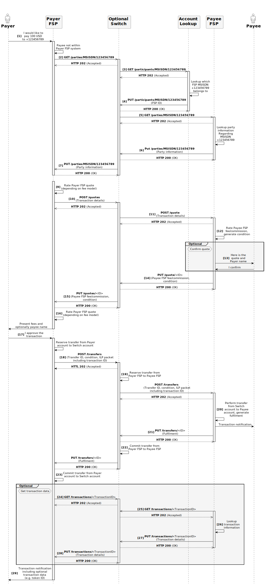


**Figure 64 -- Payer Initiated Transaction pattern using the asynchronous REST binding**

### Payee Initiated Transaction

The `Payee Initiated Transaction` pattern is introduced in [Generic Transaction Patterns](../generic-transaction-patterns#payer-initiated-transaction). On a high-level, the pattern should be used whenever a Payee would like to request that Payer transfer funds to a Payee. The Payer and the Payee are assumed to be in different FSPs, and the approval of the transaction is performed in the Payer FSP. If the transaction information and approval occur on a Payee device instead, use the related Payee Initiated Transaction using OTP](#payee-initiated-transaction-using-otp) instead. [Figure 65](#figure-65) shows the sequence diagram for a `Payee Initiated Transaction` using the asynchronous REST binding of the logical version. The process for each number in the sequence diagram is described in [Generic Transaction Patterns](../generic-transaction-patterns#payee-initiated-transaction).

###### Figure 65

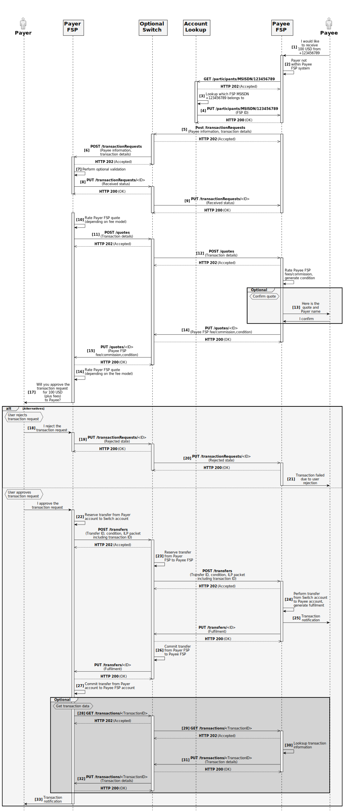


**Figure 65 -- Payee Initiated Transaction pattern using the asynchronous REST binding**

### Payee Initiated Transaction using OTP

The `Payee Initiated Transaction using OTP` pattern is introduced in [Generic Transaction Patterns](../generic-transaction-patterns#payee-initiated-transaction-using-otp). On a high-level, this pattern is like the [Payee Initiated Transaction](#payee-initiated-transaction); however, in this pattern the transaction information and approval for the Payer is shown and entered on a Payee device instead. As in other transaction patterns, the Payer and the Payee are assumed to be in different FSPs. [Figure 66](#figure-66) shows the sequence diagram for a `Payee Initiated Transaction using OTP` using the asynchronous REST binding of the logical version. The process for each number in the sequence diagram is described in [Generic Transaction Patterns](../generic-transaction-patterns#payee-initiated-transaction-using-otp).

###### Figure 66

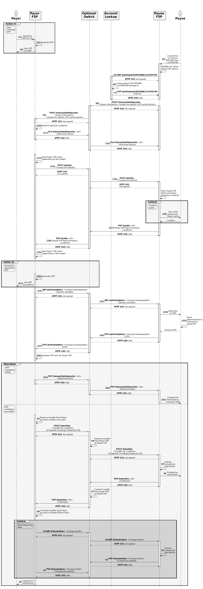


**Figure 66 -- Payee Initiated Transaction using OTP pattern using the asynchronous REST binding**

### Bulk Transactions

The `Bulk Transactions` pattern is introduced in [Generic Transaction Patterns](../generic-transaction-patterns#bulk-transactions). On a high-level, the pattern is used whenever a Payer would like to transfer funds to multiple Payees using one single transaction. The Payees can be in different FSPs. [Figure 67](#figure-67) shows the sequence diagram for a `Bulk Transactions` using the asynchronous REST binding of the logical version. The process for each number in the sequence diagram is described in [Generic Transaction Patterns](../generic-transaction-patterns#bulk-transactions).

###### Figure 67


**Figure 67 -- Bulk Transactions pattern using the asynchronous REST binding**

<br />

## API Error Handling

This section describes how to handle missing responses or callbacks, as well as how to handle errors in a server during processing of a request.

### Erroneous Request

If a server receives an erroneous service request that can be handled immediately (for example, malformed syntax or resource not found), a valid HTTP client error code (starting with **4_xx_**<sup>39</sup>) should be returned to the client in the response. The HTTP error codes defined in the API appear in [Table 4](#table-4). The HTTP response may also contain an [**ErrorInformation**](#errorinformation) element for the purpose of describing the error in more detail (for more information, see [Error Information in HTTP Response](#error-information-in-http-response)).

<br />

### Error in Server During Processing of Request

[Figure 68](#figure-68) shows an example of how to handle an error on a server during processing.

###### Figure 68

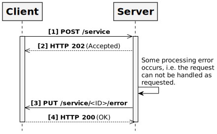


**Figure 68 -- Error on server during processing of request**

#### Internal Processing Steps

The following list describes the steps in the sequence (see [Figure 68](#figure-68)).

1. The client would like the server to create a new service object and thus uses a **POST** request.

2. The server receives the request. It immediately sends an **accepted** response to the client, and then tries to create the object based on the service request. A processing error occurs, and the request cannot be handled as requested. The server sends the callback **_PUT_ /**_{resource}_**/**_{ID}_**/error** including an error code ([Error Codes](#error-codes)) and error description to notify the client of the error.

3. The client receives the error callback and immediately responds with **OK**. The client then handles the error.

4. The server receives the **OK** response and the process is completed.

<br />

### Client Handling on Error Callback

The following sections explain how a client handles error callbacks from a server.

#### API Resource /participants

The typical error from the **/participants** service is that the requested Party could not be found. The client could either try another server, or notify the end user that the requested Party could not be found.

#### API Resource /parties

The typical error from the **/parties** service is that the requested Party could not be found. The client could either try another server, or notify the end user that information regarding the requested Party could not be found.

#### API Resource /quotes

The typical error from the **/quotes** service is that a quote could not be calculated for the requested transaction. The client should notify the end user that the requested transaction could not be performed.

#### API Resource /transactionRequests

The typical error from the **/transactionRequests** service is that the Payer rejected the transaction or that an automatic validation failed. The client should notify the Payee that the transaction request failed.

#### API Resource /authorizations

The typical error from the **/authorizations** service is that the transaction request could not be found. The client should notify the Payer that the transaction request has been cancelled.

#### API Resource /transfers

The typical error from the **/transfers** service is that either the hop-to-hop transfer process or the end-to-end financial transaction failed. For example, a limit breach was discovered, or the Payee could not be found. The client (the Payer FSP) should in any error case cancel the reservation for the financial transaction that was performed before requesting the transaction to be performed on the server (the Payee FSP). See [Figure 69](#figure-69) for an example including a financial Switch between the FSPs.

###### Figure 69

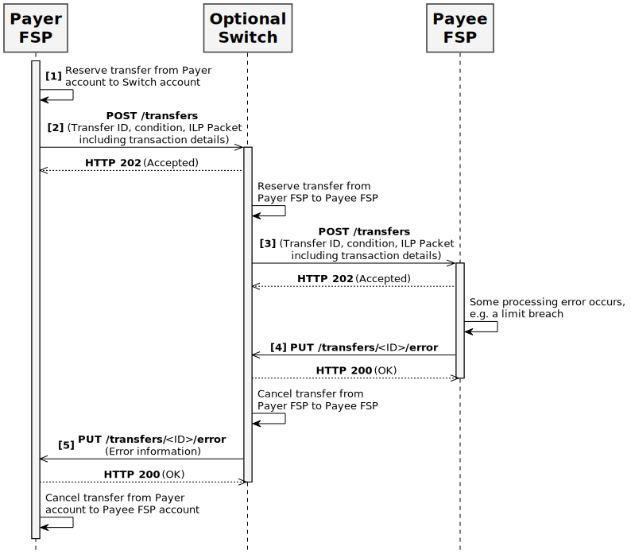


**Figure 69 -- Handling of error callback from POST /transfers**

##### Internal Processing Steps

The following list provides a detailed description of all the steps in the sequence (see [Figure 69](#figure-69)).

1. The transfer is reserved from the Payer's account to either a combined Switch account or a Payee FSP account, depending on setup. After the transfer has been successfully reserved, the request [POST /transfers](#post-transfers) is used on the Switch. The transfer is now irrevocable from the Payer FSP. The Payer FSP then waits for an **accepted** response from the Switch.

2. The Switch receives the request [POST /transfers](#post-transfers) and immediately sends an **accepted** response to the Payer FSP. The Switch then performs all applicable internal transfer validations. If the validations are successful, a transfer is reserved from a Payer FSP account to a Payee FSP account. After the transfer has been successfully reserved, the request [POST /transfers](#post-transfers) is used on the Payee FSP. The transfer is now irrevocable from the Switch. The Switch then waits for an **accepted** response from the Payee FSP.

3. The Payee FSP receives the [POST /transfers](#post-transfers) and immediately sends an **accepted** response to the Switch. The Payee FSP then performs all applicable internal transaction validations. The validation is assumed to fail at this point, for example, due to a limit breach. The error callback [PUT /transfers/_{ID}_/error](#put-transfers-id-error) is used on the Switch to inform the Payer FSP about the error. The Payee FSP then waits for an **OK** response from the Switch to complete the transfer process.

4. The Switch receives the error callback [PUT /transfers/_{ID}_/error](#put-transfers-id-error) and immediately responds with an **OK** response. The Switch then cancels the earlier reserved transfer, as it has received an error callback. The Switch will then use the callback [PUT /transfers/_{ID}_/error](#put-transfers-id-error) to the Payer FSP, using the same parameters, and wait for an **OK** response to complete the transfer process.

5. The Payer FSP receives the callback [PUT /transfers/_{ID}_/error](#put-transfers-id-error) and immediately responds with an **OK** response. The Payer FSP then cancels the earlier reserved transfer because it has received an error callback.

#### API Resource /transactions

The normal error case from the **/transactions** service is that the transaction could not be found in the Peer FSP.

#### API Resource /bulkQuotes

The typical error from the **/bulkQuotes** service is that a quote could not be calculated for the requested transaction. The client should notify the end user that the requested transaction could not be performed.

#### API Resource /bulkTransfers

The typical error case from the **/bulkTransfers** service is that the bulk transaction was not accepted; for example, due to a validation error. The client (the Payer FSP) should in any error case cancel the reservation for the financial transaction that was performed before requesting that the transaction be performed on the server (the Payee FSP). See [Figure 70](#figure-70) for an example including a financial Switch between the FSPs.

###### Figure 70

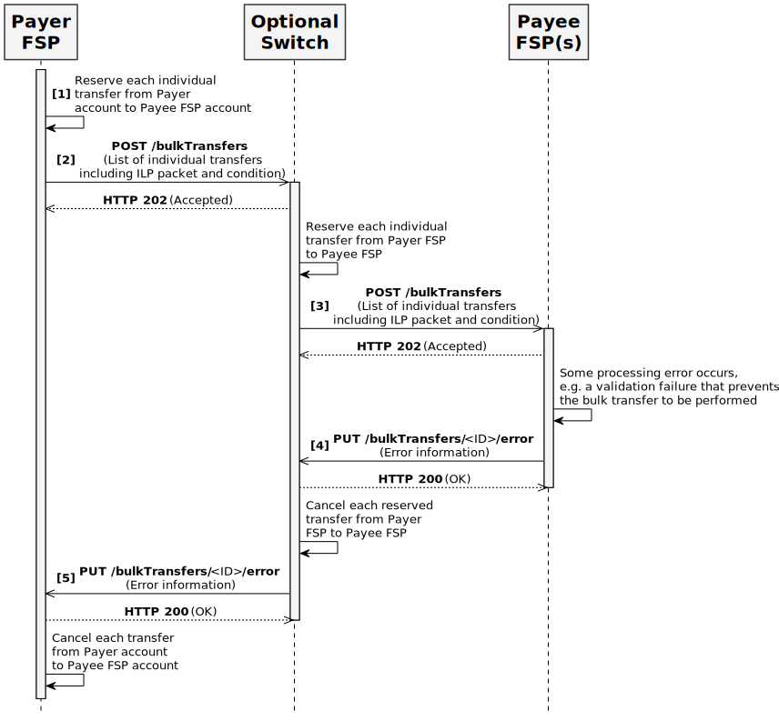


**Figure 70 -- Handling of error callback from API Service /bulkTransfers**

##### Internal Processing Steps

The following list describes the steps in the sequence (see [Figure 70](#figure-70)).

1. Each individual transfer in the bulk transfer is reserved from the Payer's account to either a combined Switch account or a Payee FSP account, depending on setup. After each transfer has been successfully reserved, the request [POST /bulkTransfers](#post-bulktransfers) is used on the Switch. The bulk transfer is now irrevocable from the Payer FSP. The Payer FSP then waits for an **accepted** response from the Switch.

2. The Switch receives the request [POST /bulkTransfers](#post-bulktransfers) and immediately sends an **accepted** response to the Payer FSP. The Switch then performs all applicable internal transfer validations. If the validations are successful, each individual transfer is reserved from a Payer FSP account to a Payee FSP account. After the transfers have been successfully reserved, the request [POST /bulkTransfers](#post-bulktransfers) is used on the Payee FSP. The bulk transfer is now irrevocable from the Switch. The Switch then waits for an **accepted** response from the Payee FSP.

3. The Payee FSP receives [POST /bulkTransfers](#post-bulktransfers) and immediately sends an **accepted** response to the Switch. The Payee FSP then performs all applicable internal bulk transfer validations. The validation is assumed to fail due to some reason; for example, a validation failure that prevents the entire bulk transfer from being performed. The error callback [PUT /bulkTransfers/_{ID}_/error](#put-bulktransfers-id-error) is used on the Switch to inform the Payer FSP about the error. The Payee FSP then waits for an **OK** response from the Switch to complete the bulk transfer process.

4. The Switch receives the error callback [PUT /bulkTransfers/_{ID}_/error](#put-bulktransfers-id-error) and immediately responds with an **OK** response. The Switch then cancels all the previous reserved transfers, because it has received an error callback. The Switch then uses the callback [PUT /bulkTransfers/_{ID}_/error](#put-bulktransfers-id-error) to the Payer FSP, using the same parameters, and waits for an **OK** response to complete the bulk transfer process.

5. The Payer FSP receives the callback [PUT /bulkTransfers/_{ID}_/error](#put-bulktransfers-id-error) and immediately responds with an **OK** response. The Payer FSP then cancels all the earlier reserved transfers, as it has received an error callback.

<br />

### Client Missing Response from Server - Using Resend of Request

[Figure 71](#figure-71) shows an example UML (Unified Modeling Language) sequence diagram in which a client (FSP or Switch) performs error handling when the client misses a response from a server (Switch or Peer FSP) pertaining to a service request, using resend of the same service request.

###### Figure 71

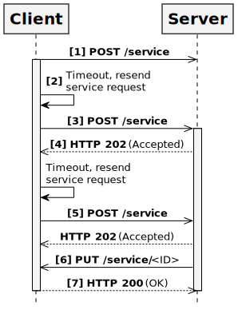


**Figure 71 -- Error handling from client using resend of request**

#### Internal Processing Steps

The following list provides a detailed description of all the steps in the sequence (see [Figure 71](#figure-71)).

1. The client would like the server to create a new service object. The HTTP request is lost somewhere on the way to the server.

2. The client notes that no response has been received from the server within a specified timeout. The client resends the service request.

3. The server receives the resent request. It immediately sends an **accepted** response to the client, and then creates the object in accordance with the service request.

4. The **accepted** HTTP response from the server is lost on the way to the client, and the client notes that no response has been received from the server within a specified timeout. The client resends the service request.

5. The server receives the resent request. It immediately sends an **accepted** response to the client, and then notes that the service request is the same as in [Step 3](#figure-70). As the service request is a resend, the server should not create a new object based on the service request. The server sends a callback to notify the client about the object created in [Step 3](#figure-70).

6. The client receives the callback regarding the created object. The client sends an **OK** HTTP response to the server to complete the process.

7. The server receives the **OK** HTTP response from the client, completing the process.

<br />

### Server Missing Response from Client

A server using the API is not responsible for making sure that a callback is properly delivered to a client. However, it is considered good practice to retry if the server does not receive an **OK** response from the client.

#### Client Missing Callback - Using GET request

[Figure 72](#figure-72) is a UML sequence diagram showing how a client (Switch or Peer FSP) would perform error handling in case of no callback from a client (FSP or Switch) within a reasonable time.

###### Figure 72

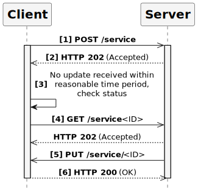


**Figure 72 -- Error handling from client using GET request**

#### Internal Processing Steps

The following list provides a detailed description of all the steps in the sequence (see [Figure 71](#figure-71)).

1. The client would like the server to create a new service object; a service request is sent.

2. The server receives the service request. It immediately sends an **accepted** response to the client, and then creates the object based on the service request. The object creation is a long running process; for example, a bulk transfer consisting of numerous financial transactions.

3. The server notes that no callback has been received from the client within a reasonable time. The client uses a **GET** service request with the ID that was provided in the original service request.

4. The server receives the **GET** service request. The server sends an accepted HTTP response to the client to notify that the request will be handled.

5. The client receives the **accepted** HTTP response and waits for the callback, which arrives sometime later; the client sends an **OK** HTTP response and the process is completed.

6. The server sends the callback to the client containing the requested information, and an **OK** HTTP response is received from the client, which completes the process.

<br />

## End-to-End Example

This section contains an end-to-end example in which an account holder is provisioned, and then a P2P Transfer from a Payer located in one FSP to a Payee located in another FSP is performed. The example includes both HTTP requests and responses, HTTP headers, and data models in JSON, but without additional security features of using JWS (see [_Signature_](./signature.md)) and field level encryption using JWE (see [_Encryption_](./encryption.md)).

### Example Setup

This section explains the setup of the example.

#### Nodes

###### Figure 73

The nodes in the end-to-end example in this section are simplified by having only two FSPs, where one FSP is a bank (identifier **BankNrOne**) and the other FSP is a mobile money operator (identifier **MobileMoney**), and one Switch (identifier **Switch**). The Switch also acts as the Account Lookup System (ALS) in this simplified setup (see [Figure 73](#figure-73)).


**Figure 73 -- Nodes in end-to-end example**

#### Account Holders

The account holders in the example are:

- One account holder in the FSP **BankNrOne** named Mats Hagman. Mats Hagman has a bank account with IBAN number **SE4550000000058398257466**. The currency of the account is USD.

- One account holder in the FSP **MobileMoney** named Henrik Karlsson. Henrik Karlsson has a mobile money account that is identified by his phone number **123456789**. The currency of the account is USD.

#### Scenario

The scenario in the example is that Mats Hagman in FSP **BankNrOne** wants to transfer 100 USD to Henrik Karlsson in the FSP **MobileMoney**. Before Henrik Karlsson can be found by FSP **BankNrOne**, Henrik's FSP **MobileMoney** should provide information to the Switch specifying in which FSP Henrik Karlsson can be found in. The end-to-end flow including all used services can be found in [Other Notes](#other-notes).

#### Other Notes

The JSON messages used in the examples are formatted with color coding, indentations, and line breaks for very long lines to simplify the read of the examples.

Both FSPs are assumed to have a pre-funded Switch account in their respective FSPs.

### End-to-End Flow

[Figure 74](#figure-74) shows the end-to-end flow of the entire example, from provisioning of FSP information to the actual transaction.

###### Figure 74

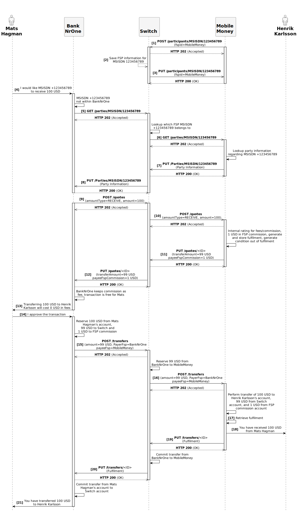


**Figure 74 -- End-to-end flow, from provision of account holder FSP information to a successful transaction**

### Provision Account Holder

Before the Payee Henrik Karlsson can be found by the Payer FSP **BankNrOne**, Henrik Karlsson should be provisioned to the ALS, which is also the Switch in this simplified example, by Henrik's FSP (**MobileMoney**). This is performed through either one of the services [**POST /participants**](#6232-post-participants) (bulk version) or [POST /participants/_{Type}_/_{ID}_](#post-participants-type-id) (single version). As the Payee in this example is only one (Henrik Karlsson), the single [POST /participants/_{Type}_/_{ID}_](#post-participants-type-id) version is used by FSP **MobileMoney**. The provision could happen anytime, for example when Henrik Karlsson signed up for the financial account, or when the FSP **MobileMoney** connected to the Switch for the first time.

#### FSP MobileMoney Provisions Henrik Karlsson: Step 1 in End-to-End Flow

[Listing 29](#listing-29) shows the HTTP request where the FSP **MobileMoney** provisions FSP information for account holder Henrik Karlsson, identified by **MSISDN** and **123456789** (see [Party Addressing](#party-addressing) for more information). The JSON element **fspId** is set to the FSP identifier (MobileMoney), and JSON element **currency** is set to the currency of the account (USD).

See [Table 1](#table-1) for the required HTTP headers in a HTTP request,
and [POST /participants/_{Type}_/_{ID}_](#post-participants-type-id) for more information about the service ). **More** information regarding routing of requests using **FSPIOP-Destination** and **FSPIOP-Source** can be found in [Call Flow Routing using FSPIOP Destination and FSPIOP Source](#call-flow-routing-using-fspiop-destination-and-fspiop-source). Information about API version negotiation can be found in [Version Negotiation between Client and Server](#version-negotiation-between-client-and-server).

###### Listing 29

```
POST /participants/MSISDN/123456789 HTTP/1.1
Accept: application/vnd.interoperability.participants+json;version=1
Content-Length: 50
Content-Type:
application/vnd.interoperability.participants+json;version=1.0
Date: Tue, 14 Nov 2017 08:12:31 GMT
FSPIOP-Source: MobileMoney
FSPIOP-Destination: Switch
{
    "fspId": "MobileMoney",
    "currency": "USD"
}
```

**Listing 29 -- Provision FSP information for account holder Henrik Karlsson**

[Listing 30](#listing-30) shows the synchronous HTTP response where the Switch immediately (after basic verification of for example required headers) acknowledges the HTTP request in [Listing 29](#listing-29).

See [Table 3](#table-3) for the required HTTP headers in a HTTP response.

###### Listing 30

```
HTTP/1.1 202 Accepted
Content-Type:
application/vnd.interoperability.participants+json;version=1.0
```

**Listing 30 -- Synchronous response on provision request**

<br />

#### Switch Handles Provision: Step 2 in End-to-End Flow

When the Switch has received the HTTP request in [Listing 29](#listing-29) and sent the synchronous response in [Listing 30](#listing-30), the Switch should verify the body of the request in [Listing 29](#listing-29). An example verification is to check that the **fspId** element is the same as the **FSPIOP-Source** , as it should be the FSP of the account holder who provisions the information. A scheme could also have restrictions on which currencies are allowed, which means that the Switch should then check that the currency in the **currency** element is allowed.

After the Switch has verified the request correctly, the information that the account holder identified by **MSISDN** and **123456789** is located in FSP **MobileMoney** should be stored in the Switch's database.

<br />

#### Switch Sends Successful Callback: Step 3 in End-to-End Flow

When the Switch has successfully stored the information that the account holder identified by **MSISDN** and **123456789** is located in FSP **MobileMoney**, the Switch must send a callback using the service [PUT /participants/_{Type}_/_{ID}_](#put-participants-type-id) to notify the FSP **MobileMoney** about the outcome of the request in [Listing 29](#listing-29). [Listing 31](#listing-31) shows the HTTP request for the callback.

See [Table 1](#table-1) for the required HTTP headers in a HTTP request. In the callback, the **Accept** header should not be used as this is a callback to an earlier requested service. The HTTP headers **FSPIOP-Destination** and **FSPIOP-Source** are now inverted compared to the HTTP request in [Listing 29](#listing-29), as detailed in the section on [PUT /participants/_{Type}_/_{ID}_](#put-participants-type-id).

###### Listing 31

```
PUT /participants/MSISDN/123456789 HTTP/1.1
Content-Length: 50
Content-Type:
Date: Tue, 14 Nov 2017 08:12:32 GMT
FSPIOP-Source: MobileMoney
FSPIOP-Destination: Switch
{
    "fspId": "MobileMoney",
    "currency": "USD"
}
```

**Listing 31 -- Callback for the earlier requested provision service**

[Listing 32](#listing-32) shows the synchronous HTTP response where the FSP **MobileMoney** immediately (after basic verification of for example required headers) acknowledges the completion of the process, after receiving the callback in [Listing 31](#listing-31).

See [Table 3](#table-3) for the required HTTP headers in a HTTP response.

###### Listing 32

```
HTTP/1.1 200 OK
Content-Type:
application/vnd.interoperability.participants+json;version=1.0
```

**Listing 32 -- Synchronous response for the callback**

<br />

### P2P Transfer

As the intended Payee Henrik Karlsson is now known by the Switch (which is also the ALS) as detailed in [Provision Account Holder](#provision-account-holder), Mats Hagman can now initiate and approve the use case P2P Transfer from his bank to Henrik Karlsson.

#### Initiate Use Case: Step 4 in End-to-End Flow

Mats Hagman knows that Henrik Karlsson has phone number **123456789**, so he inputs that number on his device as recipient and 100 USD as amount. The actual communication between Mats' device and his bank **BankNrOne** is out of scope for this API.

<br />

#### Request Party Information from Switch: Step 5 in End-to-End Flow

In Step 5 in the end-to-end flow, **BankNrOne** receives the request from Mats Hagman that he would like the phone number 123456789 to receive 100 USD. **BankNrOne** performs an internal search to see if 123456789 exists within the bank, but fails to find the account internally. **BankNrOne** then uses the service [GET /parties/_{Type}_/_{ID}_](#get-parties-type-id) in the Switch to see if the Switch knows anything about the account.

[Listing 33](#listing-33) shows the HTTP request where the FSP **BankNrOne** asks the Switch for Party information regarding the account identified by **MSISDN** and **123456789**.

See [Table 1](#table-1) for the required HTTP headers in a HTTP request, and [GET /parties/_{Type}_/_{ID}_](#get-parties-type-id) for more information about the service. **More** information regarding routing of requests using **FSPIOP-Destination** and **FSPIOP-Source** can be found in [Call Flow Routing using FSPIOP Destination and FSPIOP Source](#call-flow-routing-using-fspiop-destination-and-fspiop-source). In this request, the FSP **BankNrOne** does not know in which FSP the other account holder resides. Thus, the **FSPIOP-Destination** is not present. Information about API version negotiation can be found in [Version Negotiation between Client and Server](#version-negotiation-between-client-and-server).

###### Listing 33

```
GET /parties/MSISDN/123456789 HTTP/1.1
Accept: application/vnd.interoperability.parties+json;version=1
Content-Type: application/vnd.interoperability.parties+json;version=1.0
Date: Tue, 15 Nov 2017 10:13:37 GMT
FSPIOP-Source: BankNrOne
```

**Listing 33 -- Get Party information for account identified by MSISDN and 123456789 from FSP BankNrOne**

[Listing 34](#listing-34) shows the synchronous HTTP response where the Switch immediately (after basic verification of for example required headers) acknowledges the HTTP request in [Listing 33](#listing-33).

See [Table 3](#table-3) for the required HTTP headers in a HTTP response.

###### Listing 34

```
HTTP/1.1 202 Accepted
Content-Type: application/vnd.interoperability.parties+json;version=1.0
```

**Listing 34 -- Synchronous response on the request for Party information**

#### Request Party Information from FSP: Step 6 in End-to-End Flow

When the Switch has received the HTTP request in [Listing 33](#listing-33) and sent the synchronous response in [Listing 34](#listing-34), the Switch can proceed with checking its database if it has information regarding in which FSP the account holder identified by **MSISDN** and **123456789** is located. As that information was provisioned as detailed in [Provisoin Account Holder](#provision-account-holder), the Switch knows that the account is in FSP **MobileMoney**. Therefore, the Switch sends the HTTP request in [Listing 35](#listing-35).

See [Table 1](#table-1) for the required HTTP headers in a HTTP request, and [GET /parties/_{Type}_/_{ID}_](#get-parties-type-id) for more information about the service. **More** information regarding routing of requests using **FSPIOP-Destination** and **FSPIOP-Source** can be found in [Call Flow Routing using FSPIOP Destination and FSPIOP Source](#call-flow-routing-using-fspiop-destination-and-fspiop-source); in this request the Switch has added the header **FSPIOP-Destination** because the Switch knew to where the request should be routed. Information about API version negotiation can be found in [Version Negotiation between Client and Server](#version-negotiation-between-client-and-server).


###### Listing 35

```
GET /parties/MSISDN/123456789 HTTP/1.1
Accept: application/vnd.interoperability.parties+json;version=1
Content-Type: application/vnd.interoperability.parties+json;version=1.0
Date: Tue, 15 Nov 2017 10:13:38 GMT
FSPIOP-Source: BankNrOne
FSPIOP-Destination: MobileMoney
```

**Listing 35 -- Get Party information for account identified by MSISDN and 123456789 from Switch**

[Listing 36](#listing-36) shows the synchronous HTTP response where the FSP **MobileMoney** immediately (after basic verification of for example required headers) acknowledges the HTTP request in [Listing 35](#listing-35).

See [Table 3](#table-3) for the required HTTP headers in a HTTP response.

###### Listing 36

```
HTTP/1.1 202 Accepted
Content-Type: application/vnd.interoperability.parties+json;version=1.0
```

**Listing 36 -- Synchronous response on request for Party information**

<br />

#### Lookup Party Information in FSP MobileMoney: Step 7 in End-to-End Flow

When the FSP **MobileMoney** has received the HTTP request in [Listing 35](#listing-35) and sent the synchronous response in [Listing 36](#listing-36), the FSP **MobileMoney** can proceed with checking its database for more information regarding the account identified by **MSISDN** and **123456789**. As the account exists and is owned by Henrik Karlsson, the FSP **MobileMoney** sends the callback in [Listing 37](#listing-37). The FSP **MobileMoney** does not want to share some details, for example birth date, with the other FSP (**BankNrOne**), so some optional elements are not sent.

See [Table 1](#table-1) for the required HTTP headers in a HTTP request,
and [PUT /participants/_{Type}_/_{ID}_](#put-participants-type-id) for more information about the callback. **In** the callback, the **Accept** header should not be sent. The HTTP headers **FSPIOP-Destination** and **FSPIOP-Source** are now inverted compared to the HTTP request in [Listing 35](#listing-35), as detailed in [Call Flow Routing using FSPIOP Destination and FSPIOP Source](#call-flow-routing-using-fspiop-destination-and-fspiop-source).

###### Listing 37

````
PUT /parties/MSISDN/123456789 HTTP/1.1
Content-Type: application/vnd.interoperability.parties+json;version=1.0
Content-Length: 347
Date: Tue, 15 Nov 2017 10:13:39 GMT
FSPIOP-Source: MobileMoney
FSPIOP-Destination: BankNrOne
{
    "party": {
        "partyIdInfo": {
            "partyIdType": "MSISDN",
            "partyIdentifier": "123456789",
            "fspId": "MobileMoney"
        },
        "personalInfo": {
            "complexName": {
                "firstName": "Henrik",
                "lastName": "Karlsson"
            }
        }
    }
}
````

**Listing 37 -- Callback to the request for Party information**

[Listing 38](#listing-38) shows the synchronous HTTP response where the Switch immediately (after basic verification of for example required headers) acknowledges the completion of the process, after receiving the callback in [Listing 37](#listing-37).

See [Table 3](#table-3) for the required HTTP headers in a HTTP response.

###### Listing 38

```
HTTP/1.1 200 OK
Content-Type: application/vnd.interoperability.parties+json;version=1.0
```

**Listing 38 -- Synchronous response for the Party information callback**

<br />

#### Send Callback to FSP BankNrOne: Step 8 in End-to-End Flow

When the Switch has received the callback in [Listing 37](#listing-37) and sent the synchronous response in [Listing 38](#listing-38), it should relay the exact same callback as in [Listing 37](#listing-37) to the FSP **BankNrOne**, and **BankNrOne** should then respond synchronously with the exact same response as in [Listing 38](#listing-38).

The HTTP request and response are not repeated in this section, as they are the same as in the last section, but sent from the Switch to **BankNrOne** (HTTP request in [Listing 37](#listing-37)) and from **BankNrOne** to the Switch (HTTP response in [Listing 38](#listing-38)) instead.

<br />

#### Send Quote Request from FSP BankNrOne: Step 9 in End-to-End Flow

After receiving Party information in the callback [PUT /parties/_{Type}_/_{ID}_](#put-parties-type-id), the FSP **BankNrOne** now knows that the account identified by **MSISDN** and **123456789** exists and that it is in the FSP **MobileMoney**. It also knows the name of the account holder. Depending on implementation, the name of the intended Payee (Henrik Karlsson) could be shown to Mats Hagman already in this step before sending the quote. In this example, a quote request is sent before showing the name and any fees.

The FSP **BankNrOne** sends the HTTP request in [Listing 39](#listing-39) to request the quote. **BankNrOne** does not want to disclose its fees (see [Quoting](#quoting) for more information about quoting), which means that it does not include the **fees** element in the request. The **amountType** element is set to RECEIVE as Mats wants Henrik to receive 100 USD. The **transactionType** is set according to [Mapping of Use Cases to Transaction Types](#mapping-of-use-cases-to-transaction-types). Information about Mats is sent in the **payer** element. **BankNrOne** has also generated two UUIDs for the quote ID (7c23e80c-d078-4077-8263-2c047876fcf6) and the transaction ID (85feac2f-39b2-491b-817e-4a03203d4f14). These IDs must be unique, as described in [Architectural Style](#architectural-style).

See [Table 1](#table-1) for the required HTTP headers in a HTTP request, and [Section 6.5.3.2](#6532-post-quotes) for more information about the service [POST /quotes](#6532-post-quotes). **More** information regarding routing of requests using **FSPIOP-Destination** and **FSPIOP-Source** can be found in [Call Flow Routing using FSPIOP Destination and FSPIOP Source](#call-flow-routing-using-fspiop-destination-and-fspiop-source). Information about API version negotiation can be found in [Version Negotiation between Client and Server](#version-negotiation-between-client-and-server).

###### Listing 39

````
POST /quotes HTTP/1.1
Accept: application/vnd.interoperability.quotes+json;version=1
Content-Type: application/vnd.interoperability.quotes+json;version=1.0
Content-Length: 975
Date: Tue, 15 Nov 2017 10:13:40 GMT
FSPIOP-Source: BankNrOne
FSPIOP-Destination: MobileMoney
{
    "quoteId": "7c23e80c-d078-4077-8263-2c047876fcf6",
    "transactionId": "85feac2f-39b2-491b-817e-4a03203d4f14",
    "payee": {
        "partyIdInfo": {
            "partyIdType": "MSISDN",
            "partyIdentifier": "123456789",
            "fspId": "MobileMoney"
        }
    },
    "payer": {
        "personalInfo": {
            "complexName": {
                "firstName": "Mats",
                "lastName": "Hagman"
            }
        },
        "partyIdInfo": {
            "partyIdType": "IBAN",
            "partyIdentifier": "SE4550000000058398257466",
            "fspId": "BankNrOne"
        }
    },
    "amountType": "RECEIVE",
    "amount": {
        "amount": "100",
        "currency": "USD"
    },
    "transactionType": {
        "scenario": "TRANSFER",
        "initiator": "PAYER",
        "initiatorType": "CONSUMER"
    },
    "note": "From Mats",
    "expiration": "2017-11-15T22:17:28.985-01:00"
}
````

**Listing 39 -- Request quote for transaction of 100 USD**

[Listing 40](#listing-40) shows the synchronous HTTP response where the Switch immediately (after basic verification of for example required headers) acknowledges the HTTP request in [Listing 39](#listing-39).

See [Table 3](#table-3) for the required HTTP headers in a HTTP response.

###### Listing 40

```
HTTP/1.1 202 Accepted
Content-Type: application/vnd.interoperability.quotes+json;version=1.0
```

**Listing 40 -- Synchronous response on quote request**

#### Send Quote Request from Switch: Step 10 in End-to-End Flow**

When the Switch has received the quote request in [Listing 39](#listing-39) and sent the synchronous response in [Listing 40](#listing-40), it should relay the same request as in [Listing 39](#listing-39) to the FSP **MobileMoney**, and **MobileMoney** should then respond synchronously with the same response as in [Listing 40](#listing-40).

The HTTP request and response are not repeated in this section, as they are the same as in the last section, but sent from the Switch to **MobileMoney** (HTTP request in [Listing 39](#listing-39)) and from **MobileMoney** to the Switch (HTTP response in [Listing 40](#listing-40)) instead.

<br />

#### Determine fees and FSP commission in FSP MobileMoney: Step 11 in End-to-End Flow

When the FSP **MobileMoney** has received the HTTP request in [Listing 39](#listing-40) and sent the synchronous response in [Listing 40](#listing-40), the FSP **MobileMoney** should validate the request and then proceed to determine the applicable fees and/or FSP commission for performing the transaction in the quote request.

In this example, the FSP **MobileMoney** decides to give 1 USD in FSP commission as the FSP **MobileMoney** will receive money, which should later generate more income for the FSP (future possible fees). Since the Payee Henrik Karlsson should receive 100 USD and the FSP commission is determined to 1 USD, the FSP **BankNrOne** only needs to transfer 99 USD to the FSP **MobileMoney** (see [Non Disclosing Receive Amount](#non-disclosing-receive-amount) for the equation). The 99 USD is entered in the transferAmount element in the callback, which is the amount that should later be transferred between the FSPs.

To send the callback, the FSP **MobileMoney** then needs to create an ILP Packet (see [ILP Packet](#ilp-packet) for more information) that is base64url-encoded, as the **ilpPacket** element in the [PUT /quotes/_{ID}_](#put-quotes-id) callback is defined as a [BinaryString](#binarystring). How to populate the ILP Packet is explained in [Interledger Payment Request](#interledger-payment-request). Henrik's ILP address in the FSP **MobileMoney** has been set to **g.se.mobilemoney.msisdn.123456789** (see [ILP Addressing](#ilp-addressing) for more information about ILP addressing). As the transfer amount is 99 USD and the currency USD's exponent is 2, the amount to be populated in the ILP Packet is 9900 (99 \* 10\^2 = 9900). The remaining element in the ILP Packet is the **data** element. As described in [Interledger Payment Request](#interledger-payment-request), this element should contain the Transaction data model (see [Transaction](#transaction)). With the information from the quote request, the Transaction in this example becomes as shown in [Listing 41](#listing-41). Base64url-encoding the entire ILP Packet with the **amount**, **account**, and the **data** element then results in the **ilpPacket** element in the [PUT /quotes/_{ID}_](#put-quotes-id) callback.

When the ILP Packet has been created, the fulfilment and the condition can be generated as defined in the algorithm in [Listing 12](#listing-12). Using a generated example secret shown in [Listing 42](#listing-42) (shown as base64url-encoded), the fulfilment becomes as in [Listing 43](#listing-43) (shown as base64url-encoded) after executing the HMAC SHA-256 algorithm on the ILP Packet using the generated secret as key. The FSP **MobileMoney** is assumed to save the fulfilment in the database, so that it does not have to be regenerated later. The condition is then the result of executing the SHA-256 hash algorithm on the fulfilment, which becomes as in [Listing 44](#listing-44) (shown as base64url-encoded).

The complete callback to the quote request becomes as shown in [Listing 45](#listing-45).

See [Table 1](#table-1) for the required HTTP headers in a HTTP request, and [PUT /quotes/_{ID}_](#put-quotes-id) for more information about the callback. **The** _{ID}_ in the URI should be taken from the quote ID in the quote request, which in the example is 7c23e80c-d078-4077-8263-2c047876fcf6. In the callback, the **Accept** header should not be sent. The HTTP headers **FSPIOP-Destination** and **FSPIOP-Source** are now inverted compared to the HTTP request in [Listing 39](#listing-39), as detailed in [Call Flow Routing using FSPIOP Destination and FSPIOP Source](#call-flow-routing-using-fspiop-destination-and-fspiop-source).

###### Listing 41

```
{
    "transactionId": "85feac2f-39b2-491b-817e-4a03203d4f14",
    "quoteId": "7c23e80c-d078-4077-8263-2c047876fcf6",
    "payee": {
        "partyIdInfo": {
            "partyIdType": "MSISDN",
            "partyIdentifier": "123456789",
            "fspId": "MobileMoney"
        },
        "personalInfo": {
            "complexName": {
                "firstName": "Henrik",
                "lastName": "Karlsson"
            }
        }
    },
    "payer": {
        "personalInfo": {
            "complexName": {
                "firstName": "Mats",
                "lastName": "Hagman"
            }
        },
        "partyIdInfo": {
            "partyIdType": "IBAN",
            "partyIdentifier": "SE4550000000058398257466",
            "fspId": "BankNrOne"
        }
    },
    "amount": {
        "amount": "99",
        "currency": "USD"
    },
    "transactionType": {
        "scenario": "TRANSFER",
        "initiator": "PAYER",
        "initiatorType": "CONSUMER"
    },
    "note": "From Mats"
}
```

**Listing 41 -- The Transaction JSON object**

###### Listing 42

```
JdtBrN2tskq9fuFr6Kg6kdy8RANoZv6BqR9nSk3rUbY
```

**Listing 42 -- Generated secret, encoded in base64url**

###### Listing 43

```
mhPUT9ZAwd-BXLfeSd7-YPh46rBWRNBiTCSWjpku90s
```

**Listing 43 -- Calculated fulfilment from the ILP Packet and secret, encoded in base64url**

###### Listing 44

```
fH9pAYDQbmoZLPbvv3CSW2RfjU4jvM4ApG\_fqGnR7Xs
```

**Listing 44 -- Calculated condition from the fulfilment, encoded in base64url**

###### Listing 45

```
PUT /quotes/7c23e80c-d078-4077-8263-2c047876fcf6 HTTP/1.1
Content-Type: application/vnd.interoperability.quotes+json;version=1.0
Content-Length: 1802
Date: Tue, 15 Nov 2017 10:13:41 GMT
FSPIOP-Source: MobileMoney
FSPIOP-Destination: BankNrOne
{
    "transferAmount": {
        "amount": "99",
        "currency": "USD"
    },
    "payeeReceiveAmount": {
        "amount": "100",
        "currency": "USD"
    },
    "expiration": "2017-11-15T14:17:09.663+01:00",
    "ilpPacket": "AQAAAAAAACasIWcuc2UubW9iaWxlbW9uZXkubXNpc2RuLjEyMzQ1Njc4OY-
IEIXsNCiAgICAidHJhbnNhY3Rpb25JZCI6ICI4NWZlY-
WMyZi0zOWIyLTQ5MWItODE3ZS00YTAzMjAzZDRmMTQiLA0KICAgICJxdW90ZUlkIjogIjdjMjNlOD-
BjLWQwNzgtNDA3Ny04MjYzLTJjMDQ3ODc2ZmNmNiIsDQogICAgInBheWVlIjogew0KICAgICAgI-
CAicGFydHlJZEluZm8iOiB7DQogICAgICAgICAgICAicGFydHlJZFR5cGUiOiAiTVNJU0ROIiwNCiAgI-
CAgICAgICAgICJwYXJ0eUlkZW50aWZpZXIiOiAiMTIzNDU2Nzg5IiwNCiAgICAgICAgI-
CAgICJmc3BJZCI6ICJNb2JpbGVNb25leSINCiAgICAgICAgfSwNCiAgICAgI-
CAgInBlcnNvbmFsSW5mbyI6IHsNCiAgICAgICAgICAgICJjb21wbGV4TmFtZSI6IHsNCiAgICAgICAgI-
CAgICAgICAiZmlyc3ROYW1lIjogIkhlbnJpayIsDQogICAgICAgICAgICAgICAgImxhc3ROYW1lIjogIk-
thcmxzc29uIg0KICAgICAgICAgICAgfQ0KICAgICAgICB9DQogICAgfSwNCiAgICAicGF5ZXIi-
OiB7DQogICAgICAgICJwZXJzb25hbEluZm8iOiB7DQogICAgICAgICAgICAiY29tcGxleE5hbWUi-
OiB7DQogICAgICAgICAgICAgICAgImZpcnN0TmFtZSI6ICJNYXRzIiwNCiAgICAgICAgICAgICAgI-
CAibGFzdE5hbWUiOiAiSGFnbWFuIg0KICAgICAgICAgICAgfQ0KICAgICAgICB9LA0KICAgICAgI-
CAicGFydHlJZEluZm8iOiB7DQogICAgICAgICAgICAicGFydHlJZFR5cGUiOiAiSUJBTiIsDQogICAgI-
CAgICAgICAicGFydHlJZGVudGlmaWVyI-
jogIlNFNDU1MDAwMDAwMDA1ODM5ODI1NzQ2NiIsDQogICAgICAgICAgICAiZnNwSWQiOiAiQmFua05yT25
lIg0KICAgICAgICB9DQogICAgfSwNCiAgICAiYW1vdW50Ijogew0KICAgICAgICAiYW1vdW50IjogIjEw-
MCIsDQogICAgICAgICJjdXJyZW5jeSI6ICJVU0QiDQogICAgfSwNCiAgICAidHJhbnNhY3Rpb25UeXBlI-
jogew0KICAgICAgICAic2NlbmFyaW8iOiAiVFJBTlNGRVIiLA0KICAgICAgICAiaW5pdGlhdG9yI-
jogIlBBWUVSIiwNCiAgICAgICAgImluaXRpYXRvclR5cGUiOiAiQ09OU1VNRVIiDQogICAgfSwNCiAgI-
CAibm90ZSI6ICJGcm9tIE1hdHMiDQp9DQo\u003d\u003d",
    "condition": "fH9pAYDQbmoZLPbvv3CSW2RfjU4jvM4ApG_fqGnR7Xs"
}
```

**Listing 45 -- Quote callback**

**Note:** The element **ilpPacket** in [Listing 45](#listing-45) should be on a single line in a real implementation; it is shown with line breaks in this example in order to show the entire value.

[Listing 46](#listing-46) shows the synchronous HTTP response where the Switch immediately (after basic verification of for example required headers) acknowledges the completion of the process, after receiving the callback in [Listing 45](#listing-45).

See [Table 3](#table-3) for the required HTTP headers in a HTTP response.

###### Listing 46

```
HTTP/1.1 200 OK
Content-Type: application/vnd.interoperability.quotes+json;version=1.0
```

**Listing 46 -- Synchronous response on the quote callback**

#### Send Callback to FSP BankNrOne: Step 12 in End-to-End Flow

When the Switch has received the quote callback in [Listing 45](#listing-45) and sent the synchronous response in [Listing 46](#listing-46), it should relay the exact same callback as in [Listing 45](#listing-45) to the FSP **BankNrOne**, and **BankNrOne** should then respond synchronously with the exact same response as in [Listing 46](#listing-46).

The HTTP request and response are not repeated in this section, as they are the same as in the last section, but sent from the Switch to **BankNrOne** (HTTP request in [Listing 45](#listing-45)) and from **BankNrOne** to the Switch (HTTP response in [Listing 46](#listing-46)) instead.

<br />

#### Determine fees in FSP BankNrOne: Step 13 in End-to-End Flow

When the FSP **BankNrOne** has received the quote callback in [Listing 45](#listing-45) and sent the synchronous response in [Listing 46](#listing-46), the FSP **BankNrOne** can proceed with determining the fees for the Payer Mats Hagman. In this example, the fee for the Payer is set to 0 USD, but the FSP commission from the FSP **MobileMoney** is kept as an income for the FSP **BankNrOne**. This means that for the Payee Henrik Karlsson to receive 100 USD, the Payer Mats Hagman must transfer 100 USD from his account. 99 USD will then be transferred between the FSPs **BankNrOne** and **MobileMoney**.

The FSP **BankNrOne** then notifies Mats Hagman that the transaction to transfer 100 USD to Henrik Karlsson will cost 0 USD in fees. How Mats Hagman is notified is out of scope of this API.

<br />

#### Payer Accepts Transaction: Step 14 in End-to-End Flow

In this example, Mats Hagman accepts to perform the transaction. How the acceptance is sent is outside the scope of this API.

#### Send Transfer Request from FSP BankNrOne: Step 15 in End-to-End Flow

When Mats Hagman has accepted the transaction, FSP **BankNrOne** reserves the internal transfers needed to perform the transaction. This means that 100 USD will be reserved from Mats Hagman's account, where 1 USD will end up as income for the FSP and 99 USD will be transferred to the prefunded Switch account. After the reservations are successfully performed, the FSP **BankNrOne** sends a [POST /transfers](#post-transfers) to the Switch as in [Listing 47](#listing-47). The same ilpPacket and condition elements are sent as was received in the quote callback and the **amount** is the same as the received **transferAmount**, see [Listing 45](#listing-45).

See [Table 1](#table-1) for the required HTTP headers in a HTTP request, and [Post Transfers](#post-transfers) for more information about the service [POST /transfers](#post-transfers).**More** information regarding routing of requests using **FSPIOP-Destination** and **FSPIOP-Source** can be found in [Call Flow Routing using FSPIOP Destination and FSPIOP Source](#call-flow-routing-using-fspiop-destination-and-fspiop-source). Information about API version negotiation can be found in [Version Negotiation between Client and Server](#version-negotiation-between-client-and-server).

###### Listing 47

```
POST /transfers HTTP/1.1
Accept: application/vnd.interoperability.transfers+json;version=1
Content-Type: application/vnd.interoperability.transfers+json;version=1.0
Content-Length: 1820
Date: Tue, 15 Nov 2017 10:14:01
FSPIOP-Source: BankNrOne
FSPIOP-Destination: MobileMoney
{
    "transferId":"11436b17-c690-4a30-8505-42a2c4eafb9d",
    "payerFsp":"BankNrOne",
    "payeeFsp": "MobileMoney",
    "amount": {
        "amount": "99",
        "currency": "USD"
    },
    "expiration": "2017-11-15T11:17:01.663+01:00",
    "ilpPacket": "AQAAAAAAACasIWcuc2UubW9iaWxlbW9uZXkubXNpc2RuLjEyMzQ1Njc4OY- 
IEIXsNCiAgICAidHJhbnNhY3Rpb25JZCI6ICI4NWZlY-
WMyZi0zOWIyLTQ5MWItODE3ZS00YTAzMjAzZDRmMTQiLA0KICAgICJxdW90ZUlkIjogIjdjMjNlOD-
BjLWQwNzgtNDA3Ny04MjYzLTJjMDQ3ODc2ZmNmNiIsDQogICAgInBheWVlIjogew0KICAgICAgI-
CAicGFydHlJZEluZm8iOiB7DQogICAgICAgICAgICAicGFydHlJZFR5cGUiOiAiTVNJU0ROIiwNCiAgI-
CAgICAgICAgICJwYXJ0eUlkZW50aWZpZXIiOiAiMTIzNDU2Nzg5IiwNCiAgICAgICAgI-
CAgICJmc3BJZCI6ICJNb2JpbGVNb25leSINCiAgICAgICAgfSwNCiAgICAgI-
CAgInBlcnNvbmFsSW5mbyI6IHsNCiAgICAgICAgICAgICJjb21wbGV4TmFtZSI6IHsNCiAgICAgICAgI-
CAgICAgICAiZmlyc3ROYW1lIjogIkhlbnJpayIsDQogICAgICAgICAgICAgICAgImxhc3ROYW1lIjogIk-
thcmxzc29uIg0KICAgICAgICAgICAgfQ0KICAgICAgICB9DQogICAgfSwNCiAgICAicGF5ZXIi-
OiB7DQogICAgICAgICJwZXJzb25hbEluZm8iOiB7DQogICAgICAgICAgICAiY29tcGxleE5hbWUi-
OiB7DQogICAgICAgICAgICAgICAgImZpcnN0TmFtZSI6ICJNYXRzIiwNCiAgICAgICAgICAgICAgI-
CAibGFzdE5hbWUiOiAiSGFnbWFuIg0KICAgICAgICAgICAgfQ0KICAgICAgICB9LA0KICAgICAgI-
CAicGFydHlJZEluZm8iOiB7DQogICAgICAgICAgICAicGFydHlJZFR5cGUiOiAiSUJBTiIsDQogICAgI- CAgICAgICAicGFydHlJZGVudGlmaWVyI-
jogIlNFNDU1MDAwMDAwMDA1ODM5ODI1NzQ2NiIsDQogICAgICAgICAgICAiZnNwSWQiOiAiQmFua05yT25 lIg0KICAgICAgICB9DQogICAgfSwNCiAgICAiYW1vdW50Ijogew0KICAgICAgICAiYW1vdW50IjogIjEw-
MCIsDQogICAgICAgICJjdXJyZW5jeSI6ICJVU0QiDQogICAgfSwNCiAgICAidHJhbnNhY3Rpb25UeXBlI-
jogew0KICAgICAgICAic2NlbmFyaW8iOiAiVFJBTlNGRVIiLA0KICAgICAgICAiaW5pdGlhdG9yI-
jogIlBBWUVSIiwNCiAgICAgICAgImluaXRpYXRvclR5cGUiOiAiQ09OU1VNRVIiDQogICAgfSwNCiAgI-
CAibm90ZSI6ICJGcm9tIE1hdHMiDQp9DQo\u003d\u003d",
"condition": "fH9pAYDQbmoZLPbvv3CSW2RfjU4jvM4ApG_fqGnR7Xs" 
}
```

**Listing 47 -- Request to transfer from FSP BankNrOne to FSP MobileMoney**

**Note:** The element **ilpPacket** in [Listing 47](#listing-47) should be on a single line in a real implementation, it is shown with line breaks in this example for being able to show the entire value.

[Listing 48](#listing-48) shows the synchronous HTTP response where the Switch immediately (after basic verification of for example required headers) acknowledges the HTTP request in [Listing 47](#listing-47).

See [Table 3](#table-3) for the required HTTP headers in a HTTP response.

###### Listing 48

```
HTTP/1.1 202 Accepted
Content-Type: application/vnd.interoperability.transfers+json;version=1.0
```

**Listing 48 -- Synchronous response on transfer request**

<br />

#### Send Transfer Request from Switch: Step 16 in End-to-End Flow

When the Switch has received the transfer request in [Listing 47](#listing-47) and sent the synchronous response in [Listing 48](#listing-48), it should reserve the transfer from **BankNrOne**'s account in the Switch to **MobileMoney**'s account in the Switch. After the reservation is successful, the Switch relays nearly the same request as in [Listing 47](#listing-47) to the FSP **MobileMoney**; expect that the **expiration** element should be decreased as mentioned in [Timeout and Expiry](#timeout-and-expiry). [Listing 49](#listing-49) shows the HTTP request with the **expiration** decreased by 30 seconds compared to [Listing 47](#listing-47). The FSP **MobileMoney** should then respond synchronously with the same response as in [Listing 48](#listing-48).

###### Listing 49

```
POST /transfers HTTP/1.1
Accept: application/vnd.interoperability.transfers+json;version=1
Content-Type: application/vnd.interoperability.transfers+json;version=1.0
Content-Length: 1820
Date: Tue, 15 Nov 2017 10:14:01 GMT
FSPIOP-Source: BankNrOne
FSPIOP-Destination: MobileMoney
{
    "transferId":"11436b17-c690-4a30-8505-42a2c4eafb9d",
    "payerFsp":"BankNrOne",
    "payeeFsp": "MobileMoney",
    "amount": {
        "amount": "99",
        "currency": "USD"
    },
    "expiration": "2017-11-15T11:16:31.663+01:00",
    "ilpPacket": "AQAAAAAAACasIWcuc2UubW9iaWxlbW9uZXkubXNpc2RuLjEyMzQ1Njc4OY-
IEIXsNCiAgICAidHJhbnNhY3Rpb25JZCI6ICI4NWZlY-
WMyZi0zOWIyLTQ5MWItODE3ZS00YTAzMjAzZDRmMTQiLA0KICAgICJxdW90ZUlkIjogIjdjMjNlOD-
BjLWQwNzgtNDA3Ny04MjYzLTJjMDQ3ODc2ZmNmNiIsDQogICAgInBheWVlIjogew0KICAgICAgI-
CAicGFydHlJZEluZm8iOiB7DQogICAgICAgICAgICAicGFydHlJZFR5cGUiOiAiTVNJU0ROIiwNCiAgI-
CAgICAgICAgICJwYXJ0eUlkZW50aWZpZXIiOiAiMTIzNDU2Nzg5IiwNCiAgICAgICAgI-
CAgICJmc3BJZCI6ICJNb2JpbGVNb25leSINCiAgICAgICAgfSwNCiAgICAgI-
CAgInBlcnNvbmFsSW5mbyI6IHsNCiAgICAgICAgICAgICJjb21wbGV4TmFtZSI6IHsNCiAgICAgICAgI-
CAgICAgICAiZmlyc3ROYW1lIjogIkhlbnJpayIsDQogICAgICAgICAgICAgICAgImxhc3ROYW1lIjogIk-
thcmxzc29uIg0KICAgICAgICAgICAgfQ0KICAgICAgICB9DQogICAgfSwNCiAgICAicGF5ZXIi-
OiB7DQogICAgICAgICJwZXJzb25hbEluZm8iOiB7DQogICAgICAgICAgICAiY29tcGxleE5hbWUi-
OiB7DQogICAgICAgICAgICAgICAgImZpcnN0TmFtZSI6ICJNYXRzIiwNCiAgICAgICAgICAgICAgI-
CAibGFzdE5hbWUiOiAiSGFnbWFuIg0KICAgICAgICAgICAgfQ0KICAgICAgICB9LA0KICAgICAgI-
CAicGFydHlJZEluZm8iOiB7DQogICAgICAgICAgICAicGFydHlJZFR5cGUiOiAiSUJBTiIsDQogICAgI-
CAgICAgICAicGFydHlJZGVudGlmaWVyI-
jogIlNFNDU1MDAwMDAwMDA1ODM5ODI1NzQ2NiIsDQogICAgICAgICAgICAiZnNwSWQiOiAiQmFua05yT25
lIg0KICAgICAgICB9DQogICAgfSwNCiAgICAiYW1vdW50Ijogew0KICAgICAgICAiYW1vdW50IjogIjEw-
MCIsDQogICAgICAgICJjdXJyZW5jeSI6ICJVU0QiDQogICAgfSwNCiAgICAidHJhbnNhY3Rpb25UeXBlI-
jogew0KICAgICAgICAic2NlbmFyaW8iOiAiVFJBTlNGRVIiLA0KICAgICAgICAiaW5pdGlhdG9yI-
jogIlBBWUVSIiwNCiAgICAgICAgImluaXRpYXRvclR5cGUiOiAiQ09OU1VNRVIiDQogICAgfSwNCiAgI-
CAibm90ZSI6ICJGcm9tIE1hdHMiDQp9DQo\u003d\u003d",
"condition": "fH9pAYDQbmoZLPbvv3CSW2RfjU4jvM4ApG_fqGnR7Xs"
}
```

**Listing 49 -- Request to transfer from FSP BankNrOne to FSP MobileMoney with decreased expiration**

**Note:** The element **ilpPacket** in [Listing 49](#listing-49) should be on a single line in a real implementation; it is shown with line breaks in this example in order to show the entire value.

<br />

#### Perform Transfer in FSP MobileMoney: Step 17 in End-to-End Flow

When the FSP **MobileMoney** has received the transfer request in [Listing 47](#listing-47), it should perform the transfer as detailed in the earlier quote request, this means that 100 USD should be transferred to Henrik Karlsson's account, where 99 USD is from the prefunded Switch account and 1 USD is from an FSP commission account.

As proof of performing the transaction, the FSP **MobileMoney** then retrieves the stored fulfilment [(Listing 43](#listing-43)) from the database (stored in [Determine Fees and FSP commission in FSP MobileMoney](#determine-fees-and-fsp-commission-in-fsp-mobilemoney-step-11-in-end-to-end-flow)) and enters that in the **fulfilment** element in the callback [PUT /transfers/_{ID}_](#put-transfersid). The **transferState** is set to COMMITTED and the **completedTimestamp** is set to when the transaction was completed; see [Listing 50](#listing-50) for the complete HTTP request.

At the same time, a notification is sent to the Payee Henrik Karlsson to
say that he has received 100 USD from Mats Hagman.

How the notification is sent is out of scope for this API.

See [Table 1](#table-1) for the required HTTP headers in a HTTP request, and [PUT /transfers/_{ID}_](#put-transfersid) for more information about the callback. **The** _{ID}_ in the URI should be taken from the transfer ID in the transfer request, which in the example is 11436b17-c690-4a30-8505-42a2c4eafb9d. In the callback, the **Accept** header should not be sent. The HTTP headers **FSPIOP-Destination** and **FSPIOP-Source** are now inverted compared to the HTTP request in [Listing 47](#listing-47), as detailed in [Call Flow Routing using FSPIOP Destination and FSPIOP Source](#call-flow-routing-using-fspiop-destination-and-fspiop-source).

###### Listing 50

```
PUT /transfers/11436b17-c690-4a30-8505-42a2c4eafb9d HTTP/1.1
Content-Type: application/vnd.interoperability.transfers+json;version=1.0
Content-Length: 166
Date: Tue, 15 Nov 2017 10:14:02 GMT
FSPIOP-Source: MobileMoney
FSPIOP-Destination: BankNrOne
{
    "fulfilment": "mhPUT9ZAwd-BXLfeSd7-YPh46rBWRNBiTCSWjpku90s",
    "completedTimestamp": "2017-11-16T04:15:35.513+01:00",
    "transferState": "COMMITTED"
}
```

**Listing 50 -- Callback for the transfer request**

[Listing 51](#listing-51) shows the synchronous HTTP response in which the Switch immediately (after basic verification of for example required headers) acknowledges the completion of the process, after receiving the callback in [Listing 50](#listing-50).

See [Table 3](#table-3) for the required HTTP headers in a HTTP response.

###### Listing 51

```
HTTP/1.1 200 OK
Content-Type: application/vnd.interoperability.transfers+json;version=1.0
```

**Listing 51 -- Synchronous response on the transfers callback**

<br />

#### Payee Receives Transaction Notification: Step 18 in End-to-End Flow

The Payee Henrik Karlsson receives the transaction notification, and is thereby informed of the successful transaction.

<br />

#### Perform Transfer in Switch: Step 19 in End-to-End Flow

When the Switch has received the transfer callback in [Listing 50](#listing-50) and sent the synchronous response in [Listing 51](#listing-51), it should validate the fulfilment, perform the earlier reserved transfer and relay the exact same callback as in [Listing 50](#listing-50) to the FSP **BankNrOne**, and **BankNrOne** should then respond synchronously with the same response as in [Listing 51](#listing-51).

The validation of the fulfilment is done by calculating the SHA-256 hash of the fulfilment and ensuring that the hash is equal to the condition from the transfer request.

The HTTP request and response are not repeated in this section, as they are the same as in the last section, but sent from the Switch to **BankNrOne** (HTTP request in [Listing 50](#listing-51)) and from **BankNrOne** to the Switch (HTTP response in [Listing 51](#listing-51)) instead.

<br />

#### Perform Transfer in FSP BankNrOne: Step 20 in End-to-End Flow

When the FSP **BankNrOne** has received the transfer callback in [Listing 50](#listing-50) and sent the synchronous response in [Listing 51](#listing-51), the FSP **BankNrOne** should validate the fulfilment (see [Section 10.4.16](#10416-perform-transfer-in-switch----step-19-in-end-to-end-flow)) and then perform the earlier reserved transfer.

After the reserved transfer has been performed, the Payer Mats Hagman should be notified of the successful transaction. How the notification is sent is outside the scope of this API.

#### Payer Receives Transaction Notification: Step 21 in End-to-End Flow

The Payer Mats Hagman receives the transaction notification and is thereby informed of the successful transaction.


<sup>1</sup>  [http://www.ics.uci.edu/\~fielding/pubs/dissertation/rest\_arch\_style.htm](http://www.ics.uci.edu/~fielding/pubs/dissertation/rest_arch_style.htm) -- Representational State Transfer (REST)

<sup>2</sup>  [https://tools.ietf.org/html/rfc4122](https://tools.ietf.org/html/rfc4122) -- A Universally Unique IDentifier (UUID) URN Namespace

<sup>3</sup>  [https://tools.ietf.org/html/rfc7230](https://tools.ietf.org/html/rfc7230) -- Hypertext Transfer Protocol (HTTP/1.1): Message Syntax and Routing

<sup>4</sup>  [https://tools.ietf.org/html/rfc5246](https://tools.ietf.org/html/rfc5246) -- The Transport Layer Security (TLS) Protocol - Version 1.2

<sup>5</sup>  [https://tools.ietf.org/html/rfc3986](https://tools.ietf.org/html/rfc3986) -- Uniform Resource Identifier (URI): Generic Syntax

<sup>6</sup>  [https://tools.ietf.org/html/rfc7230\#section-2.7.3](https://tools.ietf.org/html/rfc7230#section-2.7.3) -- Hypertext Transfer Protocol (HTTP/1.1): Message Syntax and Routing - http and https URI Normalization and Comparison

<sup>7</sup>  [https://tools.ietf.org/html/rfc3629](https://tools.ietf.org/html/rfc3629) -- UTF-8, a transformation format of ISO 10646

<sup>8</sup>  [https://tools.ietf.org/html/rfc7159](https://tools.ietf.org/html/rfc7159) -- The JavaScript Object Notation (JSON) Data Interchange Format

<sup>9</sup>  [https://tools.ietf.org/html/rfc7230\#section-3.2](https://tools.ietf.org/html/rfc7230#section-3.2) -- Hypertext Transfer Protocol (HTTP/1.1): Message Syntax and Routing - Header Fields

<sup>10</sup>  [https://tools.ietf.org/html/rfc7231\#section-5.3.2](https://tools.ietf.org/html/rfc7231#section-5.3.2) -- Hypertext Transfer Protocol (HTTP/1.1): Semantics and Content - Accept

<sup>11</sup>  [https://tools.ietf.org/html/rfc7230\#section-3.3.2](https://tools.ietf.org/html/rfc7230#section-3.3.2) -- Hypertext Transfer Protocol (HTTP/1.1): Message Syntax and Routing -- Content-Length

<sup>12</sup>  [https://tools.ietf.org/html/rfc7231\#section-3.1.1.5](https://tools.ietf.org/html/rfc7231#section-3.1.1.5) -- Hypertext Transfer Protocol (HTTP/1.1): Semantics and Content -- Content-Type

<sup>13</sup>  [https://tools.ietf.org/html/rfc7231\#section-7.1.1.2](https://tools.ietf.org/html/rfc7231#section-7.1.1.2) -- Hypertext Transfer Protocol (HTTP/1.1): Semantics and Content -- Date

<sup>14</sup>  [https://developer.mozilla.org/en-US/docs/Web/HTTP/Headers/X-Forwarded-For](https://developer.mozilla.org/en-US/docs/Web/HTTP/Headers/X-Forwarded-For) -- X-Forwarded-For

<sup>15</sup>  [https://tools.ietf.org/html/rfc7239](https://tools.ietf.org/html/rfc7239) -- Forwarded HTTP Extension

<sup>16</sup>  [https://tools.ietf.org/html/rfc7230\#section-3.3.2](https://tools.ietf.org/html/rfc7230#section-3.3.2) -- Hypertext Transfer Protocol (HTTP/1.1): Message Syntax and Routing -- Content-Length

<sup>17</sup>  [https://tools.ietf.org/html/rfc7231\#section-3.1.1.5](https://tools.ietf.org/html/rfc7231#section-3.1.1.5) -- Hypertext Transfer Protocol (HTTP/1.1): Semantics and Content -- Content-Type

<sup>18</sup>  [https://tools.ietf.org/html/rfc7231\#section-4](https://tools.ietf.org/html/rfc7231#section-4) -- Hypertext Transfer Protocol (HTTP/1.1): Semantics and Content - Request Methods

<sup>19</sup>  [https://tools.ietf.org/html/rfc7231\#section-6](https://tools.ietf.org/html/rfc7231#section-6) -- Hypertext Transfer Protocol (HTTP/1.1): Semantics and Content - Response Status Codes

<sup>20</sup>  [https://tools.ietf.org/html/rfc7231\#section-6.4](https://tools.ietf.org/html/rfc7231#section-6.4) -- Hypertext Transfer Protocol (HTTP/1.1): Semantics and Content - Redirection 3xx

<sup>21</sup>  [https://tools.ietf.org/html/rfc7231\#section-6.6](https://tools.ietf.org/html/rfc7231#section-6.6) -- Hypertext Transfer Protocol (HTTP/1.1): Semantics and Content - Server Error 5xx

<sup>22</sup>  [https://tools.ietf.org/html/rfc7231\#section-6.5.6](https://tools.ietf.org/html/rfc7231#section-6.5.6) -- Hypertext Transfer Protocol (HTTP/1.1): Semantics and Content - 406 Not Acceptable

<sup>23</sup>  [https://tools.ietf.org/html/rfc7231\#section-5.3.2](https://tools.ietf.org/html/rfc7231#section-5.3.2) -- Hypertext Transfer Protocol (HTTP/1.1): Semantics and Content - Accept

<sup>24</sup>  [https://interledger.org/rfcs/0011-interledger-payment-request/](https://interledger.org/rfcs/0011-interledger-payment-request/) -- Interledger Payment Request (IPR)

<sup>25</sup>  [https://interledger.org/](https://interledger.org/) -- Interledger

<sup>26</sup> [https://interledger.org/interledger.pdf](https://interledger.org/interledger.pdf) -- A Protocol for Interledger Payments

<sup>27</sup>  [https://interledger.org/rfcs/0001-interledger-architecture/](https://interledger.org/rfcs/0001-interledger-architecture/) -- Interledger Architecture

<sup>28</sup>  [https://interledger.org/rfcs/0015-ilp-addresses/](https://interledger.org/rfcs/0015-ilp-addresses/) -- ILP Addresses

<sup>29</sup>  [https://www.itu.int/rec/dologin\_pub.asp?lang=e&id=T-REC-X.696-201508-I!!PDF-E&type=items](https://www.itu.int/rec/dologin_pub.asp?lang=e&id=T-REC-X.696-201508-I!!PDF-E&type=items) -- Information technology -- ASN.1 encoding rules: Specification of Octet Encoding Rules (OER)

<sup>30</sup> [https://perldoc.perl.org/perlre.html\#Regular-Expressions](https://perldoc.perl.org/perlre.html#Regular-Expressions) -- perlre - Perl regular expressions

<sup>31</sup> [https://tools.ietf.org/html/rfc7159\#section-7](https://tools.ietf.org/html/rfc7159#section-7) -- The JavaScript Object Notation (JSON) Data Interchange Format - Strings

<sup>32</sup> [http://www.unicode.org/](http://www.unicode.org/) -- The Unicode Consortium

<sup>33</sup> [https://www.iso.org/iso-8601-date-and-time-format.html](https://www.iso.org/iso-8601-date-and-time-format.html) -- Date and time format - ISO 8601

<sup>34</sup> [https://tools.ietf.org/html/rfc4122](https://tools.ietf.org/html/rfc4122) -- A Universally Unique IDentifier (UUID) URN Namespace

<sup>35</sup> [https://tools.ietf.org/html/rfc4648\#section-5](https://tools.ietf.org/html/rfc4648#section-5) -- The Base16, Base32, and Base64 Data Encodings - Base 64 Encoding with URL and Filename Safe Alphabet

<sup>36</sup> [https://www.iso.org/iso-4217-currency-codes.html](https://www.iso.org/iso-4217-currency-codes.html) -- Currency codes - ISO 4217

<sup>37</sup> [https://www.itu.int/rec/T-REC-E.164/en](https://www.itu.int/rec/T-REC-E.164/en) -- E.164 : The international public telecommunication numbering plan

<sup>38</sup> [https://tools.ietf.org/html/rfc3696](https://tools.ietf.org/html/rfc3696) -- Application Techniques for Checking and Transformation of Names

<sup>39</sup> [https://tools.ietf.org/html/rfc7231\#section-6.5](https://tools.ietf.org/html/rfc7231#section-6.5) -- Hypertext Transfer Protocol (HTTP/1.1): Semantics and Content -     Client Error 4xx