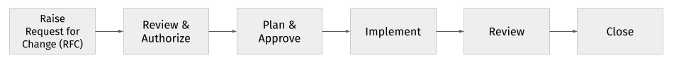
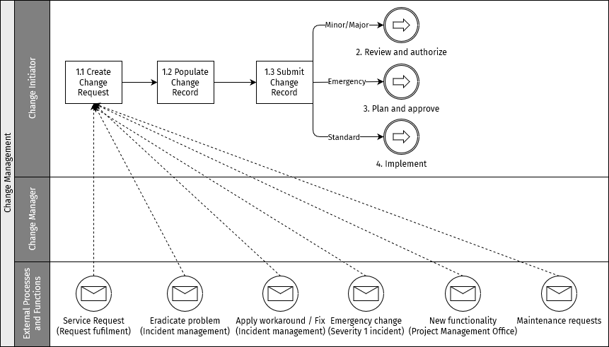
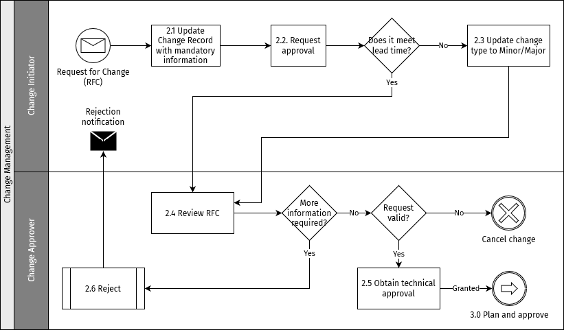
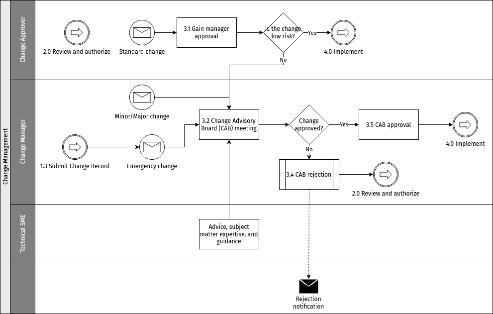
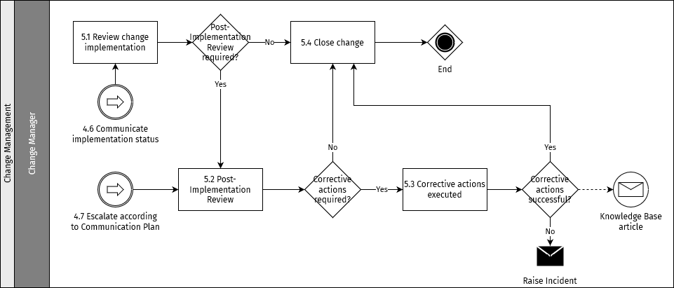

# Change management

The purpose of the change management process is to control the lifecycle of all changes, enabling changes to be made with minimum disruption to IT services.

::: tip NOTE
The processes described in this section represent best practices and act as recommendations for organizations fulfilling a Hub Operator role.
:::

## Objectives

The objectives of change management are to:

* Respond to changing business requirements while maximizing value and reducing incidents and re-work
* Respond to Requests for Change (RFCs) that will align services with business needs
* Ensure that changes are recorded and evaluated, and that authorized changes are managed in a controlled manner
* Optimize overall business risk

## Scope

The scope of change management should include changes to all architectures, processes, tools, metrics and documentation, as well as changes to all configuration items (CIs) across the whole service lifecycle.

All changes must be recorded and managed in a controlled environment across all CIs. These can be physical assets such as servers or networks, virtual assets such as virtual servers or storage, or other types of assets such as agreements or contracts.

Change management is not responsible for coordinating all of the service management processes to ensure the smooth implementation of projects.

## Roles and responsibilities

The roles listed below indicate some of the crucial stakeholders needed to make the change management process effective.

### Change Manager

The Change Manager acts as the lead, responsible for the overall change management process.

The primary responsibilities of the Change Manager are:

* Driving the efficiency and effectiveness of the change management process
* Producing management information
* Monitoring the effectiveness of change management and making recommendations for improvement
* Adherence to the change management process
* Planning and managing support for change management tools and processes
* Verifying that RFCs are correctly completed and allocated to change authorities (if applicable)
* Communicating decisions of change authorities to affected parties
* Monitoring and reviewing activities
* Publishing the change schedule and projected service outage
* Conducting post-implementation reviews to validate the results of change requests
* Determining business satisfaction with change requests

### Change Coordinator

Change Coordinators are Support staff members who handle the details of a change request.

The responsibilities of a Change Coordinator include:

* Gathering appropriate information based on the type of change being investigated
* Associating related configuration items, incidents, and services to the change request
* Providing status updates to requesters
* Reviewing change plans and schedules. Planning activities include scheduling the change request, assessing risk and impact, creating plans, defining and sequencing the tasks needed to accomplish the change request, and scheduling people and resources for each task.
* Reviewing all completed tasks. In the [Implement](#step-4-implement) stage, at least one task related to the change request is in progress.
* Conducting post-implementation reviews to validate the results of the change request
* Determining requester satisfaction with the change request

### Change Initiator

A Change Initiator is a person who initiates or requests a change, from a business or a technical role. Various people can initiate a change, this role is not exclusive to a single person. The change initiator/requester is required to provide all necessary information and justification for the change.  

Other responsibilities of a Change Initiator include:

* Completing and submitting a change proposal (if required)
* Completing and submitting a Request for Change (RFC)
* Attending Change Advisory Board (CAB) meetings to provide further information
* Reviewing changes when requested by Change Management

### Change Implementer

This is the individual deemed as the owner of the change request throughout the request lifecycle. Implementing a change requires maker/checker approval, that is, all changes require one person to perform the change and another to validate the change.

Responsibilities of a Change Implementer include:

* Liaising with the change requester for business and technical queries and issues, if any
* Creating an RFC and updating its status whenever required
* Checking and deciding an implementation date, ensuring that it does not conflict with other activities, for example, lead times, change windows, and so on
* Assessing and managing the risk involved during the change request lifecycle
* Testing and implementing the change
* Coordinating and communicating with any other impacted team prior to submitting the change (in the absence of the Change Coodinator)
* Once the change is approved, creating a remedial case for the scheduled change
* Executing the change as on the scheduled date and time
* Providing closure status after successful completion
* Documenting the change procedure after its implementation

### Change Approver

This is an individual who provides first-level approval to a Request for Change before it goes to Change Advisory Board review. Change Approvers are scoped for different Hub changes, meaning that this role may be occupied by different individuals at various hierarchal levels of the change management framework, each with their own area where they act as an approver.

Responsibilities of a Change Approver include:

* Reviewing all RFCs submitted by the change initiators/requesters
* Ensuring that the change request has reached the necessary standard of readiness to warrant a decision by the Change Manager and the CAB
* Reviewing and commenting on the content within the Change Record, namely: Change Plan, Implementation, Test and Remediation Plan, and Schedule
* Granting approval once satisfied that all relevant criteria have been met and concerns addressed OR rejecting approval by giving clear concerns and reservations about the content of the Change Record
* The outcome of failed changes where negative outcome is a result of an undetermined approval

### Technical SME

The Technical Subject Matter Expert (SME) is an individual who is an authority in a particular technical area or topic. In relation to change manangement, the SME is responsible for:

* Providing the detailed Implementation, Testing and Remediation Plans
* Attendance at CAB meeting to answer questions and concerns about the change to approvers and Change Management (if invited)
* The implementation of change tasks and updating the relevant records in the change management tool with respect to implementation status
* Reviewing and re-working a change as requested, and contributing to the review of a change post-implementation

### CAB Member

The Change Advisory Board (CAB) involves members from different domains, including information security, operations, development, networking, Service Desk, and business relations, among others. A member of the CAB has the following responsibilities:

* Circulating RFCs within their area of responsibility and coordinating feedback
* Reviewing RFCs and recommending whether they should be authorized
* Reviewing successful, failed, and unauthorized changes
* Reviewing the change schedule and projected service outage

### CAB Chair

The CAB Chair is responsible for:

* Convening and chairing CAB meetings
* Overseeing the overall change management process
* Ensuring that the CAB fulfils the charter on policies and procedures related to changes

## Change types

The change management process handles the following change types.

### Standard changes

A standard change is a change to a service or other configuration item that has been pre-authorized and so does not need to go through the approval process. In order to be considered a candidate for becoming a standard change, at least three successful minor changes must have been implemented. A request for a standard change must then be submitted to the Change Advisory Board for approval.

The risk for a standard change must be low and well-understood, the tasks must be well-known, documented and proven, and there must be a defined trigger to initiate it, such as an event or service request.

Examples of standard changes include: operating system (OS) upgrade, patch deployment, and so on.

### Minor changes

A minor change is a non-trivial change that has low impact and low risk. These are non-trivial changes that do not occur frequently but they still undergo every stage of the change lifecycle, including CAB approval. It is important to document relevant information for future reference. Over time, a minor change can be converted into a standard change.

Examples of minor changes include: website changes, performance improvements.

For a change to be classified as a minor change, it must have a lead time of less than 3 days.

### Major changes

A major change is a high-risk and high-impact change that could interrupt production live environments if not planned properly. Change evaluation is crucial to determine the schedule and approval workflow. A major change requires management approval along with CAB approval. The Request for Change (RFC) of a major change must contain a detailed proposal on cost-benefit, risk-impact analysis and financial implications, if any.

Effectively, all changes that imply downtime, specifically downtime that affects DFSP onboarding and testing activities on lower environments should be classified as major changes and should be reviewed by the CAB. These changes should be implemented in coordination with the Technical Project Manager.

For a change to be classified as a major change, it must have a lead time of 5 days or more.

### Emergency changes

An emergency change is a change that must be completed as soon as possible. An emergency change will only be accepted if it is linked to a Severity 1 Incident, which has a corresponding S1 ticket in the Service Desk tool. The Service Manager will instigate the opening of an emergency change and will instruct the Technical SME to raise it.

### Summary of lead times and approval matrix

<table>
<colgroup>
<col style="width: 33%" />
<col style="width: 33%" />
<col style="width: 33%" />
</colgroup>
<thead>
<tr class="header">
<th>Change type</th>
<th>Lead time to implement</th>
<th>Review and approval</th>
</tr>
</thead>
<tbody>
<tr class="odd">
<td>
Standard change
</td>
<td>
3 working days
</td>
<td>
Pre-approved
</td>
</tr>
<tr class="even">
<td>
Minor change
</td>
<td>
3 working days
</td>
<td><ol type="1">
<li>
CAB
</li>
<li>
Business Approvers (where applicable)
</li>
</ol></td>
</tr>
<tr class="odd">
<td>
Major change
</td>
<td>
5 working days
</td>
<td><ol type="1">
<li>
CAB
</li>
<li>
Business Approvers (where applicable)
</li>
</ol></td>
</tr>
<tr class="even">
<td>
Emergency change
</td>
<td>
ASAP
</td>
<td>
Emergency CAB or Business Owner
</td>
</tr>
</tbody>
</table>

## Change Advisory Board

The Change Advisory Board (CAB) supports change management in assessing, prioritizing, and scheduling changes. The CAB must have full visibility of all changes that could have moderate or higher risk to services and configuration items. It is important that within the CAB, there are members who can provide expertise that is adequate to assess all changes from both a business and a technical point of view.

There are permanent CAB members who are invited to all meetings but to ensure that there is a clear understanding across all stakeholder needs, other people will be asked to participate due to their expertise for a change that is to be discussed. If applicable, the external supplier may also be invited.

### CAB meeting

The CAB meeting can be held face-to-face or electronically. It may be more convenient to hold electronic meetings, however it may be more difficult to deal with questions this way. This will be the responsibility of the CAB Chair to decide depending on the situation. It is expected that CAB meetings will be electronic due to the limitations of timescales.

A CAB meeting is a formal meeting with a designated structure. Prior to any CAB meeting, the changes to be discussed must be circulated to all members. The CAB Chair is responsible for ensuring this is completed but may delegate the task to the CAB Co-Chair or any CAB Member.

All change representatives must attend or send a delegate. If there is no attendance, then the change will not be discussed and therefore not approved. All CAB attendees must come to the meeting prepared to discuss the changes they represent and to express views and opinions based on their particular area they represent.

The CAB meeting is the forum to discuss previous changes both successful and failed, and review lessons learned.

An agenda for the CAB meeting must be circulated prior to the meeting. The CAB Chair is responsible for ensuring that the structure is followed, minutes are taken, and action items are gathered to be distributed after the meeting.

## Change management process

This section provides a summary of the key activities of the change management process. Specific instructions on how to perform process activities within the context of a Service or Function may be provided by local operating procedures within a procedure manual.

All changes must be raised in the Service Desk tool.

The following figure provides a high-level summary of the change management process with the key activities:

### Step 1: Raise Request for Change (RFC)

#### Objective

The objective of this activity is to ensure that the types of change requests are adhered to so that the process can respond to and manage the environment while protecting the business.

The following figure provides a summary of the fist step of the change management process.

#### Prerequisites

Prerequisites for changes should be in line with the requirements for releases as described in the [release management process](release-management.md). The following should be clearly captured in the Service Desk tool while preparing the Change Record:

* Handover from relevant team to Operations team, including full review of the following:
    * Change Ticket or Change Record: Reason for the change including impact, risks, limitations. The categorization matrix for the change can be the same as for incidents. For details on the incident categorization matrix, see [Incident categorization matrix](incident-management.md#incident-categorization-matrix).
    * Change runbook: Steps required to make the change and roll back the change if needed
    * Test results from lower environment: Evidence that the change was tested successfully and causes no regression
    * Test plan for higher environment: What specific tests need to be run to validate the change
    * All related documentation including architecture, flowcharts, setup/configuration information, and so on have been updated
* Pre-change testing: Verify environment stability by reviewing the last Golden Path (GP) test results
* Post-change testing: Execution of the agreed tests to validate the change, and execution of the full GP tests to confirm no regression on the environment

#### Inputs

Inputs to the RFC are:

* Service Requests
* Requests from [Incident Management](incident-management.md) to apply workarounds/fixes
* Requests from [Incident Management](incident-management.md) to make emergency changes to resolve Severity 1 incidents
* New functionality requests from Project Management Office
* Maintenance requests for change

#### Outputs

Change Records containing details of RFCs for review.

### Step 2: Review and authorize

#### Objective

Changes are reviewed, and a technical approval stage determines if the required mandatory minimum information is captured to allow for an effective planning and scheduling phase.

The following figure provides a summary of the "review and authorize" step of the change management process.

#### Inputs

Change Record for review.

#### Outputs

Change Record with technical approval.

### Step 3: Plan and approve

#### Objective

Qualified Change Records that have passed an initial assessment in the previous process steps are planned and approved. The risk level of the change will direct the approval path.

The following figure provides a summary of the "plan and approve" step of the change management process.

#### Inputs

Initially authorized Change Record.

#### Outputs

Fully planned and approved Change Record.

### Step 4: Implement

#### Objective

The relevant Technical SMEs carry out the planned activities, recording any deviations, and undertaking remedial activities where applicable in accordance with the change plans to implement the requested changes.

The following figure provides a summary of the "implement" step of the change mangement process.

#### Inputs

Approved Change Record.

#### Outputs

Implemented change, failed change, backed out change, remediated failed change.

### Step 5: Close

The final activity of the process ensures that changes that are subject to a post-implementation review receive the necessary attention and that remedial activities are understood and executed.

The following figure provides a summary of the "close" step of the change mangement process.

#### Inputs

Successful changes, failed changes, failed changes with remediation.

#### Outputs

Closed changes.

## Governance

**Meeting name:** Change Advisory Board meeting

**Meeting frequency:** Weekly

**Meeting purpose:**

* Review and approve/reject proposed changes in a business and technical context
* Prioritize proposed changes according to business needs
* Perform post-implementation review of completed changes and determine/document lessons learned
* Review previously approved changes but not implemented in the previous change window and recommend follow-up action

**Meeting chair (process role):** CAB Chair

**Recommended attendees (process roles):**

* Standing CAB Members 
* Business representatives 
* Change Initiator/Implementer

**Inputs:**

* Change Schedule 
* Change Record

**Outputs:**

* Approval/rejection 
* Updated Change Records 
* Action items

### Governance for change communication

The following guidelines apply to change communication:

* Standard changes will be communicated to the internal stakeholders.
* Major, minor, and emergency changes shall be communicated to all the relevant business and technical stakeholders.
* Changes will be communicated after CAB approvals.
* At the start of the approved change window, an email update and a Slack notification (or similar) should be sent to the relevant stakeholders.
* At the end of the approved change window, an email update and a Slack notification (or similar) should be sent to the relevant stakeholders.
* External communication to customers (DFSPs) and partners of the Hub will be performed by the Service Manager.

The notification must include the following details:

* Title and description of change
* Impact to business
* Change window
* Contacts/Change Coordinator