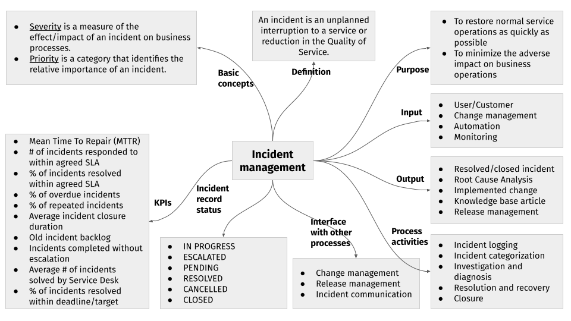
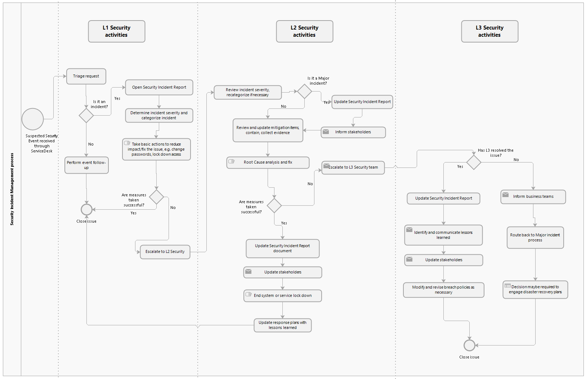

# Incident management

The main objective of incident management is to restore normal service operation as quickly as possible and to minimize the impact on business operations, thus ensuring that the best possible levels of service quality and availability are maintained. "Normal service operation" is defined here as service operation within [service level agreements (SLAs)](service-level-agreements.md).

This is achieved through a robust, well-aligned incident management process and guided by a Service Desk system that helps capture all issues, and track turnaround time (TAT) from the time an issue is reported to time of resolution and closure.

The process of incident management involves detecting an incident, recording it with all the appropriate information, analyzing the issue, correcting the defects, and restoring the service in accordance with the stipulated TAT.

This section collects the main processes, concepts, and principles around incident management.

::: tip NOTE
The processes described in this section represent best practices and act as recommendations for organizations fulfilling a Hub Operator role.
:::

::: tip NOTE
Throughout this section, the terms "client", "customer", "end user", and "user" all designate a DFSP employee. When these words are used in any other sense, the meaning of the word is called out and explained in detail.
:::

## Incident management in a single image

The following figure defines the process flow and key concepts of incident management in a single image.

<!---->

## Process boundaries

The incident management process starts when:

* an incident is triggered by a phone call/email/Service Desk interaction from users or customers
* an incident is found by way of an internal process or tool, for example, there is an event alert from one of the alert tools or monitoring systems
* Support staff at all levels (L1, L2, L3 Support Engineers) or the Service Manager directly raise an incident

The incident management process ends:

* for the customer: when ticket status in the Service Desk tool is changed to "Closed"
* for the Service Desk team: when the incident is solved and validation for closure is sent to the customer

The boundaries of incident management stipulate that the process takes into account the following prerequisites:

* A Service Level Agreement (SLA) between the Community (for example, Mojaloop), holding companies (for example, the Hub), and Digital Financial Service Providers (DFSPs) is in place.
* An SLA between the Implementing Partner (the Hub) and third-party Software Vendors (for example, Microsoft, Oracle, and so on) is in place. 
* There is an existing operational level agreement (OLA). This agreement describes the responsibilities of each internal Support group towards other Support groups, including the process and time frame for delivery of their services.

## Incident management step-by-step

This section provides a detailed description of the incident management process. All incidents raised go through the following main steps.

### Step 1: Report and log incident, change request, or question

Issues, change requests, or questions can be reported and logged via the Service Desk tool as soon as they occur. The Service Desk tool is the primary channel for receiving incident-related queries. Emails, phone calls, and instant messaging can be used as secondary channels. 

The status of tickets as captured in the Service Desk system can take the following values:

* **In Progress**: An incident that has been received via the Service Desk and assigned to a Support Engineer. Resolution efforts have commenced.
* **Escalated**: An incident that has been escalated to any party outside the Operations team, including the Product Delivery team or external L4 service providers.
* **Pending**: An incident that has been temporarily put on hold or awaiting feedback from the user or from another ticket that must be resolved before this ticket can be resolved. \
\
Bearing in mind that using the "Pending" status stops the SLA clock, the only reason that justifies the usage of "Pending" is when client action is required. This has to be an action that is the responsibility of the client/customer or their vendor and is a prerequisite to the continuation of the process; for example, requesting essential information or approval to solve the request. Tickets with Severity 1 and 2 must not be set to status "Pending". Restoring a service or a function of a service seldom depends on customer action. The only exception is when the customer stops the investigation or implementation of a solution or denies a necessary approval. In any case, the customer’s decision has to be documented.
* **Cancelled**: An incident that has been cancelled. An incident can only be cancelled when the customer initiates it.
* **Resolved**: An incident that was worked on by a Support Engineer and was fixed, and an alert has been triggered to the user to reopen if not satisfied.
* **Closed**: An incident that was closed once the resolution was acknowledged by the end user. 

All relevant information relating to incidents must be logged so that a full historical record is maintained. By maintaining accurate and complete incident records, future assigned Support group personnel are better able to resolve recorded incidents.

### Step 2: Categorize and prioritize 

The end user/requester is assigned a ticket number for reference and ease of access when the issue is acknowledged and actioned by the Support Team. The ticket should be visible by the requester (the DFSP employee who raised the issue) at all Support levels.

The requester will be automatically notified by email of any changes, status updates, requests for more information, readiness for testing, or final resolution with regards to the ticket. 

We generally classify support requests into:

* Incident
* Service Request
* Change Request or Request for Change (RFC, such as features, enhancements)

Incidents are categorized and sub-categorized based on the IT service or business area that the incident is causing a disruption to. 

These are some of the sample service categories:

* Infrastructure
* Mojaloop
* Security
* Settlements
* Onboarding

The severity of an incident can be determined using a [categorization matrix](#incident-categorization-matrix). Based on their severity, incidents can be categorized as:

* Critical = S1
* Severe = S2
* Average = S3
* Minor = S4

Once the incident is categorized, it gets automatically routed to an L1 Support Engineer with the relevant expertise.

### Step 3: Investigate and resolve

The assigned Support resource will be in charge of investigating the issue, as well as preparing the incident record, and communicating with the client on how to resolve the issue.

Incident investigation may include any of the following actions: 

* Information gathering and analysis 
* Research, including reproducing the issue 
* Acquiring additional information from other sources

Incident resolution may include any of the following actions: 

* Providing a resolution or steps towards a resolution 
* Configuration changes

Based on the complexity of the incident, it may have to be broken down into sub-tasks or tasks. Tasks are typically created when an incident resolution requires the contribution of multiple technicians from various departments.

While the incident is being processed, the Support Engineer needs to ensure the Service Level Agreement is not breached. An SLA is the acceptable time within which an incident needs a response (response SLA) or resolution (resolution SLA). SLAs can be assigned to incidents based on their parameters like service category, requester, impact, urgency, and so on. In cases where an SLA is about to be breached or has already been breached, the incident can be escalated functionally or hierarchically to ensure that it is resolved at the earliest.

An incident is considered resolved when the L1/L2/L3 Support Team has come up with a temporary workaround or a permanent solution for the issue. Workarounds may be:

* instructions provided to the customer on how to complete their work using an alternative method
* temporary fixes that assist a system to work as expected but which do not resolve the issue permanently

Workarounds need to be documented and communicated to the Service Desk so they can be added to the Knowledge Base. (It is good practice to maintain a repository of Knowledge Base articles, which describe the workaround or resolution steps of incidents that occurred in the past.) This will ensure that workarounds are accessible to the Service Desk to facilitate resolution during future recurrences of the incident.

### Step 4: Escalate

Incident escalation is recognition that there is the possibility of an incident exceeding the agreed resolution timeliness at each Support level. Clear escalation management allows the Support Team to identify, track, monitor, and manage situations that require increased awareness and swift action. 

There are two types of escalation:

* **Functional escalation**: This type of escalation comes to play when a Support level team (for example, L1) is unable to resolve the issue or stay within the agreed timeline (meaning that the targeted time for resolution is exceeded). Therefore, the case is proactively assigned to the next service level (for example, L2).
* **Hierarchical escalation**: This type of escalation acts as a means to inform all the parties involved, in a proactive manner, of a potential SLA breach. This helps in bringing order, structure, responsibility, ownership, focused management, and resource mobilization for the purpose of delivering effective and efficient services. 

### Step 5: Close incident

An incident can be closed once the issue is resolved and the user acknowledges the resolution and is satisfied with it.

## Incident categorization matrix

One of the most important stages in incident management is incident categorization. This not only helps sort incoming tickets but also ensures that the tickets are routed to the Support Engineers most qualified to work on the issue. Incident categorization also helps the Service Desk system apply the most appropriate SLAs to incidents and communicate those priorities to end users. Once an incident is categorized, Support Engineers can diagnose the incident and provide the end user with a resolution.

The following table provides guidance as to how to classify the severity of an incident.

<table>
<caption><strong>Incident categorization matrix</strong></caption>
<colgroup>
<col style="width: 16%" />
<col style="width: 83%" />
</colgroup>
<thead>
<tr class="header">
<th>Severity code</th>
<th>Criteria</th>
</tr>
</thead>
<tbody>
<tr class="odd">
<td>
Severity 1
</td>
<td><ul>
<li>
Extensive impact to the business, Production system outage, normal operation is not possible.
</li>
<li>
Any incident that resulted in a major outage of the Hub, including connectivity of multiple partners/DFSPs.
</li>
<li>
Any incident that presents major financial risks and has contractual implications.
</li>
<li>
A security incident with a major impact on the privacy or availability of the Hub, partners/DFSPs, or customer data.
</li>
</ul></td>
</tr>
<tr class="even">
<td>
Severity 2
</td>
<td><ul>
<li>
Partial outage of the Hub.
</li>
<li>
Key functionality is impaired with no workaround available.
</li>
</ul></td>
</tr>
<tr class="odd">
<td>
Severity 3
</td>
<td><ul>
<li>
Minor/moderate functional impact to a single user or small group of users. A workaround exists.
</li>
</ul></td>
</tr>
<tr class="even">
<td>
Severity 4
</td>
<td><ul>
<li>
A minor incident with (almost) no impact or detriment to the system functionality but nevertheless still a valid bug.
</li>
</ul></td>
</tr>
</tbody>
</table>

Key:

* Severity 1 = Critical
* Severity 2 = Severe
* Severity 3 = Average
* Severity 4 = Minor

The severity code assigned to an incident will determine the solution time and will be used by the Service Desk to assign resources to the request.

In addition to severity, in some cases the priority of an incident may also have to be considered. Priority is assigned by the Hub Operator (rather than the client) and is the order in which the incident will be fixed. The higher the priority, the sooner the incident will be resolved. Consider the following example: a cosmetic bug like a typo on a webpage will likely be ranked as low severity but could be a quick and easy fix and ranked high priority. Hence, it is important to give severity and priority due consideration.

The following table provides guidance as to how to assign priority to an incident.

<table>
<caption><strong>Priority matrix</strong></caption>
<colgroup>
<col style="width: 16%" />
<col style="width: 83%" />
</colgroup>
<thead>
<tr class="header">
<th>Priority code</th>
<th>Criteria</th>
</tr>
</thead>
<tbody>
<tr class="odd">
<td>
Priority 1
</td>
<td>A severe issue has occurred affecting multiple users within a service recipient (&gt;50% of service recipient users) to the extent that they are unable to perform their assigned work functions, OR the service recipient or areas outside of the service recipient are affected.</td>
</tr>
<tr class="even">
<td>
Priority 2
</td>
<td>An issue has occurred affecting either several users (affects &gt;10 but no more than 50% of all service recipient users) OR a named power user of the service to the extent that they are unable to perform their assigned work functions and a business unit is affected.</td>
</tr>
<tr class="odd">
<td>
Priority 3
</td>
<td>An issue has occurred affecting a single user OR (affects &lt;10 users OR no more than 25% of all users) to the extent that they are unable to perform their assigned work functions.</td>
</tr>
<tr class="even">
<td>
Priority 4
</td>
<td>An issue has occurred affecting a single user, causing decreased functionality to a single application. There is a workaround for the user to perform their assigned work functions, but the outage causes a decrease in their productivity.</td>
</tr>
</tbody>
</table>

## Security incidents

This section describes the procedure that a Hub Operator is recommended to implement for handling security events/incidents. Security incidents may be classified as Severity 1, Severity 2, Severity 3, or Severity 4 incidents. Regardless of its categorization, follow the steps outlined in the table below if an incident is security-related.

<table>
<caption><strong>Security incident management</strong></caption>
<colgroup>
<col style="width: 25%" />
<col style="width: 25%" />
<col style="width: 25%" />
<col style="width: 25%" />
</colgroup>
<thead>
<tr class="header">
<th colspan="2">Step</th>
<th>Additional action or information</th>
<th>Role</th>
</tr>
</thead>
<tbody>
<tr class="odd">
<td>
<strong>Step 1</strong>: A suspected security event/incident is received through the Service Desk via a ticket assigned to the security team (L1) for initial review and triage.
</td>
<td></td>
<td></td>
<td></td>
</tr>
<tr class="even">
<td>
<strong>Step 2</strong>: Invoke the triage process.
</td>
<td>
<strong>Step 2a</strong>:

<ul>
<li>
Identify artifacts of the incident.
</li>
<li>
Identify affected devices, systems, or users.
</li>
</ul></td>
<td><ul>
<li>
Gather the key indicators of a threat.
</li>
<li>
Retrieve logs.
</li>
<li>
Look up artifacts (IP addresses, usernames, URLs, hostnames, and so on).
</li>
<li>
Review logs to find out if there is any law/regulation that is being violated by the incident (if it is a severe incident, it might damage the reputation of the organization).
</li>
</ul></td>
<td>
L1 Information Security Officer (ISO)
</td>
</tr>
<tr class="odd">
<td>

</td>
<td>
<strong>Step 2b</strong>:

<ul>
<li>
Evaluate situation: impact assessment.
</li>
<li>
Estimate the potential effect of the event or incident.
</li>
</ul></td>
<td><ul>
<li>
Review available indicators of compromise.
</li>
<li>
Assess impact based on the criticality of the affected system.
</li>
<li>
Review audit logs.
</li>
<li>
Draw a timeline of events.
</li>
</ul></td>
<td>
L1 ISO
</td>
</tr>
<tr class="even">
<td>

</td>
<td>
<strong>Step 2c</strong>:

Collect evidence.
</td>
<td><ul>
<li>
Collect and collate all available information to allow for categorization.
</li>
</ul></td>
<td>
L1 ISO
</td>
</tr>
<tr class="odd">
<td>

</td>
<td>
<strong>Step 2d</strong>:

Determine categorization.
</td>
<td><ul>
<li>
Based on collected information, assign a category to the ticket.
</li>
<li>
L1 security will update categorizations as appropriate.
</li>
</ul>

Example categories are:

<ul>
<li>
Denial of Service (DOS)
</li>
<li>
Malicious code
</li>
<li>
Unauthorized access
</li>
<li>
Data leak/loss
</li>
<li>
Data breach (breach of regulation related to data protection)
</li>
<li>
Inappropriate usage
</li>
</ul></td>
<td>
L1 ISO
</td>
</tr>
<tr class="even">
<td>

</td>
<td>
<strong>Step 2e</strong>:

Take basic steps to mitigate the effect on the environment.
</td>
<td>Basic steps may include tasks such as:
<ul>
<li>
Locking down an endpoint.
</li>
<li>
Deploying anti-malware where required.
</li>
<li>
Review security Standard Operating Procedures (SOPs) (if applicable) for any additional steps that may be required.
</li>
</ul>

If mitigation steps taken are successful in resolving the reported issue, L1 Security will update the ticket and proceed to Step 8 (Close Issue).
</td>
<td>
L1/L2 ISO
</td>
</tr>
<tr class="odd">
<td>
<strong>Step 3</strong>: Make an assessment whether the reported issue is an event or an incident.
</td>
<td>

</td>
<td>
The assessment decision is taken by the L1 Security team in collaboration with L2 Security.
</td>
<td>
L1/L2 ISO
</td>
</tr>
<tr class="even">
<td>
<strong>Step 4.1</strong>: If reported issue is categorized as an "event", follow these steps:
</td>
<td>
<strong>Step 4.1a</strong>:

Perform event follow-up.
</td>
<td>Event follow-up examples include:
<ul>
<li>
Verify and install anti-malware on all hosts.
</li>
<li>
Trigger tickets requesting patching of systems and/or review of event by Operations team.
</li>
</ul></td>
<td>
L1/L2 ISO
</td>
</tr>
<tr class="odd">
<td>

</td>
<td>
<strong>Step 4.1b</strong>:

Go to Step 8.
</td>
<td></td>
<td>
L1 ISO
</td>
</tr>
<tr class="even">
<td>
<strong>Step 4.2</strong>: If reported issue is categorized as an "incident", follow these steps:
</td>
<td>
<strong>Step 4.2a</strong>:

L1 ISO to escalate to L2 ISO for further investigation by re-assigning the ticket to the L2 Security group for follow-up.
</td>
<td></td>
<td>
L1 ISO
</td>
</tr>
<tr class="odd">
<td>

</td>
<td>
<strong>Step 4.2b</strong>:

L2 ISO to acknowledge receipt of the ticket from L1 and proceed to open Security Incident Report.
</td>
<td></td>
<td>
L2 ISO
</td>
</tr>
<tr class="even">
<td>

</td>
<td>
<strong>Step 4.2c</strong>:

L2 ISO to review and verify incident severity and categorization.
</td>
<td><ul>
<li>
For incident severity definitions, see the <a href="incident-management.html#incident-categorization-matrix">categorization matrix</a>.
</li>
<li>
Proceed to Step 5.
</li>
</ul></td>
<td>
L2 ISO
</td>
</tr>
<tr class="odd">
<td>
<strong>Step 5.1</strong>: If reported incident is categorized as an "S1" incident, follow these steps:
</td>
<td>
<strong>Step 5.1a</strong>:

Update Security Incident Report.
</td>
<td></td>
<td>
L2 ISO
</td>
</tr>
<tr class="even">
<td></td>
<td>
<strong>Step 5.1b</strong>:

Inform stakeholders via secure email.
</td>
<td>
Stakeholders are documented in <a href="incident-management-escalation-matrix.html">Appendix A: Incident management escalation matrix</a>.
</td>
<td>
L2 ISO
</td>
</tr>
<tr class="odd">
<td></td>
<td>
<strong>Step 5.1c</strong>:

Proceed to Step 6.
</td>
<td></td>
<td>
L2 ISO
</td>
</tr>
<tr class="even">
<td>
<strong>Step 5.2</strong>: If reported incident is categorized as an "S4" incident, follow these steps:
</td>
<td>
<strong>Step 5.2a</strong>:

Proceed to Step 6.
</td>
<td></td>
<td>
L2 ISO
</td>
</tr>
<tr class="odd">
<td>
<strong>Step 6</strong>: Contain and eradicate.
</td>
<td>
<strong>Step 6a</strong>:

Review and update mitigation actions to reduce impact.
</td>
<td>
Example mitigation actions include:

<ul>
<li>
Change passwords.
</li>
<li>
Lock down access.
</li>
</ul></td>
<td>
L2 ISO
</td>
</tr>
<tr class="even">
<td></td>
<td>
<strong>Step 6b</strong>:

Collect evidence.
</td>
<td></td>
<td>
L2 ISO
</td>
</tr>
<tr class="odd">
<td></td>
<td>
<strong>Step 6c</strong>:

Perform root cause analysis and identify/implement a fix.
</td>
<td></td>
<td>
L2 ISO
</td>
</tr>
<tr class="even">
<td></td>
<td>
<strong>Step 6d</strong>:

Update incident Standard Operating Procedures (SOP) as necessary.
</td>
<td>
SOP updates are reviewed by L3 before adoption.
</td>
<td>
L2 ISO
</td>
</tr>
<tr class="odd">
<td>
<strong>Step 6.1</strong>: If Step 6 is successful, follow these steps:
</td>
<td>
<strong>Step 6.1a</strong>:

Update Security Incident Report and ticket.
</td>
<td>
Ensure ticket does not contain sensitive security information.
</td>
<td>
L2 ISO
</td>
</tr>
<tr class="even">
<td></td>
<td>
<strong>Step 6.1b</strong>:

Communicate with stakeholders via secure email.
</td>
<td>
Stakeholders are documented in <a href="incident-management-escalation-matrix.html">Appendix A: Incident management escalation matrix</a>.
</td>
<td>
L2 ISO
</td>
</tr>
<tr class="odd">
<td></td>
<td>
<strong>Step 6.1c</strong>:

End system or service lockdown.
</td>
<td></td>
<td>
L2 ISO
</td>
</tr>
<tr class="even">
<td></td>
<td>
<strong>Step 6.1d</strong>:

Proceed to Step 8.
</td>
<td></td>
<td>
L2 ISO
</td>
</tr>
<tr class="odd">
<td>
<strong>Step 6.2</strong>: If Step 6 is unsuccessful, follow these steps:
</td>
<td>
<strong>Step 6.2a</strong>:

Escalate to the L3 Security team.
</td>
<td></td>
<td>
L2 ISO
</td>
</tr>
<tr class="even">
<td></td>
<td>
Step <strong>6.2b</strong>:

Inform the business team.
</td>
<td></td>
<td>
L2 ISO
</td>
</tr>
<tr class="odd">
<td></td>
<td>
<strong>Step 6.2c</strong>:

L3 to proceed with Step 7.
</td>
<td></td>
<td>
L3 ISO
</td>
</tr>
<tr class="even">
<td>
<strong>Step 7</strong>: L3 to review and resolve issue.
</td>
<td>
<strong>Step 7a</strong>:

Review activities and incident history documented by L1 and L2.
</td>
<td></td>
<td>
L3 ISO
</td>
</tr>
<tr class="odd">
<td></td>
<td>
<strong>Step 7b</strong>:

Provide guidance for further containment action.
</td>
<td></td>
<td>
L3 ISO
</td>
</tr>
<tr class="even">
<td></td>
<td>
<strong>Step 7c</strong>:

If L3 resolves the issue, go to Step 8.
</td>
<td></td>
<td>
L3 ISO
</td>
</tr>
<tr class="odd">
<td></td>
<td>
<strong>Step 7d</strong>:

If L3 cannot resolve the issue, they may escalate to the system/software OEM or procure specialist services (subject to approval) for support.
</td>
<td>
If L3 cannot resolve the issue, they may escalate to the system/software OEM or procure specialist services (subject to approval) for support. A decision may be required on triggering the disaster recovery plan, including formation of a "war room".

A disaster recovery plan (DRP) is a bespoke arrangement, based on the Hub Operator's technical capabilities, as well as risk appetite. It is part of a Hub Operator's IT Security policies. It is necessary to assess details of the Hub Operator's DRP policy and expectations, and fine-tune the rollout to fit their needs. Details need to be worked out during implementation (preferably during the design phase) as the various options available may have cost implications.
</td>
<td>
L3 ISO
</td>
</tr>
<tr class="even">
<td>
<strong>Step 8</strong>: Close the issue.
</td>
<td>
<strong>Step 8a</strong>:

Restore affected systems.
</td>
<td></td>
<td>
L1 / L2 / L3 ISO
</td>
</tr>
<tr class="odd">
<td></td>
<td>
<strong>Step 8b</strong>:

Update Security Incident Report.
</td>
<td></td>
<td>
L2 / L3 ISO
</td>
</tr>
<tr class="even">
<td></td>
<td>
<strong>Step 8c</strong>:

Identify and communicate lessons learned.
</td>
<td></td>
<td>
L2 / L3 ISO
</td>
</tr>
<tr class="odd">
<td></td>
<td>
<strong>Step 8d</strong>:

Incident response team to review relevant recommendations for possible adoption.
</td>
<td>
This review session may include Tech Operations and Service Management teams, depending on severity.
</td>
<td>
L1 / L2 / L3 ISO
</td>
</tr>
<tr class="even">
<td></td>
<td>
<strong>Step 8e</strong>:

Update stakeholders.
</td>
<td></td>
<td>
L2 / L3 ISO
</td>
</tr>
<tr class="odd">
<td></td>
<td>
<strong>Step 8f</strong>:

Close issue.
</td>
<td></td>
<td>
L1 / L2 / L3 ISO
</td>
</tr>
<tr class="even">
<td>
<strong>Step 9</strong>: L3 ISO to modify and revise breach policies and procedures.
</td>
<td></td>
<td></td>
<td>
L3 ISO
</td>
</tr>
</tbody>
</table>

The following figure shows a summary of the process described above.

### Security Incident Report template

When writing a Security Incident Report, it is good practice to use a template created for this purpose.

## Roles and responsibilities

This section provides generic guidelines on the proposed roles and responsibilities within the incident management process.

::: tip NOTE
It is convenient to describe the running support for the technical operations of the Mojaloop Hub as levels. This document describes four levels. Levels are convenient because each level of support requires a different degree of knowledge of and access to the system. In other words, levels refer to different roles/Support teams within your organization.

Some of these teams can optionally be outsourced, depending on the level of expertise or capacity within your organization. If you decide to outsource Support functions, there are organizations within the Mojaloop community that do provide different levels of Support as a service. (For more information and referrals, contact the Mojaloop Foundation.)
:::

### End user/user/requester/L0

*Role*

This is the stakeholder who experiences a disruption in service and raises an incident ticket to initiate the process of incident management.

*Responsibilities*

* Contact the Service Desk to raise a new incident request.
* Follow up on an existing request.
* Monitor the communication channel for any feedback from Support Engineers.
* Clearly communicate all the required or requested information to Support Engineers.
* Acknowledge the restoration of service and completion of the ticket.
* Respond to follow-up surveys after ticket resolution completing the feedback loop.

### Level 1 Team/Service Desk

*Role*

This is the first point of contact (Support Level 1) for requesters or end users when they want to raise a request or incident. This role is responsible for basic Service Desk resolution, initial diagnostics, and the investigation of Service Desk tickets.

*Responsibilities*

* Log all incoming incident requests with appropriate parameters, such as severity and priority (if the latter is applicable).
* Assign tickets to Support Engineers based on the parameters above (severity and priority).
* Analyze and resolve incident to restore service.
* Escalate unresolved incidents to the Level 2 Team.
* Gather all required information from the requesters and send them regular updates on the status of their request.
* Act as a point of contact for requesters, and, if needed, coordinate between the Level 2 Team and end users.
* Verify the resolution with the end user and collect feedback while updating the tickets.
* Monitor feedback and surveys related to the actions that L1 took to resolve the issue for the purpose of analyzing the quality of service offered.

### Level 2 Team (Application, Infrastructure, Security and Business Operations Support L2) (Customer Support Team)

*Roles*

This support function is made up of engineers or Business Operations Subject Matter Experts (SMEs) with advanced knowledge of the Hub. The L2 Team is expected to provide in-depth troubleshooting, technical analysis, transaction analysis, and support to resolve incidents reported. They usually receive more complex requests from end users; they also receive requests in the form of escalations from the L1 Team.

*Responsibilities*

* Carry out incident diagnosis.
* Document the steps followed to resolve the incident and submit Knowledge Base articles. (For every incident, the Support Team updates the Knowledge Base. The purpose of Knowledge Base articles is to enable end users and Support personnel to resolve issues on their own.)
* Handle intermediate incidents, for example, incidents related to Applications, Infrastructure, Log Analysis, Transactions Analysis, and so on.
* If the incident is resolved, confirm the resolution with the end user.
* Support DFSP onboarding.

### Level 3 Team (Application, Infrastructure, and Security Support L3) (Technical Support Team)

*Roles*

This level is usually comprised of Specialist Engineers who have advanced knowledge of particular domains of the Hub – for example, knowledge of infrastructure components or system applications, or expertise in security engineering. 

*Responsibilities*

* Perform deep analysis and/or reproduce the issue in a test environment in order to diagnose the issue properly and to test the solution.
* Interpret and analyze the code and data using information triaged from L1 and L2.
* If unresolved, escalate the incident to "L4" support partners to identify the underlying issue or to external vendors, DFSPs or Settlement Bank (transactions queries or transfer reports) as applicable.
* Provide subject matter expertise.
* Document the incident and update the Knowledge Base. (For every incident, the Support Team updates the Knowledge Base. The purpose of Knowledge Base articles is to enable end users and Support personnel to resolve issues on their own.)

### Incident Manager/Service Manager

*Role*

The Service Manager monitors the effectiveness of the process. The Service Manager manages the process to restore normal service operation as quickly as possible and to minimize the impact on business operations. 

*Responsibilities*

* Serve as the point of contact for all S1 incidents reported.
* Plan and facilitate all the activities involved in the incident management process.
* Ensure that the correct process is followed for all tickets, and correct any deviations.
* Coordinate and communicate with the Process Owner.
* Align customer expectations with the SLAs by being the interface between customers and the Operations team.
* Identify incidents that need to be reviewed and carry out the review.

### Process Owner: Technical Operations Manager

*Role*

This is the owner of the process followed for managing incidents. This role also acts as a coordinator between teams and organizations. The Technical Operations Manager analyzes, modifies, and improves the process to ensure it best serves the interests of the organization.

*Responsibilities*

* Accountable for the overall quality of the process. Oversees the management of and compliance with the procedures, data models, policies, and technologies associated with the process.
* Owns the process and supporting documentation for the process from a strategic and tactical perspective.
* Ensures the incident management process aligns with other organization policies, for example, HR Policy, Security Policy, Level One Guiding Principles, and so on.
* Defines [key performance indicators (KPIs)](key-terms-kpis.md) and aligns them with critical success factors (CSFs), and ensures that these objectives are realized.
* Designs, documents, reviews, and improves processes.
* Establishes continuous service improvement (CSI) and ensures the procedures, policies, roles, technology, and other aspects of the incident management process are reviewed and improved upon.
* Stays informed about industry best practices and incorporates them into the incident management process.

## Outputs of the incident management process

The incident management process produces the following outputs. Note that the only mandatory output for Security or S1 incidents is the Root Cause Analysis (RCA), and all other outputs listed below might feed into the RCA.

* Resolved or closed incidents. This is the most desired outcome of the incident management process. The closed incident record contains accurate details of the incident attributes and the steps taken for resolution or workaround.
* Requests for Change (RFC).
* Resolution metrics (Mean Time Between Failures, Mean Time To Repair, Mean Time To Acknowledge, and Mean Time To Failure). For details on KPIs, see the [Glossary](key-terms-kpis.md).
* Successfully implemented change through the change management process.
* RCA document complying to the RCA template.
* Restored service.
* Updated Knowledge Base database.
* Notification through various channels (Service Desk, email, call, and so on) on the initiation, resolution, and closure of an S1 incident to various stakeholders.
* Updated Daily Operation Report and management report to ascertain the decisions made with regards to service improvements, resource allocation/reallocation.
* Accurately recorded service and/or component outage details (for example, start, end, duration, outage classification, and so on).

## Impact on other processes

The incident management process interfaces with a number of other processes, feeding into and impacting each other:

* **Change Management process**: The objective of the change management process is to ensure that standardized methods and procedures are used for efficient and prompt handling of all changes, in order to minimize the impact of change-related incidents upon service availability or quality, and consequently improve the day-to-day operations of the organization.
* **Release Management process**: Release and deployment management is defined as the process of managing, planning, and scheduling the rollout of IT services, updates, and releases to the production environment. The primary goal of this process is to ensure that the integrity of the live environment is protected and that the correct components and validated features are released for customer use.
* **Incident Communication process**: Incident communication is the process of alerting users that a service is experiencing some type of outage or degraded performance. This is especially important for services where 24/7 availability is expected. Incident communication is important for all partners, customers, and their customers.
