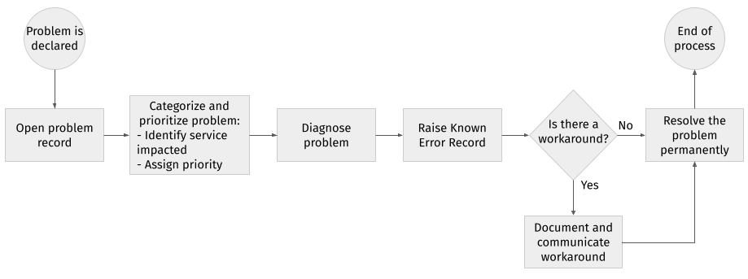

# Problem management

The overall objective of problem management is getting to the root cause of incidents (Severity 1 incidents or incidents that occurred more than once) or the potential causes of incidents, and then instigating actions to improve or correct the situation at once.

The problem management procedure ensures that:

* problems are properly logged
* problems are properly routed
* problem status is accurately reported
* queue of unresolved problems is visible and reported
* problems are properly prioritized and handled in the appropriate sequence
* resolution provided meets the requirements of the agreed upon service level agreement (SLA)
* resolution of root cause issues or problems is done

## Identifying problems

A problem is declared by the relevant service management stakeholder in the following situations:

* when there is an incident whose cause the incident owner cannot establish within set service level agreement
* when there are repeat occurrences of an incident with considerable impact to business
* when there is a service degradation or deviation from expected behavior that is likely to affect business in future if not mitigated, and whose mitigation is not well established

In any of the scenarios above, or any other scenario that the Problem Manager may deem applicable, a problem record will be opened and the problem management process kicked off.

If a problem turns out to be caused by a defect in the product, a bug is raised in accordance with the [defect triage process](defect-triage.md).

## Categorizing and prioritizing problems

In order to determine if SLAs are met, it is necessary to categorize and prioritize problems quickly and correctly.

The goal of proper categorization is to:

* identify the service impacted
* associate problems with related incidents
* indicate which Support groups need to be involved
* provide meaningful metrics on system reliability

For each problem, the specific service will be identified.

The priority assigned to a problem will determine how quickly it is scheduled for resolution. Priority is set based on a combination of the related incidents’ severity and impact.

The table below provides guidance as to how to classify a problem. For guidance on how to read this table, see the following examples:

* A problem with High severity and Low impact will be classified as a Medium-priority problem (check the cell at the junction of High severity and Low impact).
* A problem with Medium severity and High impact will be classified as a High-priority problem (check the cell at the junction of Medium severity and High impact).

<table>
<caption><strong>Problem priority matrix</strong></caption>
<colgroup>
<col style="width: 20%" />
<col style="width: 20%" />
<col style="width: 20%" />
<col style="width: 20%" />
<col style="width: 20%" />
</colgroup>
<thead>
<tr class="header">
<th></th>
<th colspan="4"><strong>SEVERITY</strong></th>
</tr>
</thead>
<tbody>
<tr class="odd">
<td></td>
<td></td>
<td>
<strong>Low</strong> 
 
The problem prevents the user from performing a portion of their duties.
</td>
<td>
<strong>Medium</strong> 
 
The problem prevents the user from performing critical time-sensitive functions.
</td>
<td>
<strong>High</strong> 
 
A service or a major portion of a service is unavailable.
</td>
</tr>
<tr class="even">
<td rowspan="3">
<strong>IMPACT</strong>
</td>
<td>
<strong>Low</strong> 
 
The problem affects one or two members of personnel.

Degraded service levels but still processing within SLAs.
</td>
<td>
Low
</td>
<td>
Low
</td>
<td>
Medium
</td>
</tr>
<tr class="odd">
<td>
<strong>Medium</strong> 
 
Degraded service levels but not processing within SLA constraints or able to perform only minimum level of service.

The cause of the problem seems to affect multiple functional areas.
</td>
<td>
Medium
</td>
<td>
Medium
</td>
<td>
High
</td>
</tr>
<tr class="even">
<td>
<strong>High</strong> 
 
All users of a specific service are affected.

A customer-facing service is unavailable.
</td>
<td>
High
</td>
<td>
High
</td>
<td>
High
</td>
</tr>
</tbody>
</table>

## Documenting workarounds

A workaround defines a temporary way of overcoming the adverse effects of a problem. Workarounds may be:

* instructions provided to the customer on how to complete their work using an alternative method
* temporary fixes that assist a system to work as expected but which do not resolve the issue permanently

Workarounds need to be documented and communicated to the Service Desk so they can be added to the Knowledge Base. This will ensure that workarounds are accessible to the Service Desk to facilitate resolution during future recurrences of the incident.

In cases when a workaround is found, it is important to document all details of the workaround within the Problem Record and that the Problem Record remains open.

## Documenting known errors

When a diagnosis is made to identify a problem and its symptoms, a Known Error Record must be raised and placed in the Known Error documentation. If repeat incidents or problems arise, they can be identified and service restored more quickly. Any workarounds or solutions should also be documented in the particular problem's Known Error Record.

In some cases it may be advantageous to raise a Known Error Record even earlier in the overall process – just for information purposes, for example – even though the diagnosis may not be complete or a workaround may not have yet been found.

The Known Error Record must contain all known symptoms so that when a new incident occurs, a search of known errors can be performed and the appropriate match found.

## Process

The following figure shows a summary of the process described above.

