# Chart Of Accounts

The purpose of this document is to guide the process of identifying the COA (Chart of Accounts) for a Mojaloop Scheme and to describe how typical transactions impact the accounts. 

This document can be used as a baseline or for reference, with acknowledgement that particular accounting systems, compliance regulation and Scheme rules, amongst other things, ultimately impact the COA and the account interactions for a Scheme. 

## Contents
* [Definitions](#definitions)
* [Overview](#overview)
* [Participant Joins Scheme](#participant-joins-scheme)
* [Participant Deposits Collateral](#participant-deposits-collateral-to-scheme)
* [Fees](#fees)
* [Payer Transfer to Payee](#transfers--clearing)
* [Settlement](#settlement)
* [Participant Withdraws Collateral](#participant-withdraw-collateral-from-scheme)
* [Participant Closes Account](#participant-closes-account)
* [References](#references)

## Definitions
| Definition     | Description                                                                                                                                                                                                                                                                                                                                                                                                                                                     |
|----------------|-----------------------------------------------------------------------------------------------------------------------------------------------------------------------------------------------------------------------------------------------------------------------------------------------------------------------------------------------------------------------------------------------------------------------------------------------------------------|
| Account        | An account that may receive debit/credit transfers.                                                                                                                                                                                                                                                                                                                                                                                                             |
| API            | Application Programming Interface. A set of clearly defined methods of communication to allow interaction and sharing of data between different software programs.                                                                                                                                                                                                                                                                                              |
| Clearing       | The process of transmitting, reconciling, and, in some cases, confirming transactions prior to settlement, potentially including the netting of transactions and the establishment of final positions for settlement. Sometimes this term is also used (imprecisely) to cover settlement. For the clearing of futures and options, this term also refers to the daily balancing of profits and losses and the daily calculation of collateral requirements.     |
| Clearing House | A central location or central processing mechanism through which financial institutions agree to exchange payment instructions or other financial obligations (for example, securities). The institutions settle for items exchanged at a designated time based on the rules and procedures of the clearinghouse. In some cases, the clearinghouse may assume significant counterparty, financial, or risk management responsibilities for the clearing system. |
| COA            | In financial accounting the Chart of Accounts refers to a list of the accounts that make up the general ledger. The accounts are available for recording transactions in the general ledger.                                                                                                                                                                                                                                                                    |
| CR             | The account to be credited by a journal entry in a double-entry accounting system.                                                                                                                                                                                                                                                                                                                                                                              |
| Deposit        | The exchange of digital/physical funds from a participant to a scheme.                                                                                                                                                                                                                                                                                                                                                                                          |
| DFSP           | Digital Financial Service Provider is an entity that provides financial services, and in this context, is a participant on a Mojaloop hub.                                                                                                                                                                                                                                                                                                                      |
| DR             | The account to be debited by a journal entry in a double-entry accounting system.                                                                                                                                                                                                                                                                                                                                                                               |
| KYC            | Know your customer/client is a financial services requirement or standard used for due diligence to establish characteristics to identify a person or any entity, their activities, the source of their funds, as a measure of authenticating legitimacy and mitigating activities such as fraud and money laundering.                                                                                                                                          |
| Liquidity      | The availability of liquid assets to support an obligation. Banks and non-bank providers need liquidity to meet their obligations. Agents need liquidity to meet cash-out transactions by consumers and small merchants.                                                                                                                                                                                                                                        |
| Participant    | A provider of financial services who is a member of a payment scheme, and subject to that scheme's rules.                                                                                                                                                                                                                                                                                                                                                       |
| Payee          | The recipient of electronic funds in a payment transaction.                                                                                                                                                                                                                                                                                                                                                                                                     |
| Payer          | The payer of electronic funds in a payment transaction.	                                                                                                                                                                                                                                                                                                                                                                                                        |
| Scheme         | A group of entities constitute a payments scheme which defines rules and agreements between payments service providers on how they transact. A Mojaloop hub operator is an administrator of the payments scheme.                                                                                                                                                                                                                                                |
| Settlement     | In financial accounting, the process where one party reimburses another party for financial obligations incurred as a consequence of transaction clearing.                                                                                                                                                                                                                                                                                                      |
| Transfer       | A debit/credit from one account with a corresponding and opposite credit/debit to another account. Another term for journal entry.                                                                                                                                                                                                                                                                                                                              |
| Withdraw       | The exchange of digital/physical funds from a scheme to a participant.                                                                                                                                                                                                                                                                                                                                                                                          |

# Overview
The sections that follow illustrate how a Mojaloop Scheme can:
* Map out the general ledger accounts for 6 typical scenarios.
* Identify the impact of the scenarios on the accounts and balances.
* Show how the accounts interact with one another, depending on the events.
* Define the main building blocks for settlement processing and describe how clearing and settlement impacts the accounts of partner settlement entities/banks.

There are 6 scenarios or user stories that are covered:

| Number | User Story                                                               |
|--------|--------------------------------------------------------------------------|
| 1      | A new participant joins an existing Mojaloop Scheme.                     |
| 2      | The new participant deposits collateral into the Mojaloop Scheme.        |
| 3      | Transfers between new and existing participants.                         |
| 4      | Settlement processing to restore liquidity between participants.         |
| 5      | A participant withdraws collateral from the Mojaloop Scheme.             |
| 6      | A participant exits the Mojaloop Scheme.                                 |

## Participant Joins Scheme
A new participant joins the scheme and the necessary participant and configuration data is provisioned in the system.
At this time the participant has no liquidity _(a current position of zero and a net debit cap of zero)_. 
All the necessary KYC requirements will be captured and completed by the DFSP for the onboarding process.

### Entities
The following entities are present for a participant joining the Scheme: 
* **Scheme** - administration by the Mojaloop Hub operator
* **Participant A** - a DFSP on the Scheme, this may be a Payer/Payee

### Events
Participant with relevant KYC information is captured, **but no financial accounts** have been created for the participant.

### Summary
No financial account has been created as yet, but if joining was successful, the participant is now ready to deposit collateral into the Scheme. 

## Participant Deposits Collateral To Scheme
Once a participant successfully joins the scheme, the next step is to provide collateral and track that collateral within the Scheme.
The collateral is a way to eliminate or mitigate settlement risk by establishing an upper limit to the settlement obligations that are possible between participants.

A participant deposits `110` units of collateral into the Scheme, which enables the participant to initiate transfers.

### Entities
The following entities are present for a participant depositing collateral into the Scheme:
* **Deposit** - Account recording the deposit of units
* **Collateral** - Account recording the collateral deposited by the participant
* **Liquidity** - Account recording the liquidity available for the participant
* **Fee** - Account recording fees charged by the Scheme
* **Signup Bonus** - Account recording Scheme signup bonuses / credit extension based on initial collateral deposit

### Events
A participant DFSP makes a cash deposit at a bank that supports loading assets into the Scheme. 
The Scheme receives a notification of the payment and the necessary accounts are created atomically, as a batch.

#### Participant A Deposits Collateral (Bank to Scheme, then Scheme to Participant):
When the Scheme receives a notification that assets have been deposited at the bank, the Scheme records entries into the deposit and collateral general ledger accounts for Participant A.

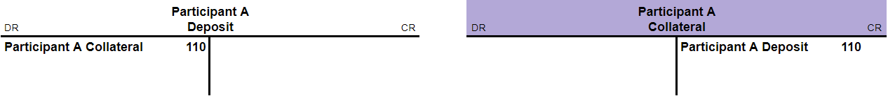

The Scheme makes it possible to set the extent to which a participant can access their available collateral.
So, the Scheme or the participant allocates a maximum of _N units_ to the liquidity account, which is smaller or equal to the collateral. In this example, all `110` units will be available to the participant for liquidity.

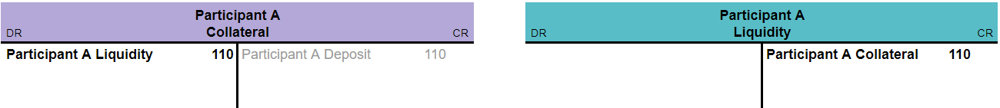

At this point, the Participant A CR liquidity balance is `110` units, with initial general ledger accounts created.

### Fees
The applicable fees are typically determined by the Scheme rules. Therefore, fees may be applicable for:
* Accounts - Once-off or recurring account service charges.
* Deposits - Applied for the deposit of collateral.
* Transfers - Charged per transaction, or based on transaction volumes, types etc. 

#### Scheme Charges Fees on Deposit of Collateral:

For this scenario, fees are applied to the participant `Liquidity` accounts. 
To illustrate, we charge deposit fees as a function of the collateral deposit amount (i.e. 110 * 18% = 20) and we charge Transfer fees as a fixed-fee per transaction. 

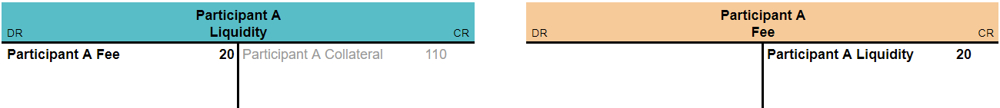

At this point, the Participant A liquidity CR balance is `110 - 20 = 90` units.
The Scheme Participant Fee account has been credited with `20` units.

#### Scheme Extends Liquidity as Sign-on Bonus:
The Scheme provides a 9.1% bonus on liquidity for a first time deposit. In this example, the bonus is a function of the initial collateral deposit amount (i.e. 110 * 9.1% = 10).

The Scheme enforces rules to ensure that participants enjoy the extension of liquidity, as a benefit, without being able to withdraw the bonus as funds from the Scheme.

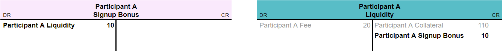

At this point, the Participant A liquidity CR balance is `90 + 10 = 100` units.
The Scheme Signup Bonus DR balance is `10` units.

### Account Balances Statement
The starting account balances are `0` units for all participants. 
The table below depicts the impact on account balances when depositing collateral into the Scheme.

| Account                    | Debits (DR) | Credits (CR) | Balance  |
|----------------------------|-------------|--------------|----------|
| Participant A Deposit      | `0`         | `0`          | `0`      |------> Opening Balance <-------
| Participant A Collateral   | `0`         | `0`          | `0`      |------> Opening Balance <-------
| Participant A Liquidity    | `0`         | `0`          | `0`      |------> Opening Balance <-------
| Participant A Fees         | `0`         | `0`          | `0`      |------> Opening Balance <-------
| Participant A Signup Bonus | `0`         | `0`          | `0`      |------> Opening Balance <-------
| **Deposit 1**              |             |              |          |------> Deposit 1 <-------
| Participant A Deposit      | `110`       |              | `DR 110` |--> Debit for Scheme
| Participant A Collateral   |             | `110`        | `CR 110` |--> Collateral from Deposit
| Participant A Collateral   | `110`       |              | `0`      |--> Liquidity from Collateral
| Participant A Liquidity    |             | `110`        | `CR 110` |--> Liquidity Available
| Participant A Liquidity    | `20`        |              | `CR 90`  |--> Fee Charge on A for Deposit
| Participant A Fees         |             | `20`         | `CR 20`  |--> Fee Recorded for Scheme
| Participant A Signup Bonus | `10`        |              | `DR 10`  |--> Signup Bonus
| Participant A Liquidity    |             | `10`         | `CR 100` |--> Credit extened to A

### Summary
* A's Deposit has a DR balance of `0 - 110 = -110`
  * `110` units deposited at the bank 
* A's Collateral has a CR balance of `0 + 110 - 110 = 0`
  * `110` units deposited as collateral, minus `110` to be made available for liquidity
* A's Liquidity has a CR balance of `0 + 110 - 20 + 10 = 100`
  * `110` units as an initial deposit;
  * deduct `20` as a charge for the deposit
  * add `10` as a first time Sign-on bonus
* A's Fees has a CR balance of `0 + 20 = 20`
  * `20` units charged for deposit on liquidity
* A's Bonus has a DR balance of `0 - 10 = -10`
  * `10` additional units for first time deposit on liquidity

## Transfers & Clearing
When a payment is made on a real-time payments system, the DFSP who is the custodian of the beneficiary’s account (the creditor DFSP) agrees to credit the beneficiary with the funds immediately.
The creditor DFSP has not yet received the funds from the DFSP who is the custodian of the debtor’s account. At this stage, the debtor DFSP has incurred an obligation to reimburse the creditor DFSP, and the obligation has been recorded in the Mojaloop Scheme.

Participant A (Payer) would like to transfer funds to Participant B (Payee).
At this time, Participant A has liquidity of `100` units.

The following transfers are created atomically and succeed or fail, as a unit:

* Participant A initiates a transfer of `70` units to Participant B. 
* Real-time clearing immediately makes liquidity available to Participant B.
* The Scheme records an outstanding obligation for settlement from DFSP A to B. 

The settlement reservation and commit are processed at a later stage, as actions from DFSP A to Scheme, and from Scheme to DFSP B.

### Entities
The following entities are present for a participant transferring liquidity to another participant:
* **Liquidity** - Account recording the liquidity available for the participant
* **Clearing** - Existing or on-demand account to record the clearing from A to B
* **Fee** - Account recording fees charged by the Scheme for the transfer

### Events
A transfer of units is made between two participants of the Scheme (Payer/Payee). 
In the 1st example, the transfer will be from Participant A *(Payer)* to Participant B *(Payee)*.
It is important for Participant A _(Payer)_ to have enough available units to cover Fee charges as part of the transfer. 
The scheme is notified of the transfer.

#### Linked Events
Linked events have the property of succeeding or failing together.
In this instance, a fee is linked to the clearing transfer to ensure that a fee can only be charged in the event of successful transfer clearing.
For this context, linked events are applicable to accounts and transfers.

#### Scheme Charges Fees on Transfer of Liquidity:
The Scheme charges a `10` unit Fee for the Transfer from A to B. Participant A *(Payer)* is liable for the charges.

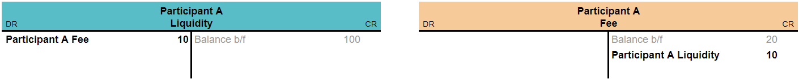

At this point, the Participant A CR liquidity balance is `90` units *(keeping in mind that the charge and transfer are linked)*.

#### Participant A Transfers Units to Participant B (Payer to Payee Direct):
Scheme allows for direct liquidity to Payee.

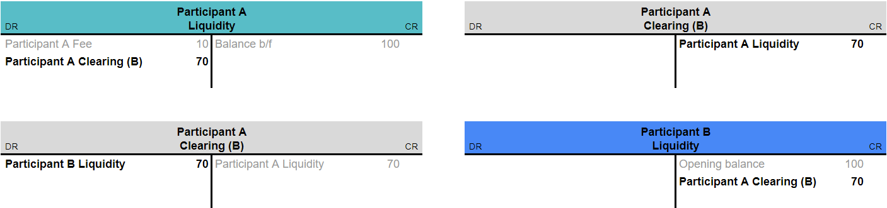

At this point, the Participant A CR liquidity balance is `20` units, while Participant B liquidity balance is `170` units as a result of the transfer.
The clearing and fee are part of a linked transfer that succeeds or fails together.
An example of a failure may be where a Payer exceeds their liquidity limit when the transfer and fee are taken into account.

### Account Balances Statement
Participant A and B's liquidity CR balances start at `100` units *(Initial deposit)*.

**Transfer 1**: Participant A transfers `70` units to Participant B.

| Account                  | Debits (DR) | Credits (CR) | Balance  |
|--------------------------|-------------|--------------|----------|
| Participant A Fees       | `0`         | `0`          | `CR 20`  |------> Opening Balance <-------
| Participant A Liquidity  | `0`         | `0`          | `CR 100` |------> Opening Balance <-------
| Participant B Liquidity  | `0`         | `0`          | `CR 100` |------> Opening Balance <-------
| Participant A Clearing B | `0`         | `0`          | `0`      |------> Opening Balance <-------
| **Transfer 1**           |             |              |          |------> Transer 1 <-------
| Participant A Liquidity  | `10`        |              | `CR 90`  |--> Fee Applied to Payer
| Participant A Fees       |             | `10`         | `CR 30`  |--> Scheme Credited for Transfer
| Participant A Liquidity  | `70`        |              | `CR 20`  |--> Deduct from A
| Participant A Clearing B |             | `70`         | `CR 70`  |--> From A liquidity to B clearing acount
| Participant A Clearing B | `70`        |              | `0`      |--> From B clearing account to B liquidity 
| Participant B Liquidity  |             | `70`         | `CR 170` |--> Funds cleared from A increase liquidity of B

Let's add Participant C into the mix. We will **exclude** any transfer fees for Transfers 2 & 3.

**Transfer 2**: Participant B pays Participant C `170` units.

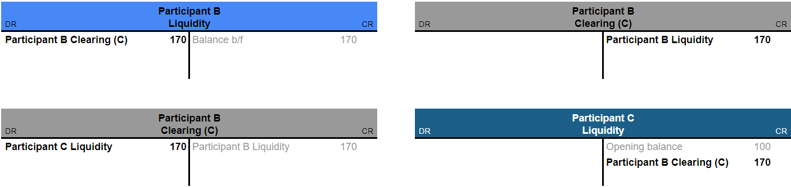

At this point, the Participant B CR liquidity balance is `0` units, while Participant C liquidity balance is `270` units.

**Transfer 3**: Participant C decides to pay Participant A `60` units.

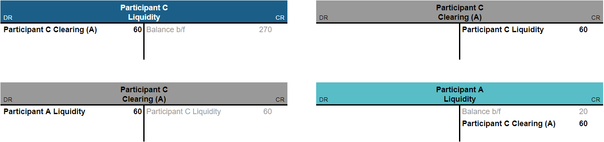

At this point, the Participant A CR liquidity balance is `80` units, 
Participant B CR liquidity balance is `0` units, while Participant C liquidity balance is `210` units.

### Account Balances Statement
The table below illustrates the account balance updates between Transfer 2 & 3.
Transfer 2 is for `170` units from Participant B to Participant C.
Transfer 3 is for `60` units from Participant C to Participant A.

| Account                   | Debits (DR) | Credits (CR) | Balance  |
|---------------------------|-------------|--------------|----------|
| Participant A Liquidity   | `0`         | `0`          | `CR 20`  |------> Opening Balance <-------
| Participant B Liquidity   | `0`         | `0`          | `CR 170` |------> Opening Balance <-------
| Participant C Liquidity   | `0`         | `0`          | `CR 100` |------> Opening Balance <-------
| Participant A Clearing B  | `0`         | `0`          | `0`      |------> Opening Balance <-------
| Participant B Clearing C  | `0`         | `0`          | `0`      |------> Opening Balance <-------
| Participant C Clearing A  | `0`         | `0`          | `0`      |------> Opening Balance <-------
| **Transfer 2**            |             |              |          |------> Transer 2 <-------
| Participant B Liquidity   | `170`       |              | `0`      |--> Deduct from B
| Participant B Clearing C  |             | `170`        | `CR 170` |--> From B liquidity to C clearing acount
| Participant B Clearing C  | `170`       |              | `0`      |--> From C clearing account to C liquidity
| Participant C Liquidity   |             | `170`        | `CR 270` |--> Funds cleared from B increase liquidity of C
| **Transfer 3**            |             |              |          |------> Transer 3 <-------
| Participant C Liquidity   | `60`        |              | `CR 210` |--> Deduct from C
| Participant C Clearing A  |             | `60`         | `CR 60`  |--> From C liquidity to A clearing acount
| Participant C Clearing A  | `60`        |              | `0`      |--> From A clearing account to A liquidity
| Participant A Liquidity   |             | `60`         | `CR 80`  |--> Funds cleared from C increase liquidity of A


### Summary
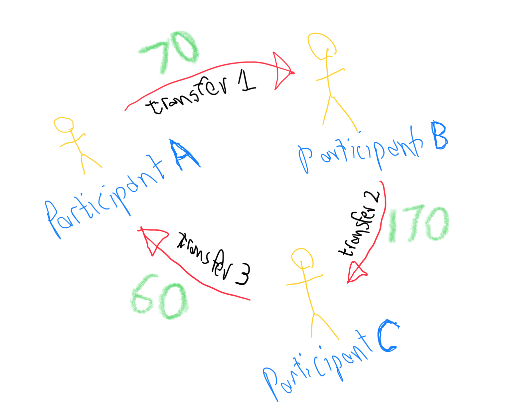

* A's Liquidity has a CR balance of  `100 - 10 - 70 + 60 = 80`
  * Opening balance of `100` units 
  * `10` units fee charge
  * `70` units transferred to B
  * `60` units received from C
* B's Liquidity has a balance of  `100 + 70 - 170 = 0`
  * Opening balance of `100` units
  * `70` units received from A
  * `170` units sent to C
* C's Liquidity has a CR balance of  `100 + 170 - 60 = 210`
  * Opening balance of `100` units
  * `170` units received from B
  * `60` units sent to A
* Total liquidity that is backed by collateral remains constant at `330` units (i.e. `110` units for each of the 3 Participants). 
* Participant B can no longer clear payments because B's liquidity is exhausted *(balance of `0`)*.
* The goal of settlement is to restore liquidity positions to what they were prior to clearing.

## Settlement
In the context of a Mojaloop Scheme, settlement is the process by which a debtor DFSP reimburses a creditor DFSP for obligations incurred as a consequence of clearing transfers.

A Settlement reservation is an instruction to reserve the amount from the Payer to the Payee, to restore liquidity positions.
The reservation restricts a Payer from any funds-out operations *(i.e. withdraw of funds from the Payer account)*.
A prerequisite of the settlement reservation is a successful transfer between Payer and Payee and the settlement reservation may be performed on a per-transaction basis, or as a batch operation *(immediate or deferred)*.

### Entities
The following entities are present for participant settlement:
* **Participant [X] Settlement [Y]** - Settlement to Payee (X) from Payer (Y)
* **Participant Liquidity** - Participant X liquidity is restored

### Events
An external or Scheme event triggers the Settlement Reservation.
In this instance, the Settlement event gets handled as a batch process.
```
DR Participant A Settlement (C)                  30
    CR Participant A Liquidity                          30

DR Participant B Settlement (C)                 110
    CR Participant B Liquidity                         110
```
At this point, the Participant A CR liquidity balance is `110` units,
Participant B CR liquidity balance is `110` units, while Participant C liquidity remains at `210` units.

### Account Balances Statement
The table below illustrates the settlement account balance updates between participants. 
There is no need to settle Participant C account, since the CR balance is above `110` units, which is the Collateral Deposit.

| Account                         | Debits (DR) | Credits (CR) | Balance  |
|---------------------------------|-------------|--------------|----------|
| Participant A Settlement C      | `0`         | `0`          | `0`      |------> Opening Balance <-------
| Participant B Settlement C      | `0`         | `0`          | `0`      |------> Opening Balance <-------
| Participant A Liquidity         | `0`         | `0`          | `CR 80`  |------> Opening Balance <-------
| Participant B Liquidity         | `0`         | `0`          | `0`      |------> Opening Balance <-------
| Participant C Liquidity         | `0`         | `0`          | `CR 210` |------> Opening Balance <-------
| **Settlement 1, 2 & 3**         |             |              |          |------> Settlement 2 & 3 <-------
| Participant A Settlement C      | `30`        |              | `DR 30`  |--> A Settlement to B
| Participant A Liquidity         |             | `30`         | `CR 110` |--> A Liquidity is restored
| Participant B Settlement C      | `110`       |              | `DR 110` |--> B Settlement to C
| Participant B Liquidity         |             | `110`        | `CR 110` |--> B Liquidity is restored


### Bilateral Net Settlement Model:
Settlement is net deferred if the overall or net effect of a collection of transfers are settled together, at a future date. Net settlement is, by definition, deferred because it takes time to construct a batch from a collection of transfers. Amongst other things, the rules of a Scheme can define a settlement window, a schedule for deferred settlement or the controls for mitigating settlement risk between Scheme participants. 

Settlement is bilateral when two participants settle with each other for the net of all transfers between them, over a period of time.

```
A owes B less what B owes A = 70
B owes C less what C owes B = 170
C owes A less what A owes C = 60

A liquidity plus settlement = 90 - 70 + 60 = 80 + 30      = 110
B liquidity plus settlement = 100 + 70 - 170 = 0 + 110    = 110
C liquidity plus settlement = 100 + 170 - 60 = 210 - 110  = 110
```

### Multilateral Net Settlement Model:
Multilateral net settlement involves a centralized entity that determines the net effect of transactions by multiple participants. In this instance, the Hub determines the net effect of all transfers by participants, and effects settlement for the net amount to the relevant participant(s).

```
If A owes someone who owes C, while C also owes A, then a central entity determines the net effect of settlement between A and C:
(there can be multiple valid ways to arrange who pays what)

In this instance:
A owes C (up to what A owes B) less what C owes A: 70 - 60 = 10
B owes C less what A owes C on B's behalf = 170 - 70 = 100

After settlement, A and B's liquidity is now both back up to 110, while C remains at 210.

This is an efficient way of doing multilateral netting because it does not require a "settlement pool," thus minimizing the number of settlement transactions.
```

## Participant Withdraw Collateral From Scheme
An existing participant A would like to withdraw the units that it had deposited.

### Entities
The following entities are present when a participant withdraws from the Scheme:
* Bank (External) - The bank account of the Scheme operator is external to the Hub
* Collateral - The collateral that had been deposited by the exiting participant
* Deposit - The deposit account of the exiting participant
* Liquidity - The exiting participant's liquidity on the Scheme
* Signup Bonus - The Scheme ensures that Participants cannot withdraw the sign-on bonus from their liquidity balance

### Events
Participant A would like to withdraw all collateral from the Scheme.
The transactions are processed as follows:
- Deduct the sign-on bonus from the liquidity account;
- Transfer the remaining Liquidity to Collateral;
- Transfer the Collateral back to the Deposit account; and then
- The Scheme notifies the bank that assets can be withdrawn from the bank.

#### Scheme Deducts The Sign-on Bonus From Participant Liquidity:
The Scheme ensures that the sign-on bonus, which had been granted to Participant A as liquidity extension upon joining the Scheme, gets deducted **before** Participant A can withdraw from the Scheme.
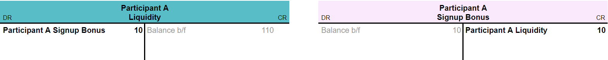

#### Transfer The Participant Liquidity To The Scheme Deposit Account:
At this point, the Participant A CR liquidity balance is `100` units, and it can be withdrawn from the Scheme.
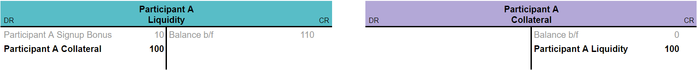
The Participant A liquidity and collateral balances are now `0` units.

Participant A is able to withdraw the remaining `100` units of collateral at a bank that supports withdrawal from the Scheme.

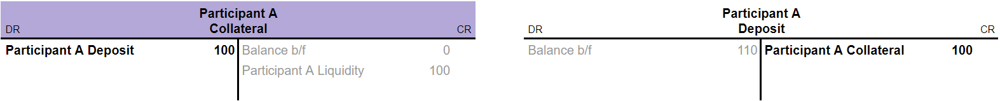


### Account Balances Statement
The table below depicts the events for withdrawing collateral from the Scheme.
The Participant A Deposit account has a DR balance of `110` units, due to the CR Participant A Fees charges incurred during deposit.  

| Account                    | Debits (DR) | Credits (CR) | Balance  |
|----------------------------|-------------|--------------|----------|
| Participant A Liquidity    | `0`         | `0`          | `CR 110` |------> Opening Balance <-------
| Participant A Collateral   | `0`         | `0`          | `0`      |------> Opening Balance <-------
| Participant A Deposit      | `0`         | `0`          | `DR 110` |------> Opening Balance <-------
| **Settlement 2 & 3**       |             |              |          |------> Settlement 2 & 3 <-------
| Participant A Liquidity    | `110`       |              | `0`      |--> A Settlement to B
| Participant A Collateral   | `110`       | `110`        | `0`      |--> Recording Collateral withdraw
| Participant A Deposit      |             | `110`        | `0`      |--> Deposit is recovered

### Summary
* A's Liquidity has a net CR balance of  `110 - 110 = 0`
    * `110` units debited to the bank where A will receive 'cash'
* A's Collateral has a net CR balance of  `0 + 110 - 110 = 0`
    * `110` units from A, then `110` units to bank
* Bank settles with Participant A outside of the Scheme

## Participant Closes Account
An account may only be closed when the DR/CR Liquidity and Collateral balance for a participant is `0` units.
The positive Participant Deposit CR balance indicates the collateral is now out of the scheme.

### Entities
The following entities are present when a participant closes their account (inactive):
* **Scheme** - administration by the Mojaloop Hub operator
* **Participant A** - a DFSP on the Scheme, this may be a Payer/Payee

### Events
Participant account state has been updated to `[closed]`.

### Summary
Participant account is now closed. Account deposit is required to re-open account.

## References
| Description                                                               | Link                                                                                                   |
|---------------------------------------------------------------------------|--------------------------------------------------------------------------------------------------------|
| Mojaloop Business Operations Documentation >> Mojaloop Ledgers in the Hub | `https://docs.mojaloop.io/mojaloop-business-docs/HubOperations/Settlement/ledgers-in-the-hub.html`     |
| Working spreadsheet for Chart of Accounts in Mojaloop                     | `https://docs.google.com/spreadsheets/d/19TnECdsKjBcJkIKWqqTUNMa8Ur21668UhxMp_8TJ81I/edit?usp=sharing` |
| Business Onboarding of DFSP                                               | `https://docs.mojaloop.io/mojaloop-business-docs/HubOperations/Onboarding/business-onboarding.html`    |
| vNext Reference Architecture - Accounts & Balances                        | `https://mojaloop.github.io/reference-architecture-doc/boundedContexts/accountsAndBalances/`           | 
| vNext Miro Board                                                          | `https://miro.com/app/board/o9J_lJyA1TA=/`                                                             |
 
