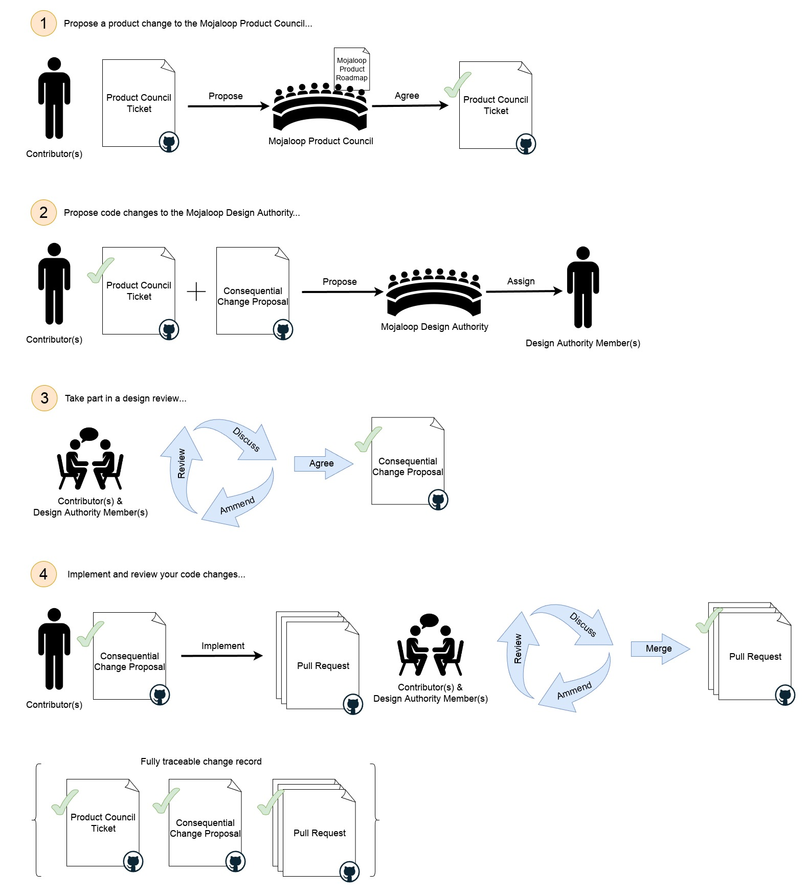

# Consequential Change Process

For changes which are covered by the [consequential change definition](./design-review.md#consequential-changes) the
following process must be followed:

1. Propose a product change to the Mojaloop Product Council:
   1. Create a 'Product Change Proposal' in the GitHub 'product-council' project
      repository [here](https://github.com/mojaloop/product-council-project/issues).
      1. Complete the template as thoroughly as possible to ensure a quick turnaround.
   2. Send a message on the [#product-council](https://mojaloop.slack.com/archives/C01FF8AQUAK) slack channel asking for
      a review of your proposal.
   3. The Product Council will discuss your proposal with you and identify an appropriate Mojaloop workstream.
2. Propose code changes to the Mojaloop Design Authority:
    1. Create a 'Consequential Change Proposal' issue in the GitHub 'design-authority-project'
       repository [here](https://github.com/mojaloop/design-authority-project/issues).
        1. Complete the template as thoroughly as possible to ensure a quick turnaround.
    2. Send a message on the [#design-authority](https://mojaloop.slack.com/archives/CARJFMH3Q) slack channel asking for
       a review of your proposal.
    3. The design authority will assign one or more members to work with you on your proposal.
3. Take part in a design review:
    1. Your assigned design authority member(s) will guide you through an iterative design review process.
    2. Once the design review process is complete you may proceed with your change.
    3. Once you have implemented your change, your assigned design authority member(s) will review your code changes
       with you.
    4. Any changes to the design made during implementation must be recorded on the proposal ticket.
4. Implement and review your code changes:
   1. 

## What to expect during the design review process

_The Mojaloop Design Authority has responsibility for ensuring risks are identified and mitigated appropriately and that
our established standards for tools, patterns and practices are upheld. Your assigned design authority member(s) are
there to help you achieve the best possible outcome for yourself and the entire Mojaloop community._

Your assigned design authority member(s) will help you identify and mitigate any risks your change may introduce as well
as discussing how your design aligns with established tools, patterns and practices.

1. You will be asked to talk through the reason(s) for your proposed change and to explain what you wish to achieve and
   how you intend to achieve it.
    1. You should be able to refer to an existing Mojaloop Product Council GitHub ticket showing that you have discussed
       your work with them and they are happy for the change to be made. Note that the Product Council has a
       responsibility to maintain a coherent roadmap for our technology and will guide you on the most appropriate way
       to achieve your business objectives within the Mojaloop context. The Product Council may consult the Design
       Authority as part of this process.
    2. You should be able to explain how your change will be implemented, which existing components will be affected and
       your designs for any new components. Your designs should be presented, as a minimum, as UML sequence diagrams
       showing each significant component involved in your usecase(s) and how they interact to achieve your desired
       outcomes. You should make sure to include error cases as well as "normal" expected behaviours.
    3. Your assigned Design Authority members will likely ask lots of questions in order to fully understand your
       proposal and its context.
2. Your assigned design authority member(s) will help you identify any other potentially impacted contributors, teams or
   stakeholders to bring them in to the review process. This is done to ensure up and downstream behaviours are not
   adversely affected and also, to take into account any upcoming changes in other areas of the system. Mojaloop is a
   large system and it is often helpful to bring in experts from other areas to assist.
3. The primary goal of your assigned Design Authority member(s) is to identify and mitigate risks that you may not have
   spotted.
    1. Your assigned design authority member(s) may make suggestions to mitigate risk from your design and may ask you
       to make specific changes to bring your proposal in line with any established Mojaloop constraints.

