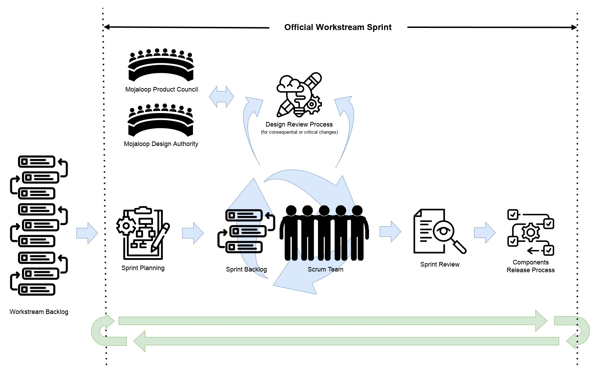

# Mojaloop Product Engineering Process

## Introduction

Mojaloop software is intended to form the backbone of nation scale inclusive instant payments schemes. These schemes are
important pieces of regulated national financial infrastructure which facilitate the life critical daily activities of a
great number of people, such as purchasing food and clean drinking water. Our adopters, their regulators and the people
transacting through Mojaloop schemes demand and deserve an extremely high level of quality, security, reliability and
resilience from our products.

In order to maintain these qualities and mitigate the many business and technical risks our adopters and their
stakeholders face, the Mojaloop Foundation implements a structured product engineering process based on best
demonstrated industry practices for regulated financial software which includes managed technical and process driven
change control and traceability, technical design and code reviews, high thresholds for testing and multiple levels of
quality assurance gates.

Our process is intended to help our contributors identify and mitigate risks while enhancing our products, for the
benefit of the entire Mojaloop community.

## Evolution of our process

Since 2017 when the Mojaloop project cut its first code, our process model has evolved to cope with the
transition from a single engineering team to a number of community resourced workstreams, each focused on developing
specific areas of a large product suite.

Our current model is based on the [Scaled Agile Framework](https://scaledagileframework.com/) which we use to facilitate
a number of teams working as independently as possible to deliver a coordinated set of roadmap outcomes across our
entire product space.

Our model is a cycle of "[program increments](https://v5.scaledagileframework.com/program-increment/)", each lasting
approximately four calendar months. At the end of each increment, workstreams present their accomplishments at a
community meeting, new code is released and planning for the next increment begins.

## Product Requirements Flow

Feature requests and new requirements come from a variety of sources, for example:

- Current Mojaloop adopters and Mojaloop scheme participants
- Payment scheme operators wishing to benefit from Mojaloop technology
- Government departments wishing to implement inclusive payment schemes in their countries
- Financial inclusion experts
- Mojaloop community members

These new requirements and feature requests are gathered and analysed by the Mojaloop product council. If sufficient
demand and willingness to contribute is evident then these are fed into the Mojaloop Product Roadmap and allocated to an
official Mojaloop workstream. If no appropriate workstream exists then a new one may be created and resourced by the
community.

Workstreams typically have a set of objectives defined at the beginning of each Mojaloop programme increment, but high
priority feature requests may be inserted during an increment.

Workstreams deliver their output into a controlled process which periodically makes official releases of the
Mojaloop software. The Mojaloop release process tends to align with program increments; major releases, which
include new features, are typically made close to the end of an increment. Minor and patch releases are made more
frequently and may include high priority features, bug fixes or security patches for example.

## Mojaloop Workstreams

Official workstreams are the "production lines" of the Mojaloop community software factory, this is where the bulk of
product development work happens. Typically there are many workstreams running in parallel, each focused on specific
areas or features of the platform.

### Governance Model & Operating Requirements

Mojaloop workstreams have a clearly defined governance model and operating requirements to minimize risks to all
stakeholders:

1. Workstreams must have a clear and concise name which reflects their purpose.
2. Workstreams must have a named individual as leader at all times; in some circumstances the workstream lead position
   may be shared by two individuals if neither has sufficient time to contribute.
3. Workstreams must have a named individual as a liaison with the Mojaloop Design Authority. This may be the same
   individual(s) as the workstream leader or a different nominated individual.
4. Workstreams must publish and maintain a description which explains their purpose, objectives and scope for each
   program increment on community central.
5. Workstreams must have a minimum of two named, active contributors.
6. Workstreams must operate a minimum of one online meeting per week.
    1. Workstream meetings should be considered open for other community members to observe.
    2. Workstream meetings should be recorded and recordings should be published publicly.
7. Workstreams with more than two active contributors should operate a scrum style stand-up online meeting.
    1. Stand-up meetings should be daily, unless the volume of work is low, in which case a less frequent cadence may
       be acceptable.
8. Workstreams must maintain a public github repository containing all related code, documentation and work items.
9. Workstreams must adhere to all [Mojaloop design and code review processes](./design-review.md) before, during
   and after work has been completed.
10. Workstreams must obtain and use a specific hashtag on community central when making posts.
11. Workstreams must be reviewed by the Mojaloop Product Council before commencement of each program increment.
    1. Workstream objectives must be aligned with the Mojaloop product roadmap.
    2. Workstream objectives must be aligned with the mission of the Mojaloop Foundation.

### Workstream Leadership Criteria and Responsibilities

The Mojaloop Foundation appoints leads who are typically volunteers from the community with a high level of relevant
expertise or experience.

To qualify as a workstream (co)lead, individuals should meet the following criteria:

1. Commitment and ability to fulfil all workstream lead responsibilities (see below).
2. Demonstrable organizational ability.
3. Demonstrable leadership ability.
4. Demonstrable relevant technical ability.
5. Familiarity with Mojaloop ecosystem.
6. Commitment for the duration of the PI.

Workstream (co)leads must accept the following responsibilities:

1. To be a primary point of contact for queries.
2. To schedule, hold, record and publish recordings and minutes of workstream meetings.
3. To facilitate liaison between workstream contributors, other workstreams and the rest of the community.
4. To create, publish on community central and maintain a workstream team charter document.
5. Report Progress to...
    1. ...the community regularly on Community Central using assigned hashtag.
    2. ...the Product Manager/Product Council.
6. Ensure all work items adhere to all [Mojaloop design and code review processes](./design-review.md) before, during
   and after work has completed.
7. Ensure all work adheres to Mojaloop quality standards such as style, test coverage and documentation.
8. Ensure all work is tracked in GitHub/Zenhub and timelines and progress are updated.
9. Ensure all technical output is tested by the core team before integration into the official release process. For
   non-technical workstreams output should be reviewed by the Mojaloop Foundation Product Director.
10. Facilitate building new features and write code as necessary.
11. Triage/review contributions, issues, and respond to users.
12. File bug reports / fixes and resolve conflicts in the workstream.
13. Proactively manage technical debt and improve existing code, while adhering to
    all [Mojaloop design and code review processes](./design-review.md).
14. Ensure documentation meets the required standards.
15. Guide the workstream strategic direction in collaboration with the Mojaloop Foundation Product Director and Product
    Council.
16. Define SMART objectives at the beginning of each PI.

### Defining Work

Workstreams must define and record publicly, via github/zenhub issues, the work they plan to undertake and the
progress they make during implementation:

1. Work items must be recorded in GitHub as project issues; use of zenhub is not mandatory but is highly encouraged.
    1. Each workstream has its own GitHub project and zenhub workspace for managing work items.
2. Work items, also known as "user stories", should be defined in
   the “As a... I want to... So That...”
   [behaviour driven development style](https://www.agilealliance.org/glossary/user-story-template/).
3. Work items should include detailed acceptance criteria defined in the "given, when,
   then" [behaviour driven development style](https://www.agilealliance.org/glossary/given-when-then/).
4. Work items must be sized so the expected duration of any item or sub item does not exceed a single two week sprint.
5. Work items must adhere to all [Mojaloop design and code review processes](./design-review.md) before, during and
   after work has completed. Where design review is required, "spike" tickets should be used to track the design process
   before work item tickets are created.
    1. All required design documentation must be approved by the Mojaloop Design Authority before work commences.

A github/zenhub ticket template is available here: [github-work-item-template.docx](github-work-item-template.docx)

### Getting Work Done

Mojaloop workstreams should follow a [scrum](https://www.scrum.org/resources/what-scrum-module)-like process model by
default, running over a two-week sprint cadence. Given the stringent risk management requirements of our users
regulatory environments and best demonstrated practice for financial software, our day-to-day process differs from some
typical agile methodologies in that we implement mandatory oversight functions and stricter change control mechanisms,
more typical of larger technical organisations building and operating critical infrastructure.

Workstreams have flexibility to adjust working methods to suit their particular circumstances, within sensible
boundaries appropriate for our mission and regulatory domain. The Mojaloop Foundation provides guidance to workstreams
to ensure they remain within our required operating standards.

Workstreams should operate regular scheduled standup, backlog refinement, sprint planning, sprint review and
retrospective activities.

It is recommended that every workstream define and maintain a "team charter" document to clearly and unambiguously
communicate agreed ways of working for all contributors.

A workstream team charter template is available for download
here: [workstream-team-charter-template.docx](workstream-team-charter-template.docx)

### Getting Support

When things do not go to plan and a resolution cannot be found among workstream contributors, the Mojaloop Foundation
provides support mechanisms. Please contact the Mojaloop Foundation Director of Community who will guide you to find a
resolution.

## Non-Official Workstreams and External Contributions

When an appropriate existing workstream may not exist and support is not sufficient to warrant creation of a new
official workstream, contributors may decide to work on features or changes externally to the community processes. In
these circumstances
our [external donation process](../standards/guide.md#adopting-open-source-contributions-into-mojaloop) must be followed
before code, documentation or other artifacts can be adopted by the Mojaloop Foundation.

Please note that all work done outside of official Mojaloop workstream processes is subject to
our [external donation process](../standards/guide.md#adopting-open-source-contributions-into-mojaloop). This is to
ensure an appropriate amount of rigorous review to ensure our standards are met before inclusion in any official
Mojaloop release.