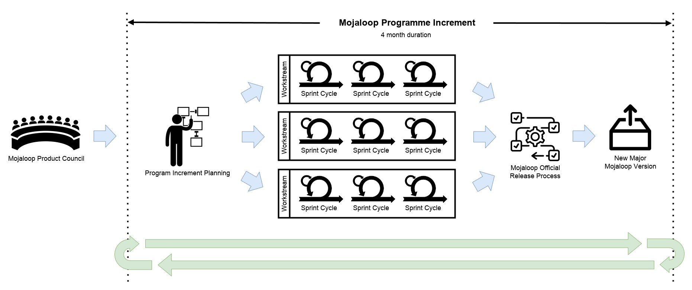

# Mojaloop Product Engineering Process

Mojaloop software is intended to form the backbone of nation scale inclusive instant payments schemes. These schemes
are important pieces of national financial infrastructure which facilitate the life critical daily activities of a
great number of people, such as purchasing food and clean drinking water. Adopters and users of Mojaloop software demand
and deserve an extremely high level of quality, security, reliability and resilience from our products.

In order to maintain these qualities the Mojaloop Foundation implements a rigorous product engineering process which
includes strict requirements for technical design review and code review, testing and quality assurance.

Our process is intended to help our contributors identity and mitigate risks while enhancing our products, for the
benefit
of the entire Mojaloop community.

Since 2017 when the Mojaloop project cut its first code, our process model has evolved to cope with the
transition from a single engineering team to a number of community resourced workstreams, each focused on developing
specific areas of a large product suite.

Our current model is based on [Scaled Agile Framework](https://scaledagileframework.com/) which we use to facilitate a
number of teams working as independently as possible to deliver a coordinated set of roadmap outcomes across our
entire product space.

Our model is a cycle of "[program increments](https://v5.scaledagileframework.com/program-increment/)", each lasting
approximately four calendar months. At the end of each increment, workstreams present their accomplishments at a
community meeting and planning for the next increment begins.

**_Mojaloop is open-source software, but that does not mean we dont follow the best demonstrated industry practices and
risk management strategies appropriate for our market._**

## Product Requirements Flow

Feature requests and new requirements come from a variety of sources, for example:

- Current Mojaloop adopters and Mojaloop scheme participants
- Payment scheme operators wishing to benefit from Mojaloop technology
- Government departments wishing to implement inclusive payment schemes in their countries
- Financial inclusion experts
- Mojaloop community members

These new requirements and feature requests are gathered and analysed by the Mojaloop product council. If sufficient
demand and willingness to contribute is evident then these are fed into the Mojaloop Product Roadmap and allocated to an
official Mojaloop workstream. If no appropriate workstream exists then a new one may be created and resourced by the
community.

Workstreams typically have a set of objectives defined at the beginning of each Mojaloop programme increment, but high
priority feature requests may be inserted during an increment.

Workstreams deliver their output into a controlled process which periodically makes official releases of the
Mojaloop software. The Mojaloop release process tends to align with program increments; major releases, which
include all new features, are typically made close to the end of an increment. Minor and patch releases are made more
frequently and may include high priority features, bug fixes or security patches for example.

## Mojaloop Workstreams

Mojaloop worstreams follow a scrum-like process model by default, running over a two-week sprint cadence.

Workstreams have flexibility to adjust working methods to suit their particular circumstances, within sensible
boundaries appropriate for our mission. The Mojaloop Foundation provides guidance to workstreams to ensure they remain
within our expected operating standards.

### Governance Model & Operating Requirements

Mojaloop workstreams have a clearly defined governance model and operating requirements to minimize risks to all
stakeholders:

1. Workstreams must have a clear and concise name which reflects their purpose.
2. Workstreams must have a named individual as leader at all times; in some circumstances the workstream lead position
   may be shared by two individuals if neither has sufficient time to contribute.
5. Workstreams must publish and maintain a description which explains their purpose, objectives and scope for each
   program increment on community central.
6. Workstreams must have a minimum of two named, active contributors.
7. Workstreams must operate a minimum of one online meeting per week.
    1. Workstream meetings should be considered open for other community members to observe.
    2. Workstream meetings should be recorded and recordings should be published publicly.
8. Workstreams with more than two active contributors should operate a scrum style stand-up online meeting.
    1. Stand-up meetings should be daily, unless the volume of work is low, in which case a less frequent cadence may
       be acceptable.
9. Workstreams must maintain a github repository containing all related documentation and work items.
10. Workstreams must obtain and use a specific hashtag on community central when making posts.
11. Workstreams must be reviewed by the Mojaloop Product Council before commencement of each program increment.
    1. Workstream objectives must be aligned with the Mojaloop product roadmap.
    2. Workstream objectives must be aligned with the mission of the Mojaloop Foundation.

### Workstream Leadership Criteria and Responsibilities

To qualify as a workstream (co)lead, individuals must meet the following criteria:

1. Commitment and ability to fulfil all workstream lead responsibilities.
2. Demonstrable organizational ability.
3. Demonstrable leadership ability.
4. Demonstrable technical ability.
5. Familiarity with Mojaloop ecosystem.
6. Commitment for the duration of the PI.

Workstream (co)leads must accept the following responsibilities:

1. To be a primary point of contact for queries.
2. To schedule, hold and record workstream meetings as required.
3. To facilitate liaison between workstream contributors, other workstreams and the rest of the community.
4. Report Progress to...
    1. ...the community regularly on Community Central using assigned hashtag.
    2. ...the Product Manager/Product Council.
5. Ensure all work items adhere to all [Mojaloop design and code review processes](./design-review.md) before, during
   and after work has begun.
6. Ensure all work adheres to Mojaloop quality standards such as style, test coverage and documentation.
7. Ensure work is tracked in GitHub/Zenhub and timelines and progress are updated.
8. Ensure technical output is tested by the code maintenance team. For non-technical workstreams the workstream should
   be reviewed by someone outside the workstream.
9. Facilitate building new features and write code as necessary.
10. Triage/review contributions, issues, and respond to users.
11. File bug reports / fixes and resolve conflicts in the workstream.
12. Proactively manage technical debt and improve existing code.
13. Ensure documentation meets the required standards.
14. Guide the workstreams’ strategic direction in collaboration with the Product Manager and Product Council.
15. Define SMART objectives at the beginning of each PI.

### Defining Work

Workstreams must define and record publicly, via github/zenhub issues, the work they plan to undertake and the
progress they make during implementation:

1. Work items, also known as "user stories", should be defined in
   the “As a... I want to... So That...”
   [behaviour driven development style](https://www.agilealliance.org/glossary/user-story-template/).
2. Work items should include detailed acceptance criteria defined in the "given, when,
   then" [behaviour driven development style](https://www.agilealliance.org/glossary/given-when-then/).
3. Work items should be sized so the expected duration of any item or sub item does not exceed a single two week sprint.
4. Work items must adhere to all [Mojaloop design and code review processes](./design-review.md) before, during and
   after work has begun. Where design review is required, "spike" tickets should be used to track the design process
   before work item tickets are created.
    1. All required design documentation must be approved by the Mojaloop Design Authority before work commences.

### Getting Work Done

