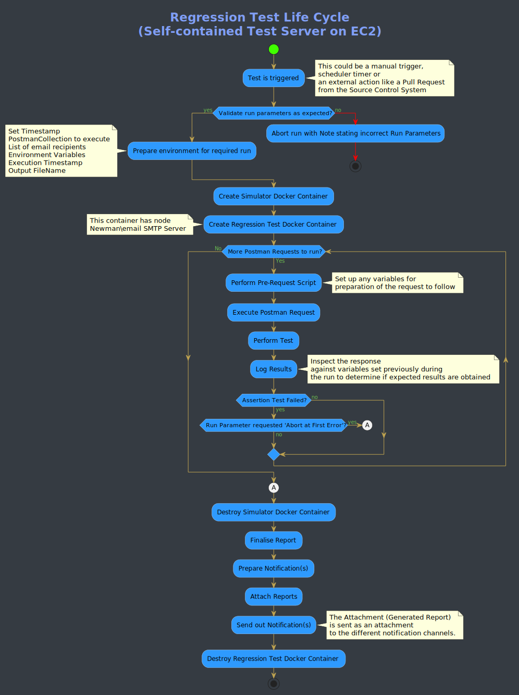

# QA and Regression Testing in Mojaloop
An overview of the testing framework set up in Mojaloop

Contents:
1. [Regression requirements](#regression-topics)
2. [Developer Testing](#developer-testing)
3. [Postman and Newman Testing](#postman-and-newman-testing)
4. [Executing regression test](#executing-regression-test)
5. [Process flow of a typical Scheduled Test](#process-flow-of-a-typical-scheduled-test)
6. [Newman Commands](#newman-commands)

## Regression Topics
 In order for a deployed system to be robust, one of the last checkpoints is to determine if the environment it is deployed in, is in a healthy state and all exposed functionality works exactly the way as intended.

 Prior to that though, there are quite a number of disciplines one must put in place to ensure maximum control.

 To illustrate how the Mojaloop project reaches this goal, we are going to show you the various checkpoints put in place.

### Developer Testing
 Looking at each component and module, inside the code base, you will find a folder named "*test*" which contain three types of tests.
 + Firstly, the *coverage test* which alerts one if there are unreachable or redundant code
 + Unit Tests, which determines if the intended functionality works as expected
 + Integration Tests, which does not test end-to-end functionality, but the immediate neighbouring interaction
 + Automated code-standard checks implemented by means of packages that form part of the code base

 These tests are executed by running the command line instructions, by the developer, during the coding process. Also, the tests are automatically executed every time a *check-in* is done and a Github Pull-Request issued for the code to be integrated into the project.

 The procedure described above, falls outside the realm of Quality Assurance (QA) and Regression testing, which this document addresses.

 Once a developer has written new functionality or extended existing functionality, by having to go through the above rigorous tests, one can assume the functionality in question is executing as intended. How does one then ensure that this new portion of code does not negatively affect the project or product as a whole?

 When the code has passed all of the above and is deployed as part of the CI/CD processes implemented by our workflow, the new component(s) are accepted onto the various hosts, cloud-based or on-premise implementations. These hosts ranges from development platforms through to production environments.

### Postman and Newman Testing
 Parallel to the deployment process is the upkeep and maintenance of the [Postman](https://github.com/mojaloop/postman.git "Postman") Collection testing Framework. When a new release is done, as part of the workflow, Release Notes are published listing all of the new and/or enhanced functionality implemented as part of the release. These notes are used by the QA team to extend and enhance the existing Postman Collections where tests are written behind the request/response scripts to test both positive as well as negative scenarios agains the intended behaviour. These tests are then run in the following manner:
 + Manually to determine if the tests cover all aspects and angles of the functionality, positive to assert intended behaviour and negative tests to determine if the correct alternate flows work as intended when something unexpected goes wrong
 + Scheduled - as part of the Regression regime, to do exactly the same as the manual intent, but fully automated (with the *Newman Package*) with reports and logs produced to highlight any unintended behaviour and to also warn where known behaviour changed from a previous run.

In order to facilitate the automated and scheduled testing of a Postman Collection, there are various methods one can follow and the one implemented for Mojaloop use is explained further down in this document.

There is a complete repository containing all of the scripts, setup procedures and anything required in order to set up an automated [QA and Regression Testing Framework](https://github.com/mojaloop/ml-qa-regression-testing.git "QA and Regression Testing Framework"). This framework allows one to target any Postman Collection, specifying your intended Environment to execute against, as well as a comma-separated list of intended email recipients to receive the generated report. This framework is in daily use by Mojaloop and exists on an EC2 instance on AWS, hosting the required components like Node, Docker, Email Server and Newman, as well as various Bash Scripts and Templates for use by the framework to automatically run the intended collections every day. Using this guide will allow anyone to set up their own Framework.

#### Postman Collections

There are a number of Postman collections in use throughout the different processes:

For Mojaloop Simulator:

+ [MojaloopHub_Setup](https://github.com/mojaloop/postman/blob/master/MojaloopHub_Setup.postman_collection.json) : This collection needs to be executed once after a new deployment, normally by the Release Manager. It sets up an empty Mojaloop hub, including things such as the Hub's currency, the settlement accounts.
+ [MojaloopSims_Onboarding](https://github.com/mojaloop/postman/blob/master/MojaloopSims_Onboarding.postman_collection.json) : MojaloopSims_Onboarding sets up the DFSP simulators, and configures things such as the endpoint urls so that the Mojaloop hub knows where to send request callbacks.
+ [Golden_Path_Mojaloop](https://github.com/mojaloop/postman/blob/master/Golden_Path_Mojaloop.postman_collection.json) : The Golden_Path_Mojaloop collection is an end-to-end regression test pack which does a complete test of all the deployed functionality. This test can be run manually but is actually designed to be run from the start, in an automated fashion, right through to the end, as response values are being passed from one request to the next. (The core team uses this set to validate various releases and deployments)
    + Notes: In some cases, there is need for a delay of `250ms` - `500ms` if executed through Postman UI Test Runner. This will ensure that tests have enough time to validate requests against the simulator. However, this is not always required.
+ [Bulk_API_Transfers_MojaSims](https://github.com/mojaloop/postman/blob/master/Bulk_API_Transfers_MojaSims.postman_collection.json) : This collection can be used test the bulk transfers functionality that targets Mojaloop Simulator.

For Legacy Simulator (encouraged to use Mojaloop Simulator, as this will not be supported starting PI-12 (Oct 2020) ):

+ [ML_OSS_Setup_LegacySim](https://github.com/mojaloop/postman/blob/master/ML_OSS_Setup_LegacySim.postman_collection.json) : This collection needs to be executed once after a new deployment (if it uses Legacy Simulator), normally by the Release Manager. It sets up the Mojaloop hub, including things such as the Hub's currency, the settlement accounts along with the Legacy Simulator(s) as FSP(s).
+ [ML_OSS_Golden_Path_LegacySim](https://github.com/mojaloop/postman/blob/master/ML_OSS_Golden_Path_LegacySim.postman_collection.json) : The Golden_Path_Mojaloop collection is an end-to-end regression test pack which does a complete test of all the deployed functionality. This test can be run manually but is actually designed to be run from the start, in an automated fashion, right through to the end, as response values are being passed from one request to the next. (The core team uses this set to validate various releases and deployments)
    + Notes: In some cases, there is need for a delay of `250ms` - `500ms` if executed through Postman UI Test Runner. This will ensure that tests have enough time to validate requests against the simulator. However, this is not always required.
+ [Bulk API Transfers.postman_collection](https://github.com/mojaloop/postman/blob/master/Bulk%20API%20Transfers.postman_collection.json) : This collection can be used test the bulk transfers functionality that targets Legacy Simulator.
    
#### Environment Configuration

You will need to customize the following environment config file to match your deployment environment:
+ [Local Environment Config](https://github.com/mojaloop/postman/blob/master/environments/Mojaloop-Local.postman_environment.json)

_Tips:_ 
- _The host configurations will be the most likely changes required to match your environment. e.g. `HOST_CENTRAL_LEDGER: http://central-ledger.local`_
- _Refer to the ingress hosts that have been configured in your `values.yaml` as part of your Helm deployment._

### Executing regression test
For the Mojaloop QA and Regression Testing Framework specifically, Postman regression test can be executed by going into the EC2 instance via SSH, for which you need the PEM file, and then by running a script(s).

Following the requirements and instructions as set out in the detail in [QA and Regression Testing Framework](https://github.com/mojaloop/ml-qa-regression-testing.git "QA and Regression Testing Framework"), everyone will be able to create their own Framework and gain access to their instance to execute tests against any Postman Collection targeting any Environment they have control over.

##### Steps to execute the script via Postman UI
+ Import the desired collection into your Postman UI. You can either download the collection from the repo or alternatively use the `RAW` link and import it directly via the **import link** option.
+ Import the environment config into your Postman UI via the Environmental Config setup. Note that you will need to download the environmental config to your machine and customize it to your environment.
+ Ensure that you have pre-loaded all prerequisite test data before executing transactions (party, quotes, transfers) as per the example collection [OSS-New-Deployment-FSP-Setup](https://github.com/mojaloop/postman/blob/master/OSS-New-Deployment-FSP-Setup.postman_collection.json):
  + Hub Accounts
  + FSP onboarding
  + Add any test data to Simulator (if applicable)
  + Oracle onboarding
+ The `p2p_money_transfer` test cases from the [Golden_Path](https://github.com/mojaloop/postman/blob/master/Golden_Path.postman_collection.json) collection are a good place to start.

##### Steps to execute the bash script to run the Newman / Postman test via CLI
+ To run a test via this method, you will have to be in posession of the PEM-file of the server on which the Mojaloop QA and Regression Framework was deployed on an EC2 instance on Amazon Cloud.

+ SSH into the specific EC2 instance and when running the script, it will in turn run the commands via an instantiated Docker container.

+ You will notice that by using this approach where both the URLs for the Postman-Collection and Environment File are required as input parameters (together with a comma-delimited email recipient list for the report) you have total freedom of executing any Postman Collection you choose.

+ Also, by having an Environment File, the specific Mojaloop services targeted can be on any server. This means you can execute any Postman test against any Mojaloop installation on any server of your choice.

+ The EC2 instance we execute these tests from are merely containing all the tools and processes in order to execute your required test and does not host any Mojaloop Services as such.

```
./testMojaloop.sh <postman-collection-URL> <environment-URL> <comma-separated-email-recipient-list>
```

## Process flow of a typical Scheduled Test




## Newman Commands
The following section is a reference, obtained from the Newman Package site itself, highlighting the different commands that may be used in order to have access to the Postman environment by specifying some commands via the CLI.
```
Example:
+ newman run <postman-collection-URL> -e <postmanEnvironment.json> -n <number-of-iterations>1 --<boolean-for exit-at-first-error>

Usage: run <collection> [options]

  URL or path to a Postman Collection.

    Options:

    -e, --environment <path>        Specify a URL or Path to a Postman Environment.
    -g, --globals <path>            Specify a URL or Path to a file containing Postman Globals.
    --folder <path>                 Specify folder to run from a collection. Can be specified multiple times to run multiple folders (default: )
    -r, --reporters [reporters]     Specify the reporters to use for this run. (default: cli)
    -n, --iteration-count <n>       Define the number of iterations to run.
    -d, --iteration-data <path>     Specify a data file to use for iterations (either json or csv).
    --export-environment <path>     Exports the environment to a file after completing the run.
    --export-globals <path>         Specify an output file to dump Globals before exiting.
    --export-collection <path>      Specify an output file to save the executed collection
    --postman-api-key <apiKey>      API Key used to load the resources from the Postman API.
    --delay-request [n]             Specify the extent of delay between requests (milliseconds) (default: 0)
    --bail [modifiers]              Specify whether or not to gracefully stop a collection run on encountering an errorand whether to end the run with an error based on the optional modifier.
    -x , --suppress-exit-code       Specify whether or not to override the default exit code for the current run.
    --silent                        Prevents newman from showing output to CLI.
    --disable-unicode               Forces unicode compliant symbols to be replaced by their plain text equivalents
    --global-var <value>            Allows the specification of global variables via the command line, in a key=value format (default: )
    --color <value>                 Enable/Disable colored output. (auto|on|off) (default: auto)
    --timeout [n]                   Specify a timeout for collection run (in milliseconds) (default: 0)
    --timeout-request [n]           Specify a timeout for requests (in milliseconds). (default: 0)
    --timeout-script [n]            Specify a timeout for script (in milliseconds). (default: 0)
    --ignore-redirects              If present, Newman will not follow HTTP Redirects.
    -k, --insecure                  Disables SSL validations.
    --ssl-client-cert <path>        Specify the path to the Client SSL certificate. Supports .cert and .pfx files.
    --ssl-client-key <path>         Specify the path to the Client SSL key (not needed for .pfx files)
    --ssl-client-passphrase <path>  Specify the Client SSL passphrase (optional, needed for passphrase protected keys).
    -h, --help                      output usage information
```