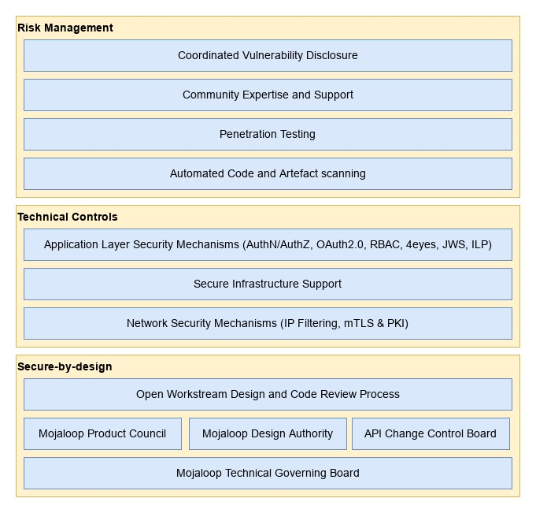
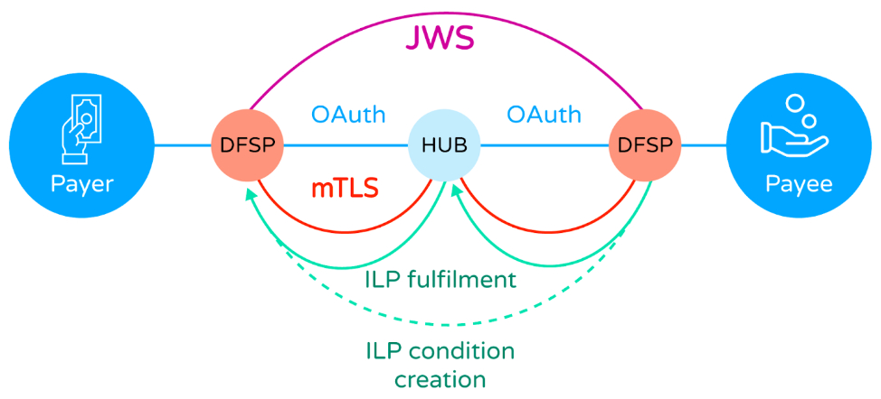

## Mojaloop Cybersecurity Architecture

## Supporting Mojaloop v15.x

**DRAFT VERSION SUBJECT TO REVIEW**

**Authors:** James Bush &lt;[jbush@mojaloop.io](mailto:jbush@mojaloop.io)>, Paul Makin &lt;[pmakin@mojaloop.io](mailto:pmakin@mojaloop.io)>

**Version:** draft

**Date:** 24th January 2024

## Introduction

Mojaloop takes both secure-by-design and risk based approaches to cybersecurity meaning the open-source software provided by the Mojaloop Foundation have been designed to be foundationally secure and are continuously evaluated against possible risks by several processes.

In addition to the cybersecurity initiatives managed by the Mojaloop Foundation, the wider Mojaloop community includes cybersecurity experts who are able to provide consultancy and services to further enhance adopters' own capabilities.

Figure 1 - Mojaloop Cybersecurity Architecture Layers

_Please note that although the Mojaloop Foundation and the Mojaloop community attempt to provide software that is secure by design and that can be operated in a secure manner, adopters bear the ultimate responsibility for ensuring the security of their operations. With this in mind the Mojaloop Foundation highly recommends that cybersecurity experts be engaged by adopters to ensure that cybersecurity best practice is followed and that all relevant and applicable standards and regulations are adhered to._

## Secure-By-Design

### Design Review Processes

The Mojaloop Foundation and community manage and operate several security aware design review processes which contribute to the secure-by-design and risk management approaches.

1. The Mojaloop Technical Governing Board determines the high-level technical cybersecurity objectives for the Mojaloop project which are implemented by other community bodies and processes.
2. The Mojaloop community operates a design authority which is a managed group of elected subject matter experts from industry who convene weekly to review technical aspects of the platform software, including but not limited to cybersecurity.
3. The Mojaloop community operates an API change control board which is a managed group of elected subject matter experts from industry who convene weekly to review internal and external API related aspects of the platform software. This group has specific responsibility for ensuring all Mojaloop APIs are secure-by-design and support the latest and best industry standards for securing deployments of the Mojaloop platform.
4. The Mojaloop community operates a product council which is a managed group of elected subject matter experts from industry who convene weekly to review product feature designs. This group contributes to the overall cybersecurity architecture of the Mojaloop product(s) by reviewing existing and creating new requirements and specifications for Mojaloop platform and its security.
5. Mojaloop community standards require feature design and code reviews by community and foundation members who are expert in those areas of the system before code changes or new code is accepted from contributors into official releases.

## Technical Controls

The Mojaloop platform employs several technical layers of security, detailed in the following sections, which contribute to an overall secure platform for conducting financial transactions.

1. At network transport level, X.509 Mutually Authenticated Transport Layer Security (mTLS) is employed (best practice guidance is provided for appropriate cipher suites and hash algorithms) to secure connections between scheme participants and the Mojaloop hub. This mechanism, combined with best practice certificate and key management processes prevents eavesdropping and tampering across scheme network connections. Mojaloop provides best practice guidelines for PKI operations: [https://docs.mojaloop.io/api/fspiop/pki-best-practices.html](https://docs.mojaloop.io/api/fspiop/pki-best-practices.html).
2. Json Web Signatures (JWS) are used at the application message layer to ensure tamper evident messaging and non-repudiation. All scheme participants are provided with the means to tell if an incoming message has been tampered with during transmission. Scheme participants can also be confident of the identity of the message originator. Mojaloop core services use this same signature validation to ensure messages have not been tampered with before processing in the hub.
3. Mojaloop uses the [InterLedger protocol](https://docs.mojaloop.io/api/fspiop/v1.1/api-definition.html#interledger-payment-request) (aka ILP) during quotation and transfer phases, as a cryptographic key-lock mechanism, which uses asymmetric cryptography to prevent tampering with agreed transfer terms.
4. The Mojaloop platform includes an API gateway layer, which facilitates "IP address filtering", OAuth2.0 identity and access management, and role based access controls which offer further protection against infiltration attacks.
5. Internal and external user interfaces e.g. for participants and hub operations users (technical / business), are secured with OAuth2.0 and Role Based Access Control (RBAC) mechanisms in combination with enforceable maker-checker processes (aka 4eyes).
6. Mojaloop supports a scheme wide Fraud and Risk Management Service (FRMS) model (shared between Financial service providers (FSPs) and the Mojaloop Switch / Hub).

Figure 2 - Mojaloop Scheme Transactional Cybersecurity Architecture

## Risk Management

### Security Testing

#### Automated Vulnerability Scanning

Mojaloop employs a number of technical mechanisms to conduct automated vulnerability assessment against all Mojaloop platform source code repositories. These mechanisms scan code dependencies and container images for known vulnerabilities (from various continuously updated industry standard vulnerability databases) periodically and before code changes or additions are accepted to main branches. This reduces the likelihood of a known vulnerability in a Mojaloop dependency making its way into an official release.

#### Penetration Testing

Members of the Mojaloop community periodically conduct penetration testing against their deployments using common security testing frameworks and share the results with the Mojaloop Foundation under a coordinated vulnerability disclosure process, whereby any newly identified risk may be mitigated by technical workstreams and/or adopters before vulnerabilities can be abused by third parties.

#### Community Expertise and Support

The Mojaloop community, following the principles and processes detailed in this document, provides a software platform that embodies numerous cybersecurity features and capabilities. However, in order to realise the best possible secure operations, adopters of the Mojaloop technology are required to deploy and operate the software in a secure manner. This is often a difficult and daunting task with many applicable standards and regulations to adhere to. The Mojaloop community includes organisations with in-depth knowledge and experience in such matters who can be engaged to offer assistance.

## Coordinated Vulnerability Disclosure

The Mojaloop Foundation operates a Coordinated Vulnerability Disclosure process. This process is a vulnerability disclosure model in which a vulnerability or an issue is disclosed to the public only after the responsible parties have been allowed sufficient time to patch or remedy the vulnerability or issue.

This method is recommended by many governments and respected international organisations as the preferred process for managing software vulnerabilities as it provides protections against third-party exploitation of discovered issues beyond those provided by alternative models.

## Organisational Controls

In addition to the technical cybersecurity controls described elsewhere, Mojaloop provides a range of tools to support organisational controls, reflecting the reality that although hacking attacks and fraud perpetrated by external agents generate the most media coverage, the most successful attacks in terms of the total value of money defrauded are inside jobs by a financial service’s own staff.

In addition to the tools provided as part of Mojaloop, there are a number of recommendations that can be made regarding the business processes adopted by a hub operator which relate to the operation of the service.

### Control Points

Mojaloop allows the hub operator to define control points, where the actions of an employee are subject to limitations imposed by the hub itself. Underpinning this is Mojaloop’s identity and access management capability, which implements a Role-Based Access Control (RBAC) model. Every employee action at the hub is only allowed if the employee holds a specific privilege; the hub owner defines a set of roles, each of which is a collection of privileges. An employee account is created and given a role (such as financial officer, administrator, operator etc), which then controls the functions they can perform.

RBAC is then supplemented with maker/checker controls. Sensitive functions (such as funds movements) can be defined (“made”) by an operator, but will only be carried out when authorised (“checked”) by, for example, a financial operator.

All employee actions are logged/recorded, in an audit log that cannot be tampered with. This allows forensic auditors to view all activity, and if necessary to “follow the money” when an issue arises due to, for example, employee/senior management collusion.

### Business Controls

The operation of a Mojaloop Hub is a financial service, and the security of the service should be treated in the same way as any other financial service, such as that of a bank or an international payments switch. Business controls are the first line of defence, and limit the attack surface before the Control Points are even accessible.

Business controls should include the following:

* Cybersecurity can be undermined by malicious staff. Hub operators should conduct appropriate background checks when recruiting staff, including checks on police or criminal records and credit reference checks to identify excessive debt (vulnerability to bribery by outside attackers).
* Strict attention to the physical security of the hub operator’s premises (where access to the Mojaloop Hub is carried out - remote access, ie working from home, should **never** be allowed), including:
    * There is only one, strictly controlled entrance to the hub operator’s premises.
    * Other entrances are secured, and fire exits have alarms.
    * All rooms are secured with biometric locks, require touch in **and** touch out to control tailgating, and access is restricted based on job function.
    * Staff in customer-facing roles or in the finance department must not be allowed to have their mobile phones with them on the premises; phones should be stored in metal lockers (Faraday cages) during working hours.
    * Video surveillance and 24-hour recording of all areas (cameras must face away from screens that might show sensitive information).
    * Carefully check and log visitors’ identities.
    * Do not permit visitors to bring any electronic equipment into operational areas.
        * In non-operational areas **only**, mobile phones and laptops may be allowed. However, the serial numbers of laptops should be logged, and providers should **check to ensure visitors leave with the same equipment they brought**. Switching laptops is the fastest method of stealing data.
    * Ensure visitors are accompanied by a staff member who is responsible for their conduct.
    * Continually remain aware of visitors’ activity:
        * Do not let visitors wander unaccompanied.
        * Do not let visitors insert USB drives or other devices into company laptops, printers, etc.

Note that this is just a subset of the controls we would expect in order to secure a Hub operator’s operations. A prospective Hub operator should seek specialist advice before launching a service.
