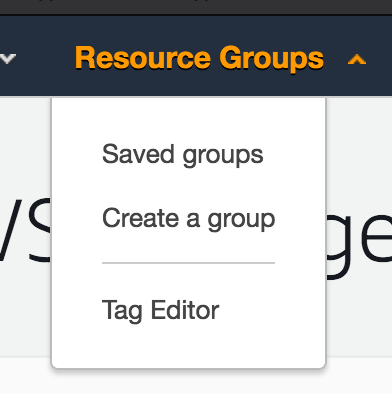
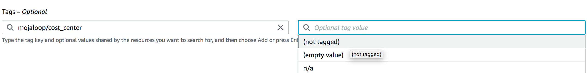
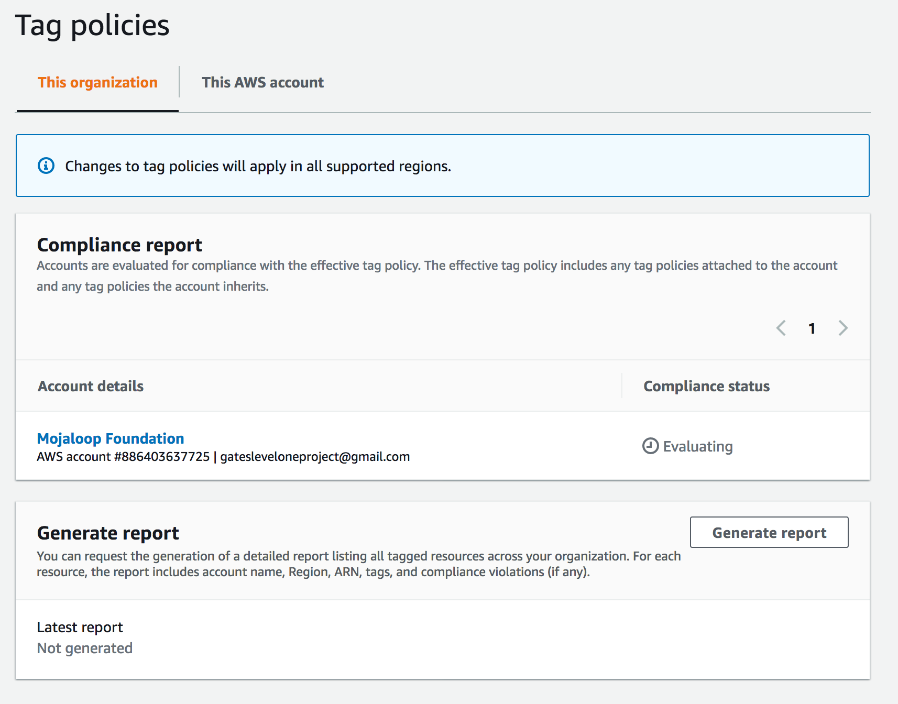
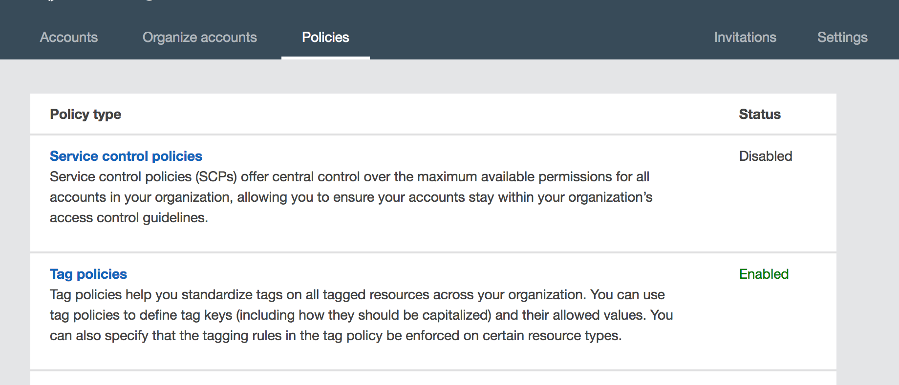
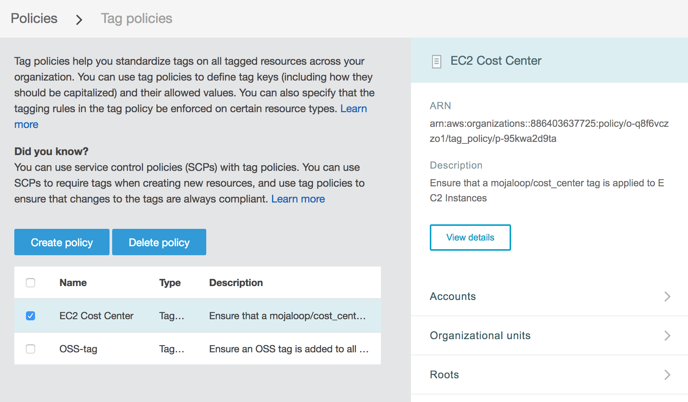
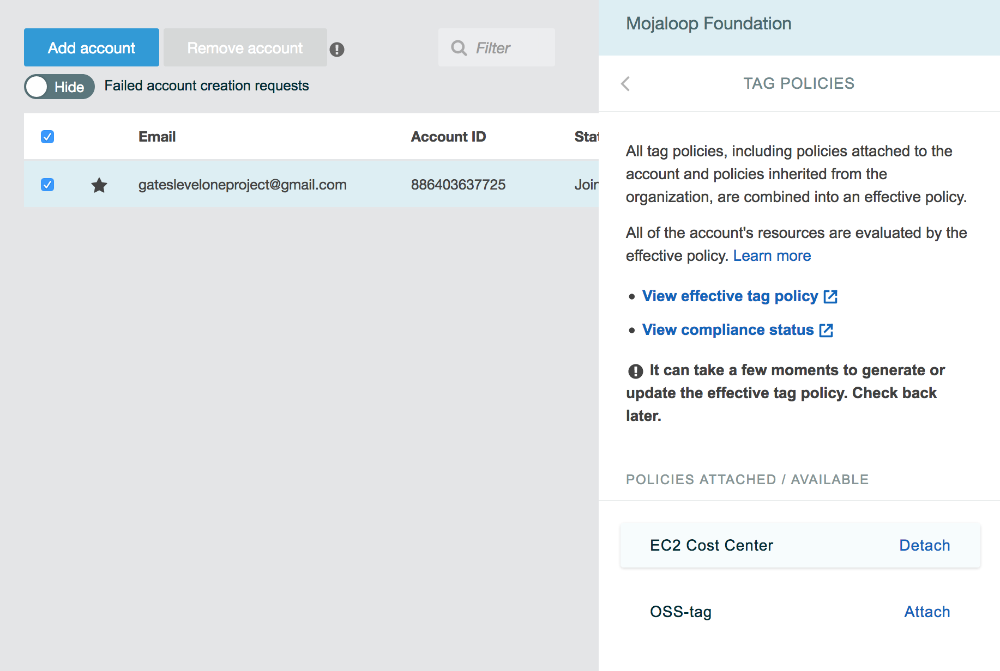

# Directrices y políticas de etiquetado de AWS

> **Nota:** estas directrices son específicas del entorno de AWS de la comunidad de Mojaloop para probar y validar instalaciones de Mojaloop, y son principalmente para uso interno. No obstante, pueden ser una referencia útil para otras personas que quieran implementar estrategias de etiquetado similares en sus propias organizaciones.

Para gestionar y entender mejor nuestro uso y nuestro gasto en AWS, estamos implementando las siguientes directrices de etiquetado.

## Contenido
- [Etiquetas propuestas y su significado](#etiquetas-propuestas-y-su-significado)
    - [mojaloop/cost_center](#mojaloopcost_center)
    - [mojaloop/owner](#mojaloopowner)
- [Etiquetado manual](#etiquetado-manual)
- [Etiquetado automatizado](#etiquetado-automatizado)
- [Políticas de etiquetado de AWS](#politicas-de-etiquetado-de-aws)
    - [Ver los informes de etiquetas y el cumplimiento](#ver-los-informes-de-etiquetas-y-el-cumplimiento)
    - [Editar las políticas de etiquetas](#editar-las-politicas-de-etiquetas)
    - [Adjuntar y desvincular políticas de etiquetas](#adjuntar-y-desvincular-politicas-de-etiquetas)

## Etiquetas propuestas y su significado

Proponemos las 2 _claves_ de etiqueta siguientes:

- `mojaloop/cost_center`
- `mojaloop/owner`

### `mojaloop/cost_center`

`mojaloop/cost_center` es un desglose de los distintos recursos de AWS según el workstream o el proyecto que incurre en los costos asociados.

Sigue de forma aproximada el formato `<account>-<purpose>[-subpurpose]`, donde account es algo como `oss`, `tips` o `woccu`.
> Nota: es probable que la mayoría de los recursos estén bajo la "cuenta" `oss`, pero conseguí encontrar algunos recursos más antiguos que caen en las categorías `tips` y `woccu`. También queremos prever los tipos de recursos que se puedan lanzar en el futuro.

Algunos valores posibles para `mojaloop/cost_center` son:

- `oss-qa`: trabajo de QA de código abierto, como los entornos dev1 y dev2 existentes
- `oss-perf`: trabajo de rendimiento de código abierto, como el workstream de rendimiento en curso
- `oss-perf-poc`: prueba de concepto de rendimiento y arquitectura

También reservamos algunos valores especiales:
- `unknown`: este recurso se evaluó (quizá manualmente, quizá con una herramienta automatizada) y no se pudo determinar un `cost_center` apropiado.
  - Esto nos permitirá filtrar fácilmente las etiquetas `mojaloop/cost_center:unknown` y producir un informe
- `n/a`: este recurso no incurre en ningún costo, así que no nos preocupa demasiado asignarle un `cost_center`
  - Esto puede ser útil para etiquetar en masa recursos de los que es difícil averiguar a dónde pertenecen, como los grupos de seguridad de EC2

### `mojaloop/owner`

`mojaloop/owner` es la persona responsable de gestionar y apagar un recurso dado.

El objetivo de esta etiqueta es evitar recursos de larga duración que todo el mundo cree que _alguna otra persona_ conoce, pero que ya no necesitamos. Al aplicar esta etiqueta podremos tener una lista de _a quién acudir_ para hacer preguntas sobre el recurso.

El valor puede ser simplemente el nombre de una persona, todo en minúsculas:
- `lewis`
- `miguel`
- etc.

Una vez más, reservaremos los siguientes valores:
- `unknown`: este recurso se evaluó (quizá manualmente, quizá con una herramienta automatizada) y no se pudo determinar un `cost_center` apropiado.
  - Esto nos permitirá filtrar fácilmente las etiquetas `mojaloop/owner:unknown` y ver qué recursos están 'huérfanos'

## Etiquetado manual

Podemos usar el "Tag Editor" de la consola de AWS para buscar recursos sin etiquetar.

1. Inicie sesión en la consola de AWS
2. En Resource Groups, seleccione "Tag Editor"

3. En el editor de etiquetas, seleccione una región (yo normalmente uso "All regions") y un tipo de recurso (también suelo usar "All resource types")
4. Ahora seleccione "Search Resources" y espere a que aparezcan los recursos

También puede buscar por etiquetas, o por la ausencia de etiquetas, para ver qué recursos todavía no se han etiquetado.

5. Una vez que tenga una lista de los recursos, ¡puede seleccionar y editar las etiquetas de muchos recursos a la vez!
6. También puede exportar un archivo `.csv` con los recursos encontrados en su búsqueda

## Etiquetado automatizado

Actualmente automatizamos el etiquetado en lo siguiente

A medida que tengamos más claras nuestras directrices de etiquetado, tenemos que introducirlas en nuestras herramientas para que todo el trabajo pesado del etiquetado manual.

De momento, esto consistirá en introducir etiquetas en:
1. Rancher, que actualmente gestiona nuestros clústeres de Kubernetes tanto para QA como para rendimiento
2. IAC, el código de IAC que está por llegar y que acabará ejecutando nuestros entornos de desarrollo

## Políticas de etiquetado de AWS

Desde el 3 de agosto de 2020 hemos empezado a introducir [políticas de etiquetado de AWS](https://docs.aws.amazon.com/organizations/latest/userguide/orgs_manage_policies_tag-policies.html) para aplicar mejor las etiquetas y supervisar nuestros recursos (especialmente en lo que respecta a los costos).

### Ver los informes de etiquetas y el cumplimiento

1. Inicie sesión en la consola de AWS
2. "Resource Groups" > "Tag Editor"
3. En la barra lateral izquierda, seleccione "Tag Policies"

Desde aquí puede ver el "informe de cumplimiento" de las políticas de etiquetas

### Editar las políticas de etiquetas

> Nota: puede que hagan falta privilegios especiales de administrador para acceder a estas páginas

1. Inicie sesión en la consola de AWS
2. Seleccione "username@mojaloop" arriba a la derecha > "My Organization"
3. Seleccione "Policies" > "Tag Policies"

4. Desde aquí puede ver las políticas de etiquetas actuales

5. En la barra lateral puede hacer clic en "View details" > "Edit policy" para editar la política

### Adjuntar y desvincular políticas de etiquetas

1. Vaya a la página "My Organization"
2. Seleccione la cuenta correspondiente > "Tag policies" en la barra lateral
3. Desde aquí puede adjuntar y desvincular políticas de etiquetas

