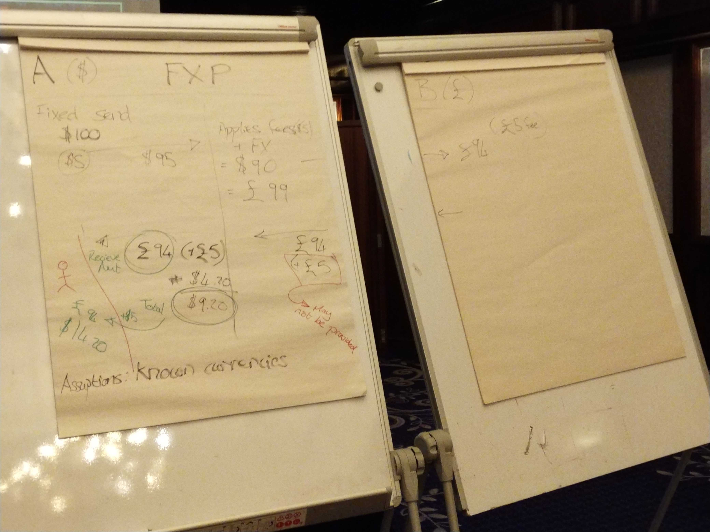
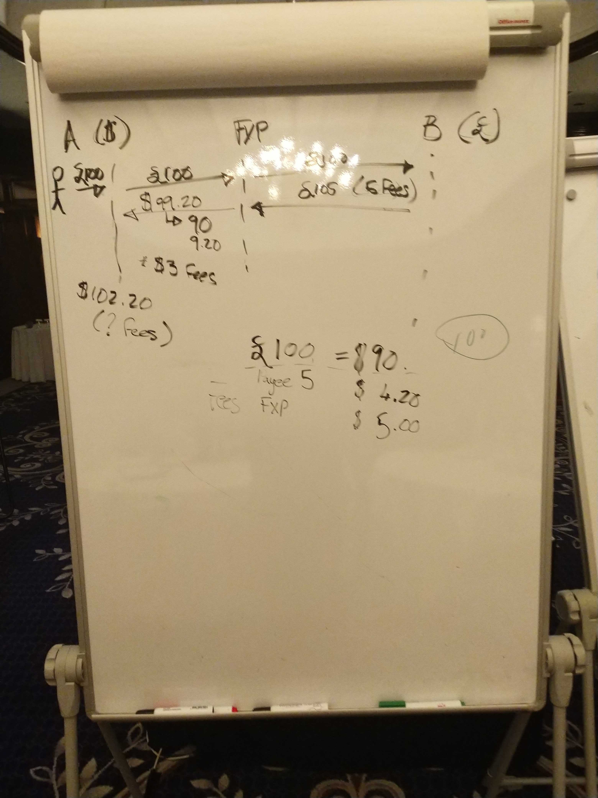

# Debate transfronterizo, día 1

>**Enlaces**
>- [Notas del día 2](./cross_border_day_2.md)
>- [Problema relacionado en el tablero de la DA](https://github.com/mojaloop/design-authority/issues/32)
>- [Pull request de la especificación de Mojaloop](https://github.com/mojaloop/mojaloop-specification/pull/22)

## Asistentes:

Presenciales
- Lewis, Crosslake
- Adrian, Coil
- Nico, MB
- Sam, MB
- Miguel, MB
- Carol Benson, Glenbrook
- Michael Richards, MB
- Henrik Karlsson, Ericsson
- Rob Reeve, MB
- Vanburn, Terra Pay
- Razin, Terra Pay
- Ram, Terra Pay
- JJ, Google
- Matt Bohan, Gates Foundation
- David Power, EY
- James Bush, MB
- Warren, MB
- Judit, MB
- Bart-Jan y Bruno, de la GSMA  - Día 2

Por teléfono
- Kim Walters, Crosslake
- Istvan Molnar, DPC
- Innocent Ephraim, MB

## Sesión 1

**Objetivo: actualizar las definiciones de la API**

- Privacidad:
  - ¿Puedo enviar USD? _sí/no_
  - ¿Qué puedo enviar? _lista de monedas_

Acuerdos comerciales: hay varias formas de que esto ocurra
- Esquema de pagos global, compuesto por acuerdos entre esquemas de pagos
- acuerdos bilaterales entre esquemas de pagos
- de esquema de pagos a esquema de pagos
- región

Definiciones:
- FSP pasarela: un FSP que hace de 'puente' entre 2 redes,
p. ej. Mowali
  - 2 redes lógicas (¿USD, XOF?)
  - una única red de Mojaloop

- Proveedor entre redes (CNP)
  - FXP, ¿es lo mismo?

Michael:
- hay un motivo para ese supuesto
- aquí hay otras implicaciones legales...

- una única entidad, legalmente en 2 jurisdicciones distintas
  - una analogía cercana a un esquema de pagos sin jurisdicción

- participante: 
  - tiene una cuenta de tx que se puede debitar o acreditar
  - banco, fxp, etc.

>P: ¿Podemos tener un participante que no liquide? ¿O esto lo cubriría un CNP que sea una parte?
>P. ej. Visa no siempre liquida en un mercado dado, pero mantiene una cuenta

- Residente frente a no residente
  - los requisitos de reporte son distintos

- ¿cuáles son los requisitos técnicos para los reportantes?

- liquidación
  - no nos preocupa demasiado en esta fase (nos centramos en los cambios de la API)
  - asumimos que la liquidación es posible, pero primero hay que acotar el alcance con la api

- No solo Mojaloop
  - hay que permitir transferencias de fuera de Mojaloop hacia Mojaloop y viceversa (tanto entrantes como salientes)
  - deben seguir siendo interoperables

- ¿quién proporciona el enrutamiento?
  - ¿el switch?
  - ¿el ALS?
  - ¿el CNP?

>*Seguimiento:* hace falta una definición formal de los roles de FXP y CNP, junto con los requisitos y las responsabilidades

A nivel del esquema de pagos
  - ¿debería el esquema de pagos mantener una lista de los demás esquemas de pagos a los que permite conectarse a sus FSP?
  - ¿o debería encargarse de esto el CNP?

- no de esquema de pagos a esquema de pagos, sino como parte del proceso de incorporación del CNP
- pero el esquema de pagos puede y debería seguir manteniendo reglas

- ¿cómo funcionará la cotización? ¿Debería un FSP enviar varias cotizaciones, una dirigida a cada CNP? ¿O debería el switch tener algún motor de reglas que le ayude a determinar a quién enviar las cotizaciones?

James: queremos ser flexibles. Se ven casos en los que querríamos que ocurrieran las dos cosas, así que no deberíamos asumir demasiado en esta fase.

Opción más simple: el switch habla con el ALS, determina que una transferencia no está en nuestra red y después encuentra una lista de CNP

CNP y FXP -> esencialmente lo mismo
- son *roles*, y un DFSP puede asumir más de 1 rol
- los fxp también pueden existir en más de una zona (p. ej. el caso de Mowali)
  - un fxp de una sola red es simplemente un fxp,
  - un fxp multirred probablemente sea también un CNP

## Sesión 2 

- debate sobre una búsqueda única o varias
  - nunca deberíamos devolver un "resultado vacío"

- ¿son las billeteras direccionables por MSISDN?
  - de momento solo 1 cuenta
  - pero esto es interno al switch
  - la tarea del oracle es convertir MSIDN -> dirección de Mojaloop

- en el futuro: el MSISDN y las cuentas estarán menos relacionados
  - este tema está relacionado de forma adyacente con el direccionamiento

- 'salir fuera' de Mojaloop con el direccionamiento será un poco complicado
- ¿Estandarizar el direccionamiento?
  - no es algo que queramos hacer

Ram: hay herramientas existentes (no hace falta reinventar la rueda), fuera del esquema de pagos de Mojaloop

- envío a moneda desconocida
  - actualmente: 1 respuesta de la tabla de enrutamiento
  - en el futuro: varias respuestas

- privacidad:
  - de momento no hace falta realmente reglas estrictas (al menos no a nivel de la API, las reglas vienen con los esquemas de pagos)
  - sí necesitamos un método para mediar la información que un switch requiere de otro (y rechazar cotizaciones si no se cumplen esos requisitos previos)

---
- Nacional frente a transfronterizo: el usuario tiene y necesita información distinta
  - p. ej. ¿queremos admitir el descubrimiento solo en el caso nacional?
---

Adrian: mucho de esto es reglas de negocio y específico del esquema de pagos
- mantiene el espacio competitivo
- Cuánta información hay en:
  - ¿la búsqueda?
  - ¿la cotización?

---
- Propuesta: la búsqueda de direcciones -> ¿devuelve varias respuestas?
- MSISDN -> ID, no una dirección. Alguien, no una cuenta

- debería haber solo 1 respuesta del ALS
- Michael no está de acuerdo

- hay que separar el *direccionamiento* del *enrutamiento*

- tenemos que pensar en los efectos aguas abajo que esto tendrá en las pruebas
  - hay que encontrar una forma clara de probar estas búsquedas

Por ejemplo, el problema de airtel UPI (donde se sustituyeron MSIDSN existentes al pasar por derechos adquiridos a sus clientes móviles a clientes de dinero móvil)
  - tenemos que evitar una situación así

---

Volver a los primeros principios (L1P)
- las transferencias deberían compensarse de inmediato
- no existe tal cosa como un futuro

- Para el ámbito nacional: podemos garantizar la entrega, pero lo transfronterizo es mucho más difícil
- hay que mantener el requisito de transparencia sobre los CNP
  - esto se reduce a reglas de negocio

- Tx reversibles o reglas sobre problemas aguas abajo
  - ILP se ocupa de *la mayor parte* de esto por nosotros

- en el caso de TIPS: 1 ID se corresponde con 1 cuenta
- como siempre, tiene que haber un compromiso entre privacidad y funcionalidades (¡y eso está bien!)

---

Al final de una cotización:
- ValueDate
- cuánto se recibirá
- ¿cuáles son las tarifas? (desglosadas, por paso y por moneda)

---

Cómo admitimos protocolos que no admiten cotizaciones (esta es una pregunta para los sistemas de moja a no moja)

Riesgo: CNP: son quienes asumen el riesgo en este tipo de transacción

¿El CNP como participante?
 - mantiene una cuenta con un participante
 - enfoque directo frente a indirecto
 - esto no afecta a los requisitos técnicos (así que queda fuera del alcance de este debate)

---

- envío y recepción fijos:
  - ¿En qué dirección hay que agregar datos a la cotización? Depende de si es recepción fija o envío fijo

- O bien: `A send 20 USD to B` O BIEN `B receives 1000 PHP`

- traducir las tarifas de vuelta para el usuario: el FXP __debe__ aplicar a las tarifas la misma tasa que a la transferencia principal

- Desde la perspectiva de L1P: __el objetivo es la transparencia__

- ¿y las cotizaciones fuera de Mojaloop?
  - el CNP debería ocuparse de esto, es el último bastión de la mojaloopidad

---

- Objeto Participant
  - ¿Adjunto a las cotizaciones, una entrada por salto?
  - Así, las cotizaciones de varios saltos contienen _n_ objetos Participant, donde _n_ = número de saltos + 1

Como parte de esto necesitamos:
- fragmentos de datos interoperables (definiciones comunes)
- un esquema de cifrado
- un lugar donde poner los datos (en el objeto de cotizaciones)

¿Deberíamos preocuparnos por el cifrado de momento?
- quizá no, pero aun así deberíamos dejar espacio para ello en la API

El cifrado agrega un reto de integración adicional
- ¿qué necesidad hay de obtener los datos en claro?
  - desde el punto de vista técnico: basta con usar una clave de cifrado en blanco

¿Necesitamos cifrar para asegurar que el switch no pueda ver los datos?
  - quizá no en esta fase

>### Decisión:
>- Sin cifrado de momento
>- en la solicitud de cotización saliente: llevar una lista de requisitos de datos
>- en la solicitud de cotización entrante: los participantes cumplimentan esos requisitos
>- si no se cumplen los requisitos: abortar la cotización
>- No codificar de forma rígida los requisitos de datos, deberíamos usar los estándares existentes

- tenemos que especificar si los campos _han_ sido verificados o no
  - enlaza con los procesos de KYC por niveles

- hace falta un diccionario común de datos que se pueden o se deberían solicitar

## Tableros:

_tablero 1: flujos de envío fijo_

_tablero 2: flujos de recepción fija_

