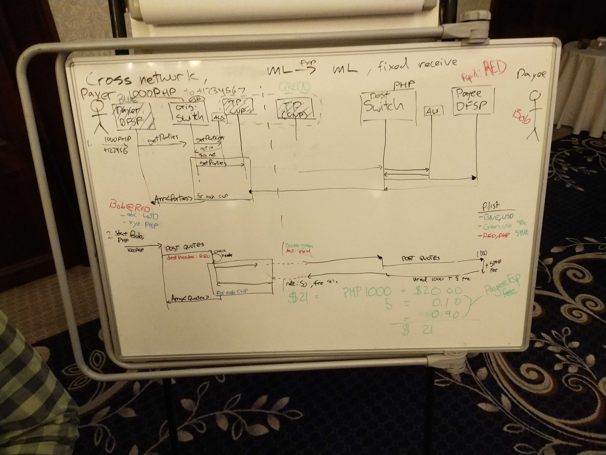

# Debate transfronterizo, día 2

>**Enlaces**
>- [Notas del día 1](./cross_border_day_1.md)
>- [Problema relacionado en el tablero de la DA](https://github.com/mojaloop/design-authority/issues/32)
>- [Pull request de la especificación de Mojaloop](https://github.com/mojaloop/mojaloop-specification/pull/22)

## Próximos pasos:

- Actualizadas las API de la propuesta
- Presentar el cambio consolidado al CCB por escrito
- Un par de semanas para reunir los cambios (Michael/Adrian se repartirán el trabajo)
- Llamada del CCB a mediados de noviembre
 

## Sesión 1

Preguntas sin responder:
- direccionamiento
  - ¿desglosarlo?
  - entre redes Mojaloop
  - ¿qué hace un PayerFSP con una dirección?

- ALS y enrutamiento
  - ¿qué optimizaciones necesita hacer o permitir la API?

- ids de DFSP locales frente a remotos

- Fallos aguas abajo
  - Cuando el pago sí se compensa, recibe el pagador una notificación (sobre todo con pagos 'diferidos' que pueden conectar con sistemas que no son de Mojaloop)
  - ¿Puede un CNP enviar un `PATCH` de la tx para actualizar de algún modo al beneficiario?

---

- múltiples cotizaciones y respuestas de rutas:
  - ¿cómo se le muestran al usuario?
  - Tenemos que establecer reglas para filtrar rutas
    - difícil de hacer: p. ej., ¿poner un switch en lista negra? o expresar una preferencia por ciertas rutas

- ¿cómo descubrirá el DFSP emisor las reglas del esquema de pagos de un receptor?
- ¿necesita el DFSP emisor 'conocer' el switch final? ¿O le basta con 'conocer' el siguiente?

---

Chocando con supuestos de ML y de fuera de ML
- ¿significa esto que el CNP tiene que hacer más trabajo al conectar con algo que no es ML?
  - p. ej., ¿conocer el esquema de pagos o el switch resultante?
    - ¿por qué? Gestión de fallos
    - según la decisión de ayer: ¿debería hacer el CNP este trabajo?

- Aprender la lección de SWIFT:
  - el banco no sabe adónde va el dinero
  - ¿podemos evitar esto en ML?

---

CNP: el objetivo es 'comportarse como' un miembro normal de la red
  - Esto minimiza las responsabilidades que asume el esquema de pagos

¿Cuándo se considera completada la TX?
  - Puede haber casos en los que el esquema de pagos la considere terminada, pero técnicamente no esté terminada de extremo a extremo

¿Cómo tratamos el deterioro del servicio?
  - Reglas del esquema de pagos

---

Volviendo a las cotizaciones:

- ¿cómo expresar la información de la cotización?
  - ¿son las cotizaciones y las rutas cosas separadas? Presumiblemente, sí

- La cotización es el paso más caro
  - ¿Podemos aportar aquí información de calidad de servicio como parte de la búsqueda?

Direccionamiento:
- Hace falta una dirección única a nivel global
  - Permitir un espacio de direcciones para los DFSP y para personas/cuentas únicas
- el esquema de pagos dice "esto no está en mi espacio"
- el CNP averigua las rutas para llegar a ese espacio

---

### La digresión de Michael:

- ¿hicimos los supuestos equivocados sobre el CNP?

**switch:** conoce a los CNP y a los FXP
**CNP:** mantienen la tabla de enrutamiento y la búsqueda

- si el emisor o el receptor es un FXP, entonces la tx *no* es una tx entre monedas

--- 

## Sesión 2

*Decisión:*
- el valor de la cabecera es el id del CNP
- el objeto partId es el FSP final

valueDate
- se sobreentiende que se espera que los fondos se compensen antes de la valueDate
- aun así se pueden tener tiempos de expiración cortos en la tx

- CNP:
  - devuelve un conjunto ofuscado de tarifas
  - encaja en nuestro modelo actual

- condición:
  - objeto existente vinculado criptográficamente al objeto tx
    - pero en el caso de varios saltos, no solo conocemos esto
    - la recepción fija lo complica más (que es lo que los datos de eco esperan resolver)

  - Queremos **solo 1 condición para todos los saltos**
  - la idea de una condición múltiple es una "perversión" (según algunos)

## Tableros:

_tablero 3: flujo de búsqueda y cotizaciones entre redes, recepción fija de 1000 PHP desde USD_

