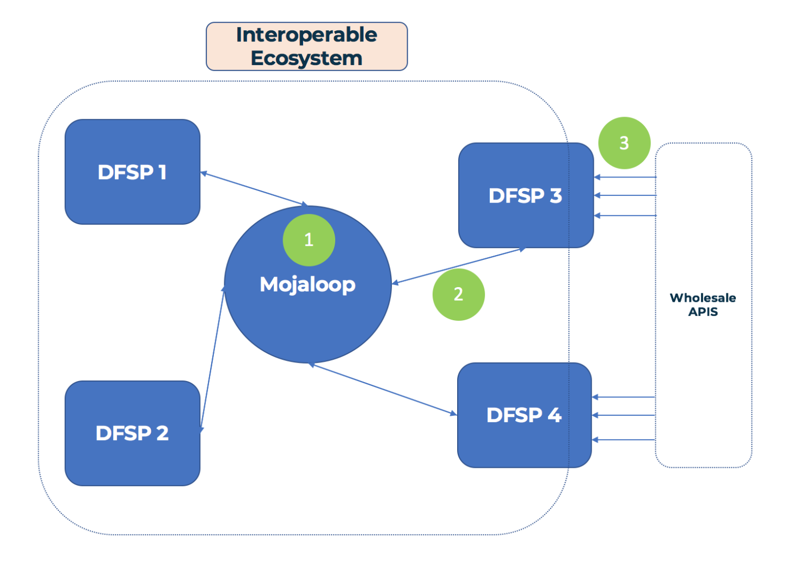

# Debate sobre el Lab/Workbench de Mojaloop

___Objetivo:__ este documento de debate busca exponer los argumentos y alinear a la comunidad en torno al desarrollo de un entorno educativo de Lab de Mojaloop._

## 1. Objetivos para la convocatoria del PI8:

1. Definir los términos y esbozar los supuestos
2. Esbozar los esfuerzos existentes y cómo se alinea con ellos la comunidad OSS (GSMA, MIFOS, ModusBox)
3. Definir los usuarios y los casos de uso, y excluir aquellos usuarios de los que no nos vamos a ocupar
4. Recomendaciones de varias soluciones distintas al "problema del Lab"
	- Documentación sobre los casos de negocio y los perfiles que desarrolló Dan 
	- Implementación básica de un configurador de Lab, ayudar a la gente a construir labs con distintas funcionalidades
    - Demostración sencilla de Mojaloop sobre hojas de cálculo, para que la gente use Mojaloop sin Postman
5. Implementación básica y demostración
6. Plantear las preguntas importantes y debatir los próximos pasos

## 2. Nomenclatura

**1. Herramientas:**
- 1.1 Un dispositivo que se usa para cumplir una función
- 1.2 Herramientas distintas para funciones distintas: no usaría un destornillador para clavar un clavo.
- 1.3 En el contexto de Mojaloop, un ejemplo de herramienta es el Bank Oracle
  - El Bank Oracle es una herramienta que se conecta al Account Lookup Service y se puede usar para que Mojaloop se conecte con cuentas bancarias existentes con un IBAN

**2. Workbench:**
- 2.1 Combina distintas herramientas en un mismo sitio
- 2.2 Por ejemplo, un cepillo de mano, una sierra de mesa y un formón pueden formar un workbench de carpintería, mientras que una sierra para metales, una lima y una amoladora angular pueden formar un workbench de metalistería
- 2.3 En el lenguaje de Mojaloop, las herramientas para probar las claves JWS de mi DFSP están en un workbench distinto del de las herramientas que le demuestran a una fintech cómo pueden funcionar las api mayoristas sobre Mojaloop

**3. Lab:**
- 3.1 Un lab es un lugar al que se va a hacer experimentos
- 3.2 Hacemos experimentos para aprender y para poner a prueba nuestros supuestos
  - Por ejemplo, un DFSP puede montar y ejecutar un _experimento_ en el que envía y recibe cotizaciones usando una API en desarrollo
- 3.3 Un único lab combina varios workbenches en un mismo sitio

**4. Simulador:**
- 4.1 Una herramienta que simplifica o abstrae alguna función para poder probar una cosa cada vez
- 4.2 Los pilotos se entrenan con simuladores _antes_ de volar un avión real, peligroso y caro.
- 4.3 Dentro de Mojaloop: un simulador puede simular la interacción con algún componente del sistema
  - Sustituir un switch entero para probar la implementación de un DFSP
  - Simular 2 DFSP para probar el despliegue de un switch
  - Un simulador también reduce la necesidad de que alguien acompañe a quien está probando. Así, un DFSP puede enviar y recibir a través del switch sin interactuar con el operador del Hub.

## 3. Supuestos

>_Algunos de estos pueden darse por sentados, pero merece la pena anotarlos aquí igualmente._

- 1\. La Gates Foundation quiere fomentar la adopción de Mojaloop a todos los niveles (no solo en los switches)
- 2\. No necesitamos un entorno de lab que cubra las necesidades del despliegue de un Switch ni de un DFSP que esté implementando: esas necesidades se cubrirán en otro sitio
- 3\. La comunidad OSS de Mojaloop quiere resultar atractiva
  - Esto no significa eliminar todas las barreras de entrada, sino valorar qué barreras deberíamos eliminar

## 4. Usuarios

Dividimos a los usuarios en 2 grupos: usuarios primarios y usuarios secundarios.

### 4.1 Usuarios primarios
1. DFSP que necesitan integrarse con Mojaloop: (abreviado: DFSP que implementa)
2. Organizaciones o personas que quieren aprender sobre Mojaloop y quieren construir y probar funcionalidad o casos de uso como DFSP (abreviado: DFSP evaluador)
3. Organizaciones o personas que quieren aprender sobre Mojaloop y quieren construir y probar funcionalidad o casos de uso como operador del Hub (abreviado: operadores del Hub evaluadores)
4. Reguladores, organizaciones o personas que quieren entender y evaluar Mojaloop y cómo podría afectar a su servicio actual (abreviado: evaluadores generales)

### 4.2 Usuarios secundarios
5. Integradores de sistemas que quieren ofrecer Mojaloop como servicio, o partes de la integración con Mojaloop como servicio (integrador de sistemas)
6. Contribuyentes individuales (¿incluidos los cazadores de recompensas por errores?) (contribuyente individual)
7. Fintechs que operan o que operarán sobre un switch habilitado con Mojaloop (fintech impulsada por Mojaloop)
8. Proveedores de aplicaciones de terceros que interactúan con las API mayoristas de dinero móvil y venden integraciones a fintechs y similares (proveedor de aplicaciones de terceros)
9. Defensores financieros, interesados en promover Mojaloop y otras tecnologías que ayudan a impulsar la inclusión financiera (defensores de la inclusión financiera)

Además de pensar en cada uno de los usuarios anteriores, es importante entender en qué nivel se sitúan esos usuarios respecto de un despliegue de Mojaloop. Para eso tomaremos prestado el [_manual de Mojaloop para fintechs_](https://medium.com/dfs-lab/what-the-fintech-a-primer-on-mojaloop-50ae1c0ccafb) de Dan Kleinbaum

>_Los 3 niveles de mojaloopidad, https://medium.com/dfs-lab/what-the-fintech-a-primer-on-mojaloop-50ae1c0ccafb, por Dan Kleinbaum_

**Nivel 1:** ejecutar un switch de Mojaloop (p. ej. operadores del Hub)  
**Nivel 2:** interactuar directamente con un Switch de Mojaloop (p. ej. DFSP, integradores de sistemas)  
**Nivel 3:** interactuar con un DFSP a través de un Switch de Mojaloop (p. ej. fintechs)  

## 5. Casos de uso

__a.__ Probar una implementación de DFSP compatible con Mojaloop  
__b.__ Validar supuestos sobre Mojaloop  
__c.__ Ver y usar una implementación de referencia  
__d.__ Aprender sobre el funcionamiento interno de Mojaloop  
__e.__ Aprender sobre los switches habilitados con Mojaloop y sus casos de uso asociados (tecnología)
__f.__ Valorar cómo cambiará Mojaloop el panorama de negocio de las fintechs  
__g.__ Poder demostrar una propuesta de valor para que los DFSP, las fintechs, etc., usen Mojaloop (en lugar de la tecnología _x_)

## 6. Matriz de usuarios y casos de uso:

Podemos representar los usuarios y los casos de uso en una matriz:

|  __Caso de uso:__                    | a. Probar impl. de DFSP | b. Validar supuestos | c. Impl. de referencia | d. Aprender el funcionamiento interno | e. Aprender sobre la tecnología | f. Evaluar casos de negocio  | g. Demostrar el valor de ML |
| :----------------------------------- | :---: | :---: | :---: | :---: | :---: | :---: | :---: |
| __Usuario:__                            |       |       |       |       |       |       |       |
| __1. DFSP que implementa__             |   X   |       |   X   |       |       |       |       | 
| __2. DFSP evaluador__              |       |   X   |   X   |       |   X   |   X   |       |
| __3. Operador del Hub evaluador__       |       |       |   X   |       |   X   |   X   |       |
| __4. Evaluador general__             |       |       |       |       |   X   |   X   |       |
| __5. Integrador de sistemas__            |   X   |   X   |   X   |   X   |       |       |   X   |
| __6. Contribuyente individual__        |       |   X   |   X   |   X   |       |       |       |
| __7. Fintech impulsada por Mojaloop__      |       |   X   |       |       |   X   |   X   |   X   |
| __8. Proveedor de aplicaciones de terceros__        |       |       |       |   X   |       |       |   X   |
| __9. Defensores de la inclusión financiera__ |       |   X   |       |       |       |   X   |   X   |

## 7. Entradas y salidas de los casos de uso:

>_Elegir 2 o 3 usuarios y casos de uso distintos y profundizar en las entradas y salidas de lo que supondría cubrir sus necesidades_
>>_Nota: como con todo lo de esta naturaleza, muchos de los usuarios y casos de uso y sus conclusiones asociadas son algo difusos, y probablemente se puedan meter en casillas distintas o completamente nuevas. Aun así, intentaremos definirlos lo mejor posible._

### 7.1 Operador del Hub evaluador y DFSP que implementa
Como se indica en nuestros supuestos anteriores, aquí no nos vamos a ocupar de los operadores del Hub ni de los DFSP que implementan.

### 7.2 DFSP evaluador

>_Pensamos en un DFSP evaluador como aquel que no forma parte necesariamente de la implementación actual de un switch, sino que es una parte con curiosidad por Mojaloop y una candidata potencial a la que evangelizar, sin el objetivo tangible de la implementación de un switch a la vista._

**7.2.1 Casos de uso:**
- 1\. Validar supuestos sobre Mojaloop (cómo funciona, qué hace, qué _no_ hace)
- 2\. Ver y experimentar con una implementación de referencia
- 3\. Aprender sobre los hubs habilitados con Mojaloop y sus casos de uso asociados (perspectiva tecnológica)
- 4\. Valorar cómo afectará Mojaloop a su negocio en el futuro

**7.2.2 Ejemplos de nuestros perfiles de usuario:**
- 1\. Carbon: habilitar retiros de efectivo y remesas OTC en su red de agentes
- 2\. Ssnapp: habilitar pagos con varios pagadores y beneficiarios y puntos de recompensa sobre Mojaloop
- 3\. Oneload: simplificar la incorporación para que otros DFSP usen la red de agentes de OneLoad
- 4\. Juvo: conectarse a un switch de Mojaloop para un mercado de evaluación crediticia y préstamos

**7.2.3 Salidas: (¿cómo puede la comunidad OSS de Mojaloop servir mejor a estos actores?)**
- 1\. ayudar a incorporarse al ecosistema de Mojaloop
- 2\. ayudar a entender la tecnología, dónde funciona bien y sus posibles escollos e inconvenientes
- 3\. minimizar la inversión necesaria para poner las cosas en marcha, de forma que puedan centrarse en construir prototipos de casos de uso
- 4\. llevarlos de un conocimiento nulo o escaso de Mojaloop -> a demostrar prototipos reales

**7.2.4 Entradas: (cuáles son las cosas que tenemos que hacer para cumplir estos objetivos)**
- 1\. Documentación de Mojaloop mejorada y específica para este rol.
  - 1.1 Pensar y diseñar la documentación y el flujo de incorporación específicamente para los *DFSP evaluadores*
  - 1.2 La documentación debería ser accesible para un responsable de producto, etc., con pocos conocimientos técnicos
- 2\. Análisis técnico profundo de la tecnología que hay detrás de Mojaloop, el porqué y cómo funciona (quizá podamos reutilizar el demostrador de js en un recorrido interactivo por una transacción de extremo a extremo)
- 3\. Guías mejoradas para ponerse en marcha en 2 o 3 grandes proveedores de kubernetes, autoservicio y scripts de instalación 
- 4\. Charts de Helm para 1 o 2 simuladores o labs que se puedan levantar junto a un switch, con ajustes preconfigurados y con criterio

### 7.3 Fintech impulsada por Mojaloop

>_Una fintech impulsada por Mojaloop es una fintech que opera o quiere operar sobre un switch de Mojaloop. Sin duda habrá solapamiento entre fintechs y DFSP en esta clasificación, pero aquí nos centraremos en las fintechs que están en el tercer nivel de los "radios de Mojaloop" anteriores_

**7.3.1 Casos de uso:**
- 1\. Validar supuestos sobre Mojaloop (cómo funciona, qué hace, qué _no_ hace)
- 2\. Aprender cómo se alinea Mojaloop con las API mayoristas y qué haría falta para que un DFSP usara esas API sobre un switch de Mojaloop
- 3\. Aprender sobre los hubs habilitados con Mojaloop y sus casos de uso asociados (perspectiva tecnológica)
- 4\. Valorar cómo afectará Mojaloop a su negocio en el futuro

**7.3.2 Ejemplos de nuestros perfiles de usuario:**
- 1\. EastPay: comparar y buscar entre bancos y proveedores de pago según la estructura de tarifas abierta de Mojaloop
- 2\. Jumo: ¿abrir mercados de préstamo transparentes y más justos sobre un switch habilitado con Mojaloop?

**7.3.3 Salidas: (¿cómo puede la comunidad OSS de Mojaloop servir mejor a estos actores?)**
- 1\. Entender cómo encajan Mojaloop y las API mayoristas (o cómo no encajan)
- 2\. Permitir que las fintechs interactúen con Mojaloop a través de 1 o 2 API de banca mayorista (p. ej. la api MM de la GSMA)
- 3\. llevarlos de un conocimiento nulo o escaso de Mojaloop -> a demostrar prototipos reales

**7.3.4 Entradas: (cuáles son las cosas que tenemos que hacer para cumplir estos objetivos)**
- 1\. Documentación de Mojaloop mejorada y específica para este rol.
- 2\. Documentación o documento de trabajo sobre cómo funcionará Mojaloop con las api mayoristas
- 3\. Entorno de lab autodesplegado con un DFSP que exponga algunas api mayoristas con funcionalidad básica para que las fintechs puedan probar

## 8. Los esfuerzos de Lab/Workbench del OSS junto a los de otros

Hay otros en la comunidad trabajando en algunas de las necesidades que hemos descrito arriba. Cómo podemos alinearnos entre nosotros para: (1) no duplicar esfuerzos (ni pisarnos los unos a los otros) y (2) aportar el mayor impacto para los usuarios finales y para la comunidad de Mojaloop en su conjunto

En general, llegamos a un consenso en torno a lo siguiente:
- cualquier esfuerzo de Lab del OSS debería centrarse en un usuario final concreto
- Nuestro foco debería estar más hacia fuera en los radios de Mojaloop (DFSP, fintechs, proveedores de aplicaciones de terceros)

### 8.1 MIFOS
- 1\. Ya hay un trabajo extenso hecho aquí con el sistema Fineract, que ofrece una solución lista para usar para los DFSP habilitados con Mojaloop
- 2\. trabajando en implementaciones de open api
- 3\. Trabajando en bajar las barreras de entrada para los DFSP y las fintechs
- 4\. Mifos Innovation Lab: "la locomoción sobre los raíles de Mojaloop"
  - 4.1 Demostrar sistemas Mojaloop de extremo a extremo con integración de DFSP
  - 4.2 Construir y aportar herramientas de código abierto
- 5\. Ya trabajando en despliegues reales 
- 6\. Ven la necesidad de un "punto único de entrada al ecosistema de Mojaloop"
- 7\. Tienen un despliegue de Lab existente con Mojaloop que se está actualizando para que funcione con los despliegues de los charts de Helm más recientes

### 8.2 GSMA
- 1\. Tienen una api de dinero móvil, les gustaría ver una solución de extremo a extremo con fintechs y DFSP hablando a través de un switch de Mojaloop
- 2\. El Lab de la GSMA tiene un alcance muy amplio, Mojaloop es solo una pieza de esto
- 3\. Un objetivo principal es la API de dinero móvil: impulsar un estándar por defecto para la integración de terceros con el dinero móvil
- 4\. ¿dónde encaja Mojaloop?
	- 4.1 Es una de las ramas en las que trabajará el Lab de la GSMA
	- 4.2 ¿Dónde puede la GSMA aportar más valor a Mojaloop?
		- 4.2.1 Cubrir una necesidad del mercado para lograr el mayor impacto
    - 4.2.2 Ver un prototipo de extremo a extremo de la API MM hablando a través de un switch de Mojaloop

### 8.3 ModusBox
- 1\. Más desde la perspectiva del integrador de sistemas. Ya están construyendo un montón de herramientas para facilitar el proceso de desarrollo e incorporación de switches y DFSP
- 2\. Han publicado como código abierto el SDK de Mojaloop en JS
- 3\. Interesados en mostrar 'cómo funciona el motor' para generar confianza en socios y clientes de negocio
- 4\. También interesados (especialmente en el caso de WOCCU) en un lab de Mojaloop como lugar donde las fintechs aprendan y prueben conceptos sobre Switches de Mojaloop
  - 4.1 Una vez conectado esto, los casos de uso interesantes empezarán a desarrollarse más allá de las transferencias de A a B
  - 4.2 Las MFI (sobre todo las pequeñas y medianas) no tienen mucha capacidad para experimentar ni para desarrollar nuevos casos de negocio, pero estos casos pueden impulsarse primero desde las fintechs
- 5\. ¿Cómo podemos ayudar a organizaciones con poca o ninguna capacidad técnica a ganar confianza con Mojaloop?
  - 5.1 Un entorno de lab técnico no servirá de mucho en ese caso
  - 5.2 ¿Podemos demostrar Mojaloop sobre una hoja de cálculo? Todo el mundo entiende las hojas de cálculo.

## 9. Preguntas

- 1\. Gran parte de esto vuelve al ciclo de venta que propone la Gates Foundation para hacer crecer la adopción de Mojaloop
  - 1.1 Solo con mirar los informes técnicos del hackathon, hay actores __grandes__ (Famoco, Ethiopay, GrameenPhone) que podrían tomar Mojaloop y llevarlo muy lejos
  - 1.2 ¿Cómo se puede superar el obstáculo inicial para impulsar la adopción y ayudar a estas organizaciones a adoptar Mojaloop y contribuir de vuelta al ecosistema?
  - 1.3 ¿Cómo es el punto de entrada al sector para los operadores del Hub?

- 2\. En el caso de los DFSP evaluadores, ¿cómo es su asignación de recursos y de riesgo?
  - 2.1 Si creen que Mojaloop es una opción viable para un producto futuro, ¿qué tipo de inversión de tiempo y recursos le dedicarán?
  - 2.2 ¿Cuáles son sus alternativas? (Esto será algo caso por caso)

- 3\. ¿Cierto grado de control técnico de acceso es bueno o malo? (Esta es una pregunta más filosófica)
  - 3.1 Si no lo ponemos demasiado fácil para ponerse en marcha, nos aseguramos de que solo usen Mojaloop las partes interesadas y decididas, lo que autoselecciona una comunidad mejor (más o menos)
  - 3.2 Pero esto deja fuera a mucha gente que no está al día con kubernetes, docker, etc., pero que puede tener bastante experiencia en servicios financieros, etc.

- 4\. ¿Problema del huevo y la gallina entre los DFSP y los operadores del Hub? ¿Va de los DFSP a los operadores del Hub o al revés?

## 10. Recomendaciones

- 1\. Encontrar un usuario objetivo para el que, o con el que, podamos construir un lab
  - 1.1 ¿quizá uno de los equipos más serios del hackathon?
- 2\. Abordar y mejorar las carencias de documentación, partiendo de una perspectiva específica de cada rol (es decir, DFSP, fintech, operador del Hub)
- 3\. Demostración de Mojaloop sobre hoja de cálculo
- 4\. Construir un prototipo de lab de autoservicio
  - 4.1 Conjunto de charts de Helm con criterio que se puedan desplegar junto a un switch general
  - 4.2 Recoger comentarios de la comunidad y ver dónde y cómo lo usa la gente
