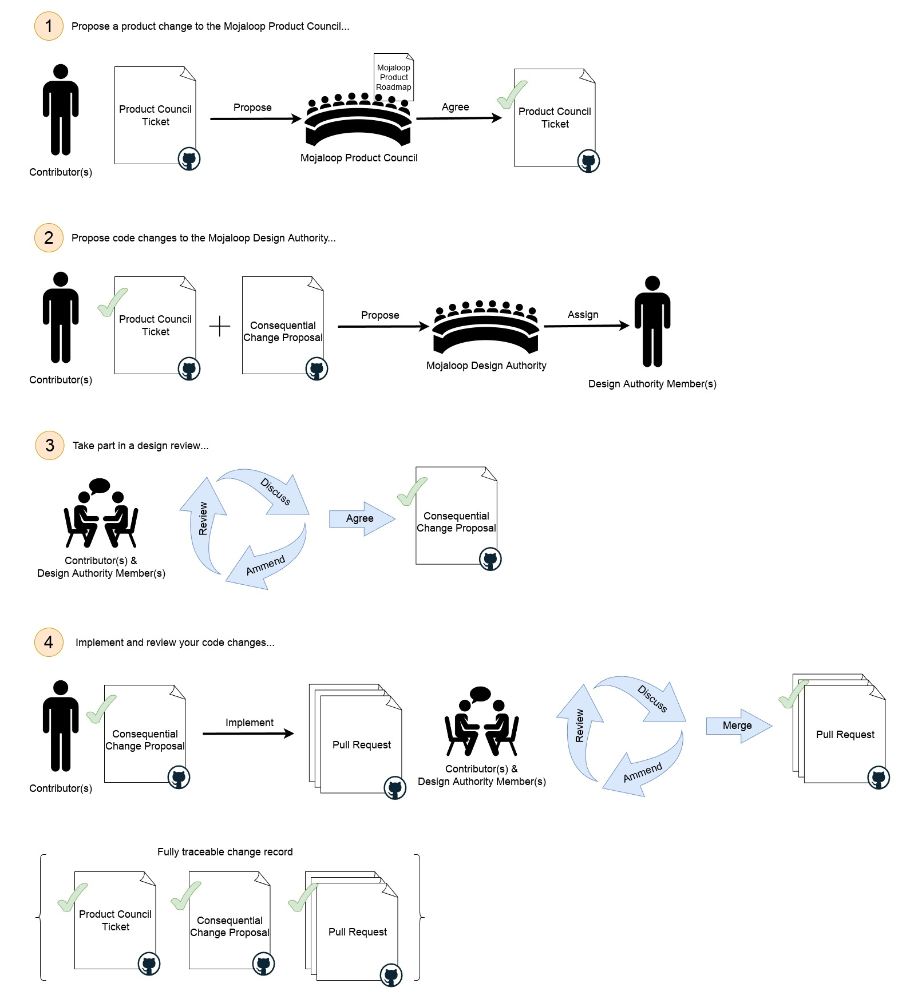

# Proceso de cambios con consecuencias

Para los cambios que entran en la [definición de cambio con consecuencias](./design-review.md#cambios-con-consecuencias), se debe seguir el
siguiente proceso:

1. Proponga un cambio de producto al Mojaloop Product Council:
    1. Cree una 'Product Change Proposal' en el repositorio del proyecto 'product-council' de GitHub,
       [aquí](https://github.com/mojaloop/product-council-project/issues).
        1. Complete la plantilla con el mayor detalle posible para asegurar una respuesta rápida.
    2. Envíe un mensaje al canal de slack [#product-council](https://mojaloop.slack.com/archives/C01FF8AQUAK) pidiendo
       una revisión de su propuesta.
    3. El Product Council hablará con usted sobre su propuesta para entender dónde encaja dentro de la hoja de ruta del
       producto Mojaloop.
2. Proponga cambios de código a la Mojaloop Design Authority:
    1. Cree un problema de tipo 'Consequential Change Proposal' en el repositorio del proyecto 'design-authority-project'
       de GitHub, [aquí](https://github.com/mojaloop/design-authority-project/issues).
        1. Complete la plantilla con el mayor detalle posible para asegurar una respuesta rápida.
    2. Envíe un mensaje al canal de slack [#design-authority](https://mojaloop.slack.com/archives/CARJFMH3Q) pidiendo
       una revisión de su propuesta.
    3. La design authority asignará a uno o más miembros para trabajar con usted en su propuesta.
3. Participe en una revisión de diseño:
    1. El miembro o los miembros de la design authority que se le asignen le guiarán por un proceso iterativo de revisión de diseño.
    2. Una vez completado el proceso de revisión de diseño, puede continuar con su cambio.
4. Implemente y revise sus cambios de código:
    1. Cree elementos de trabajo en github/zenhub y trabaje en ellos, dentro de
       su [proceso de flujo de trabajo](./product-engineering-process.md#flujos-de-trabajo-de-mojaloop), según sea necesario. Asegúrese de
       hacer referencia al ticket del product council y al ticket de la propuesta de cambio con consecuencias en las descripciones de sus elementos, para permitir
       la trazabilidad futura.
    2. Cuando esté listo para hacer pull requests en uno o varios repositorios de código, contacte con el miembro o los miembros de la design authority
       que se le hayan asignado y pídales que inicien la fase de revisión del código.
    3. Esté preparado para responder preguntas y hacer ajustes durante esta etapa.
    4. Una vez que el miembro o los miembros de la design authority asignados aprueben sus pull requests, su funcionalidad está lista para incluirse en
       el proceso oficial de versiones de Mojaloop.
    5. Todo cambio en el diseño que se haga durante la implementación debe registrarse en el ticket de la propuesta.

## Qué esperar durante el proceso de revisión de diseño

_La Mojaloop Design Authority tiene la responsabilidad de asegurar que los riesgos se identifiquen y se mitiguen adecuadamente y que
se respeten nuestros estándares establecidos de herramientas, patrones y prácticas. El miembro o los miembros de la design authority que se le asignen están
ahí para ayudarle a lograr el mejor resultado posible para usted y para toda la comunidad de Mojaloop._

El miembro o los miembros de la design authority que se le asignen le ayudarán a identificar y mitigar cualquier riesgo que su cambio pueda introducir, además
de hablar de cómo se alinea su diseño con las herramientas, los patrones y las prácticas establecidos.

1. Se le pedirá que exponga los motivos de su cambio propuesto y que explique qué desea lograr y
   cómo pretende lograrlo.
    1. Debería poder remitirse a un ticket de GitHub existente del Mojaloop Product Council que muestre que ha hablado
       de su trabajo con ellos y que están conformes con que se haga el cambio. Tenga en cuenta que el Product Council tiene la
       responsabilidad de mantener una hoja de ruta coherente para nuestra tecnología y le orientará sobre la forma más apropiada
       de lograr sus objetivos de negocio dentro del contexto de Mojaloop. El Product Council puede consultar a la Design
       Authority como parte de este proceso.
    2. Debería poder explicar cómo se implementará su cambio, qué componentes existentes se verán afectados,
       cómo tienen que cambiar y sus diseños para cualquier componente nuevo. Debería presentar, como mínimo:
        1. Diagramas de secuencia UML que muestren cada componente significativo implicado en sus casos de uso y cómo interactúan para
           lograr los resultados que desea. Debería asegurarse de incluir los casos de error además de los comportamientos
           "normales" esperados.
        2. Todos los detalles de cualquier componente de terceros que vaya a usar como parte de su implementación.
        3. Todos los detalles de cualquier cambio en componentes existentes, destacando las diferencias entre los comportamientos actuales
           y los comportamientos modificados o nuevos que desea.
    3. Es probable que los miembros de la Design Authority que se le asignen hagan muchas preguntas para entender por completo su
       propuesta y su contexto.
2. El miembro o los miembros de la design authority que se le asignen le ayudarán a identificar a cualquier otro contribuyente, equipo o
   parte interesada que pueda verse afectado, para incorporarlos al proceso de revisión. Esto se hace para asegurar que los comportamientos anteriores y posteriores no
   se vean afectados negativamente y también para tener en cuenta cualquier cambio próximo en otras áreas del sistema. Mojaloop es un
   sistema grande y a menudo resulta útil incorporar a expertos de otras áreas para ayudar.
3. El objetivo principal del miembro o los miembros de la Design Authority que se le asignen es identificar y mitigar riesgos que usted quizá no haya
   detectado.
    1. El miembro o los miembros de la design authority que se le asignen pueden hacer sugerencias para mitigar el riesgo de su diseño y pueden pedirle
       que haga cambios concretos para alinear su propuesta con las restricciones establecidas de Mojaloop.
