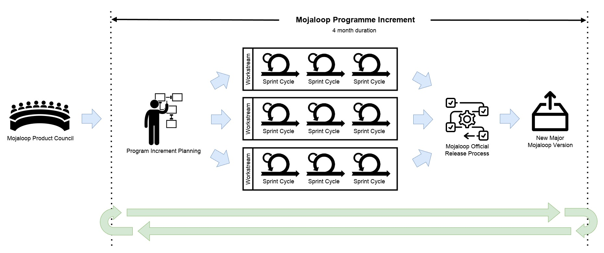
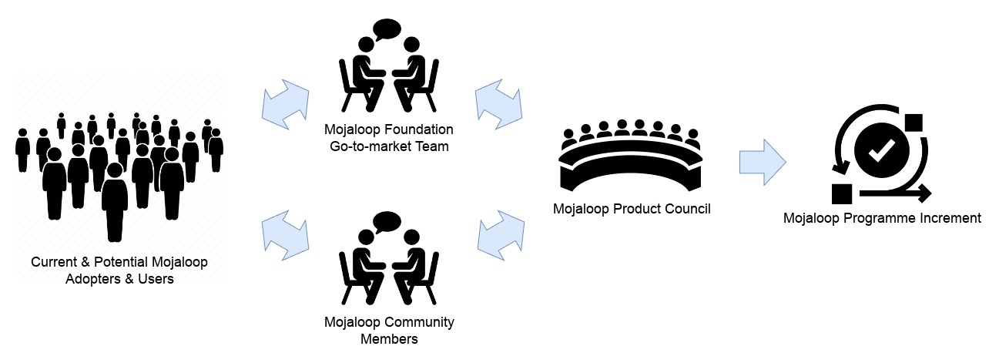
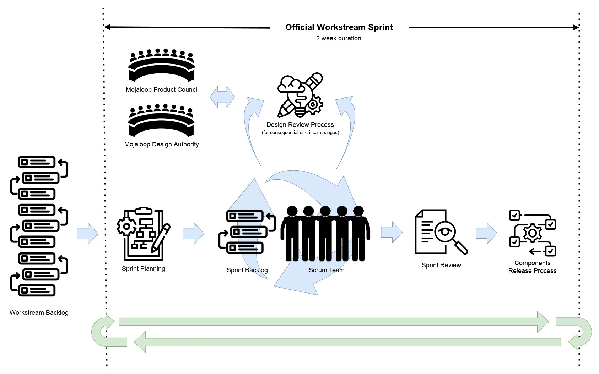

# Proceso de ingeniería de producto de Mojaloop

## Introducción

El software de Mojaloop está pensado para formar la columna vertebral de esquemas de pagos instantáneos inclusivos a escala nacional. Estos esquemas de pagos son
piezas importantes de la infraestructura financiera nacional regulada que facilitan las actividades diarias, críticas para la vida, de un
gran número de personas, como comprar comida y agua potable. Nuestros adoptantes, sus reguladores y las personas
que transaccionan a través de esquemas de pagos de Mojaloop exigen y merecen un nivel extremadamente alto de calidad, seguridad, fiabilidad y
resiliencia en nuestros productos.

Para mantener estas cualidades y mitigar los muchos riesgos de negocio y técnicos a los que se enfrentan nuestros adoptantes y sus
partes interesadas, la Mojaloop Foundation implementa un proceso estructurado de ingeniería de producto basado en las mejores
prácticas demostradas del sector para software financiero regulado, que incluye un control de cambios técnico y guiado por procesos
y su trazabilidad, revisiones técnicas del diseño y del código, umbrales altos de pruebas y varios niveles de
puertas de aseguramiento de la calidad.

Nuestro proceso está pensado para ayudar a nuestros contribuyentes a identificar y mitigar riesgos mientras mejoran nuestros productos, en
beneficio de toda la comunidad de Mojaloop.

## Evolución de nuestro proceso

Desde 2017, cuando el proyecto Mojaloop escribió su primer código, nuestro modelo de proceso ha evolucionado para hacer frente a la
transición de un único equipo de ingeniería a varios flujos de trabajo dotados por la comunidad, cada uno centrado en desarrollar
áreas concretas de un conjunto amplio de productos.

Nuestro modelo actual se basa en el [Scaled Agile Framework](https://scaledagileframework.com/), que usamos para facilitar
que varios equipos trabajen de la forma más independiente posible para entregar un conjunto coordinado de resultados de la hoja de ruta en todo nuestro
espacio de producto.

Nuestro modelo es un ciclo de "[incrementos de programa](https://v5.scaledagileframework.com/program-increment/)", cada uno de
aproximadamente cuatro meses naturales. Al final de cada incremento, los flujos de trabajo presentan sus logros en una
reunión de la comunidad, se publica código nuevo y comienza la planificación del siguiente incremento.

## Flujo de requisitos de producto

Las solicitudes de funcionalidades y los requisitos nuevos vienen de diversas fuentes, por ejemplo:

- Los adoptantes actuales de Mojaloop y los participantes de esquemas de pagos de Mojaloop
- Operadores de esquemas de pagos que quieren beneficiarse de la tecnología Mojaloop
- Departamentos gubernamentales que quieren implementar esquemas de pagos inclusivos en sus países
- Expertos en inclusión financiera
- Miembros de la comunidad de Mojaloop

El product council de Mojaloop recopila y analiza estos requisitos nuevos y solicitudes de funcionalidades. Si hay una demanda suficiente
y una disposición evidente a contribuir, se incorporan a la hoja de ruta del producto Mojaloop y se asignan a un
flujo de trabajo oficial de Mojaloop. Si no existe un flujo de trabajo apropiado, se puede crear uno nuevo y la comunidad puede dotarlo de recursos.

Los flujos de trabajo suelen tener un conjunto de objetivos definidos al principio de cada incremento de programa de Mojaloop, pero las solicitudes de funcionalidades de
alta prioridad se pueden insertar durante un incremento.

Los flujos de trabajo entregan su resultado a un proceso controlado que periódicamente hace versiones oficiales del
software de Mojaloop. El proceso de versiones de Mojaloop tiende a alinearse con los incrementos de programa; las versiones mayores, que
incluyen funcionalidades nuevas, suelen hacerse cerca del final de un incremento. Las versiones menores y de parche se hacen con más
frecuencia y pueden incluir, por ejemplo, funcionalidades de alta prioridad, correcciones de errores o parches de seguridad.

## Flujos de trabajo de Mojaloop

Los flujos de trabajo oficiales son las "líneas de producción" de la fábrica de software de la comunidad de Mojaloop; aquí es donde ocurre el grueso del
trabajo de desarrollo de producto. Normalmente hay muchos flujos de trabajo en marcha en paralelo, cada uno centrado en áreas o funcionalidades
concretas de la plataforma.

### Modelo de gobernanza y requisitos operativos

Los flujos de trabajo de Mojaloop tienen un modelo de gobernanza y unos requisitos operativos claramente definidos para minimizar los riesgos para todas las
partes interesadas:

1. Los flujos de trabajo deben tener un nombre claro y conciso que refleje su propósito.
2. Los flujos de trabajo deben tener en todo momento a una persona nombrada como responsable; en algunas circunstancias, el puesto de responsable del flujo de trabajo
   lo pueden compartir dos personas si ninguna dispone de tiempo suficiente para contribuir.
3. Los flujos de trabajo deben tener a una persona nombrada como enlace con la Mojaloop Design Authority. Puede ser la misma
   persona que el responsable del flujo de trabajo o una persona distinta designada.
4. Los flujos de trabajo deben publicar y mantener en community central una descripción que explique su propósito, objetivos y alcance para cada
   incremento de programa.
5. Los flujos de trabajo deben tener un mínimo de dos contribuyentes nombrados y activos.
6. Los flujos de trabajo deben celebrar un mínimo de una reunión en línea por semana.
    1. Las reuniones de los flujos de trabajo deberían considerarse abiertas para que otros miembros de la comunidad puedan observarlas.
    2. Las reuniones de los flujos de trabajo deberían grabarse y las grabaciones deberían publicarse públicamente.
7. Los flujos de trabajo con más de dos contribuyentes activos deberían celebrar una reunión en línea de stand-up al estilo scrum.
    1. Las reuniones de stand-up deberían ser diarias, salvo que el volumen de trabajo sea bajo, en cuyo caso puede ser aceptable una
       cadencia menos frecuente.
8. Los flujos de trabajo deben mantener un repositorio público de github que contenga todo el código, la documentación y los elementos de trabajo relacionados.
9. Los flujos de trabajo deben cumplir todos los [procesos de revisión de diseño y de código de Mojaloop](./design-review.md) antes, durante
   y después de que se haya completado el trabajo.
10. Los flujos de trabajo deben obtener y usar un hashtag específico en community central cuando hagan publicaciones.
11. Los flujos de trabajo deben ser revisados por el Mojaloop Product Council antes del comienzo de cada incremento de programa.
    1. Los objetivos del flujo de trabajo deben estar alineados con la hoja de ruta del producto Mojaloop.
    2. Los objetivos del flujo de trabajo deben estar alineados con la misión de la Mojaloop Foundation.

### Criterios y responsabilidades del liderazgo de un flujo de trabajo

La Mojaloop Foundation nombra a responsables que normalmente son voluntarios de la comunidad con un alto nivel de
conocimiento o experiencia pertinentes.

Para poder ser (co)responsable de un flujo de trabajo, las personas deberían cumplir los siguientes criterios:

1. Compromiso y capacidad para cumplir todas las responsabilidades del responsable de un flujo de trabajo (véase más abajo).
2. Capacidad organizativa demostrable.
3. Capacidad de liderazgo demostrable.
4. Capacidad técnica pertinente demostrable.
5. Familiaridad con el ecosistema de Mojaloop.
6. Compromiso durante toda la duración del PI.
7. Compromiso con el código de conducta de Mojaloop y cumplimiento de este

Los (co)responsables de un flujo de trabajo deben aceptar las siguientes responsabilidades:

1. Ser un punto de contacto principal para las consultas.
2. Programar y celebrar las reuniones del flujo de trabajo, grabarlas y publicar las grabaciones y las actas.
3. Facilitar el enlace entre los contribuyentes del flujo de trabajo, otros flujos de trabajo y el resto de la comunidad.
4. Crear, publicar en community central y mantener un documento de team charter del flujo de trabajo.
5. Informar del progreso a...
    1. ...la comunidad, con regularidad, en Community Central, usando el hashtag asignado.
    2. ...el Product Manager o el Product Council.
6. Asegurar que todos los elementos de trabajo cumplen todos los [procesos de revisión de diseño y de código de Mojaloop](./design-review.md) antes, durante
   y después de que se haya completado el trabajo.
7. Asegurar que todo el trabajo cumple los estándares de calidad de Mojaloop, como el estilo, la cobertura de pruebas y la documentación.
8. Asegurar que todo el trabajo se sigue en GitHub/Zenhub y que los plazos y el progreso se actualizan.
9. Asegurar que el equipo principal prueba todo el resultado técnico antes de integrarlo en el proceso oficial de versiones. Para
   los flujos de trabajo no técnicos, el resultado debería revisarlo el director de producto de la Mojaloop Foundation.
10. Facilitar la construcción de funcionalidades nuevas y escribir código según sea necesario.
11. Hacer triaje y revisar contribuciones y problemas, y responder a los usuarios.
12. Presentar informes de errores y correcciones, y resolver conflictos en el flujo de trabajo.
13. Gestionar de forma proactiva la deuda técnica y mejorar el código existente, cumpliendo
    todos los [procesos de revisión de diseño y de código de Mojaloop](./design-review.md).
14. Asegurar que la documentación cumple los estándares requeridos.
15. Guiar la dirección estratégica del flujo de trabajo en colaboración con el director de producto de la Mojaloop Foundation y el Product
    Council.
16. Definir objetivos SMART al principio de cada PI.

### Definir el trabajo

Los flujos de trabajo deben definir y registrar públicamente, mediante problemas de github/zenhub, el trabajo que planean emprender y el
progreso que logran durante la implementación:

1. Los elementos de trabajo deben registrarse en GitHub como problemas del proyecto; el uso de zenhub no es obligatorio, pero se recomienda encarecidamente.
    1. Cada flujo de trabajo tiene su propio proyecto de GitHub y su propio espacio de trabajo de zenhub para gestionar los elementos de trabajo.
2. Los elementos de trabajo, también conocidos como "historias de usuario", deberían definirse con
   el estilo “As a... I want to... So That...”
   [de desarrollo guiado por el comportamiento](https://www.agilealliance.org/glossary/user-story-template/).
3. Los elementos de trabajo deberían incluir criterios de aceptación detallados, definidos con el estilo "given, when,
   then" [de desarrollo guiado por el comportamiento](https://www.agilealliance.org/glossary/given-when-then/).
4. Los elementos de trabajo deben dimensionarse de forma que la duración prevista de cualquier elemento o subelemento no supere un único sprint de dos semanas.
5. Los elementos de trabajo deben cumplir todos los [procesos de revisión de diseño y de código de Mojaloop](./design-review.md) antes, durante y
   después de que se haya completado el trabajo. Cuando se requiera revisión de diseño, deberían usarse tickets de "spike" para seguir el proceso de diseño
   antes de crear los tickets de los elementos de trabajo.
    1. Toda la documentación de diseño requerida debe estar aprobada por la Mojaloop Design Authority antes de que comience el trabajo.

Aquí hay disponible una plantilla de ticket de github/zenhub: [github-work-item-template.docx](github-work-item-template.docx)

### Sacar el trabajo adelante

Los flujos de trabajo de Mojaloop deberían seguir por defecto un modelo de proceso similar a [scrum](https://www.scrum.org/resources/what-scrum-module),
con una cadencia de sprints de dos semanas. Dados los estrictos requisitos de gestión de riesgos de los entornos regulatorios
de nuestros usuarios y las mejores prácticas demostradas para el software financiero, nuestro proceso del día a día difiere de algunas
metodologías ágiles típicas en que implementamos funciones de supervisión obligatorias y mecanismos de control de cambios más estrictos,
más propios de organizaciones técnicas grandes que construyen y operan infraestructura crítica.

Los flujos de trabajo tienen flexibilidad para ajustar los métodos de trabajo a sus circunstancias particulares, dentro de unos límites
sensatos y apropiados para nuestra misión y nuestro dominio regulatorio. La Mojaloop Foundation orienta a los flujos de trabajo
para asegurar que se mantengan dentro de los estándares operativos que exigimos.

Los flujos de trabajo deberían celebrar con regularidad actividades programadas de standup, refinamiento del backlog, planificación del sprint, revisión del sprint y
retrospectiva.

Se exige que cada flujo de trabajo defina y mantenga un documento de "team charter" para comunicar de forma clara e inequívoca
las formas de trabajar acordadas para todos los contribuyentes.

Aquí se puede descargar una plantilla de team charter para un flujo de trabajo:
[mojaloop-workstream-team-charter-template.pptx](assets/mojaloop-workstream-team-charter-template.pptx)

### Obtener apoyo

Cuando las cosas no salen según lo previsto y no se encuentra una solución entre los contribuyentes de un flujo de trabajo, la Mojaloop Foundation
ofrece mecanismos de apoyo. Contacte con el director de comunidad de la Mojaloop Foundation, que le orientará para encontrar una
solución.

## Flujos de trabajo no oficiales y contribuciones externas

Cuando puede que no exista un flujo de trabajo apropiado y el apoyo no basta para justificar la creación de un nuevo
flujo de trabajo oficial, los contribuyentes pueden decidir trabajar en funcionalidades o cambios fuera de los procesos de la comunidad. En
estas circunstancias
se debe seguir nuestro [proceso de donación externa](../standards/guide.md#adopcion-de-contribuciones-de-codigo-abierto-en-mojaloop)
antes de que la Mojaloop Foundation pueda adoptar el código, la documentación u otros artefactos.

Tenga en cuenta que todo el trabajo hecho fuera de los procesos oficiales de los flujos de trabajo de Mojaloop está sujeto a
nuestro [proceso de donación externa](../standards/guide.md#adopcion-de-contribuciones-de-codigo-abierto-en-mojaloop). Esto es para
asegurar un grado apropiado de revisión rigurosa que garantice que se cumplen nuestros estándares antes de la inclusión en cualquier
versión oficial de Mojaloop.
