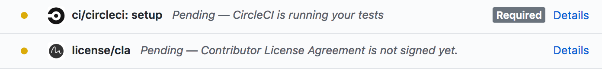
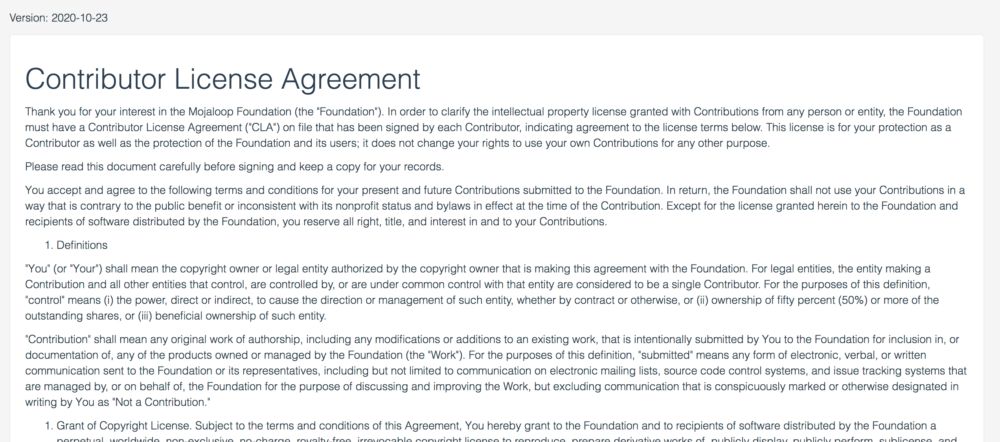
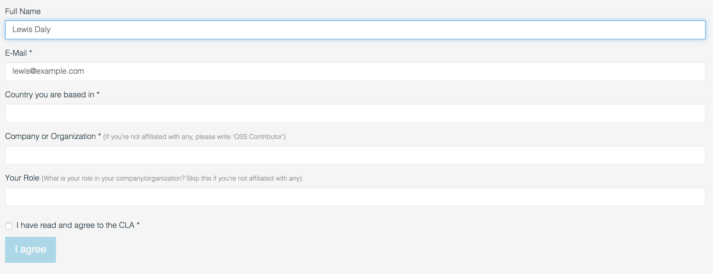
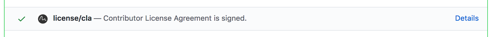
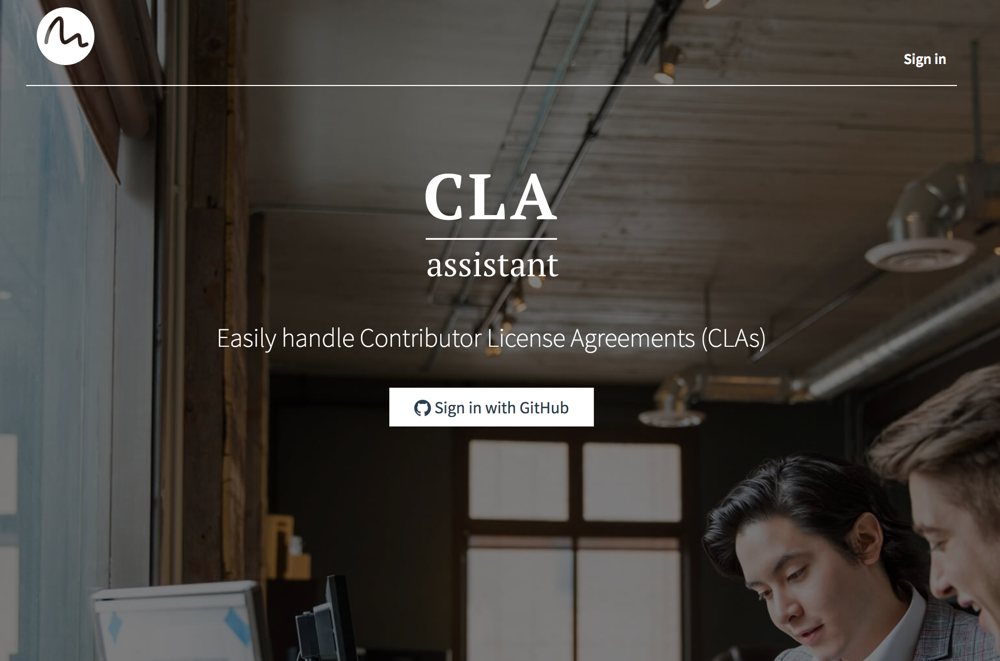
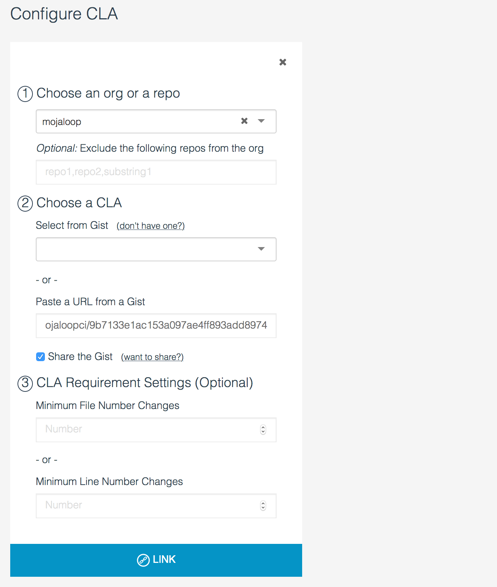

# Firmar el CLA

Mojaloop tiene un [Contributor License Agreement (CLA)](https://github.com/mojaloop/mojaloop/blob/master/CONTRIBUTOR_LICENSE_AGREEMENT.md) que aclara los derechos de propiedad intelectual de las contribuciones de personas o entidades.

Para asegurar que todos los desarrolladores han firmado el CLA, usamos [CLA Assistant](https://cla-assistant.io/), una herramienta de código abierto con buen mantenimiento que comprueba que un contribuyente haya firmado el CLA antes de permitir que se haga merge de un pull request.

## Cómo firmar el CLA

1. Abra un pull request en cualquier repositorio de Mojaloop
2. Cuando el pull request ejecute las comprobaciones estándar, verá que se ha ejecutado la comprobación `license/cla` y que pide a los usuarios que firmen el CLA:



3. Haga clic en 'Details' y se le dirigirá a la herramienta CLA Assistant, donde puede leer el CLA, rellenar algunos datos personales y firmarlo.


</br>



4. Una vez que haya hecho clic en "I agree", vuelva al pull request y verá que la comprobación de CLA Assistant ha pasado.




### Firmar en nombre de una empresa

La sección 3 del [CLA de Mojaloop](https://github.com/mojaloop/mojaloop/blob/master/CONTRIBUTOR_LICENSE_AGREEMENT.md) cubre tanto las contribuciones de personas como las contribuciones hechas por personas en nombre de su empleador. Si contribuye a la comunidad de Mojaloop en nombre de su empleador, escriba el nombre de su empleador en el campo "Company or Organization". Si no es así, puede escribir "OSS Contributor" y dejar el campo "role" en blanco.


## Administrar la herramienta del CLA

La herramienta del CLA es fácil de instalar; cualquier administrador de GitHub puede vincularla con la organización Mojaloop.

1. Cree un Gist nuevo en GitHub e introduzca el texto del CLA en un archivo nuevo.
> Como Github no permite que los Gists pertenezcan a organizaciones, [nuestro gist](https://gist.github.com/mojaloopci/9b7133e1ac153a097ae4ff893add8974) pertenece al usuario 'mojaloopci'.

2. Vaya a [CLA Assistant](https://cla-assistant.io/) y haga clic en "Sign in with GitHub"



3. Puede agregar un CLA a un repositorio o a una organización. Seleccione "Mojaloop" y después seleccione el gist que acaba de crear



4. Haga clic en "Link" y ¡listo!


### Solicitar información adicional:

> Referencia: [request-more-information-from-the-cla-signer](https://github.com/cla-assistant/cla-assistant#request-more-information-from-the-cla-signer)

También puede agregar un archivo `metadata` al gist del CLA para construir un formulario personalizado para la herramienta del CLA:

```json
{
    "name": {
        "title": "Full Name",
        "type": "string",
        "githubKey": "name"
    },
    "email": {
        "title": "E-Mail",
        "type": "string",
        "githubKey": "email",
        "required": true
    },
    "country": {
        "title": "Country you are based in",
        "type": "string",
        "required": true
    },
    "company": {
        "title": "Company or Organization",
        "description": "If you're not affiliated with any, please write 'OSS Contributor'",
        "type": "string",
        "required": true
    },
    "role": {
        "title": "Your Role",
        "description": "What is your role in your company/organization? Skip this if you're not affiliated with any",
        "type": "string",
        "required": false
    },
    "agreement": {
        "title": "I have read and agree to the CLA",
        "type": "boolean",
        "required": true
    }
}
```

Produce el siguiente formulario:


