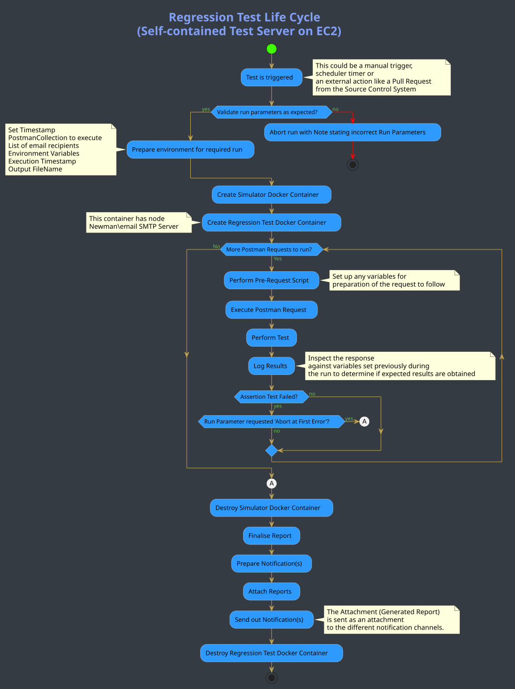

# Pruebas de QA y de regresión en Mojaloop
Una descripción general del marco de pruebas implantado en Mojaloop

Contenido:
1. [Requisitos de regresión](#temas-de-regresion)
2. [Pruebas del desarrollador](#pruebas-del-desarrollador)
3. [Pruebas con Postman y Newman](#pruebas-con-postman-y-newman)
4. [Ejecución de la prueba de regresión](#ejecucion-de-la-prueba-de-regresion)
5. [Flujo del proceso de una prueba programada típica](#flujo-del-proceso-de-una-prueba-programada-tipica)
6. [Comandos de Newman](#comandos-de-newman)

## Temas de regresión
 Para que un sistema desplegado sea robusto, uno de los últimos puntos de control es determinar si el entorno en el que está desplegado se encuentra en un estado correcto y si toda la funcionalidad expuesta funciona exactamente como se pretendía.

 Antes de eso, sin embargo, hay bastantes disciplinas que se deben implantar para asegurar el máximo control.

 Para ilustrar cómo alcanza el proyecto Mojaloop este objetivo, vamos a mostrarle los distintos puntos de control implantados.

### Pruebas del desarrollador
 Si observa cada componente y módulo dentro del código base, encontrará una carpeta llamada "*test*" que contiene tres tipos de pruebas.
 + En primer lugar, la *prueba de cobertura*, que avisa si hay código inalcanzable o redundante
 + Las pruebas unitarias, que determinan si la funcionalidad prevista funciona como se espera
 + Las pruebas de integración, que no prueban la funcionalidad de extremo a extremo, sino la interacción con los vecinos inmediatos
 + Comprobaciones automatizadas de estándares de código implementadas mediante paquetes que forman parte del código base

 El desarrollador ejecuta estas pruebas mediante instrucciones de línea de comandos durante el proceso de codificación. Además, las pruebas se ejecutan automáticamente cada vez que se hace un *check-in* y se emite un Github Pull-Request para integrar el código en el proyecto.

 El procedimiento descrito arriba queda fuera del ámbito del aseguramiento de la calidad (QA) y de las pruebas de regresión, que es lo que aborda este documento.

 Una vez que un desarrollador ha escrito funcionalidad nueva o ha ampliado la existente, y ha tenido que pasar por las rigurosas pruebas anteriores, se puede asumir que la funcionalidad en cuestión se ejecuta como se pretendía. ¿Cómo se asegura entonces que esta nueva porción de código no afecta negativamente al proyecto o al producto en su conjunto?

 Cuando el código ha superado todo lo anterior y se despliega como parte de los procesos de CI/CD implementados por nuestro flujo de trabajo, los nuevos componentes se aceptan en los distintos hosts, implementaciones en la nube o en local. Estos hosts van desde plataformas de desarrollo hasta entornos de producción.

### Pruebas con Postman y Newman
 En paralelo al proceso de despliegue está la conservación y el mantenimiento del marco de pruebas de colecciones de [Postman](https://github.com/mojaloop/postman.git "Postman"). Cuando se hace una nueva versión, como parte del flujo de trabajo se publican notas de la versión que enumeran toda la funcionalidad nueva o mejorada implementada como parte de esa versión. El equipo de QA usa estas notas para ampliar y mejorar las colecciones de Postman existentes, donde las pruebas se escriben detrás de los scripts de solicitud/respuesta para probar tanto los escenarios positivos como los negativos frente al comportamiento previsto. Después, estas pruebas se ejecutan de la siguiente manera:
 + Manualmente, para determinar si las pruebas cubren todos los aspectos y ángulos de la funcionalidad, las positivas para confirmar el comportamiento previsto y las negativas para determinar si los flujos alternativos correctos funcionan como se pretendía cuando algo inesperado sale mal
 + Programadas, como parte del régimen de regresión, para hacer exactamente lo mismo que en la intención manual, pero de forma totalmente automatizada (con el *Newman Package*), con informes y registros que destacan cualquier comportamiento no previsto y que también avisan cuando un comportamiento conocido ha cambiado respecto de una ejecución anterior.

Para facilitar las pruebas automatizadas y programadas de una colección de Postman, hay varios métodos que se pueden seguir y el implementado para su uso en Mojaloop se explica más adelante en este documento.

Existe un repositorio completo que contiene todos los scripts, los procedimientos de configuración y todo lo necesario para montar un [marco de pruebas de QA y de regresión](https://github.com/mojaloop/ml-qa-regression-testing.git "QA and Regression Testing Framework") automatizado. Este marco permite apuntar a cualquier colección de Postman, especificando el entorno contra el que se pretende ejecutar, así como una lista separada por comas de los destinatarios de correo que recibirán el informe generado. Mojaloop usa este marco a diario y reside en una instancia EC2 en AWS, que aloja los componentes necesarios como Node, Docker, el servidor de correo y Newman, además de varios scripts de Bash y plantillas que el marco usa para ejecutar automáticamente cada día las colecciones previstas. Con esta guía cualquiera podrá montar su propio marco.

#### Colecciones de Postman

Hay varias colecciones de Postman en uso a lo largo de los distintos procesos:

Para Mojaloop Simulator:

+ [MojaloopHub_Setup](https://github.com/mojaloop/postman/blob/master/MojaloopHub_Setup.postman_collection.json) : Es necesario ejecutar esta colección una vez después de un nuevo despliegue, normalmente por el responsable de la versión. Configura un Hub de Mojaloop vacío, incluidas cosas como la moneda del Hub y las cuentas de liquidación.
+ [MojaloopSims_Onboarding](https://github.com/mojaloop/postman/blob/master/MojaloopSims_Onboarding.postman_collection.json) : MojaloopSims_Onboarding configura los simuladores de DFSP y ajusta cosas como las urls de endpoint para que el Hub de Mojaloop sepa dónde enviar los callbacks de las solicitudes.
+ [Golden_Path_Mojaloop](https://github.com/mojaloop/postman/blob/master/Golden_Path_Mojaloop.postman_collection.json) : La colección Golden_Path_Mojaloop es un paquete de pruebas de regresión de extremo a extremo que hace una prueba completa de toda la funcionalidad desplegada. Esta prueba se puede ejecutar manualmente, pero en realidad está diseñada para ejecutarse desde el principio, de forma automatizada, hasta el final, ya que los valores de respuesta se van pasando de una solicitud a la siguiente. (El equipo principal usa este conjunto para validar distintas versiones y despliegues)
    + Notas: En algunos casos hace falta un retardo de `250ms` - `500ms` si se ejecuta a través del Postman UI Test Runner. Esto garantizará que las pruebas tengan tiempo suficiente para validar las solicitudes contra el simulador. Sin embargo, no siempre es necesario.
+ [Bulk_API_Transfers_MojaSims](https://github.com/mojaloop/postman/blob/master/Bulk_API_Transfers_MojaSims.postman_collection.json) : Esta colección se puede usar probar la funcionalidad de transferencias masivas dirigida a Mojaloop Simulator.

Para Legacy Simulator (se recomienda usar Mojaloop Simulator, ya que este no tendrá soporte a partir del PI-12 (oct. 2020) ):

+ [ML_OSS_Setup_LegacySim](https://github.com/mojaloop/postman/blob/master/ML_OSS_Setup_LegacySim.postman_collection.json) : Es necesario ejecutar esta colección una vez después de un nuevo despliegue (si usa Legacy Simulator), normalmente por el responsable de la versión. Configura el Hub de Mojaloop, incluidas cosas como la moneda del Hub y las cuentas de liquidación, junto con el o los Legacy Simulator como FSP.
+ [ML_OSS_Golden_Path_LegacySim](https://github.com/mojaloop/postman/blob/master/ML_OSS_Golden_Path_LegacySim.postman_collection.json) : La colección Golden_Path_Mojaloop es un paquete de pruebas de regresión de extremo a extremo que hace una prueba completa de toda la funcionalidad desplegada. Esta prueba se puede ejecutar manualmente, pero en realidad está diseñada para ejecutarse desde el principio, de forma automatizada, hasta el final, ya que los valores de respuesta se van pasando de una solicitud a la siguiente. (El equipo principal usa este conjunto para validar distintas versiones y despliegues)
    + Notas: En algunos casos hace falta un retardo de `250ms` - `500ms` si se ejecuta a través del Postman UI Test Runner. Esto garantizará que las pruebas tengan tiempo suficiente para validar las solicitudes contra el simulador. Sin embargo, no siempre es necesario.
+ [Bulk API Transfers.postman_collection](https://github.com/mojaloop/postman/blob/master/Bulk%20API%20Transfers.postman_collection.json) : Esta colección se puede usar probar la funcionalidad de transferencias masivas dirigida a Legacy Simulator.
    
#### Configuración del entorno

Tendrá que personalizar el siguiente archivo de configuración del entorno para que coincida con su entorno de despliegue:
+ [Local Environment Config](https://github.com/mojaloop/postman/blob/master/environments/Mojaloop-Local.postman_environment.json)

_Consejos:_ 
- _Las configuraciones de host serán con toda probabilidad los cambios necesarios para que coincidan con su entorno. P. ej. `HOST_CENTRAL_LEDGER: http://central-ledger.local`_
- _Consulte los hosts de ingress que se han configurado en su `values.yaml` como parte de su despliegue de Helm._

### Ejecución de la prueba de regresión
Concretamente para el marco de pruebas de QA y de regresión de Mojaloop, la prueba de regresión de Postman se puede ejecutar entrando en la instancia EC2 por SSH, para lo cual necesita el archivo PEM, y ejecutando después uno o varios scripts.

Siguiendo los requisitos y las instrucciones tal como se detallan en [QA and Regression Testing Framework](https://github.com/mojaloop/ml-qa-regression-testing.git "QA and Regression Testing Framework"), cualquiera podrá crear su propio marco y obtener acceso a su instancia para ejecutar pruebas contra cualquier colección de Postman dirigida a cualquier entorno sobre el que tenga control.

##### Pasos para ejecutar el script a través de la interfaz de Postman
+ Importe la colección deseada en su interfaz de Postman. Puede descargar la colección del repositorio o, como alternativa, usar el enlace `RAW` e importarla directamente mediante la opción **import link**.
+ Importe la configuración del entorno en su interfaz de Postman mediante la configuración de Environmental Config. Tenga en cuenta que tendrá que descargar la configuración del entorno a su máquina y personalizarla para su entorno.
+ Asegúrese de haber cargado previamente todos los datos de prueba requeridos antes de ejecutar transacciones (parte, cotizaciones, transferencias), según la colección de ejemplo [OSS-New-Deployment-FSP-Setup](https://github.com/mojaloop/postman/blob/master/OSS-New-Deployment-FSP-Setup.postman_collection.json):
  + Cuentas del Hub
  + Incorporación de FSP
  + Agregar cualquier dato de prueba al Simulator (si procede)
  + Incorporación del Oracle
+ Los casos de prueba `p2p_money_transfer` de la colección [Golden_Path](https://github.com/mojaloop/postman/blob/master/Golden_Path.postman_collection.json) son un buen punto de partida.

##### Pasos para ejecutar el script de bash que lanza la prueba de Newman / Postman por CLI
+ Para ejecutar una prueba por este método, tendrá que estar en posesión del archivo PEM del servidor en el que se desplegó el marco de QA y de regresión de Mojaloop, en una instancia EC2 de Amazon Cloud.

+ Conéctese por SSH a esa instancia EC2 y, al ejecutar el script, este ejecutará a su vez los comandos mediante un contenedor Docker instanciado.

+ Observará que, con este enfoque en el que se requieren como parámetros de entrada tanto las URL de la colección de Postman como del archivo de entorno (junto con una lista de destinatarios de correo delimitada por comas para el informe), tiene total libertad para ejecutar cualquier colección de Postman que elija.

+ Además, al disponer de un archivo de entorno, los servicios concretos de Mojaloop a los que se apunta pueden estar en cualquier servidor. Esto significa que puede ejecutar cualquier prueba de Postman contra cualquier instalación de Mojaloop en cualquier servidor que elija.

+ La instancia EC2 desde la que ejecutamos estas pruebas simplemente contiene todas las herramientas y procesos necesarios para ejecutar la prueba requerida y no aloja ningún servicio de Mojaloop como tal.

```
./testMojaloop.sh <postman-collection-URL> <environment-URL> <comma-separated-email-recipient-list>
```

## Flujo del proceso de una prueba programada típica




## Comandos de Newman
La siguiente sección es una referencia, obtenida del propio sitio del Newman Package, que destaca los distintos comandos que se pueden usar para tener acceso al entorno de Postman especificando algunos comandos por la CLI.
```
Example:
+ newman run <postman-collection-URL> -e <postmanEnvironment.json> -n <number-of-iterations>1 --<boolean-for exit-at-first-error>

Usage: run <collection> [options]

  URL or path to a Postman Collection.

    Options:

    -e, --environment <path>        Specify a URL or Path to a Postman Environment.
    -g, --globals <path>            Specify a URL or Path to a file containing Postman Globals.
    --folder <path>                 Specify folder to run from a collection. Can be specified multiple times to run multiple folders (default: )
    -r, --reporters [reporters]     Specify the reporters to use for this run. (default: cli)
    -n, --iteration-count <n>       Define the number of iterations to run.
    -d, --iteration-data <path>     Specify a data file to use for iterations (either json or csv).
    --export-environment <path>     Exports the environment to a file after completing the run.
    --export-globals <path>         Specify an output file to dump Globals before exiting.
    --export-collection <path>      Specify an output file to save the executed collection
    --postman-api-key <apiKey>      API Key used to load the resources from the Postman API.
    --delay-request [n]             Specify the extent of delay between requests (milliseconds) (default: 0)
    --bail [modifiers]              Specify whether or not to gracefully stop a collection run on encountering an errorand whether to end the run with an error based on the optional modifier.
    -x , --suppress-exit-code       Specify whether or not to override the default exit code for the current run.
    --silent                        Prevents newman from showing output to CLI.
    --disable-unicode               Forces unicode compliant symbols to be replaced by their plain text equivalents
    --global-var <value>            Allows the specification of global variables via the command line, in a key=value format (default: )
    --color <value>                 Enable/Disable colored output. (auto|on|off) (default: auto)
    --timeout [n]                   Specify a timeout for collection run (in milliseconds) (default: 0)
    --timeout-request [n]           Specify a timeout for requests (in milliseconds). (default: 0)
    --timeout-script [n]            Specify a timeout for script (in milliseconds). (default: 0)
    --ignore-redirects              If present, Newman will not follow HTTP Redirects.
    -k, --insecure                  Disables SSL validations.
    --ssl-client-cert <path>        Specify the path to the Client SSL certificate. Supports .cert and .pfx files.
    --ssl-client-key <path>         Specify the path to the Client SSL key (not needed for .pfx files)
    --ssl-client-passphrase <path>  Specify the Client SSL passphrase (optional, needed for passphrase protected keys).
    -h, --help                      output usage information
```
