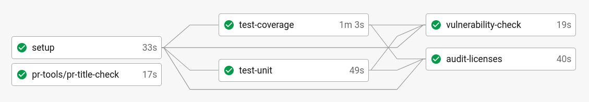
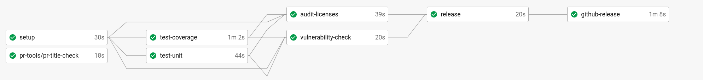
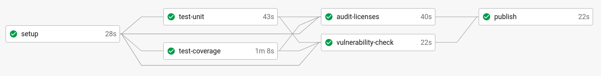
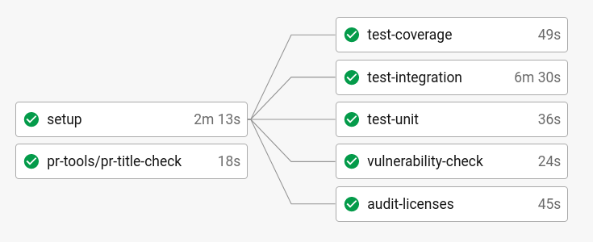
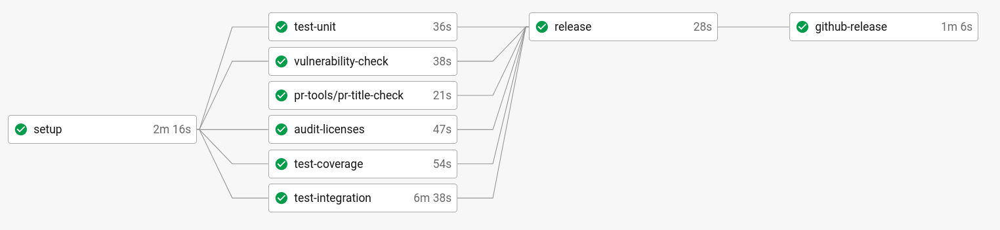
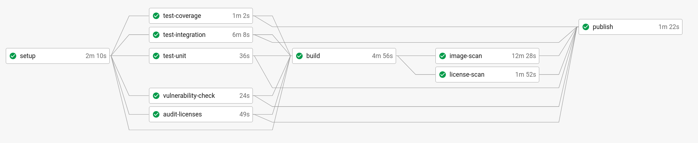

# Pipelines de CI/CD

La comunidad de Mojaloop usa [CircleCI](https://circleci.com/) para compilar, probar y desplegar 
automáticamente nuestro software. Este documento describe cómo usamos CI/CD en Mojaloop, las distintas 
comprobaciones que hacemos sobre el software y cómo lo distribuimos.

En términos generales, hay 2 tipos de flujo de trabajo que usamos, según el tipo de proyecto:
- Biblioteca: compilar proyecto node -> probar -> publicar en [npm](https://www.npmjs.com/search?q=%40mojaloop)
- Servicio: compilar imagen de docker -> probar -> publicar en [Docker Hub](https://hub.docker.com/u/mojaloop)

Además, también mantenemos un conjunto de [Mojaloop Helm Charts](http://docs.mojaloop.io/helm/), que se 
construyen a partir de [mojaloop/helm](https://github.com/mojaloop/helm)

## Bibliotecas

> Para ver un buen ejemplo de este patrón de CI/CD, consulte [central-services-shared](https://github.com/mojaloop/central-services-shared/blob/master/.circleci/config.yml)

### Flujo de pull request (PR):

El flujo de PR se ejecuta en los pull requests y, durante el [proceso de revisión de PR](https://github.com/mojaloop/documentation/blob/master/contributors-guide/standards/creating-new-features.md#creating-new-features), deben cumplirse estas comprobaciones
para que el código se pueda integrar.

| Paso | Descripción | Más información |
| ---  | ----------- | --------- |
| pr-title-check  | Comprueba que el título del PR se ajusta a la especificación de conventional commits | Definido en un orb de CircleCI aquí: [mojaloop/ci-config](https://github.com/mojaloop/ci-config) |
| test-coverage   | Ejecuta las pruebas unitarias y comprueba que la cobertura de código supera el límite especificado. | Normalmente es el 90% |
| test-unit       | Ejecuta las pruebas unitarias. Falla si falla alguna prueba unitaria. | |
| vulnerability-check | Ejecuta la herramienta `npm audit` para buscar vulnerabilidades en las dependencias | `npm audit` está lleno de falsos positivos, o de problemas de seguridad que no se aplican a nuestro código base. Usamos `npm-audit-resolver` para tener flexibilidad sobre las vulnerabilidades que se pueden ignorar, p. ej. `devDependencies` |
| audit-licenses | Ejecuta el `license-scanner-tool` de mojaloop y falla si alguna licencia encontrada no coincide con una lista de permitidos especificada en el `license-scanner-tool` | [repositorio license-scanner-tool](https://github.com/mojaloop/license-scanner-tool) |

### Flujo de master y de versión:

Este pipeline de CI/CD se ejecuta en la rama master/main:

| Paso | Descripción | Más información |
| ---  | ----------- | --------- |
| pr-title-check  | Véase más arriba | |
| test-coverage   | Véase más arriba | |
| test-unit       | Véase más arriba | |
| vulnerability-check | Véase más arriba | |
| audit-licenses | Véase más arriba | |
| release | Ejecuta una publicación que crea una etiqueta de git y envía la etiqueta de git | |
| github-release | Agrega los metadatos de la versión (p. ej. el changelog) a github, envía una alerta de slack a #announcements | |

### Flujo de etiquetas:

Una vez que se envía una etiqueta de git al repositorio, se activa un flujo de trabajo que termina 
publicando en `npm`. Es importante que todas las comprobaciones se vuelvan a ejecutar, para asegurar
que nada haya cambiado (p. ej. las dependencias) entre main/master y el artefacto real
que se publica en `npm`.

| Paso | Descripción | Más información |
| ---  | ----------- | --------- |
| pr-title-check  | Véase más arriba | |
| test-coverage   | Véase más arriba | |
| test-unit       | Véase más arriba | |
| vulnerability-check | Véase más arriba | |
| audit-licenses | Véase más arriba | |
| publish | Publica la última versión de la biblioteca según la etiqueta de git | |

## Servicios

> Para ver un buen ejemplo de este patrón de CI/CD, consulte [central-ledger](https://github.com/mojaloop/central-ledger/blob/master/.circleci/config.yml)

### Flujo de pull request (PR):

El flujo de PR se ejecuta en los pull requests y, durante el proceso de revisión de PR, deben cumplirse estas comprobaciones
para que el código se pueda integrar.

| Paso | Descripción | Más información |
| ---  | ----------- | --------- |
| pr-title-check      | Comprueba que el título del PR se ajusta a la especificación de conventional commits | Definido en un orb de CircleCI aquí: [mojaloop/ci-config](https://github.com/mojaloop/ci-config) |
| test-coverage       | Ejecuta las pruebas unitarias y comprueba que la cobertura de código supera el límite especificado. | Normalmente es el 90% |
| test-unit           | Ejecuta las pruebas unitarias. Falla si falla alguna prueba unitaria. | |
| test-integration    | Ejecuta las pruebas de integración. Normalmente compilando una imagen de docker localmente | |
| vulnerability-check | Ejecuta la herramienta `npm audit` para buscar vulnerabilidades en las dependencias | `npm audit` está lleno de falsos positivos, o de problemas de seguridad que no se aplican a nuestro código base. Usamos `npm-audit-resolver` para tener flexibilidad sobre las vulnerabilidades que se pueden ignorar, p. ej. `devDependencies` |
| audit-licenses | Ejecuta el `license-scanner-tool` de mojaloop y falla si alguna licencia encontrada no coincide con una lista de permitidos especificada en el `license-scanner-tool` | [repositorio license-scanner-tool](https://github.com/mojaloop/license-scanner-tool) |

### Flujo de master y de versión:

Este pipeline de CI/CD se ejecuta en la rama master/main:

| Paso | Descripción | Más información |
| ---  | ----------- | --------- |
| pr-title-check  | Véase más arriba | |
| test-coverage   | Véase más arriba | |
| test-unit       | Véase más arriba | |
| test-integration | Véase más arriba | |
| vulnerability-check | Véase más arriba | |
| audit-licenses | Véase más arriba | |
| release | Ejecuta una publicación que crea una etiqueta de git y envía la etiqueta de git | |
| github-release | Agrega los metadatos de la versión (p. ej. el changelog) a github, envía una alerta de slack a #announcements | |

### Flujo de etiquetas:

Una vez que se envía una etiqueta de git al repositorio, se activa un flujo de trabajo que termina 
publicando una imagen de docker en Docker Hub. Es importante que todas las comprobaciones se vuelvan a ejecutar,
y que se hagan más análisis sobre la imagen de docker antes de enviarla.

| Paso | Descripción | Más información |
| ---  | ----------- | --------- |
| pr-title-check      | Véase más arriba | |
| test-coverage       | Véase más arriba | |
| test-unit           | Véase más arriba | |
| vulnerability-check | Véase más arriba | |
| audit-licenses      | Véase más arriba | |
| build               | Compila la imagen de docker | |
| image-scan          | Ejecuta `anchore/analyze_local_image` para analizar la imagen | Consulte el Orb de CircleCI [anchore-engine](https://circleci.com/developer/orbs/orb/anchore/anchore-engine) para obtener más información. |
| license-scan        | Ejecuta el `license-scanner-tool` de mojaloop sobre las licencias contenidas en la imagen de docker | |
| publish | Publica la última versión de la biblioteca según la etiqueta de git | |
