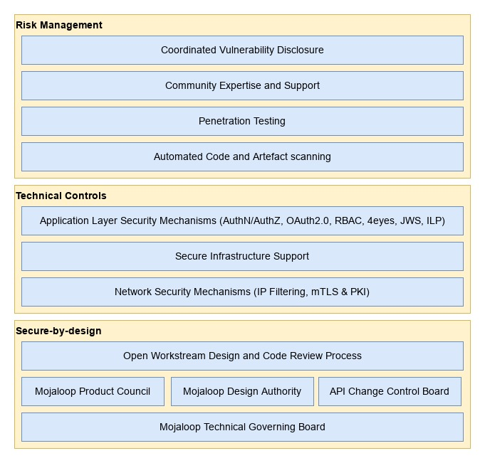
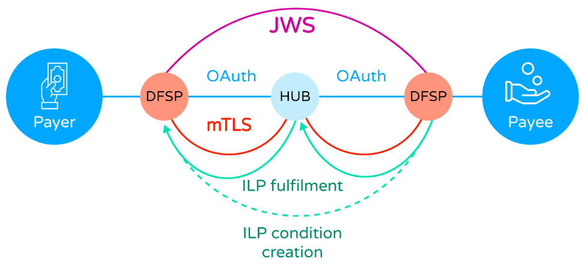

## Arquitectura de ciberseguridad de Mojaloop

## Introducción

Mojaloop adopta tanto el enfoque de seguridad por diseño como los enfoques basados en riesgo para la ciberseguridad, lo que significa que el software de código abierto que proporciona la Mojaloop Foundation se ha diseñado para ser seguro desde sus cimientos y se evalúa continuamente frente a posibles riesgos mediante varios procesos.

Además de las iniciativas de ciberseguridad que gestiona la Mojaloop Foundation, la comunidad más amplia de Mojaloop incluye expertos en ciberseguridad capaces de prestar consultoría y servicios para mejorar aún más las capacidades propias de los adoptantes.

Figura 1 - Capas de la arquitectura de ciberseguridad de Mojaloop

_Tenga en cuenta que, aunque la Mojaloop Foundation y la comunidad de Mojaloop procuran ofrecer software que sea seguro por diseño y que pueda operarse de forma segura, los adoptantes asumen la responsabilidad última de garantizar la seguridad de sus operaciones. Teniendo esto en cuenta, la Mojaloop Foundation recomienda encarecidamente que los adoptantes recurran a expertos en ciberseguridad para asegurarse de que se siguen las mejores prácticas de ciberseguridad y de que se cumplen todas las normas y regulaciones pertinentes y aplicables._

## Seguridad por diseño

### Procesos de revisión de diseño

La Mojaloop Foundation y la comunidad gestionan y operan varios procesos de revisión de diseño con conciencia de la seguridad que contribuyen a los enfoques de seguridad por diseño y de gestión de riesgos.

1. El Mojaloop Technical Governing Board determina los objetivos técnicos de ciberseguridad de alto nivel del proyecto Mojaloop, que son implementados por otros órganos y procesos de la comunidad.
2. La comunidad de Mojaloop opera una autoridad de diseño, que es un grupo gestionado de expertos en la materia elegidos del sector que se reúnen semanalmente para revisar aspectos técnicos del software de la plataforma, incluida la ciberseguridad, entre otros.
3. La comunidad de Mojaloop opera un comité de control de cambios de API, que es un grupo gestionado de expertos en la materia elegidos del sector que se reúnen semanalmente para revisar los aspectos del software de la plataforma relacionados con las API internas y externas. Este grupo tiene la responsabilidad específica de garantizar que todas las API de Mojaloop sean seguras por diseño y admitan los estándares del sector más recientes y mejores para asegurar los despliegues de la plataforma Mojaloop.
4. La comunidad de Mojaloop opera un consejo de producto, que es un grupo gestionado de expertos en la materia elegidos del sector que se reúnen semanalmente para revisar los diseños de las funcionalidades del producto. Este grupo contribuye a la arquitectura general de ciberseguridad de los productos de Mojaloop revisando los requisitos y especificaciones existentes de la plataforma Mojaloop y su seguridad, y creando otros nuevos.
5. Los estándares de la comunidad de Mojaloop exigen revisiones del diseño de las funcionalidades y del código por parte de miembros de la comunidad y de la fundación expertos en esas áreas del sistema antes de que se acepten cambios de código o código nuevo de los contribuyentes en las versiones oficiales.

## Controles técnicos

La plataforma Mojaloop emplea varias capas técnicas de seguridad, detalladas en las secciones siguientes, que contribuyen a una plataforma globalmente segura para realizar transacciones financieras.

1. En el nivel de transporte de red se emplea seguridad de la capa de transporte con autenticación mutua X.509 (mTLS) (se ofrecen orientaciones de mejores prácticas para los conjuntos de cifrado y los algoritmos de hash apropiados) para asegurar las conexiones entre los participantes del esquema de pagos y el Hub de Mojaloop. Este mecanismo, combinado con procesos de gestión de certificados y claves conformes a las mejores prácticas, impide la interceptación y la manipulación en las conexiones de red del esquema de pagos. Mojaloop ofrece directrices de mejores prácticas para las operaciones de PKI: [https://docs.mojaloop.io/api/fspiop/pki-best-practices.html](https://docs.mojaloop.io/api/fspiop/pki-best-practices.html).
2. Las Json Web Signatures (JWS) se usan en la capa de mensajes de la aplicación para garantizar una mensajería con evidencia de manipulación y el no repudio. Todos los participantes del esquema de pagos disponen de los medios para saber si un mensaje entrante ha sido manipulado durante la transmisión. Los participantes del esquema de pagos también pueden confiar en la identidad del originador del mensaje. Los servicios de Mojaloop pueden usar esta misma validación de firma para asegurarse de que los mensajes no han sido manipulados antes de procesarlos en el Hub.
3. Mojaloop usa el [InterLedger protocol](https://docs.mojaloop.io/api/fspiop/v1.1/api-definition.html#interledger-payment-request) (también conocido como ILP) durante las fases de cotización y transferencia, como mecanismo criptográfico de llave y cerradura, que usa criptografía asimétrica para impedir la manipulación de los términos acordados de la transferencia.
4. Mojaloop impone la idempotencia de las solicitudes y controles de transición de estado de las transacciones, que ayudan a mitigar los ataques de tipo repetición.
5. La plataforma Mojaloop incluye una capa de API gateway, que facilita el "filtrado de direcciones IP", la gestión de identidades y accesos con OAuth2.0 y los controles de acceso basados en roles, que ofrecen protección adicional frente a los ataques de infiltración.
6. Las interfaces de usuario internas y externas, por ejemplo para los participantes y para los usuarios de operaciones del Hub (técnicos / de negocio), se aseguran con mecanismos de OAuth2.0 y de control de acceso basado en roles (RBAC), en combinación con procesos maker-checker exigibles (también conocidos como 4eyes).
7. Mojaloop admite un modelo de Fraud and Risk Management Service (FRMS) para todo el esquema de pagos (compartido entre los proveedores de servicios financieros (FSP) y el Switch / Hub de Mojaloop).

Figura 2 - Arquitectura de ciberseguridad transaccional del esquema de pagos de Mojaloop

## Gestión de riesgos

### Pruebas de seguridad

#### Análisis automatizado de vulnerabilidades

Mojaloop emplea varios mecanismos técnicos para realizar una evaluación automatizada de vulnerabilidades sobre todos los repositorios de código fuente de la plataforma Mojaloop. Estos mecanismos analizan las dependencias del código y las imágenes de contenedor en busca de vulnerabilidades conocidas (procedentes de diversas bases de datos de vulnerabilidades estándar del sector actualizadas continuamente) de forma periódica y antes de que se acepten cambios o adiciones de código en las ramas principales. Esto reduce la probabilidad de que una vulnerabilidad conocida en una dependencia de Mojaloop llegue a una versión oficial.

#### Pruebas de penetración

Los miembros de la comunidad de Mojaloop realizan periódicamente pruebas de penetración sobre sus despliegues usando marcos habituales de pruebas de seguridad y comparten los resultados con la Mojaloop Foundation bajo un proceso de divulgación coordinada de vulnerabilidades, por el cual cualquier riesgo recién identificado puede mitigarse mediante los flujos de trabajo técnicos o los adoptantes antes de que terceros puedan abusar de las vulnerabilidades.

#### Experiencia y apoyo de la comunidad

La comunidad de Mojaloop, siguiendo los principios y procesos detallados en este documento, ofrece una plataforma de software que incorpora numerosas funcionalidades y capacidades de ciberseguridad. Sin embargo, para lograr las operaciones más seguras posibles, los adoptantes de la tecnología Mojaloop están obligados a desplegar y operar el software de forma segura. A menudo es una tarea difícil y abrumadora, con muchas normas y regulaciones aplicables que cumplir. La comunidad de Mojaloop incluye organizaciones con conocimiento y experiencia profundos en estas materias a las que se puede recurrir para obtener ayuda.

## Divulgación coordinada de vulnerabilidades

La Mojaloop Foundation opera un proceso de divulgación coordinada de vulnerabilidades. Este proceso es un modelo de divulgación de vulnerabilidades en el que una vulnerabilidad o un problema se divulga al público solo después de que las partes responsables hayan dispuesto de tiempo suficiente para parchear o subsanar la vulnerabilidad o el problema.

Muchos gobiernos y organizaciones internacionales respetadas recomiendan este método como el proceso preferido para gestionar las vulnerabilidades del software, ya que ofrece protecciones frente a la explotación por terceros de los problemas descubiertos mayores que las de los modelos alternativos.

## Controles organizativos

Además de los controles técnicos de ciberseguridad descritos en otras partes, Mojaloop ofrece una gama de herramientas de apoyo a los controles organizativos, lo que refleja la realidad de que, aunque los ataques de hacking y el fraude perpetrados por agentes externos generan la mayor cobertura mediática, los ataques con más éxito en cuanto al valor total del dinero defraudado son obra del propio personal de un servicio financiero.

Además de las herramientas que se proporcionan como parte de Mojaloop, se pueden hacer una serie de recomendaciones sobre los procesos de negocio que adopte un operador del Hub y que se refieren a la operación del servicio.

### Puntos de control

Mojaloop permite al operador del Hub definir puntos de control, en los que las acciones de un empleado están sujetas a las limitaciones que impone el propio Hub. Esto se sustenta en la capacidad de gestión de identidades y accesos de Mojaloop, que implementa un modelo de control de acceso basado en roles (RBAC). Toda acción de un empleado en el Hub solo se permite si el empleado tiene un privilegio específico; el propietario del Hub define un conjunto de roles, cada uno de los cuales es una colección de privilegios. Se crea una cuenta de empleado y se le asigna un rol (como responsable financiero, administrador, operador, etc.), que luego controla las funciones que puede realizar.

El RBAC se complementa después con controles maker/checker. Las funciones sensibles (como los movimientos de fondos) puede definirlas (“made”) un operador, pero solo se llevarán a cabo cuando las autorice (“checked”), por ejemplo, un operador financiero.

Todas las acciones de los empleados se registran en un registro de auditoría que no se puede manipular. Esto permite a los auditores forenses ver toda la actividad y, si es necesario, “seguir el dinero” cuando surge un problema debido, por ejemplo, a la connivencia entre empleados y la alta dirección.

### Controles de negocio

La operación de un Hub de Mojaloop es un servicio financiero, y la seguridad del servicio debería tratarse igual que la de cualquier otro servicio financiero, como el de un banco o el de un switch de pagos internacional. Los controles de negocio son la primera línea de defensa y limitan la superficie de ataque incluso antes de que los puntos de control sean accesibles.

Los controles de negocio deberían incluir lo siguiente:

* La ciberseguridad puede verse socavada por personal malintencionado. Los operadores del Hub deberían realizar las comprobaciones de antecedentes adecuadas al contratar personal, incluidas comprobaciones de antecedentes policiales o penales y de referencias crediticias para detectar un endeudamiento excesivo (vulnerabilidad al soborno por parte de atacantes externos).
* Atención estricta a la seguridad física de las instalaciones del operador del Hub (donde se realiza el acceso al Hub de Mojaloop; el acceso remoto, es decir, el trabajo desde casa, **nunca** debería permitirse), lo que incluye:
    * Que haya una sola entrada, estrictamente controlada, a las instalaciones del operador del Hub.
    * Que las demás entradas estén aseguradas y que las salidas de emergencia tengan alarmas.
    * Que todas las salas estén aseguradas con cerraduras biométricas, requieran registro de entrada **y** de salida para controlar el tailgating, y que el acceso esté restringido según la función laboral.
    * Al personal en puestos de cara al cliente o del departamento financiero no debe permitírsele tener sus teléfonos celulares consigo en las instalaciones; los teléfonos deberían guardarse en casilleros metálicos (jaulas de Faraday) durante la jornada laboral.
    * Videovigilancia y grabación las 24 horas de todas las áreas (las cámaras deben estar orientadas en dirección opuesta a las pantallas que puedan mostrar información sensible).
    * Comprobar y registrar cuidadosamente la identidad de los visitantes.
    * No permitir que los visitantes lleven ningún equipo electrónico a las áreas operativas.
        * **Solo** en áreas no operativas se pueden permitir teléfonos celulares y computadoras portátiles. No obstante, deberían registrarse los números de serie de las computadoras portátiles, y los proveedores deberían **comprobar que los visitantes se van con el mismo equipo que trajeron**. Intercambiar computadoras portátiles es el método más rápido de robar datos.
    * Asegurarse de que a los visitantes los acompañe un miembro del personal que sea responsable de su conducta.
    * Mantenerse continuamente atento a la actividad de los visitantes:
        * No dejar que los visitantes deambulen sin acompañamiento.
        * No dejar que los visitantes inserten unidades USB u otros dispositivos en las computadoras portátiles, impresoras, etc. de la empresa.

Tenga en cuenta que esto es solo un subconjunto de los controles que esperaríamos para asegurar las operaciones de un operador del Hub. Un posible operador del Hub debería buscar asesoramiento especializado antes de lanzar un servicio.
