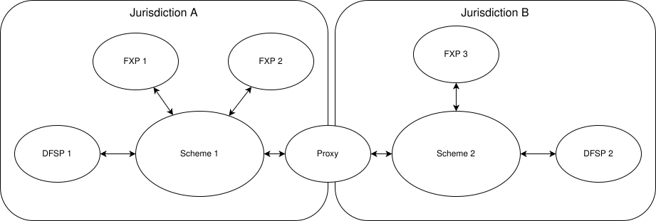

# Transacciones transfronterizas

*Esta página supone que el lector está familiarizado tanto con las [**capacidades interscheme**](./InterconnectingSchemes.md) de Mojaloop como con el funcionamiento de la [**conversión de divisas**](./ForeignExchange.md).*

La versión actual de Mojaloop trata una transacción transfronteriza como una transacción que sale de un esquema de pagos y se pasa a otro en una jurisdicción regulatoria diferente. Por lo tanto, en términos de Mojaloop, es una transacción interscheme que incluye una conversión de divisas.

El siguiente diagrama ilustra cómo Mojaloop implementa esta funcionalidad.

En este contexto, un Proxy actúa como el enlace entre dos esquemas de pagos de Mojaloop que operan en países (jurisdicciones regulatorias) diferentes, facilitando las transacciones y garantizando su no repudio de extremo a extremo. Se ilustran múltiples FXP, dos en la jurisdicción A y uno en la jurisdicción B, de modo que se puedan admitir los diversos modelos de negocio propuestos para las transacciones FX.

Este modelo puede ampliarse aún más, de modo que los países que ya cuentan con sistemas de pagos instantáneos nacionales puedan interconectarse, de la siguiente manera: 

## Aplicabilidad

Esta versión de este documento corresponde a la versión [17.0.0](https://github.com/mojaloop/helm/releases/tag/v17.0.0) de Mojaloop

## Historial del documento
  |Versión|Fecha|Autor|Detalle|
|:--------------:|:--------------:|:--------------:|:--------------:|
|1.1|22 de abril de 2025| Paul Makin|Se agregó el historial de versiones; se aclaró parte de la redacción|
|1.0|14 de abril de 2025| Paul Makin|Versión inicial|