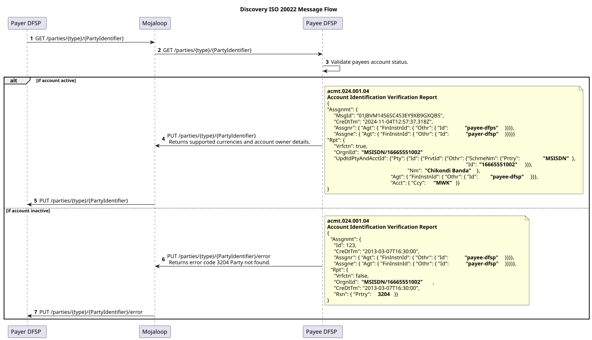
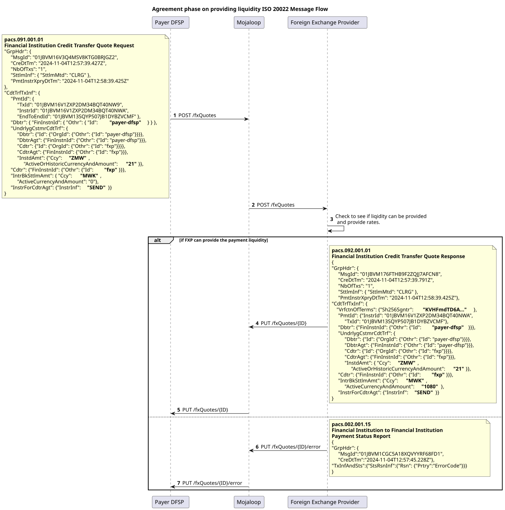
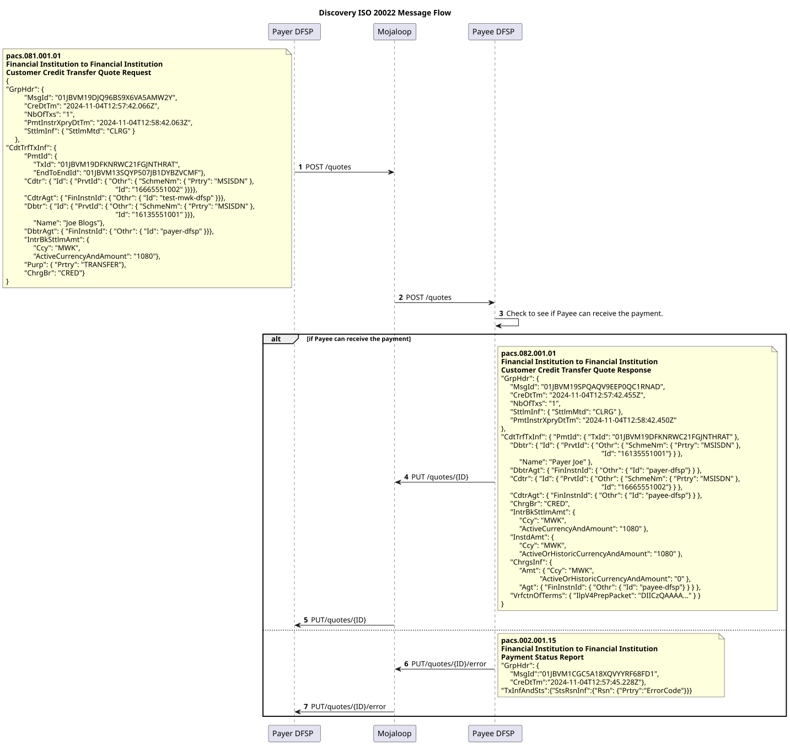
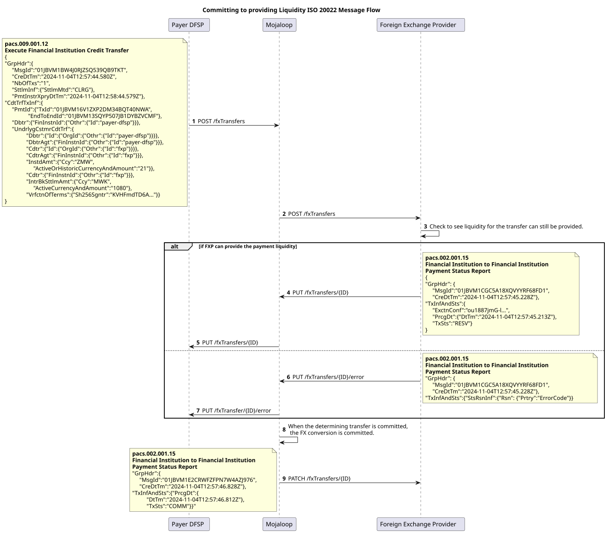
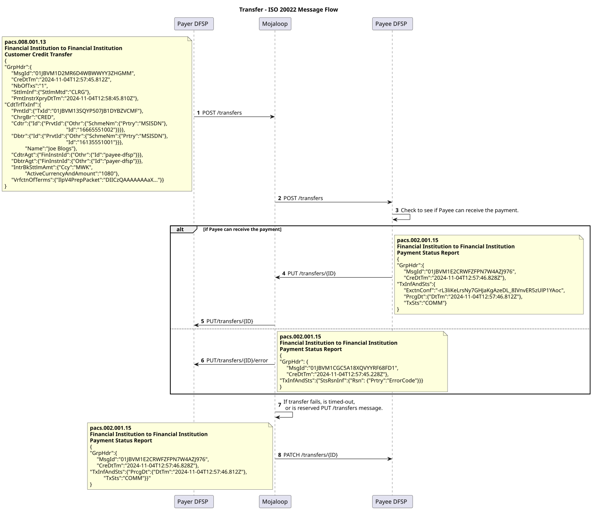

# v1.0: documento de práctica de mercado ISO 20022 de Mojaloop
 
<!-- TOC depthfrom:1 depthto:3 orderedlist:true -->

- [1. Documento de práctica de mercado ISO 20022 de Mojaloop](#v1-0-documento-de-practica-de-mercado-iso-20022-de-mojaloop)
- [2. Introducción](#_2-introduccion)
    - [2.1. ¿Cómo usar este documento?](#_2-1-¿como-usar-este-documento)
        - [2.1.1. Relación con los documentos de reglas específicos del esquema de pagos](#_2-1-1-relacion-con-los-documentos-de-reglas-especificos-del-esquema-de-pagos)
        - [2.1.2. Distinción entre las prácticas genéricas y los requisitos específicos del esquema de pagos](#_2-1-2-distincion-entre-las-practicas-genericas-y-los-requisitos-especificos-del-esquema-de-pagos)
- [3. Expectativas, obligaciones y reglas de los mensajes](#_3-expectativas-obligaciones-y-reglas-de-los-mensajes)
    - [3.1. Conversión de divisas](#_3-1-conversion-de-divisas)
    - [3.2. Mensajes JSON](#_3-2-mensajes-json)
    - [3.3. API](#_3-3-api)
        - [3.3.1. Detalles de los encabezados](#_3-3-1-detalles-de-los-encabezados)
        - [3.3.2. Respuestas HTTP admitidas](#_3-3-2-respuestas-http-admitidas)
        - [3.3.3. Carga útil de error común](#_3-3-3-carga-util-de-error-comun)
    - [3.4. Los ULID como identificadores únicos](#_3-4-los-ulid-como-identificadores-unicos)
    - [3.5. Inter-ledger Protocol v4 para representar los términos criptográficos](#_3-5-inter-ledger-protocol-v4-para-representar-los-terminos-criptograficos)
    - [3.6. Campos de datos suplementarios de ISO 20022](#_3-6-campos-de-datos-suplementarios-de-iso-20022)
- [4. Fase de descubrimiento](#_4-fase-de-descubrimiento)
    - [4.1. Flujo de mensajes](#_4-1-flujo-de-mensajes)
    - [4.2. Recurso Parties](#_4-2-recurso-parties)
- [5. Fase de acuerdo](#_5-fase-de-acuerdo)
    - [5.1. Subfase de acuerdo de conversión de divisas](#_5-1-subfase-de-acuerdo-de-conversion-de-divisas)
        - [5.1.1. Flujo de mensajes](#_5-1-1-flujo-de-mensajes)
        - [5.1.2. Recurso fxQuotes](#_5-1-2-recurso-fxquotes)
    - [5.2. Subfase de acuerdo de los términos de la transferencia](#_5-2-subfase-de-acuerdo-de-los-terminos-de-la-transferencia)
        - [5.2.1. Flujo de mensajes](#_5-2-1-flujo-de-mensajes)
        - [5.2.2. Recurso Quotes](#_5-2-2-recurso-quotes)
- [6. Fase de transferencia](#_6-fase-de-transferencia)
    - [6.1. Aceptación de los términos de conversión de divisas](#_6-1-aceptacion-de-los-terminos-de-conversion-de-divisas)
        - [6.1.1. Flujo de mensajes](#_6-1-1-flujo-de-mensajes)
        - [6.1.2. Recurso fxTransfers](#_6-1-2-recurso-fxtransfers)
    - [6.2. Ejecución y compensación de la transferencia](#_6-2-ejecucion-y-compensacion-de-la-transferencia)
        - [6.2.1. Flujo de mensajes](#_6-2-1-flujo-de-mensajes)
        - [6.2.2. Recurso Transfers](#_6-2-2-recurso-transfers)

<!-- /TOC -->
# 2. Introducción

Al combinar los principios de la inclusión financiera con las sólidas capacidades de ISO 20022, Mojaloop asegura que los DFSP y otras partes interesadas puedan ofrecer soluciones de pago en tiempo real que sean rentables, seguras y escalables para atender las exigencias de los ecosistemas financieros inclusivos. Este documento es la versión 1.0 de la práctica de mercado ISO-20022 de Mojaloop.

## 2.1 ¿Cómo usar este documento?
Este documento proporciona una referencia fundamental para implementar la mensajería ISO 20022 para los IIPS dentro de los esquemas de pagos basados en Mojaloop. Describe las directrices y prácticas generales que se aplican de forma universal en todos los esquemas de pagos de Mojaloop y se centra en los requisitos de nivel base. Sin embargo, está diseñado para complementarse con documentos de reglas específicos del esquema de pagos, que pueden definir campos de mensaje, validaciones y reglas adicionales que hagan falta para cumplir con las regulaciones y los requisitos particulares de cada esquema de pagos. Este enfoque por capas permite que cada esquema de pagos adapte sus detalles de implementación manteniendo la coherencia con el marco más amplio de Mojaloop.

### 2.1.1 Relación con los documentos de reglas específicos del esquema de pagos
Este documento sirve de base para entender cómo se aplica ISO 20022 en Mojaloop y se centra en los principios y las prácticas fundamentales. Sin embargo, no prescribe los requisitos de negocio detallados, las validaciones ni los marcos de gobernanza que son propios de cada esquema de pagos. Las reglas específicas del esquema de pagos abordan esos detalles, incluidas las especificaciones de campos obligatorios y opcionales, los protocolos de cumplimiento adaptados y los procedimientos definidos para el manejo de errores. También abarcan las reglas de negocio que rigen los flujos de mensajes, los roles de los participantes y las responsabilidades dentro del esquema de pagos. La flexibilidad de este documento permite que los administradores del esquema de pagos adapten y amplíen sus orientaciones para atender sus necesidades operativas particulares.

### 2.1.2 Distinción entre las prácticas genéricas y los requisitos específicos del esquema de pagos
Este documento separa claramente las prácticas genéricas de los requisitos específicos del esquema de pagos para lograr un equilibrio entre coherencia y adaptabilidad en las implementaciones de ISO 20022 dentro de Mojaloop. Las prácticas genéricas que se describen aquí establecen principios fundamentales, entre ellos las expectativas sobre las estructuras de los mensajes, los campos requeridos para cumplir los requisitos del Switch, los campos admitidos y los flujos transaccionales. Además, ofrecen una descripción general de alto nivel del ciclo de vida de la transferencia P2P con FX de Mojaloop.

Los requisitos específicos del esquema de pagos, documentados por separado, profundizan en asignaciones de campos adicionales, validaciones mejoradas y reglas precisas de liquidación, conciliación y resolución de disputas. Estos requisitos también abarcan las políticas de gobernanza y las obligaciones de cumplimiento adaptadas a las necesidades particulares de cada esquema de pagos.

Esta distinción permite que los DFSP implementen un marco de mensajería central coherente, al tiempo que otorga a los administradores del esquema de pagos la flexibilidad de definir los aspectos operativos concretos. Las prácticas genéricas que se presentan en este documento están diseñadas a propósito para ser extensibles, de modo que aseguran una integración fluida con las reglas específicas del esquema de pagos y respaldan el apego a los estándares ISO 20022 para IIPS de Mojaloop.

# 3 Expectativas, obligaciones y reglas de los mensajes
El proceso de transferencia de Mojaloop se divide en tres fases clave, cada una esencial para asegurar transacciones seguras y eficientes. Estas fases usan recursos específicos para habilitar las interacciones entre participantes y asegurar una comunicación, un acuerdo y una ejecución claros. Aunque algunas fases y recursos son opcionales, el objetivo último es asegurar que cada transferencia sea exacta y segura y que se ajuste a los términos acordados. 
1. [Descubrimiento](#_4-fase-de-descubrimiento)
2. [Acuerdo](#_5-fase-de-acuerdo)
3. [Transferencia](#_6-fase-de-transferencia)

## 3.1 Conversión de divisas
La conversión de divisas se incluye para dar soporte a las transacciones entre divisas. Como no siempre se requiere, los mensajes y flujos asociados solo se usan cuando hacen falta, lo que asegura flexibilidad tanto en los escenarios de una sola divisa como en los de varias divisas.

## 3.2 Mensajes JSON
Mojaloop adopta una variante JSON de los mensajes ISO 20022 y se aparta del formato XML tradicional para mejorar la eficiencia y la compatibilidad con las API modernas. La organización ISO 20022 está desarrollando activamente una representación JSON canónica de sus mensajes, y Mojaloop busca alinearse con ese estándar a medida que evoluciona.

## 3.3 API
En Mojaloop, los mensajes ISO 20022 se intercambian mediante llamadas a API de estilo REST. Este enfoque mejora la interoperabilidad, reduce la sobrecarga de datos gracias a mensajes JSON livianos y admite implementaciones escalables y modulares. Al integrar ISO 20022 con las API REST, Mojaloop ofrece un marco sólido y adaptable que equilibra los estándares globales con las necesidades prácticas de implementación. 

### 3.3.1 Detalles de los encabezados 
El encabezado del mensaje de la API debería contener los siguientes detalles. Los encabezados requeridos se indican con un asterisco `*`.

| Nombre&nbsp;&nbsp;&nbsp;&nbsp;&nbsp;&nbsp;&nbsp;&nbsp;&nbsp;&nbsp;&nbsp;&nbsp;&nbsp;&nbsp;&nbsp;&nbsp;&nbsp;&nbsp;&nbsp;&nbsp;&nbsp;&nbsp;&nbsp;&nbsp;&nbsp;&nbsp;&nbsp;&nbsp;&nbsp;&nbsp;&nbsp;&nbsp;| Descripción |
|--|--|
|**Content-Length** *integer* (header)|El campo de encabezado `Content-Length` indica el tamaño previsto del cuerpo de la carga útil. Solo se envía si hay cuerpo.**Nota:** La API admite un tamaño máximo de 5242880 bytes (5 megabytes).|
| * **Type** *string* (path)|El tipo del identificador de parte. Por ejemplo, `MSISDN`, `PERSONAL_ID`.|
| * **ID** *string* (path)| El valor del identificador.|
| * **Content-Type**  *string* (header)|El encabezado `Content-Type` indica la versión específica de la API que se usó para enviar el cuerpo de la carga útil.|
| * **Date** *string* (header)|El campo de encabezado `Date` indica la fecha en que se envió la solicitud.|
| **X-Forwarded-For**   *string* (header)|El campo de encabezado `X-Forwarded-For` es un estándar aceptado de manera no oficial que se usa con fines informativos sobre la dirección IP del cliente de origen, ya que una solicitud puede pasar por varios proxies, firewalls, etc. Quienes implementan la API deberían prever y admitir varios valores de `X-Forwarded-For`.**Nota:** En [RFC 7239](https://tools.ietf.org/html/rfc7239) se define una alternativa a `X-Forwarded-For`. Sin embargo, hasta ahora RFC 7239 está menos usado y admitido que `X-Forwarded-For`.|
| * **FSPIOP-Source**   *string* (header)|El campo de encabezado `FSPIOP-Source` es un campo no estándar de HTTP que la API usa para identificar al remitente de la solicitud HTTP. El campo debería establecerlo el remitente original de la solicitud. Es requerido para el enrutamiento y la verificación de firma (véase el campo de encabezado `FSPIOP-Signature`).|
| **FSPIOP-Destination**   *string* (header)|El campo de encabezado `FSPIOP-Destination` es un campo no estándar de HTTP que la API usa para el enrutamiento de solicitudes y respuestas hacia el destino con base en encabezados HTTP. El campo debe establecerlo el remitente original de la solicitud si se conoce el destino (válido para todos los servicios excepto GET /parties), de modo que las entidades que haya entre el cliente y el servidor no necesiten analizar la carga útil con fines de enrutamiento. Si no se conoce el destino (válido para el servicio GET /parties), el campo debería dejarse vacío.|
| **FSPIOP-Encryption**   *string* (header) | El campo de encabezado `FSPIOP-Encryption` es un campo no estándar de HTTP que la API usa para aplicar el cifrado de extremo a extremo de la solicitud.|
| **FSPIOP-Signature**   *string*   (header)| El campo de encabezado `FSPIOP-Signature` es un campo no estándar de HTTP que la API usa para aplicar una firma de extremo a extremo de la solicitud.|
| **FSPIOP-URI**   *string*   (header) | El campo de encabezado `FSPIOP-URI` es un campo no estándar de HTTP que la API usa para la verificación de firma; debería contener el URI del servicio. Es requerido si se usa la verificación de firma; para más información, véase [el documento de firma de la API](https://docs.mojaloop.io/technical/api/fspiop/).|
| **FSPIOP-HTTP-Method**   *string*   (header) | El campo de encabezado `FSPIOP-HTTP-Method` es un campo no estándar de HTTP que la API usa para la verificación de firma; debería contener el método HTTP del servicio. Es requerido si se usa la verificación de firma; para más información, véase [el documento de firma de la API](https://docs.mojaloop.io/technical/api/fspiop/).|

### 3.3.2 Respuestas HTTP admitidas

| **Código de error HTTP** | **Descripción y causas comunes** |
|---|----|
|**400 Bad Request** | **Descripción**: El servidor no pudo entender la solicitud debido a una sintaxis no válida. Esta respuesta indica que la solicitud estaba mal formada o contenía parámetros no válidos. **Causas comunes**: Campos requeridos ausentes, valores de campo no válidos o formato de solicitud incorrecto. |
|**401 Unauthorized** | **Descripción**: El cliente debe autenticarse para obtener la respuesta solicitada. Esta respuesta indica que la solicitud carece de credenciales de autenticación válidas. **Causas comunes**: Token de autenticación ausente o no válido. |
|**403 Forbidden** | **Descripción**: El cliente no tiene derechos de acceso al contenido. Esta respuesta indica que el servidor entendió la solicitud, pero se niega a autorizarla. **Causas comunes**: Permisos insuficientes para acceder al recurso. |
|**404 Not Found** | **Descripción**: El servidor no puede encontrar el recurso solicitado. Esta respuesta indica que el recurso especificado no existe. **Causas comunes**: Identificador de recurso incorrecto o el recurso se eliminó. |
|**405 Method Not Allowed** | **Descripción**: El servidor conoce el método de la solicitud, pero el recurso de destino no lo admite. Esta respuesta indica que el método HTTP usado no está permitido para el endpoint. **Causas comunes**: Uso de un método HTTP no admitido (p. ej., POST en lugar de PUT). |
|**406 Not Acceptable** | **Descripción**: El servidor no puede producir una respuesta que coincida con la lista de valores aceptables definida en los encabezados de negociación proactiva de contenido de la solicitud. Esta respuesta indica que el servidor no puede generar una respuesta que sea aceptable según los encabezados Accept enviados en la solicitud. **Causas comunes**: Tipo de medio o formato no admitido especificado en el encabezado Accept. |
|**501 Not Implemented** | **Descripción**: El servidor no admite la funcionalidad requerida para atender la solicitud. Esta respuesta indica que el servidor no reconoce el método de la solicitud o carece de la capacidad de atenderla. **Causas comunes**: La funcionalidad solicitada no está implementada en el servidor. |
|**503 Service Unavailable** | **Descripción**: El servidor no está listo para gestionar la solicitud. Esta respuesta indica que el servidor no puede gestionar temporalmente la solicitud debido a mantenimiento o sobrecarga. **Causas comunes**: Mantenimiento del servidor, sobrecarga temporal o caída del servidor. |

### 3.3.3 Carga útil de error común

Todas las respuestas de error devuelven una estructura de carga útil común que incluye un mensaje específico. La carga útil contiene normalmente los siguientes campos:

- **errorCode**: Un código que representa el error específico.
- **errorDescription**: Una descripción del error.
- **extensionList**: Una lista opcional de pares clave-valor que proporcionan información adicional sobre el error.

Esta carga útil de error común ayuda a los clientes a entender la naturaleza del error y a tomar las acciones apropiadas.

## 3.4 Los ULID como identificadores únicos
Mojaloop emplea los Universally Unique Lexicographically Sortable Identifiers (ULID) como estándar para los identificadores únicos en todo su sistema de mensajería. Los ULID ofrecen una alternativa sólida a los UUID tradicionales, ya que aseguran identificadores únicos a nivel global y, además, permiten un ordenamiento natural por hora de creación. Este ordenamiento lexicográfico simplifica la trazabilidad, el diagnóstico de problemas y la analítica operativa.

## 3.5 Inter-ledger Protocol (v4) para representar los términos criptográficos
Mojaloop aprovecha la versión 4 del Inter-ledger Protocol (ILP) para definir y representar los términos criptográficos en sus procesos de transferencia. ILP v4 proporciona un marco estandarizado para el intercambio seguro e interoperable de instrucciones de pago, que asegura la integridad y el no repudio de las transacciones. Al integrar las capacidades criptográficas de ILP, Mojaloop admite acuerdos precisos e inalterables entre participantes, lo que permite una ejecución segura de la transferencia de extremo a extremo manteniendo la compatibilidad con los ecosistemas de pagos globales.

## 3.6 Campos de datos suplementarios de ISO 20022

No se espera que se requieran campos de datos suplementarios de ISO 20022 para ninguno de los mensajes usados. Si se proporcionan datos suplementarios, el Switch no rechazará el mensaje; sin embargo, ignorará su contenido y se comportará como si los datos suplementarios no estuvieran presentes.

# 4. Fase de descubrimiento
La fase de descubrimiento es un paso opcional del proceso de transferencia, necesario solo cuando el beneficiario (la parte final) debe identificarse y confirmarse antes de iniciar un acuerdo. Esta fase utiliza el recurso parties, que facilita la obtención y la validación de la información del beneficiario para asegurar que sea elegible para recibir la transferencia. Entre las comprobaciones clave que se realizan durante esta fase están verificar que la cuenta del beneficiario esté activa, identificar las divisas que se pueden transferir a la cuenta y confirmar los datos del titular de la cuenta. Esta información permite que el pagador verifique con exactitud los datos del beneficiario, lo que reduce el riesgo de errores y asegura una base segura para las fases posteriores del proceso de transferencia.

## 4.1 Flujo de mensajes

El diagrama de secuencia muestra los mensajes de ejemplo del descubrimiento en una transferencia P2P iniciada por el pagador.

## 4.2 Recurso Parties
El recurso Parties proporciona toda la funcionalidad necesaria en la fase de descubrimiento de una transferencia. La funcionalidad siempre se inicia con una llamada GET /parties, y las respuestas a esta se devuelven al originador mediante un callback PUT /parties. Los mensajes de error se devuelven mediante el callback PUT /parties/.../error. Estos endpoints admiten un sub id type opcional.

| Endpoint | Mensaje |
|--- | --- |
|[GET /parties/{type}/{partyIdentifier}[/{subId}]](./script/parties_GET.md) |  |
|[PUT /parties/{type}/{partyIdentifier}[/{subId}]](./script/parties_PUT.md) | acmt.024.001.04 |
|[PUT /parties/{type}/{partyIdentifier}[/{subId}]/error](./script/parties_error_PUT.md) | acmt.024.001.04 |

# 5. Fase de acuerdo
La **fase de acuerdo** es un paso crítico del proceso de transferencia de Mojaloop, ya que asegura que todas las partes involucradas tengan un entendimiento compartido de los términos de la transferencia antes de comprometer fondos. Esta fase cumple varios propósitos esenciales:
1. **Cálculo y acuerdo de las tarifas** 
La fase de acuerdo brinda una oportunidad para calcular y acordar mutuamente cualquier tarifa aplicable. Esto asegura transparencia y evita disputas relacionadas con los cargos después de iniciar la transferencia.
1. **Validación previa al compromiso** 
Permite que cada organización participante verifique si la transferencia puede continuar. Este paso ayuda a identificar y atender posibles problemas de forma temprana, lo que reduce los errores durante la transferencia y minimiza las discrepancias de conciliación.
1. **Firma criptográfica de los términos** 
Los términos de la transferencia se firman criptográficamente durante esta fase. Este mecanismo asegura el no repudio, es decir, que las partes no puedan negar su participación en la transacción ni su acuerdo con ella. Para realizar esta firma criptográfica se usa el Interledger Protocol. Los detalles sobre cómo producir un paquete ILP se definen aquí: [Documentación de la API FSPIOP de Mojaloop](https://docs.mojaloop.io/technical/api/fspiop/).
1. **Promoción de la inclusión financiera** 
Al presentar a todas las partes los términos completos de la transferencia por adelantado, la fase de acuerdo asegura que los participantes estén plenamente informados antes de asumir cualquier compromiso. Esta transparencia apoya la inclusión financiera, ya que permite una toma de decisiones justa e informada para todas las partes interesadas.

La fase de acuerdo no solo mejora la fiabilidad y la eficiencia de las transferencias de Mojaloop, sino que también se alinea con su objetivo más amplio de fomentar la confianza y la inclusión en los ecosistemas financieros digitales.

La fase de acuerdo se divide, a su vez, en dos fases. 

## 5.1 Subfase de acuerdo de conversión de divisas
La subfase de acuerdo de conversión de divisas es un paso opcional dentro de la fase de acuerdo, que se activa solo cuando la transferencia implica una conversión de divisas. Durante esta subfase, el DFSP pagador (proveedor de servicios financieros digitales) se coordina con un proveedor de cambio de divisas (FX) para asegurar la liquidez entre divisas requerida para completar la transacción. Este paso establece las tasas FX y las tarifas asociadas, de modo que tanto el DFSP como el FXP puedan confiar en términos de conversión transparentes y acordados. Al atender las necesidades de conversión de divisas antes de comprometerse con la transferencia, esta subfase ayuda a evitar demoras y discrepancias, y respalda una experiencia de transacción transfronteriza fluida.

### 5.1.1 Flujo de mensajes

El diagrama de secuencia muestra los mensajes de ejemplo del descubrimiento en una transferencia P2P iniciada por el pagador.

### 5.1.2 Recurso fxQuotes

| Endpoint | Mensaje |
|--- | --- |
|[POST /fxQuotes/{ID}](./script/fxquotes_POST.md) | **pacs.091.001** |
|[PUT /fxQuotes/{ID}](./script/fxquotes_PUT.md) | **pacs.092.001** |
|[PUT /fxQuotes/{ID}/error](./script/fxquotes_error_PUT.md) | **pacs.002.001.15** |

## 5.2 Subfase de acuerdo de los términos de la transferencia
La subfase de acuerdo de los términos de extremo a extremo implica el establecimiento colaborativo de los términos de la transferencia entre el DFSP pagador y el DFSP beneficiario. Este proceso asegura que ambas partes estén alineadas en detalles críticos como el monto a transferir, las tarifas y los requisitos de tiempo. Esta subfase también facilita la firma criptográfica de estos términos, lo que proporciona un marco sólido de no repudio y de rendición de cuentas. Al cerrar los términos de la transferencia de manera transparente, esta subfase minimiza el riesgo de errores o disputas y mejora la eficiencia y la confiabilidad del proceso de transferencia de Mojaloop en su conjunto.

### 5.2.1 Flujo de mensajes

El diagrama de secuencia muestra los mensajes de ejemplo del descubrimiento en una transferencia P2P iniciada por el pagador.

### 5.2.2 Recurso Quotes

| Endpoint | Mensaje |
| ------------- | --- |
|[POST /quotes/{ID}](./script/quotes_POST.md) | **pacs.081.001** |
|[PUT /quotes/{ID}](./script/quotes_PUT.md) | **pacs.082.001** |
|[PUT /quotes/{ID}/error](./script/quotes_error_PUT.md) | **pacs.002.001.15** |

# 6. Fase de transferencia
Una vez que los acuerdos se han establecido correctamente durante la fase de acuerdo, la aceptación de estos términos desencadena la fase de transferencia, donde ocurre el movimiento efectivo de los fondos. Esta fase se ejecuta con precisión para asegurar que se honren los términos acordados y que todos los participantes cumplan sus compromisos. La fase de transferencia se divide en dos subfases: la subfase de ejecución de la conversión de divisas y la subfase de compensación de la transferencia, cada una correspondiente a su respectiva subfase de la fase de acuerdo.

## 6.1 Aceptación de los términos de conversión de divisas
La subfase de ejecución de la conversión de divisas ocurre si la transferencia implica un intercambio de divisas. En este paso, el proveedor de cambio de divisas, según lo acordado durante la fase de acuerdo, ejecuta la conversión de divisas. Se aporta la liquidez requerida para la transferencia entre divisas y los fondos convertidos se preparan para su movimiento posterior hacia el DFSP beneficiario. Esta subfase es una oportunidad para que el FXP asegure que se respeten las tasas FX y las tarifas acordadas antes, lo que salvaguarda la integridad financiera y la transparencia de la transacción.

### 6.1.1 Flujo de mensajes

El diagrama de secuencia muestra los mensajes de ejemplo de la transferencia en una transferencia P2P iniciada por el pagador.

### 6.1.2 Recurso fxTransfers

| Endpoint | Mensaje |
| -------- | --- |
|[POST /fxTransfers/{ID}](./script/fxtransfers_POST.md) | **pacs.009.001** |
|[PUT /fxTransfers/{ID}](./script/fxtransfers_PUT.md) | **pacs.002.001.15** |
|[PUT /fxTransfers/{ID}/error](./script/fxtransfers_error_PUT.md) | **pacs.002.001.15** |
|[PATCH /fxTransfers/{ID}/error](./script/fxtransfers_PATCH.md) | **pacs.002.001.15** |

## 6.2 Ejecución y compensación de la transferencia 
La subfase de liquidación de fondos implica la transferencia efectiva de fondos entre el DFSP pagador y el DFSP beneficiario. Este paso asegura que el monto acordado, incluidas las tarifas asociadas, se compense con exactitud en las cuentas correspondientes. Esta subfase completa la transacción financiera y cumple los compromisos asumidos durante la fase de acuerdo. Mediante mecanismos seguros y eficientes de movimiento de fondos, esta subfase asegura que la transferencia se complete sin contratiempos y conforme a los términos acordados.

### 6.2.1 Flujo de mensajes

El diagrama de secuencia muestra los mensajes de ejemplo del descubrimiento en una transferencia P2P iniciada por el pagador.

### 6.2.2 Recurso Transfers

| Endpoint | Mensaje |
| --------- | --- |
|[POST /transfers/{ID}](./script/transfers_POST.md) | **pacs.008.001** |
|[PUT /transfers/{ID}](./script/quotes_PUT.md) | **pacs.002.001.15** |
|[PUT /transfers/{ID}/error](./script/quotes_error_PUT.md) | **pacs.002.001.15** |
|[PATCH /transfers/{ID}/error](./script/transfers_PATCH.md) | **pacs.002.001.15** |

