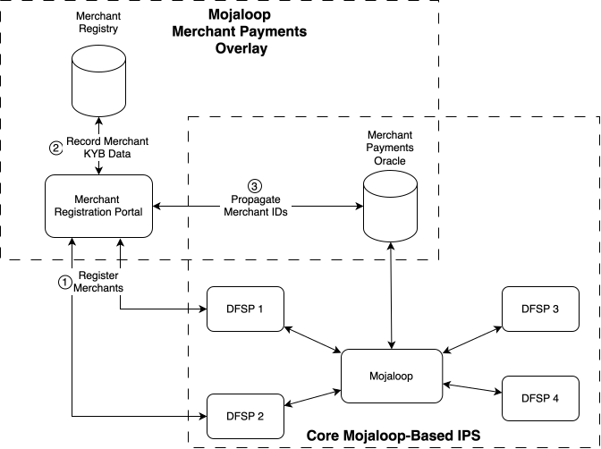
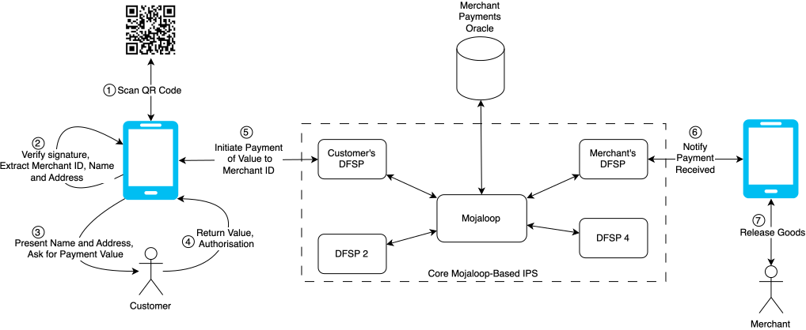
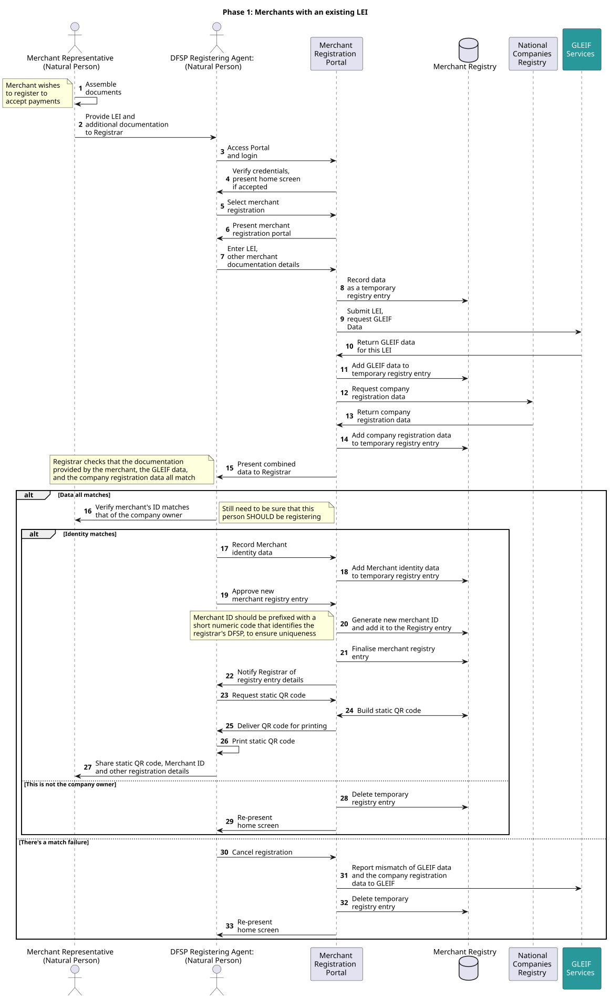
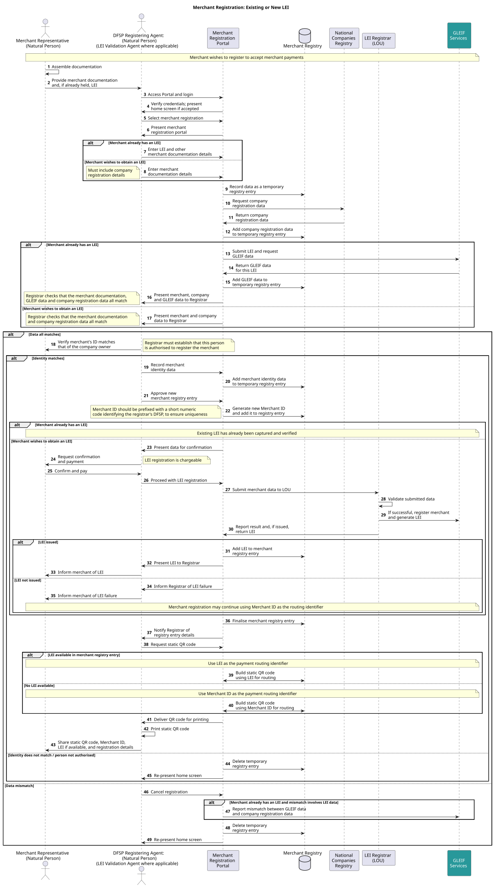

# Mojaloop y los pagos a comercios
## Un servicio superpuesto

Dentro del ecosistema de Mojaloop, los pagos a comercios se reconocen como un caso de uso importante y admitido. Los pagos a comercios se entregan como un servicio superpuesto – un complemento de un despliegue existente de Mojaloop – en lugar de implementarse directamente dentro del Hub en sí.

Esto se debe a que, si bien el Hub en sí se centra en ejecutar transacciones, los pagos a comercios introducen un conjunto de requisitos adicionales más allá del pago mismo. Entre ellos están el registro de comercios, la generación y gestión del ID del comercio, y la creación y entrega de códigos QR. Estas funciones se extienden mucho más allá de la responsabilidad central del Hub.

El servicio superpuesto de pagos a comercios forma parte de la oferta más amplia de código abierto de Mojaloop, se sitúa junto al Hub y lo aprovecha para la transferencia crucial de fondos, al tiempo que gestiona de forma independiente las funciones específicas del comercio. Al hacerlo, permite que los esquemas de pagos cumplan los requisitos operativos, regulatorios y de gestión de riesgos asociados a las transacciones con comercios (como la mitigación del fraude, los controles de PLD y la protección del comercio y del cliente) sin agregar complejidad innecesaria a la capa central de conmutación de transacciones.

## Operaciones

En cuanto a las operaciones del esquema de pagos, el operador del Hub de Mojaloop podría ofrecer un esquema de pagos a comercios como parte de un servicio de pagos general. También es posible que un esquema de pagos a comercios lo ofrezca un operador completamente independiente, en asociación o colaboración con el operador del Hub.

## Contexto del servicio superpuesto de pagos a comercios 

El servicio superpuesto de pagos a comercios está diseñado para implementar el caso de uso de pagos a comercios en un despliegue existente de Mojaloop. No reemplaza ni replica el switch de pagos instantáneos inclusivos (IIPS) subyacente; más bien, aprovecha la infraestructura de Mojaloop desplegada para ejecutar el componente central de transferencia de fondos de las transacciones de pago a comercios. La liquidación, el enrutamiento, la gestión de liquidez y los controles a nivel del esquema de pagos siguen siendo responsabilidad del operador del IIPS basado en Mojaloop subyacente o asociado.

Este enfoque arquitectónico permite entregar un esquema de pagos a comercios sin modificar el Switch central de Mojaloop. El servicio superpuesto proporciona la funcionalidad específica del comercio, incluidos los flujos de aceptación, los constructos de incorporación de comercios, las reglas del esquema de pagos, los servicios de valor agregado y los modelos de interacción con el cliente, al tiempo que delega la compensación y la liquidación a la capa del IIPS.

Desde una perspectiva de gobernanza, el servicio superpuesto puede ser operado directamente por el operador del IIPS basado en Mojaloop como una extensión del esquema de pagos existente. Igualmente, puede operarse como un esquema de pagos a comercios distinto, establecido en asociación con el operador del IIPS y superpuesto a la infraestructura del IIPS. En este último modelo, el servicio superpuesto mantiene su propio marco comercial, sus acuerdos de participación y sus reglas operativas, al tiempo que depende del despliegue de Mojaloop para la transferencia de fondos entre participantes.

En ambas configuraciones, el servicio superpuesto de pagos a comercios preserva la separación de responsabilidades: Mojaloop proporciona la capacidad de liquidación interoperable de cuenta a cuenta en tiempo real, mientras que el servicio superpuesto define y gobierna el caso de uso de pagos a comercios.

## Registro de comercios
Como se señaló anteriormente, la operación de un esquema de pagos a comercios se extiende significativamente más allá de la ejecución de una transferencia de fondos; un requisito previo esencial es el registro formal de cada comercio participante, junto con la generación y el uso controlado de un Identificador de Comercio (ID del comercio) único (“único” es un término que se retoma más adelante en este documento) para fines de enrutamiento y direccionamiento. El siguiente diagrama ilustra los elementos arquitectónicos de alto nivel de los aspectos del registro de comercios. Tenga en cuenta que, dado que los pagos a comercios son un servicio superpuesto, la adopción del servicio superpuesto de pagos a comercios no afecta la operación del IIPS habilitado por Mojaloop que ejecuta los pagos asociados.

**
Figura 1: Registro de comercios y el ecosistema de Mojaloop
**

### Proceso de registro

#### Registro de comercios y aseguramiento del KYB

Dados los riesgos inherentes de fraude, financiamiento del terrorismo y lavado de dinero, en particular el uso bien documentado de entidades comerciales fraudulentas para lavar fondos ilícitos, el proceso de registro de comercios debe, como mínimo, satisfacer los requisitos aplicables de conocimiento de la empresa (KYB).

El modelo supone que el registro de comercios lo llevarán a cabo representantes autorizados de los DFSP ya conectados al IIPS de Mojaloop correspondiente, y que estos DFSP asumirán el rol y la responsabilidad bien conocidos de adquirentes de comercios. Muchos DFSP ya asumen este rol para sus esquemas de pagos a comercios existentes.

El proceso de registro ofrece a la parte registrante la oportunidad de:

- Verificar la existencia jurídica de la entidad del comercio (por ejemplo, mediante registros de empresas o autoridades equivalentes).

  - Tenga en cuenta que la implementación del servicio superpuesto también admite el modelo de comerciante individual; aunque en este caso se recomienda que se impongan límites estrictos a la cuenta y a las transacciones del comercio, incluidos el valor máximo de una transacción individual, el valor total máximo por día o mes y el número máximo de transacciones por día. Si un comerciante individual necesita límites más altos, se le debería alentar a registrar formalmente una persona jurídica y así comenzar a transaccionar como empresa.

- Confirmar la identidad de las personas que realizan el registro y de los representantes autorizados.

- Identificar y verificar a los beneficiarios finales.

- Filtrar frente a las listas de sanciones, las listas de vigilancia y los antecedentes de fraude o delitos financieros pertinentes.

- Cruzar la información presentada con fuentes de datos externas confiables.

Esto es, en gran medida, la práctica habitual para un adquirente de comercios.

Más allá de los datos KYB, el agente registrante del DFSP también captura detalles operativos del comercio: número de locales, ubicación geográfica de cada local (dirección), detalles de las “cajas” o puntos de cobro de cada local, etc. Esto es para facilitar la posterior conciliación de las transacciones.

Solo una vez que el agente registrante designado esté satisfecho de que se han completado todas las verificaciones requeridas de debida diligencia y filtrado debería aprobarse la participación del comercio. En ese momento, se genera un ID del comercio único.

Tenga en cuenta que el servicio superpuesto de pagos a comercios de Mojaloop admite múltiples modelos para el Registro de Comercios, incluidos, entre otros: un registro centralizado mantenido por el propietario del esquema de pagos; un registro centralizado mantenido por un organismo independiente, designado por la autoridad regulatoria correspondiente; o un registro distribuido o virtualizado, en el que cada adquirente de comercios mantiene su propio subconjunto (y el rango de ID del comercio asociado), con supervisión de la autoridad regulatoria. Corresponde al adoptante seleccionar el modelo más apropiado. La unicidad del ID del comercio es sencilla, cualquiera que sea el modelo adoptado; en el caso de un registro distribuido, mediante la asignación de rangos de ID del comercio a cada DFSP adquirente (cuando ya existen registros de comercios para un DFSP, estos pueden hacerse únicos en todo el esquema de pagos anteponiéndoles un identificador de DFSP, por ejemplo).

#### Generación del ID del comercio e integración con el IIPS

Al crearse, el Registro de Comercios propaga el ID del comercio a un oráculo de ID del comercio dedicado, conectado al IIPS basado en Mojaloop. Esto permite direccionar los pagos usando el ID del comercio como un alias enrutable dentro del proceso de Discovery del IIPS.

El DFSP que mantiene la cuenta del comercio debe mantener una asociación definitiva entre el ID del comercio y los datos de la cuenta subyacente del comercio. Cuando el IIPS emite una solicitud de Discovery que hace referencia al ID del comercio, el DFSP debe responder con la información de cuenta correspondiente para permitir que la transacción se ejecute.

Operativamente, este vínculo se mantiene de manera más eficaz cuando el DFSP que aloja la cuenta del comercio participa directamente en el proceso de registro del comercio (lo que significa que el DFSP que afilia al comercio también aloja la cuenta del comercio para recibir pagos). En este modelo, el DFSP captura los datos KYB requeridos en la incorporación, inicia la creación del ID del comercio y asegura la alineación entre los registros del Registro de Comercios, las entradas del oráculo y las asignaciones de cuentas. Son posibles otros modelos, incluido el registro de comercios por parte de una persona jurídica centralizada, pero corren el riesgo de socavar la relación entre el comercio y el DFSP.

#### Modelos de implementación del registro

El Registro de Comercios puede implementarse en múltiples configuraciones, según las preferencias de gobernanza y la postura de riesgo del operador del esquema de pagos:

1.  **Registro centralizado con un único registrador**

Una única base de datos autoritativa, gestionada por un registrador aprobado.

- Los DFSP registrantes envían los datos del comercio al registrador único y centralizado.

- Los ID del comercio se generan de forma centralizada, por parte del registrador.

  - Por lo tanto, se puede garantizar la unicidad de los ID del comercio.

- Los ID del comercio se propagan automáticamente al oráculo de ID del comercio del IIPS.

- Un control central fuerte y, por lo tanto, operativamente más dependiente de la disponibilidad y la capacidad de respuesta del registrador centralizado.

2.  **Registro centralizado con acceso distribuido**

Una única base de datos autoritativa, accesible de forma remota por los DFSP participantes.

- Cada DFSP registrante ingresa de forma remota los datos del comercio directamente en un registro centralizado y compartido.

- Los ID del comercio se generan de forma centralizada.
  - Por lo tanto, se puede garantizar la unicidad de los ID del comercio.

- Los ID del comercio se propagan automáticamente al oráculo de ID del comercio del IIPS.

- Preserva la relación tradicional entre adquirente y comercio.
- Mantiene la supervisión centralizada y la uniformidad en la emisión de los ID del comercio.

3.  **Modelo de registro federado**

Cada DFSP registrante mantiene su propia base de datos de comercios (con un formato definido por el esquema de pagos) y emite los ID del comercio de forma independiente.

- Los ID del comercio los genera el DFSP registrante.

  - Dentro de su propia base de datos de comercios, un DFSP registrante es responsable de garantizar la unicidad de los ID del comercio que se generan y registran. Se recomienda que este requisito forme parte de las reglas del esquema de pagos.

  - La unicidad en todo el ecosistema se logra asignando a cada DFSP registrante o adquirente un rango de ID a partir del cual asigna; esto podría hacerse, por ejemplo, asignando a cada uno un prefijo de dos o tres dígitos, que antepone a cada ID del comercio que genera.

    - Este enfoque también funciona para los nuevos esquemas de pagos con múltiples DFSP, en los que algunos de los DFSP operaban anteriormente su propio esquema de pagos a comercios. En este caso, los ID del comercio preexistentes pueden hacerse únicos entre esquemas de pagos agregando el prefijo.

    - El prefijo asignado a cada DFSP registrante debería registrarse en las reglas del esquema de pagos.

- El DFSP registrante propaga los ID del comercio al oráculo de ID del comercio del IIPS.

Por lo tanto, la unicidad de los ID del comercio puede garantizarse ya sea dentro del registro centralizado o en todos los IPS basados en Mojaloop

Cada uno de estos modelos preserva el mismo principio arquitectónico fundamental: la identidad del comercio debe verificarse antes de la participación, los ID del comercio deben ser únicos y autoritativos, y el IIPS debe poder resolver esos identificadores de forma determinista a través de su mecanismo de Discovery.
- Cuando un esquema de pagos a comercios deba ser interoperable con otros esquemas de pagos nacionales, u operar en un entorno transfronterizo, entonces debería considerarse el uso del LEI como ID del comercio. Esto se explora más adelante en este documento.

De esta manera, el Registro de Comercios se convierte en una puerta de entrada controlada al servicio superpuesto de pagos a comercios, lo que asegura el cumplimiento regulatorio, mitiga el riesgo de delitos financieros y preserva la integridad del direccionamiento de comercios dentro del ecosistema de un despliegue de Mojaloop.

El servicio superpuesto de pagos a comercios de código abierto de Mojaloop incluye un conjunto mínimo recomendado de datos que deben capturarse para cada comercio. Por supuesto, los adoptantes son libres de ampliarlo como lo consideren conveniente.

## Modos de iniciación del pago

Una vez que se ha completado el registro del comercio y el ID del comercio se ha generado y propagado al oráculo de ID del comercio asociado al IIPS basado en Mojaloop, el comercio queda habilitado para aceptar pagos a través del servicio superpuesto de pagos a comercios.

Realizar un pago a un comercio se logra enviando un pago de tipo push al ID del comercio registrado. Esto puede hacerlo un cliente mediante USSD (ingresando el ID del comercio en su teléfono como parte de una transacción iniciada por el cliente) o, si tiene un teléfono inteligente, escaneando un código QR.

### Códigos QR 

#### Estático frente a dinámico

El servicio superpuesto de pagos a comercios de Mojaloop, en su formato actual de código abierto, se basa en el uso de códigos QR estáticos. Sin embargo, esto es fácilmente ampliable para admitir códigos QR dinámicos.

Los códigos QR estáticos son fijos y se aplican a múltiples transacciones; por lo tanto, el cliente debe escanear un código QR impreso que se exhibe en el local del comercio usando la aplicación para teléfonos inteligentes que le proporciona su DFSP, e ingresar el valor de la transacción al iniciar un pago. Se requiere que el DFSP adquirente del comercio genere e imprima el código QR estático en el momento del registro y lo entregue en el local del comercio. Esto no impone ninguna carga tecnológica al comercio en la aceptación de pagos iniciados con código QR.

Por contraste, un código QR dinámico es específico de una transacción individual e incluye el valor de la transacción incrustado en él, por lo que el cliente no necesita ingresar el valor. Simplemente escanea el código QR generado dinámicamente en la pantalla del comercio y aprueba la transacción. El proceso normal es que el comercio ingrese los detalles de la venta en su dispositivo de punto de venta, el cual luego envía esos detalles a su DFSP adquirente como una solicitud de código QR dinámico. El DFSP adquirente genera entonces el código QR (incluida la incorporación de cualquier protección criptográfica) y lo reenvía al dispositivo de punto de venta del comercio, que luego lo muestra para que el cliente lo escanee.

Un código QR dinámico aumenta la comodidad del cliente y elimina una posible fuente de error. Pero esto tiene el costo de requerir que el DFSP adquirente del comercio genere un nuevo código QR cada vez, y que el comercio tenga en su punto de venta la capacidad de mostrar el código QR. Sin embargo, no se trata necesariamente de un requisito difícil de cumplir: para los comercios pequeños, el dispositivo de punto de venta podría ser su propio teléfono inteligente; pero es probable que cualquier comercio más grande tenga esta funcionalidad integrada en su terminal o dispositivo de punto de venta (POS) habitual.

#### Momento de la generación

La principal diferencia en la generación de un código QR entre los códigos estáticos y los dinámicos es el momento en que se genera el código.

**Para los códigos QR estáticos**: cuando se completa el registro del comercio, además de propagar el ID del comercio al oráculo de ID del comercio, el servicio superpuesto de pagos a comercios del DFSP adquirente generará un código QR estático de acuerdo con las reglas del esquema de pagos. La implementación de código abierto de esto se basa en la EMVCo QR Code Specification for Payment Systems in Merchant-Presented Mode, Version1.1. Hay otros estándares disponibles, pero casi todas las implementaciones recientes usan el estándar de EMVCo, por lo que este se adoptó en el desarrollo del servicio superpuesto.

Tenga en cuenta también que el uso de un código QR estático además admite el uso continuado de USSD por parte de los clientes con teléfonos no inteligentes (feature phones), ya que se puede imprimir un ID del comercio **numérico** junto al código QR impreso, para su ingreso manual por parte del cliente. Debe señalarse que esto solo es posible si los ID del comercio son numéricos, ya que USSD solo admite el ingreso de datos numéricos.

**Para los códigos QR dinámicos**: cuando un comercio necesita un código QR, su dispositivo de punto de venta (POS) realiza una solicitud de red a su DFSP adquirente (la compatibilidad con múltiples DFSP adquirentes es un asunto del proveedor del POS, aunque algunos comercios podrían simplemente usar múltiples dispositivos POS). Si el esquema de pagos usa un modelo federado o distribuido para el Registro de Comercios, entonces el DFSP adquirente generará el código QR de la misma manera que para los códigos QR estáticos, con la adición del valor de la transacción suministrado por el comercio, y lo devolverá al comercio. Si el esquema de pagos usa un registro centralizado con un único registrador, entonces la solicitud del comercio debe reenviarse al registrador, quien generará el código QR dinámico y lo devolverá al DFSP, para su reenvío al comercio.

#### Contenido

Los datos requeridos para la construcción del código QR se recuperan del Registro de Comercios y se ensamblan en la estructura de datos definida por EMVCo mediante un módulo dedicado dentro de la base de código del servicio superpuesto de pagos a comercios de Mojaloop. Este módulo es intencionalmente autónomo, lo que permite que los equipos de ingeniería de los adoptantes adapten la composición de la carga útil del QR a los requisitos del esquema de pagos local sin modificar la funcionalidad central de Mojaloop.

En la práctica, incluso para los códigos QR estáticos, se generan múltiples códigos QR:

- Un código QR por caja o punto de cobro en un local.

- Para los comercios que operan múltiples locales, un conjunto por local.

Esta granularidad permite la conciliación y la generación de reportes posteriores a nivel de local y de terminal.

#### Integridad criptográfica y autenticación del esquema de pagos

Para un despliegue comercial, se recomienda encarecidamente que la carga útil del QR se amplíe para incluir una firma criptográfica. Esto se debe a la facilidad con la que los estafadores generan códigos QR, particularmente cuando se usan códigos QR estáticos; simplemente pueden imprimir su propio código QR, que redirige los pagos, y pegarlo sobre el código QR legítimo. Al incluir una firma criptográfica, que puede verificar una aplicación de pagos emitida por un DFSP del esquema de pagos (no necesariamente un DFSP adquirente), esta estafa puede anularse.

La firma debería:

- Ser generada por el DFSP adquirente usando su clave privada específica del esquema de pagos.

- Estar incrustada dentro de una de las plantillas “Unreserved” de EMVCo (por ejemplo, la plantilla con ID “80”).

- Estar construida sobre los campos pertinentes de la carga útil del QR para proteger frente a la manipulación.

Para dar soporte a esto, el operador del esquema de pagos a comercios debe establecer una infraestructura de clave pública (PKI), de modo que las aplicaciones de pago puedan reconocer y utilizar la firma.

El modelo de confianza recomendado incluye los siguientes seis elementos clave:

1.  **Par de claves raíz del esquema de pagos**

El operador del esquema de pagos genera su propio par de claves pública y privada.

2.  **Par de claves del DFSP**

Cada DFSP adquirente genera su propio par de claves pública y privada.

3.  **Certificación del DFSP**

El operador del esquema de pagos usa su clave privada para firmar las claves públicas de los DFSP participantes, y emite a cada uno un certificado de clave pública (PKC), en una “ceremonia” segura de firma de claves.

4.  **Disponibilidad del PKC**

El DFSP adquirente (o el operador del esquema de pagos) pone su PKC a disposición pública de los participantes, quizás a través de su sitio web.

5.  **Identificación del DFSP en el QR**

**Tenga en cuenta el requisito** de que la carga útil del código QR debe contener información suficiente para identificar al DFSP adquirente. Según el diseño del esquema de pagos, esto puede incluir el BIC del DFSP o algún otro identificador reconocido por el esquema de pagos.

6.  **Validación de la firma por parte de la aplicación del pagador**

Al escanear el código QR:

- La aplicación del teléfono inteligente del cliente identifica al DFSP adquirente a partir del código QR.

- La aplicación recupera de una fuente confiable el PKC del DFSP adquirente.

  - La fuente confiable podría ser el operador del esquema de pagos, el sitio web del DFSP adquirente o, de hecho, una copia en caché (si la aplicación ha encontrado recientemente a este DFSP adquirente y ya ha recuperado el PKC).

- La aplicación verifica el PKC contra la clave pública del operador del esquema de pagos.

- El PKC verificado se usa entonces para validar la firma criptográfica incrustada en la carga útil del QR.

- Solo si todas estas verificaciones se superan debería la aplicación intentar iniciar la transacción.

Este proceso asegura que los datos del código QR son auténticos, no han sido manipulados y fueron emitidos bajo la autoridad del DFSP adquirente y del operador del esquema de pagos.

### Autorización del cliente e iniciación del pago

Tras la validación exitosa del código QR, la aplicación del cliente presenta determinados datos del comercio, como el nombre comercial (“trading as”) y la ubicación de operación, para permitir la confirmación visual de que el código QR corresponde al comercio en el que se encuentra el cliente.

Una vez que el cliente está satisfecho, el cliente entonces:

- Se autentica usando el mecanismo estándar del DFSP (por ejemplo, PIN o biometría).

- Ingresa el monto del pago (para las implementaciones de QR estático).

- Autoriza la transacción.

El DFSP del pagador inicia entonces una transferencia direccionada al ID del comercio a través del IIPS de Mojaloop.

Este proceso se resume en el siguiente diagrama.

**
Figura 2: Procesamiento del pago
**

### Liquidación y experiencia del comercio

Debido a que la transacción se ejecuta sobre un IIPS basado en Mojaloop, el pago a la cuenta del comercio ocurre casi en tiempo real. El DFSP del comercio puede confirmar al comercio que el pago se ha recibido en cuestión de segundos desde la autorización del cliente, junto con el valor del pago, lo cual es importante que el comercio verifique en el caso de las transacciones con QR estático (a diferencia de las transacciones con código QR dinámico, que permiten al comercio especificar el valor por adelantado).

Al recibir la confirmación de su DFSP, el comercio puede entregar los bienes o servicios con alta confianza de que los fondos han sido acreditados de forma irrevocable.

Para los comercios más grandes que operan múltiples locales y cajas, se pueden entregar los datos completos de la transacción (incluidos los identificadores de terminal incrustados en la carga útil del QR) para apoyar la conciliación frente a los sistemas internos de punto de venta del comercio.

## Separación arquitectónica de responsabilidades

En resumen, el servicio superpuesto de pagos a comercios:

- Gestiona la asignación de la identidad del comercio, la generación de códigos QR y la autenticación a nivel del esquema de pagos.

- Admite el aseguramiento criptográfico opcional en la capa de aceptación.

- Depende de Mojaloop para el enrutamiento determinista, la gestión de liquidez y la liquidación en tiempo real.

Este enfoque por capas preserva la integridad del IIPS subyacente, al tiempo que habilita un marco de aceptación en comercios seguro y gobernado por el esquema de pagos, adecuado para un despliegue comercial.

## Extensión futura: enrutamiento mediante LEI

El trabajo continúa dentro de la comunidad de Mojaloop para ampliar el servicio superpuesto de pagos a comercios. Por ejemplo, se ha forjado una asociación clave con la Global Legal Entity Identifier Foundation (GLEIF) para incrustar Identificadores de Entidad Jurídica (LEI) en los códigos QR como alternativa a los ID del comercio, con el fin de facilitar los pagos transfronterizos a comercios y el procesamiento del KYB. En las transacciones transfronterizas, incrustar un LEI validado tiene beneficios significativos en la gestión de los costos de cumplimiento de los DFSP participantes.

Al incorporar el LEI en los códigos QR o en los mensajes de pago, los DFSP participantes pueden cumplir de manera más eficiente los requisitos de transparencia y trazabilidad de la Recomendación 16 del GAFI. La [**Recomendación 16 del GAFI**](https://www.fatf-gafi.org/en/publications/Fatfrecommendations/update-Recommendation-16-payment-transparency-june-2025.html) (también conocida como la “Travel Rule”) establece estándares internacionales para identificar y transmitir la información del originador y del beneficiario en las transferencias electrónicas transfronterizas y los pagos digitales. Esto ofrece oportunidades potenciales significativas en torno a la prevalidación y verificación de los beneficiarios.

El LEI es un concepto fundamental para establecer confianza y transparencia dentro de los ecosistemas financieros. Proporciona una identidad digital estandarizada a nivel mundial para las personas jurídicas, lo que permite un reconocimiento y una verificación consistentes a través de redes y jurisdicciones.

El LEI es un identificador de por vida, compuesto por 20 caracteres alfanuméricos, propiedad de la persona jurídica respectiva. Identifica de forma única a las personas jurídicas que participan en transacciones financieras. Con referencia a los servicios mantenidos y operados por la comunidad de GLEIF, el LEI apunta a los datos de referencia asociados, que responden ‘quién es quién’ y ‘quién es dueño de quién’ a nivel mundial.

La extensión para admitir el LEI y el enrutamiento basado en LEI se construye sobre el servicio superpuesto de pagos a comercios existente, descrito anteriormente en este documento, por lo que esta sección debería leerse en ese contexto.

### Primeros pasos

La primera instancia de este trabajo, ya completada, admite el enrutamiento de un pago basado en LEI, con un oráculo de Mojaloop creado para registrar los LEI como alias de pago alternativos, y una extensión de la estructura del Registro de Comercios para incluir los LEI con el fin de cargarlos al oráculo, para su uso en la resolución del beneficiario.

Un comercio que ya tiene un LEI tendrá ese LEI incrustado en sus códigos QR, y por lo tanto se usará para enrutar hacia su cuenta los pagos basados en códigos QR. Sin embargo, debido a que USSD solo admite el ingreso de datos numéricos, los clientes que usan un teléfono no inteligente para realizar pagos por USSD no podrán direccionar un pago a un LEI y, en consecuencia, debería ponerse a disposición un ID del comercio numérico en paralelo al LEI, específicamente impreso alrededor de un código QR estático que incrusta un LEI.

El proceso de captura del LEI se ampliará para admitir la verificación del KYB; así, los datos suministrados por la entidad que realiza el registro (el comercio) pueden verificarse frente a los que GLEIF mantiene para ese LEI, y cualquier discrepancia se señalará al DFSP adquirente.

El borrador del flujo de proceso se expone en el siguiente diagrama. 

 Este flujo de la fase 1 cubre la incorporación de un comercio que ya tiene un LEI, y procede según los siguientes pasos.

Una persona que representa al comercio comparte su LEI existente y los documentos de incorporación con el DFSP registrante, y el usuario del DFSP inicia sesión en el portal de registro y comienza un registro de “comercio con LEI existente”. El LEI y los datos básicos se ingresan entonces y se guardan como un registro temporal del comercio. El sistema busca el LEI mediante el acceso de la [API de GLEIF](https://www.gleif.org/en/lei-data/gleif-api) a la base de datos mundial de LEI y luego extrae los datos coincidentes de la empresa del registro nacional de empresas. A continuación, el sistema del portal de registro de comercios compara los datos proporcionados por el comercio, los datos del LEI y los datos del registro de empresas; si no coinciden, aclaran la situación con el comercio, posiblemente cancelan el proceso o lo reinician.

Si el problema está en los propios datos de referencia del LEI, el operador plantea una impugnación (una consulta) a la API de GLEIF, de modo que el registro del LEI se revalida y se corrige. Cuando todo coincide, el registro del comercio se aprueba, se genera un ID del comercio específico del esquema de pagos, se crea la entrada final del Registro de Comercios (incluido el LEI) y se notifica al comercio que el registro fue exitoso.

El flujo del diagrama anterior concluye con la creación de un código QR estático, usando el LEI como dirección de enrutamiento del pago. El DFSP registrante imprime entonces el código QR estático y lo entrega al comercio. Por supuesto, este no es el único flujo posible; como se mencionó anteriormente en este documento, el uso de un registro centralizado podría incluir la entrega del código QR por parte de una agencia externa, por ejemplo. Además, el uso de códigos QR dinámicos requeriría que los códigos se creen por transacción, a demanda del propio comercio, y se entreguen electrónicamente al dispositivo POS del comercio para su visualización. Por razones de claridad, esto se ha omitido del flujo anterior.

### A más largo plazo

Aunque el objetivo principal de la colaboración con GLEIF es procesar pagos iniciados con un LEI en países donde hay un despliegue de Mojaloop, un objetivo secundario es aumentar el número de LEI registrados, de modo que a mediano y largo plazo el procesamiento de pagos transfronterizos se vuelva significativamente más sencillo.

En apoyo de esto, el proceso de registro de comercios desarrollado en la primera fase se ampliará aún más, de modo que los comercios que no tienen un LEI – pero que son personas jurídicas registradas en su país – puedan solicitar y recibir un LEI como parte del proceso de registro del comercio.

El borrador del flujo de proceso, a continuación, amplía el expuesto arriba para la primera fase, a fin de abarcar tanto a los comercios que ya tienen un LEI como a los comercios que desean solicitar un LEI. 

 El diagrama del flujo de proceso se ha ampliado para mostrar cómo se incorpora a un comercio registrado sin LEI y se le emite un LEI. El proceso es una extensión del diagrama anterior y procede de la siguiente manera (para los comercios que desean registrarse para obtener un LEI).

El comercio presenta los documentos de registro al agente de registro (o al DFSP o al agente de validación). El agente captura los datos, verifica que estén completos y comprueba los datos de la empresa frente al registro nacional de empresas. Si los datos no coinciden, los datos se borran y el comercio decide si lo intenta de nuevo; si no, el proceso termina.

Si los datos coinciden, el agente crea un ID del comercio específico del esquema de pagos y prepara la información adicional necesaria para el registro del LEI. El agente valida los datos de la solicitud del LEI, pide al comercio que los confirme y cobra el pago. Después del pago, el agente envía la solicitud del LEI al registrador de LEI y posteriormente comparte parte de la tarifa.

El registrador de LEI valida los datos, registra la empresa en el registro de LEI y emite un LEI de vuelta al agente.

Si la emisión del LEI es exitosa, el agente agrega el LEI al registro del comercio en el registro del esquema de pagos e informa al comercio que el registro (con LEI) está completo. Si la emisión del LEI falla, el agente igualmente finaliza la incorporación del comercio, pero informa al comercio que el registro se completó sin un LEI.

Se aplican los mismos comentarios que anteriormente respecto de la creación y entrega de códigos QR, estáticos o dinámicos.

## Antecedentes: conceptos del LEI

El Identificador de Entidad Jurídica (LEI) es un concepto fundamental para establecer confianza y transparencia dentro de los ecosistemas financieros. Proporciona una identidad digital estandarizada a nivel mundial para las personas jurídicas, lo que permite un reconocimiento y una verificación consistentes a través de redes y jurisdicciones.

En el contexto de la colaboración entre Mojaloop y GLEIF, el LEI como concepto ilustra cómo las estructuras de identidad consistentes pueden apoyar la participación segura de las instituciones, mejorar la integridad de los datos de las transacciones y simplificar procesos como la incorporación digital. Al adoptar el marco del LEI en el ecosistema de Mojaloop, la iniciativa busca demostrar cómo las plataformas de pago abiertas pueden integrar estándares de identidad confiables a nivel mundial para fortalecer la interoperabilidad y el cumplimiento.

Un caso de uso práctico para la integración del LEI dentro del ecosistema de Mojaloop implica incrustar el LEI en los códigos QR que se usan para los pagos a comercios. Al incorporar el LEI dentro de la carga útil de datos del QR, las instituciones financieras y las billeteras digitales pueden verificar la identidad del comercio beneficiario en el punto de pago. Este mecanismo mejora la confianza y la transparencia al permitir que las instituciones financieras participantes validen la identidad jurídica del comercio frente a la base de datos de GLEIF antes de procesar la transacción. Tal enfoque apoya la verificación precisa del beneficiario, reduce el riesgo de fraude o de desvío y fortalece el cumplimiento de los estándares de KYC y PLD —al tiempo que mantiene la eficiencia y la experiencia de usuario de los pagos basados en QR.

Los comercios que ya tienen un Identificador de Entidad Jurídica (LEI, ISO 17442) pueden incorporarse de una manera más digital y automatizada mediante la integración de esta identidad digital global en el flujo de trabajo de incorporación. El DFSP puede integrar el LEI y beneficiarse de la recopilación automatizada del nombre del comercio, la dirección y los datos del registro comercial local, con el objetivo de agilizar las verificaciones de KYB, reducir la recopilación manual de datos y mejorar la calidad de los datos, al tiempo que permite una mayor interoperabilidad con otros sistemas nacionales y transfronterizos que también se basan en el LEI. El LEI es complementario al ID del comercio generado por el sistema local, que se usa para los pagos que no son con QR.

## Antecedentes: registro del LEI

### Correspondencia 

Un aspecto importante del registro de comercios es la correspondencia de los datos del LEI con los datos de identificador de comercio existentes, ya integrados en el ecosistema de Mojaloop.

Esta correspondencia permite un enlace fluido entre el sistema de Mojaloop y los estándares del ecosistema de GLEIF, lo que simplifica el reconocimiento, la verificación y el cumplimiento de las entidades a través de las fronteras. Al alinear los registros de participantes y los servicios de directorio de Mojaloop con los registros del LEI, el ecosistema obtiene un marco escalable que apoya los pagos confiables, la supervisión regulatoria y los procesos automatizados de conocimiento de la empresa (KYB).

La siguiente tabla se ha redactado para establecer la correspondencia entre los campos de datos existentes del ID del comercio de Mojaloop y los campos de datos correspondientes a los que hace referencia el LEI.

|                 | **Campo de datos** **de Mojaloop** | **Campo de datos** **del LEI** **correspondiente**     |
|-----------------|-----------------------------|--------------------------------------------------------|
| **Identificador**  | Merchant ID              | LEI                                                    |
| **Nombre de la entidad** | registered_name    | Entity.LegalName                                       |
| **Direcciones**   | street_name               | Entity.LegalAddress.FirstAddressLine                   |
|                 | building_number             | Entity.LegalAddress.AddressNumber                      |
|                 | postal_code                 | Entity.LegalAddress.PostalCode                         |
|                 | town_name                   | Entity.LegalAddress.City                               |
|                 | country_subdivision         | Entity.LegalAddress.Region                             |
|                 | country                     | Entity.LegalAddress.Country                            |
|                 | address_line                | Entity.LegalAddress.AdditionalAddressLine              |
| **Geocodificación**   | Latitude              | Extension/Geocoding/lat (solo disponible en formato xml) |
|                 | longtitude                  | Extension/Geocoding/lng (solo disponible en formato xml) |

**Notas sobre la correspondencia:**

1.  Esta tabla de correspondencia supone que las direcciones en los datos de Mojaloop son direcciones jurídicas físicas de la persona jurídica, el comercio. Si las direcciones son direcciones de sucursales o de mesas de operación, entonces las direcciones no se pueden corresponder.

2.  Si bien los elementos de datos centrales (nombre de la entidad y dirección) están disponibles para la correspondencia, los datos de Mojaloop aún pueden beneficiarse de los datos de referencia del LEI.

3.  País y subdivisión estandarizados. Si bien los datos de Mojaloop establecen el país y la subdivisión como texto libre, los datos del LEI aplican el estándar ISO 3166. Mojaloop puede utilizar los datos del LEI para obtener códigos estandarizados de país y subdivisión.

4.  Listas de códigos: los datos del LEI proporcionan datos de referencia sobre la forma jurídica y la autoridad de registro de la entidad. Las listas de códigos siguen estándares globales para la forma jurídica de la entidad (ISO 20275) y la autoridad de registro. https://www.gleif.org/en/about-lei/code-lists

5.  Estado de la entidad: los datos del LEI también muestran el estado de la entidad, activa o no. Si la entidad deja de operar, en el campo Entity Status se etiqueta como “INACTIVE”.

6.  Estructura de propiedad: además de los datos de nivel 1, que indican quién es quién, los datos de referencia del LEI también proporcionan datos de nivel 2, que indican quién es dueño de quién. Mojaloop podría utilizar los datos de nivel 2 para identificar las entidades matrices y subsidiarias de los comercios.

Los datos del LEI pueden recuperarse utilizando la API de GLEIF, que está disponible en https://www.gleif.org/en/lei-data/gleif-api y puede usarse, como se expone en las notas sobre la correspondencia anteriores, para enriquecer y verificar los datos que se mantienen en el Registro de Comercios de Mojaloop.

### Validación de los datos del LEI

Una parte importante del valor de esta colaboración es la capacidad de verificar los datos recopilados sobre una persona jurídica con los datos que mantiene GLEIF. La validación de los LEI usando la API de GLEIF implica dos tareas operativas principales.

- **Verificar los códigos LEI.** Comprobar si un LEI suministrado es válido, está activo y está correctamente registrado en el Global LEI Index.

- **Recuperar el perfil del comercio.** Usar el LEI para obtener el nombre jurídico, el estado de registro y otros datos de referencia necesarios para construir o enriquecer el perfil del comercio (por ejemplo, para el KYB y el enrutamiento).

#### API de GLEIF (acceso en línea al Global LEI Index)

La interfaz de programación de aplicaciones (API) de GLEIF proporciona acceso en tiempo real a toda la funcionalidad de búsqueda de datos del LEI, incluida la validación de LEI individuales y la recuperación de los datos de referencia de nivel 1 asociados (nombre jurídico, jurisdicción jurídica, estado de la entidad, etc.). Admite búsquedas filtradas, de texto completo y de un solo campo, y también puede devolver registros por LEI u otros atributos, lo que la hace muy adecuada para verificaciones automatizadas del tipo “¿Es este un LEI real?” y para búsquedas de comercios en los flujos de trabajo de pago.

- Información base: https://www.gleif.org/en/lei-data/gleif-api

- Documentación de la API: https://api.gleif.org/docs

- Aplicación de demostración: https://api.gleif.org/demo

**Costo e integración:** La API la proporciona GLEIF de forma gratuita y puede integrarse en la infraestructura del DFSP o del esquema de pagos para implementaciones personalizadas (por ejemplo, la validación en la incorporación, la decodificación del QR o la iniciación del pago), como se prevé en este documento.

#### Golden Copy Files (alternativa de datos masivos)

Como alternativa o complemento de la API en línea, GLEIF publica los Golden Copy Files, que son instantáneas autoritativas del Global LEI Index completo y contienen todos los LEI y sus datos de referencia de nivel 1, con los duplicados técnicos eliminados. Estos archivos se actualizan varias veces al día en función de los datos entrantes de los emisores de LEI, lo que permite que los sistemas locales mantengan una réplica actualizada de la población de LEI para casos de uso de alto volumen o sin conexión.

- Información y descargas de Golden Copy: https://www.gleif.org/en/lei-data/gleif-golden-copy

- Frecuencia de actualización: la base de datos se actualiza hasta diez veces al día; los archivos Golden Copy se ponen a disposición varias veces al día.

- Formatos: disponibles en formatos legibles por máquina como CSV, XML y JSON, lo que permite una ingesta flexible en almacenes de datos, herramientas de PLD/KYB o infraestructura de switch de pagos.

#### Resumen

Estas dos opciones de acceso —las consultas a la API en tiempo real y las descargas periódicas de los archivos Golden Copy— brindan a los esquemas de pagos y a los DFSP un conjunto de herramientas escalable para verificar los LEI y recuperar los datos de la entidad del comercio directamente dentro de sus flujos de transacciones.

### Vínculo con ISO 20022

Sobre la base de las fuentes de datos del LEI, la siguiente consideración es cómo se puede transportar el LEI de forma consistente dentro de los mensajes de pago. Aquí es donde ISO 20022 se vuelve importante.

La versión de 2016 de ISO 20022 introdujo campos dedicados al LEI para identificar a las partes en mensajes como las instrucciones de liquidación y los mensajes de pago. Estos campos permiten que los LEI se usen junto con otros identificadores como el BIC, o en lugar de ellos, en particular en secciones como los bloques Party Identification.

La Mojaloop Foundation y GLEIF se están coordinando en el transporte de los LEI dentro de los mensajes transaccionales, con un enfoque particular en las transacciones transfronterizas.

## Aplicabilidad

Esta versión de este documento se relaciona con la versión [17.2.0](https://github.com/mojaloop/helm/releases/tag/v17.2.0) de Mojaloop

## Historial del documento
|Versión|Fecha|Autor|Detalle|
|:--------------:|:--------------:|:--------------:|:--------------:|
|1.0|1 de septiembre de 2026| Paul Makin (MLF), Ololade Osunsanya (GLEIF), Clare Rowley (GLEIF)|Versión inicial|