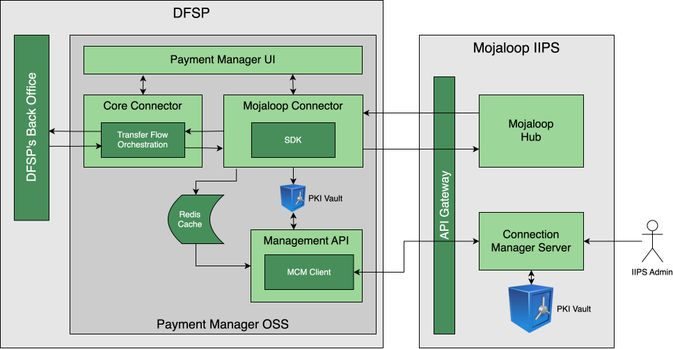
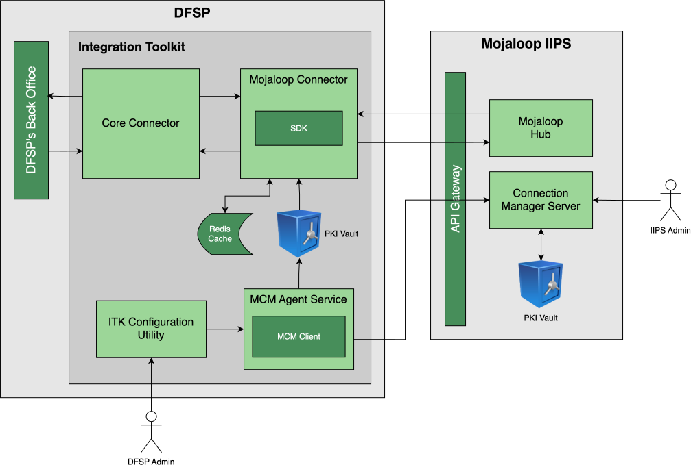

# Guía para la selección y el uso de las herramientas de participación

# Antecedentes

La Comunidad Mojaloop ha desarrollado una variedad de herramientas para el uso de los DFSP participantes, que facilitan la conexión entre el back office de un DFSP y un esquema de pagos basado en Mojaloop (el Hub). Cada una actúa como una capa adaptadora que maneja las complejidades de las API de Mojaloop y de sus requisitos de seguridad, lo que permite a un DFSP conectar su back office con mayor facilidad. Esto puede facilitar en gran medida el proceso de integración, al reducir tanto el costo directo (las herramientas de participación son de código abierto y pueden descargarse libremente) como el costo indirecto (el tiempo de integración se reduce mucho, porque la complejidad se maneja dentro de la herramienta) de la integración. El costo de mantenimiento continuo también se reduce mucho, ya que las herramientas de participación son mantenidas por la Comunidad Mojaloop y solo necesitan ser “personalizadas” por cada DFSP.

A diferencia del propio Hub de Mojaloop, las herramientas de participación están pensadas para desplegarse dentro del dominio del DFSP, y su implementación y uso siguen siendo responsabilidad de cada DFSP, aunque con el apoyo de la Comunidad Mojaloop.

La Comunidad ha reconocido que distintos DFSP tienen requisitos y restricciones diferentes que impondrían a las herramientas de participación, y eso se refleja en la variedad de ofertas.

# Funcionalidad

Uno de los propósitos centrales de las herramientas de participación es ocultar la complejidad de la API de Mojaloop. Además de toda la seguridad, las herramientas manejan procedimientos de Mojaloop complejos y de múltiples pasos—como las búsquedas de partes, el acuerdo de términos y las transferencias—y los presentan a los sistemas del DFSP de una manera más sencilla. 

Para lograrlo, todas las herramientas de participación ofrecen los siguientes servicios:

1. La gestión de la conexión entre el DFSP y el Hub de Mojaloop, lo que incluye específicamente la configuración y la operación de la seguridad, incluido el intercambio de certificados de claves.  
2. La integración completa de la API con el Hub de Mojaloop, que abarca:  
   1. La administración, por ejemplo, la configuración del enrutamiento o de los alias para los clientes de un DFSP;  
   2. La participación en transacciones como institución deudora o acreedora;  
   3. El soporte para la autorización (incluida la autorización continua) de las transacciones iniciadas por terceros (por ejemplo, las fintech).  
3. Una variedad de herramientas de código abierto para facilitar la conexión entre la herramienta de participación y el back office del DFSP (ya sea directamente con el sistema de core bancario, o con el motor de pagos, o con un bus de mensajería).

# Elementos arquitectónicos comunes

La arquitectura común de todas las herramientas de participación consta de varios componentes clave que trabajan juntos para facilitar la conexión y la gestión de las transacciones.

## Core Connector

Este es el componente central de integración que actúa como "traductor" entre el back office del DFSP y la herramienta de participación. Se proporcionan plantillas tanto en el framework Apache Camel, que ofrece un lenguaje declarativo orientado a la integración, como en TypeScript, un lenguaje de programación conocido y comprendido de forma generalizada. Los integradores de sistemas y/o los participantes pueden optar por usar estas plantillas o por crear un conector personalizado en una pila tecnológica de su elección. El uso de plantillas permite personalizar el core connector para que se ajuste a la tecnología de backend existente del DFSP, en lugar de obligar al DFSP a cambiar sus propios sistemas. 

## Mojaloop Connector

Este componente se comunica directamente con el Hub de Mojaloop y contiene dos subcomponentes clave:   
**Mojaloop-SDK:** proporciona los componentes de seguridad necesarios y maneja el procesamiento de los encabezados HTTP de una manera conforme con Mojaloop.

**Simplified API:** ofrece una versión más sincrónica y orientada a casos de uso de la API FSPIOP de Mojaloop, que es más fácil de consumir para los sistemas de backend del DFSP. 

## Mojaloop Connection Manager (MCM) Client

Este cliente automatiza y simplifica el proceso de configurar las conexiones a distintos entornos de Mojaloop. Se encarga de la creación, la firma y el intercambio de certificados digitales, que es un requisito de seguridad crítico para el ecosistema de Mojaloop. 

# Flujo de transacción de alto nivel

Todas las herramientas de participación facilitan el proceso de transacción al actuar como la gateway del DFSP hacia el Hub de Mojaloop: 

* Una transacción es iniciada por el back office del DFSP.  
* El back office envía la solicitud al Core Connector dentro de la herramienta de participación.  
* El Core Connector traduce la solicitud para el Mojaloop Connector y su API simplificada.  
* El Mojaloop Connector se comunica de forma segura con el Switch (Hub) de Mojaloop usando el Mojaloop-SDK.  
* El Hub de Mojaloop enruta y orquesta los pagos hacia el DFSP de destino.  
* La herramienta de participación proporciona actualizaciones de estado e información de conciliación al DFSP a través de portales de monitoreo, donde estos estén implementados. 

# Herramientas de participación disponibles

Hay dos grandes grupos de herramientas de participación; primero, Payment Manager, que ofrece toda la funcionalidad y flexibilidad que un banco grande pueda requerir; y segundo, un grupo de soluciones basadas en el Integration Toolkit de Mojaloop, que pueden dimensionarse y alojarse para satisfacer los requisitos variables de una amplia gama de otros DFSP.

## Payment Manager

También conocido como Payment Manager for Mojaloop (PM4ML), Payment Manager es una herramienta de participación de Mojaloop con funcionalidad completa que ofrece todas las funcionalidades que esperaría un gran banco corporativo. Puede desplegarse en la nube o en el centro de datos de un banco, y admite todas las opciones de DR (recuperación ante desastres) que tal banco esperaría. También cuenta con amplias capacidades de gestión y de generación de reportes.  

 

 	
 
 
**Figura 1: arquitectura de Payment Manager**

El diagrama anterior representa una visión de alto nivel de la arquitectura de Payment Manager, e indica además los elementos de un Hub de Mojaloop con los que interactúa.

### Los portales de Payment Manager

Los portales de negocio y técnico de PM4ML ofrecen interfaces fáciles de usar con tableros para monitorear información crítica:   
- **Monitoreo de transacciones**: muestra los estados de las transacciones en tiempo real e históricos.  
- **Estado del servicio**: permite a los DFSP monitorear el estado de salud y el rendimiento de sus conexiones.  
- **Gestión de la configuración**: proporciona un punto único para gestionar las claves de seguridad, los certificados y las configuraciones de los endpoint. 

## Integration Toolkit

El conjunto de herramientas de participación del Integration Toolkit está diseñado para permitir una flexibilidad significativa en la forma en que un DFSP elige conectarse a un Hub de Mojaloop, y puede desplegarse en una variedad de entornos para satisfacer las necesidades de todo tipo de entidad, desde la MFI más pequeña hasta el banco más grande.

### Descripción general

 

 	
 
 
**Figura 2: arquitectura del ITK**

Como cabría esperar, y como se ilustra en el diagrama anterior, hay funcionalidades comunes con Payment Manager:

* Tanto el Core Connector como el Mojaloop Connector funcionan como antes.  
* El Mojaloop Connection Manager Client (MCM Client) sigue siendo responsable de la creación, la firma y el intercambio de certificados digitales, lo que sustenta la seguridad de la conexión al Hub de Mojaloop.

Sin embargo, hay algunas diferencias significativas. La operación del MCM Client ahora está sujeta al control de MCM Agent Services, que orquesta la gestión de la seguridad mediante una máquina de estados. El control y las configuraciones de Agent Services se realizan con el ITK Configuration Utility, que presenta una interfaz de tipo consola al personal operativo del DFSP. Este cumple la misma función que el portal de configuración de Payment Manager.

La seguridad del ITK Configuration Utility/consola está sujeta a la seguridad de la propia infraestructura del DFSP. El servidor (o la máquina virtual (VM)) en el que se ejecutan los componentes del ITK debe asegurarse como cualquier otra infraestructura de servidores dentro del límite administrativo del DFSP.

A diferencia de Payment Manager, el ITK no incluye portales para el monitoreo de transacciones (lo cual se espera que manejen los sistemas de back office existentes del DFSP) ni del estado del servicio, mientras que el ITK Configuration Utility cumple el mismo rol que el portal de gestión de la configuración de Payment Manager.

### Opciones de despliegue del ITK

Las opciones para desplegar el ITK están catalogadas en la [Matriz de funcionalidades de los participantes](https://docs.mojaloop.io/product/features/connectivity/participant-matrix.html) y pueden resumirse como sigue:

* **Un DFSP pequeño**, como una MFI o un banco pequeños, se espera que aloje el ITK por sí mismo. Este enfoque admitirá todos los casos de uso, excepto la iniciación de pagos masivos (los pagos masivos aún pueden recibirse). Se esperan niveles bajos de transacciones (máx. 10 TPS), y es aceptable cierto tiempo de inactividad (potencialmente unas horas).  
	  * Se recomienda desplegar una versión de funcionalidad mínima del ITK en un servidor pequeño, incluso hasta una computadora de placa única como una Raspberry PI para los DFSP más pequeños. 
	  * El monitoreo de transacciones debería realizarse a través del back office existente del DFSP.  
	  * El despliegue se realiza mediante Docker Compose.  

* **Un DFSP de tamaño medio-bajo**, como un banco o una MFI con una o dos sucursales y su propio centro de datos de “clóset de escobas”, se espera que aloje el ITK por sí mismo. Este enfoque admitirá todos los casos de uso, incluida la iniciación de pagos masivos de pequeña escala. Se admiten niveles máximos de transacciones de alrededor de 50 TPS, y es aceptable cierto tiempo de inactividad limitado (medido en horas).  
	  * Se recomienda desplegar una versión completamente funcional del ITK en un servidor básico, alojado en el propio centro de datos del DFSP.  
	  * Se necesita un despliegue de Kafka para dar soporte a los pagos masivos.   
	  * El despliegue se realiza mediante Docker Compose o Docker Swarm.  
	  * Integración mínima con las plataformas de seguridad empresarial existentes.
	  * El monitoreo de transacciones debería realizarse a través del back office existente del DFSP.   

* **Un DFSP de tamaño medio-grande**, como una FI mediana con unas pocas sucursales y su propio centro de datos autoalojado y algunas habilidades internas de TI razonables, se espera que aloje el ITK. Este enfoque admitirá todos los casos de uso, incluida la iniciación de pagos masivos de pequeña y mediana escala. Se admiten niveles máximos de transacciones de alrededor de 50 TPS, y es aceptable cierto tiempo de inactividad limitado (medido en minutos).  
	  * Para cumplir los requisitos máximos de tiempo de inactividad, se requiere una configuración de múltiples servidores, gestionada con Kubernetes.  
	 * Se recomienda desplegar una versión completamente funcional del ITK, con el monitoreo de transacciones realizado a través del back office existente del DFSP.    
	 * Se necesita un despliegue de Kafka para dar soporte a los pagos masivos.   
	 * El despliegue se realiza mediante Kubernetes.  
	 * Puede necesitar integración con las plataformas de seguridad empresarial existentes. 
* **Un DFSP grande**, como una FI madura con múltiples sucursales, con su propio centro de datos conforme a los estándares de la industria y habilidades internas de TI sofisticadas, se recomienda que use Payment Manager.

## Aplicabilidad

Esta versión de este documento corresponde a la versión [17.1.0](https://github.com/mojaloop/helm/releases/tag/v17.1.0) de Mojaloop

## Historial del documento
  |Versión|Fecha|Autor|Detalle|
|:--------------:|:--------------:|:--------------:|:--------------:|
|1.0|17 de diciembre de 2025| Paul Makin |Versión inicial|
