# Cambio de divisas - Conversión de moneda

La funcionalidad de conversión de moneda de Mojaloop habilita las transacciones de cambio de divisas (FX) y admite múltiples enfoques para la conversión de moneda dentro del ecosistema. Actualmente, el sistema implementa la **conversión de moneda del DFSP pagador**, en la que el DFSP pagador (proveedor de servicios financieros digitales) se coordina con un proveedor de cambio de divisas (FXP) para obtener liquidez en otra moneda y así facilitar una transferencia.

Las mejoras futuras del diseño de conversión de moneda incluyen:
1. **Conversión del DFSP beneficiario**  El DFSP beneficiario gestiona la conversión de divisas.
1. **Conversión con moneda de referencia**  Tanto el DFSP pagador como el DFSP beneficiario interactúan con FXP para convertir fondos mediante una moneda de referencia.
1. **Conversión masiva**  Los DFSP pueden obtener liquidez de moneda de un FXP de forma masiva.

## Función del proveedor de cambio de divisas (FXP)

Una característica central de la capacidad de conversión de moneda de Mojaloop es que admite un mercado de FX competitivo, en el que varios FXP pueden proporcionar cotizaciones de tipo de cambio en tiempo real. Este diseño fomenta un entorno abierto y dinámico para las transacciones de cambio de divisas.

El proceso de conversión de moneda sigue un flujo de trabajo de tres pasos:
1. **Solicitud de cotización**  El DFSP pagador solicita una cotización a un FXP. Por ejemplo, un DFSP de Zambia puede obtener una cotización de conversión para una transferencia específica.
1. **Acuerdo de la cotización**  El DFSP pagador revisa el tipo de cambio y los términos proporcionados por el FXP. Una vez aceptados, el FXP fija el tipo de cambio.
1. **Finalización de la transferencia**  Al recibir del esquema de pagos de Mojaloop la notificación de que la transferencia dependiente se ha completado, el proceso de conversión se finaliza.

Este enfoque simplificado garantiza la transparencia y la competitividad en las transacciones de FX, lo que beneficia tanto a los DFSP como a los usuarios finales.

## Impacto del tipo de monto en la conversión de moneda

La implementación de la conversión por parte del DFSP pagador admite dos escenarios distintos según el tipo de monto especificado en la transacción:
1. **Envío de fondos en la moneda de origen (local)**
1. **Realización de un pago en la moneda de destino (una moneda extranjera)**

### Envío de fondos a una cuenta en otra moneda
En este caso de uso, el **DFSP pagador** inicia una transferencia con el tipo de monto **SEND** y especifica el monto de la transferencia en la moneda local del pagador (la moneda de origen). Este método se usa comúnmente para transferencias de **remesas P2P**, en las que el remitente transfiere fondos en su moneda local y el destinatario recibe el monto equivalente en su respectiva moneda después de la conversión.

### Transferencia con conversión de moneda (moneda de origen)
A continuación se muestra un diagrama de secuencia simplificado con los flujos entre las organizaciones participantes, los proveedores de cambio de divisas y el Switch de Mojaloop para una transferencia con conversión de moneda especificada en la moneda de origen. 

El flujo se divide en:
1. [Fase de descubrimiento](#fase-de-descubrimiento)
1. [Fase de acuerdo - Conversión de moneda](#fase-de-acuerdo-conversion-de-moneda)
1. [Fase de acuerdo](#fase-de-acuerdo)
1. [El DFSP pagador presenta los términos al pagador](#el-dfsp-pagador-presenta-los-terminos-al-pagador)
1. [Fase de transferencia](#fase-de-transferencia)

#### Fase de descubrimiento
El DFSP pagador identifica la organización del DFSP beneficiario y confirma la validez y la moneda de la cuenta.

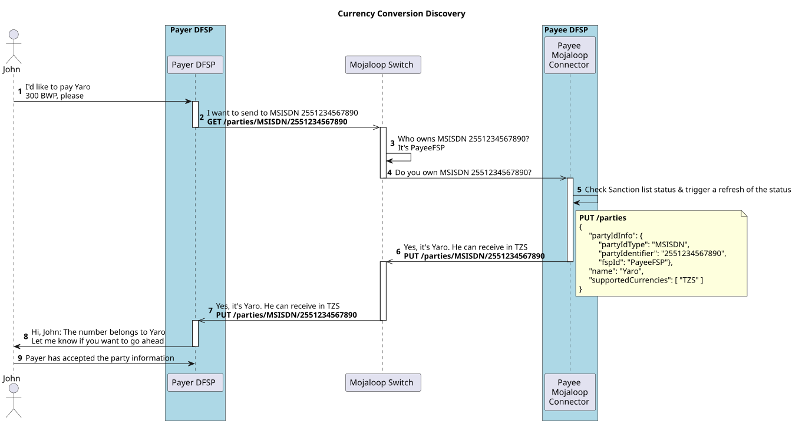

#### Fase de acuerdo - Conversión de moneda
El DFSP pagador envía una solicitud al FXP para obtener cobertura de liquidez para la transferencia. Se devuelven los términos de la conversión de moneda.
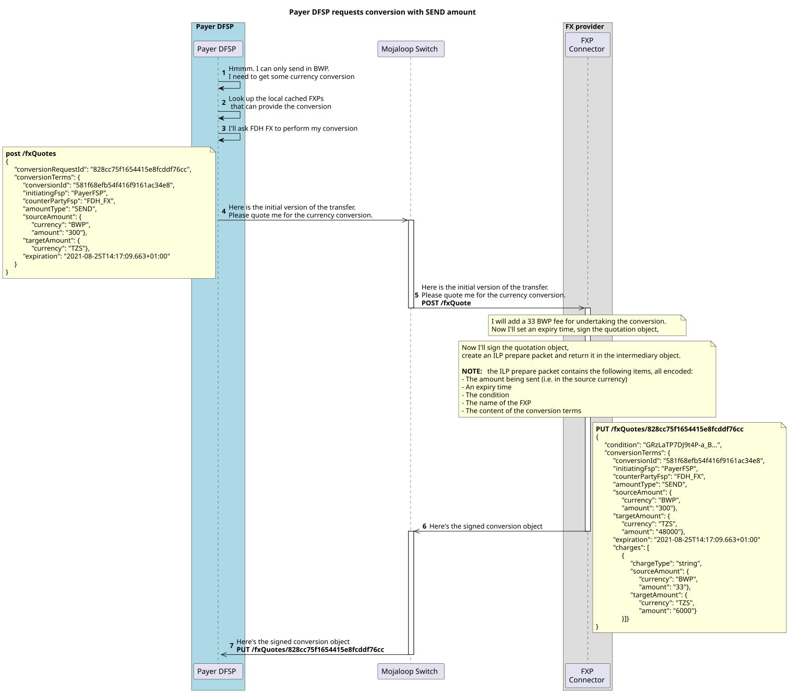

#### Fase de acuerdo 
El DFSP pagador envía una solicitud al DFSP beneficiario para obtener los términos de la transferencia.
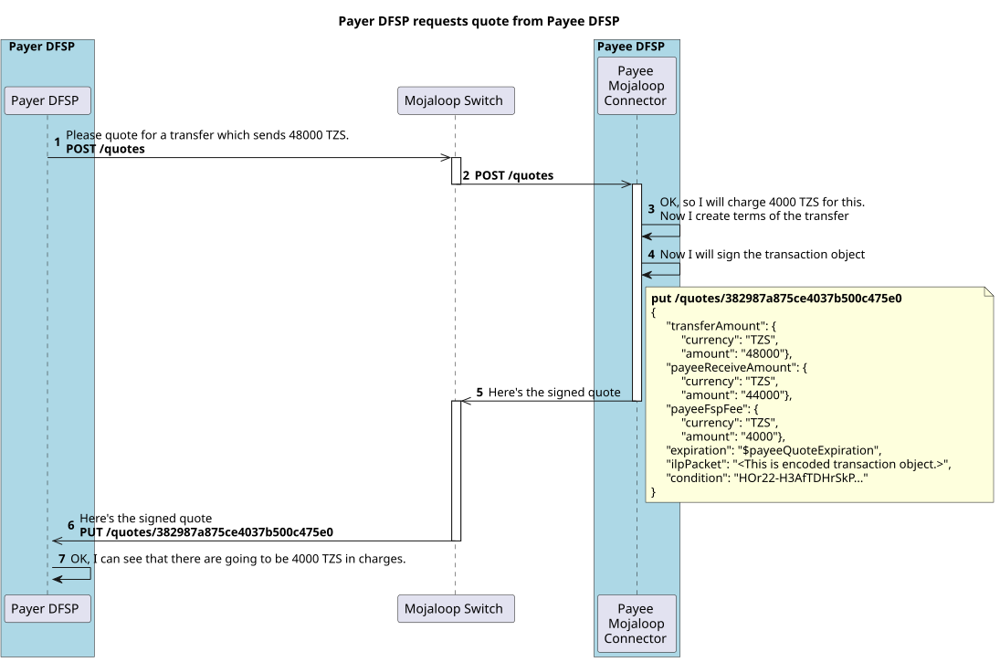

#### El DFSP pagador presenta los términos al pagador
En este punto se han proporcionado al DFSP pagador la información de la parte, los términos de la conversión y los términos de la transferencia. El DFSP pagador presenta estos términos al pagador y le pregunta si desea continuar o no.
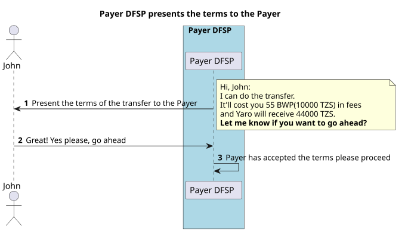

#### Fase de transferencia
Ahora que se han acordado los términos de la transferencia, esta puede continuar.
Tanto los términos de la conversión como los de la transferencia se confirman (commit) juntos.
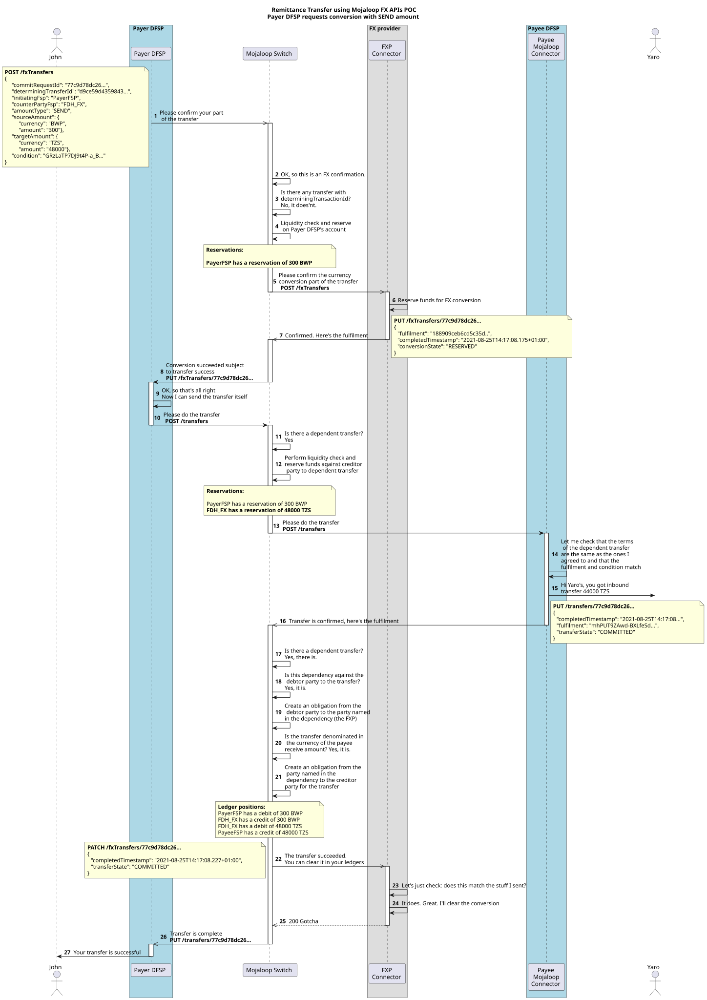

### Integración del Mojaloop Connector para la conversión de moneda

A continuación se muestra un diagrama de secuencia detallado que presenta el flujo completo e incluye el **Mojaloop Connector** y las API de integración de todas las organizaciones participantes. (Esta es una vista útil si está construyendo integraciones como organización participante.)

#### Fase de descubrimiento - Mojaloop Connector
Mojaloop utiliza un Oracle para identificar la organización DFSP asociada al identificador de parte. El DFSP beneficiario debe responder al GET /parties para confirmar que la cuenta existe y está activa para ese identificador de parte. Se devuelven las monedas admitidas para esa cuenta.
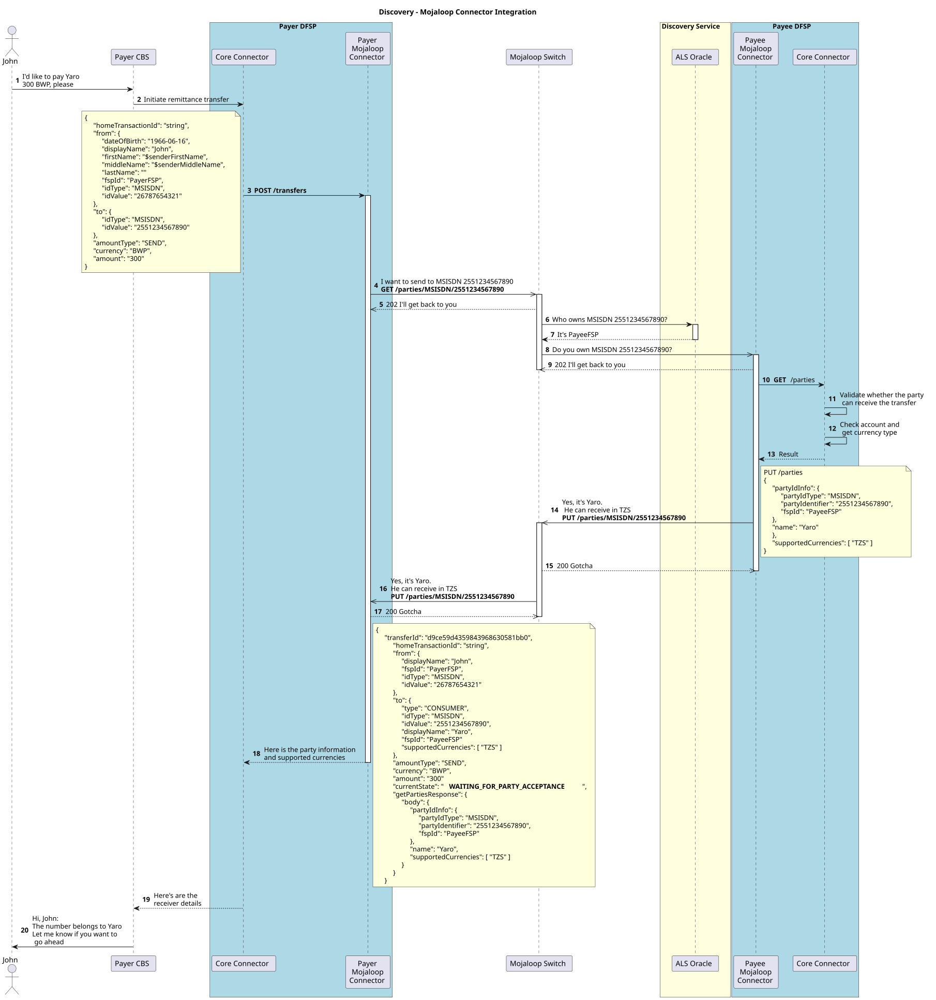

#### Fase de acuerdo de la conversión de moneda - Mojaloop Connector
El DFSP pagador no opera en ninguna de las monedas admitidas por el DFSP beneficiario. Esto activa el requisito de conversión de moneda dentro del Mojaloop Connector. El DFSP pagador usa su caché local de FXP para seleccionar y enviar una solicitud al proveedor de cambio de divisas para obtener cobertura de liquidez y un tipo de cambio de conversión.
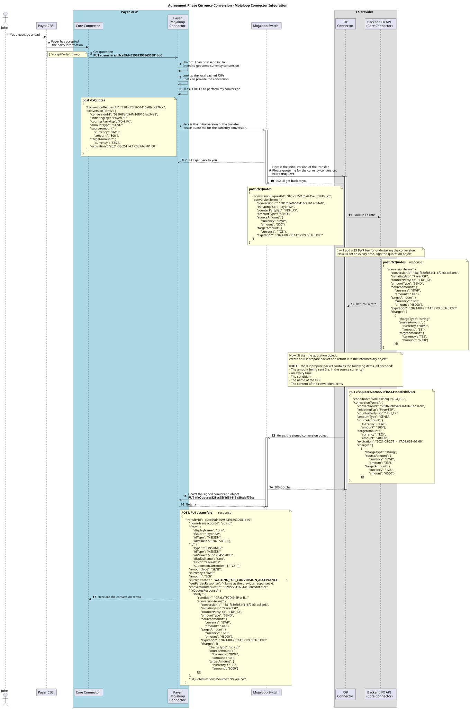

#### Fase de acuerdo - Mojaloop Connector
Se ha asegurado la liquidez en la moneda de destino. El DFSP pagador ya puede proceder a solicitar un acuerdo de términos al DFSP beneficiario. Estos términos están en la moneda de destino.
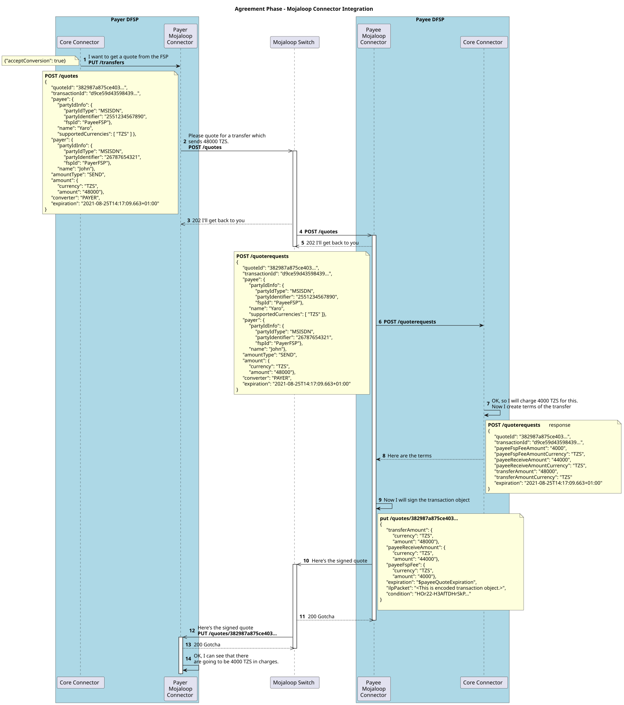

#### Confirmación del remitente
El DFSP pagador y el FXP han obtenido todos los términos de la conversión de moneda y de la transferencia. Ahora es el momento de reunir esos términos y presentarlos al pagador para su confirmación.
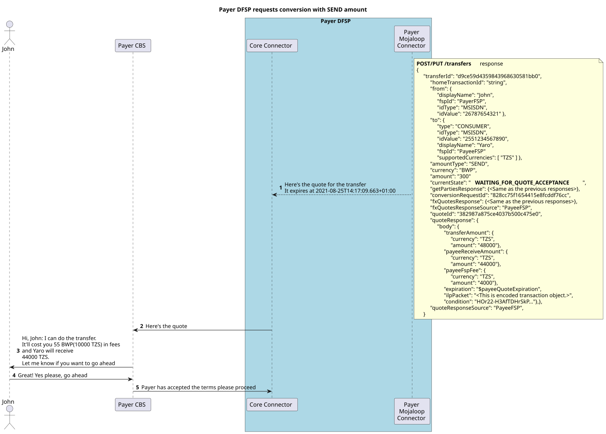

#### Fase de transferencia
Se han aceptado los términos de la transferencia. La fase de transferencia ya puede comenzar. 
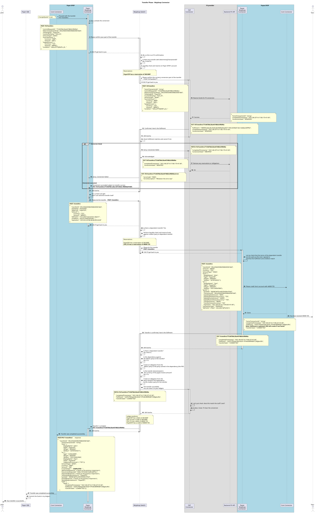

## Transferencia con conversión de moneda (moneda de destino)
Para este caso de uso, el DFSP pagador especificará la transferencia con el tipo de monto **RECEIVE** y definirá el monto de la transferencia en la **moneda local del beneficiario** (la moneda de destino).
Un ejemplo de caso de uso secundario para esto es un pago a comercio transfronterizo.

A continuación se muestra un diagrama de secuencia detallado que presenta el flujo completo e incluye el Mojaloop Connector y las API de integración de todas las organizaciones participantes.

#### Descubrimiento 
Mojaloop utiliza un Oracle para identificar la organización DFSP asociada al identificador de parte. El DFSP beneficiario debe responder al GET /parties para confirmar que la cuenta existe y está activa para ese identificador de parte. Se devuelven las monedas admitidas para esa cuenta.
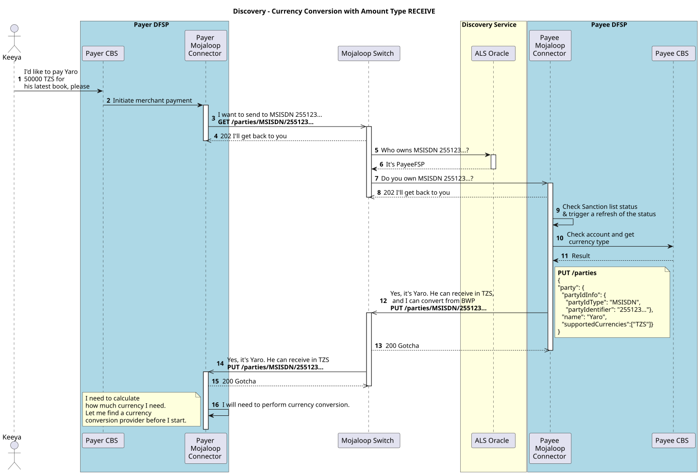

#### Acuerdo
El DFSP pagador no admite ninguna de las monedas del DFSP beneficiario, por lo que se requiere una conversión de moneda dentro del Mojaloop Connector. Dado que la solicitud de pago está en la moneda de destino, se debe establecer un acuerdo con el DFSP beneficiario antes de iniciar una solicitud de liquidez con el proveedor de cambio de divisas. El DFSP pagador primero negocia los términos de la transferencia con el DFSP beneficiario y luego usa su caché local de proveedores de cambio de divisas para seleccionar uno y solicitar cobertura de liquidez y un tipo de cambio de conversión.
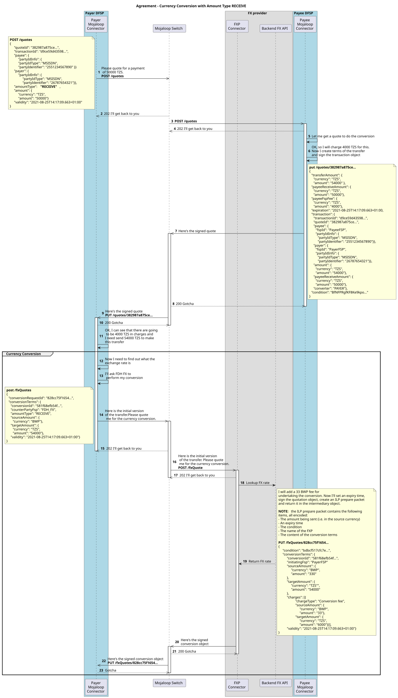

#### Confirmación del remitente
El DFSP pagador y el FXP han obtenido todos los términos de la conversión de moneda y de la transferencia. Ahora es el momento de reunir esos términos y presentarlos al pagador para su confirmación.
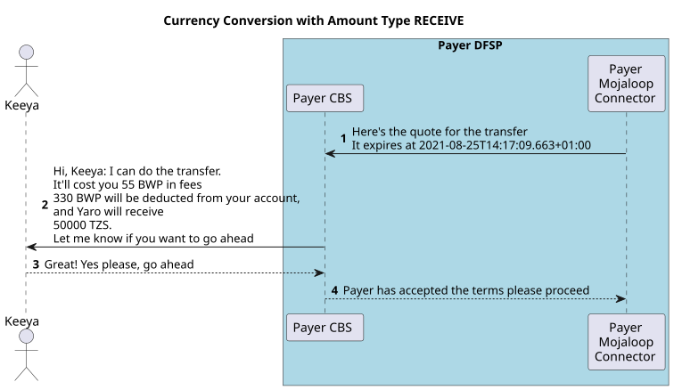

#### Transferencia 
Se han aceptado los términos de la transferencia. La fase de transferencia ya puede comenzar. 
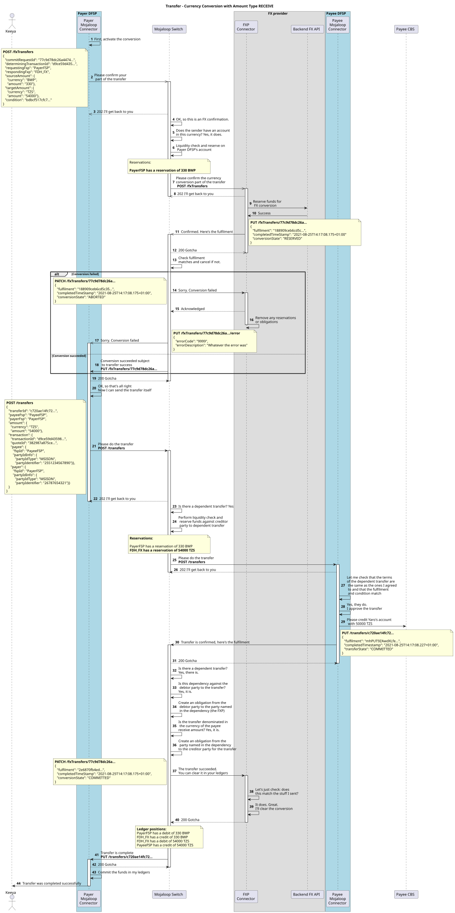

## Flujos de aborto
Este diagrama de secuencia muestra cómo el diseño implementa los mensajes de aborto durante la fase de transferencia con conversión de moneda.

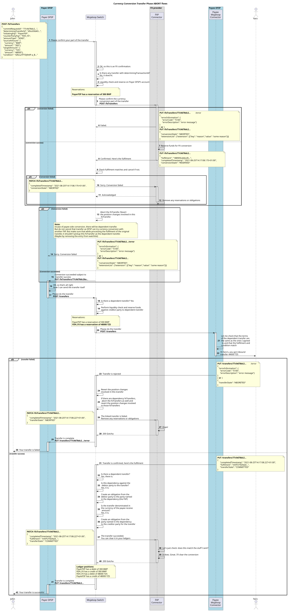

## Referencias de Open API
Estas referencias de Open API están diseñadas para ser legibles tanto por software como por una persona que las revise. Muestran los requisitos detallados y las implementaciones del diseño de la API.

- [Especificación FSPIOP v2.0](https://mojaloop.github.io/api-snippets/?urls.primaryName=v2.0) - [Definición de Open Api](https://github.com/mojaloop/mojaloop-specification/blob/master/fspiop-api/documents/v2.0-document-set/fspiop-v2.0-openapi3-implementation-draft.yaml).
- [Especificación FSPIOP v2.0 ISO 20022](https://mojaloop.github.io/api-snippets/?urls.primaryName=v2.0_ISO20022) - [Definición de Open Api](https://github.com/mojaloop/api-snippets/blob/main/docs/fspiop-rest-v2.0-ISO20022-openapi3-snippets.yaml).
- [Definición de Open Api de API Snippets](https://github.com/mojaloop/api-snippets/blob/main/docs/fspiop-rest-v2.0-openapi3-snippets.yaml)
- [Backend del Mojaloop Connector](https://mojaloop.github.io/api-snippets/?urls.primaryName=SDK%20Backend%20v2.1.0) - [Definición de Open Api](https://github.com/mojaloop/api-snippets/blob/main/docs/sdk-scheme-adapter-backend-v2_1_0-openapi3-snippets.yaml)
- [Salida (outbound) del Mojaloop Connector](https://mojaloop.github.io/api-snippets/?urls.primaryName=SDK%20Outbound%20v2.1.0) - [Definición de Open Api](https://github.com/mojaloop/api-snippets/blob/main/docs/sdk-scheme-adapter-outbound-v2_1_0-openapi3-snippets.yaml)

