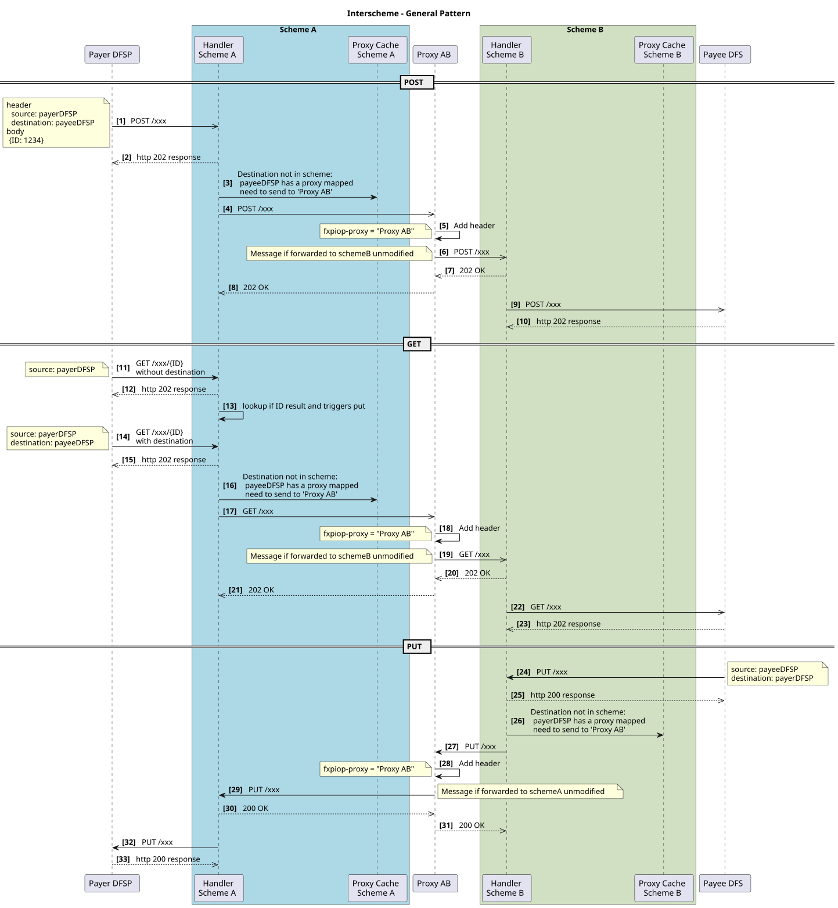
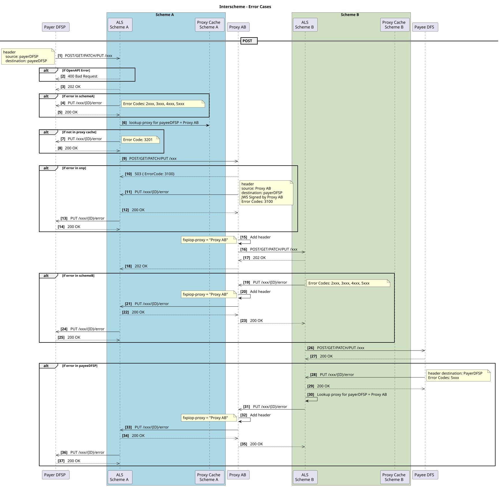
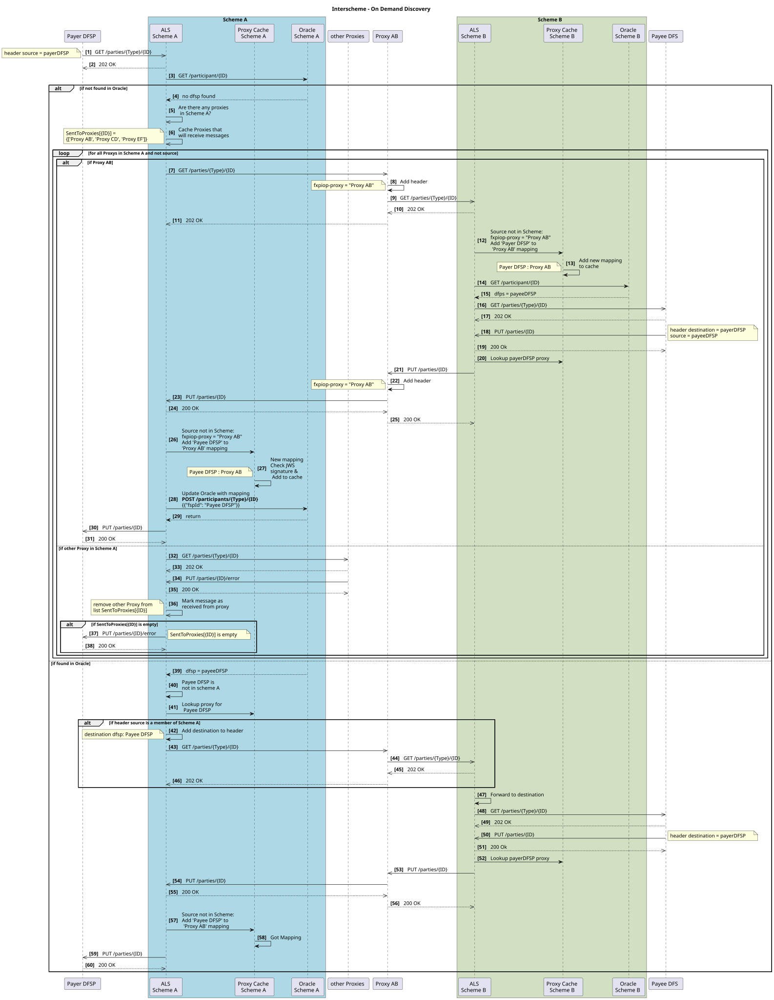
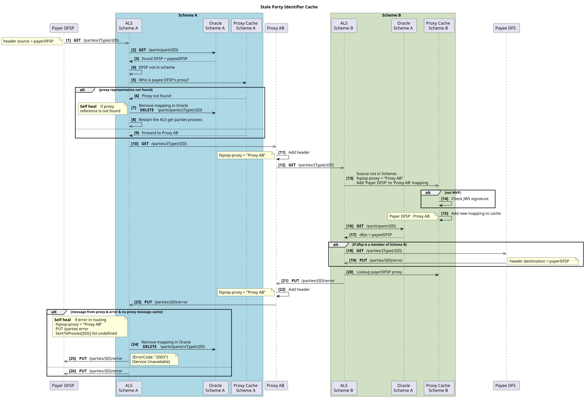
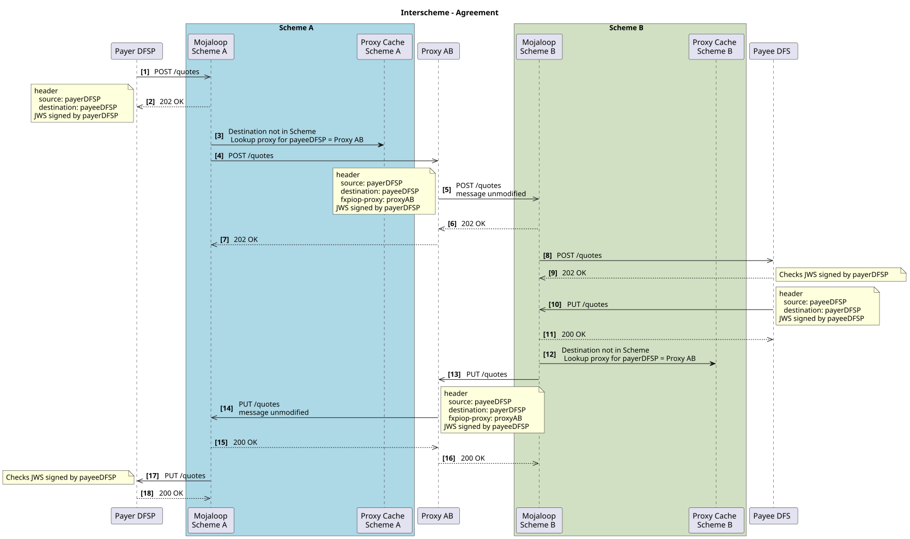
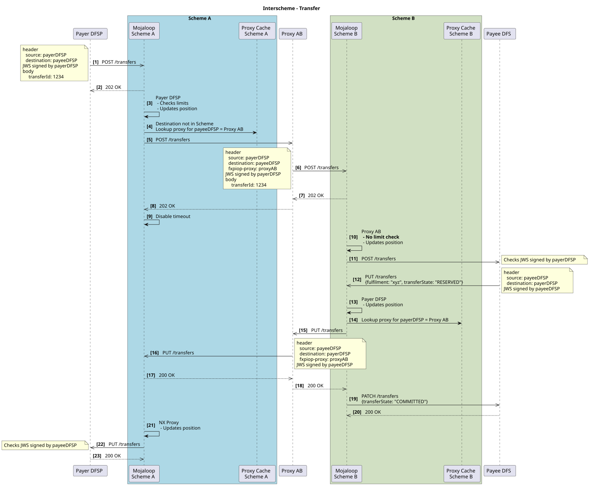
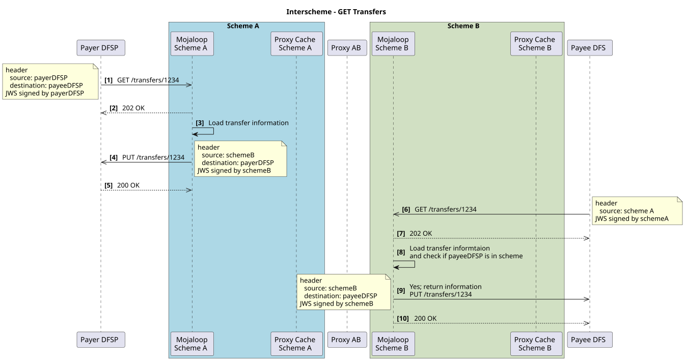
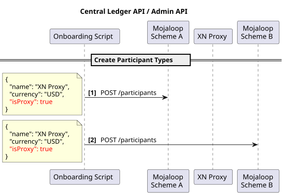
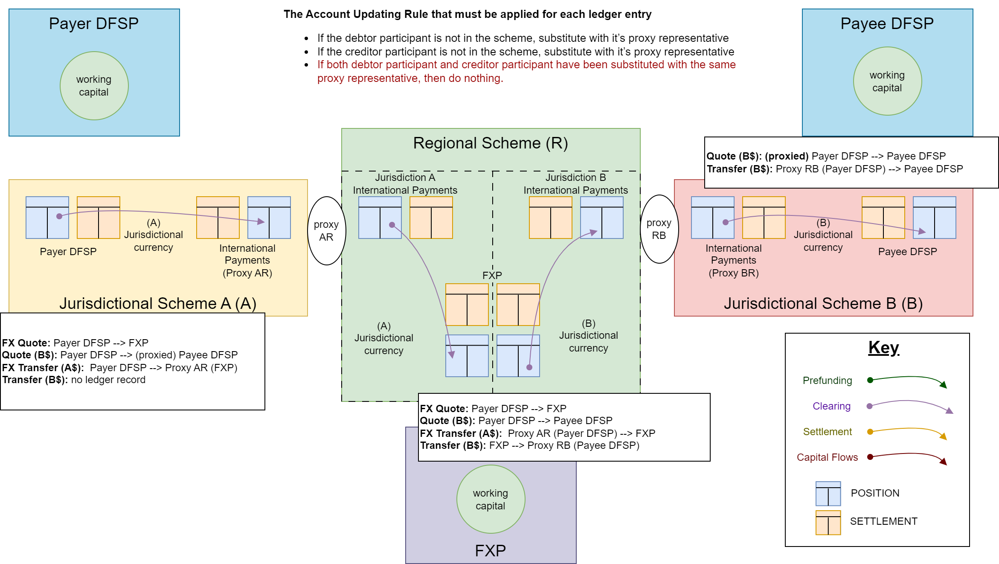

# Interscheme

Interscheme es el enfoque adoptado por la comunidad de Mojaloop para conectar esquemas de pagos preservando las tres fases de una transferencia de Mojaloop y garantizando el no repudio de extremo a extremo. Esto significa que el acuerdo alcanzado durante una transferencia permanece entre las organizaciones DFSP/FXP originadora y receptora, independientemente de la ruta de enrutamiento o del número de esquemas de pagos involucrados.

:::tip No repudio 
Garantizar el no repudio entre esquemas de pagos significa que el proxy no participa en el acuerdo de los términos, lo que ayuda a reducir costos.
::: 

La implementación inicial de esta funcionalidad permite la conexión de múltiples esquemas de pagos de Mojaloop. Con el tiempo, se espera que este ecosistema se amplíe a medida que esquemas de pagos nacionales adicionales adopten este protocolo y se desarrollen nuevos conectores para mejorar la interoperabilidad.

Para respaldar este esfuerzo, Mojaloop introdujo una nueva organización participante de tipo proxy. El adaptador de proxy sirve como implementación del componente de conexión de Mojaloop a Mojaloop.

## ¿Qué es un Proxy?
Los esquemas de pagos se conectan a través de un participante proxy, que se registra para actuar como intermediario dentro del esquema de pagos para los DFSP/FXP adyacentes de otros esquemas de pagos.

## Enrutamiento dinámico de partes
Esta implementación hace uso de un enrutamiento dinámico. Esto significa que no se requiere ningún mantenimiento inicial ni continuo de los identificadores de parte entre esquemas de pagos. El sistema hace uso de una difusión al esquema de pagos para descubrir ese identificador y almacena en caché la organización asociada con un identificador de parte.

## Supuestos
Este enfoque se basa en los siguientes supuestos:
1. Ningún par de participantes conectados comparte el mismo identificador.
1. Cada esquema de pagos conectado es responsable del enrutamiento de los identificadores de parte dentro de su propio sistema. (En Mojaloop, esto significa que cada esquema de pagos mantiene los oráculos necesarios para enrutar los pagos de las partes participantes de su red.)

## Patrones generales
Existen ciertos patrones generales que emergen
### Patrones del camino feliz

### Patrones de error

## Diseño del descubrimiento bajo demanda de Interscheme
Los flujos de descubrimiento se resumen de la siguiente manera:
1. Carga bajo demanda de identificadores entre redes: utilizando oráculos para las búsquedas de identificadores en el esquema de pagos local
2. Carga bajo demanda de todos los identificadores

### Uso de oráculos para almacenar identificadores en caché
- El esquema de pagos utiliza oráculos para asignar los identificadores locales a los participantes del esquema de pagos
- Los identificadores de otros esquemas de pagos se descubren mediante una búsqueda en profundidad, pero preguntando a todos los participantes. El participante proxy reenvía entonces la solicitud al esquema de pagos conectado
- Este diagrama muestra dos esquemas de pagos conectados, pero este diseño funciona para cualquier número de esquemas de pagos conectados.

### Descubrimiento bajo demanda con resultados almacenados en caché de forma incorrecta
- Cuando un identificador se ha trasladado a otro proveedor dfsp, la caché almacenada para ese participante enrutará a una llamada get \parties fallida.
- Se autorrepara si hay un error al enrutar el pago o si se pierde la referencia de la caché del proxy

A continuación se muestra un diagrama de secuencia que muestra cómo se actualiza eso.
#### Diagrama de secuencia

## Interscheme - Fase de acuerdo
La fase de acuerdo hace uso de la caché del proxy para enrutar los mensajes.
Estos son los detalles de la implementación.

## Interscheme - Fase de transferencia
La fase de transferencia hace uso de la caché del proxy para enrutar los mensajes.
Estos son los detalles de la implementación.

## Interscheme - GET Transfer 
El GET Transfer se resuelve localmente para devolver el estado de la transferencia en el esquema de pagos local.
Estos son los detalles de la implementación.

## Admin API - definición de participantes Proxy
Así se definen los Proxy.

## Cuentas de compensación para transferencias FX interscheme
Este diagrama ilustra cómo se actualizan las obligaciones durante la compensación de la transacción.

