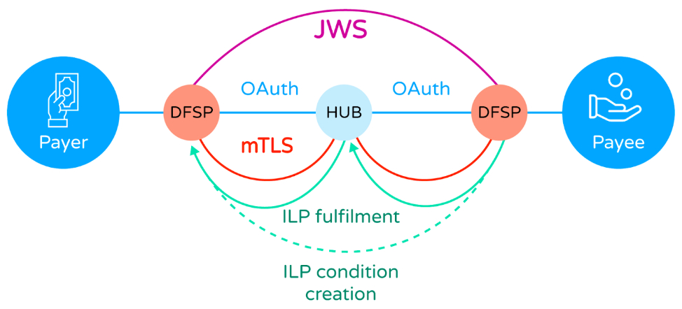

# Seguridad
## Código abierto y seguridad
Una idea errónea frecuente es que el software de código abierto es intrínsecamente menos seguro que el software de código cerrado, simplemente porque los atacantes pueden inspeccionar el código. El argumento es el siguiente: si el código es público, debe de ser más fácil descubrir vulnerabilidades. En realidad, esta visión malinterpreta cómo funciona la ciberseguridad moderna.

La seguridad de Mojaloop no depende de ocultar su funcionamiento interno. En cambio, se basa en algoritmos criptográficos de código abierto bien establecidos, desarrollados por expertos destacados y publicados abiertamente para su revisión por pares. Estos algoritmos son probados rigurosamente por la comunidad criptográfica mundial, lo que garantiza que las debilidades se identifiquen y se corrijan con rapidez. Cuando se encuentra una falla, las correcciones se comparten de forma abierta y rápida, lo que beneficia a todos los usuarios — Mojaloop incluido.

Este enfoque es directamente comparable al mundo de las cerraduras físicas. El mecanismo de una cerradura Yale, por ejemplo, no es ningún secreto: las patentes son públicas y cualquiera puede estudiar cómo funciona. Sin embargo, la cerradura sigue siendo segura, no porque el mecanismo esté oculto, sino porque solo la llave correcta y única puede abrirla. La criptografía funciona de la misma manera. Los algoritmos modernos se apoyan en el secreto de las claves, no en ocultar el algoritmo en sí.

Lo mismo aplica a toda la base de código de Mojaloop - al ser de código abierto, cualquiera puede revisar el código fuente y ayudar a identificar vulnerabilidades. Los equipos de la comunidad Mojaloop se interesan activamente en este proceso y señalan cualquier problema identificado durante el proceso de calidad y seguridad para su revisión y corrección. Partes interesadas ajenas a la comunidad principal plantean vulnerabilidades potenciales con regularidad, y estas son revisadas y atendidas por los equipos de calidad y seguridad. Se proporcionan más detalles en la sección [Mantenimiento de la seguridad](#mantenimiento-de-la-seguridad), más abajo

## Seguridad de Mojaloop
Mojaloop se ha apoyado en estas prácticas de código abierto y en estos algoritmos criptográficos para crear un modelo de seguridad multicapa, complejo y sujeto a supervisión y revisión continuas.

Se puede desglosar en tres áreas de alcance:

- La seguridad de la conexión entre el Hub de Mojaloop y los DFSP participantes (esto incluye tanto la seguridad de las transacciones como la seguridad, el establecimiento y el mantenimiento de la propia conexión subyacente);
- La seguridad de las operaciones del Hub, reflejada en las actividades del personal operativo;
- La calidad y la seguridad del despliegue del Hub de Mojaloop.

Esta página se centra en los mecanismos y procesos de seguridad dentro de Mojaloop y de sus conexiones. El hardware y el entorno anfitrión operados dentro del dominio de un DFSP tienen un límite de confianza separado. Los esquemas de pagos que evalúen esa infraestructura también deberían consultar la [guía de arquitectura de seguridad para la infraestructura del DFSP](./dfsp-infrastructure-security.md).

En las siguientes secciones se explora cómo aborda Mojaloop cada una de estas áreas.

## Seguridad de la conexión del DFSP
La conexión entre un DFSP participante y el Hub de Mojaloop se beneficia de tres niveles de seguridad que, en conjunto, garantizan la integridad, la confidencialidad y el no repudio de los mensajes entre un DFSP, el Hub de Mojaloop y (cuando corresponda) el otro DFSP que participa en una transacción.

El siguiente diagrama ilustra estos tres niveles.

En el nivel más bajo, la seguridad de la conexión punto a punto entre un DFSP (un participante autorizado) y el Hub de Mojaloop se asegura mediante el uso de mTLS, que garantiza que las comunicaciones sean confidenciales y se produzcan entre corresponsales conocidos, y que estén protegidas contra alteraciones.

A continuación, el contenido de los mensajes JSON utilizados para la comunicación entre el Hub y los DFSP se firma criptográficamente, según el método definido en la especificación JWS ([véase RFC 7515](https://www.rfc-editor.org/rfc/rfc7515.html)). Esto asegura a los destinatarios que los mensajes fueron enviados por la parte que afirmaba enviarlos y, al mismo tiempo, que el remitente no puede repudiar esa procedencia.

Por último, los términos de una transacción/transferencia se protegen mediante el Interledger Protocol (ILP) entre los participantes pagador y beneficiario. ILP utiliza un [Hashed Timelock Contract (HTLC)](./htlc.html) para proteger la integridad de la condición (condition) de pago y su fulfilment. De este modo, Mojaloop garantiza que una transferencia se complete íntegramente en todas las partes participantes o que no se complete en absoluto. También limita el tiempo durante el cual una instrucción de transferencia es válida.

Estas tres capas están todas integradas en el Hub de Mojaloop. Del lado del DFSP, pueden ser establecidas y gestionadas directamente por los propios equipos de ingeniería del DFSP. Sin embargo, la comunidad Mojaloop también [pone a disposición un conjunto de herramientas](./connectivity.html) que establecen estas capas de seguridad y las mantienen durante toda la vida de la conexión. Las herramientas también ayudan al DFSP a gestionar y orquestar su uso de las distintas comunicaciones y API con el Hub de Mojaloop, encargándose de muchas de las complejidades en nombre del DFSP, mientras existen por completo dentro del propio dominio del DFSP (y por lo tanto no forman parte del Hub de Mojaloop).

## Seguridad operativa del Hub
La seguridad en el propio Hub de Mojaloop va más allá de las conexiones con los DFSP participantes (como se describe en la sección anterior) e incluye la seguridad de las acciones del operador mediante el uso de los distintos [portales del Hub](./product.html).

Los portales se implementan con el Business Operations Framework (BOF) de Mojaloop, que no solo proporciona los portales principales de Mojaloop, sino que también ofrece un conjunto de API para que un operador del Hub pueda extender estos portales y crear otros nuevos, a fin de satisfacer sus requisitos específicos.

Para facilitar la gestión de la seguridad de estos portales, el BOF canaliza toda la actividad a través de un único marco de Identity and Access Management (IAM), que incorpora controles de acceso basados en roles (RBAC) y admite de forma intrínseca los controles Maker/Checker (también conocidos como «cuatro ojos»), estándar en la industria.

Este enfoque le da al operador de un Hub de Mojaloop un control granular del acceso de cada persona a las capacidades de gestión del Hub de Mojaloop, así como de los controles aplicados a cada actividad. Sin embargo, sigue siendo responsabilidad del operador del Hub asegurar que su personal sea debidamente evaluado antes de su contratación, que esté registrado en el IAM para acceder a los portales, que se le asignen los roles apropiados y que el marco RBAC asigne correctamente los roles para vigilar las funciones de gestión (incluidos, cuando corresponda, los controles maker/checker). En particular, el marco IAM admite directamente políticas como la expiración de contraseñas, la longitud y el contenido de las contraseñas, su reutilización, etc., y también admite el uso de autenticación multifactor (MFA) para todos los operadores, según lo determine el operador del Hub (aunque se desaconseja enérgicamente el uso de SMS o USSD como canal de MFA).

Además, sigue siendo responsabilidad del operador del Hub asegurar que se establezcan los puntos de control apropiados para la operación de un servicio financiero (como, cuando corresponda, el acceso físico a los servidores que alojan el Hub de Mojaloop, el control del uso de celulares por parte de los operadores, la videovigilancia, la gestión de la cadena de suministro, la gestión de visitantes, etc.), y que se definan procesos de negocio para garantizar la correcta aplicación de esos puntos de control.

## Mantenimiento de la seguridad
La comunidad Mojaloop ha definido un conjunto de procedimientos y técnicas para garantizar que la seguridad de un despliegue de Mojaloop se mantenga a medida que los ataques evolucionan y se identifican vulnerabilidades, ya sea en Mojaloop mismo o en alguno de los innumerables otros programas de código abierto de los que Mojaloop depende. A esto se le denomina en conjunto el Proceso de gestión de vulnerabilidades, y comprende:
- Un Comité de Seguridad, cuya función es la coordinación de todos los aspectos de la gestión de vulnerabilidades.
- Procesos para tratar posibles vulnerabilidades, una vez que se han puesto en conocimiento del Comité de Seguridad.
- Procesos proactivos de identificación y gestión de vulnerabilidades, entre ellos:
	- El monitoreo continuo de los componentes de código abierto en busca de vulnerabilidades;
	- Static Application Security Testing (SAST), con varias herramientas que en conjunto aportan información detallada sobre las vulnerabilidades a nivel de código aprovechando bases de datos públicas de vulnerabilidades;
	- El mantenimiento automatizado de un Software Bill of Materials (SBOM), que facilita la gestión del inventario y de las dependencias;
	- El escaneo de las imágenes de contenedor en busca de vulnerabilidades antes de su publicación;
	- El uso de un escáner automatizado de licencias para garantizar que solo se utilicen componentes externos con licencias compatibles;
	- A partir de la versión v17.1.0 de Mojaloop, los charts de Helm de Mojaloop se firman al publicarse y pueden verificarse en el momento de la instalación o del despliegue, para garantizar la procedencia de los artefactos relacionados con los charts;
	- Mojaloop emplea un pipeline de CI/CD que integra automáticamente comprobaciones de seguridad a lo largo de todo el proceso de desarrollo de software;
	- Mojaloop opera un proceso de divulgación coordinada de vulnerabilidades (CVD), que garantiza que las partes responsables dispongan de tiempo suficiente para atender y corregir las vulnerabilidades antes de su divulgación pública;
	- Después de cada escaneo se generan informes completos que detallan los resultados, las acciones de corrección y su eficacia. Todos los informes se almacenan para fines de auditoría y cumplimiento, lo que garantiza la transparencia y la rendición de cuentas.

El lector puede encontrar información técnica más detallada sobre el [Proceso de gestión de vulnerabilidades de Mojaloop aquí](https://docs.mojaloop.io/technical/technical/security/security-overview.html).

## Calidad y seguridad del despliegue
Los miembros de la comunidad Mojaloop están desarrollando actualmente un marco de evaluación de calidad, cuyo propósito es desarrollar un Toolkit que pueda utilizarse para validar la configuración, la funcionalidad, la seguridad, la preparación para la interoperabilidad y el rendimiento de un despliegue.

Este marco podría ser utilizado por los adoptantes para "autocertificarse", o podría ser utilizado por un revisor externo con el fin de crear un mayor nivel de garantía para las autoridades supervisoras y los participantes.

## Aplicabilidad
Este documento corresponde a la versión 17.1.0 de Mojaloop
## Historial del documento
  |Versión|Fecha|Autor|Detalle|
|:--------------:|:--------------:|:--------------:|:--------------:|
|1.3|21 de agosto de 2026| Yevhen Kyriukha|Se vinculó la guía de seguridad de la infraestructura del DFSP|
|1.2|13 de octubre de 2025| Paul Makin|Se agregó la sección introductoria "Código abierto y seguridad".|
|1.1|15 de julio de 2025| Paul Makin|Se agregó la sección "Mantenimiento de la seguridad".|
|1.0|24 de junio de 2025| Paul Makin|Versión inicial|
