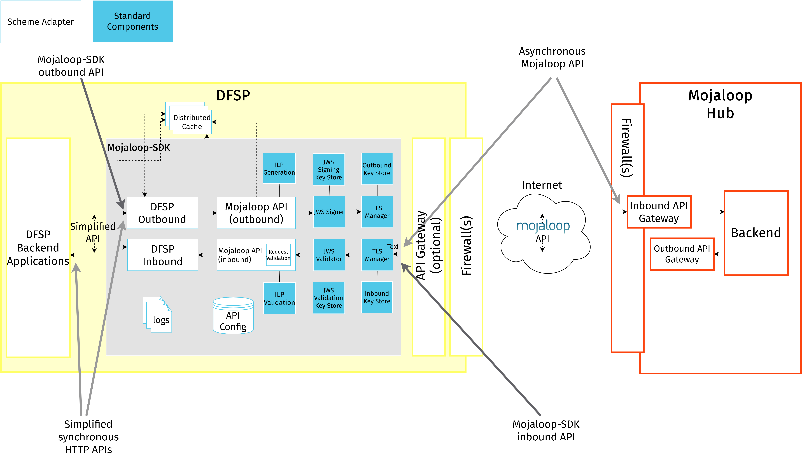
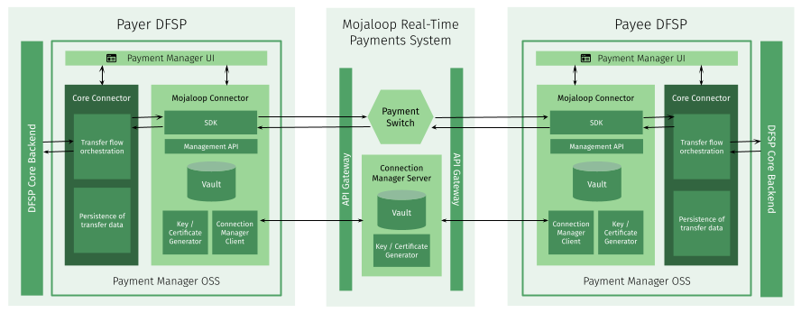
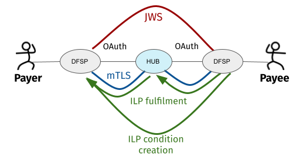
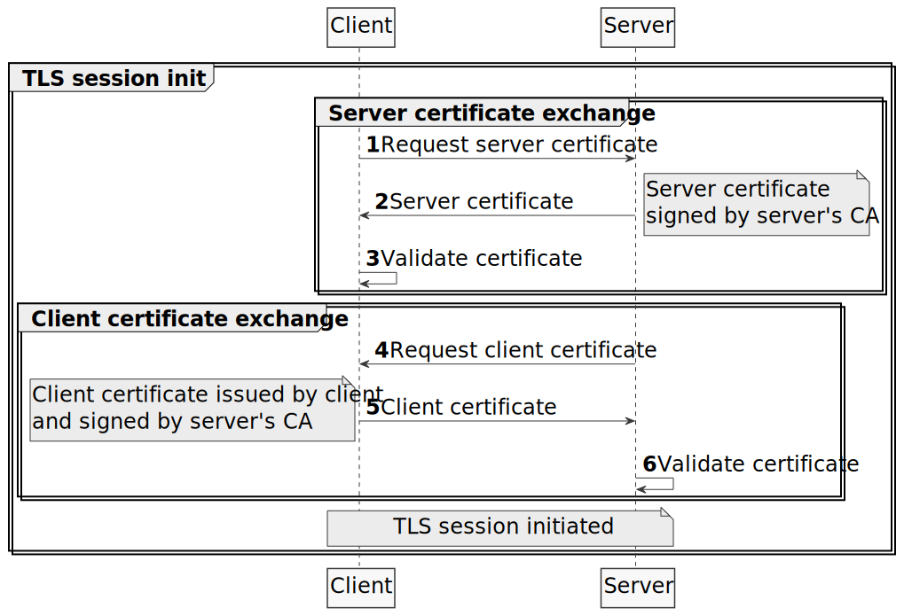

# Intégration technique des DFSP

À un niveau élevé, l'intégration à un Hub Mojaloop nécessite qu'un DFSP concentre ses efforts sur les jalons majeurs suivants :

* [Intégration](#integration-api) de son backend principal avec le Hub Mojaloop au niveau de l'API (cela implique à la fois le codage et les tests).
* [Connexion](#connexion-aux-environnements-mojaloop) aux environnements de pré-production et de production en suivant les exigences rigoureuses de sécurité de Mojaloop.

En plus des étapes nécessitant l'implication du DFSP, l'opérateur du Hub doit également effectuer certaines activités d'intégration dans son [backend](#integration-dans-le-backend-du-hub) indépendamment des DFSP.

Cette section fournit une vue d'ensemble de haut niveau de tous ces jalons.

## Intégration API

Dans le contexte de l'API Mojaloop Financial Service Provider Interoperability (FSPIOP), un transfert se déroule en trois étapes principales :

1. Identification du bénéficiaire (phase de recherche de partie ou de découverte)
1. Accord sur le transfert (phase de devis ou d'accord)
1. Exécution du transfert (phase de transfert)

Pour plus de détails sur chacune de ces phases, voir le **Module 2 - Démonstration statique : Un exemple de bout en bout** du [cours de formation Mojaloop](https://learn.mojaloop.io/) **MOJA-102**.

Ces trois phases correspondent aux ressources clés de l'API Mojaloop FSPIOP :

* **Service de recherche de partie** : Identification du DFSP desservant le bénéficiaire et du bénéficiaire lui-même (= le destinataire des fonds dans une transaction) sur la base d'un identifiant du bénéficiaire (généralement un MSISDN, c'est-à-dire un numéro de mobile).
* **Service de devis** : Demande d'un devis et échange de preuves cryptographiques pour préparer et sécuriser le transfert. Un devis est un contrat entre un DFSP payeur et un DFSP bénéficiaire pour une transaction financière particulière avant que la transaction ne soit effectuée. Il garantit l'accord établi par les DFSP payeur et bénéficiaire concernant le payeur, le bénéficiaire et le montant du transfert, et est valide pendant la durée de vie d'un devis et d'un transfert d'une transaction financière spécifiée.
* **Service de transferts** : Exécution de la transaction selon les détails convenus et la preuve cryptographique.

Les DFSP peuvent choisir de :

* se connecter directement au Hub Mojaloop et implémenter la version asynchrone Mojaloop de ces services API, ou
* tirer parti d'un composant d'intégration open source (le [Mojaloop-SDK](#mojaloop-sdk) ou [Payment Manager OSS](#payment-manager-oss)) et implémenter une version simplifiée et synchrone des services de l'API Mojaloop FSPIOP

Les DFSP disposant d'une équipe de développement interne et d'une expérience avec les API RESTful seront probablement en mesure de gérer le processus en interne et de développer une connexion directe à Mojaloop. Cependant, il est recommandé que les DFSP utilisent l'un des composants d'intégration open source, car une connexion directe nécessite un développement et une maintenance de code supplémentaires. L'utilisation du Mojaloop-SDK ou de Payment Manager OSS réduit le temps nécessaire à l'intégration avec le Hub Mojaloop et facilite le dépannage pour l'opérateur du Hub, réduisant ainsi le coût global du système.

Pendant que le DFSP effectue des travaux de développement hors ligne, le rôle de l'opérateur du Hub consiste à répondre aux questions ponctuelles sur les spécificités de l'API, ou - selon l'outil open source choisi et le modèle de déploiement convenu - peut même s'étendre à une partie du développement.

### Outils open source pour faciliter l'intégration API

#### Mojaloop-SDK

Le [Mojaloop-SDK](https://github.com/mojaloop/sdk-scheme-adapter) présente une version simplifiée et synchrone de l'API Mojaloop FSPIOP au système backend d'un DFSP, permettant aux DFSP d'implémenter une API simple en interne pour s'interfacer avec le Hub Mojaloop, tout en restant conforme à la spécification de l'API Mojaloop FSPIOP pour les communications externes interopérables.

Le modèle asynchrone de l'API Mojaloop FSPIOP (bien qu'il présente de nombreux avantages) peut ne pas convenir aux applications clientes qui fonctionnent en mode requête-réponse synchrone. Le Mojaloop-SDK aide à combler cet écart en offrant une API simplifiée de type requête-réponse, faisant abstraction des complexités de la composition de requêtes multiples et des détails de l'API asynchrone pour les clients finaux.

Le Mojaloop-SDK doit être téléchargé depuis [GitHub](https://github.com/mojaloop/sdk-scheme-adapter) vers l'environnement du DFSP et intégré au backend du DFSP. Il est fourni sous forme d'image de conteneur Docker, et peut être hébergé sur la même infrastructure que l'application bancaire principale ou sur une machine virtuelle provisionnée spécifiquement pour cela. La maintenance continue peut nécessiter un support spécialisé d'un intégrateur de systèmes formé au logiciel.

En plus d'une API simplifiée, le Mojaloop-SDK fournit également les protocoles de sécurité requis par Mojaloop « prêts à l'emploi », en offrant une interface de configuration simplifiée à ses utilisateurs. Cette fonctionnalité du Mojaloop-SDK aide à l'[étape de connexion](#connexion-aux-environnements-mojaloop) de l'intégration.

#### Payment Manager OSS

[Payment Manager OSS](https://pm4ml.github.io/documents/payment_manager_oss/latest/core_connector_rest/introduction.html) présente une version orientée cas d'utilisation, simplifiée et synchrone de l'API Mojaloop FSPIOP au système backend d'un DFSP. Le composant clé d'intégration de Payment Manager s'appelle Core Connector, il agit comme un traducteur entre le backend principal d'un DFSP (CBS) et un composant de Payment Manager (appelé Mojaloop Connector, qui exploite le Mojaloop-SDK) qui communique directement avec le Hub Mojaloop.

Core Connector est construit en Apache Camel, un langage déclaratif basé sur Java pour les ingénieurs d'intégration qui ne nécessite pas d'écrire du code à partir de zéro. Un modèle de Core Connector prêt à l'emploi est disponible pour simplifier l'effort de développement. Le modèle fournit une base de code de remplacement pour les points d'accès API qui doivent être développés, et il doit être personnalisé pour être aligné avec la technologie CBS appropriée. La flexibilité offerte par le modèle permet d'adapter Core Connector au backend d'un DFSP, plutôt que l'inverse.

L'effort de personnalisation d'un modèle Core Connector variera selon l'option de déploiement choisie. Lors du déploiement de Payment Manager, deux options sont disponibles :

* **Géré et hébergé par un intégrateur de systèmes** : Un intégrateur de systèmes déploie Payment Manager dans le cloud, et synchronise le modèle Core Connector avec l'implémentation du backend principal du DFSP.
* **Auto-hébergé par le DFSP** : Le DFSP déploie Payment Manager sur site ou dans le cloud, et la personnalisation du modèle Core Connector peut être effectuée par un certain nombre d'acteurs (selon le résultat d'une évaluation initiale des capacités du DFSP) :
    * l'intégrateur de systèmes
    * l'intégrateur de systèmes et le fournisseur de la solution backend principale du DFSP
    * le DFSP et le fournisseur de la solution backend principale du DFSP

Payment Manager est fourni sous forme d'un ensemble d'images de conteneurs Linux (Docker) et peut être hébergé sur site à l'aide d'une infrastructure serveur standard ou dans une infrastructure cloud appropriée lorsqu'elle est disponible.

Si l'opérateur du Hub le souhaite, il peut assumer le rôle d'intégrateur de systèmes.

Étant donné que Payment Manager intègre les fonctionnalités du Mojaloop-SDK, il implémente également la couche de sécurité requise par Mojaloop. Cette fonctionnalité de Payment Manager aide à l'[étape de connexion](#connexion-aux-environnements-mojaloop) de l'intégration.

## Connexion aux environnements Mojaloop

Une fois que le DFSP a terminé le codage, il teste son intégration contre une instance de laboratoire dans un environnement de test fourni par le Hub. C'est là que la phase de connexion du parcours d'intégration technique commence, avec un nouvel ensemble de responsabilités pour l'opérateur du Hub.

Les exigences relatives à la connexion sont dictées par les multiples protocoles de sécurité que tout Hub Mojaloop et les DFSP participants doivent implémenter :

* TLS bidirectionnel avec authentification mutuelle X.509
* Authentification OAuth 2.0 pour les sessions via la passerelle API du Hub
* Liste blanche basée sur les adresses IP dans les règles de pare-feu et les passerelles API
* Signature des messages par JSON Web Signature (JWS)
* Signature et validation des paquets Interledger Protocol (ILP)

Si vous souhaitez plus de détails, consultez [Sécurité dans Mojaloop](#securite-dans-mojaloop).

La mise en pratique des mesures de sécurité ci-dessus nécessite un partage d'informations étendu et une configuration technique de la part de différentes équipes tant du côté du DFSP que du Hub Mojaloop. Des outils open source sont disponibles pour la communauté afin de faciliter ce processus, tant pour les DFSP que pour l'opérateur du Hub.

### Outils open source pour faciliter la connexion aux environnements Mojaloop

#### Mojaloop-SDK

Le Mojaloop-SDK implémente des composants standard qui établissent une manière uniforme de connecter les systèmes DFSP à un Hub Mojaloop. Il implémente les fonctionnalités de sécurité conformes à Mojaloop suivantes :

* TLS bidirectionnel avec authentification mutuelle X.509
* Signature des messages par JSON Web Signature (JWS)
* Génération du paquet Interledger Protocol (ILP) avec signature et validation

Le Mojaloop-SDK peut être téléchargé depuis [GitHub](https://github.com/mojaloop/sdk-standard-components) et hébergé sur la même infrastructure que l'application bancaire principale du DFSP ou sur une machine virtuelle provisionnée spécifiquement pour cela. Après la génération, la signature et l'échange des certificats TLS et JWS, les DFSP sont tenus de configurer les variables d'environnement liées à TLS et JWS dans le Mojaloop-SDK. Enfin, l'installation des certificats dans les pare-feu et la passerelle API du DFSP complète la partie configuration des certificats du processus.

L'obtention des identifiants de la passerelle API du Hub requis pour collecter les jetons OAuth 2.0 et leur configuration dans le Mojaloop-SDK via des variables d'environnement doit être effectuée manuellement.

L'échange des détails des points d'accès avec le Hub et leur configuration dans le Mojaloop-SDK via des variables d'environnement, ainsi que dans les listes blanches des pare-feu/passerelles sont également des étapes manuelles.

#### Payment Manager OSS

Payment Manager OSS fournit toutes les fonctionnalités de sécurité que le Mojaloop-SDK offre, et plus encore. Payment Manager est livré avec un client Mojaloop Connection Manager (MCM), qui simplifie et automatise la création, la signature et l'échange de certificats, ainsi que la configuration des connexions requises aux différents environnements. Le degré d'automatisation de ces processus variera selon l'option de déploiement choisie. Deux options sont disponibles :

* **Géré et hébergé par un intégrateur de systèmes** : Un intégrateur de systèmes déploie Payment Manager dans le cloud.
* **Auto-hébergé par le DFSP** : Le DFSP déploie Payment Manager sur site ou dans le cloud.

Lorsqu'un DFSP opte pour l'**option gérée et hébergée**, l'intégrateur de systèmes (ce rôle peut être rempli par l'opérateur du Hub) peut employer l'Infrastructure-as-Code et des scripts d'intégration pour gérer les éléments suivants du processus de manière automatisée :

* génération, signature, configuration et installation des certificats TLS
* mise en liste blanche des adresses IP dans les pare-feu et les passerelles API
* génération et configuration du secret/clé client requis pour obtenir des jetons OAuth 2.0

Les étapes liées aux certificats JWS sont effectuées via le [portail Connection Wizard](https://pm4ml.github.io/documents/payment_manager_oss/latest/connection_wizard/index.html), un portail facile à utiliser que Payment Manager fournit pour gérer les processus liés aux certificats et aux points d'accès de manière guidée. Les DFSP et l'opérateur du Hub sont tenus de générer des certificats JWS en utilisant l'outil de leur choix, puis de partager leurs clés publiques via le portail Connection Wizard. La configuration des certificats JWS dans Payment Manager se fait via le portail Connection Wizard, tandis que leur installation dans les passerelles est une étape manuelle.

Lorsqu'un DFSP opte pour l'**option auto-hébergée**, il utilise le [portail Connection Wizard](https://pm4ml.github.io/documents/payment_manager_oss/latest/connection_wizard/index.html) pour gérer les étapes liées aux certificats et aux points d'accès de manière semi-automatisée :

* Les DFSP saisissent les détails de leurs points d'accès et obtiennent les points d'accès du Hub depuis le portail. Ils configurent ensuite ces informations dans Payment Manager via des variables d'environnement ainsi que dans les listes blanches des pare-feu/passerelles manuellement.
* Les DFSP génèrent, signent et configurent les certificats TLS en un clic via le portail Connection Wizard.
* Les DFSP génèrent des certificats JWS en utilisant un outil de leur choix et les partagent et les configurent dans Payment Manager en un clic dans le portail Connection Wizard.

L'obtention des identifiants de la passerelle API du Hub requis pour collecter les jetons OAuth 2.0 et leur configuration dans Payment Manager via des variables d'environnement doit être effectuée manuellement.

#### MCM

Le produit Mojaloop Connection Manager (MCM) est essentiel pour simplifier et automatiser une grande partie du partage d'informations et de la configuration autour des points d'accès et des certificats. MCM a un composant Client MCM et un composant Serveur MCM, qui communiquent entre eux lors de l'échange des détails des points d'accès et des certificats, et lors de la signature des demandes de signature de certificat.

Le client MCM est intégré dans Payment Manager, tandis que le serveur MCM se trouve dans les limites du Hub. MCM fournit un portail pour que l'opérateur du Hub soumette les informations des points d'accès du Hub et les certificats du Hub, et récupère les détails des points d'accès et des certificats du DFSP soumis par le DFSP via Payment Manager.

### Sécurité dans Mojaloop

Pour comprendre ce qu'implique en détail la connexion d'un DFSP à un environnement Mojaloop, il est important d'examiner de plus près les exigences de sécurité de Mojaloop.

Mojaloop exige que les mesures de sécurité suivantes soient implémentées afin de protéger les données échangées entre les DFSP :

* **La sécurité de la couche de transport (TLS)** est un mécanisme sécurisé pour échanger une clé symétrique partagée sur un réseau entre deux pairs anonymes, avec vérification d'identité (c'est-à-dire des certificats de confiance). Elle assure la confidentialité (personne n'a lu le contenu) et l'intégrité (personne n'a modifié le contenu). Mojaloop exige une authentification mutuelle TLS bidirectionnelle utilisant des certificats X.509 pour sécuriser les connexions bidirectionnelles. Les DFSP et le Hub Mojaloop s'authentifient mutuellement pour s'assurer que les deux parties impliquées dans la communication sont de confiance. Les deux parties partagent leurs certificats publics et la vérification/validation est ensuite effectuée sur cette base.
* Une autre mesure de sécurité offerte pour l'authentification est constituée par les **jetons OAuth** que les DFSP sont tenus d'utiliser lors d'une requête d'appel API. OAuth 2 est utilisé pour fournir un accès basé sur les rôles aux points d'accès du Hub Mojaloop (autorisation API).
* **La mise en liste blanche des adresses IP** réduit la surface d'attaque du Hub Mojaloop.
* Pour protéger le niveau applicatif, Mojaloop implémente la **signature JSON Web Signature (JWS)** telle que définie dans la [RFC 7515 (JSON Web Signature (JWS))](https://tools.ietf.org/html/rfc7515), la norme pour l'intégrité et la non-répudiation. La signature des messages garantit que le DFSP payeur et le DFSP bénéficiaire peuvent avoir confiance que les messages partagés entre eux n'ont pas été modifiés par un tiers.
* L'API Mojaloop FSPIOP implémente la prise en charge du **protocole Interledger (ILP)**. ILP est construit sur le concept de transferts conditionnels, dans lesquels les registres impliqués dans une transaction financière du payeur au bénéficiaire peuvent d'abord réserver des fonds sur un compte payeur, puis les valider sur le compte bénéficiaire. Le transfert du compte payeur au compte bénéficiaire est conditionné à la présentation d'un accomplissement qui satisfait la condition attachée à la demande de transfert originale.

Les sections suivantes fournissent des informations de fond sur les étapes impliquées dans la connexion à un environnement Mojaloop. Les informations fournies sont rédigées de manière à ce que les DFSP et le Hub puissent s'appuyer sur les meilleures pratiques PKI et sur les outils et technologies propriétaires qu'ils préfèrent ou auxquels ils ont accès.

::: tip
Comme mentionné ci-dessus, en utilisant Payment Manager OSS, Mojaloop Connection Manager (MCM) et l'Infrastructure-as-Code (IaC) qui déploie les composants constituant l'écosystème Mojaloop, bon nombre des étapes des processus décrits ci-dessous peuvent être effectuées de manière automatisée.
:::

#### Création et partage de certificats

##### Certificats TLS

L'authentification TLS bidirectionnelle ou mutuelle (mTLS) repose sur le fait que les deux parties (client et serveur) partagent leurs certificats publics et effectuent la vérification/validation sur cette base.

Les étapes de haut niveau suivantes décrivent comment la connexion est établie et les données sont transférées entre un client et un serveur dans le cas du mTLS :

1. Le client demande une ressource protégée via le protocole HTTPS et le processus de handshake SSL/TLS commence.
1. Le serveur retourne son certificat public au client avec un message server hello.
1. Le client valide/vérifie le certificat reçu. Le client vérifie le certificat auprès de l'autorité de certification (CA) pour les certificats signés par une CA.
1. Si le certificat du serveur a été validé avec succès, le serveur demande le certificat du client.
1. Le client fournit son certificat public au serveur.
1. Le serveur valide/vérifie le certificat reçu. Le serveur vérifie le certificat auprès de l'autorité de certification pour les certificats signés par une CA.

Après l'achèvement du processus de handshake, le client et le serveur communiquent et transfèrent des données entre eux, chiffrées avec les clés secrètes partagées entre les deux pendant le handshake.

Le processus ci-dessus exige qu'avant de se connecter à un environnement (pré-production ou production), le DFSP et le Hub Mojaloop complètent chacun les étapes suivantes.

1. Créer un certificat serveur signé par votre CA.
1. Partager votre certificat serveur et la chaîne CA avec l'autre partie.
1. Installer la chaîne CA de l'autre partie dans votre pare-feu sortant (la validation/vérification se fera par rapport à ces certificats installés).
1. Générer une demande de signature de certificat (CSR) pour votre certificat client TLS et la partager avec l'autre partie.
1. Signer la CSR de l'autre partie en utilisant votre CA.
1. Partager le certificat client signé ainsi que le certificat racine de votre CA avec l'autre partie.
1. Installer votre propre certificat client signé par la CA de l'autre partie dans votre passerelle API sortante.
1. Installer le certificat racine de la CA de l'autre partie dans votre passerelle API sortante.

##### Certificats JWS

Chaque fois qu'un client API envoie un message API à une contrepartie, le client API doit signer le message à l'aide de sa clé privée JWS. Après que la contrepartie reçoit le message API, elle doit valider la signature avec la clé publique JWS de la partie émettrice. JWS est utilisé par la partie réceptrice pour valider que le message provient de l'expéditeur attendu et qu'il n'a pas été modifié en transit.

Le processus ci-dessus exige que tous les DFSP et le Hub Mojaloop lui-même disposent d'un certificat JWS et qu'avant de se connecter à un environnement (pré-production ou production), le DFSP et le Hub Mojaloop complètent chacun les étapes suivantes.

1. Créer un magasin de clés (pour stocker votre certificat et votre clé privée), une paire de clés asymétriques (une clé publique et une clé privée), et un certificat associé qui vous identifie.
1. Partager votre clé publique JWS.
1. Installer les clés publiques JWS des autres parties (le Hub et tous les autres DFSP) dans votre passerelle entrante.
1. Installer votre clé privée JWS dans votre passerelle sortante.

#### Partage des informations des points d'accès

Le Hub Mojaloop et les DFSP partagent les informations des points d'accès pour :

* mettre en liste blanche les adresses IP publiques de l'autre partie dans les règles de pare-feu afin de permettre le trafic
* configurer les URL de rappel de l'autre partie dans les passerelles API

En règle générale, l'accès à tout trafic entrant et sortant pour un DFSP sera contrôlé par l'équipe de sécurité concernée. Le pare-feu du DFSP doit être correctement configuré :

* pour accéder au Hub Mojaloop dans tout environnement où le DFSP et le Hub interagissent, et
* pour que le Hub Mojaloop effectue des rappels vers le DFSP

En dehors de l'accès vers et depuis le Hub déployé dans un environnement, tout autre accès public doit être bloqué pour empêcher tout accès non autorisé/non justifié.

En conséquence, l'accès au Hub Mojaloop est également réglementé. Les DFSP doivent partager leur IP/plage d'IP à partir desquelles les appels seront effectués vers le Hub afin que le pare-feu du Hub puisse être configuré de manière appropriée. L'équipe de sécurité au sein du DFSP devrait être en mesure de fournir cette information.

#### Obtention d'un jeton OAuth

Le Hub Mojaloop utilise les technologies WSO2 pour l'intégration entre le Hub et les DFSP, et pour fournir une passerelle aux DFSP. Pour se connecter aux différents environnements du Hub, les DFSP doivent obtenir l'accès à WSO2. WSO2 offre un portail API Store où les DFSP peuvent créer des comptes de passerelle API pour l'accès au niveau applicatif, s'abonner aux API et obtenir des jetons OAuth pour une utilisation lors de l'interaction avec le Hub Mojaloop.

## Intégration dans le backend du Hub

L'intégration comprend certaines étapes qui ne nécessitent aucune action de la part des DFSP et sont de la seule responsabilité de l'opérateur du Hub. Ces étapes sont les suivantes :

1. Configurer les passerelles API du Hub qui gèrent les flux de données entrants et sortants depuis/vers les DFSP. Mojaloop utilise les technologies WSO2 pour l'accès aux passerelles, ainsi que l'autorisation et l'authentification des DFSP pour le passage des messages via les passerelles. La pile de produits WSO2 peut être déployée à partir du code en utilisant une solution d'intégration et de déploiement continus (CI/CD), le provisionnement peut être effectué par des scripts d'automatisation.
1. Créer des utilisateurs et des comptes, configurer le contrôle d'accès basé sur les rôles.
1. Configurer le Hub pour gérer les cas d'utilisation pris en charge par le schéma :
    - Configurer les registres du Hub.
    - Configurer les e-mails de notification du Hub.
    - Configurer le modèle de règlement.
    - Intégrer les oracles. \
    Mojaloop fournit un [script de provisionnement](https://github.com/mojaloop/testing-toolkit-test-cases/tree/master/collections/hub/provisioning/MojaloopHub_Setup) pour effectuer toutes les étapes ci-dessus de manière automatisée en utilisant le [Mojaloop Testing Toolkit (TTK)](https://github.com/mojaloop/ml-testing-toolkit).
1. Configurer des DFSP simulateurs pour les activités de validation initiales. \
   Mojaloop fournit des [scripts de provisionnement](https://github.com/mojaloop/testing-toolkit-test-cases/tree/master/collections/hub/provisioning/MojaloopSims_Onboarding) pour effectuer cette étape de manière automatisée en utilisant le Mojaloop Testing Toolkit (TTK).
1. Configurer les DFSP dans le backend du Hub. Pour chaque DFSP :
    - Ajouter le DFSP et créer une devise pour celui-ci.
    - Ajouter les URL de rappel pour tous les services API.
    - Ajouter un plafond de débit net et définir la position initiale à 0.
    - Configurer les e-mails de notification du DFSP. \
    Comme pour les étapes précédentes, la configuration des détails du DFSP peut également être effectuée via un script de provisionnement.

## Tests et validation

Au fur et à mesure que les DFSP avancent dans leur parcours d'intégration, ils sont tenus d'effectuer des tests dans chaque environnement. Les exigences de validation métier et technique doivent être satisfaites lors des tests. Les détails de la validation métier sont définis dans les règles du schéma.

Voici quelques exemples d'activités de test que les DFSP sont censés effectuer dans les différents environnements de pré-production :

* validation de l'intégration de bout en bout et de la couche applicative contre des simulateurs
* validation de l'intégration de bout en bout et de la couche applicative contre des DFSP réels et amicaux
* validation du processus de règlement
* validation de la configuration de sécurité
* validation des accords de niveau de service (SLA) en matière de temps de réponse
* tests de performance
