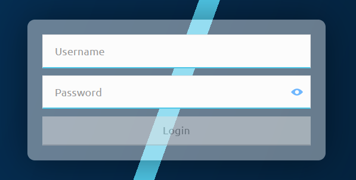

# Accéder au portail

Lorsque vous accédez au portail, vous êtes invité à vous connecter. Saisissez vos identifiants sur la page de connexion.

Le portail met en œuvre un contrôle d'accès basé sur les rôles, ce qui signifie que le rôle qui vous est attribué détermine l'éventail des fonctionnalités du portail auxquelles vous avez accès. Actuellement, les rôles suivants existent :

* `portaladmin` : a un accès complet à toutes les fonctionnalités du portail
* `portaluser` : a un accès limité aux fonctionnalités du portail

Le tableau suivant répertorie toutes les fonctionnalités disponibles, les chemins de navigation pour y accéder et les autorisations de rôles correspondantes.

<table>
<caption><strong>Fonctionnalités du portail et chemins de navigation</strong></caption>
<colgroup>
<col style="width: 30%" />
<col style="width: 30%" />
<col style="width: 20%" />
<col style="width: 20%" />
</colgroup>
<thead>
<tr class="header">
<th>Fonctionnalité</th>
<th>Chemin de navigation</th>
<th>portaladmin</th>
<th>portaluser</th>
</tr>
</thead>
<tbody>
<tr class="odd">
<td>
<a href="managing-windows.html">Afficher les détails de la fenêtre de règlement</a>
</td>
<td>
<strong>Settlement</strong> &gt; <strong>Settlement Windows</strong>
</td>
<td>
✓
</td>
<td>
✓
</td>
</tr>
<tr class="even">
<td>
<a href="settling.html#closing-a-settlement-window">Fermer des fenêtres de règlement</a>
</td>
<td>
<strong>Settlement</strong> &gt; <strong>Settlement Windows</strong>
</td>
<td>
✓
</td>
<td>
✓
</td>
</tr>
<tr class="even">
<td>
<a href="settling.html#settling-a-closed-settlement-window">Régler des fenêtres de règlement</a>
</td>
<td>
<strong>Settlement</strong> &gt; <strong>Settlement Windows</strong>
</td>
<td>
✓
</td>
<td>
✓
</td>
</tr>
<tr class="even">
<td>
<a href="settling.html#finalizing-a-settlement">Finaliser un règlement</a>
</td>
<td>
<strong>Settlement</strong> &gt; <strong>Settlement Windows</strong>
</td>
<td>
✓
</td>
<td>
✓
</td>
</tr>
<tr class="odd">
<td>
<a href="checking-settlement-details.html">Afficher les détails du règlement</a>
</td>
<td>
<strong>Settlement</strong> &gt; <strong>Settlements</strong>
</td>
<td>
✓
</td>
<td>
✓
</td>
</tr>
<tr class="odd">
<td>
<a href="monitoring-dfsp-financial-details.html">Afficher les détails financiers des DFSP</a>
</td>
<td>
<strong>Participants</strong> &gt; <strong>DFSP Financial Positions</strong>
</td>
<td>
✓
</td>
<td>
✓
</td>
</tr>
<tr class="even">
<td>
<a href="enabling-disabling-transactions.html">Désactiver et réactiver les transactions pour un DFSP</a>
</td>
<td>
<strong>Participants</strong> &gt; <strong>DFSP Financial Positions</strong>
</td>
<td>
✓
</td>
<td>
✓
</td>
</tr>
<tr class="odd">
<td>
<a href="recording-funds-in-out.html">Enregistrer les dépôts ou retraits sur les comptes de liquidité des DFSP</a>
</td>
<td>
<strong>Participants</strong> &gt; <strong>DFSP Financial Positions</strong>
</td>
<td>
✓
</td>
<td>
✓
</td>
</tr>
<tr class="even">
<td>
<a href="updating-ndc.html">Mettre à jour le Net Debit Cap d'un DFSP</a>
</td>
<td>
<strong>Participants</strong> &gt; <strong>DFSP Financial Positions</strong>
</td>
<td>
✓
</td>
<td>
x
</td>
</tr>
<tr class="odd">
<td>
<a href="searching-for-transfer-data.html">Rechercher des données de transfert</a>
</td>
<td>
<strong>Transfers</strong> &gt; <strong>Find Transfers</strong>
</td>
<td>
✓
</td>
<td>
✓
</td>
</tr>
</tbody>
</table>
