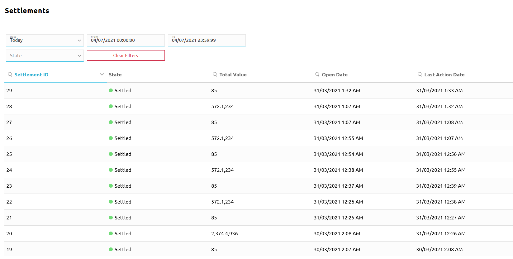
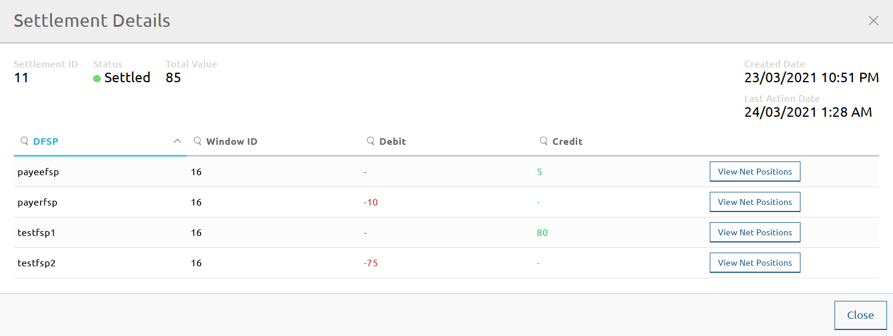

# Vérification des détails du règlement

La page **Settlement > Settlements** vous permet de consulter certains détails des règlements, tels que :

* l'identifiant du règlement
* l'état du règlement
* la valeur totale des transactions
* les identifiants des DFSP impliqués dans les transactions, ainsi que la Position de règlement net multilatérale associée pour la période choisie

La page **Settlements** fournit une liste de règlements que vous pouvez filtrer à l'aide de divers critères de recherche :

* **Date** : Fournit une liste déroulante de plages horaires. La valeur par défaut est **Today**. \
\
L'option **Clear** vous permet de supprimer tous les filtres de date déjà appliqués.
* **From** et **To** : Affiche l'heure de début et l'heure de fin de la plage horaire sélectionnée dans le champ **Date**. Lorsque **Date** est défini sur **Custom Range**, vous devez définir la date et l'heure vous-même dans les champs **From** et **To**.
* **State** : Fournit une liste déroulante des états de règlement.
    * **Pending Settlement** : Un nouveau règlement composé d'une ou plusieurs fenêtres de règlement a été créé. La Position de règlement net multilatérale due à/par chaque participant a été calculée.
    * **Ps Transfers Recorded** : Le Hub a marqué les transferts concernés comme `RECEIVED_PREPARE` dans ses enregistrements internes.
    * **Ps Transfers Reserved** : Le Hub a marqué les transferts concernés comme `RESERVED` dans ses enregistrements internes.
    * **Ps Transfers Committed** : Le Hub a marqué les transferts concernés comme `COMMITTED` dans ses enregistrements internes.
    * **Settling** : Le règlement est en cours.
    * **Settled** : Le règlement est terminé.
    * **Aborted** : Le règlement n'a pas pu être complété et doit être annulé.
* Bouton **Clear Filters** : Vous permet de supprimer tous les filtres que vous avez appliqués.

À mesure que vous appliquez des critères de recherche, la liste des résultats (règlements) est mise à jour en continu.

Les détails suivants sont affichés :

* **Settlement ID** : L'identifiant unique du règlement.
* **State** : Le statut du règlement.
* **Total Value** : La valeur totale des transactions au sein du lot de règlement.
* **Open Date** : La date et l'heure de création du règlement dans le Hub.
* **Last Action Date** : La date et l'heure de la dernière action effectuée sur le règlement dans le Hub (par exemple, des fonds ont été réservés, des fonds ont été validés).
* **Action** : Bouton **Finalize**. Vous permet de finaliser un règlement. Ce bouton n'est affiché que pour les règlements en attente (Pending Settlements). Pour plus de détails sur la finalisation d'un règlement, voir [Règlement](settling.md#finalizing-a-settlement).

Pour afficher les détails d'un règlement particulier, cliquez sur le règlement dans la liste des résultats. La fenêtre contextuelle **Settlement Details** s'affiche.

Les détails supplémentaires suivants sont affichés :

* **DFSP** : L'identifiant unique du DFSP.
* **Window ID** : L'identifiant unique de la fenêtre de règlement en cours de règlement.
* **Debit** : Montant de débit agrégé résultant des transferts auxquels le DFSP a participé.
* **Credit** : Montant de crédit agrégé résultant des transferts auxquels le DFSP a participé.

::: tip REMARQUE
Au moment de la rédaction, les informations que devrait afficher le clic sur le bouton **View Net Positions** ne sont pas disponibles. Elles seront ajoutées dans une future version du portail.
:::
