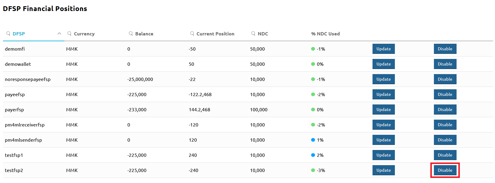
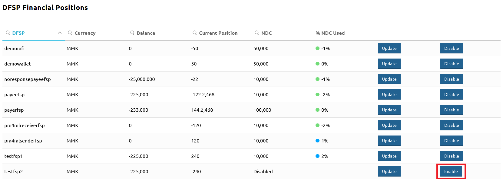

# Désactivation et réactivation des transactions pour un DFSP

Dans certains cas, il peut être nécessaire de rendre un DFSP inactif temporairement ou définitivement. Un exemple de scénario est lorsque vous observez un comportement hautement suspect et que la cause réelle nécessite une investigation, le risque de perte d'argent étant trop élevé.

La page **Participants** > **DFSP Financial Positions** fournit une option pour arrêter l'envoi et la réception de transferts pour un DFSP particulier en désactivant son registre de Position en un clic de bouton.

(Le Hub maintient un registre de Position pour chaque DFSP. Le registre de Position suit combien un DFSP doit ou combien lui est dû. Chaque fois qu'un transfert est traité, la Position dans le Hub est ajustée en temps réel.)

Pour désactiver les transactions pour un DFSP particulier, effectuez les étapes suivantes :

::: warning
La désactivation d'un DFSP arrêtera toutes les transactions entrantes et sortantes pour ce DFSP, assurez-vous donc d'appliquer cette option avec précaution. Une fois le risque écarté, n'oubliez pas de reprendre les services pour le DFSP.
:::

1. Allez sur la page **Participants** > **DFSP Financial Positions**.
1. Trouvez l'entrée du DFSP que vous souhaitez désactiver.
1. Cliquez sur le bouton **Disable**.

Pour reprendre les services pour le DFSP que vous avez précédemment désactivé, effectuez les étapes suivantes :

1. Allez sur la page **Participants** > **DFSP Financial Positions**.
1. Trouvez l'entrée du DFSP que vous souhaitez activer.
1. Cliquez sur le bouton **Enable**.

