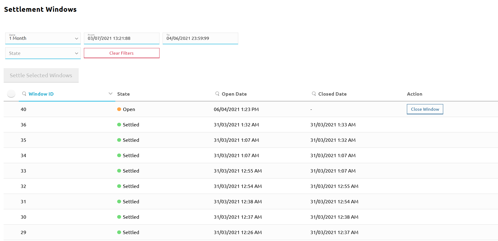

# Vérification des détails des fenêtres de règlement

La page **Settlement Windows** vous permet de :

* rechercher des fenêtres de règlement en fonction de plusieurs critères de recherche
* fermer une fenêtre de règlement ouverte
* régler une seule fenêtre ou régler plusieurs fenêtres à la fois

::: tip REMARQUE
N'oubliez pas que le règlement doit suivre cette procédure :

* Fermez la fenêtre de règlement que vous souhaitez régler.
* Réglez la ou les fenêtres fermées de votre choix. Cela crée un nouveau règlement.
* Envoyez les rapports de règlement aux DFSP et à la banque de règlement, puis obtenez une confirmation de la banque attestant qu'elle a transféré les fonds conformément au rapport.
* Finalisez le nouveau règlement créé à l'étape 2.

Étant donné que la fermeture d'une fenêtre et l'initiation du règlement en réglant les fenêtres sélectionnées font partie intégrante du processus de règlement, elles sont décrites dans une section dédiée au [règlement](settling.md).
:::

Une fenêtre de règlement est une période de temps entre deux règlements successifs. Elle a une heure de début et une heure de fin, et tous les transferts qui aboutissent (et atteignent l'état `"COMMITTED"`) pendant que la fenêtre de règlement est ouverte seront réglés en lot après la fermeture de la fenêtre de règlement.

Les transferts effectués dans la même fenêtre de règlement sont réglés en lot après la fin de la fenêtre de règlement.

Pour accéder à la page **Settlement Windows**, allez dans **Settlement** > **Settlement Windows**.

La page **Settlement Windows** fournit une liste de fenêtres de règlement que vous pouvez filtrer à l'aide de divers critères de recherche :

* **Date** : Fournit une liste déroulante de plages horaires. La valeur par défaut est **Today**. \
\
L'option **Clear** vous permet de supprimer tous les filtres de date déjà appliqués.
* **From** et **To** : Affiche l'heure de début et l'heure de fin de la plage horaire sélectionnée dans le champ **Date**. Lorsque **Date** est défini sur **Custom Range**, vous devez définir la date et l'heure vous-même dans les champs **From** et **To**.
* **State** : Fournit une liste déroulante des états des fenêtres de règlement :
    * **Open** : La fenêtre de règlement est ouverte, les transferts sont acceptés dans la fenêtre ouverte actuelle.
    * **Closed** : La fenêtre de règlement est fermée. Elle n'accepte plus de transferts supplémentaires et tous les nouveaux transferts sont affectés à une nouvelle fenêtre de règlement ouverte.
    * **Pending** : La fenêtre de règlement est fermée, mais elle doit encore être réglée. Une fenêtre ne peut être réglée qu'une fois que la banque de règlement a confirmé que tous les DFSP participants ayant effectué des transferts dans la fenêtre de règlement ont réglé leurs paiements.
    * **Settled** : La banque de règlement a confirmé que tous les DFSP concernés ont réglé leurs obligations mutuelles. Suite à la confirmation, l'Opérateur du Hub a réglé la fenêtre de règlement.
    * **Aborted** : La fenêtre de règlement faisait partie d'un règlement qui a été annulé. Il est possible d'ajouter la fenêtre annulée à un nouveau règlement.
    * **Clear** : Vous permet de supprimer tous les filtres d'état de fenêtre déjà appliqués.
* Bouton **Clear Filters** : Vous permet de supprimer tous les filtres que vous avez appliqués.

À mesure que vous appliquez des critères de recherche, la liste des résultats (fenêtres de règlement) est mise à jour en continu. La liste des résultats de recherche affiche les détails suivants :

* Sélecteur de fenêtre : Affiché uniquement pour les fenêtres de règlement **Pending**. Cliquer sur le sélecteur de fenêtre active le bouton **Settle Selected Windows**. Pour plus de détails sur le règlement d'une fenêtre de règlement, voir [Règlement](settling.md#settling-a-closed-settlement-window).
* **Window ID** : L'identifiant unique de la fenêtre de règlement.
* **State** : L'état de la fenêtre de règlement.
* **Opened Date** : La date et l'heure d'ouverture de la fenêtre de règlement.
* **Closed Date** : La date et l'heure de fermeture de la fenêtre de règlement.
* **Action** : Bouton **Close Window**. Vous permet de fermer une fenêtre de règlement. Ce bouton n'est affiché que pour les fenêtres de règlement **Open**, car seules les fenêtres ouvertes peuvent être fermées. Pour plus de détails sur la fermeture d'une fenêtre de règlement, voir [Règlement](settling.md#closing-a-settlement-window).
